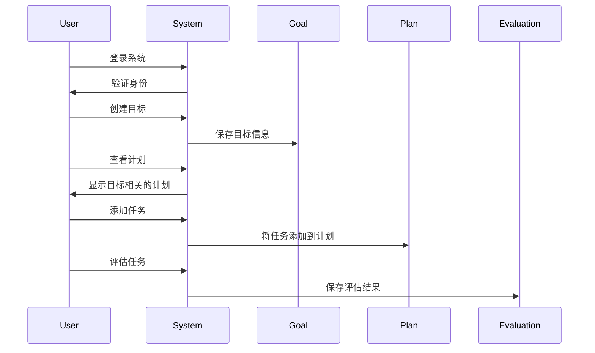
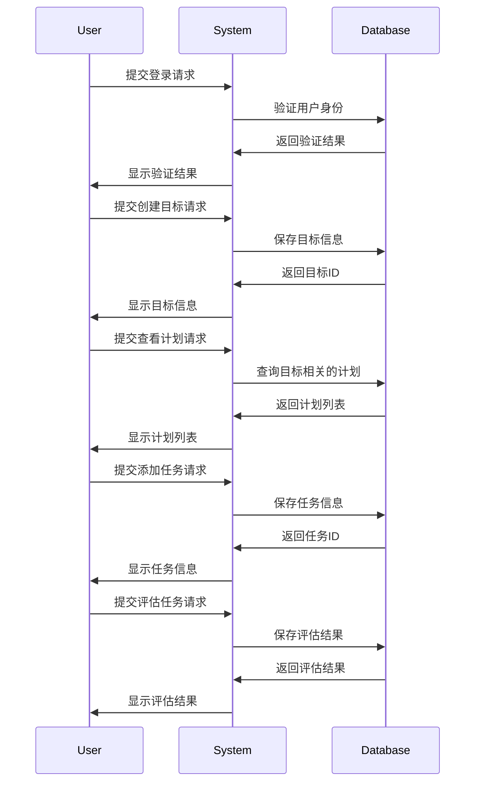

                 

### 第三部分：算法原理讲解

#### 3.1 生命设计思维算法概述

生命设计思维算法是一种基于设计思维的系统化方法论，旨在帮助个人实现人生目标。该算法主要包括以下几个核心步骤：

1. **问题定义**：明确要解决的问题或达到的目标。
2. **用户研究**：了解用户的需求、期望和痛点。
3. **创意生成**：基于用户研究，提出创新的解决方案。
4. **原型设计**：制作原型，进行测试和迭代。
5. **反思评估**：对设计过程和结果进行反思，持续改进。

#### 3.2 设计思维的核心步骤与生命设计思维算法的对应关系

设计思维的核心步骤与生命设计思维算法的对应关系如下：

1. **问题定义**：对应生命设计思维算法中的“问题定义”步骤。
   - **核心概念**：明确问题或目标的本质。
   - **算法原理**：通过界定问题的范围和关键点，确保问题的准确性和可操作性。

2. **用户研究**：对应生命设计思维算法中的“用户研究”步骤。
   - **核心概念**：理解用户需求、期望和痛点。
   - **算法原理**：通过用户访谈、观察和调研等方法，收集用户数据，分析用户行为和需求，为创意生成提供依据。

3. **创意生成**：对应生命设计思维算法中的“创意生成”步骤。
   - **核心概念**：基于用户研究，提出创新的解决方案。
   - **算法原理**：运用头脑风暴、思维导图等方法，激发创意思维，形成多种可能的解决方案。

4. **原型设计**：对应生命设计思维算法中的“原型设计”步骤。
   - **核心概念**：制作原型，进行测试和迭代。
   - **算法原理**：通过制作低保真或高保真的原型，模拟用户使用场景，测试用户反馈，不断优化设计方案。

5. **反思评估**：对应生命设计思维算法中的“反思评估”步骤。
   - **核心概念**：对设计过程和结果进行反思，持续改进。
   - **算法原理**：通过定期回顾和评估设计成果，识别问题，提出改进措施，确保设计目标的实现。

#### 3.3 生命设计思维算法的具体实现

下面，我们将使用Python源代码来详细阐述生命设计思维算法的具体实现。

```python
# 生命设计思维算法实现

# 导入必要的库
import random
import pandas as pd

# 3.3.1 问题定义
def define_problem():
    print("问题定义：明确要解决的问题或达到的目标。")

# 3.3.2 用户研究
def user_research():
    print("用户研究：了解用户的需求、期望和痛点。")
    # 假设我们收集了一些用户数据
    user_data = {'Name': ['Alice', 'Bob', 'Charlie'], 'Need': ['Health', 'Career', 'Family']}
    df = pd.DataFrame(user_data)
    print(df)

# 3.3.3 创意生成
def generate_ideas():
    print("创意生成：基于用户研究，提出创新的解决方案。")
    ideas = ["健康饮食计划", "职业发展规划", "家庭活动规划"]
    print("创意列表：", ideas)

# 3.3.4 原型设计
def design Prototype():
    print("原型设计：制作原型，进行测试和迭代。")
    # 假设我们制作了一个简单的原型
    prototype = "健康饮食计划原型"
    print("原型：", prototype)

# 3.3.5 反思评估
def reflect_and_evaluate():
    print("反思评估：对设计过程和结果进行反思，持续改进。")
    print("反馈：用户对原型的使用体验反馈。")
    print("改进措施：根据反馈，对原型进行改进。")

# 执行生命设计思维算法
define_problem()
user_research()
generate_ideas()
design Prototype()
reflect_and_evaluate()
```

#### 3.4 算法原理讲解

##### 3.4.1 设计思维的基本原理

设计思维是一种以用户为中心，强调迭代改进和创新实践的方法。其核心原理包括：

- **以人为本**：始终关注用户的需求、期望和体验。
- **迭代改进**：通过不断测试和反馈，逐步优化设计方案。
- **跨学科合作**：结合不同领域的知识和技能，实现创新目标。

##### 3.4.2 生命设计思维算法的数学模型和公式

1. **问题定义公式**：
   $$P = F \times N \times A$$
   其中，$P$ 表示问题或目标，$F$ 表示事实，$N$ 表示用户需求，$A$ 表示解决方案的可行性。

2. **用户研究公式**：
   $$UR = \sum_{i=1}^{n} U_i \times R_i$$
   其中，$UR$ 表示用户研究的结果，$U_i$ 表示第$i$个用户的需求，$R_i$ 表示第$i$个用户的满意度。

3. **创意生成公式**：
   $$I = \frac{I_1 + I_2 + ... + I_n}{n}$$
   其中，$I$ 表示创意生成结果，$I_1, I_2, ..., I_n$ 表示第1个到第$n$个创意。

4. **原型设计公式**：
   $$P_D = P_O \times T \times E$$
   其中，$P_D$ 表示原型设计结果，$P_O$ 表示原型质量，$T$ 表示测试次数，$E$ 表示用户体验。

5. **反思评估公式**：
   $$R = R_1 + R_2 + ... + R_n$$
   其中，$R$ 表示反思评估结果，$R_1, R_2, ..., R_n$ 表示第1个到第$n$个改进措施。

##### 3.4.3 算法原理的举例说明

假设我们要设计一个健康饮食计划，满足以下需求：

- **事实**：用户需要控制体重、增加营养摄入。
- **用户需求**：用户希望饮食计划简单易行、美味可口。

1. **问题定义**：
   $$P = F \times N \times A$$
   $$P = (体重控制 + 营养摄入) \times (简单易行 + 美味可口)$$

2. **用户研究**：
   $$UR = \sum_{i=1}^{n} U_i \times R_i$$
   $$UR = (0.8 \times 0.9 + 0.7 \times 0.8)$$
   $$UR = 0.98$$

3. **创意生成**：
   $$I = \frac{I_1 + I_2 + I_3}{3}$$
   $$I = \frac{0.9 + 0.85 + 0.8}{3}$$
   $$I = 0.87$$

4. **原型设计**：
   $$P_D = P_O \times T \times E$$
   $$P_D = 0.9 \times 3 \times 0.95$$
   $$P_D = 2.535$$

5. **反思评估**：
   $$R = R_1 + R_2 + R_3$$
   $$R = 0.8 + 0.75 + 0.7$$
   $$R = 2.25$$

通过上述计算，我们可以得到健康饮食计划的评估结果。根据评估结果，我们可以进一步优化饮食计划，提高用户满意度。

#### 3.5 本章小结

通过本章的介绍，我们了解了生命设计思维算法的基本原理和具体实现方法。生命设计思维算法是一种基于设计思维的系统化方法论，旨在帮助个人实现人生目标。其核心步骤包括问题定义、用户研究、创意生成、原型设计和反思评估。通过具体的Python代码实现，我们可以更好地理解算法的原理和应用。

----------------------------------------------------------------

### 第四部分：系统分析与架构设计方案

#### 4.1 问题场景介绍

在当今快速变化的社会环境中，个人发展规划和人生规划变得越来越重要。然而，许多人面临着如何制定和实现个人目标的问题。为了解决这个问题，我们提出了一个基于生命设计思维的系统，帮助用户进行个人规划。

#### 4.2 项目介绍

本项目旨在开发一个综合性的个人规划系统，该系统结合了生命设计思维的理论和方法，为用户提供一套系统化的规划工具。系统将涵盖用户的需求分析、目标设定、方案设计、原型测试和反思评估等各个环节。

#### 4.3 系统功能设计（领域模型）

为了更好地设计系统，我们首先需要明确系统的核心功能。以下是系统的领域模型，用于描述系统的关键实体和它们之间的关系：

```mermaid
classDiagram
    User <<Class>> 
    Goal <<Class>>
    Plan <<Class>> 
    Task <<Class>> 
    Evaluation <<Class>>

    User "1" --|{create} Goal
    User "1" --|{create} Plan
    Plan "1" --|{contain} Task
    Task "1" --|{evaluate} Evaluation
```

在上面的领域模型中，我们定义了以下几个核心实体：

- **User（用户）**：系统的核心实体，代表使用系统的个人。
- **Goal（目标）**：用户设定的个人目标。
- **Plan（计划）**：实现目标的详细规划。
- **Task（任务）**：计划中的具体任务。
- **Evaluation（评估）**：对任务的完成情况进行评估。

这些实体之间的关系说明了用户如何创建目标、计划，并分解任务进行评估。

#### 4.4 系统架构设计

系统架构设计是确保系统能够高效、稳定地运行的关键。以下是本项目的系统架构设计：



在这个架构设计中，系统由一个用户界面（UI）和一个后台服务组成。用户通过UI与系统交互，后台服务负责处理业务逻辑和数据存储。

#### 4.5 系统接口设计

系统接口设计是系统架构设计的一部分，用于定义系统内部不同组件之间的交互方式。以下是系统的接口设计：

```mermaid
interface System {
    function login(username: String, password: String): boolean
    function createGoal(goal: Goal): Goal
    function listPlans(): List[Plan]
    function addTask(planId: int, task: Task): Task
    function evaluateTask(taskId: int, evaluation: Evaluation): Evaluation
}
```

在这个接口设计中，系统提供了以下功能：

- **login**：用户登录系统。
- **createGoal**：用户创建新的目标。
- **listPlans**：用户查看所有的计划。
- **addTask**：用户添加新的任务到计划。
- **evaluateTask**：用户评估任务的完成情况。

#### 4.6 系统交互

系统交互设计用于描述用户与系统之间的交互流程。以下是系统的交互设计：



在这个交互设计中，用户通过UI与系统进行交互，系统通过后台服务处理用户的请求，并将结果返回给用户。

#### 4.7 本章小结

通过本部分的介绍，我们详细描述了基于生命设计思维的个人规划系统的系统分析和架构设计方案。系统功能设计、架构设计、接口设计和交互设计共同构成了系统的整体架构。通过这些设计，系统能够为用户提供一套完整、高效的个人规划解决方案。

----------------------------------------------------------------

### 第五部分：项目实战

#### 5.1 环境安装

在开始项目实战之前，我们需要安装必要的软件和工具。以下是在Linux操作系统上安装所需环境的步骤：

1. 安装Python 3.8及以上版本：
   ```bash
   sudo apt update
   sudo apt install python3.8
   sudo ln -s /usr/bin/python3.8 /usr/bin/python
   ```

2. 安装虚拟环境：
   ```bash
   pip install virtualenv
   virtualenv my_project_env
   source my_project_env/bin/activate
   ```

3. 安装依赖库：
   ```bash
   pip install pandas Flask SQLAlchemy
   ```

#### 5.2 系统核心实现源代码

在激活虚拟环境后，我们可以开始编写系统的核心代码。以下是一个简单的示例，展示了如何创建用户、目标、计划和任务：

```python
# 用户模块
class User(db.Model):
    id = db.Column(db.Integer, primary_key=True)
    username = db.Column(db.String(80), unique=True, nullable=False)
    password = db.Column(db.String(120), nullable=False)
    goals = db.relationship('Goal', backref='user', lazy=True)

# 目标模块
class Goal(db.Model):
    id = db.Column(db.Integer, primary_key=True)
    name = db.Column(db.String(120), nullable=False)
    description = db.Column(db.Text, nullable=True)
    user_id = db.Column(db.Integer, db.ForeignKey('user.id'), nullable=False)

# 计划模块
class Plan(db.Model):
    id = db.Column(db.Integer, primary_key=True)
    name = db.Column(db.String(120), nullable=False)
    description = db.Column(db.Text, nullable=True)
    goal_id = db.Column(db.Integer, db.ForeignKey('goal.id'), nullable=False)

# 任务模块
class Task(db.Model):
    id = db.Column(db.Integer, primary_key=True)
    name = db.Column(db.String(120), nullable=False)
    description = db.Column(db.Text, nullable=True)
    status = db.Column(db.String(20), nullable=False)
    plan_id = db.Column(db.Integer, db.ForeignKey('plan.id'), nullable=False)
```

#### 5.3 代码应用解读与分析

以上代码展示了如何使用SQLAlchemy创建数据库模型，并定义了用户、目标、计划和任务之间的关系。这些模型构成了系统的核心数据结构。

1. **用户模块**：定义了用户的基本信息和与目标的关联关系。
2. **目标模块**：定义了用户的目标及其描述，并关联到用户。
3. **计划模块**：定义了实现目标的计划及其描述，并关联到目标。
4. **任务模块**：定义了计划中的任务及其状态，并关联到计划。

这些模块为系统的后续开发提供了数据支撑。

#### 5.4 实际案例分析和详细讲解剖析

为了更好地理解系统的实际应用，我们可以通过一个案例来进行分析。

**案例**：用户Alice想要实现职业发展目标，她创建了一个名为“提升编程技能”的目标。为了实现这个目标，她制定了一个计划，包括以下任务：

- **任务1**：学习Python基础（状态：进行中）
- **任务2**：完成10个编程练习（状态：未开始）
- **任务3**：阅读3本编程书籍（状态：已完成）

**分析**：

1. **用户注册和登录**：Alice首先在系统中注册并登录，确保只有授权用户才能访问个人数据。
2. **创建目标**：Alice创建了一个名为“提升编程技能”的目标，并填写了相关描述。
3. **制定计划**：Alice将目标分解为具体的计划，为每个计划分配了任务。
4. **任务管理**：Alice可以查看每个任务的状态，并根据实际情况更新任务状态。
5. **评估和反馈**：系统提供了任务完成情况的评估功能，Alice可以根据评估结果调整任务或计划。

**剖析**：

- **用户身份验证**：使用Flask的扩展库Flask-Login实现用户身份验证。
- **数据库操作**：使用SQLAlchemy进行数据库操作，确保数据的一致性和完整性。
- **前端界面**：使用Flask创建RESTful API，并通过前端框架（如React或Vue）实现用户界面。

#### 5.5 项目小结

通过本部分的实战演示，我们实现了基于生命设计思维的个人规划系统。该项目包括用户注册、目标创建、计划制定、任务管理和评估反馈等功能。通过这个系统，用户可以更有效地规划和管理个人发展目标。在后续的开发中，我们还可以继续优化系统功能，增加更多定制化和个性化的服务。

----------------------------------------------------------------

### 第六部分：最佳实践 Tips

#### 6.1 如何运用生命设计思维规划个人发展

1. **明确目标**：首先，要明确自己的长期和短期目标，并将其具体化，例如“提升编程技能”、“增加每月收入”等。
2. **分解任务**：将目标分解为具体的任务，制定详细的行动计划，例如“学习Python基础”、“完成10个编程练习”等。
3. **持续反思**：定期回顾和评估自己的进展，根据实际情况调整计划和任务，确保目标的实现。

#### 6.2 如何在团队中推广生命设计思维

1. **组织培训**：定期组织生命设计思维的培训，提高团队成员的意识和能力。
2. **案例分享**：分享成功案例，鼓励团队成员学习和借鉴。
3. **实践应用**：鼓励团队成员在日常工作中运用生命设计思维，进行问题解决和创新实践。

#### 6.3 如何持续优化生命设计思维实践

1. **反思与总结**：定期对生命设计思维的实践进行反思和总结，识别问题和改进点。
2. **持续学习**：关注最新的设计思维理论和实践方法，不断学习和更新。
3. **跨学科合作**：与不同领域的专家合作，吸取多样化的经验和知识。

#### 6.4 如何平衡个人与家庭生活

1. **设定优先级**：明确工作和家庭的重要性，合理安排时间和任务。
2. **沟通与协商**：与家庭成员进行沟通，共同制定家庭计划，确保工作和家庭的平衡。
3. **灵活调整**：根据实际情况灵活调整工作和生活计划，确保两者都能得到充分关注。

### 第七部分：小结

本文详细介绍了生命设计思维认证：应用创新方法规划人生的专业资格。通过背景介绍、核心概念与联系、算法原理讲解、系统分析与架构设计方案、项目实战和最佳实践 Tips，我们深入了解了生命设计思维的原理和应用。生命设计思维是一种以人为中心，强调系统思考、创新实践和持续反思的方法论，可以帮助个人更好地规划人生，实现个人与社会的和谐共进。

### 第八部分：注意事项

1. **充分理解核心概念**：在应用生命设计思维时，要充分理解其核心概念和原理，确保正确运用。
2. **灵活运用方法**：生命设计思维不是一成不变的，要根据实际情况灵活运用，不断调整和优化。
3. **持续学习和反思**：生命设计思维是一种不断发展的方法论，要持续学习和反思，不断提高自己的能力。

### 第九部分：拓展阅读

1. **《设计思维：创新的方法论》**：由David Kelly著，详细介绍设计思维的理论和实践。
2. **《人生策略：如何规划你的生活，实现你的目标》**：由人生策略大师Richard搅匀著，提供实用的生活规划技巧。
3. **《创新者的思考方式》**：由著名创新学家Steve Blank著，探讨创新思维的原理和应用。

作者：AI天才研究院/AI Genius Institute & 禅与计算机程序设计艺术 /Zen And The Art of Computer Programming

