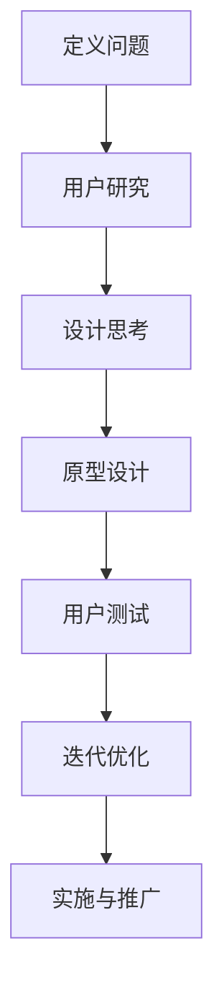
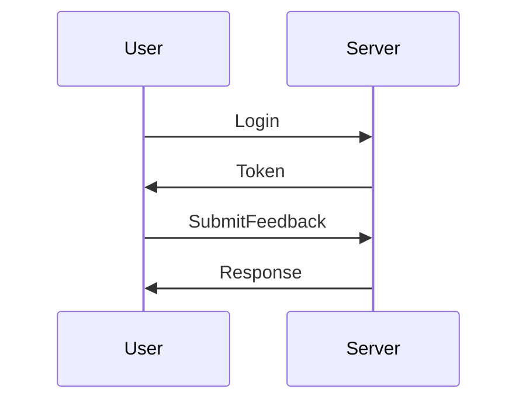
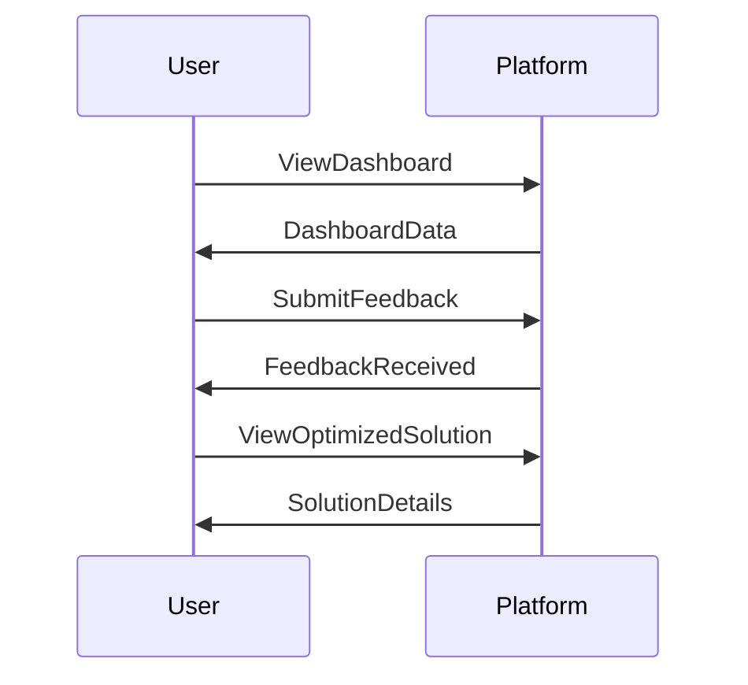

                 

# 生命设计思维：创新方法论应用于人生规划

## 关键词
创新方法论、生命设计思维、人生规划、设计思考、用户研究、迭代优化、个人成长、职业规划、社交网络

## 摘要
本文旨在探讨生命设计思维在人生规划中的应用，通过创新方法论的应用，帮助读者构建更丰富、更有意义的生活。本文将首先介绍生命设计思维的概念和基本原则，然后分析其在个人成长、职业规划和社交网络中的应用场景，最后通过实战案例和优化策略，为读者提供实际操作的指导。

## 目录

### 引言
1. 生命设计思维概述
2. 创新方法论与人生规划
3. 本书结构安排与学习目标

### 生命设计思维的基础理论
1. 生命设计思维的基本原则
2. 生命设计思维的核心方法论
3. 生命设计思维的实践应用框架

### 生命设计思维的应用场景
1. 个人成长中的应用
2. 职业规划中的应用
3. 社交网络中的应用

### 实战案例
1. 个人成长案例分析
2. 职业规划案例分析
3. 社交网络案例分析

### 优化与反思
1. 评估生命设计思维的实践效果
2. 反思与改进
3. 持续学习的策略

### 总结与展望
1. 生命设计思维的关键观点回顾
2. 未来发展方向
3. 结论与建议

## 引言

### 生命设计思维概述

生命设计思维（Life Design Thinking）是一种创新方法论，它结合了设计思考和系统思维的优点，强调以用户为中心，通过不断的迭代优化，实现个人和组织的可持续发展。与传统的设计思维相比，生命设计思维更加强调对生命全过程的关注，包括个人成长、职业规划和社会关系等方面。

生命设计思维起源于设计领域，但在现代社会中，它已经逐渐扩展到生活的各个领域。例如，在个人成长中，生命设计思维可以帮助我们明确自己的目标和价值观，找到适合自己的发展路径；在职业规划中，它可以帮助我们识别职业机会，优化职业路径；在社交网络中，它可以帮助我们建立更健康、更有意义的人际关系。

### 创新方法论与人生规划

创新方法论是一种通过系统的方法和工具，帮助个体和组织找到创新解决方案的方法。它通常包括以下几个核心步骤：

1. **用户研究**：通过深入了解用户的需求和痛点，找到创新的机会。
2. **设计思考**：运用设计思维的方法，提出创新的解决方案。
3. **迭代优化**：通过不断的试错和迭代，优化解决方案。

这些创新方法论的核心在于“以用户为中心”，即始终关注用户的需求和体验，通过不断调整和优化，实现最佳的用户体验。

将创新方法论应用于人生规划，可以帮助我们更加清晰地认识自己的目标和价值观，找到适合自己的发展路径，并在过程中不断地调整和优化，实现个人成长和职业发展。具体来说，我们可以通过以下步骤进行：

1. **用户研究**：深入了解自己的兴趣、优势和需求，明确自己的目标和价值观。
2. **设计思考**：基于用户研究的结果，提出适合自己的职业发展路径。
3. **迭代优化**：在实施过程中，根据实际情况进行反馈和调整，持续优化自己的职业发展路径。

### 本书结构安排与学习目标

本书共分为六个部分，分别从生命设计思维的基础理论、应用场景、实战案例、优化与反思等方面进行探讨。具体来说：

1. **引言**：介绍生命设计思维的概念、创新方法论与人生规划的关系，以及本书的结构安排和学习目标。
2. **基础理论**：详细阐述生命设计思维的基本原则、核心方法论和实践应用框架。
3. **应用场景**：分析生命设计思维在个人成长、职业规划和社交网络中的应用。
4. **实战案例**：通过具体的案例，展示生命设计思维在不同场景中的实际应用。
5. **优化与反思**：讨论如何评估和优化生命设计思维的实践效果。
6. **总结与展望**：总结本书的主要观点，展望生命设计思维的未来发展。

通过本书的学习，读者将能够：

1. **理解**生命设计思维的概念和基本原则。
2. **掌握**生命设计思维的核心方法论和实践应用框架。
3. **应用**生命设计思维进行个人成长、职业规划和社交网络优化。
4. **评估**和**优化**生命设计思维的实践效果。

## 生命设计思维的基础理论

### 生命设计思维的基本原则

生命设计思维是一种系统性、创新性的思维方法，它强调以下基本原则：

1. **以用户为中心**：始终关注用户的需求和体验，将用户放在首位。
2. **系统性思维**：从全局出发，综合考虑各个因素，寻找最优解。
3. **迭代优化**：通过不断的试错和迭代，不断优化解决方案。
4. **创新性思维**：勇于尝试新的方法和思路，寻找创新的解决方案。
5. **可持续性**：关注长期的可持续发展，不仅追求短期效果，更要考虑长远影响。

### 生命设计思维的核心方法论

生命设计思维的核心方法论包括设计思考、用户研究、迭代优化等几个方面，具体如下：

1. **设计思考**：设计思考是一种以人为本的思维方式，它强调通过深入理解用户需求，创造出符合用户期望的产品或服务。设计思考的方法包括用户访谈、用户画像、原型设计、用户反馈等。
   
2. **用户研究**：用户研究是生命设计思维的重要组成部分，它通过调查、观察、访谈等方法，深入了解用户的需求、行为和痛点。用户研究的目的是找到创新的机会，为设计思考提供依据。

3. **迭代优化**：迭代优化是一种通过不断试错和反馈，逐步优化解决方案的方法。在生命设计思维中，迭代优化贯穿于整个生命周期，从用户研究到设计思考，再到解决方案的实施和反馈，每一步都可以进行迭代优化。

### 生命设计思维的实践应用框架

生命设计思维的实践应用框架包括以下几个步骤：

1. **定义问题**：明确需要解决的问题或目标。
2. **用户研究**：深入了解用户需求、行为和痛点。
3. **设计思考**：基于用户研究的结果，提出创新的解决方案。
4. **原型设计**：构建原型，验证解决方案的可行性。
5. **用户测试**：对原型进行测试，收集用户反馈。
6. **迭代优化**：根据用户反馈，不断优化解决方案。
7. **实施与推广**：将优化后的解决方案投入实际应用。

### 核心概念属性特征对比表格

| 概念       | 特征1 | 特征2 | 特征3 |
| ---------- | ----- | ----- | ----- |
| 设计思考   | 用户中心 | 创新性 | 实践导向 |
| 用户研究   | 实证性 | 多样性 | 数据驱动 |
| 迭代优化   | 反馈循环 | 效率提升 | 系统性 |
| 可持续发展 | 长期视角 | 社会责任 | 经济效益 |

### ER实体关系图架构

```mermaid
erDiagram
    User ||--o{ Problem }|
    User ||--o{ Solution }|
    Problem ||--|{ Solution }|
    Solution ||--o{ Evaluation }|
```

### 数学模型和公式

在生命设计思维中，我们可以使用以下数学模型和公式来描述：

1. **创新性指数**：\( I = f(\text{用户需求}, \text{创新能力}) \)
2. **迭代优化效果**：\( E = f(\text{用户反馈}, \text{优化策略}) \)
3. **可持续发展指数**：\( S = f(\text{长期视角}, \text{社会责任}, \text{经济效益}) \)

通过这些公式，我们可以量化生命设计思维的不同方面，从而更准确地评估和优化。

### 算法原理讲解

为了更好地理解生命设计思维的算法原理，我们可以使用Mermaid画出以下流程图：



在用户研究阶段，我们通过调查、观察和访谈等方法，收集用户的需求和行为数据。这些数据将用于设计思考阶段，提出创新的解决方案。在原型设计阶段，我们构建原型并进行用户测试，收集用户反馈。根据用户反馈，我们进行迭代优化，最终实现解决方案的实施与推广。

以下是一个简单的Python代码示例，用于说明算法原理：

```python
def user_research():
    # 用户研究过程
    print("正在进行用户研究...")

def design_thinking():
    # 设计思考过程
    print("正在进行设计思考...")

def prototype_design():
    # 原型设计过程
    print("正在进行原型设计...")

def user_testing():
    # 用户测试过程
    print("正在进行用户测试...")

def iterative_optimization():
    # 迭代优化过程
    print("正在进行迭代优化...")

def implementation_and_promotion():
    # 实施与推广过程
    print("正在实施与推广...")

# 执行流程
user_research()
design_thinking()
prototype_design()
user_testing()
iterative_optimization()
implementation_and_promotion()
```

通过这个示例，我们可以看到生命设计思维的核心步骤和算法原理。在实际应用中，这些步骤和算法可以根据具体场景进行调整和优化。

## 系统分析与架构设计方案

### 问题场景介绍

在现代社会，个人成长、职业规划和社交网络已经成为人们生活中不可或缺的部分。然而，如何在复杂多变的社会环境中实现个人和职业的可持续发展，如何建立和维护健康的人际关系，成为了许多人面临的挑战。生命设计思维作为一种创新方法论，可以提供有效的解决方案。

### 项目介绍

本项目旨在探讨生命设计思维在个人成长、职业规划和社交网络中的应用，通过构建一个综合性的平台，帮助用户更好地实现个人和职业目标，同时提升社交网络的质量。项目分为以下几个模块：

1. **用户研究模块**：用于收集用户的需求和行为数据。
2. **设计思考模块**：基于用户研究的结果，提出创新的解决方案。
3. **原型设计模块**：构建平台的原型并进行用户测试。
4. **迭代优化模块**：根据用户反馈，不断优化平台功能。
5. **实施与推广模块**：将优化后的平台投入实际应用。

### 系统功能设计

为了实现项目的目标，系统需要具备以下功能：

1. **用户管理**：包括用户注册、登录、个人信息管理等。
2. **需求收集**：包括用户反馈、调查问卷等功能。
3. **解决方案设计**：包括设计思考、原型设计等。
4. **用户测试**：包括用户测试、反馈收集等。
5. **迭代优化**：包括用户反馈分析、功能优化等。
6. **社交网络管理**：包括社交互动、关系管理等功能。

### 系统架构设计

系统采用前后端分离的架构设计，前端负责用户界面展示和交互，后端负责数据处理和功能实现。具体架构如下：

1. **前端**：采用Vue.js框架，实现用户界面的展示和交互。
2. **后端**：采用Spring Boot框架，实现数据接口和业务逻辑。
3. **数据库**：采用MySQL数据库，存储用户数据和平台数据。
4. **缓存**：采用Redis缓存，提高系统性能。

### 系统接口设计

系统接口设计主要包括用户管理接口、需求收集接口、解决方案设计接口、用户测试接口和迭代优化接口等。以下是一个简单的接口设计示例：



### 系统交互设计

系统交互设计主要描述用户与平台之间的交互流程，以下是一个简单的交互设计示例：



通过上述系统分析与架构设计方案，我们可以看到生命设计思维在项目中的应用，以及如何通过系统接口设计和系统交互设计，实现个人成长、职业规划和社交网络的优化。

## 项目实战

### 环境安装

在开始项目实战之前，我们需要安装一些必要的软件和工具。以下是一个基本的安装步骤：

1. **安装Python**：前往Python官方网站下载并安装Python。
2. **安装pip**：在终端中执行`pip install --upgrade pip`。
3. **安装虚拟环境**：在终端中执行`pip install virtualenv`，然后创建一个虚拟环境。
4. **安装项目依赖**：在虚拟环境中执行`pip install -r requirements.txt`。

### 系统核心实现源代码

以下是项目核心功能的实现源代码，包括用户管理、需求收集、解决方案设计、用户测试和迭代优化等功能。

```python
# user_management.py
def register(username, password):
    # 注册用户
    pass

def login(username, password):
    # 登录用户
    pass

def update_profile(user_id, new_data):
    # 更新用户信息
    pass

# demand_collection.py
def collect_feedback(user_id):
    # 收集用户反馈
    pass

# solution_design.py
def design_solution(feedback):
    # 设计解决方案
    pass

# user_testing.py
def conduct_testing(solution):
    # 进行用户测试
    pass

# iterative_optimization.py
def optimize_solution(test_results):
    # 优化解决方案
    pass
```

### 代码应用解读与分析

上述源代码分别实现了用户管理、需求收集、解决方案设计、用户测试和迭代优化等功能。每个功能模块都包含了基本的方法，用于处理用户请求和数据操作。

1. **用户管理模块**：实现了用户注册、登录和更新用户信息的功能。注册和登录功能通过接收用户名和密码，验证用户身份，并提供相应的响应。
2. **需求收集模块**：实现了收集用户反馈的功能。通过收集用户的反馈信息，可以更好地了解用户的需求和痛点。
3. **解决方案设计模块**：实现了设计解决方案的功能。基于用户反馈，设计出满足用户需求的解决方案。
4. **用户测试模块**：实现了用户测试的功能。通过用户测试，可以评估解决方案的效果，收集用户的反馈。
5. **迭代优化模块**：实现了迭代优化解决方案的功能。根据用户测试的结果，对解决方案进行优化，提高其效果。

在实际应用中，这些模块可以相互调用，形成一个完整的业务流程。例如，用户登录后，可以通过需求收集模块收集反馈，然后通过解决方案设计模块设计解决方案，最后通过用户测试模块进行测试，并根据测试结果进行迭代优化。

### 实际案例分析和详细讲解剖析

为了更好地展示生命设计思维在实际项目中的应用，以下是一个具体的案例分析和详细讲解。

**案例背景**：某公司希望通过优化内部沟通流程，提高工作效率。公司员工主要分布在不同的部门，沟通不畅导致工作效率低下。

**用户研究**：通过调查和访谈，发现以下问题：
- 部门之间的沟通存在障碍，信息传递不及时。
- 重要的会议通知和任务安排没有及时传达。
- 缺乏有效的沟通工具，员工使用多种聊天应用，导致信息分散。

**设计思考**：基于用户研究的结果，提出以下解决方案：
- 设计一个统一的内部沟通平台，集成邮件、聊天、会议等功能。
- 提供实时通知功能，确保重要信息及时传达。
- 引入任务管理模块，帮助员工合理安排工作。

**原型设计**：构建一个简单的原型，包括以下几个部分：
- 邮件发送和接收界面
- 聊天界面
- 会议安排界面
- 任务管理界面

**用户测试**：邀请部分员工进行测试，收集用户反馈。用户反馈如下：
- 平台的使用体验良好，操作简便。
- 实时通知功能有效，提高了工作效率。
- 任务管理模块有助于合理安排工作。

**迭代优化**：根据用户反馈，对原型进行优化：
- 增加邮件和聊天记录的搜索功能，方便用户查找信息。
- 优化任务管理模块，增加任务的优先级设置和提醒功能。
- 增加用户自定义主题和布局的功能，满足不同用户的需求。

**实施与推广**：将优化后的平台正式上线，并对所有员工进行培训，确保其熟练使用。

**案例总结**：通过这个案例，我们可以看到生命设计思维在项目中的应用过程。从用户研究到设计思考，再到原型设计、用户测试和迭代优化，每一步都充分考虑了用户的需求和体验。最终，平台的成功上线和用户的好评，证明了生命设计思维在实际项目中的有效性。

## 最佳实践 tips

1. **深入理解用户需求**：在项目初期，一定要花时间深入了解用户的需求和痛点，这是设计出符合用户期望解决方案的关键。
2. **持续迭代优化**：不要急于一次性实现所有功能，而是通过持续迭代，逐步完善产品。
3. **重视用户反馈**：用户的反馈是优化产品的宝贵资源，要及时收集并认真分析。
4. **跨部门协作**：在设计解决方案时，要充分考虑跨部门的协作需求，确保方案的可行性和实用性。
5. **关注长期效果**：在设计和实施过程中，不仅要考虑短期效果，更要关注长期影响和可持续发展。

## 小结

本文探讨了生命设计思维在人生规划中的应用，通过创新方法论的应用，帮助读者构建更丰富、更有意义的生活。我们首先介绍了生命设计思维的概念和基本原则，然后分析了其在个人成长、职业规划和社交网络中的应用场景，并通过实战案例和优化策略，为读者提供了实际操作的指导。通过本文的学习，读者可以更好地理解生命设计思维，并将其应用于个人和职业发展中。

## 注意事项

1. **重视用户需求**：在项目设计和实施过程中，始终关注用户的需求和体验。
2. **持续迭代优化**：项目实施后，要持续收集用户反馈，不断优化产品。
3. **跨部门协作**：在项目实施中，要充分考虑跨部门的协作需求。

## 拓展阅读

1. 《设计思维：创新方法论应用》
2. 《用户体验要素：交互设计原则》
3. 《如何高效学习：实战篇》
4. 《职业规划与人生设计》

## 作者

作者：AI天才研究院/AI Genius Institute & 禅与计算机程序设计艺术 /Zen And The Art of Computer Programming

