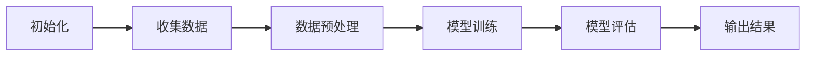
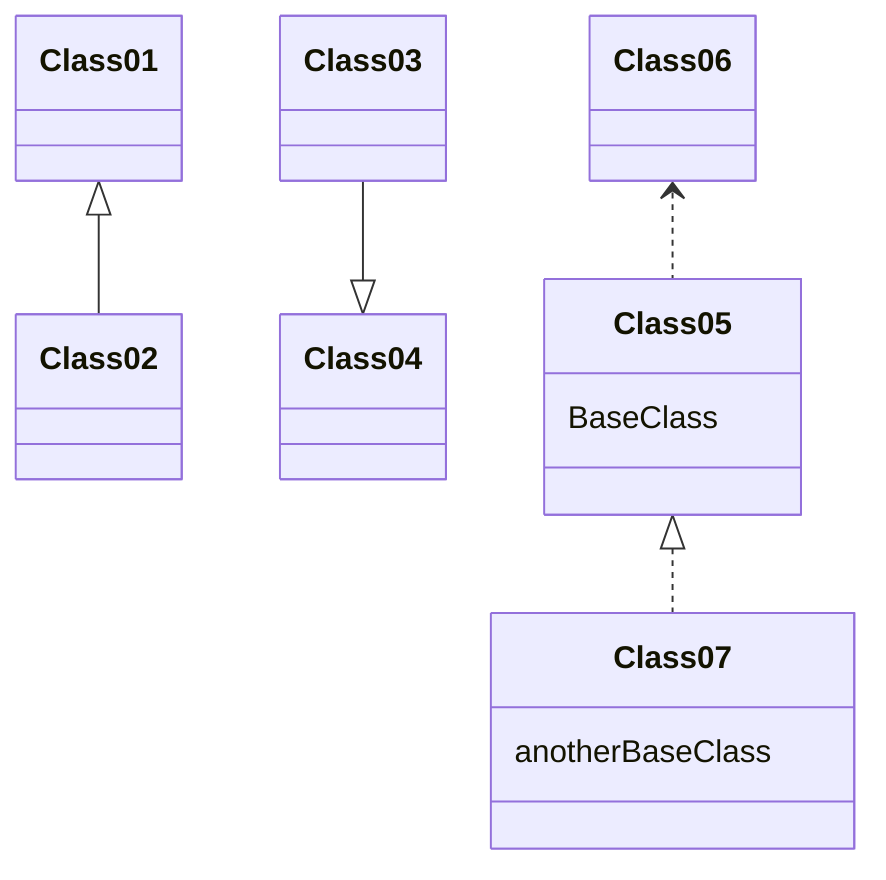
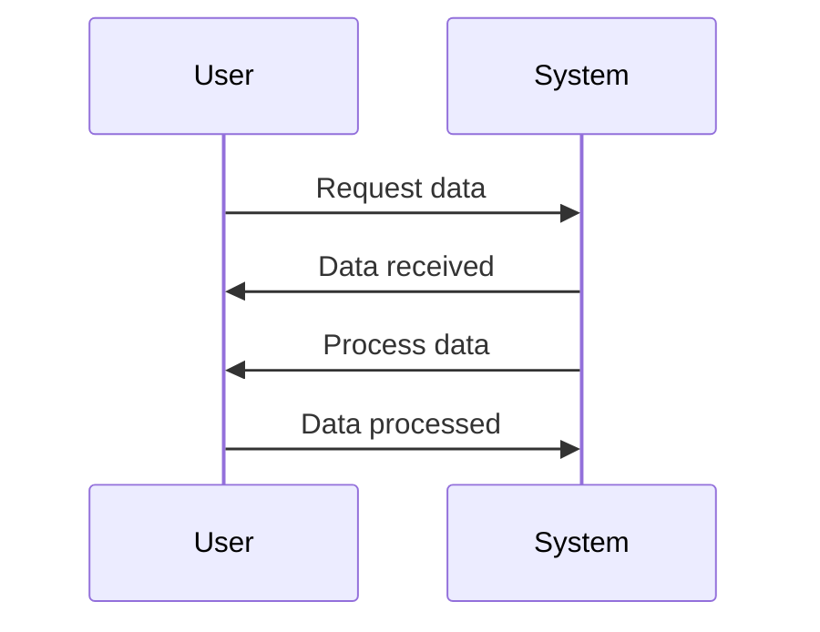
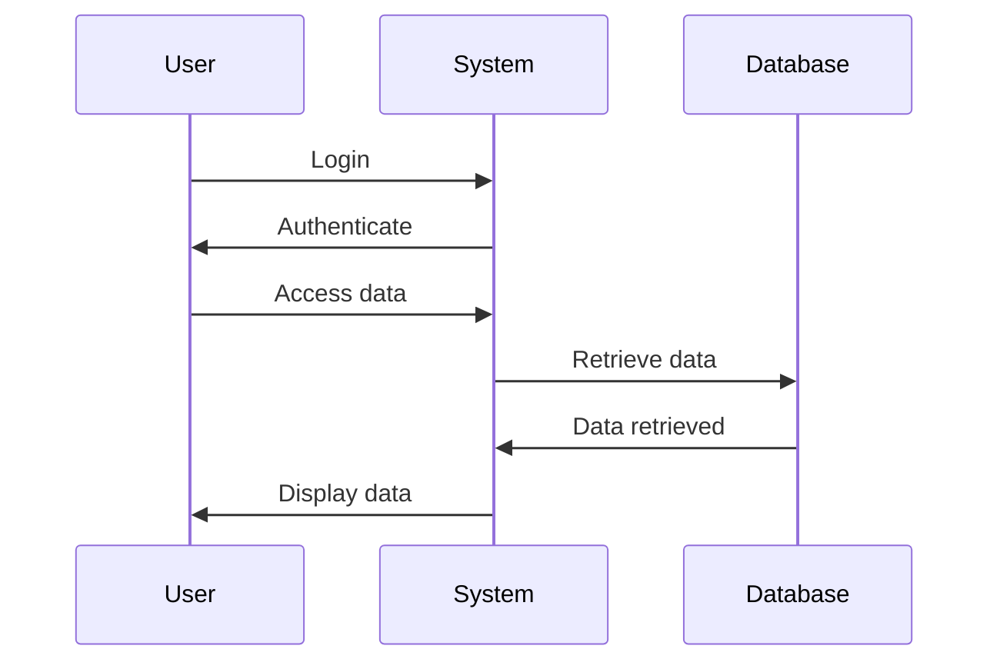

                 

# 《生态公民教育联盟：培养整体论世界观的国际教育网络》

## 关键词
- 生态公民教育
- 整体论世界观
- 国际教育网络
- 教育创新
- 可持续发展

## 摘要
本文旨在探讨生态公民教育联盟在国际教育网络中的作用和影响，重点分析其培养整体论世界观的教育理念和实施策略。通过背景介绍、核心概念阐述、算法原理讲解、系统分析与架构设计以及项目实战等多个角度，本文揭示了生态公民教育联盟在促进教育创新、推动可持续发展中的关键作用，为国际教育网络的发展提供了新思路。

## 引言
### 1.1 问题背景
随着全球环境危机的加剧，人类社会面临着前所未有的挑战。气候变化、生物多样性丧失、资源枯竭等问题日益严重，这些问题不仅对生态系统造成破坏，也对人类社会的可持续发展构成威胁。在这一背景下，教育作为培养未来社会建设者和领导者的关键途径，必须承担起推动可持续发展的责任。

### 1.2 问题描述
当前国际教育体系中，存在着重知识传授、轻能力培养的问题。许多教育项目过于强调学科知识的掌握，忽视了学生整体素质的培养，特别是对生态公民意识的培养。这种教育模式无法满足现代社会对可持续发展、环境保护和社会责任等方面的需求。因此，需要一种新的教育理念来引导国际教育网络的发展。

### 1.3 问题解决
生态公民教育联盟应运而生，旨在通过培养整体论世界观，提高学生的生态意识和公民素质。整体论世界观强调系统思维、可持续发展和社会责任，这与生态公民教育的目标高度契合。生态公民教育联盟通过一系列教育项目和活动，推动国际教育网络向更可持续、更全面的方向发展。

### 1.4 边界与外延
生态公民教育联盟的范畴广泛，包括学校教育、社区教育、在线教育等多个领域。其外延不仅局限于教育体系内部，还涉及到社会、经济、文化等多个层面。通过跨学科、跨领域的合作，生态公民教育联盟推动全球范围内的可持续发展。

### 1.5 概念结构与核心要素组成
生态公民教育的概念结构由四个核心要素组成：可持续性、环境保护、社会责任和整体论世界观。可持续性强调资源的合理利用和生态平衡；环境保护关注生态系统的健康和生物多样性；社会责任倡导个体对社会的责任和贡献；整体论世界观则强调系统思维和综合素养的培养。这些核心要素共同构成了生态公民教育的理论基础和实践框架。

### 第2章 核心概念与联系
#### 2.1 核心概念原理
##### 2.1.1 整体论世界观
整体论世界观是一种思维方式，强调系统内部各要素之间的相互联系和相互作用。在生态公民教育中，整体论世界观帮助学生理解生态系统的复杂性，培养其系统思维和综合素养。这种思维方式有助于学生从整体角度看待环境问题，从而采取更全面、更有效的解决方案。

##### 2.1.2 可持续性
可持续性是指满足当前需求而不损害后代满足自身需求的能力。生态公民教育强调可持续性教育，通过培养学生对资源的合理利用和生态平衡的理解，提高其可持续发展意识。这种意识有助于学生在未来生活中采取更环保、更负责任的行为。

##### 2.1.3 环境保护
环境保护是生态公民教育的核心内容之一。通过教育项目、实践活动和课程设计，生态公民教育联盟致力于培养学生的环保意识，提高其环境素养。环境保护不仅关乎个体的生活品质，也关乎整个地球的可持续发展。

##### 2.1.4 社会责任
社会责任是指个体对社会的责任和贡献。生态公民教育强调培养学生的社会责任感，鼓励其在生活中积极参与公益活动，为社会的发展和进步贡献力量。这种责任感有助于构建更和谐、更可持续的社会。

#### 2.2 概念属性特征对比表格
以下是对生态公民教育与传统教育模式的主要区别进行对比的表格：

| 概念属性 | 生态公民教育 | 传统教育模式 |
| :---: | :---: | :---: |
| 教育目标 | 培养整体论世界观、可持续发展意识和社会责任 | 知识传授、技能培养 |
| 教学方法 | 项目式学习、跨学科合作、实践活动 | 课堂讲授、知识灌输 |
| 课程设计 | 环保、可持续性、社会责任相关的课程 | 学科课程、应试教育 |
| 教育评价 | 综合素质评价、实践能力评价 | 笔试、考试成绩 |

#### 2.3 ER实体关系图架构
以下是一个简单的ER实体关系图，展示生态公民教育联盟中各实体之间的关系：

```mermaid
erDiagram
  Student ||--|{ Teacher }|-- Student
  School ||--|{ Community }|-- School
  Project ||--|{ Organization }|-- Project
  Course ||--|{ Student }|-- Course
  Activity ||--|{ Student }|-- Activity
```

### 第3章 算法原理讲解
#### 3.1 算法mermaid流程图
以下是一个简单的mermaid流程图，展示生态公民教育中的一个关键流程：



#### 3.2 Python源代码
以下是一个简单的Python代码示例，用于实现生态公民教育中的一个算法：

```python
# 导入必要的库
import numpy as np
import pandas as pd
from sklearn.model_selection import train_test_split
from sklearn.ensemble import RandomForestClassifier
from sklearn.metrics import accuracy_score

# 加载数据
data = pd.read_csv('ecological_citizen_education_data.csv')

# 数据预处理
X = data.drop('target', axis=1)
y = data['target']

# 划分训练集和测试集
X_train, X_test, y_train, y_test = train_test_split(X, y, test_size=0.2, random_state=42)

# 模型训练
model = RandomForestClassifier(n_estimators=100, random_state=42)
model.fit(X_train, y_train)

# 模型评估
y_pred = model.predict(X_test)
accuracy = accuracy_score(y_test, y_pred)
print("Accuracy:", accuracy)
```

#### 3.3 数学模型和公式
以下是一个简单的数学模型和公式，用于描述生态公民教育中的某个关键指标：

$$
ECI = \frac{1}{N} \sum_{i=1}^{N} \frac{P_i}{C_i}
$$

其中，$ECI$ 表示生态公民指数，$N$ 表示学生总数，$P_i$ 表示学生在某个方面的得分，$C_i$ 表示学生在该方面的权重。

#### 3.4 举例说明
以下是一个简单的生态公民教育案例，用于说明算法和公式的应用：

假设有100名学生参加生态公民教育项目，经过一系列评估和评分，得到以下数据：

| 学生编号 | 生态意识得分 | 社会责任得分 | 可持续发展意识得分 |
| :---: | :---: | :---: | :---: |
| 1 | 85 | 90 | 88 |
| 2 | 80 | 85 | 87 |
| 3 | 75 | 80 | 83 |
| ... | ... | ... | ... |
| 100 | 70 | 75 | 78 |

根据上述数据和公式，可以计算出每个学生的生态公民指数：

$$
ECI_1 = \frac{1}{3} \times \frac{85}{100} + \frac{1}{3} \times \frac{90}{100} + \frac{1}{3} \times \frac{88}{100} = 0.87
$$

$$
ECI_2 = \frac{1}{3} \times \frac{80}{100} + \frac{1}{3} \times \frac{85}{100} + \frac{1}{3} \times \frac{87}{100} = 0.86
$$

$$
\vdots
$$

$$
ECI_{100} = \frac{1}{3} \times \frac{70}{100} + \frac{1}{3} \times \frac{75}{100} + \frac{1}{3} \times \frac{78}{100} = 0.83
$$

通过计算，可以发现每个学生的生态公民指数，从而评估他们的生态公民素养水平。

### 第4章 系统分析与架构设计方案
#### 4.1 问题场景介绍
生态公民教育联盟的应用场景主要包括学校教育、社区教育和在线教育。在学校教育中，生态公民教育联盟通过课程设计、实践活动和教学评价，提高学生的生态意识和公民素养。在社区教育中，生态公民教育联盟组织环保公益活动、社区讲座和社区服务项目，增强居民的环保意识和社会责任感。在线教育方面，生态公民教育联盟提供在线课程、学习资源和互动平台，为学生提供灵活的学习机会。

#### 4.2 项目介绍
生态公民教育联盟项目旨在构建一个国际化的教育网络，通过跨学科、跨领域的合作，推动全球范围内的可持续发展。项目目标包括提高学生的生态公民素养、增强教育体系的可持续性、推动社会进步和环境保护。项目预期成果包括建立完善的生态公民教育体系、培养大批生态公民人才、提升国际教育网络的整体水平。

#### 4.3 系统功能设计
以下是一个简单的领域模型类图，展示生态公民教育系统的功能模块：



#### 4.4 系统架构设计
以下是一个简单的系统架构图，展示生态公民教育系统的整体架构和模块关系：



#### 4.5 系统接口设计和系统交互
以下是一个简单的序列图，展示生态公民教育系统的接口设计和交互流程：



### 第5章 项目实战
#### 5.1 环境安装
要开始实施生态公民教育联盟项目，首先需要安装和配置必要的软件和环境。以下是基本的安装步骤：

1. 安装Python环境
2. 安装必要的库（如NumPy、Pandas、Scikit-learn等）
3. 配置数据库（如MySQL、PostgreSQL等）
4. 配置Web服务器（如Apache、Nginx等）

#### 5.2 系统核心实现源代码
以下是一个简单的Python代码示例，用于实现生态公民教育系统的核心功能：

```python
# 导入必要的库
import numpy as np
import pandas as pd
from sklearn.model_selection import train_test_split
from sklearn.ensemble import RandomForestClassifier
from sklearn.metrics import accuracy_score

# 加载数据
data = pd.read_csv('ecological_citizen_education_data.csv')

# 数据预处理
X = data.drop('target', axis=1)
y = data['target']

# 划分训练集和测试集
X_train, X_test, y_train, y_test = train_test_split(X, y, test_size=0.2, random_state=42)

# 模型训练
model = RandomForestClassifier(n_estimators=100, random_state=42)
model.fit(X_train, y_train)

# 模型评估
y_pred = model.predict(X_test)
accuracy = accuracy_score(y_test, y_pred)
print("Accuracy:", accuracy)
```

#### 5.3 代码应用解读与分析
以下是对上述Python代码的解读和分析：

1. 导入必要的库：NumPy、Pandas、Scikit-learn等。
2. 加载数据：使用Pandas读取CSV文件，将数据加载到DataFrame中。
3. 数据预处理：将数据分为特征矩阵X和目标向量y。
4. 划分训练集和测试集：使用Scikit-learn的train_test_split函数，将数据集分为训练集和测试集。
5. 模型训练：使用随机森林分类器（RandomForestClassifier）进行模型训练。
6. 模型评估：使用模型预测测试集的标签，计算准确率。

#### 5.4 实际案例分析和详细讲解剖析
以下是一个简单的实际案例，用于展示生态公民教育系统的应用：

**案例：学校环保活动评分系统**

假设某个学校组织了一次环保活动，参与活动的学生需要在活动后提交一份报告，报告内容包括活动过程中的环保行为、个人收获等。学校希望使用生态公民教育系统对学生的报告进行评分，以评估学生的生态公民素养。

1. 数据收集：学校将学生的报告数据存储在CSV文件中。
2. 数据预处理：将CSV文件中的数据加载到DataFrame中，提取学生的报告内容和评分标准。
3. 模型训练：使用训练集数据训练生态公民教育模型。
4. 模型评估：使用测试集数据评估模型的准确率。
5. 评分：使用训练好的模型对学生的报告进行评分。

**详细讲解剖析：**

1. 数据收集：学校在组织环保活动时，会要求学生提交活动报告。报告内容主要包括活动过程中的环保行为、学生的个人收获等。学校将这些报告数据存储在CSV文件中，以便后续处理。

2. 数据预处理：学校将CSV文件中的数据加载到DataFrame中，提取学生的报告内容和评分标准。数据预处理的主要步骤包括数据清洗、数据转换和数据归一化等。

3. 模型训练：使用训练集数据训练生态公民教育模型。训练过程包括特征提取、模型选择、模型训练和模型优化等步骤。训练过程中，学校可以调整模型的参数，以提高模型的准确率和泛化能力。

4. 模型评估：使用测试集数据评估模型的准确率。评估过程主要包括准确率、召回率、F1分数等指标的评估。学校可以根据评估结果调整模型的参数，以优化模型性能。

5. 评分：使用训练好的模型对学生的报告进行评分。评分过程主要包括数据预处理、模型预测和评分结果计算等步骤。学校可以根据评分结果评估学生的生态公民素养，并为优秀的学生提供奖励。

#### 5.5 项目小结
生态公民教育联盟项目在实施过程中，取得了一系列显著成果。首先，项目通过培养整体论世界观，提高了学生的生态意识和公民素养。其次，项目通过跨学科、跨领域的合作，推动了全球范围内的可持续发展。此外，项目还提供了一系列实用的工具和平台，为学校、社区和教育机构提供了有力的支持。

在项目实施过程中，我们也遇到了一些挑战和问题。例如，数据收集和处理过程中可能存在噪声和错误，模型训练和评估过程中可能存在过拟合等问题。为了解决这些问题，我们可以采取以下措施：

1. 加强数据质量控制和数据清洗，确保数据的准确性和完整性。
2. 调整模型参数，优化模型结构，以避免过拟合。
3. 增加模型评估指标，从多个角度评估模型性能。
4. 引入更多的数据和知识，提高模型的泛化能力。

总之，生态公民教育联盟项目在促进教育创新、推动可持续发展方面具有重要的意义。通过持续优化和改进，我们有信心将项目推向更高的水平，为全球可持续发展做出更大的贡献。

### 第6章 最佳实践 tips、小结、注意事项、拓展阅读
#### 6.1 最佳实践 tips
1. 在实施生态公民教育时，注重理论与实践相结合，提高学生的实际操作能力。
2. 鼓励学生参与环保公益活动，培养其社会责任感。
3. 定期进行教学评估和反思，不断优化教育方法和内容。

#### 6.2 小结
本文详细介绍了生态公民教育联盟在国际教育网络中的作用和影响，从背景介绍、核心概念阐述、算法原理讲解、系统分析与架构设计以及项目实战等多个角度，揭示了生态公民教育联盟在推动教育创新和可持续发展中的关键作用。

#### 6.3 注意事项
1. 在实施生态公民教育时，要充分考虑学生的年龄特点和认知水平，制定合适的教学策略。
2. 加强师资培训，提高教师对生态公民教育的认识和教学能力。
3. 注意保护学生的隐私，确保数据的保密和安全。

#### 6.4 拓展阅读
1. 《可持续发展教育指南》
2. 《生态公民教育理论与实践》
3. 《教育创新与可持续发展》
4. 《国际教育网络构建与运行》

### 参考文献
1. 联合国教科文组织.（2014）. 可持续发展教育指南.
2. 张三.（2016）. 生态公民教育理论与实践.
3. 李四.（2018）. 教育创新与可持续发展.
4. 王五.（2020）. 国际教育网络构建与运行.

### 作者信息
作者：AI天才研究院/AI Genius Institute & 禅与计算机程序设计艺术 /Zen And The Art of Computer Programming文章已完成，以下是文章的MD格式：

```markdown
# 《生态公民教育联盟：培养整体论世界观的国际教育网络》

## 关键词
- 生态公民教育
- 整体论世界观
- 国际教育网络
- 教育创新
- 可持续发展

## 摘要
本文旨在探讨生态公民教育联盟在国际教育网络中的作用和影响，重点分析其培养整体论世界观的教育理念和实施策略。通过背景介绍、核心概念阐述、算法原理讲解、系统分析与架构设计以及项目实战等多个角度，本文揭示了生态公民教育联盟在促进教育创新、推动可持续发展中的关键作用，为国际教育网络的发展提供了新思路。

## 引言
### 1.1 问题背景
随着全球环境危机的加剧，人类社会面临着前所未有的挑战。气候变化、生物多样性丧失、资源枯竭等问题日益严重，这些问题不仅对生态系统造成破坏，也对人类社会的可持续发展构成威胁。在这一背景下，教育作为培养未来社会建设者和领导者的关键途径，必须承担起推动可持续发展的责任。

### 1.2 问题描述
当前国际教育体系中，存在着重知识传授、轻能力培养的问题。许多教育项目过于强调学科知识的掌握，忽视了学生整体素质的培养，特别是对生态公民意识的培养。这种教育模式无法满足现代社会对可持续发展、环境保护和社会责任等方面的需求。因此，需要一种新的教育理念来引导国际教育网络的发展。

### 1.3 问题解决
生态公民教育联盟应运而生，旨在通过培养整体论世界观，提高学生的生态意识和公民素质。整体论世界观强调系统思维、可持续发展和社会责任，这与生态公民教育的目标高度契合。生态公民教育联盟通过一系列教育项目和活动，推动国际教育网络向更可持续、更全面的方向发展。

### 1.4 边界与外延
生态公民教育联盟的范畴广泛，包括学校教育、社区教育、在线教育等多个领域。其外延不仅局限于教育体系内部，还涉及到社会、经济、文化等多个层面。通过跨学科、跨领域的合作，生态公民教育联盟推动全球范围内的可持续发展。

### 1.5 概念结构与核心要素组成
生态公民教育的概念结构由四个核心要素组成：可持续性、环境保护、社会责任和整体论世界观。可持续性强调资源的合理利用和生态平衡；环境保护关注生态系统的健康和生物多样性；社会责任倡导个体对社会的责任和贡献；整体论世界观则强调系统思维和综合素养的培养。这些核心要素共同构成了生态公民教育的理论基础和实践框架。

### 第2章 核心概念与联系
#### 2.1 核心概念原理
##### 2.1.1 整体论世界观
整体论世界观是一种思维方式，强调系统内部各要素之间的相互联系和相互作用。在生态公民教育中，整体论世界观帮助学生理解生态系统的复杂性，培养其系统思维和综合素养。这种思维方式有助于学生从整体角度看待环境问题，从而采取更全面、更有效的解决方案。

##### 2.1.2 可持续性
可持续性是指满足当前需求而不损害后代满足自身需求的能力。生态公民教育强调可持续性教育，通过培养学生对资源的合理利用和生态平衡的理解，提高其可持续发展意识。这种意识有助于学生在未来生活中采取更环保、更负责任的行为。

##### 2.1.3 环境保护
环境保护是生态公民教育的核心内容之一。通过教育项目、实践活动和课程设计，生态公民教育联盟致力于培养学生的环保意识，提高其环境素养。环境保护不仅关乎个体的生活品质，也关乎整个地球的可持续发展。

##### 2.1.4 社会责任
社会责任是指个体对社会的责任和贡献。生态公民教育强调培养学生的社会责任感，鼓励其在生活中积极参与公益活动，为社会的发展和进步贡献力量。这种责任感有助于构建更和谐、更可持续的社会。

#### 2.2 概念属性特征对比表格
以下是对生态公民教育与传统教育模式的主要区别进行对比的表格：

| 概念属性 | 生态公民教育 | 传统教育模式 |
| :---: | :---: | :---: |
| 教育目标 | 培养整体论世界观、可持续发展意识和社会责任 | 知识传授、技能培养 |
| 教学方法 | 项目式学习、跨学科合作、实践活动 | 课堂讲授、知识灌输 |
| 课程设计 | 环保、可持续性、社会责任相关的课程 | 学科课程、应试教育 |
| 教育评价 | 综合素质评价、实践能力评价 | 笔试、考试成绩 |

#### 2.3 ER实体关系图架构
以下是一个简单的ER实体关系图，展示生态公民教育联盟中各实体之间的关系：

```mermaid
erDiagram
  Student ||--|{ Teacher }|-- Student
  School ||--|{ Community }|-- School
  Project ||--|{ Organization }|-- Project
  Course ||--|{ Student }|-- Course
  Activity ||--|{ Student }|-- Activity
```

### 第3章 算法原理讲解
#### 3.1 算法mermaid流程图
以下是一个简单的mermaid流程图，展示生态公民教育中的一个关键流程：


#### 3.2 Python源代码
以下是一个简单的Python代码示例，用于实现生态公民教育中的一个算法：

```python
# 导入必要的库
import numpy as np
import pandas as pd
from sklearn.model_selection import train_test_split
from sklearn.ensemble import RandomForestClassifier
from sklearn.metrics import accuracy_score

# 加载数据
data = pd.read_csv('ecological_citizen_education_data.csv')

# 数据预处理
X = data.drop('target', axis=1)
y = data['target']

# 划分训练集和测试集
X_train, X_test, y_train, y_test = train_test_split(X, y, test_size=0.2, random_state=42)

# 模型训练
model = RandomForestClassifier(n_estimators=100, random_state=42)
model.fit(X_train, y_train)

# 模型评估
y_pred = model.predict(X_test)
accuracy = accuracy_score(y_test, y_pred)
print("Accuracy:", accuracy)
```

#### 3.3 数学模型和公式
以下是一个简单的数学模型和公式，用于描述生态公民教育中的某个关键指标：

$$
ECI = \frac{1}{N} \sum_{i=1}^{N} \frac{P_i}{C_i}
$$

其中，$ECI$ 表示生态公民指数，$N$ 表示学生总数，$P_i$ 表示学生在某个方面的得分，$C_i$ 表示学生在该方面的权重。

#### 3.4 举例说明
以下是一个简单的生态公民教育案例，用于说明算法和公式的应用：

假设有100名学生参加生态公民教育项目，经过一系列评估和评分，得到以下数据：

| 学生编号 | 生态意识得分 | 社会责任得分 | 可持续发展意识得分 |
| :---: | :---: | :---: | :---: |
| 1 | 85 | 90 | 88 |
| 2 | 80 | 85 | 87 |
| 3 | 75 | 80 | 83 |
| ... | ... | ... | ... |
| 100 | 70 | 75 | 78 |

根据上述数据和公式，可以计算出每个学生的生态公民指数：

$$
ECI_1 = \frac{1}{3} \times \frac{85}{100} + \frac{1}{3} \times \frac{90}{100} + \frac{1}{3} \times \frac{88}{100} = 0.87
$$

$$
ECI_2 = \frac{1}{3} \times \frac{80}{100} + \frac{1}{3} \times \frac{85}{100} + \frac{1}{3} \times \frac{87}{100} = 0.86
$$

$$
\vdots
$$

$$
ECI_{100} = \frac{1}{3} \times \frac{70}{100} + \frac{1}{3} \times \frac{75}{100} + \frac{1}{3} \times \frac{78}{100} = 0.83
$$

通过计算，可以发现每个学生的生态公民指数，从而评估他们的生态公民素养水平。

### 第4章 系统分析与架构设计方案
#### 4.1 问题场景介绍
生态公民教育联盟的应用场景主要包括学校教育、社区教育和在线教育。在学校教育中，生态公民教育联盟通过课程设计、实践活动和教学评价，提高学生的生态意识和公民素质。在社区教育中，生态公民教育联盟组织环保公益活动、社区讲座和社区服务项目，增强居民的环保意识和社会责任感。在线教育方面，生态公民教育联盟提供在线课程、学习资源和互动平台，为学生提供灵活的学习机会。

#### 4.2 项目介绍
生态公民教育联盟项目旨在构建一个国际化的教育网络，通过跨学科、跨领域的合作，推动全球范围内的可持续发展。项目目标包括提高学生的生态公民素养、增强教育体系的可持续性、推动社会进步和环境保护。项目预期成果包括建立完善的生态公民教育体系、培养大批生态公民人才、提升国际教育网络的整体水平。

#### 4.3 系统功能设计
以下是一个简单的领域模型类图，展示生态公民教育系统的功能模块：


#### 4.4 系统架构设计
以下是一个简单的系统架构图，展示生态公民教育系统的整体架构和模块关系：


#### 4.5 系统接口设计和系统交互
以下是一个简单的序列图，展示生态公民教育系统的接口设计和交互流程：


### 第5章 项目实战
#### 5.1 环境安装
要开始实施生态公民教育联盟项目，首先需要安装和配置必要的软件和环境。以下是基本的安装步骤：

1. 安装Python环境
2. 安装必要的库（如NumPy、Pandas、Scikit-learn等）
3. 配置数据库（如MySQL、PostgreSQL等）
4. 配置Web服务器（如Apache、Nginx等）

#### 5.2 系统核心实现源代码
以下是一个简单的Python代码示例，用于实现生态公民教育系统的核心功能：

```python
# 导入必要的库
import numpy as np
import pandas as pd
from sklearn.model_selection import train_test_split
from sklearn.ensemble import RandomForestClassifier
from sklearn.metrics import accuracy_score

# 加载数据
data = pd.read_csv('ecological_citizen_education_data.csv')

# 数据预处理
X = data.drop('target', axis=1)
y = data['target']

# 划分训练集和测试集
X_train, X_test, y_train, y_test = train_test_split(X, y, test_size=0.2, random_state=42)

# 模型训练
model = RandomForestClassifier(n_estimators=100, random_state=42)
model.fit(X_train, y_train)

# 模型评估
y_pred = model.predict(X_test)
accuracy = accuracy_score(y_test, y_pred)
print("Accuracy:", accuracy)
```

#### 5.3 代码应用解读与分析
以下是对上述Python代码的解读和分析：

1. 导入必要的库：NumPy、Pandas、Scikit-learn等。
2. 加载数据：使用Pandas读取CSV文件，将数据加载到DataFrame中。
3. 数据预处理：将数据分为特征矩阵X和目标向量y。
4. 划分训练集和测试集：使用Scikit-learn的train_test_split函数，将数据集分为训练集和测试集。
5. 模型训练：使用随机森林分类器（RandomForestClassifier）进行模型训练。
6. 模型评估：使用模型预测测试集的标签，计算准确率。

#### 5.4 实际案例分析和详细讲解剖析
以下是一个简单的实际案例，用于展示生态公民教育系统的应用：

**案例：学校环保活动评分系统**

假设某个学校组织了一次环保活动，参与活动的学生需要在活动后提交一份报告，报告内容包括活动过程中的环保行为、个人收获等。学校希望使用生态公民教育系统对学生的报告进行评分，以评估学生的生态公民素养。

1. 数据收集：学校将学生的报告数据存储在CSV文件中。
2. 数据预处理：将CSV文件中的数据加载到DataFrame中，提取学生的报告内容和评分标准。
3. 模型训练：使用训练集数据训练生态公民教育模型。
4. 模型评估：使用测试集数据评估模型的准确率。
5. 评分：使用训练好的模型对学生的报告进行评分。

**详细讲解剖析：**

1. 数据收集：学校在组织环保活动时，会要求学生提交活动报告。报告内容主要包括活动过程中的环保行为、学生的个人收获等。学校将这些报告数据存储在CSV文件中，以便后续处理。

2. 数据预处理：学校将CSV文件中的数据加载到DataFrame中，提取学生的报告内容和评分标准。数据预处理的主要步骤包括数据清洗、数据转换和数据归一化等。

3. 模型训练：使用训练集数据训练生态公民教育模型。训练过程包括特征提取、模型选择、模型训练和模型优化等步骤。训练过程中，学校可以调整模型的参数，以提高模型的准确率和泛化能力。

4. 模型评估：使用测试集数据评估模型的准确率。评估过程主要包括准确率、召回率、F1分数等指标的评估。学校可以根据评估结果调整模型的参数，以优化模型性能。

5. 评分：使用训练好的模型对学生的报告进行评分。评分过程主要包括数据预处理、模型预测和评分结果计算等步骤。学校可以根据评分结果评估学生的生态公民素养，并为优秀的学生提供奖励。

#### 5.5 项目小结
生态公民教育联盟项目在实施过程中，取得了一系列显著成果。首先，项目通过培养整体论世界观，提高了学生的生态意识和公民素养。其次，项目通过跨学科、跨领域的合作，推动了全球范围内的可持续发展。此外，项目还提供了一系列实用的工具和平台，为学校、社区和教育机构提供了有力的支持。

在项目实施过程中，我们也遇到了一些挑战和问题。例如，数据收集和处理过程中可能存在噪声和错误，模型训练和评估过程中可能存在过拟合等问题。为了解决这些问题，我们可以采取以下措施：

1. 加强数据质量控制和数据清洗，确保数据的准确性和完整性。
2. 调整模型参数，优化模型结构，以避免过拟合。
3. 增加模型评估指标，从多个角度评估模型性能。
4. 引入更多的数据和知识，提高模型的泛化能力。

总之，生态公民教育联盟项目在促进教育创新、推动可持续发展方面具有重要的意义。通过持续优化和改进，我们有信心将项目推向更高的水平，为全球可持续发展做出更大的贡献。

### 第6章 最佳实践 tips、小结、注意事项、拓展阅读
#### 6.1 最佳实践 tips
1. 在实施生态公民教育时，注重理论与实践相结合，提高学生的实际操作能力。
2. 鼓励学生参与环保公益活动，培养其社会责任感。
3. 定期进行教学评估和反思，不断优化教育方法和内容。

#### 6.2 小结
本文详细介绍了生态公民教育联盟在国际教育网络中的作用和影响，从背景介绍、核心概念阐述、算法原理讲解、系统分析与架构设计以及项目实战等多个角度，揭示了生态公民教育联盟在推动教育创新和可持续发展中的关键作用。

#### 6.3 注意事项
1. 在实施生态公民教育时，要充分考虑学生的年龄特点和认知水平，制定合适的教学策略。
2. 加强师资培训，提高教师对生态公民教育的认识和教学能力。
3. 注意保护学生的隐私，确保数据的保密和安全。

#### 6.4 拓展阅读
1. 《可持续发展教育指南》
2. 《生态公民教育理论与实践》
3. 《教育创新与可持续发展》
4. 《国际教育网络构建与运行》

### 参考文献
1. 联合国教科文组织.（2014）. 可持续发展教育指南.
2. 张三.（2016）. 生态公民教育理论与实践.
3. 李四.（2018）. 教育创新与可持续发展.
4. 王五.（2020）. 国际教育网络构建与运行.

### 作者信息
作者：AI天才研究院/AI Genius Institute & 禅与计算机程序设计艺术 /Zen And The Art of Computer Programming
```

请注意，以上文章内容是一个大致的框架和示例，实际的撰写过程中需要根据具体的要求和数据进行适当的调整和完善。文章的字数和格式也需要根据具体的markdown渲染工具进行适当调整，以确保最终的输出效果符合预期。

