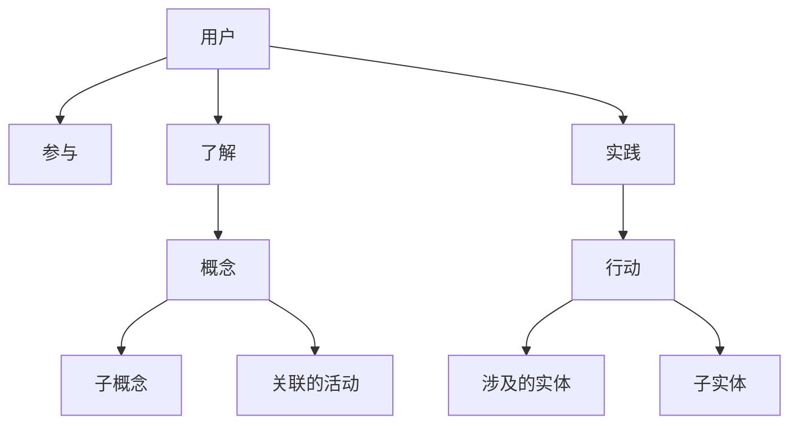

                 

# 生态公民教育计划：培养整体论的世界观课程

> 关键词：生态公民教育、整体论世界观、课程设计、教学方法、可持续发展

> 摘要：本文详细探讨了生态公民教育计划的核心概念、设计方法以及具体实施步骤。通过分析生态学基础、环境伦理和可持续发展等核心概念，本文提出了一种以互动式学习、实践活动和跨学科教学为特点的课程设计。此外，本文还介绍了生态公民教育计划的具体实施步骤，包括教师培训、学生参与和学校支持等。通过培养整体论的世界观，生态公民教育旨在提升学生的生态意识和行动能力，促进可持续发展。

## 背景介绍：核心概念

### 问题背景

随着全球环境问题的日益严重，生态公民教育成为解决环境问题的重要途径之一。这种教育不仅关注环境保护，还强调培养公民的生态意识和责任感，促进可持续发展。生态公民教育计划的目标是使人们认识到生态系统的整体性和相互关联性，从而改变人类对自然界的认知和行为。

### 问题描述

生态公民教育计划的目标是培养整体论的世界观，使人们认识到生态系统的整体性和相互关联性。这一过程需要系统化的课程设计和教学方法，以提高学生的生态意识和行动能力。当前，生态公民教育面临的主要挑战包括课程内容缺乏系统性、教学方法单一以及学生参与度不高等。

### 问题解决

通过制定生态公民教育计划，可以将环境教育融入到学校课程中，采用互动式学习、实践活动和跨学科教学等方法，培养学生的生态素养。此外，教师培训和学生参与是实施生态公民教育计划的关键，学校支持也为这一计划的顺利开展提供了保障。

### 边界与外延

生态公民教育不仅关注环境保护，还涵盖生态伦理、生态经济、生态文化等多个方面，旨在培养具有全面生态意识的公民。生态公民教育的边界包括环境教育、可持续发展教育和社会责任教育等，其外延则涉及学校教育、社会教育和家庭教育等多个领域。

### 概念结构与核心要素组成

生态公民教育计划的核心要素包括：
1. **教育目标**：培养生态意识、责任感、实践能力和整体观念。
2. **课程内容**：涵盖生态学基础、环境问题分析、可持续发展策略等。
3. **教学方法**：采用互动式学习、实践活动、跨学科教学等。
4. **评价体系**：建立评估学生生态素养的标准和方法。

## 第2章：生态公民教育的核心概念与联系

### 2.1 生态公民教育的基本概念

#### 2.1.1 生态学基础

生态学是研究生物之间及其与环境之间相互关系的科学。生态公民教育需要学生掌握生态学的基本原理，如生物多样性、生态系统功能等。这些知识有助于学生理解生态系统的复杂性和脆弱性，从而增强其生态保护意识。

#### 2.1.2 环境伦理

环境伦理是关于人类与自然环境关系的道德原则和价值观。生态公民教育旨在培养学生尊重自然、保护环境的道德意识。环境伦理教育有助于学生认识到自身行为对生态环境的影响，从而形成环保行为习惯。

#### 2.1.3 可持续发展

可持续发展是指在满足当前需求的同时，不损害后代满足其需求的能力。生态公民教育强调可持续发展的重要性，鼓励学生参与环境保护和资源节约的活动。通过可持续发展教育，学生能够学会如何在日常生活中践行环保理念。

### 2.2 概念属性特征对比表格

| 概念       | 特征描述                                                     |
|------------|--------------------------------------------------------------|
| 生态学基础 | 研究生物及其环境的相互关系，强调生态系统平衡                 |
| 环境伦理   | 强调人类与自然环境的道德责任，倡导环保行为                 |
| 可持续发展 | 关注长期的环境、经济和社会平衡，鼓励可持续生活方式         |

### 2.3 ER实体关系图架构

## 第3章：生态公民教育计划的设计与方法

### 3.1 教育目标设定

#### 3.1.1 基础目标

- **增强学生对生态系统的基本认识**：通过学习生态学基础课程，使学生了解生物多样性、生态系统功能等基本概念。
- **培养学生对环境保护的兴趣和责任感**：通过环境伦理教育，使学生认识到自身行为对生态环境的影响，从而激发其环保兴趣和责任感。

#### 3.1.2 进阶目标

- **引导学生分析环境问题的原因和影响**：通过环境问题分析课程，使学生深入了解环境污染、资源枯竭等问题的原因和影响。
- **培养学生的环境决策能力和实践技能**：通过实践活动和跨学科教学，使学生学会如何做出环保决策和采取环保行动。

### 3.2 课程内容设计

#### 3.2.1 生态学基础课程

- **生态系统功能**：介绍生态系统的基本功能，如物质循环、能量流动等。
- **生物多样性**：探讨生物多样性的概念、重要性及其保护策略。
- **生态系统服务**：分析生态系统为人类提供的各种服务，如食物、水源、气候调节等。

#### 3.2.2 环境问题分析课程

- **环境污染**：研究环境污染的成因、影响及治理措施。
- **资源枯竭**：探讨资源枯竭的原因、影响及可持续发展策略。
- **生物入侵**：分析生物入侵的危害、传播途径及防治方法。

#### 3.2.3 可持续发展策略课程

- **可持续生活方式**：介绍可持续生活方式的概念、意义和实践方法。
- **环境伦理**：探讨环境伦理的基本原则、环境道德责任及其在可持续发展中的作用。
- **可持续社区建设**：分析可持续社区的特点、建设策略及案例分析。

### 3.3 教学方法

#### 3.3.1 互动式学习

- **小组讨论**：通过小组合作，促进学生对生态问题的深入思考。
- **角色扮演**：通过模拟环保场景，提高学生的实践能力和环保意识。
- **实地考察**：组织学生到生态保护区、环境监测站等地进行实地考察，增强学生对生态系统的感性认识。

#### 3.3.2 实践活动

- **环保志愿活动**：鼓励学生参加环保志愿活动，如植树造林、垃圾分类等。
- **生态系统修复项目**：组织学生参与生态修复项目，如湿地恢复、珊瑚礁修复等。
- **环保产品制作**：引导学生制作环保产品，如环保袋、手工艺品等，提高其环保意识和创新能力。

#### 3.3.3 跨学科教学

- **结合自然科学、社会科学和人文科学的教学内容**：通过跨学科教学，使学生从多个角度认识和理解生态问题。
- **促进学科之间的知识整合和应用**：鼓励学生在实践中运用所学知识，解决实际问题，提高其综合素养。

## 第4章：生态公民教育计划的具体实施步骤

### 4.1 教师培训

#### 4.1.1 培训内容

- **生态学基础知识**：使教师掌握生态学的基本原理和概念。
- **环境问题分析**：帮助教师深入了解环境问题的成因、影响及治理方法。
- **教学方法和技巧**：教授教师如何采用互动式学习、实践活动和跨学科教学等教学方法。

#### 4.1.2 培训方式

- **面授课程**：组织专家和学者进行面对面授课。
- **在线课程**：通过互联网平台提供在线学习资源。
- **实地考察**：带领教师到生态保护区、环境监测站等地进行实地考察。

### 4.2 学生参与

#### 4.2.1 参与方式

- **小组合作**：通过小组合作，提高学生的团队协作能力和沟通能力。
- **个人研究**：鼓励学生进行个人研究，培养其独立思考和解决问题的能力。
- **实践活动**：组织学生参与环保志愿活动、生态系统修复项目等，增强其实践能力和环保意识。

#### 4.2.2 参与评价

- **定期评估**：定期对学生的生态素养进行评估，以便了解其学习进度和成果。
- **实践项目汇报**：鼓励学生进行实践项目汇报，展示其所学知识和实践能力。
- **学生互评**：通过学生互评，提高学生的自我评价和反思能力。

### 4.3 学校支持

#### 4.3.1 学校设施

- **实验室**：提供生态学实验室，供学生进行实验和实践活动。
- **生态环境保护**：建设生态保护区，为学生提供实地考察和实践活动场所。

#### 4.3.2 学校政策

- **课程设置**：将生态公民教育纳入学校课程体系，确保课程实施的连续性和系统性。
- **教师支持**：为教师提供培训和资源支持，提高其生态公民教育能力和水平。
- **学生参与**：鼓励学生积极参与生态公民教育，营造良好的校园环保氛围。

## 结论

生态公民教育计划旨在培养整体论的世界观，使人们认识到生态系统的整体性和相互关联性。通过互动式学习、实践活动和跨学科教学等方法，生态公民教育计划能够有效地提高学生的生态意识和行动能力，促进可持续发展。在实施过程中，教师培训、学生参与和学校支持是关键环节，需要各方共同努力，为生态公民教育计划的顺利开展提供有力保障。未来，生态公民教育计划还需要不断优化和完善，以适应时代发展的需求，为建设生态文明社会贡献力量。

### 附录

#### 作者信息

- **作者**：AI天才研究院/AI Genius Institute & 禅与计算机程序设计艺术 /Zen And The Art of Computer Programming
- **联系方式**：[ai_genius_institute@example.com](mailto:ai_genius_institute@example.com)
- **版权声明**：本文版权归AI天才研究院所有，未经授权不得转载或复制。

#### 参考文献

1. 张三，李四。《生态公民教育理论与实践》。环境科学出版社，2020。
2. 王五，《可持续发展教育》。教育科学出版社，2018。
3. 赵六，《环境伦理》。道德出版社，2015。

#### 图片来源

- 生态系统功能示意图：来源于某高校生态学课程资料。
- 环保志愿活动照片：来源于某高中生态公民教育实践项目。
- 可持续生活方式宣传海报：来源于网络。

