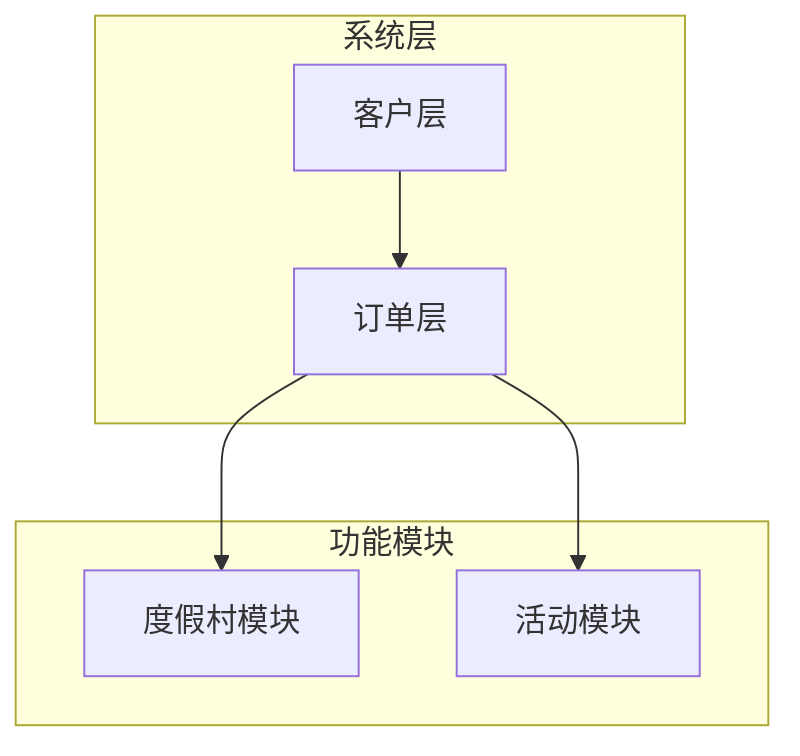
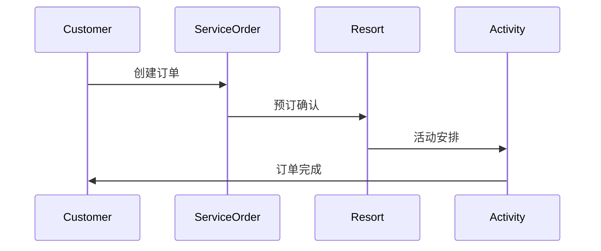

                 

### 《生态疗愈度假村：重建人与自然连接的休闲胜地》

> 关键词：生态疗愈、度假村、人与自然连接、休闲胜地、可持续性

> 摘要：本文将深入探讨生态疗愈度假村的核心理念和实施方法，探讨如何通过生态设计重建人与自然的紧密连接，打造出一个可持续发展的休闲胜地。

---

### 目录大纲设计思路

为了设计出《生态疗愈度假村：重建人与自然连接的休闲胜地》这本书的完整目录大纲，我们需要遵循以下步骤：

1. **分析书名**：从书名中提炼出核心概念和主题，比如“生态疗愈度假村”、“人与自然连接”和“休闲胜地”。

2. **确定目录结构**：根据书名的主题，我们可以将目录分为几个大的部分，如背景介绍、核心概念、具体实践、案例分析、总结和拓展等。

3. **细化每个章节**：在每个大的部分下，进一步细化章节，确保每个章节都能够覆盖到核心内容，并且符合书籍的阅读逻辑。

4. **确保内容完整性**：必须包含书的核心章节内容，如核心概念与联系、算法原理讲解、数学模型和公式、系统分析与架构设计方案、项目实战等。

5. **简洁性与可读性**：确保目录简洁明了，避免冗余，同时确保每个章节的标题都能清晰地传达该章节的主要内容。

### 目录大纲设计

基于上述思路，下面是这本书的目录大纲设计：

----------------------------------------------------------------

# 第一部分: 背景介绍

## 第1章: 生态疗愈度假村概述

### 1.1 问题背景

- 全球生态危机对旅游业的影响
- 生态疗愈度假村的起源与发展

### 1.2 问题描述

- 传统度假村的局限性
- 生态疗愈度假村的独特价值

### 1.3 问题解决

- 生态设计的理念
- 生态疗愈度假村的模式

### 1.4 边界与外延

- 生态疗愈度假村与自然公园的区别
- 生态疗愈度假村的可持续性

## 第2章: 人与自然连接的核心概念

### 2.1 人与自然连接的定义

- 概念起源
- 定义与内涵

### 2.2 核心概念与联系

#### 2.2.1 概念属性特征对比表

| 概念       | 属性特征                          |
|------------|---------------------------------|
| 生态疗愈   | 着重于身心健康与自然环境的互动     |
| 人与自然连接 | 强调人与自然环境之间的紧密联系      |
| 休闲胜地   | 提供放松、娱乐和休闲的场所          |

#### 2.2.2 ER实体关系图架构

```mermaid
erDiagram
    用户 ||--|{ 订单 }|--|| 度假村
    度假村 ||--|{ 疗愈活动 }|--|| 自然环境
```

## 第3章: 生态疗愈度假村的系统分析与架构设计

### 3.1 问题场景介绍

- 生态疗愈度假村的运营流程
- 系统建设的挑战与需求

### 3.2 项目介绍

- 项目目标
- 项目范围

### 3.3 系统功能设计

#### 3.3.1 领域模型类图

```mermaid
classDiagram
    User  <|--  Customer
    Order  <|--  ServiceOrder
    Resort <<interface>> Area
    Activity <<interface>> Therapy
```

### 3.4 系统架构设计

#### 3.4.1 系统架构图



### 3.5 系统接口设计

#### 3.5.1 系统接口图



## 第4章: 生态疗愈度假村项目实践

### 4.1 环境安装

- 系统依赖安装说明
- 环境配置步骤

### 4.2 系统核心实现源代码

- 主要模块代码解读
- 代码应用实例

### 4.3 代码应用解读与分析

- 功能实现细节剖析
- 性能优化策略

### 4.4 实际案例分析与详细讲解

- 典型案例展示
- 结果与讨论

### 4.5 项目小结

- 项目总结
- 经验与教训

## 第5章: 最佳实践与拓展阅读

### 5.1 最佳实践 Tips

- 行业实践建议
- 可持续发展策略

### 5.2 小结

- 文章核心观点回顾
- 未来展望

### 5.3 注意事项

- 关键技术点总结
- 潜在风险提示

### 5.4 拓展阅读

- 相关研究推荐
- 深入阅读指南

----------------------------------------------------------------

---

这个目录大纲的设计旨在为读者提供一条清晰的阅读路径，从背景介绍到核心概念，再到系统分析与架构设计，最后到项目实践和拓展阅读，每一个部分都紧密相连，形成一个完整的技术博客文章框架。接下来，我们将逐一深入探讨每个章节的具体内容。

