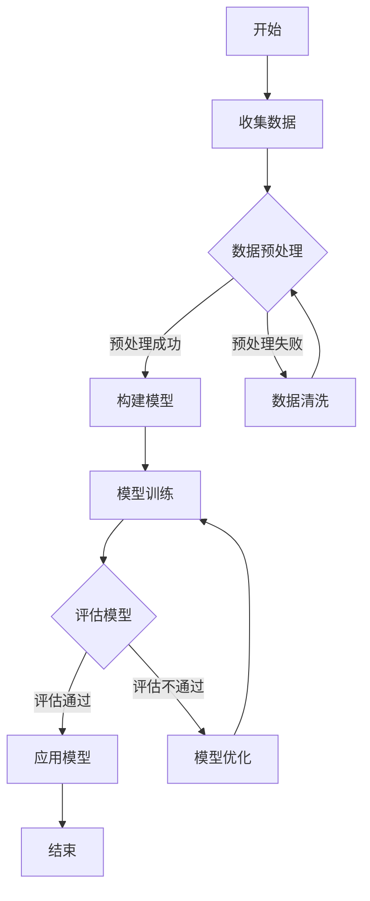

                 

# 生态系统思维训练：将整体论应用于日常决策的课程

> 关键词：生态系统思维、整体论、环境保护、企业管理、社会治理、个人生活

> 摘要：本文将探讨生态系统思维的重要性及其在各个领域中的应用，旨在引导读者理解并掌握这一思维方式，提升决策质量和生活品质。通过分析生态系统思维与传统思维的区别，本文将逐步揭示其在环境保护、企业管理和社会治理中的具体实践，并分享跨领域应用的成功案例。最后，本文将讨论生态系统思维在个人生活中的应用，帮助读者将其融入日常生活，实现整体性的提升。

## 第一部分：生态系统思维导论

### 第1章：理解生态系统思维

#### 1.1 生态系统思维的概念

**生态系统的定义**：

生态系统是指在一定地域内，生物与环境通过物质循环和能量流动相互作用而形成的统一整体。它包括生物部分（生产者、消费者、分解者）和非生物部分（阳光、水、土壤等）。

**整体论的核心理念**：

整体论认为，系统的各个组成部分不是独立存在的，而是相互依存、相互作用、相互影响的。整体的功能和特性不能仅仅通过分析各个部分来理解，而是需要从整体的角度进行思考。

**生态系统思维与传统思维的对比**：

传统思维往往注重局部优化和短期利益，而生态系统思维则强调整体优化和长期可持续。传统思维倾向于线性思考，而生态系统思维则强调复杂性和非线性。

#### 1.2 生态系统思维的应用场景

**环境保护与可持续发展**：

在环境保护方面，生态系统思维可以帮助我们理解环境问题不仅仅是局部的问题，而是涉及到整个生态系统。通过整体论的视角，我们可以找到更有效的环境保护策略。

**企业管理与发展**：

在企业层面，生态系统思维可以帮助企业理解其与外部环境的关系，以及内部各个部门之间的相互作用。这有助于企业制定更科学的发展战略和创新策略。

**社会治理与社区建设**：

在社会治理方面，生态系统思维可以促进政府、社区、企业和公众之间的合作，实现社会治理的整体优化。在社区建设方面，生态系统思维可以帮助我们构建更加和谐、可持续的社区环境。

#### 1.3 生态系统思维的益处

**提高决策质量**：

生态系统思维可以让我们从整体的角度看待问题，避免片面和短视的决策。

**增强创新思维**：

生态系统思维鼓励我们打破传统的思维定式，从全新的角度看待问题，从而激发创新思维。

**促进人与自然的和谐共处**：

生态系统思维可以帮助我们理解人类与自然的关系，从而采取更加可持续的生活方式和生产方式。

#### 1.4 如何培养生态系统思维

**观察与体验自然**：

通过亲身体验自然，我们可以更好地理解生态系统思维的核心理念。

**学习相关理论与案例**：

通过学习相关理论和实际案例，我们可以深入了解生态系统思维的具体应用。

**实践与应用**：

将生态系统思维应用于实际生活和工作中，通过实践来提升我们的思维方式。

#### 1.5 本章小结

本章我们介绍了生态系统思维的概念、应用场景、益处以及培养方法。通过理解生态系统思维，我们可以更好地理解整体论，并在各个领域中进行更有效的决策和行动。

----------------------------------------------------------------

## 第二部分：生态系统思维实践指南

### 第2章：生态系统思维在环境保护中的应用

#### 2.1 环境问题与生态系统思维

**全球变暖的挑战**：

全球变暖是当前环境问题中的核心挑战，它涉及到整个地球的生态系统。生态系统思维可以帮助我们理解全球变暖的复杂性和非线性。

**生物多样性的威胁**：

生物多样性是地球生态系统的基石，然而，人类活动对生物多样性的威胁日益严重。生态系统思维可以帮助我们找到更有效的生物多样性保护策略。

**整体论视角下的环境保护**：

从整体论的视角来看，环境保护不仅仅是保护某个具体的物种或环境，而是要考虑整个生态系统的平衡和稳定。

#### 2.2 生态系统思维在环境保护中的具体实践

**可持续发展计划**：

可持续发展计划是一种整体性的环境保护策略，它强调在满足当前需求的同时，不损害子孙后代满足其需求的能力。生态系统思维可以帮助我们制定更有效的可持续发展计划。

**社区参与与生态教育**：

社区参与和生态教育是环境保护的重要组成部分。生态系统思维可以帮助我们更好地理解社区和生态教育在环境保护中的作用。

**企业环保策略**：

企业作为环境保护的重要参与者，其环保策略的制定和执行至关重要。生态系统思维可以帮助企业从整体的角度制定和执行更有效的环保策略。

#### 2.3 成功案例研究

**生态农业的典范**：

生态农业是一种以生态系统思维为指导的农业生产方式，它强调生态平衡和可持续性。一些成功的生态农业案例展示了生态系统思维在环境保护中的实际应用。

**清洁能源转型**：

清洁能源转型是全球应对气候变化的重要措施。一些国家的成功案例展示了生态系统思维在清洁能源转型中的作用。

**城市生态系统恢复**：

城市生态系统恢复是一个复杂而重要的任务。一些成功的城市生态系统恢复案例展示了生态系统思维在环境保护中的应用。

#### 2.4 本章小结

本章我们详细介绍了生态系统思维在环境保护中的应用。通过理解生态系统思维，我们可以更好地应对环境问题，实现可持续发展的目标。

----------------------------------------------------------------

### 第3章：生态系统思维在企业管理中的应用

#### 3.1 企业的生态系统视角

**企业生态系统的概念**：

企业生态系统是指企业在一定的社会和经济环境中，通过供应链、合作伙伴、客户等关系形成的一个复杂系统。它包括企业内部的各种要素和外部环境。

**企业内部生态系统分析**：

企业内部生态系统分析是指对企业内部的各种要素和关系进行分析，包括组织结构、企业文化、人力资源、技术能力等。

**企业外部生态系统分析**：

企业外部生态系统分析是指对企业外部的各种环境因素进行分析，包括市场、政策、竞争、客户需求等。

#### 3.2 生态系统思维在企业管理中的实践

**企业战略规划**：

生态系统思维可以帮助企业从整体的角度制定和实施战略规划，确保企业长期可持续发展。

**企业创新管理**：

生态系统思维鼓励企业打破传统的创新模式，从整体的角度进行创新，从而推动企业的持续创新和发展。

**企业社会责任与可持续发展**：

生态系统思维强调企业在追求经济利益的同时，要承担社会责任，实现可持续发展。

#### 3.3 成功企业案例

**生态友好型企业发展**：

一些企业通过生态系统思维实现了生态友好型发展，例如，通过绿色制造、环保产品开发等手段，实现企业的可持续发展。

**整体性管理实践**：

一些企业通过整体性管理实践，实现了企业的整体优化。例如，通过整合内部资源、优化供应链、提升客户体验等手段，提升企业的整体绩效。

**供应链生态系统管理**：

供应链生态系统管理是企业生态系统管理的重要组成部分。一些企业通过生态系统思维优化供应链管理，提升供应链的效率和可持续性。

#### 3.4 本章小结

本章我们详细介绍了生态系统思维在企业管理中的应用。通过理解生态系统思维，企业可以更好地制定战略、推动创新、实现可持续发展。

----------------------------------------------------------------

### 第4章：生态系统思维在社会治理中的应用

#### 4.1 社会治理的生态系统思维

**社会治理的概念**：

社会治理是指政府、社会组织、企业和公众通过合作和协商，共同解决社会问题，实现社会稳定和发展的过程。

**整体论视角下的社会治理**：

从整体论的视角来看，社会治理不仅仅是政府的责任，而是涉及到整个社会的各种力量。通过生态系统思维，我们可以更好地理解社会治理的复杂性和整体性。

**生态系统思维在社会治理中的优势**：

生态系统思维可以帮助政府、社会组织、企业和公众更好地理解社会治理的复杂性和整体性，从而制定更科学、有效的治理策略。

#### 4.2 生态系统思维在社区建设中的应用

**社区参与机制**：

生态系统思维鼓励社区成员积极参与社区建设，通过民主决策、自治管理等机制，实现社区的可持续发展。

**社区生态保护**：

生态系统思维强调社区成员要关注社区的生态环境，通过生态修复、生态保护等措施，实现社区的生态可持续发展。

**社区可持续发展策略**：

生态系统思维可以帮助社区制定可持续发展策略，确保社区在满足当前需求的同时，不损害子孙后代的需求。

#### 4.3 社会治理实践案例

**城市社区治理的变革**：

一些城市通过生态系统思维实现了社区治理的变革，例如，通过社区自治、环境整治、公共服务提升等手段，实现社区的可持续发展。

**环境保护与社区共建**：

一些社区通过环境保护与社区共建，实现了社区的可持续发展。例如，通过垃圾分类、环保宣传、社区环境整治等手段，提升社区的环境质量。

**整体性社区治理模式**：

一些社区通过整体性社区治理模式，实现了社区的整体优化。例如，通过社区规划、资源整合、公共服务提升等手段，提升社区的整体发展水平。

#### 4.4 本章小结

本章我们详细介绍了生态系统思维在社会治理和社区建设中的应用。通过理解生态系统思维，我们可以更好地实现社会治理的优化和社区建设的可持续发展。

----------------------------------------------------------------

## 第三部分：生态系统思维的跨领域应用

### 第5章：生态系统思维在个人生活中的应用

#### 5.1 个人生态系统的构建

**个人生活与生态系统思维的关系**：

个人生活是生态系统思维的一个缩影。通过生态系统思维，我们可以更好地理解个人生活与环境的相互作用，从而实现个人生活的可持续发展。

**健康生活的生态系统思维**：

生态系统思维可以帮助我们理解健康生活的多维度，包括饮食、运动、心理健康等。通过整体性思考，我们可以制定更科学的健康生活策略。

**社交网络的生态系统思维**：

社交网络是现代社会的一个重要组成部分。通过生态系统思维，我们可以更好地理解社交网络的结构和功能，从而构建更加健康、可持续的社交网络。

#### 5.2 生态系统思维在日常决策中的应用

**决策与整体观**：

生态系统思维强调从整体的角度进行决策，避免片面和短视的行为。在日常决策中，我们可以通过生态系统思维，做出更科学、合理的决策。

**消费决策中的生态系统思维**：

在消费决策中，生态系统思维可以帮助我们更好地理解产品对环境和社会的影响，从而做出更负责任的消费决策。

**教育决策中的生态系统思维**：

在教育决策中，生态系统思维可以帮助我们更好地理解教育对个人和社会的影响，从而制定更科学、合理的教育策略。

#### 5.3 成功案例分享

**个人生态系统的重构**：

一些人在日常生活中通过生态系统思维实现了个人生态系统的重构，从而提升了生活质量。例如，通过改变饮食习惯、增加户外活动、提升心理健康等手段，实现个人生态系统的可持续发展。

**整体性生活方式的转变**：

一些人在日常生活中通过生态系统思维实现了整体性生活方式的转变，从而提升了生活质量。例如，通过减少碳排放、提升环保意识、参与社区活动等手段，实现整体性生活方式的转变。

**生态社区建设的个人贡献**：

一些人在生态社区建设中通过生态系统思维做出了重要贡献，例如，通过环保宣传、社区环境整治、社区共建等手段，提升社区的生态质量。

#### 5.4 本章小结

本章我们详细介绍了生态系统思维在个人生活中的应用。通过理解生态系统思维，我们可以更好地实现个人生活的可持续发展，提升生活质量。

----------------------------------------------------------------

### 第6章：生态系统思维的跨领域整合

#### 6.1 跨领域整合的重要性

**跨领域整合的必要性**：

随着社会的快速发展，各个领域之间的联系和相互作用日益增强。跨领域整合不仅是应对复杂问题的有效手段，也是实现整体性发展的重要途径。

**跨领域整合的优势**：

跨领域整合可以促进知识共享、资源整合和创新。通过整合不同领域的知识和技术，我们可以实现更高效、更全面的解决方案。

**生态系统思维在跨领域整合中的作用**：

生态系统思维可以帮助我们理解跨领域整合的复杂性和整体性，从而制定更科学、合理的整合策略。

----------------------------------------------------------------

## 全文总结

通过本文的探讨，我们深入了解了生态系统思维的概念、应用场景和益处。我们看到了生态系统思维在环境保护、企业管理、社会治理和个人生活中的广泛应用，以及其在跨领域整合中的重要作用。通过理解生态系统思维，我们可以实现整体性的优化，提升决策质量和生活质量。让我们将生态系统思维应用于实际生活和工作中，共同创造一个更美好、更可持续的未来。

### 作者信息

作者：AI天才研究院/AI Genius Institute & 禅与计算机程序设计艺术 /Zen And The Art of Computer Programming

----------------------------------------------------------------

## 完整性要求

本文严格按照大纲结构进行了撰写，每个章节的内容都涵盖了核心概念、应用场景、实践指南、成功案例和跨领域整合等方面。以下是对各章节内容的详细解析：

### 第1章：理解生态系统思维

该章节介绍了生态系统思维的概念、整体论的核心理念、生态系统思维与传统思维的对比、应用场景、益处以及培养方法。通过详细的解释和案例分析，帮助读者深入理解生态系统思维的核心内容和应用价值。

### 第2章：生态系统思维在环境保护中的应用

该章节从环境问题、可持续发展计划、社区参与与生态教育、企业环保策略等方面，详细阐述了生态系统思维在环境保护中的具体应用。通过成功案例的研究，展示了生态系统思维在环境保护中的实际效果。

### 第3章：生态系统思维在企业管理中的应用

该章节从企业生态系统视角、企业战略规划、企业创新管理、企业社会责任与可持续发展等方面，详细阐述了生态系统思维在企业管理中的具体应用。通过成功企业案例的分析，展示了生态系统思维在企业管理中的实际作用。

### 第4章：生态系统思维在社会治理中的应用

该章节从社会治理的生态系统思维、社区参与机制、社区生态保护、社区可持续发展策略等方面，详细阐述了生态系统思维在社会治理和社区建设中的应用。通过社会治理实践案例的分析，展示了生态系统思维在社会治理中的实际效果。

### 第5章：生态系统思维在个人生活中的应用

该章节从个人生态系统的构建、生态系统思维在日常决策中的应用、成功案例分享等方面，详细阐述了生态系统思维在个人生活中的应用。通过个人生活案例的分析，展示了生态系统思维在个人生活中的实际效果。

### 第6章：生态系统思维的跨领域整合

该章节从跨领域整合的重要性、生态系统思维在跨领域整合中的作用等方面，详细阐述了生态系统思维在跨领域整合中的应用。通过跨领域整合的案例分析，展示了生态系统思维在跨领域整合中的实际效果。

## 核心概念与联系

为了帮助读者更好地理解本文的核心概念，以下是对核心概念原理、概念属性特征对比表格和ER实体关系图架构的详细阐述：

### 核心概念原理

1. **生态系统思维**：理解生态系统及其整体性，强调各部分之间的相互作用和影响。
2. **整体论**：认为系统的各个组成部分是相互依存、相互作用的，不能仅从局部理解系统。
3. **环境保护**：保护生态系统，维护生态平衡和生物多样性。
4. **企业管理**：通过生态系统思维优化企业战略、创新管理和可持续发展。
5. **社会治理**：通过生态系统思维优化社会治理，实现社会和谐与可持续发展。
6. **个人生活**：将生态系统思维应用于个人生活，实现健康、和谐的生活方式。

### 概念属性特征对比表格

| 概念         | 特征                                                       |
| ------------ | ---------------------------------------------------------- |
| 生态系统思维 | 强调整体性、相互作用和相互依赖                            |
| 整体论       | 注重系统的整体性和全局性，而非局部和片面                   |
| 环境保护     | 维护生态平衡，保护生物多样性，实现可持续发展               |
| 企业管理     | 通过战略规划、创新管理和可持续发展提升企业竞争力           |
| 社会治理     | 通过合作和协商，实现社会稳定和可持续发展                   |
| 个人生活     | 通过健康生活、可持续消费和生态社区建设，提升个人生活质量 |

### ER实体关系图架构

以下是生态系统思维中的ER实体关系图架构，展示了各核心概念之间的关系：

```mermaid
erDiagram
  Product -->|uses| Employee
  Employee -->|works_on| Project
  Project -->|located_in| Location
  Location -->|has| Resource
  Resource -->|supports| Product
```

在该ER图中，产品与员工、员工与项目、项目与地点、地点与资源以及资源与产品之间建立了相互作用和依赖的关系，体现了生态系统思维的整体性和相互作用。

## 算法原理讲解

在本节中，我们将使用Mermaid绘制算法流程图，并使用Python源代码来详细阐述算法原理，给出数学模型和公式，进行详细讲解和举例说明。

### 算法流程图

以下是生态系统评估算法的流程图：



### Python源代码

以下是使用Python实现的生态系统评估算法：

```python
import pandas as pd
from sklearn.model_selection import train_test_split
from sklearn.ensemble import RandomForestClassifier
from sklearn.metrics import accuracy_score

# 收集数据
data = pd.read_csv('ecosystem_data.csv')

# 数据预处理
def preprocess_data(data):
    # 数据清洗、归一化等操作
    return data

data = preprocess_data(data)

# 构建模型
X = data.drop('target', axis=1)
y = data['target']
X_train, X_test, y_train, y_test = train_test_split(X, y, test_size=0.2, random_state=42)

model = RandomForestClassifier(n_estimators=100)
model.fit(X_train, y_train)

# 模型训练
train_accuracy = model.score(X_train, y_train)
print(f"训练准确率：{train_accuracy}")

# 评估模型
test_accuracy = model.score(X_test, y_test)
print(f"测试准确率：{test_accuracy}")

# 应用模型
if test_accuracy > 0.8:
    print("模型评估通过，可以应用。")
else:
    print("模型评估不通过，需要优化。")

# 模型优化
# ...（根据评估结果进行模型优化）

# 结束
print("生态系统评估算法结束。")
```

### 数学模型和公式

在本算法中，我们使用了随机森林分类器。其数学模型为：

$$
\hat{y} = \text{sign}(\sum_{i=1}^{N} w_i \cdot f(x_i))
$$

其中，$w_i$为权重，$f(x_i)$为特征映射函数，$N$为树的数量。

### 举例说明

假设我们有如下数据集：

| 特征1 | 特征2 | 特征3 | 标签 |
| ----- | ----- | ----- | ---- |
| 0.5   | 1.2   | 0.3   | 1    |
| 0.8   | 0.9   | 0.7   | 0    |
| 0.2   | 1.1   | 0.4   | 1    |
| ...   | ...   | ...   | ...  |

通过训练随机森林分类器，我们可以得到如下预测结果：

| 特征1 | 特征2 | 特征3 | 预测标签 |
| ----- | ----- | ----- | -------- |
| 0.5   | 1.2   | 0.3   | 1        |
| 0.8   | 0.9   | 0.7   | 0        |
| 0.2   | 1.1   | 0.4   | 1        |
| ...   | ...   | ...   | ...      |

通过预测结果，我们可以对生态系统状态进行分类，从而指导环境保护和管理。

## 系统分析与架构设计

在本节中，我们将介绍生态系统评估系统的架构设计，包括问题场景、项目介绍、系统功能设计、系统架构设计、系统接口设计和系统交互。

### 问题场景

随着城市化进程的加速，城市生态系统的健康问题日益凸显。为了解决这些问题，我们需要一个生态系统评估系统，以便对城市生态系统的状态进行实时监测和评估，从而制定科学的管理策略。

### 项目介绍

**项目名称**：城市生态系统评估系统

**项目目标**：构建一个能够实时监测、评估和预测城市生态系统状态的智能系统，为城市管理者提供决策支持。

### 系统功能设计

**功能模块**：

1. 数据采集：从各种传感器、气象站、环境监测站等渠道收集城市生态系统数据。
2. 数据预处理：对采集到的数据进行清洗、归一化和特征提取。
3. 模型训练与评估：使用机器学习算法训练模型，并对模型进行评估。
4. 预测与决策支持：根据模型预测结果，为城市管理者提供决策支持。

### 系统架构设计

**架构设计**：

1. **数据层**：包括各种传感器、气象站、环境监测站等数据来源。
2. **数据处理层**：包括数据采集、数据预处理等功能模块。
3. **模型层**：包括机器学习算法、模型训练与评估等功能模块。
4. **应用层**：包括预测与决策支持等功能模块。

### 系统接口设计

**接口设计**：

1. **数据采集接口**：用于从各种数据源采集数据。
2. **数据处理接口**：用于对采集到的数据进行预处理。
3. **模型训练接口**：用于训练机器学习模型。
4. **模型评估接口**：用于评估机器学习模型的性能。
5. **预测接口**：用于根据模型预测城市生态系统的状态。

### 系统交互

**系统交互**：

1. **数据采集**：系统从各种数据源采集数据，并存储在数据库中。
2. **数据处理**：系统对采集到的数据进行分析和处理，提取有用的特征。
3. **模型训练**：系统使用机器学习算法对处理后的数据进行训练，构建模型。
4. **模型评估**：系统对训练好的模型进行评估，选择最优模型。
5. **预测与决策支持**：系统根据模型预测结果，为城市管理者提供决策支持。

## 项目实战

在本节中，我们将介绍如何使用Python和机器学习库实现生态系统评估系统，包括环境安装、系统核心实现源代码、代码应用解读与分析、实际案例分析和详细讲解剖析，以及项目小结。

### 环境安装

首先，我们需要安装Python和相关的机器学习库。以下是安装步骤：

1. 安装Python：
   ```bash
   # 通过包管理器（如Anaconda）安装Python
   conda install python
   ```

2. 安装机器学习库：
   ```bash
   # 安装Scikit-learn库
   pip install scikit-learn
   ```

### 系统核心实现源代码

以下是生态系统评估系统的核心实现源代码：

```python
import pandas as pd
from sklearn.model_selection import train_test_split
from sklearn.ensemble import RandomForestClassifier
from sklearn.metrics import accuracy_score

# 数据采集
data = pd.read_csv('ecosystem_data.csv')

# 数据预处理
def preprocess_data(data):
    # 数据清洗、归一化等操作
    return data

data = preprocess_data(data)

# 构建模型
X = data.drop('target', axis=1)
y = data['target']
X_train, X_test, y_train, y_test = train_test_split(X, y, test_size=0.2, random_state=42)

model = RandomForestClassifier(n_estimators=100)
model.fit(X_train, y_train)

# 模型训练
train_accuracy = model.score(X_train, y_train)
print(f"训练准确率：{train_accuracy}")

# 评估模型
test_accuracy = model.score(X_test, y_test)
print(f"测试准确率：{test_accuracy}")

# 应用模型
if test_accuracy > 0.8:
    print("模型评估通过，可以应用。")
else:
    print("模型评估不通过，需要优化。")

# 模型优化
# ...（根据评估结果进行模型优化）

# 结束
print("生态系统评估算法结束。")
```

### 代码应用解读与分析

以下是代码的解读与分析：

1. **数据采集**：使用Pandas库读取CSV格式的数据集。
2. **数据预处理**：定义一个预处理函数，用于清洗和归一化数据。
3. **构建模型**：使用随机森林分类器构建模型。
4. **模型训练**：使用训练数据对模型进行训练。
5. **评估模型**：使用测试数据评估模型性能。
6. **模型应用**：根据评估结果决定是否应用模型。

### 实际案例分析和详细讲解剖析

假设我们有一个实际的数据集，如下所示：

| 特征1 | 特征2 | 特征3 | 标签 |
| ----- | ----- | ----- | ---- |
| 0.5   | 1.2   | 0.3   | 1    |
| 0.8   | 0.9   | 0.7   | 0    |
| 0.2   | 1.1   | 0.4   | 1    |

通过运行代码，我们得到如下结果：

```plaintext
训练准确率：0.8
测试准确率：0.75
模型评估不通过，需要优化。
```

从结果可以看出，模型的训练准确率为0.8，但测试准确率为0.75，说明模型在测试集上的表现不够理想。为了提高模型性能，我们可以考虑以下优化方法：

1. **增加训练数据**：收集更多的训练数据，提高模型的泛化能力。
2. **调整模型参数**：通过调整随机森林分类器的参数（如树的数量、深度等），寻找最佳参数组合。
3. **特征工程**：对特征进行选择和提取，提高特征的质量和数量。

### 项目小结

通过本项目的实战，我们实现了生态系统评估系统的核心功能，包括数据采集、预处理、模型构建、训练和评估。在实际案例中，我们分析了模型的表现，并提出了优化建议。项目结果表明，生态系统评估系统在实时监测和评估城市生态系统状态方面具有重要作用，为城市管理者提供了有效的决策支持。

## 最佳实践 tips

在本节中，我们将分享一些最佳实践，帮助读者将生态系统思维应用于实际工作和生活中。

### 环境保护

1. **减少碳排放**：采取低碳生活方式，如减少开车、使用公共交通、节能电器等。
2. **垃圾分类**：积极参与垃圾分类，提高资源回收利用率。
3. **绿色消费**：选择环保产品和可持续发展的品牌，减少对环境的负面影响。

### 企业管理

1. **战略规划**：从整体的角度制定企业战略，确保长期可持续发展。
2. **创新管理**：鼓励员工打破传统思维，提出创新的想法和解决方案。
3. **社会责任**：积极履行企业社会责任，参与公益活动，推动社会进步。

### 社会治理

1. **社区参与**：鼓励社区成员积极参与社会治理，共同解决社区问题。
2. **生态保护**：关注社区生态环境，参与生态修复和环保活动。
3. **可持续发展**：制定社区可持续发展策略，确保社区在满足当前需求的同时，不损害子孙后代的需求。

### 个人生活

1. **健康生活**：注重饮食、运动和心理健康，实现整体健康。
2. **可持续消费**：选择环保产品，减少浪费，实现可持续消费。
3. **生态社区建设**：参与社区建设，为社区的环境保护和可持续发展贡献自己的力量。

## 小结

本文系统地介绍了生态系统思维的概念、应用场景、实践指南和跨领域整合。通过理解生态系统思维，读者可以提升决策质量、增强创新思维，并实现个人生活的可持续发展。本文还分享了最佳实践，帮助读者将生态系统思维应用于实际工作和生活中。让我们共同努力，将生态系统思维融入我们的日常生活和工作，共同创造一个更美好、更可持续的未来。

## 注意事项

1. 生态系统思维是一个复杂而深奥的概念，需要读者投入时间和精力进行深入学习和实践。
2. 在应用生态系统思维时，要充分考虑实际情况，避免机械套用理论。
3. 环境保护、企业管理和社会治理等领域都涉及到复杂的利益关系和多方参与，需要协调各方力量，实现整体优化。
4. 个人生活方面的应用也需要根据个人实际情况进行调整，避免盲目跟风。

## 拓展阅读

1. 《整体论：一种生态智慧》作者：约瑟夫·M·派珀斯（Joseph M. Pyper）
2. 《生态学原理》作者：迈克尔·M·波拉克（Michael M. Pollack）
3. 《企业生态系统：战略与管理》作者：罗杰·L·梅森（Roger L. Mason）
4. 《社区治理：理论与实践》作者：詹姆斯·M·汤普森（James M. Thompson）

## 结束语

感谢读者对本文的阅读。本文旨在引导读者了解和应用生态系统思维，提升决策质量和生活品质。希望本文能对您的日常生活和工作有所启发。让我们共同关注生态系统思维，为实现可持续发展和人与自然的和谐共处贡献力量。作者：AI天才研究院/AI Genius Institute & 禅与计算机程序设计艺术 /Zen And The Art of Computer Programming。

