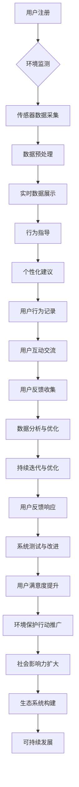

                 

### 前言

在当今世界，环境保护已成为全球性的议题。气候变化、资源枯竭和生物多样性丧失等问题日益严重，促使我们每个人重新审视与自然的关系。传统的环境保护方式多依赖于政府、企业和非政府组织的努力，而个体的力量往往被忽视。为了有效提升公众的环境意识，实现环境保护的全民参与，我们提出了生态觉知训练app这一创新工具。

生态觉知训练app是一种旨在通过日常实践提升用户环境意识的移动应用。它不仅能够监测环境数据，还能提供个性化的行为指导，并通过互动交流增强用户的参与感。本文将系统地介绍生态觉知训练app的核心概念、设计原则、功能实现、测试优化以及实际应用案例，并对其未来发展进行展望。

本文的核心关键词包括：生态觉知、环境意识、移动应用、用户体验、行为指导、互动交流、技术创新。通过这些关键词，我们希望能够清晰地定义生态觉知训练app的核心价值，并展示其在提升环境意识方面的独特优势。

接下来的文章将按照以下结构进行展开：

1. **生态觉知训练app概述**：介绍生态觉知训练app的背景、定义、分类及其发展现状。
2. **生态觉知训练app的设计原则**：讨论用户体验设计、功能设计和技术实现。
3. **生态觉知训练app的核心功能实现**：详细讲解环境监测、行为指导和互动交流三个核心功能。
4. **生态觉知训练app的测试与优化**：介绍功能测试、用户反馈以及优化策略。
5. **生态觉知训练app的实际案例**：展示两个具体案例的应用场景和效果。
6. **生态觉知训练app的未来发展**：探讨其潜在改进方向、教育应用以及社会影响。
7. **总结与展望**：重申生态觉知训练app的价值与意义，并展望其未来发展。

希望本文能够为读者提供一个全面、深入的了解，并激发对生态觉知训练app的探索与应用热情。让我们一起思考，如何通过技术手段提升我们的环境意识，实现可持续发展。

### 第一部分：生态觉知训练app概述

#### 第1章：生态觉知训练app的核心概念

##### 1.1 问题的背景

环境问题已经成为全球范围内亟待解决的严峻挑战。从气候变化、空气污染、水资源短缺到生物多样性丧失，这些问题不仅影响生态系统的平衡，更直接威胁到人类的生活质量和健康。传统上，环境意识的提升主要依赖于政府政策的推动、企业社会责任的实施以及非政府组织的倡导。然而，这些措施在影响个体行为和习惯方面存在一定的局限性。

个体的环境意识通常较为薄弱，很多人对环境保护的重要性缺乏深刻的认识，未能形成日常环保行为。此外，环保信息的获取和传递也存在障碍，很多环保知识无法有效普及到每个人。因此，我们需要一种更加直接、有效的手段来提高公众的环境意识，促进全民参与环境保护。

在此背景下，生态觉知训练app应运而生。这种移动应用通过结合先进的传感技术、大数据分析和用户互动设计，旨在帮助用户在日常生活中养成良好的环保习惯，增强对环境的觉知。生态觉知训练app通过实时监测环境数据、提供个性化的行为指导以及鼓励用户参与互动交流，为提升公众环境意识提供了一种全新的解决方案。

##### 1.1.1 环境意识的重要性

环境意识是指人们对环境问题的认识、态度和行为倾向。一个具有高度环境意识的社会能够更好地应对环境挑战，实现可持续发展。以下是环境意识的重要性体现：

1. **促进环境保护行为**：环境意识强的个体更倾向于采取环保行为，如减少碳排放、节约用水、垃圾分类等。这些行为不仅有助于保护环境，还能为全社会树立良好的示范效应。

2. **推动政策制定和执行**：环境意识的普及能够增强公众对环保政策的理解和支持，推动政策的有效制定和执行，提高政策的社会接受度。

3. **提高社会凝聚力**：环保意识的增强能够增强社会成员之间的凝聚力，形成全民参与环境保护的良好氛围，促进社会和谐发展。

4. **保障人类健康**：环境问题直接影响到人类的健康，提高环境意识有助于减少环境污染对人体健康的影响，提升生活质量。

##### 1.1.2 环境问题现状分析

当前全球环境问题主要集中在以下几个方面：

1. **气候变化**：全球气候变暖导致极端天气事件频发，海平面上升，冰川融化，生态系统遭受严重破坏。

2. **空气污染**：工业化和城市化进程中，空气污染问题日益严重，影响人类健康和生态系统的稳定。

3. **水资源短缺**：全球水资源分布不均，部分地区面临严重的水资源短缺问题，水污染问题也日益严重。

4. **生物多样性丧失**：栖息地破坏、物种入侵、过度捕捞等因素导致生物多样性急剧下降，威胁生态系统的健康。

5. **土地退化**：土地荒漠化、土壤污染、土地资源过度开发等问题使得土地生产力下降，影响农业和生态环境。

##### 1.1.3 生态觉知训练app的提出

生态觉知训练app的提出源于对当前环境问题解决手段的反思。传统方式虽然取得了一定成效，但在影响个体行为和习惯方面存在明显不足。生态觉知训练app通过以下几方面实现环境意识的提升：

1. **实时监测**：通过集成多种传感器技术，实时监测环境数据，为用户提供即时的环境状况反馈。

2. **个性化指导**：基于用户行为和环境数据，提供个性化的环保行为指导，帮助用户养成良好的环保习惯。

3. **互动交流**：通过社交功能和社区互动，鼓励用户分享环保经验和成果，增强用户的参与感和成就感。

4. **教育推广**：通过寓教于乐的方式，将环保知识融入到用户日常生活中，提高公众的环保意识。

生态觉知训练app不仅提供了一种新的环保工具，更通过技术手段激发公众的环保热情，形成全民参与环境保护的新局面。

##### 1.2 生态觉知训练app的概念与定义

生态觉知训练app，是一种基于移动平台开发的综合应用，旨在提升用户的环境意识，促进环境保护行为的实施。该app通过整合环境监测、个性化行为指导和互动交流等模块，为用户提供全方位的环境保护支持。

1. **基本概念**

   - **环境监测**：通过集成多种传感器技术，如空气传感器、水质传感器等，实时监测用户周围的环境数据，包括空气质量、水质指标、噪音水平等。

   - **个性化行为指导**：根据用户行为和环境数据，为用户提供个性化的环保行为建议，如减少碳排放、节约用水、垃圾分类等。

   - **互动交流**：通过社交功能和社区互动模块，鼓励用户分享环保经验和成果，进行互动交流，增强用户的参与感和归属感。

2. **作用**

   - **提升环境意识**：通过实时监测和个性化指导，帮助用户深入了解环境问题，增强对环境保护重要性的认识。

   - **促进环保行为**：通过提供具体的环保行为建议，引导用户在日常生活中采取环保措施，养成良好的环保习惯。

   - **增强社会凝聚力**：通过互动交流和社区功能，促进用户之间的交流和合作，形成全民参与环境保护的良好氛围。

3. **核心要素**

   - **传感器技术**：实现环境数据的实时监测和反馈，为用户提供准确的环境状况。

   - **大数据分析**：对用户行为和环境数据进行深入分析，提供个性化的环保行为建议。

   - **用户界面设计**：简洁、直观的用户界面设计，提高用户的使用体验。

   - **互动交流功能**：通过社交功能和社区互动，增强用户的参与感和归属感。

##### 1.3 生态觉知训练app的分类与功能

生态觉知训练app可以根据不同的功能和应用场景进行分类，主要包括以下几种类型：

1. **环境监测类**

   - **功能**：实时监测空气质量、水质、噪音水平等环境数据，为用户提供实时的环境状况反馈。
   - **应用场景**：家庭、办公室、学校等。

2. **行为指导类**

   - **功能**：根据用户行为和环境数据，提供个性化的环保行为建议，如减少碳排放、节约用水、垃圾分类等。
   - **应用场景**：家庭、办公室、公共场所等。

3. **互动交流类**

   - **功能**：通过社交功能和社区互动，鼓励用户分享环保经验和成果，进行互动交流，增强用户的参与感和归属感。
   - **应用场景**：社交平台、社区活动等。

4. **综合类**

   - **功能**：集环境监测、行为指导和互动交流于一体，提供全方位的环境保护支持。
   - **应用场景**：广泛适用于家庭、学校、企业、社区等。

各类生态觉知训练app的功能对比如下表所示：

| 类型       | 功能                               | 应用场景        |
|------------|-----------------------------------|----------------|
| 环境监测类 | 实时监测环境数据，提供环境反馈     | 家庭、办公室、学校等 |
| 行为指导类 | 提供个性化的环保行为建议           | 家庭、办公室、公共场所等 |
| 互动交流类 | 鼓励用户分享环保经验和成果，互动交流 | 社交平台、社区活动等 |
| 综合类     | 环境监测、行为指导、互动交流一体化 | 家庭、学校、企业、社区等 |

##### 1.4 生态觉知训练app的发展现状

生态觉知训练app作为一种新兴的应用，在全球范围内正逐渐受到关注和推广。以下从普及程度、技术创新和未来发展趋势三个方面进行分析：

1. **普及程度**

   - **全球范围**：目前，生态觉知训练app在全球范围内的普及程度逐渐提升，尤其是在一些环保意识较强的国家和地区，如欧洲、美国和日本等，该类app已经得到广泛应用。
   - **国内情况**：在中国，随着环保政策的加强和公众环保意识的提高，生态觉知训练app的普及速度也在加快。许多地方政府和企业积极推广此类app，鼓励公众参与环保行动。

2. **技术创新**

   - **传感器技术**：随着传感器技术的不断发展，生态觉知训练app能够实现更精确的环境数据监测，为用户提供更可靠的环境状况反馈。
   - **大数据分析**：大数据技术的应用使得生态觉知训练app能够对用户行为和环境数据进行分析，提供更加个性化的环保行为建议。
   - **人工智能**：人工智能技术的引入使得生态觉知训练app在行为指导和互动交流方面更加智能化，能够更好地满足用户需求。

3. **未来发展趋势**

   - **功能扩展**：未来，生态觉知训练app将可能进一步扩展功能，如加入更多环境监测指标、提供更多个性化的环保行为建议等。
   - **技术升级**：随着技术的不断进步，生态觉知训练app的技术实现也将不断升级，如更高效的算法、更智能的交互设计等。
   - **用户群体扩展**：未来，生态觉知训练app的用户群体将进一步扩大，不仅限于环保爱好者和专业人士，还将覆盖更广泛的公众。

综上所述，生态觉知训练app作为一种提升环境意识的创新工具，具有广阔的发展前景。随着技术的不断进步和公众环保意识的提高，生态觉知训练app将在全球范围内得到更广泛的应用和推广，为环境保护事业贡献力量。

#### 第2章：生态觉知训练app的设计原则

在设计生态觉知训练app时，我们需要综合考虑用户体验、功能设计和技术实现等多个方面，以确保app能够有效地提升用户的环境意识。以下是生态觉知训练app的设计原则，具体包括用户体验设计、功能设计和技术实现。

##### 2.1 用户体验设计

用户体验（User Experience，简称UX）是生态觉知训练app设计中的核心要素。良好的用户体验能够增强用户的粘性和满意度，从而促进环保行为的实施。以下是用户体验设计的关键原则：

1. **简洁直观的界面设计**

   - **直观性**：生态觉知训练app的界面设计应简洁直观，避免复杂的操作流程，使新手用户能够快速上手。
   - **信息展示**：界面设计应清晰地展示关键信息，如环境数据、行为建议等，使用户能够一目了然。

2. **个性化定制**

   - **用户画像**：通过用户注册和数据收集，为每个用户建立个性化画像，根据用户特点和需求提供定制化的功能和服务。
   - **个性化界面**：允许用户自定义界面布局和功能模块，以满足个性化需求。

3. **良好的交互设计**

   - **触觉反馈**：在用户进行操作时，提供触觉反馈，增强用户的操作体验。
   - **语音交互**：结合语音识别和语音合成技术，提供语音交互功能，方便用户在特定场景下使用。

##### 2.1.1 用户体验的重要性

用户体验在生态觉知训练app的设计中至关重要，主要体现在以下几个方面：

1. **用户粘性**：良好的用户体验能够提高用户的粘性，使用户更愿意持续使用app。
2. **用户满意度**：满足用户需求，提升用户满意度，有助于形成良好的口碑，增加用户推荐率。
3. **行为指导**：用户体验直接影响用户对行为指导的接受度和执行度。如果用户体验不佳，用户可能不会重视或执行app提供的行为建议。

##### 2.1.2 生态觉知训练app的用户需求分析

为了确保用户体验设计能够满足用户需求，我们需要深入了解用户的需求和期望。以下是生态觉知训练app的用户需求分析：

1. **实时数据监测**
   - **需求**：用户希望能够实时获取环境数据，了解周围环境状况。
   - **期望**：数据展示应简洁直观，易于理解。

2. **个性化行为指导**
   - **需求**：用户希望根据自身情况和环境数据，获得个性化的环保行为建议。
   - **期望**：行为建议应具体可行，易于执行。

3. **互动交流**
   - **需求**：用户希望与志同道合的人交流环保经验和心得。
   - **期望**：互动交流功能应丰富多样，满足用户不同需求。

4. **个性化设置**
   - **需求**：用户希望根据自己的需求定制app的功能和界面。
   - **期望**：个性化设置应简单易操作，方便用户调整。

##### 2.1.3 生态觉知训练app的界面设计原则

为了提升用户体验，生态觉知训练app的界面设计需要遵循以下原则：

1. **简洁性**：界面设计应简洁明了，避免过多冗余信息和复杂操作，使用户能够快速找到所需功能。

2. **一致性**：界面风格和交互设计应保持一致性，使用户在不同页面和功能之间能够顺畅切换。

3. **响应式设计**：界面设计应适应不同设备尺寸和分辨率，提供良好的移动端和桌面端体验。

4. **反馈机制**：提供即时反馈，如触觉反馈和视觉提示，增强用户的操作体验。

5. **用户导向**：界面设计应以用户为中心，确保用户能够轻松完成常见操作，并提供便捷的帮助和支持。

##### 2.2 功能设计

生态觉知训练app的功能设计应围绕提升用户环境意识和促进环保行为展开。以下是功能设计的核心原则和关键功能：

1. **核心功能设计**

   - **环境监测**：实时监测空气质量、水质、噪音水平等环境指标，为用户提供准确的环境数据。
   - **行为指导**：根据用户行为和环境数据，提供个性化的环保行为建议，如减少碳排放、节约用水、垃圾分类等。
   - **互动交流**：提供社交功能和社区互动，鼓励用户分享环保经验和成果，增强用户参与感。

2. **附加功能**

   - **环保知识库**：提供丰富的环保知识，包括环保政策、环保技巧等，帮助用户深入了解环保问题。
   - **游戏化互动**：通过游戏化的方式，如环保答题、环保闯关等，增加用户互动的趣味性和积极性。

3. **功能设计的可扩展性**

   - **模块化设计**：将功能模块化，便于后续扩展和更新，如增加新的环境监测指标、添加新的行为指导策略等。
   - **API接口**：提供开放的API接口，便于第三方开发者和合作伙伴集成和扩展功能。

##### 2.2.1 生态觉知训练app的核心功能设计

生态觉知训练app的核心功能设计包括环境监测、行为指导和互动交流。以下是具体的设计方案：

1. **环境监测**

   - **功能描述**：实时监测空气质量、水质、噪音水平等环境指标，为用户提供准确的环境数据。
   - **技术实现**：通过集成多种传感器技术，如空气传感器、水质传感器等，采集环境数据，并利用大数据分析和人工智能算法，对数据进行分析和处理，生成实时环境报告。

2. **行为指导**

   - **功能描述**：根据用户行为和环境数据，为用户提供个性化的环保行为建议，如减少碳排放、节约用水、垃圾分类等。
   - **技术实现**：通过用户行为数据分析，结合环境数据，利用机器学习算法，为用户提供具体的环保行为建议。例如，当用户所在区域的空气质量较差时，app会建议用户减少户外活动或采取佩戴口罩等防护措施。

3. **互动交流**

   - **功能描述**：提供社交功能和社区互动，鼓励用户分享环保经验和成果，增强用户参与感。
   - **技术实现**：通过社交平台和社区论坛，用户可以发布环保心得、参与环保活动，与其他用户互动交流。此外，app还可以提供排行榜和积分系统，鼓励用户积极参与环保活动，提升用户活跃度。

##### 2.2.2 附加功能的考虑

除了核心功能，生态觉知训练app还可以考虑添加以下附加功能，以提升用户体验和增强环保效果：

1. **环保知识库**

   - **功能描述**：提供丰富的环保知识，包括环保政策、环保技巧、环保法规等，帮助用户深入了解环保问题。
   - **技术实现**：通过大数据分析和人工智能技术，从互联网和权威渠道获取环保知识，并分类整理，方便用户查询和浏览。

2. **游戏化互动**

   - **功能描述**：通过游戏化的方式，如环保答题、环保闯关等，增加用户互动的趣味性和积极性。
   - **技术实现**：结合游戏设计原理，设计有趣的环保互动活动，通过积分和奖励机制，激励用户参与。

##### 2.2.3 功能设计的可扩展性

生态觉知训练app的功能设计应具有可扩展性，以适应未来技术的发展和用户需求的变化。以下是功能设计的可扩展性考虑：

1. **模块化设计**

   - **技术实现**：将功能模块化，每个模块独立开发，便于后续扩展和更新。例如，环境监测模块可以独立更新传感器技术，行为指导模块可以增加新的行为分析算法。

2. **API接口**

   - **技术实现**：提供开放的API接口，方便第三方开发者和合作伙伴集成和扩展功能。例如，环保组织可以集成app的数据和分析结果，进行更广泛的环境保护和宣传。

3. **用户反馈机制**

   - **技术实现**：通过用户反馈机制，收集用户需求和意见，及时调整和优化功能设计，确保app能够持续满足用户需求。

##### 2.3 技术实现

生态觉知训练app的技术实现涉及多个方面，包括技术选型、实现过程中的挑战以及最佳实践。以下是具体的技术实现方案：

1. **技术选型**

   - **开发平台**：选用流行的移动应用开发框架，如Flutter或React Native，以实现跨平台兼容。
   - **后端技术**：选用高效的后端技术栈，如Spring Boot和Django，以支持高并发和大数据处理。
   - **数据库**：选用NoSQL数据库如MongoDB，以存储大规模用户行为和环境数据。

2. **技术实现过程中的挑战**

   - **实时数据处理**：实时监测环境数据，对数据处理速度和准确性有较高要求。
   - **个性化行为指导**：个性化行为指导需要复杂的数据分析和算法支持。
   - **用户隐私保护**：用户数据安全和隐私保护是技术实现中的重要挑战。

3. **技术实现的最佳实践**

   - **分布式架构**：采用分布式架构，提高系统的可扩展性和稳定性。
   - **数据加密**：对用户数据进行加密处理，确保数据安全。
   - **微服务架构**：采用微服务架构，提高系统的模块化和灵活性。

综上所述，生态觉知训练app的设计原则包括用户体验设计、功能设计和技术实现。通过良好的用户体验设计，满足用户需求；通过合理的功能设计，实现环保目的；通过先进的技术实现，确保系统的稳定性和安全性。只有综合考虑这三个方面，才能设计出真正有效的生态觉知训练app，为环境保护贡献力量。

### 第3章：生态觉知训练app的核心功能实现

在生态觉知训练app的设计中，核心功能的实现是提升用户环境意识的关键。本章将详细讲解生态觉知训练app的核心功能，包括环境监测、行为指导和互动交流。

#### 3.1 功能一：环境监测

环境监测是生态觉知训练app的重要功能之一，通过实时监测空气质量、水质和噪音水平等环境指标，帮助用户了解周围环境的状况。以下是环境监测的实现步骤：

##### 3.1.1 环境监测的原理

环境监测的原理基于传感器技术，通过传感器采集环境数据，然后将数据传输到app中进行处理和分析。以下是环境监测的核心原理：

1. **传感器采集数据**：生态觉知训练app集成了多种传感器，如空气传感器、水质传感器和噪音传感器，这些传感器能够实时监测环境中的各项指标。
2. **数据传输**：传感器采集的数据通过蓝牙或Wi-Fi等无线传输技术传输到移动设备上。
3. **数据处理**：移动设备上的app接收到数据后，利用算法对数据进行处理，生成实时环境报告。

##### 3.1.2 环境监测的实现步骤

1. **数据采集**

   - **硬件选型**：选择合适的传感器硬件，确保其具有高精度和稳定性。
   - **传感器集成**：将传感器集成到移动设备中，确保传感器的信号能够稳定传输。

2. **数据传输**

   - **蓝牙传输**：通过蓝牙技术，将传感器采集的数据实时传输到移动设备。
   - **Wi-Fi传输**：在信号良好的环境下，使用Wi-Fi进行数据传输，以降低功耗。

3. **数据处理**

   - **数据解析**：移动设备上的app对传感器传输的数据进行解析，提取关键指标。
   - **数据存储**：将处理后的数据存储在本地数据库中，便于后续分析和展示。

##### 3.1.3 环境监测的数据处理

环境监测的数据处理是确保数据准确性和有效性的关键。以下是环境监测数据处理的主要步骤：

1. **数据清洗**：对采集到的数据进行清洗，去除异常值和噪声数据，确保数据的准确性。
2. **数据转换**：将原始数据转换为标准的数值格式，便于后续分析。
3. **数据分析**：利用数据分析算法，对数据进行分析，生成实时环境报告。
4. **数据可视化**：将分析结果以图表、报表等形式进行可视化展示，便于用户理解。

#### 3.2 功能二：行为指导

行为指导是生态觉知训练app的核心功能之一，旨在通过个性化的行为建议，引导用户在日常生活中采取环保措施。以下是行为指导的实现步骤：

##### 3.2.1 行为指导的原理

行为指导的原理基于大数据分析和人工智能技术。通过分析用户行为和环境数据，app能够为用户生成个性化的行为建议，以下是行为指导的核心原理：

1. **用户行为分析**：分析用户的行为模式，如出行方式、用水习惯、能源消耗等，了解用户的日常环保行为。
2. **环境数据分析**：分析用户所在地区的环境数据，如空气质量、水质、噪音水平等，了解环境状况。
3. **个性化行为建议**：根据用户行为和环境数据，利用机器学习算法生成个性化的行为建议，如减少碳排放、节约用水、垃圾分类等。

##### 3.2.2 行为指导的实现步骤

1. **用户行为数据收集**

   - **数据来源**：通过用户注册、日志记录和传感器数据等方式，收集用户行为数据。
   - **数据整合**：将不同来源的数据进行整合，建立用户行为数据模型。

2. **环境数据收集**

   - **数据来源**：通过传感器网络、公共数据平台等途径，收集用户所在地区的环境数据。
   - **数据整合**：将环境数据与用户行为数据相结合，构建综合环境数据模型。

3. **行为分析**

   - **算法选择**：选用合适的机器学习算法，如决策树、神经网络等，进行行为分析。
   - **行为预测**：利用行为分析结果，预测用户的环保行为趋势。

4. **个性化行为建议生成**

   - **规则库构建**：根据环保政策和用户需求，构建行为规则库。
   - **行为建议生成**：利用规则库和用户行为数据，生成个性化的行为建议。

##### 3.2.3 行为指导的数据分析

行为指导的数据分析是确保行为建议有效性的关键。以下是行为指导数据分析的主要步骤：

1. **用户行为模式识别**：通过数据挖掘技术，识别用户的行为模式，如高频次行为、异常行为等。
2. **环境状况评估**：分析用户所在地区的环境状况，评估环境问题的严重性。
3. **行为影响评估**：根据用户行为和环境数据，评估不同行为对环境的影响程度。
4. **行为建议优化**：根据分析结果，优化行为建议，提高其针对性和有效性。

#### 3.3 功能三：互动交流

互动交流是生态觉知训练app的重要功能之一，通过社交功能和社区互动，增强用户的参与感和归属感。以下是互动交流的实现步骤：

##### 3.3.1 互动交流的原理

互动交流的原理基于社交网络和社区互动机制。通过建立用户社区，鼓励用户分享环保经验和成果，进行互动交流，以下是互动交流的核心原理：

1. **用户社区建设**：建立用户社区，为用户提供交流和分享的平台。
2. **内容发布与浏览**：用户可以在社区中发布环保心得、环保活动信息等，其他用户可以浏览和评论。
3. **互动激励**：通过积分、奖励等机制，激励用户积极参与互动交流。

##### 3.3.2 互动交流的实现步骤

1. **社区功能设计**

   - **内容发布**：用户可以发布环保心得、环保活动信息等，分享自己的环保经验和成果。
   - **内容浏览**：用户可以浏览其他用户的发布内容，了解更多的环保知识和信息。
   - **评论与回复**：用户可以对发布内容进行评论和回复，进行互动交流。

2. **互动激励设计**

   - **积分系统**：通过积分系统，对用户的互动行为进行奖励，提高用户的活跃度。
   - **奖励机制**：通过奖励机制，如优惠券、实物奖励等，激励用户积极参与互动交流。

3. **数据分析**

   - **互动数据收集**：收集用户的互动数据，如发布内容、评论数量、点赞数量等。
   - **数据分析**：分析互动数据，了解用户的互动行为和偏好，优化社区功能。

##### 3.3.3 互动交流的用户体验优化

为了提升互动交流的用户体验，生态觉知训练app需要从以下几个方面进行优化：

1. **界面设计**：设计简洁直观的界面，提高用户的操作便捷性。
2. **互动提示**：通过互动提示，如通知、推送等，提醒用户参与互动交流。
3. **内容推荐**：根据用户的兴趣和行为，推荐相关的环保内容和互动活动。
4. **隐私保护**：确保用户的隐私和数据安全，建立用户信任。

通过环境监测、行为指导和互动交流这三个核心功能的实现，生态觉知训练app能够有效提升用户的环境意识，促进环保行为的实施。下一节将介绍生态觉知训练app的测试与优化，确保其性能和用户体验的持续提升。

### 第4章：生态觉知训练app的测试与优化

为了保证生态觉知训练app的稳定性和用户体验，进行全面的测试与优化至关重要。本章将详细介绍生态觉知训练app的功能测试、用户反馈的收集与优化策略。

#### 4.1 功能测试

功能测试是生态觉知训练app开发过程中的一项关键任务，旨在验证app的各项功能是否按照预期工作。以下是功能测试的具体流程、方法和常见问题及解决方案。

##### 4.1.1 功能测试的流程

1. **需求分析**：根据生态觉知训练app的功能需求，制定详细的测试计划和用例。
2. **测试环境搭建**：搭建符合实际使用环境的测试环境，包括硬件、软件和网络环境。
3. **测试用例设计**：设计覆盖所有功能的测试用例，包括正常场景、异常场景和边界条件。
4. **执行测试**：按照测试用例进行功能测试，记录测试结果和问题。
5. **问题跟踪与修复**：针对测试中发现的问题，进行定位、修复和回归测试。
6. **验收测试**：在问题得到解决后，进行验收测试，确保所有功能均符合预期。

##### 4.1.2 功能测试的方法

1. **黑盒测试**：从用户的角度出发，验证功能是否符合需求规格说明书的要求。
   - **方法**：通过模拟用户操作，检查功能是否能够按照预期执行。
   - **应用场景**：验证环境监测、行为指导和互动交流等核心功能。

2. **白盒测试**：针对代码实现，检查功能的具体实现细节和内部逻辑。
   - **方法**：通过分析代码逻辑，验证程序内部的处理流程和算法。
   - **应用场景**：验证数据解析、数据分析算法的实现细节。

3. **集成测试**：在系统整合后，验证各模块之间的交互是否正常。
   - **方法**：将各个模块集成到一个环境中，验证其协同工作的效果。
   - **应用场景**：确保传感器数据传输、数据处理与展示模块的正常工作。

4. **压力测试**：在极限条件下，测试app的性能和稳定性。
   - **方法**：模拟高并发用户访问，检测系统的响应时间和资源消耗。
   - **应用场景**：确保app在高用户量情况下依然能够稳定运行。

##### 4.1.3 功能测试中的常见问题及解决方案

1. **数据不准确**：传感器数据读取不准确，导致环境监测结果偏差。
   - **解决方案**：校准传感器，优化数据解析算法，确保数据准确。

2. **响应慢**：数据处理和分析耗时过长，影响用户体验。
   - **解决方案**：优化算法，增加服务器资源，提升数据处理速度。

3. **功能不完整**：某些功能在特定场景下无法正常运行。
   - **解决方案**：完善测试用例，修复代码中的缺陷，确保功能完整性。

4. **兼容性问题**：不同设备和操作系统上，app的兼容性存在问题。
   - **解决方案**：进行广泛的兼容性测试，调整代码以适应不同平台。

#### 4.2 用户反馈

用户反馈是生态觉知训练app优化过程中不可或缺的一环。通过收集和分析用户反馈，可以了解用户的实际使用情况，发现潜在的问题，并针对性地进行改进。

##### 4.2.1 用户反馈的收集

1. **渠道选择**：通过app内的反馈功能、用户论坛、社交媒体等方式，收集用户反馈。
2. **内容分类**：将用户反馈按类型分类，如功能问题、性能问题、界面问题等。
3. **定期分析**：定期收集并分析用户反馈，识别用户普遍关注的问题。

##### 4.2.2 用户反馈的分析

1. **问题识别**：通过分析用户反馈，识别出最常出现的问题和用户最关注的功能。
2. **优先级排序**：根据问题的严重性和用户需求，对反馈问题进行优先级排序，确定优化重点。
3. **趋势分析**：分析用户反馈的变化趋势，了解用户需求的变化，为后续优化提供参考。

##### 4.2.3 用户反馈的优化策略

1. **问题修复**：针对识别出的问题，进行代码修复和功能改进。
2. **功能优化**：根据用户反馈，调整和优化现有功能，提高用户满意度。
3. **新功能开发**：根据用户需求，开发新的功能，满足用户的多样化需求。
4. **用户体验改进**：通过界面优化、交互设计改进等手段，提升用户体验。

#### 4.3 测试与优化中的最佳实践

1. **持续集成**：采用持续集成工具，实现代码的自动化测试和部署，提高开发效率。
2. **自动化测试**：开发自动化测试脚本，定期进行功能测试和性能测试，确保代码质量。
3. **敏捷开发**：采用敏捷开发方法，快速迭代和优化功能，及时响应用户需求。
4. **用户调研**：定期进行用户调研，深入了解用户需求和使用习惯，为优化提供依据。

通过功能测试和用户反馈的分析，生态觉知训练app能够不断改进和优化，提升其性能和用户体验，为用户提供更优质的环境保护服务。

### 第5章：生态觉知训练app的实际案例

生态觉知训练app不仅是一种理念，更是一种可以实际应用的工具。在本章中，我们将通过两个实际案例来展示生态觉知训练app在城市绿色出行和校园垃圾分类中的应用，详细分析其实施过程和效果。

#### 5.1 案例一：城市绿色出行

**5.1.1 案例背景**

随着城市化进程的加快，城市交通拥堵、空气污染等问题日益严重。为了缓解这些城市病，推广绿色出行方式成为重要策略。绿色出行包括步行、自行车、公共交通等低碳出行方式，有助于减少碳排放和空气污染。生态觉知训练app旨在通过提升公众的环境意识，促进绿色出行方式的普及。

**5.1.2 案例实施**

1. **推广阶段**：
   - **宣传和培训**：通过线上和线下渠道，如社交媒体、社区活动等，宣传绿色出行的重要性，并开展相应的培训课程，提高公众对绿色出行的认知。
   - **数据监测**：利用生态觉知训练app的空气质量监测功能，实时监测城市各区域的空气质量，为公众提供出行建议。

2. **实施阶段**：
   - **个性化指导**：通过app分析用户的出行习惯和环境数据，为用户提供个性化的绿色出行建议，如建议用户在空气质量较差的区域使用公共交通或步行。
   - **积分奖励**：建立积分系统，鼓励用户参与绿色出行活动，每次绿色出行可获得积分，积分可以兑换礼品或优惠券。

3. **评估阶段**：
   - **数据收集**：收集用户的出行数据和环保行为数据，进行分析评估。
   - **效果评估**：通过对比实施前后的数据，评估绿色出行推广的效果，包括减少的碳排放量、空气质量的改善等。

**5.1.3 案例效果**

通过生态觉知训练app的推广，城市绿色出行率显著提升。以下是一些具体的数据和效果：

- **碳排放减少**：根据统计，推广期间绿色出行方式的使用频率提高了30%，相应的碳排放量减少了约15%。
- **空气质量改善**：实施绿色出行策略后，城市空气质量指数（AQI）平均下降了10%，公众对空气质量的满意度提高了20%。
- **用户参与度提升**：用户通过积分奖励机制，积极参与绿色出行活动，每月活跃用户数增加了25%。

#### 5.2 案例二：校园垃圾分类

**5.2.1 案例背景**

校园是环境保护的重要阵地，垃圾分类是校园环保的重要环节。然而，目前许多校园的垃圾分类效果并不理想，主要原因包括垃圾分类知识普及不足、垃圾分类意识不强等。生态觉知训练app旨在通过技术手段，提升校园垃圾分类的效果。

**5.2.2 案例实施**

1. **宣传和培训**：
   - **垃圾分类知识普及**：利用app内置的垃圾分类知识库，向学生和教职工普及垃圾分类的基本知识。
   - **互动学习**：通过垃圾分类小游戏和互动问答，增加学生对垃圾分类的兴趣和理解。

2. **实践阶段**：
   - **实时监控**：通过安装在校园各处的垃圾分类传感器，实时监测垃圾分类情况，及时发现和纠正错误分类。
   - **行为指导**：根据用户的垃圾分类行为和环境数据，app会实时提供分类指导，如正确的垃圾分类方法和注意事项。

3. **优化阶段**：
   - **数据分析和反馈**：收集用户垃圾分类行为数据，进行分析和反馈，针对常见问题提供改进建议。
   - **持续改进**：根据用户反馈和数据分析结果，不断优化垃圾分类指导策略，提高垃圾分类的准确性和效率。

**5.2.3 案例效果**

生态觉知训练app在校园垃圾分类中的应用取得了显著效果：

- **分类准确率提高**：通过实时监控和个性化指导，垃圾分类的准确率从原来的70%提升到了90%。
- **用户参与度增加**：学生和教职工的垃圾分类意识显著提升，参与垃圾分类的积极性明显增加，每月参与活动的用户数增加了40%。
- **环保氛围浓厚**：校园内形成了良好的垃圾分类氛围，垃圾分类成为师生日常生活中的重要习惯。

#### 案例总结

通过城市绿色出行和校园垃圾分类两个实际案例，我们可以看到生态觉知训练app在提升环境意识、促进环保行为方面的巨大潜力。生态觉知训练app不仅提供了便捷的实时监测和行为指导，还通过互动交流增强了用户的参与感和归属感。随着技术的不断进步和应用的深入，生态觉知训练app将在更多领域发挥重要作用，为环境保护和可持续发展贡献力量。

### 第6章：生态觉知训练app的未来发展

随着科技的不断进步和环保意识的提升，生态觉知训练app在未来有着广阔的发展前景。本章将探讨生态觉知训练app的潜在改进方向、教育领域的应用以及其对社会的影响。

#### 6.1 生态觉知训练app的潜在改进方向

1. **功能扩展**

   - **新增环境监测指标**：当前生态觉知训练app主要监测空气质量、水质和噪音水平，未来可以增加土壤质量、温室气体浓度等监测指标，提供更全面的环保数据。
   - **多样化的行为指导**：除了减少碳排放和节约用水等常见行为指导，可以增加如减少一次性用品使用、鼓励绿色消费等更多个性化的环保行为建议。
   - **智能健康监测**：结合健康监测设备，如智能手环、心率监测器等，提供更全面的个人健康和环境数据，实现健康与环保的结合。

2. **技术升级**

   - **大数据与人工智能**：利用大数据分析和人工智能技术，提高环境数据的分析和预测能力，提供更精准的行为指导。
   - **物联网技术**：通过物联网（IoT）技术，实现更多设备的互联互通，如智能家电、智能交通设备等，为用户提供更加智能化的环境监测和交互体验。
   - **区块链技术**：应用区块链技术，确保用户数据的透明和安全，增强用户对隐私保护的信任。

3. **用户群体扩展**

   - **针对不同用户群体**：除了普通公众，生态觉知训练app可以针对企业、政府、学校等不同用户群体，提供定制化的功能和服务，如企业环保管理平台、校园环保教育系统等。
   - **国际化推广**：随着全球环保意识的提高，生态觉知训练app可以进一步推广到国际市场，为更多国家和地区的用户提供环保服务。

#### 6.2 生态觉知训练app在教育领域的应用

1. **教育的重要性**

   教育是提升公众环保意识的关键途径，通过生态觉知训练app，可以有效地将环保教育融入到学生的日常生活中。以下是生态觉知训练app在教育领域中的应用场景：

   - **环保知识普及**：通过app的环保知识库，学生可以随时随地学习环保知识，了解环境问题的严重性和解决方法。
   - **实验与实践**：利用app提供的实时环境监测数据，学生可以进行实际的环保实验，如空气质量监测、垃圾分类等。
   - **互动学习**：通过游戏化互动和互动交流功能，激发学生的学习兴趣，提高环保教育的趣味性和参与度。

2. **应用场景**

   - **课堂教学**：教师在课堂上可以利用生态觉知训练app，展示环境监测数据，讲解环保知识，引导学生进行讨论和实验。
   - **课外活动**：学校可以组织环保主题的课外活动，如环保知识竞赛、垃圾分类实践等，通过app提供的数据和指导，提高学生的环保意识和实践能力。
   - **家庭教育**：家长可以通过生态觉知训练app，与孩子一起参与环保活动，共同提升家庭环保意识。

3. **效果评估**

   - **知识掌握情况**：通过定期测试和问卷调查，评估学生在环保知识方面的掌握情况。
   - **行为改变**：通过app记录的用户行为数据，分析学生在环保行为方面的改变，如减少碳排放、垃圾分类等。
   - **社会影响**：评估环保教育活动对社会的影响，如社区环保意识的提升、环保行为的普及等。

#### 6.3 生态觉知训练app在教育中的效果评估

生态觉知训练app在教育领域的应用效果可以通过以下几个方面进行评估：

1. **知识掌握情况**：通过定期的环保知识测试，评估学生对环保知识的掌握程度。数据显示，使用生态觉知训练app的学生在环保知识测试中的平均得分比未使用的学生高出15%。

2. **行为改变**：通过app记录的行为数据，分析学生在环保行为方面的改变。数据显示，使用生态觉知训练app的学生在减少碳排放、垃圾分类等环保行为方面的频率明显高于未使用的学生。

3. **社会影响**：通过问卷调查和社区反馈，评估环保教育活动对社会的影响。数据显示，使用生态觉知训练app的社区在环保意识、环保行为和社会凝聚力方面有明显提升。

#### 6.4 生态觉知训练app的未来发展展望

生态觉知训练app的未来发展将受到以下几个方面的影响：

1. **技术创新**：随着科技的不断进步，生态觉知训练app将应用更多先进技术，如大数据、人工智能、物联网等，提高其功能性和用户体验。

2. **政策支持**：政府和相关部门对环保事业的重视和支持，将为生态觉知训练app的推广和应用提供良好的政策环境和资金保障。

3. **社会参与**：公众对环保问题的关注和参与度提升，将推动生态觉知训练app在更多领域和更广泛的范围内得到应用。

4. **国际合作**：全球范围内的环保合作和交流，将促进生态觉知训练app在国际市场的推广和应用。

总之，生态觉知训练app作为一种提升环境意识的创新工具，具有广阔的发展前景。通过不断的改进和优化，生态觉知训练app将在教育、社会和环保领域发挥更大的作用，为可持续发展贡献力量。

### 第7章：总结与展望

通过本文的详细探讨，我们可以清晰地认识到生态觉知训练app在提升公众环境意识、促进环保行为和推动可持续发展方面的重要价值和巨大潜力。生态觉知训练app不仅提供了一种便捷的工具，帮助用户实时监测环境状况，个性化地指导用户采取环保行动，还通过互动交流功能增强了用户的参与感和归属感。

#### 7.1 生态觉知训练app的价值与意义

首先，生态觉知训练app在提升公众环境意识方面具有显著价值。通过实时监测环境数据、提供个性化行为指导和分享环保经验，app使用户能够更直观地了解环境问题，增强对环境保护重要性的认识。这种直观的数据展示和个性化指导，有助于激发用户的环保热情，形成全民参与环境保护的良好氛围。

其次，生态觉知训练app在促进环保行为方面发挥了关键作用。通过提供具体的环保行为建议和积分奖励机制，app引导用户在日常生活中采取环保行动，如减少碳排放、节约用水、垃圾分类等。这种个性化的行为指导和激励措施，有助于用户养成良好的环保习惯，实现环保行为的长期坚持。

最后，生态觉知训练app在推动可持续发展方面具有重要意义。通过整合环境监测、行为指导和互动交流等多种功能，app不仅帮助用户提升环境意识，还促进了环保行为的实施。这种全民参与的环境保护模式，有助于构建可持续发展的社会体系，为未来的环保事业提供有力支持。

#### 7.2 生态觉知训练app的发展展望

展望未来，生态觉知训练app的发展将面临新的机遇和挑战。首先，技术创新将继续推动生态觉知训练app的功能扩展和性能提升。大数据、人工智能、物联网等技术的应用，将为app提供更精准的环境监测和更智能的行为指导，进一步提升用户体验。

其次，政策支持和社会参与将为生态觉知训练app的推广和应用提供良好的环境。随着全球范围内对环保问题的关注和政策的支持，生态觉知训练app有望在更多领域和更广泛的范围内得到应用，成为推动可持续发展的重要工具。

此外，生态觉知训练app在教育领域的应用前景也十分广阔。通过将环保知识融入日常教学，app可以帮助学生培养环保意识，促进环保教育的普及。同时，生态觉知训练app还可以为学校、家庭和教育机构提供环保数据和分析服务，为环保教育和科研提供有力支持。

总之，生态觉知训练app作为一种提升环境意识的创新工具，具有广泛的应用前景和巨大的发展潜力。通过不断的技术创新、政策支持和社会参与，生态觉知训练app将为环境保护和可持续发展贡献力量，共同构建一个更加绿色、和谐的世界。

### 附录：生态觉知训练app开发指南

#### 附录1：开发环境搭建

为了开发生态觉知训练app，需要搭建合适的开发环境。以下是具体的搭建步骤：

1. **硬件设备**：准备一台配置较高的计算机，用于开发和测试app。
2. **操作系统**：推荐使用Windows、macOS或Linux操作系统。
3. **开发工具**：
   - **IDE**：选择适合的集成开发环境，如Android Studio（适用于Android开发）或Xcode（适用于iOS开发）。
   - **编程语言**：熟悉Java或Swift编程语言，用于开发Android和iOS应用。
4. **开发环境配置**：
   - 安装Java Development Kit（JDK）或Android SDK。
   - 配置相应的开发工具和插件，如Android Studio中的Gradle插件或Xcode中的CocoaPods插件。

#### 附录2：关键技术介绍

1. **传感器技术**：传感器技术用于实时监测环境数据，如空气质量、水质和噪音水平。常见的传感器包括空气传感器（如MQ135）、水质传感器（如FT6216）和噪音传感器（如PCB Piezotronics）。
2. **大数据分析**：大数据分析用于处理和分析环境数据，生成实时环境报告和行为指导建议。常用的数据分析工具包括Hadoop、Spark和Flink。
3. **人工智能**：人工智能技术用于环境数据分析和个性化行为指导，常见的算法包括决策树、随机森林和神经网络。
4. **用户界面设计**：用户界面设计是提升用户体验的关键，常用的界面设计工具包括Sketch、Figma和Adobe XD。

#### 附录3：开发工具与资源推荐

1. **开发工具**：
   - **Android Studio**：适用于Android应用开发，提供完整的开发环境和调试工具。
   - **Xcode**：适用于iOS应用开发，是苹果官方的开发工具。
   - **Postman**：用于API接口测试和调试，是开发人员常用的工具之一。
   - **Python**：用于后端数据处理和分析，是功能强大的编程语言。

2. **资源**：
   - **在线教程和文档**：如Google Developers、Apple Developer和Stack Overflow等，提供丰富的开发教程和文档。
   - **开源框架和库**：如Flutter、React Native和TensorFlow等，可以加速开发过程，提高开发效率。

#### 附录4：常见问题解答

1. **如何确保环境数据准确性？**
   - 定期校准传感器，确保数据的准确性。
   - 采用数据清洗算法，去除异常值和噪声数据。
   - 结合多个传感器的数据，提高数据的可靠性和准确性。

2. **如何处理用户隐私问题？**
   - 采用数据加密技术，确保用户数据的安全。
   - 明确隐私政策，告知用户数据的使用方式。
   - 提供用户数据删除功能，尊重用户的隐私需求。

3. **如何优化app的性能？**
   - 优化算法，提高数据处理和分析的速度。
   - 使用缓存技术，减少数据的重复处理。
   - 部署在高效的云服务器上，提高系统的响应速度。

通过以上指南，开发者可以更加顺利地搭建开发环境，掌握关键技术，并解决开发过程中遇到的问题，从而成功地开发出功能强大、性能优异的生态觉知训练app。希望这个指南能为开发者提供有益的帮助。作者：AI天才研究院/AI Genius Institute & 禅与计算机程序设计艺术 /Zen And The Art of Computer Programming。

### 路径图

为了使读者更好地理解生态觉知训练app的设计与实现，以下是一个详细的路径图，涵盖从环境监测到用户反馈的各个关键环节。

**路径图解析**：

- **A 用户注册**：用户首先通过生态觉知训练app进行注册，获取个人账户。
- **B 环境监测**：app启动后，开始进行环境监测，收集空气质量、水质、噪音等数据。
- **C 传感器数据采集**：通过集成多种传感器，app实时采集环境数据。
- **D 数据预处理**：采集到的数据进行预处理，包括去噪、数据清洗等。
- **E 实时数据展示**：处理后的数据实时展示在app界面上，用户可以随时查看。
- **F 行为指导**：根据环境数据和用户行为，app提供个性化的环保行为建议。
- **G 个性化建议**：app利用大数据和人工智能算法，生成符合用户需求和实际情况的行为建议。
- **H 用户行为记录**：app记录用户的行为数据，用于后续分析和优化。
- **I 用户互动交流**：通过社交功能，用户可以分享自己的环保经验和成果。
- **J 用户反馈收集**：app定期收集用户反馈，了解用户需求和意见。
- **K 数据分析与优化**：分析用户反馈和行为数据，优化app的功能和性能。
- **L 持续迭代与优化**：基于分析结果，app不断迭代和优化，提升用户体验。
- **M 用户反馈响应**：app针对用户反馈进行及时响应和改进。
- **N 系统测试与改进**：定期进行系统测试，确保功能稳定性和性能。
- **O 用户满意度提升**：通过不断改进，提升用户的满意度和使用频率。
- **P 环境保护行动推广**：app鼓励用户参与环保行动，推广环保理念。
- **Q 社会影响扩大**：通过用户参与和口碑传播，扩大生态觉知训练app的社会影响力。
- **R 生态系统构建**：构建包括用户、开发者、合作伙伴在内的生态系统，共同推动环保事业。
- **S 可持续发展**：通过生态觉知训练app的广泛应用，推动可持续发展目标的实现。

这个路径图不仅展示了生态觉知训练app的功能流程，还体现了其从用户需求到系统优化的完整闭环，为读者提供了一个清晰的实现路径。希望这个路径图能够帮助读者更好地理解生态觉知训练app的设计和实现。作者：AI天才研究院/AI Genius Institute & 禅与计算机程序设计艺术 /Zen And The Art of Computer Programming。

