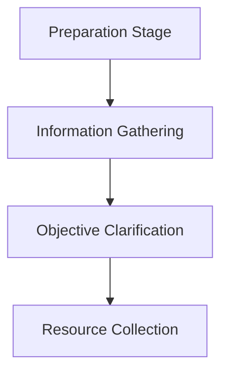
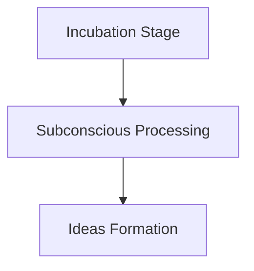
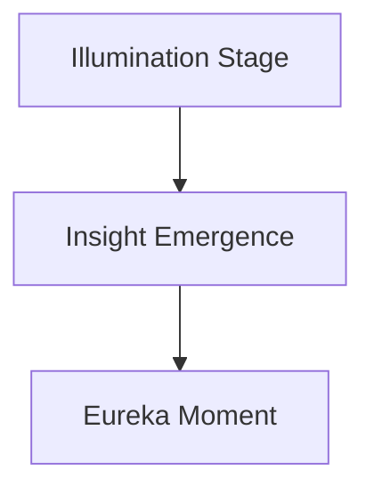
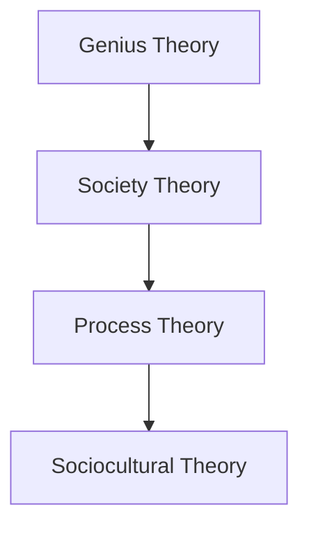

                 

## Life as Creativity: Transforming Everyday Experiences into Artistic Works

### Keywords
- Creativity
- Everyday life
- Artistic expression
- Personal transformation
- Mindset

### Abstract

This article delves into the concept of life as a canvas for creativity, exploring how everyday experiences can be transformed into artistic endeavors. By adopting a step-by-step approach, we'll examine the core principles and methodologies that underpin this transformative process. We'll discuss the significance of embracing a creative mindset, the interplay between routine and artistic creation, and the practical steps individuals can take to cultivate their creativity. Through case studies and actionable techniques, this article aims to inspire readers to view their lives through a lens of creativity and to translate their experiences into meaningful works of art.

## Introduction

### The Need for Creativity in Modern Life

In today's fast-paced, technology-driven world, the ability to think creatively has never been more crucial. The routine nature of modern life, often characterized by repetitive tasks and constant distractions, can lead to a feeling of stagnation and burnout. However, creativity is not just a luxury but a necessity for personal growth and professional success. It's the driving force behind innovation, problem-solving, and personal fulfillment. By exploring the intersection of daily life and creativity, we can uncover new ways to view the world and engage with it more profoundly.

### Defining Creativity

Creativity can be defined as the ability to generate new and valuable ideas, solutions, or works of art through the use of imagination and original thought. It's the process of breaking away from conventional thinking patterns and approaching problems from different angles. While creativity is often associated with the arts, it's a fundamental human trait that can be applied to all aspects of life, from solving everyday problems to enhancing personal relationships and fostering innovation in the workplace.

### The Purpose of This Article

The purpose of this article is to provide a comprehensive guide to understanding and embracing creativity as a natural extension of everyday life. We'll explore the fundamental concepts and principles of creativity, examine the relationship between routine and artistic expression, and offer practical strategies for cultivating a creative mindset. Through the lens of various case studies and practical exercises, we'll demonstrate how anyone can transform their daily experiences into meaningful artistic works.

### Structure of the Article

The article is structured into several key sections:

1. **Core Concepts and Theories**: We'll delve into the core concepts and theories that underpin the creative process, providing a theoretical framework for understanding creativity.
2. **Practical Applications and Case Studies**: Here, we'll explore real-world examples of how creativity has been applied to transform everyday experiences into artistic works.
3. **Creativity Techniques and Exercises**: We'll discuss various creativity techniques and provide practical exercises for readers to apply these techniques in their own lives.
4. **Creativity in Various Domains**: We'll explore how creativity is manifest in different domains, such as art, design, writing, and more.
5. **Conclusion and Reflection**: We'll summarize the key takeaways and reflect on the importance of living a creative life.
6. **Further Reading and Resources**: We'll suggest additional reading materials and resources for those interested in delving deeper into the topic of creativity.

### Learning Objectives

By the end of this article, readers should be able to:

- Understand the definition and importance of creativity in everyday life.
- Identify and apply various creativity techniques to their own experiences.
- Recognize the role of a creative mindset in personal and professional growth.
- Appreciate the transformative power of art as a vehicle for expressing one's creativity.
- Develop a habit of seeing everyday life through a creative lens.

## Core Concepts and Theories

### The Creative Process

The creative process is a multifaceted journey that involves several stages, each contributing to the overall outcome of a creative endeavor. Understanding these stages can provide insight into how creativity works and how it can be nurtured. Here, we'll explore the core stages of the creative process:

#### Stage 1: Preparation

The preparation stage is about gathering information, clarifying objectives, and setting the foundation for creative thinking. It involves research, planning, and gathering resources that will inform the creative work. This stage is crucial as it lays the groundwork for the subsequent stages.

#### Stage 2: Incubation

During the incubation stage, the conscious mind takes a back seat, and the subconscious mind begins to process the information gathered during the preparation stage. This stage often involves letting go of direct control and allowing ideas to percolate in the mind. Insights and connections can emerge during this incubation period, often in unexpected ways.

#### Stage 3: Illumination

The illumination stage is characterized by a sudden insight or breakthrough. This is the "eureka" moment where the solution to a problem or the core idea for a creative work becomes clear. This stage is often described as a sudden flash of understanding that appears almost out of nowhere.

#### Stage 4: Verification

The verification stage involves testing and refining the idea or solution. It's about evaluating the feasibility, practicality, and potential impact of the creative work. This stage requires critical thinking and analysis to ensure that the idea is both innovative and effective.

### Theories of Creativity

Several theories have been proposed to explain the nature of creativity. Here, we'll briefly discuss a few key theories:

#### 1. **Genius Theory**

The genius theory posits that creativity is the result of inherent talent and intelligence. According to this theory, some individuals are naturally endowed with superior creative abilities that set them apart from the rest.

#### 2. **Society Theory**

The society theory argues that creativity is shaped by social and environmental factors. This theory suggests that individuals are not born with fixed creative abilities but rather develop them through interaction with their social environment.

#### 3. **Process Theory**

The process theory focuses on the steps and processes involved in the creative process. This theory emphasizes the importance of strategies, techniques, and mental processes in generating creative ideas.

#### 4. **Sociocultural Theory**

The sociocultural theory, proposed by Lev Vygotsky, highlights the role of social interaction and cultural context in the development of creativity. This theory suggests that individuals learn to think creatively through social interaction and cultural immersion.

### Interrelationships

The various theories of creativity are not mutually exclusive but rather interrelated. For example, the genius theory acknowledges the role of inherent talent, while the process theory provides insights into how this talent can be developed and applied. The sociocultural theory adds another layer by emphasizing the role of social and cultural factors in shaping creative abilities.

Understanding these theories can help us appreciate the complexity of creativity and recognize that it is not a solitary endeavor but rather a dynamic process influenced by multiple factors.

### Visualizing the Concepts

To better understand the core concepts and theories of creativity, let's visualize them using Mermaid diagrams:

#### Preparation Stage

#### Incubation Stage

#### Illumination Stage

#### Verification Stage

#### Theories of Creativity

These diagrams provide a visual representation of the core concepts and theories discussed, helping to illustrate the interrelationships between them.

## Practical Applications and Case Studies

### Transforming Routine into Art

One of the most powerful aspects of creativity is its ability to transform the mundane into the extraordinary. By applying creative techniques to everyday experiences, individuals can turn routine activities into meaningful artistic endeavors. Here, we'll explore a few examples of how this can be achieved:

#### Example 1: Cooking as an Art Form

Consider the act of cooking. While it's a necessary task for many, it can also be a creative outlet. Chefs often experiment with flavors, textures, and presentations to create dishes that are not only delicious but also visually appealing. For instance, a simple salad can be transformed into a work of art by arranging the ingredients in an aesthetically pleasing manner and using unique serving containers. This approach not only adds an artistic element to the meal but also enhances the overall dining experience.

#### Example 2: Everyday Objects as Art

Another way to infuse creativity into daily life is by repurposing everyday objects. For example, a simple mason jar can be transformed into a unique vase or a lamp by adding creative embellishments. Similarly, old t-shirts can be repurposed into quilt squares or wall hangings, adding a personal touch to one's living space. This practice not only reduces waste but also encourages creative thinking and problem-solving.

#### Example 3: Journaling as a Creative Outlet

Journaling is another excellent way to express creativity. While it's often seen as a tool for self-reflection and personal growth, it can also be a form of artistic expression. Individuals can use various writing techniques, such as free writing, poetry, or storytelling, to explore their thoughts and feelings. Additionally, incorporating visual elements like drawings, sketches, or collage can further enhance the artistic aspect of the journal.

### Artistic Transformation in Professional Settings

Creativity is not limited to personal hobbies and daily activities; it can also be applied in professional settings to enhance problem-solving, innovation, and team collaboration. Here are a few examples of how creativity has been harnessed in professional environments:

#### Example 1: Design Thinking in Product Development

Design thinking is a methodology that leverages creative techniques to develop innovative products and services. It involves understanding user needs, generating ideas, and prototyping solutions. For instance, a team of designers and engineers might use brainstorming sessions, mind mapping, and user testing to develop a new product. By embracing a creative mindset, they can come up with innovative solutions that address user needs in unexpected ways.

#### Example 2: Storytelling in Marketing

In the realm of marketing, creativity is key to capturing the attention of consumers and conveying messages effectively. Companies often use storytelling techniques to create engaging narratives that resonate with their target audience. For example, a marketing campaign might use a compelling story to highlight the benefits of a product or to build an emotional connection with consumers. By using creative storytelling, companies can differentiate themselves from competitors and create memorable experiences for their customers.

#### Example 3: Creative Problem Solving in Project Management

Project managers often encounter complex problems that require innovative solutions. By embracing a creative mindset, project managers can approach challenges from different angles and generate multiple solutions. Techniques such as lateral thinking, brainstorming, and mind mapping can be used to explore various possibilities and identify the most effective solutions. This not only improves problem-solving capabilities but also enhances team collaboration and communication.

### Case Studies

To illustrate the practical applications of creativity in transforming everyday experiences into artistic works, let's consider a few case studies:

#### Case Study 1: The Art of Home Organization

Melanie, a busy professional, found herself struggling to keep her home organized. Inspired by the idea of transforming everyday objects into artistic decorations, she decided to repurpose old jars, t-shirts, and other items to create unique storage solutions. By adding a creative touch to her organization efforts, Melanie not only decluttered her home but also enjoyed the process of transforming mundane objects into works of art.

#### Case Study 2: The Power of Creative Journaling

Tom, a writer struggling with writer's block, decided to incorporate creative techniques into his journaling practice. He started using prompts and free writing exercises to explore new ideas and express his thoughts more freely. By embracing a creative mindset, Tom found new inspiration and was able to overcome his creative blocks, producing more engaging and impactful writing.

#### Case Study 3: The Art of Meal Planning

Sarah, a busy mom, often found herself overwhelmed by the task of meal planning. She decided to approach the task with a creative mindset, using recipes from different cuisines and experimenting with new flavors and combinations. By transforming meal planning into a creative endeavor, Sarah not only made the process more enjoyable but also discovered new and delicious meals for her family.

These case studies demonstrate the power of creativity in transforming everyday experiences into meaningful and artistic endeavors. By adopting a creative mindset and applying creative techniques, individuals can turn their daily routines into opportunities for artistic expression and personal growth.

## Creativity Techniques and Exercises

### The Power of Mind Mapping

One of the most effective techniques for unlocking creativity is mind mapping. Mind mapping is a visual tool that helps individuals brainstorm ideas, organize thoughts, and generate new connections. Here's how to use mind mapping effectively:

#### Step 1: Choose a Central Idea

Start by writing a central idea in the middle of a blank page or digital canvas. This central idea represents the core concept around which you'll generate related thoughts and ideas.

#### Step 2: Branch Out

From the central idea, draw branches that represent main categories or themes related to the central idea. For example, if your central idea is "meal planning," you might have branches for "ingredients," "dishes," "recipes," and "meal prep."

#### Step 3: Add Sub-Branches

Continue branching out by adding sub-branches that represent specific details or ideas related to the main branches. For instance, under the "ingredients" branch, you might have sub-branches for "vegetables," "fruits," "proteins," and "grains."

#### Step 4: Add Keywords and Images

To further enhance the mind map, add keywords and images that represent the ideas and connections you've made. This visual representation can help you see relationships and insights that might not be apparent through text alone.

#### Step 5: Refine and Revise

Once you've created your mind map, take time to refine and revise it. You might discover new connections or ideas that you hadn't considered initially. This iterative process can lead to deeper insights and more innovative solutions.

### The Technique of Brainstorming

Brainstorming is another powerful technique for fostering creativity. It involves generating a large number of ideas in a short amount of time, without judgment or criticism. Here's how to brainstorm effectively:

#### Step 1: Define the Problem or Topic

Start by clearly defining the problem or topic you want to explore. This helps focus your brainstorming efforts and ensures that all ideas are relevant.

#### Step 2: Set a Time Limit

Set a time limit for your brainstorming session, typically around 5-15 minutes. This creates a sense of urgency and encourages rapid idea generation.

#### Step 3: Write Down All Ideas

Write down every idea that comes to mind, no matter how wild or improbable it may seem. The goal is to generate as many ideas as possible, so don't judge or evaluate them at this stage.

#### Step 4: Encourage Quantity Over Quality

Emphasize the importance of quantity over quality. The more ideas you generate, the greater the chances of finding innovative solutions.

#### Step 5: Build on Each Other's Ideas

As you generate ideas, encourage others in the brainstorming session to build on each other's ideas. This can lead to new and unexpected connections and insights.

### The Value of Reflection

Reflection is an often overlooked but critical aspect of creativity. By taking time to reflect on your thoughts, ideas, and experiences, you can gain deeper insights and identify new opportunities for creative expression. Here's how to reflect effectively:

#### Step 1: Set Aside Time for Reflection

Schedule regular time for reflection, whether it's at the end of each day, week, or month. This helps you develop a habit of thinking deeply about your experiences and ideas.

#### Step 2: Write Down Your Thoughts

Write down your thoughts and reflections in a journal or digital document. This helps you organize your thoughts and identify patterns or themes.

#### Step 3: Ask Yourself Key Questions

Ask yourself key questions to guide your reflection, such as "What did I learn today?" "What challenges did I face?" "What opportunities arose?" and "What could I do differently?"

#### Step 4: Embrace Curiosity

Approach your reflections with curiosity and an open mind. Be willing to explore new ideas and perspectives, even if they challenge your existing beliefs.

#### Step 5: Take Action

Finally, take action based on your reflections. Use the insights you've gained to inform your creative endeavors and make meaningful changes in your life.

### Practical Exercises

To help you apply these creativity techniques, here are a few practical exercises:

1. **Mind Mapping Exercise**: Choose a topic related to your daily life, such as "self-care" or "time management," and create a mind map. Use keywords, images, and connections to explore the topic from different angles.
2. **Brainstorming Exercise**: Identify a problem or challenge you're facing, such as "improving productivity at work" or "finding new sources of inspiration." Set a time limit and brainstorm as many ideas as possible.
3. **Reflection Journal**: Start a daily or weekly reflection journal and write about your experiences, thoughts, and feelings. Use the exercises described earlier to guide your reflections.

By practicing these creativity techniques and exercises, you can cultivate a creative mindset and unlock your full potential as an artist and innovator.

## Creativity in Various Domains

Creativity is a universal trait that transcends disciplines and fields. It manifests in various forms, from the arts to science, technology, and beyond. In this section, we'll explore how creativity is applied in different domains and the unique challenges and opportunities that each domain presents.

### Creativity in Art

Art is perhaps the most obvious domain where creativity thrives. Artists use their imagination and skills to create visual, auditory, and performance works that reflect their unique perspectives and emotions. In the art world, creativity is driven by the desire to push boundaries, challenge conventions, and communicate complex ideas through visual and sensory experiences.

#### Challenges:

- **Subjectivity**: Art is highly subjective, and what one person finds beautiful or meaningful, another may not. This subjectivity can make it challenging to gauge the impact and success of an artistic work.
- **Technique and Skill**: Art often requires a deep understanding of various techniques and mediums, which can be time-consuming and demanding to master.

#### Opportunities:

- **Expression**: Art provides a powerful means of self-expression and emotional release.
- **Innovation**: The pursuit of new techniques, materials, and concepts encourages innovation and the development of new artistic forms.

### Creativity in Science

Science is another field where creativity plays a crucial role. Scientific research involves generating new ideas, designing experiments, and analyzing data to uncover truths about the natural world. Creativity in science is about thinking outside the box, approaching problems from different angles, and formulating innovative hypotheses.

#### Challenges:

- **Consistency and Reproducibility**: Scientific findings must be consistent and reproducible to be accepted by the scientific community. This requires a high degree of rigor and attention to detail.
- **Funding and Resources**: Scientific research can be resource-intensive and may require significant funding and support.

#### Opportunities:

- **Innovation**: Creativity drives scientific innovation, leading to new discoveries and advancements that benefit society.
- **Solutions**: Creative scientific thinking can lead to solutions to pressing problems, such as climate change, disease prevention, and technology development.

### Creativity in Technology

In the technology field, creativity is essential for developing new products, improving existing systems, and solving complex problems. Technologists use creativity to innovate and create technologies that enhance people's lives, make industries more efficient, and push the boundaries of what's possible.

#### Challenges:

- **Complexity**: Technology systems can be incredibly complex, requiring creativity to design and implement solutions that are both effective and efficient.
- **Market Demand**: Technologists must balance creativity with market demand, ensuring that their innovations meet the needs and preferences of users.

#### Opportunities:

- **Innovation**: Creativity in technology leads to the development of new products, services, and industries.
- **Sustainability**: Creative solutions can help address environmental and social challenges, promoting sustainability and a better future.

### Creativity in Business

In the business world, creativity is vital for driving growth, innovation, and competitive advantage. Companies use creativity to develop new products, improve operations, and create unique value propositions for customers.

#### Challenges:

- **Competition**: The business landscape is highly competitive, and creativity is needed to stand out from the competition and capture market share.
- **Risk**: Creative ideas often involve risk, and businesses must be prepared to take calculated risks to succeed.

#### Opportunities:

- **Growth**: Creativity drives business growth by opening up new markets, customer segments, and revenue streams.
- **Innovation**: Creative thinking in business can lead to the development of new business models, services, and products.

### Creativity in Education

Education is a domain where creativity is essential for fostering critical thinking, problem-solving, and innovation. Educators use creativity to design engaging and effective learning experiences that inspire students to think creatively and apply their knowledge in innovative ways.

#### Challenges:

- **Standardization**: Educational systems often emphasize standardized testing and uniform approaches, which can stifle creativity.
- **Resource Constraints**: Limited resources can make it challenging to implement creative educational programs and materials.

#### Opportunities:

- **Personalization**: Creativity in education allows for personalized learning experiences that cater to individual students' needs and interests.
- **Innovation**: Creative approaches to education can lead to the development of new teaching methodologies and technologies that enhance learning outcomes.

By embracing creativity across different domains, individuals and organizations can unlock their full potential, drive innovation, and make meaningful contributions to their fields and society as a whole.

## Conclusion and Reflection

In conclusion, the transformative power of creativity cannot be overstated. By embracing a creative mindset and applying creative techniques to everyday experiences, individuals can unlock their full potential and enrich their lives in countless ways. From transforming mundane tasks into artistic endeavors to driving innovation in professional settings, creativity is a fundamental human trait that fosters personal growth, problem-solving, and innovation.

Reflecting on the journey through this article, we've explored the core concepts and theories of creativity, examined practical applications and case studies, and discussed various creativity techniques and exercises. We've also delved into how creativity is manifested in different domains, from art and science to technology and education.

As we conclude, it's essential to recognize that creativity is not a solitary endeavor but a dynamic process influenced by multiple factors, including personal, social, and cultural contexts. By cultivating a creative mindset and nurturing our creativity, we can enhance our lives and make a meaningful impact on the world around us.

## Further Reading and Resources

For those interested in delving deeper into the topic of creativity and its applications, here are some recommended books, articles, and online resources:

### Books

1. **"The Art of Thinking Clearly"** by Rolf Dobelli
2. **"Creative Confidence"** by Tom and David Kelly
3. **"Mindset: The New Psychology of Success"** by Carol S. Dweck
4. **"The Innovator's Dilemma"** by Clayton M. Christensen

### Articles

1. **"The Science of Creativity"** on ScientificAmerican.com
2. **"The Power of Creative Thinking"** on FastCompany.com
3. **"10 Principles of Creativity"** on HarvardBusinessReview.org

### Online Resources

1. **CreativeBug (creativebug.com)**: Online resource for creative workshops and tutorials
2. **Canva (canva.com)**: Online design tool with creative templates and resources
3. **Coursera (coursera.org)**: Platform offering courses on creativity and innovation

By exploring these resources, readers can deepen their understanding of creativity and apply it effectively in their personal and professional lives.

