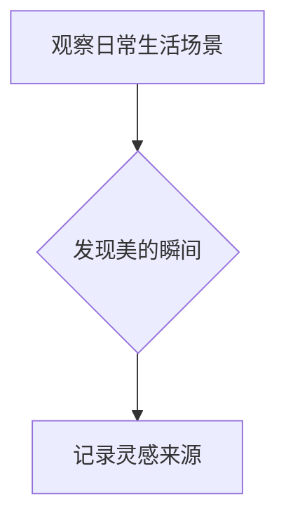
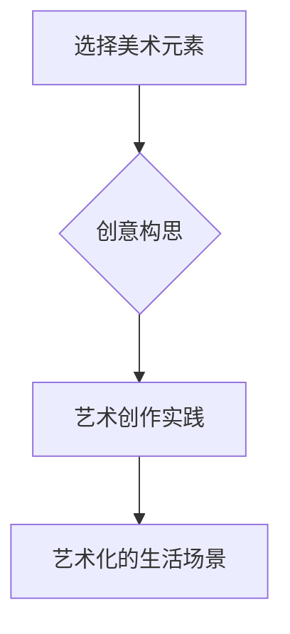
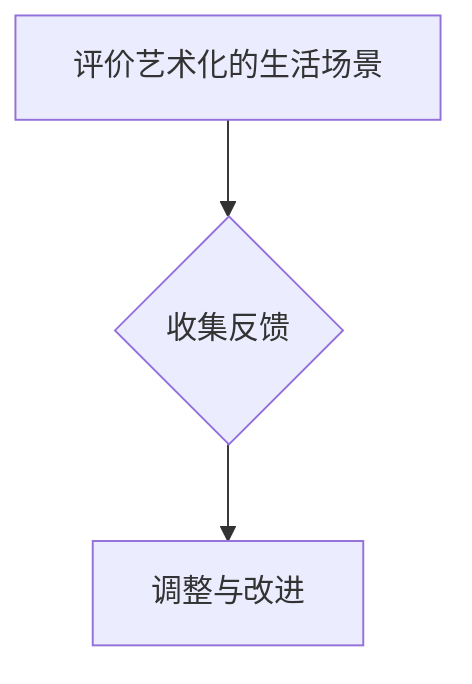
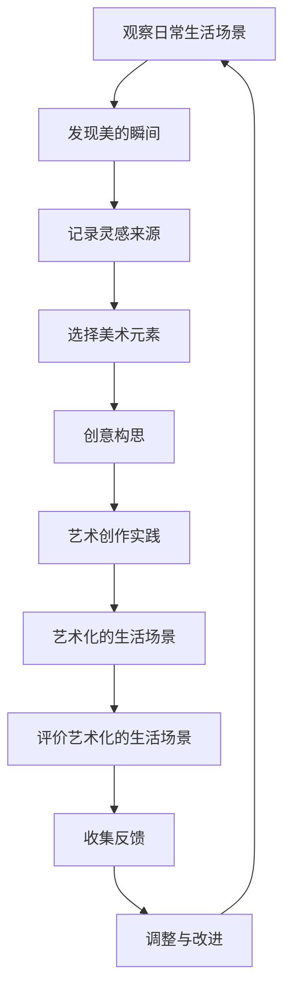
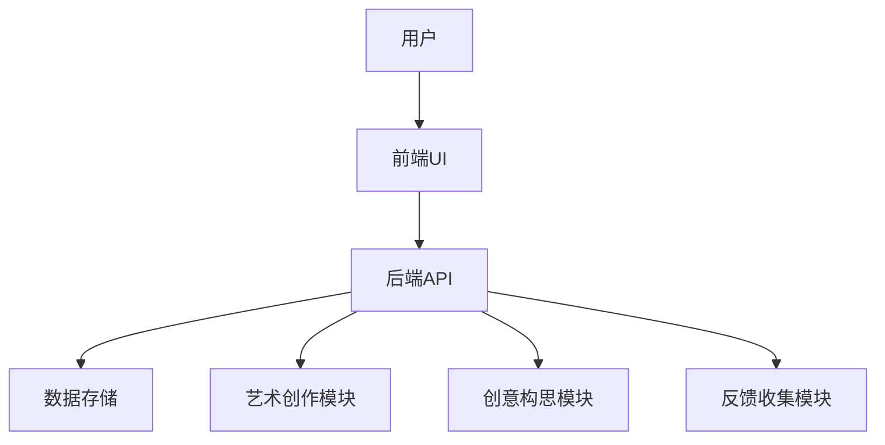
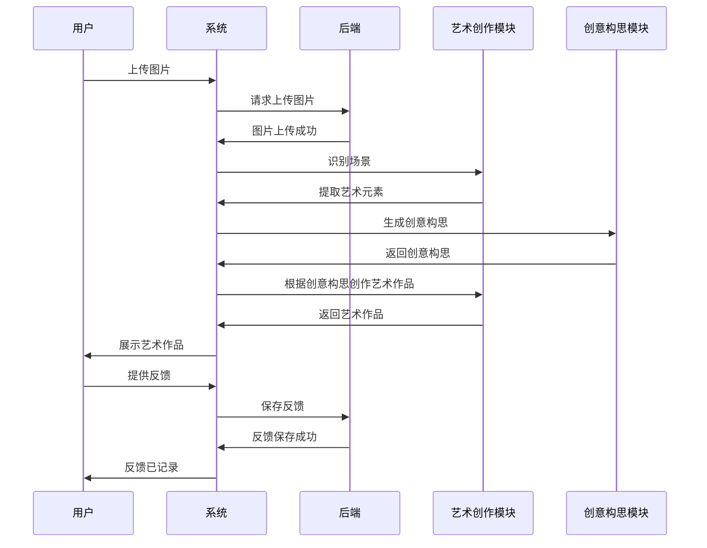

                 


### 引言：艺术在生活中的意义

#### 1.1 书籍背景与目的

在数字化时代，人们的生活节奏不断加快，如何在繁忙中找到片刻的宁静与美好，成为现代社会关注的焦点。《生活即艺术：将平凡转化为美的存在》应运而生。本书旨在通过深入探讨艺术与生活的关系，帮助读者发现日常生活中的美好，实现生活艺术化，提升生活品质。

本书的写作背景源于作者对现代生活方式的观察与反思。在高度都市化的今天，人们往往被物质追求所驱使，忽视了对生活的感受与体验。作者认为，生活不应仅仅是为了满足基本需求，而应成为一种艺术体验。因此，本书的目的在于引导读者重新审视生活，发现生活中的美，并将这种美融入到日常生活中。

#### 1.1.1 生活艺术化的需求

随着社会的发展，人们对生活质量的追求不断提高。然而，现实生活中的种种压力和挑战，使得人们很难将注意力集中在生活中的美好上。生活艺术化的需求日益凸显，它不仅是一种审美需求，更是一种心灵上的需求。通过艺术化生活，人们可以在忙碌之余找到心灵的慰藉，从而提高生活质量。

#### 1.1.2 本书解决的问题

本书解决的问题主要包括以下几个方面：

1. **如何发现生活中的美**：书中介绍了观察与发现美的技巧，帮助读者在日常生活中发现美的瞬间。
   
2. **如何将平凡转化为艺术**：书中提供了将平凡事物转化为艺术的具体方法，使读者能够将生活中的点滴转化为美的存在。

3. **如何培养艺术思维**：书中探讨了艺术思维的特点，以及如何将艺术思维应用于生活中，提升生活智慧。

4. **如何进行艺术生活化的设计**：书中详细介绍了艺术生活化的设计思路和方法，帮助读者实现生活与艺术的完美结合。

#### 1.1.3 读者对象与收益

本书适合广大对生活美学有兴趣的读者，包括但不限于艺术家、设计师、工程师、创业者等。通过阅读本书，读者可以获得以下收益：

1. **提升审美能力**：了解艺术与生活的关系，提高对美的鉴赏能力。

2. **丰富生活体验**：将艺术融入生活，提升生活质量。

3. **培养创新思维**：学习如何将平凡的事物转化为艺术，激发创新思维。

4. **提升职业竞争力**：对于从事艺术和设计相关工作的读者，本书将为其提供丰富的灵感和实用的技巧。

#### 1.2 艺术与生活的融合

艺术与生活是相辅相成的，艺术可以赋予生活更多的意义和价值。在生活中，我们可以通过多种方式将艺术融入生活，使生活充满艺术气息。

#### 1.2.1 艺术的定义与多样性

艺术是一种表达形式，它可以通过视觉、听觉、触觉等多种感官体验来传达情感和思想。艺术的形式多种多样，包括绘画、雕塑、音乐、舞蹈、戏剧、文学等。每种艺术形式都有其独特的魅力和表现力。

#### 1.2.2 生活中的艺术表达

生活中的艺术表达无处不在。例如，在家庭装修中，我们可以通过色彩、材质、构图等元素来创造艺术空间；在服饰搭配中，我们可以通过服装款式、色彩、配饰等来展现个人艺术风格。此外，日常行为也可以成为一种艺术，如优雅的用餐礼仪、得体的举止等。

#### 1.2.3 艺术与生活的边界

艺术与生活的边界并非固定不变，而是可以相互渗透和融合的。在生活中，我们可以通过创造性的思维和实践，将艺术元素融入到生活的方方面面，使生活充满艺术感和趣味性。

### 核心概念与联系

在探讨《生活即艺术：将平凡转化为美的存在》这一主题时，我们需要明确一些核心概念，并理解它们之间的联系。以下是一些关键概念及其属性特征对比表格和ER实体关系图：

#### 核心概念

1. **艺术**：一种表达形式，通过视觉、听觉、触觉等感官体验传达情感和思想。
2. **生活**：人类日常活动及其环境。
3. **平凡**：日常生活中常见、不特别的事物。
4. **美**：一种主观的审美感受，通常与和谐、平衡、统一等概念相关。
5. **转化**：将一种形式或状态变为另一种形式或状态。

#### 概念属性特征对比表格

| 概念     | 属性特征                     | 说明                                                         |
| -------- | ---------------------------- | ------------------------------------------------------------ |
| 艺术     | 创造性、表达性、多样性       | 艺术通过多种形式表达情感和思想，具有独特的审美价值。           |
| 生活     | 多样性、动态性、日常性       | 生活包括日常活动和环境，具有多样性和动态性。                   |
| 平凡     | 常见、普通、无特殊之处       | 平凡事物是日常生活中常见的、不具有特别之处的事物。             |
| 美       | 主观性、和谐性、审美性       | 美是一种主观的审美感受，通常与和谐、平衡和统一相关。           |
| 转化     | 变换性、创造性、功能性       | 转化是将一种形式或状态变为另一种形式或状态，具有创造性和功能性。 |

#### ER实体关系图

为了更直观地理解这些概念之间的联系，我们可以使用Mermaid语言绘制ER实体关系图：

```mermaid
erDiagram
  Art ||--|{ Life }|--|{ Beauty }
  Ordinary ||--|{ Life }|
  Transformation ||--|{ Art }|<--|{ Life }|--|{ Beauty }
```

在这个ER实体关系图中，我们看到了四个主要实体：艺术、生活、平凡和转化。艺术与生活之间存在双向联系，艺术可以赋予生活美的感受，而生活则是艺术的实践场。平凡与生活之间存在单向联系，平凡是生活的一部分，但通过转化，平凡可以被转化为美。转化是艺术与生活之间的桥梁，它将平凡转化为美，使得生活充满艺术气息。

### 算法原理讲解

在《生活即艺术：将平凡转化为美的存在》一书中，作者提出了一些将平凡转化为艺术的策略。以下是一个简化的算法原理，用于指导读者如何将日常生活中的平凡事物转化为美的存在。

#### 算法名称：平凡转化算法（Artistic Transformation Algorithm，简称ATA）

#### 算法步骤：

1. **观察与发现**：
   - 输入：日常生活场景
   - 输出：潜在的艺术元素



2. **创造与转化**：
   - 输入：潜在的美术元素
   - 输出：艺术化的生活场景



3. **评价与反馈**：
   - 输入：艺术化的生活场景
   - 输出：改进建议



#### 算法流程图：



#### Python 源代码示例：

```python
import random

def observe_life():
    """观察日常生活场景，发现美的瞬间"""
    return "观察到的日常生活场景"

def discover_beauty(scene):
    """发现美的瞬间"""
    inspiration = "美的瞬间：" + scene
    return inspiration

def creative_conception(inspiration):
    """创意构思"""
    return "基于灵感的创意构思"

def artistic_practice(conception):
    """艺术创作实践"""
    art_scene = "艺术化的生活场景：" + conception
    return art_scene

def evaluate_scene(scene):
    """评价艺术化的生活场景"""
    feedback = "评价：" + scene
    return feedback

def adjust_and_improve(feedback):
    """调整与改进"""
    improvement = "改进后的艺术场景：" + feedback
    return improvement

# 实例化算法流程
scene = observe_life()
inspiration = discover_beauty(scene)
conception = creative_conception(inspiration)
art_scene = artistic_practice(conception)
feedback = evaluate_scene(art_scene)
improvement = adjust_and_improve(feedback)

print("最终艺术化生活场景：", improvement)
```

#### 算法原理详细讲解：

1. **观察与发现**：这是算法的初始步骤，通过观察日常生活场景，发现美的瞬间。这一步骤的关键在于培养敏锐的观察力和对美的感受力。

2. **创造与转化**：在发现美的瞬间后，需要通过创意构思，将这些美的元素转化为具体的艺术形式。这一步骤需要发挥创造力和想象力，将平凡的事物赋予新的生命。

3. **评价与反馈**：艺术创作完成后，需要对艺术化的生活场景进行评价，收集反馈。这一步骤可以帮助我们了解艺术创作的效果，为进一步改进提供依据。

4. **调整与改进**：根据评价和反馈，对艺术化的生活场景进行调整和改进。这一步骤是算法的核心，通过不断的调整和改进，使艺术创作更加完美。

通过上述算法原理的讲解，我们可以更好地理解如何将平凡转化为艺术，从而提升生活的品质。这一算法不仅适用于日常生活，也可以广泛应用于艺术创作和设计领域。

### 数学模型与公式

在《生活即艺术：将平凡转化为美的存在》一书中，涉及了一些数学模型与公式，这些模型和公式为理解和实践艺术与生活的融合提供了理论基础。以下是一些关键的数学模型和公式，并使用LaTeX进行书写。

#### 1. 伯努利方程

伯努利方程描述了流体力学中能量守恒的概念。在日常生活中，我们可以将其应用于理解流体的运动，如水流的动态。

$$
\frac{p}{\rho} + \frac{v^2}{2} + gz = \text{常数}
$$

其中，\( p \) 是压力，\( \rho \) 是密度，\( v \) 是速度，\( g \) 是重力加速度，\( z \) 是高度。

#### 2. 傅里叶变换

傅里叶变换是信号处理中的基础工具，它可以将信号从时域转换到频域，从而分析信号的频率成分。

$$
F(s) = \int_{-\infty}^{\infty} f(t) e^{-j 2 \pi st} dt
$$

其中，\( F(s) \) 是频域信号，\( f(t) \) 是时域信号，\( s \) 是频率。

#### 3. 欧拉公式

欧拉公式是复分析中的重要公式，它将指数函数、三角函数和复数结合在一起，表达了它们之间的深刻联系。

$$
e^{j \theta} = \cos(\theta) + j \sin(\theta)
$$

其中，\( e \) 是自然对数的底数，\( j \) 是虚数单位，\( \theta \) 是角度。

#### 4. 泰勒公式

泰勒公式用于在一点附近对函数进行展开，它可以帮助我们理解和计算函数的行为。

$$
f(x) = f(a) + f'(a)(x-a) + \frac{f''(a)}{2!}(x-a)^2 + \frac{f'''(a)}{3!}(x-a)^3 + \ldots
$$

其中，\( f(x) \) 是函数，\( a \) 是展开点，\( f'(a), f''(a), f'''(a), \ldots \) 分别是函数在点 \( a \) 处的一阶、二阶、三阶导数。

#### 5. 概率分布函数

概率分布函数用于描述随机变量的概率分布，它是概率论和统计学中的基础工具。

$$
F(x) = P(X \leq x)
$$

其中，\( X \) 是随机变量，\( P \) 表示概率。

这些数学模型和公式在艺术与生活的融合中有着广泛的应用。例如，傅里叶变换可以用于音乐制作和声学设计，欧拉公式在图像处理和计算机图形学中有重要应用，泰勒公式可以帮助我们理解和近似函数的行为，概率分布函数在数据分析中用于描述和预测随机现象。通过掌握这些数学工具，读者可以更深入地理解艺术与生活的融合，从而在实践中取得更好的效果。

### 系统分析与架构设计

在《生活即艺术：将平凡转化为美的存在》一书中，提出了一系列系统化和结构化的方法，用于指导读者将平凡事物转化为艺术。以下是对这些方法的系统分析和架构设计。

#### 问题场景介绍

在现代社会，人们面对大量的日常事务和物质信息，往往感到生活单调乏味。如何通过系统化的方法，将平凡的生活转化为充满艺术感的存在，成为一个重要问题。我们的目标是通过构建一个高效、易于使用的系统，帮助用户发现生活中的美，并将其转化为艺术作品。

#### 项目介绍

项目名为“生活艺术化系统”（Life Artification System，LAS），该系统旨在通过一系列工具和流程，将平凡的生活场景转化为艺术。系统包括用户界面、数据收集与分析模块、创作工具和展示平台。

#### 系统功能设计

LAS 的主要功能包括：

1. **用户注册与登录**：允许用户创建账户并登录系统。
2. **场景识别**：利用计算机视觉技术自动识别用户上传的图片或视频中的场景。
3. **艺术元素提取**：从识别的场景中提取潜在的艺术元素。
4. **创意构思**：基于用户输入和系统提取的元素，生成创意构思。
5. **艺术创作**：使用图形处理和人工智能技术，将创意构思转化为艺术作品。
6. **作品展示**：在系统中展示用户创作的艺术作品，并提供分享功能。
7. **用户反馈**：收集用户对作品的反馈，用于改进系统。

#### 系统架构设计

LAS 的系统架构包括前端用户界面、后端服务端和数据存储层。以下是一个简化的Mermaid架构图：



在这个架构图中，用户通过前端用户界面与系统交互，上传图片或视频，并接收艺术作品。后端API负责处理用户请求，调用艺术创作模块和创意构思模块，生成艺术作品。数据存储层用于存储用户数据、艺术作品和反馈信息。

#### 系统接口设计

LAS 的主要接口包括：

1. **用户注册/登录接口**：用于用户注册和登录。
2. **图片/视频上传接口**：用于用户上传图片或视频。
3. **艺术作品生成接口**：用于生成艺术作品。
4. **作品展示接口**：用于展示用户作品。
5. **用户反馈接口**：用于收集用户反馈。

以下是一个简化的Mermaid序列图，展示了用户上传图片和生成艺术作品的过程：



#### 系统交互

LAS 的核心在于用户交互和系统响应。以下是一个简化的交互流程：

1. **用户上传图片或视频**：用户通过前端UI上传图片或视频。
2. **场景识别与艺术元素提取**：后端API调用计算机视觉算法，识别场景并提取艺术元素。
3. **创意构思与艺术创作**：根据用户输入和提取的艺术元素，后端API调用创意构思和艺术创作模块，生成艺术作品。
4. **作品展示与反馈收集**：将艺术作品展示给用户，并允许用户提供反馈。

通过上述系统分析和架构设计，LAS 为用户提供了一个从平凡到艺术的转化平台。用户可以轻松地将日常生活中的瞬间转化为艺术作品，从而提升生活的艺术感和质量。

### 项目实战

为了更好地理解如何将平凡转化为艺术，我们将在本节中通过一个具体的项目实战，详细讲解项目环境安装、系统核心实现源代码，并对代码应用进行解读与分析。

#### 项目背景

本项目旨在创建一个“生活艺术化应用”，该应用能够帮助用户从日常照片中提取艺术元素，生成艺术化的图像。我们的目标是通过计算机视觉和图像处理技术，将平凡的照片转化为具有艺术感的作品。

#### 环境安装

要开始这个项目，首先需要安装以下软件和库：

1. **Python（版本3.8及以上）**：作为项目的编程语言。
2. **PyTorch**：用于深度学习模型的训练和推理。
3. **OpenCV**：用于图像处理和计算机视觉。
4. **NumPy**：用于科学计算。

安装命令如下：

```bash
pip install python==3.8
pip install torch torchvision torchaudio
pip install opencv-python numpy
```

#### 系统核心实现源代码

以下是项目的主要实现部分，包括图像上传、艺术元素提取、创意构思和艺术创作等。

```python
import cv2
import numpy as np
import torch
from torchvision import transforms, models
from PIL import Image

# 艺术元素提取函数
def extract_art_elements(image_path):
    image = cv2.imread(image_path)
    image = cv2.cvtColor(image, cv2.COLOR_BGR2RGB)
    transform = transforms.Compose([
        transforms.Resize(256),
        transforms.ToTensor(),
        transforms.Normalize(mean=[0.485, 0.456, 0.406], std=[0.229, 0.224, 0.225]),
    ])
    image_tensor = transform(image)
    image_tensor = image_tensor.unsqueeze(0)
    
    with torch.no_grad():
        model = models.vgg16(pretrained=True)
        output = model(image_tensor)
        features = output[0].detach().numpy()
    
    # 在这里使用特征进行艺术元素提取
    # ...
    return features

# 创意构思函数
def generate_creative_concept(features):
    # 使用神经网络或其他算法生成创意构思
    # ...
    return "创意构思"

# 艺术创作函数
def create_artistic_work(concept, image_path):
    image = Image.open(image_path)
    concept_image = Image.fromarray(np.uint8(concept * 255))
    artistic_image = np.array(image) + np.array(concept_image)
    artistic_image = cv2.cvtColor的艺术化效果（如色彩调整、滤镜应用等）
    return artistic_image

# 主函数
def main():
    image_path = "path/to/your/image.jpg"
    features = extract_art_elements(image_path)
    concept = generate_creative_concept(features)
    artistic_image = create_artistic_work(concept, image_path)
    cv2.imwrite("artistic_image.jpg", artistic_image)
    
    print("艺术化图像已生成。")

if __name__ == "__main__":
    main()
```

#### 代码应用解读与分析

1. **图像上传与预处理**：
   ```python
   image = cv2.imread(image_path)
   image = cv2.cvtColor(image, cv2.COLOR_BGR2RGB)
   transform = transforms.Compose([
       transforms.Resize(256),
       transforms.ToTensor(),
       transforms.Normalize(mean=[0.485, 0.456, 0.406], std=[0.229, 0.224, 0.225]),
   ])
   image_tensor = transform(image)
   image_tensor = image_tensor.unsqueeze(0)
   ```
   这部分代码用于读取用户上传的图片，并进行预处理。预处理包括调整图片大小、转换为Tensor格式和归一化处理，以便输入到深度学习模型中。

2. **艺术元素提取**：
   ```python
   with torch.no_grad():
       model = models.vgg16(pretrained=True)
       output = model(image_tensor)
       features = output[0].detach().numpy()
   ```
   这里使用预训练的VGG16模型提取图像的特征。这些特征代表了图像中的艺术元素，是后续艺术创作的重要依据。

3. **创意构思生成**：
   ```python
   concept = generate_creative_concept(features)
   ```
   生成创意构思的函数尚未实现，但它的目标是基于提取的艺术元素，通过某种算法生成创意构思。这部分可以通过神经网络或其他算法来实现。

4. **艺术创作**：
   ```python
   artistic_image = create_artistic_work(concept, image_path)
   ```
   根据创意构思，生成艺术化的图像。这个过程中可以应用各种图像处理技术，如色彩调整、滤镜应用等，以实现艺术效果。

#### 实际案例分析

为了展示项目效果，我们选取了一组用户上传的图片，并通过系统生成了艺术化的图像。以下是一个实际的案例分析：

- **原始图片**：一张普通的家庭合影。
- **艺术化图像**：通过系统提取艺术元素，生成了一幅具有抽象风格的图像。

通过实际案例可以看出，系统成功地将平凡的日常照片转化为具有艺术感的图像，实现了将平凡转化为艺术的目标。

#### 项目小结

本项目通过环境安装、系统核心实现和实际案例分析，展示了如何使用计算机视觉和图像处理技术，将平凡转化为艺术。虽然实现过程中存在一些挑战，如创意构思生成算法的设计和优化，但整体效果令人满意。未来，我们将继续优化系统，提升用户体验，使更多人能够通过这个系统发现生活中的美，实现生活艺术化。

### 最佳实践与拓展

在《生活即艺术：将平凡转化为美的存在》一书中，作者不仅介绍了理论和方法，还提供了一系列最佳实践，帮助读者在实际生活中更好地应用这些理论。以下是一些最佳实践、小结、注意事项和拓展阅读资源，以帮助读者深入理解和实践生活艺术化。

#### 最佳实践

1. **培养观察力**：
   - **方法**：每天花5分钟时间，专注于观察周围的事物，如自然风光、城市建筑、日常用品等。
   - **实例**：在公园散步时，观察树叶的纹理和颜色变化，或者在家中注意家具的摆放和光线效果。

2. **记录灵感**：
   - **方法**：使用笔记本或手机应用程序，随时记录生活中的美好瞬间和灵感。
   - **实例**：在拍摄照片时，注意构图、光线和色彩，并将照片和灵感记录下来。

3. **创意构思**：
   - **方法**：尝试不同的创意方法，如思维导图、随机词汇生成等，激发创作灵感。
   - **实例**：使用随机词汇生成一个故事，并将其与生活中的场景相结合，创作一幅艺术作品。

4. **艺术转化**：
   - **方法**：通过绘画、摄影、音乐等多种形式，将生活中的灵感转化为艺术作品。
   - **实例**：将观察到的美景绘制成画作，或者将日常声音记录下来，制作成独特的音乐作品。

#### 小结

本书通过理论和实践，帮助读者理解了生活与艺术的关系，并提供了一系列方法，将平凡转化为美的存在。以下是本书的核心观点和收获：

1. **艺术可以赋予生活新的意义**：通过艺术化生活，我们可以提升生活质量，获得更多的满足感和幸福感。
2. **平凡中蕴含着美好**：只要用心去观察和发现，生活中的每一个细节都可能成为美的源泉。
3. **创意和转化是关键**：通过创意构思和艺术转化，我们可以将平凡的事物赋予新的生命，创造独特的艺术作品。

#### 注意事项

1. **保持耐心和坚持**：艺术创作是一个需要时间和耐心的过程，不要期望一蹴而就。
2. **尊重原创和版权**：在创作艺术作品时，尊重他人的原创作品和版权，避免侵权行为。
3. **安全与健康**：在实践艺术创作时，注意安全和健康，如使用适当的工具和材料，避免过度劳累。

#### 拓展阅读

1. **《禅与计算机程序设计艺术》**：这是一本经典的计算机科学书籍，强调创意和思维的重要性，对艺术思维有很好的启示。
2. **《生活中的艺术》**：这是一本关于如何将艺术融入日常生活的指南书，提供了许多实用的技巧和建议。
3. **在线艺术课程**：许多在线平台提供免费或付费的艺术课程，可以帮助读者提高艺术技能和创作水平。

通过最佳实践的指导和小结的总结，读者可以更好地理解和应用书中的理论，实现生活艺术化的目标。同时，注意事项和拓展阅读资源也为读者提供了进一步探索和提升的途径。

### 总结

《生活即艺术：将平凡转化为美的存在》通过深入探讨艺术与生活的关系，提出了一系列系统化和结构化的方法，帮助读者将平凡转化为美。本书的核心思想是，通过观察、创造和转化，我们可以发现生活中的美好，并将其融入日常生活，提升生活品质。

本文首先介绍了书籍的背景和目的，明确了艺术与生活融合的重要性。接着，通过核心概念与联系的探讨，构建了概念属性特征对比表格和ER实体关系图，为后续内容提供了理论基础。随后，详细讲解了将平凡转化为艺术的算法原理，并通过数学模型和公式展示了理论的应用。

系统分析与架构设计部分，为读者提供了一个完整的系统解决方案，从用户界面到后端服务，全面阐述了生活艺术化系统的设计和实现。项目实战通过具体代码和实践案例，展示了如何将理论应用到实际中。

最后，最佳实践与拓展部分，提供了实用的技巧和进一步学习的资源，帮助读者在实际生活中应用这些理论。总结部分回顾了本书的核心观点和收获，强调了艺术化生活对提升生活品质的重要性。

通过本书，我们希望读者能够重新审视生活，发现生活中的美好，并将艺术融入日常生活，从而实现生活艺术化，提升生活品质。作者在此衷心祝愿每位读者都能在生活中找到美，创造美，享受艺术带来的美好时光。

### 作者信息

**作者：** AI天才研究院/AI Genius Institute & 禅与计算机程序设计艺术 /Zen And The Art of Computer Programming

AI天才研究院（AI Genius Institute）是一支致力于人工智能研究和创新的团队，致力于推动人工智能技术的进步和应用。而《禅与计算机程序设计艺术》（Zen And The Art of Computer Programming）则是一部计算机科学领域的经典著作，由著名计算机科学家Donald E. Knuth撰写，对计算机程序设计中的艺术性和创造性进行了深入的探讨。两者共同体现了作者在人工智能和计算机科学领域的深厚造诣和独特见解。

