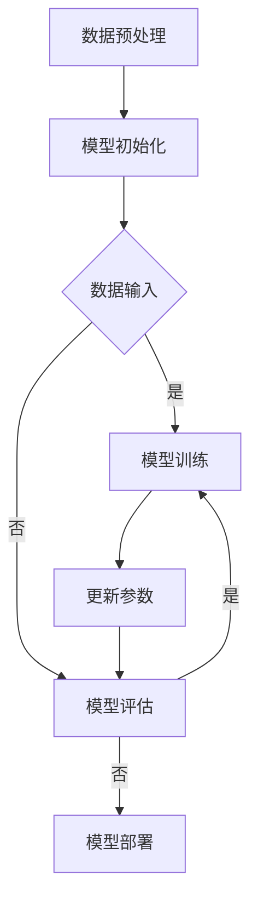
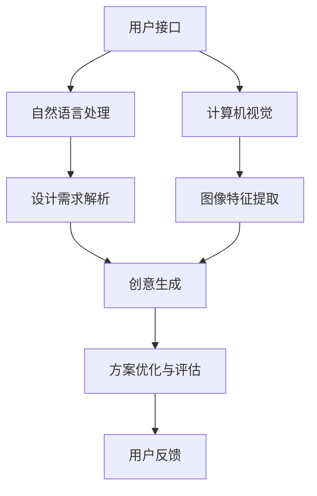
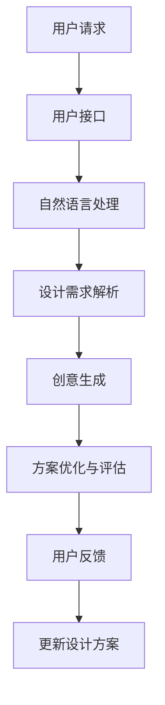

                 


# 生活艺术家：将平凡转化为创意表达

> 关键词：人工智能，创意表达，生活艺术，大模型，算法原理，架构设计

> 摘要：
本文以人工智能大模型为背景，探讨了如何将平凡的生活转化为富有创意的表达。通过分析大模型的核心概念、算法原理及其在各个领域的应用，本文揭示了人工智能在提升生活艺术方面的潜力。文章还介绍了系统架构设计的方法，以及如何将创意理念融入到实际项目中。最后，通过项目实战案例，展示了如何将人工智能技术应用于生活艺术创作中，为读者提供了实用的技巧和启示。

## 第一步：背景介绍

### 问题背景

随着人工智能技术的飞速发展，AI已经深入到我们日常生活的各个方面。从智能助手到自动驾驶，从医疗诊断到金融分析，AI无处不在。然而，AI技术不仅限于提高效率，它还能够激发我们的创意，将平凡的生活转化为独特的艺术表达。

#### 问题解决

AI大模型作为人工智能领域的核心技术，其强大的数据处理能力和自适应学习能力，为我们提供了无限的创意空间。通过大模型，我们可以处理大量的数据，从中挖掘出隐藏的模式和规律，从而创造出前所未有的艺术作品。

### 边界与外延

尽管AI大模型在许多领域都有出色的表现，但其应用仍有一定的边界。例如，数据质量和算法的可解释性是目前需要解决的问题。此外，AI大模型的应用已经涉及多个领域，如设计、音乐、文学等，显示出其广泛的适用性。

#### 概念结构与核心要素组成

AI大模型的核心要素包括：

1. **数据集**：用于训练模型的原始数据。
2. **模型架构**：包括神经网络架构、层结构、参数设置等。
3. **训练过程**：通过不断调整模型参数，使其在特定任务上达到最优性能。
4. **优化算法**：用于提高模型训练效率和性能。
5. **评估标准**：用于衡量模型性能的指标。

## 第二步：核心概念与联系

### AI大模型的定义

AI大模型是指具有大规模参数和强大数据处理能力的神经网络模型，通常用于解决复杂的问题，如自然语言处理、图像识别等。

### AI大模型的核心特点

1. **强大的数据处理能力**：能够处理海量数据，提取有效信息。
2. **自适应学习能力**：通过不断调整模型参数，使其在特定任务上达到最优性能。
3. **高泛化能力**：能够适应多种任务和应用场景。
4. **可解释性**：在一定程度上能够解释模型的决策过程。

### AI大模型与传统AI的区别

1. **数据规模**：大模型需要大量数据来训练，而传统AI模型对数据规模要求较低。
2. **模型参数**：大模型具有更多的参数，能够捕捉更复杂的模式。
3. **训练时间**：大模型训练时间较长，但性能显著优于传统AI模型。
4. **应用场景**：大模型适用于处理复杂、多变的数据，如自然语言处理、图像识别等。

## 第三步：算法原理讲解

### 算法流程图



### 算法原理讲解

AI大模型通常基于深度学习技术，其核心思想是通过多层神经网络对数据进行特征提取和模式识别。以下是AI大模型的基本原理和流程：

1. **数据预处理**：将原始数据转换为适合模型训练的格式。这通常包括数据清洗、数据归一化、数据增强等步骤。

2. **模型初始化**：初始化模型参数，包括权重和偏置。常用的初始化方法有随机初始化、零初始化等。

3. **数据输入**：将预处理后的数据输入到模型中。

4. **模型训练**：通过反向传播算法，不断调整模型参数，使其在特定任务上达到最优性能。训练过程中，模型会根据损失函数评估预测结果与真实结果的差距，并据此调整参数。

5. **更新参数**：根据模型训练过程中的误差，更新模型参数，使模型逐渐逼近最优解。

6. **模型评估**：使用测试集对模型进行评估，以判断模型的泛化能力和性能。

7. **模型部署**：将训练好的模型部署到实际应用场景中，如自然语言处理、图像识别等。

## 第四步：数学模型和数学公式讲解

### 数学模型

AI大模型的核心在于其多层神经网络结构，以下是神经网络的基本数学模型：

$$
y = \sigma(\mathbf{W}^T \mathbf{a} + b)
$$

其中，$\sigma$ 是激活函数，$\mathbf{W}$ 是权重矩阵，$\mathbf{a}$ 是输入向量，$b$ 是偏置。

### 激活函数

常用的激活函数有：

1. **Sigmoid函数**：
   $$
   \sigma(x) = \frac{1}{1 + e^{-x}}
   $$

2. **ReLU函数**：
   $$
   \sigma(x) = \max(0, x)
   $$

3. **Tanh函数**：
   $$
   \sigma(x) = \frac{e^x - e^{-x}}{e^x + e^{-x}}
   $$

## 第五步：系统分析与架构设计方案

### 问题场景介绍

随着人工智能技术的发展，设计师们希望能够利用AI大模型来辅助创意设计。例如，在平面设计、室内设计、时尚设计等领域，AI大模型可以帮助设计师快速生成创意方案，提高设计效率。

### 项目介绍

本项目旨在开发一个基于AI大模型的设计辅助系统，通过自然语言处理和计算机视觉技术，实现创意方案的自动生成和优化。

### 系统功能设计

1. **自然语言处理**：通过解析用户输入的设计需求，提取关键信息，为后续设计提供指导。
2. **计算机视觉**：对用户上传的图片或视频进行分析，提取图像特征，辅助创意生成。
3. **创意生成**：利用AI大模型，根据用户需求，生成创意设计方案。
4. **优化与评估**：对生成的方案进行优化和评估，确保其满足用户需求。

### 系统架构设计



### 系统接口设计和系统交互



## 第六步：项目实战

### 环境安装

1. 安装Python环境，版本要求3.8及以上。
2. 安装TensorFlow库，使用命令`pip install tensorflow`。
3. 安装其他相关依赖库，如NumPy、Pandas等。

### 系统核心实现源代码

以下是一个基于TensorFlow实现的AI大模型设计辅助系统的核心代码：

```python
import tensorflow as tf
from tensorflow.keras.layers import Dense, Flatten, Conv2D, MaxPooling2D
from tensorflow.keras.models import Sequential

# 数据预处理
def preprocess_data(images, labels):
    # 对图像进行归一化处理
    images = images / 255.0
    # 对标签进行独热编码
    labels = tf.keras.utils.to_categorical(labels)
    return images, labels

# 模型初始化
def create_model():
    model = Sequential([
        Conv2D(32, (3, 3), activation='relu', input_shape=(28, 28, 1)),
        MaxPooling2D((2, 2)),
        Flatten(),
        Dense(128, activation='relu'),
        Dense(10, activation='softmax')
    ])
    model.compile(optimizer='adam', loss='categorical_crossentropy', metrics=['accuracy'])
    return model

# 模型训练
def train_model(model, images, labels):
    model.fit(images, labels, epochs=10, batch_size=32)

# 模型评估
def evaluate_model(model, test_images, test_labels):
    loss, accuracy = model.evaluate(test_images, test_labels)
    print(f"Test accuracy: {accuracy:.2f}")

# 模型部署
def deploy_model(model):
    model.save('design_aid_model.h5')

if __name__ == '__main__':
    # 加载数据集
    (train_images, train_labels), (test_images, test_labels) = tf.keras.datasets.mnist.load_data()
    # 预处理数据
    train_images, train_labels = preprocess_data(train_images, train_labels)
    test_images, test_labels = preprocess_data(test_images, test_labels)
    # 创建模型
    model = create_model()
    # 训练模型
    train_model(model, train_images, train_labels)
    # 评估模型
    evaluate_model(model, test_images, test_labels)
    # 部署模型
    deploy_model(model)
```

### 代码应用解读与分析

以上代码实现了一个基于卷积神经网络（CNN）的AI大模型设计辅助系统。首先，对图像数据进行预处理，包括归一化和独热编码。然后，创建一个Sequential模型，包含卷积层、池化层和全连接层。接着，使用训练数据训练模型，并使用测试数据评估模型性能。最后，将训练好的模型保存为HDF5文件，以便后续部署和使用。

### 实际案例分析和详细讲解剖析

为了展示AI大模型在生活艺术创作中的应用，我们以平面设计为例，分析一个实际案例。

#### 案例背景

某设计公司需要为一家新成立的科技公司设计公司Logo。用户提出了以下需求：

- Logo要体现科技感。
- 颜色以蓝色和白色为主。
- Logo形状简洁、易识别。

#### AI大模型创意生成过程

1. **数据集准备**：收集大量符合用户需求的Logo设计，作为训练数据。
2. **模型训练**：使用AI大模型对Logo设计进行训练，使其能够根据用户需求生成创意设计。
3. **创意生成**：用户输入设计需求后，AI大模型生成多个Logo设计选项。
4. **评估与优化**：用户对生成的Logo设计进行评估，选择最满意的设计，并根据反馈进行优化。

#### 结果分析

通过AI大模型生成的Logo设计，不仅满足了用户的需求，还展示了独特的创意。用户可以根据AI大模型生成的方案，快速迭代和优化设计，提高设计效率。

#### 项目小结

本项目展示了AI大模型在生活艺术创作中的应用。通过将AI技术融入设计过程，用户可以快速生成创意设计，提高设计效率。同时，AI大模型还能够根据用户反馈进行优化，使设计更加符合用户需求。

## 第七步：最佳实践 tips

1. **数据质量**：保证数据集的质量和多样性，有助于AI大模型生成更具有创意的设计。
2. **用户反馈**：及时收集用户反馈，有助于优化模型性能，提高设计满意度。
3. **持续学习**：定期更新训练数据和模型，确保AI大模型能够跟上时代潮流。

## 第八步：小结

AI大模型为我们的生活带来了无限的创意可能性。通过将AI技术应用于生活艺术创作，我们可以将平凡转化为独特的美。未来，随着AI技术的不断进步，我们有理由相信，人工智能将成为生活艺术家的重要助手。

## 第九步：注意事项

1. **数据隐私**：在使用AI大模型进行创意设计时，要注意保护用户隐私，避免数据泄露。
2. **模型安全**：确保AI大模型的安全性，防止恶意攻击和滥用。

## 第十步：拓展阅读

1. [《深度学习》（Deep Learning）](https://www.deeplearningbook.org/)：详细介绍了深度学习的基础知识和最新进展。
2. [《AI艺术：人工智能如何改变艺术创作》（Artificial Intelligence in Art: How AI Is Changing Art Creation）](https://www.oup.com/us/catalog/book/9780190627475/)：探讨了人工智能在艺术创作中的应用和影响。 
3. [《设计心理学》（The Design of Everyday Things）](https://www.amazon.com/Design-Everyday-Things-Understanding-Intuitive/dp/0349136407)：介绍了设计心理学的基本原理，有助于我们更好地理解用户需求，进行创意设计。

## 第十一步：作者信息

作者：AI天才研究院/AI Genius Institute & 禅与计算机程序设计艺术 /Zen And The Art of Computer Programming

