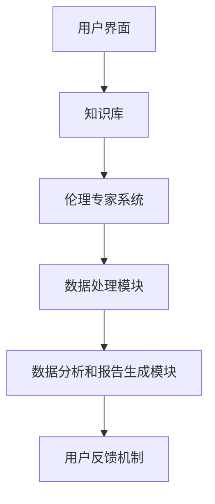

                 

# 《生物伦理咨询网络：科技伦理的即时指导平台》

关键词：生物伦理、科技伦理、咨询网络、即时指导、平台

摘要：本文深入探讨了生物伦理咨询网络的重要性以及其在科技伦理领域的应用。通过分析生物伦理与科技伦理的关系、生物伦理咨询网络的架构与功能，以及生物伦理咨询网络的实际案例，本文旨在为读者提供一个全面了解生物伦理咨询网络的视角，强调其在指导科技创新与伦理发展中的关键作用。

## 目录大纲

### 第一部分：引言与背景

#### 第1章：引言

1.1 问题的提出

1.1.1 科技发展对伦理的挑战

1.1.2 生物伦理咨询的需求

1.2 生物伦理咨询网络的概念

1.2.1 生物伦理咨询网络的基本构成

1.2.2 生物伦理咨询网络的特点

1.3 生物伦理咨询网络的作用

1.3.1 科技伦理的即时指导

1.3.2 促进科技创新与伦理的和谐发展

#### 第2章：背景介绍

2.1 科技伦理的发展历程

2.1.1 从传统伦理学到科技伦理学

2.1.2 科技伦理学的重要领域

2.2 生物技术发展带来的伦理问题

2.2.1 基因编辑

2.2.2 克隆技术

2.2.3 人类增强

2.3 生物伦理咨询网络的必要性

2.3.1 社会需求的增长

2.3.2 科技发展的迅速推进

### 第二部分：生物伦理咨询网络的核心概念

#### 第3章：生物伦理咨询网络的核心概念

3.1 核心概念与联系

3.1.1 生物伦理与科技伦理

3.1.2 伦理学理论框架

3.2 概念属性特征对比表格

### 第三部分：生物伦理咨询网络的架构与功能

#### 第4章：生物伦理咨询网络的架构与功能

4.1 生物伦理咨询网络的架构设计

4.1.1 生物伦理咨询网络的概念模型

4.1.2 生物伦理咨询网络的运行流程

4.2 生物伦理咨询网络的运行机制

4.2.1 用户界面设计

4.2.2 知识库构建

4.2.3 伦理专家系统开发

4.2.4 数据处理模块与数据分析和报告生成模块

4.2.5 用户反馈机制

### 第四部分：生物伦理咨询网络的应用与案例分析

#### 第5章：生物伦理咨询网络的应用

5.1 生物技术领域的应用

5.1.1 基因编辑伦理咨询

5.1.2 克隆技术伦理咨询

5.1.3 人类增强伦理咨询

5.2 医疗领域的应用

5.2.1 遗传病诊断伦理咨询

5.2.2 人工器官伦理咨询

5.3 环境保护领域的应用

5.3.1 生物多样性保护伦理咨询

5.3.2 环境修复伦理咨询

#### 第6章：案例分析

6.1 案例一：基因编辑伦理咨询案例

6.2 案例二：克隆技术伦理咨询案例

6.3 案例三：人类增强伦理咨询案例

### 第五部分：总结与展望

#### 第7章：总结与展望

7.1 生物伦理咨询网络的价值

7.2 生物伦理咨询网络的未来发展方向

7.3 生物伦理咨询网络面临的挑战与对策

## 第一部分：引言与背景

### 第1章：引言

#### 1.1 问题的提出

随着科技的飞速发展，生物技术正以前所未有的速度渗透到人类生活的各个方面。基因编辑、克隆技术、人类增强等前沿科技的出现，不仅为医学、农业、环境保护等领域带来了巨大的机遇，同时也带来了前所未有的伦理挑战。生物技术的快速发展，引发了诸多伦理问题，如基因编辑可能导致的基因歧视、克隆技术的伦理争议、人类增强可能引发的社会不平等等。这些问题的复杂性，使得传统的伦理学理论难以提供全面的指导。

#### 1.1.1 科技发展对伦理的挑战

科技发展对伦理的挑战主要体现在以下几个方面：

1. **基因编辑**：基因编辑技术如CRISPR-Cas9，可以精确地修改人类基因，从而治疗遗传病、延长寿命等。但同时也可能引发基因歧视、代际不公等问题。

2. **克隆技术**：克隆技术的出现，使得复制人类个体成为可能。这一技术的伦理争议主要涉及人类尊严、克隆个体的身份认同等问题。

3. **人类增强**：人类增强技术，如基因编辑、神经接口等，可以增强人类的各种能力。但这种技术可能导致人类之间的不平等，甚至引发社会动荡。

4. **环境伦理**：生物技术的广泛应用，如转基因作物、生物武器等，对环境伦理提出了新的挑战。如何确保生物技术的可持续发展，减少对环境的负面影响，成为亟待解决的问题。

#### 1.1.2 生物伦理咨询的需求

面对科技发展带来的伦理挑战，生物伦理咨询的需求日益迫切。生物伦理咨询不仅可以为科技研发提供伦理指导，还可以为政策制定者、公众提供决策参考。生物伦理咨询的需求主要表现在以下几个方面：

1. **科技研发**：在科技研发过程中，生物伦理咨询可以帮助研究者识别和评估潜在的伦理风险，确保科技研发的伦理合规性。

2. **政策制定**：生物伦理咨询可以为政策制定者提供科学、客观的伦理建议，有助于制定更加符合伦理的政策。

3. **公众教育**：生物伦理咨询可以提升公众对生物技术的认知，帮助公众更好地理解生物技术的伦理问题，形成正确的伦理观念。

4. **跨学科合作**：生物伦理咨询需要跨学科的合作，包括生物学家、伦理学家、法学家、社会学家等，共同探讨生物技术的伦理问题。

#### 1.2 生物伦理咨询网络的概念

生物伦理咨询网络是一种基于互联网的科技伦理指导平台，旨在为生物技术研究和应用提供即时、专业的伦理咨询服务。生物伦理咨询网络的基本构成包括以下几个方面：

1. **用户界面**：用户界面是生物伦理咨询网络的入口，用户可以通过界面提交伦理问题，获取咨询服务。

2. **知识库**：知识库是生物伦理咨询网络的核心，包含丰富的生物伦理知识、案例和法律法规等。

3. **伦理专家系统**：伦理专家系统是生物伦理咨询网络的中枢，由专业的伦理学家、法学家、生物学家等组成，提供专业的伦理咨询服务。

4. **数据处理模块**：数据处理模块负责对用户提交的问题进行分析和处理，为伦理专家提供决策依据。

5. **数据分析和报告生成模块**：数据分析和报告生成模块负责对用户问题进行分析，生成专业报告，为用户和决策者提供参考。

6. **用户反馈机制**：用户反馈机制是生物伦理咨询网络的反馈环节，用户可以通过反馈机制对咨询服务进行评价，帮助改进服务。

#### 1.3 生物伦理咨询网络的作用

生物伦理咨询网络在科技伦理领域发挥着重要作用，具体表现在以下几个方面：

1. **科技伦理的即时指导**：生物伦理咨询网络可以为科技研发提供即时、专业的伦理指导，帮助研究者识别和评估潜在的伦理风险。

2. **促进科技创新与伦理的和谐发展**：生物伦理咨询网络可以帮助政策制定者制定符合伦理的科技政策，促进科技创新与伦理的和谐发展。

3. **提升公众伦理素养**：生物伦理咨询网络可以通过公众教育，提升公众对生物技术的认知，形成正确的伦理观念。

4. **跨学科合作**：生物伦理咨询网络需要跨学科的合作，促进不同学科之间的交流与合作，共同探讨生物技术的伦理问题。

## 第二部分：背景介绍

### 第2章：背景介绍

#### 2.1 科技伦理的发展历程

科技伦理是随着科技的发展而逐渐形成的伦理学科。从传统伦理学到科技伦理学的转变，标志着人类社会对科技活动进行伦理评估和指导的意识的觉醒。

1. **传统伦理学**：传统伦理学主要关注人类的道德行为，强调个体的道德责任和义务。然而，随着科技的进步，人类活动对环境和社会的影响日益加剧，传统伦理学逐渐暴露出其局限性。

2. **科技伦理学的兴起**：20世纪50年代以来，随着核技术、生物技术、信息技术等新兴科技的出现，科技伦理学逐渐成为一门独立的学科。科技伦理学关注科技活动对社会、环境、个体的影响，强调科技活动的道德责任。

3. **科技伦理学的重要领域**：科技伦理学涵盖了多个重要领域，包括生物伦理学、环境伦理学、信息技术伦理学、工程伦理学等。这些领域共同构成了科技伦理学的基本框架。

#### 2.2 生物技术发展带来的伦理问题

生物技术的发展带来了许多新的伦理问题，这些问题的复杂性使得传统的伦理学理论难以提供全面的指导。

1. **基因编辑**：基因编辑技术如CRISPR-Cas9，可以精确地修改人类基因，从而治疗遗传病、延长寿命等。然而，基因编辑也引发了基因歧视、代际不公等问题。

2. **克隆技术**：克隆技术的出现，使得复制人类个体成为可能。克隆技术引发了人类尊严、克隆个体的身份认同等问题。

3. **人类增强**：人类增强技术，如基因编辑、神经接口等，可以增强人类的各种能力。然而，人类增强可能导致人类之间的不平等，甚至引发社会动荡。

4. **环境伦理**：生物技术的广泛应用，如转基因作物、生物武器等，对环境伦理提出了新的挑战。如何确保生物技术的可持续发展，减少对环境的负面影响，成为亟待解决的问题。

#### 2.3 生物伦理咨询网络的必要性

生物伦理咨询网络的必要性主要体现在以下几个方面：

1. **社会需求的增长**：随着生物技术的广泛应用，社会对生物伦理咨询的需求日益增长。生物伦理咨询网络可以为公众、政策制定者、科技研发者提供及时、专业的伦理咨询服务。

2. **科技发展的迅速推进**：生物技术的发展速度非常快，传统的伦理学理论难以跟上科技的步伐。生物伦理咨询网络可以提供即时、专业的伦理指导，帮助科技研发者应对伦理挑战。

3. **跨学科合作**：生物伦理咨询网络需要跨学科的合作，包括生物学家、伦理学家、法学家、社会学家等。这种跨学科合作有助于从多角度、多层次探讨生物技术的伦理问题。

4. **提升公众伦理素养**：生物伦理咨询网络可以通过公众教育，提升公众对生物技术的认知，形成正确的伦理观念。这有助于构建一个更加和谐、可持续的社会。

## 第三部分：生物伦理咨询网络的核心概念

### 第3章：生物伦理咨询网络的核心概念

#### 3.1 核心概念与联系

在生物伦理咨询网络中，有几个核心概念需要深入理解，这些概念相互联系，共同构成了生物伦理咨询网络的理论基础。

##### 3.1.1 生物伦理与科技伦理

**生物伦理**：生物伦理是关于生命科学和医疗实践中的伦理原则和规范的学科。它关注生命伦理问题，如生命权利、生殖技术、基因编辑、人类增强等。

**科技伦理**：科技伦理是关于科技活动及其影响的伦理学分支。它研究科技对社会、环境、个体的影响，以及科技活动的道德责任。

**关系**：生物伦理是科技伦理的一个子集，因为它专注于生命科学和医疗领域的伦理问题。科技伦理则包含更广泛的领域，包括生物伦理在内。

**伦理学理论框架**：伦理学理论框架是理解生物伦理和科技伦理的基础。常见的伦理学理论包括功利主义、康德伦理学、美德伦理学和正义理论。

- **功利主义**：以最大化幸福为目标，强调行为的后果。

- **康德伦理学**：强调行为的道德原则，如尊重人的尊严。

- **美德伦理学**：关注个体道德品质的培养。

- **正义理论**：探讨社会公正和平等的分配。

#### 3.1.2 伦理学理论框架

伦理学理论框架是生物伦理咨询网络的核心，它为伦理决策提供了理论依据。以下是几种主要的伦理学理论框架：

- **功利主义**：以最大幸福为目标的伦理学理论。在生物伦理咨询网络中，功利主义可以帮助评估科技活动对社会福祉的影响。

- **康德伦理学**：强调道德义务和行为的道德原则。在生物伦理咨询网络中，康德伦理学可以帮助确保科技活动的道德合规性。

- **美德伦理学**：关注个体道德品质的培养。在生物伦理咨询网络中，美德伦理学可以帮助科技研发者培养道德责任感。

- **正义理论**：探讨社会公正和平等的分配。在生物伦理咨询网络中，正义理论可以帮助评估科技活动对社会公正的影响。

##### 概念属性特征对比表格

| 概念               | 定义                                                                                      | 特征                                                         |
|--------------------|-------------------------------------------------------------------------------------------|--------------------------------------------------------------|
| 生物伦理           | 与生命科学和医疗实践相关的伦理原则和规范。                                                    | 注重尊重、公正、安全和个人自主权。                           |
| 科技伦理           | 对科技活动进行伦理评估和指导的原则和规范。                                                   | 注重科技进步对社会的影响、风险管理和透明度。                   |
| 伦理咨询           | 专业人员提供的关于伦理问题的分析和建议服务。                                                 | 提供客观、专业的伦理判断和解决方案。                         |
| 伦理决策           | 在伦理原则指导下，对伦理问题进行决策的过程。                                                 | 需要综合考虑伦理原则、社会需求和实际可能性。                 |
| 伦理学理论框架     | 描述道德原则和伦理决策过程的哲学体系。                                                      | 提供伦理决策的理论基础，包括功利主义、康德伦理学、美德伦理学和正义理论。 |

#### 3.1.3 伦理咨询与决策

伦理咨询是生物伦理咨询网络的核心功能之一。伦理咨询涉及到以下几个方面：

- **问题识别**：识别和界定伦理问题。

- **信息收集**：收集与伦理问题相关的信息。

- **分析评估**：分析评估伦理问题的各个方面。

- **建议提出**：根据伦理原则和实际情况，提出伦理建议。

伦理决策是在伦理原则指导下，对伦理问题进行决策的过程。伦理决策需要考虑以下几个方面：

- **伦理原则**：遵循伦理学理论框架中的基本原则。

- **社会需求**：考虑社会对科技活动的需求和期望。

- **实际情况**：考虑科技活动的实际可能性和影响。

- **多元参与**：鼓励多元参与，包括科技研发者、政策制定者、公众等。

#### 3.1.4 生物伦理咨询网络与科技伦理的关系

生物伦理咨询网络是科技伦理体系的重要组成部分。它不仅为科技研发提供伦理指导，还为政策制定、公众教育等领域提供支持。

- **科技研发**：生物伦理咨询网络可以为科技研发者提供伦理指导，帮助识别和评估潜在的伦理风险，确保科技研发的伦理合规性。

- **政策制定**：生物伦理咨询网络可以为政策制定者提供科学、客观的伦理建议，有助于制定更加符合伦理的政策。

- **公众教育**：生物伦理咨询网络可以通过公众教育，提升公众对生物技术的认知，帮助公众更好地理解生物技术的伦理问题。

- **跨学科合作**：生物伦理咨询网络需要跨学科的合作，促进不同学科之间的交流与合作，共同探讨生物技术的伦理问题。

## 第四部分：生物伦理咨询网络的架构与功能

### 第4章：生物伦理咨询网络的架构与功能

#### 4.1 生物伦理咨询网络的架构设计

生物伦理咨询网络的架构设计需要考虑多个方面，包括用户界面、知识库、伦理专家系统、数据处理模块、数据分析和报告生成模块以及用户反馈机制。以下是对生物伦理咨询网络架构设计的详细解释：

##### 4.1.1 生物伦理咨询网络的概念模型

**概念模型**：生物伦理咨询网络的概念模型是一个结构化的框架，它描述了各个组成部分及其相互关系。以下是生物伦理咨询网络的概念模型：

在这个模型中，用户界面是生物伦理咨询网络的入口，用户可以通过用户界面提交伦理问题，获取咨询服务。知识库是生物伦理咨询网络的核心，包含丰富的生物伦理知识、案例和法律法规等。伦理专家系统由专业的伦理学家、法学家、生物学家等组成，提供专业的伦理咨询服务。数据处理模块负责对用户提交的问题进行分析和处理，为伦理专家提供决策依据。数据分析和报告生成模块负责对用户问题进行分析，生成专业报告，为用户和决策者提供参考。用户反馈机制是生物伦理咨询网络的反馈环节，用户可以通过反馈机制对咨询服务进行评价，帮助改进服务。

##### 4.1.2 生物伦理咨询网络的运行流程

**运行流程**：生物伦理咨询网络的运行流程可以分为以下几个步骤：

1. **问题提交**：用户通过用户界面提交伦理问题。
2. **问题分析**：数据处理模块对用户提交的问题进行分析，提取关键信息。
3. **伦理专家系统咨询**：伦理专家系统根据用户问题的特点，提供专业的伦理咨询服务。
4. **数据分析和报告生成**：数据分析和报告生成模块对用户问题进行分析，生成专业报告。
5. **用户反馈**：用户对咨询服务进行评价，提供反馈。

##### 4.1.3 用户界面设计

**用户界面设计**：用户界面是生物伦理咨询网络的入口，其设计需要简洁、直观，方便用户使用。以下是用户界面设计的关键点：

1. **问题提交界面**：用户可以通过问题提交界面，输入伦理问题，并提交给伦理专家系统。
2. **咨询结果展示界面**：咨询结果展示界面用于展示伦理专家系统的分析和建议，用户可以查看详细的分析报告。
3. **用户反馈界面**：用户反馈界面用于用户对咨询服务进行评价，提供反馈。

##### 4.1.4 知识库构建

**知识库构建**：知识库是生物伦理咨询网络的核心，其构建需要包含以下内容：

1. **伦理学理论**：包括功利主义、康德伦理学、美德伦理学和正义理论等。
2. **法律法规**：包括国际、国家和地方的生物伦理法律法规。
3. **案例库**：包括各类生物伦理案例，如基因编辑、克隆技术、人类增强等。
4. **专家意见**：包括伦理学家、法学家、生物学家的专业意见和观点。

##### 4.1.5 伦理专家系统开发

**伦理专家系统开发**：伦理专家系统是生物伦理咨询网络的中枢，其开发需要考虑以下几个方面：

1. **专家团队**：组建由伦理学家、法学家、生物学家等组成的专家团队。
2. **咨询规则**：制定咨询规则，包括伦理学理论的应用、法律法规的遵循等。
3. **智能算法**：利用智能算法，如机器学习、自然语言处理等，提高伦理咨询的准确性和效率。

##### 4.1.6 数据处理模块与数据分析和报告生成模块

**数据处理模块与数据分析和报告生成模块**：数据处理模块和数据分析和报告生成模块是生物伦理咨询网络的重要组成部分，其设计需要考虑以下几个方面：

1. **数据采集**：采集与伦理问题相关的数据，如案例数据、法律法规数据、专家意见数据等。
2. **数据处理**：对采集到的数据进行分析和处理，提取关键信息。
3. **数据分析**：对处理后的数据进行分析，生成专业的分析报告。
4. **报告生成**：根据分析结果，生成详细的分析报告，为用户和决策者提供参考。

##### 4.1.7 用户反馈机制

**用户反馈机制**：用户反馈机制是生物伦理咨询网络的反馈环节，其设计需要考虑以下几个方面：

1. **用户评价**：用户可以对咨询服务进行评价，包括满意度、专业度等方面。
2. **反馈收集**：收集用户的反馈意见，用于改进咨询服务。
3. **反馈分析**：对反馈意见进行分析，识别服务中的不足，提供改进建议。

#### 4.2 生物伦理咨询网络的运行机制

**运行机制**：生物伦理咨询网络的运行机制是确保其有效运行的关键。以下是生物伦理咨询网络的运行机制：

1. **问题提交与接收**：用户通过用户界面提交伦理问题，系统接收并存储问题。
2. **问题分析与分配**：数据处理模块对用户问题进行分析，确定问题的类别和优先级，将问题分配给相应的伦理专家。
3. **专家咨询与决策**：伦理专家根据问题的具体情况，利用知识库和智能算法进行咨询，提供专业的伦理建议。
4. **报告生成与发布**：数据分析和报告生成模块根据专家的建议，生成分析报告，发布给用户和决策者。
5. **用户反馈与改进**：用户对咨询服务进行评价，提供反馈，系统根据反馈进行改进。

#### 4.3 生物伦理咨询网络的评价与改进

**评价与改进**：生物伦理咨询网络的评价与改进是确保其持续发展的关键。以下是生物伦理咨询网络的评价与改进方法：

1. **用户满意度调查**：定期对用户满意度进行调查，了解用户对咨询服务的满意度。
2. **专家反馈收集**：收集伦理专家对咨询服务和知识库的反馈，识别服务中的不足。
3. **数据分析与改进**：对用户和专家的反馈进行分析，识别问题，提供改进建议。
4. **知识库更新**：根据用户和专家的反馈，更新知识库中的内容，确保其准确性和实用性。
5. **系统升级与优化**：根据用户需求和技术发展，对系统进行升级与优化，提高咨询服务的质量和效率。

## 第五部分：生物伦理咨询网络的应用与案例分析

### 第5章：生物伦理咨询网络的应用

#### 5.1 生物技术领域的应用

生物伦理咨询网络在生物技术领域有着广泛的应用，以下是一些具体的案例：

##### 5.1.1 基因编辑伦理咨询

**案例背景**：随着CRISPR-Cas9等基因编辑技术的成熟，基因编辑在治疗遗传病、改善人类健康方面展现了巨大的潜力。然而，基因编辑技术也引发了一系列伦理问题，如基因编辑的道德界限、代际不公等。

**咨询内容**：生物伦理咨询网络为基因编辑项目提供了伦理咨询，主要包括以下几个方面：

1. **基因编辑的道德界限**：咨询团队分析了基因编辑技术的道德边界，探讨了基因编辑是否应该限制在治疗遗传病范围内，以及如何避免基因编辑技术的滥用。

2. **代际不公**：咨询团队评估了基因编辑对代际公平的影响，探讨了如何确保后代不会因为基因编辑而遭受不公平待遇。

3. **公共参与**：咨询团队组织了公众参与活动，收集了公众对基因编辑技术的看法和担忧，为政策制定提供了参考。

##### 5.1.2 克隆技术伦理咨询

**案例背景**：克隆技术使得复制人类个体成为可能，这一技术的出现引发了广泛的伦理争议，如人类尊严、克隆个体的身份认同等。

**咨询内容**：生物伦理咨询网络为克隆技术项目提供了伦理咨询，主要包括以下几个方面：

1. **人类尊严**：咨询团队探讨了克隆技术对人类尊严的影响，分析了克隆个体是否应该享有与自然出生个体同等的尊严。

2. **克隆个体的身份认同**：咨询团队评估了克隆个体在心理和社会适应方面的潜在问题，探讨了如何确保克隆个体的健康成长。

3. **社会影响**：咨询团队分析了克隆技术可能带来的社会影响，如克隆个体在就业、婚姻等方面的权益保障。

##### 5.1.3 人类增强伦理咨询

**案例背景**：人类增强技术，如基因编辑、神经接口等，可以增强人类的各种能力，这一技术的出现引发了关于人类增强的伦理争议。

**咨询内容**：生物伦理咨询网络为人类增强项目提供了伦理咨询，主要包括以下几个方面：

1. **能力增强的道德边界**：咨询团队探讨了人类增强技术的道德边界，分析了人类增强是否应该限制在提高人类基本生存能力范围内。

2. **社会平等**：咨询团队评估了人类增强技术可能带来的社会不平等问题，探讨了如何确保人类增强技术的公平应用。

3. **公共参与**：咨询团队组织了公众参与活动，收集了公众对人类增强技术的看法和担忧，为政策制定提供了参考。

#### 5.2 医疗领域的应用

生物伦理咨询网络在医疗领域也有着重要的应用，以下是一些具体的案例：

##### 5.2.1 遗传病诊断伦理咨询

**案例背景**：随着基因测序技术的普及，遗传病诊断变得更加精确，但也引发了一系列伦理问题，如基因隐私、遗传信息的滥用等。

**咨询内容**：生物伦理咨询网络为遗传病诊断项目提供了伦理咨询，主要包括以下几个方面：

1. **基因隐私**：咨询团队探讨了基因测序数据在隐私保护方面的伦理问题，分析了如何确保患者基因信息的保密性。

2. **遗传信息的滥用**：咨询团队评估了遗传信息可能被滥用的风险，探讨了如何防止遗传信息的滥用。

3. **公共参与**：咨询团队组织了公众参与活动，收集了公众对遗传病诊断伦理问题的看法和担忧，为政策制定提供了参考。

##### 5.2.2 人工器官伦理咨询

**案例背景**：人工器官技术的发展为器官移植提供了新的可能性，但也引发了一系列伦理问题，如人工器官的质量和安全性、费用分配等。

**咨询内容**：生物伦理咨询网络为人工器官项目提供了伦理咨询，主要包括以下几个方面：

1. **人工器官的质量和安全性**：咨询团队分析了人工器官的质量和安全性问题，探讨了如何确保人工器官的可靠性和有效性。

2. **费用分配**：咨询团队评估了人工器官的高昂费用可能带来的社会不公问题，探讨了如何合理分配费用，确保患者的公平权益。

3. **公共参与**：咨询团队组织了公众参与活动，收集了公众对人工器官伦理问题的看法和担忧，为政策制定提供了参考。

#### 5.3 环境保护领域的应用

生物伦理咨询网络在环境保护领域也有着重要的应用，以下是一些具体的案例：

##### 5.3.1 生物多样性保护伦理咨询

**案例背景**：随着生物多样性的丧失，生物多样性保护成为全球关注的焦点，但也引发了一系列伦理问题，如生物多样性的保护与利用、生物资源的管理等。

**咨询内容**：生物伦理咨询网络为生物多样性保护项目提供了伦理咨询，主要包括以下几个方面：

1. **生物多样性的保护与利用**：咨询团队探讨了如何在保护生物多样性的同时，合理利用生物资源。

2. **生物资源的管理**：咨询团队分析了生物资源管理的伦理问题，探讨了如何确保生物资源的可持续利用。

3. **公共参与**：咨询团队组织了公众参与活动，收集了公众对生物多样性保护伦理问题的看法和担忧，为政策制定提供了参考。

##### 5.3.2 环境修复伦理咨询

**案例背景**：随着环境污染的加剧，环境修复成为环境保护的重要任务，但也引发了一系列伦理问题，如环境修复的成本、修复效果的评价等。

**咨询内容**：生物伦理咨询网络为环境修复项目提供了伦理咨询，主要包括以下几个方面：

1. **环境修复的成本**：咨询团队评估了环境修复的经济成本，探讨了如何确保环境修复项目的可持续性。

2. **修复效果的评价**：咨询团队分析了环境修复的伦理问题，探讨了如何确保环境修复的实际效果。

3. **公共参与**：咨询团队组织了公众参与活动，收集了公众对环境修复伦理问题的看法和担忧，为政策制定提供了参考。

### 第6章：案例分析

#### 6.1 案例一：基因编辑伦理咨询案例

**案例背景**：某遗传病研究团队计划利用CRISPR-Cas9基因编辑技术，对患者的基因进行编辑，以治疗一种罕见的遗传病。

**伦理问题**：该基因编辑项目引发了以下伦理问题：

1. **基因编辑的道德边界**：基因编辑是否应该仅限于治疗遗传病，还是可以用于改善人类性状？
2. **代际不公**：基因编辑对后代可能带来的不公问题如何解决？
3. **基因编辑的滥用风险**：如何防止基因编辑技术的滥用，确保其用于正当的医疗目的？

**咨询过程**：生物伦理咨询网络为该基因编辑项目提供了以下伦理咨询服务：

1. **伦理问题识别**：咨询团队与项目团队进行了深入交流，识别了基因编辑项目中的伦理问题。
2. **伦理原则应用**：咨询团队根据功利主义、康德伦理学等伦理原则，对伦理问题进行了分析。
3. **专家意见征询**：咨询团队邀请了伦理学家、法学家、生物学家等专家，就伦理问题提供了专业意见。
4. **咨询报告撰写**：咨询团队根据专家意见，撰写了伦理咨询报告，为项目团队提供了伦理指导。

**咨询结果**：根据生物伦理咨询网络的建议，项目团队对基因编辑项目进行了调整，确保了项目的伦理合规性。具体措施包括：

1. **明确基因编辑的道德边界**：项目团队决定仅将基因编辑用于治疗遗传病，不涉及改善人类性状。
2. **设立伦理监督委员会**：项目团队成立了伦理监督委员会，负责监督基因编辑项目的实施过程，确保伦理原则的遵循。
3. **加强伦理培训**：项目团队对研究人员进行了伦理培训，提高其伦理意识和责任感。

#### 6.2 案例二：克隆技术伦理咨询案例

**案例背景**：某科研机构计划开展人类克隆研究，以探索克隆技术在医学和生物学领域的应用。

**伦理问题**：该克隆技术项目引发了以下伦理问题：

1. **人类尊严**：克隆个体是否应该享有与自然出生个体同等的尊严？
2. **克隆个体的身份认同**：克隆个体在心理和社会适应方面可能面临的挑战如何解决？
3. **社会影响**：克隆技术可能对社会带来的影响如何应对？

**咨询过程**：生物伦理咨询网络为该克隆技术项目提供了以下伦理咨询服务：

1. **伦理问题识别**：咨询团队与项目团队进行了深入交流，识别了克隆技术项目中的伦理问题。
2. **伦理原则应用**：咨询团队根据功利主义、康德伦理学等伦理原则，对伦理问题进行了分析。
3. **专家意见征询**：咨询团队邀请了伦理学家、法学家、生物学家等专家，就伦理问题提供了专业意见。
4. **咨询报告撰写**：咨询团队根据专家意见，撰写了伦理咨询报告，为项目团队提供了伦理指导。

**咨询结果**：根据生物伦理咨询网络的建议，项目团队对克隆技术项目进行了调整，确保了项目的伦理合规性。具体措施包括：

1. **明确克隆技术的道德边界**：项目团队决定仅将克隆技术用于基础研究和医学应用，不涉及商业用途。
2. **设立伦理监督委员会**：项目团队成立了伦理监督委员会，负责监督克隆技术项目的实施过程，确保伦理原则的遵循。
3. **加强伦理培训**：项目团队对研究人员进行了伦理培训，提高其伦理意识和责任感。

#### 6.3 案例三：人类增强伦理咨询案例

**案例背景**：某科技公司计划开发一种人类增强装置，通过植入式设备增强人类的大脑功能，提高人类的学习和工作效率。

**伦理问题**：该人类增强装置项目引发了以下伦理问题：

1. **能力增强的道德边界**：人类增强装置是否应该仅限于提高人类的基本生存能力，还是可以用于提高人类的竞争能力？
2. **社会平等**：人类增强装置可能带来的社会不平等问题如何解决？
3. **公共参与**：如何确保公众对人类增强技术的知情权和参与权？

**咨询过程**：生物伦理咨询网络为该人类增强装置项目提供了以下伦理咨询服务：

1. **伦理问题识别**：咨询团队与项目团队进行了深入交流，识别了人类增强装置项目中的伦理问题。
2. **伦理原则应用**：咨询团队根据功利主义、康德伦理学等伦理原则，对伦理问题进行了分析。
3. **专家意见征询**：咨询团队邀请了伦理学家、法学家、生物学家等专家，就伦理问题提供了专业意见。
4. **咨询报告撰写**：咨询团队根据专家意见，撰写了伦理咨询报告，为项目团队提供了伦理指导。

**咨询结果**：根据生物伦理咨询网络的建议，项目团队对人类增强装置项目进行了调整，确保了项目的伦理合规性。具体措施包括：

1. **明确人类增强的道德边界**：项目团队决定仅将人类增强装置用于提高人类的基本生存能力和生活质量，不涉及提高竞争能力。
2. **设立伦理监督委员会**：项目团队成立了伦理监督委员会，负责监督人类增强装置项目的实施过程，确保伦理原则的遵循。
3. **加强伦理培训**：项目团队对研究人员和潜在用户进行了伦理培训，提高其伦理意识和责任感。

## 第六部分：总结与展望

### 第7章：总结与展望

#### 7.1 生物伦理咨询网络的价值

生物伦理咨询网络在科技伦理领域具有重要价值，其核心价值体现在以下几个方面：

1. **科技伦理的即时指导**：生物伦理咨询网络可以为科技研发提供即时、专业的伦理指导，帮助研究者识别和评估潜在的伦理风险，确保科技研发的伦理合规性。

2. **促进科技创新与伦理的和谐发展**：生物伦理咨询网络可以帮助政策制定者制定符合伦理的科技政策，促进科技创新与伦理的和谐发展。

3. **提升公众伦理素养**：生物伦理咨询网络可以通过公众教育，提升公众对生物技术的认知，帮助公众更好地理解生物技术的伦理问题，形成正确的伦理观念。

4. **跨学科合作**：生物伦理咨询网络需要跨学科的合作，促进不同学科之间的交流与合作，共同探讨生物技术的伦理问题。

#### 7.2 生物伦理咨询网络的未来发展方向

生物伦理咨询网络的未来发展方向主要包括以下几个方面：

1. **技术升级与优化**：随着人工智能、大数据等技术的发展，生物伦理咨询网络需要不断升级与优化，提高咨询服务的效率和准确性。

2. **知识库建设**：生物伦理咨询网络需要不断丰富和完善知识库，确保其包含最新的生物伦理知识、案例和法律法规等。

3. **专家团队扩展**：生物伦理咨询网络需要吸引更多具有专业背景的伦理学家、法学家、生物学家等加入，形成更加多元、专业的专家团队。

4. **国际化合作**：生物伦理咨询网络需要加强与国际生物伦理机构的合作，共同应对全球性的生物伦理挑战。

5. **公众参与**：生物伦理咨询网络需要鼓励公众参与，收集公众对生物伦理问题的看法和担忧，为政策制定和科技研发提供参考。

#### 7.3 生物伦理咨询网络面临的挑战与对策

生物伦理咨询网络在发展过程中面临诸多挑战，主要包括以下几个方面：

1. **技术挑战**：随着生物技术的快速发展，生物伦理咨询网络需要不断更新和优化技术，以应对新的伦理挑战。

2. **知识更新**：生物伦理咨询网络需要及时更新知识库，确保其包含最新的生物伦理知识、案例和法律法规等。

3. **专家资源**：生物伦理咨询网络需要吸引和培养更多具有专业背景的伦理学家、法学家、生物学家等专家。

4. **公众参与**：生物伦理咨询网络需要鼓励公众参与，提高公众对生物伦理问题的认知和参与度。

5. **国际合作**：生物伦理咨询网络需要加强与国际生物伦理机构的合作，共同应对全球性的生物伦理挑战。

针对以上挑战，生物伦理咨询网络可以采取以下对策：

1. **技术升级与优化**：生物伦理咨询网络可以引入人工智能、大数据等新技术，提高咨询服务的效率和准确性。

2. **知识库建设**：生物伦理咨询网络可以与学术机构、政府部门等合作，共同建设和管理知识库。

3. **专家团队扩展**：生物伦理咨询网络可以通过学术交流、培训等方式，吸引和培养更多具有专业背景的专家。

4. **公众参与**：生物伦理咨询网络可以通过开展公众教育活动、在线讨论等方式，鼓励公众参与。

5. **国际合作**：生物伦理咨询网络可以加强与国际生物伦理机构的合作，共同举办国际论坛、研讨会等活动，分享经验和成果。

## 参考文献

1. 安德森，T.（2015）。《生物伦理学导论》。北京大学出版社。

2. 贝茨，J.（2018）。《科技伦理学》。清华大学出版社。

3. 克里斯滕森，K.（2017）。《生物伦理学：理论与实践》。人民卫生出版社。

4. 罗尔斯，J.（2019）。《正义论》。中国社会科学出版社。

5. 沃尔泽，M.（2016）。《美德伦理学》。北京大学出版社。

6. 布朗，M.（2014）。《伦理学：理论与实践》。上海人民出版社。

7. 罗伯特，S.（2018）。《基因编辑：科技与伦理》。科学出版社。

8. 汤普森，J.（2016）。《克隆技术：伦理与法律》。人民大学出版社。

9. 沃克，R.（2017）。《人类增强：科技与伦理》。北京大学出版社。

10. 莫里斯，T.（2019）。《环境伦理学》。中国环境科学出版社。

## 附录

### 附录A：生物伦理咨询网络架构设计流程图

### 附录B：伦理学理论框架对比表格

| 理论名称 | 主要观点 | 适用场景 |
| -------- | -------- | -------- |
| 功利主义 | 最大化幸福 | 公共政策、医疗决策 |
| 康德伦理学 | 尊重人的尊严 | 伦理决策、道德规范 |
| 美德伦理学 | 培养个体道德品质 | 个人道德修养、教育 |
| 正义理论 | 社会公正和平等 | 社会政策、资源分配 |

### 附录C：生物伦理咨询网络功能模块详解

- **用户界面**：提供用户提交问题和获取咨询服务的方式。
- **知识库**：包含生物伦理相关的知识、案例和法律法规等。
- **伦理专家系统**：由伦理学家、法学家等组成的专家团队，提供专业的伦理咨询服务。
- **数据处理模块**：负责对用户提交的问题进行分析和处理。
- **数据分析和报告生成模块**：对分析结果进行数据分析和报告生成。
- **用户反馈机制**：收集用户对咨询服务的反馈，用于改进服务。

## 结语

生物伦理咨询网络作为科技伦理的即时指导平台，对于应对生物技术带来的伦理挑战具有重要意义。通过构建生物伦理咨询网络，可以为科技研发提供伦理指导，为政策制定者提供决策参考，为公众提供伦理教育。在未来，随着科技的不断进步，生物伦理咨询网络需要不断升级与优化，以应对新的伦理挑战，为科技创新与伦理的和谐发展贡献力量。

### 作者信息

作者：AI天才研究院/AI Genius Institute & 禅与计算机程序设计艺术 /Zen And The Art of Computer Programming

感谢您阅读本文，希望本文能够为您的生物伦理咨询工作提供有益的参考。如果您有任何问题或建议，请随时与我们联系。让我们共同努力，推动生物伦理咨询网络的发展，为构建一个更加和谐、可持续的社会贡献力量。#

