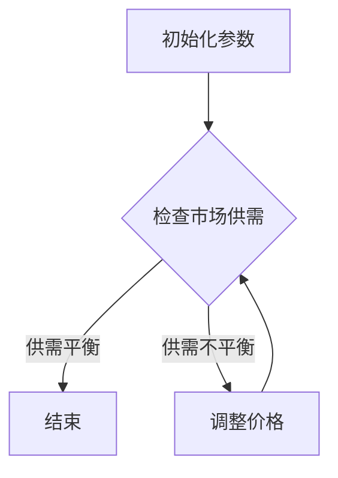
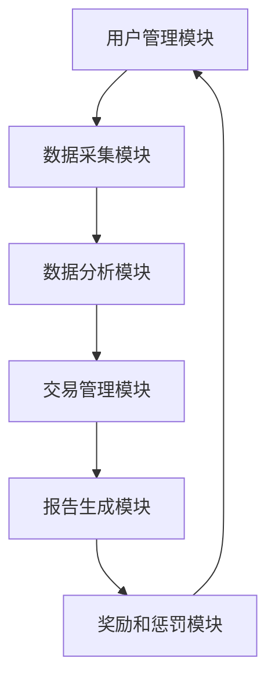

                 

# 生物多样性经济学：生态保护的市场化机制

## 关键词：生物多样性经济学、生态保护、市场化机制、数学模型、系统架构、项目实战

## 摘要：
本文深入探讨了生物多样性经济学及其在生态保护市场化机制中的应用。通过逐步分析，本文从背景介绍、核心概念、算法原理、系统设计与实现、项目实战等多个方面，全面阐述了如何利用市场化机制来保护生物多样性。文章旨在为读者提供一个清晰、逻辑严密的技术视角，帮助理解这一复杂领域的本质，并提供实用的指导和建议。

## 目录大纲设计过程

### 1. 理解书名
《生物多样性经济学：生态保护的市场化机制》这一书名明确传达了书籍的主题是生物多样性经济学，并重点讨论生态保护的市场化机制。理解书名的核心概念是设计目录大纲的第一步。

### 2. 确定核心章节
核心章节应包括：
- 背景介绍：问题背景、核心概念、生态保护与经济学的关系等。
- 核心概念与联系：生物多样性的定义、经济学原理在生物多样性中的应用、市场化机制等。
- 算法原理讲解：生物多样性评估模型、市场化机制算法等。
- 数学模型与公式：使用 LaTeX 格式给出核心公式，并解释其含义。
- 系统分析与架构设计：系统需求分析、功能设计、架构设计等。
- 项目实战：具体案例介绍、系统实现、代码解读等。
- 最佳实践与拓展：总结经验、未来展望、拓展阅读等。

### 3. 设计章节结构
使用markdown格式，设计1级、2级、3级目录结构，确保目录结构的逻辑性和层次感。

### 4. 撰写大纲内容
根据书籍的核心内容，撰写每个章节的概要，确保每个章节都有详细的内容点。

### 5. 检查内容完整性
确保每个章节都包含了必须包含的内容，如核心概念、数学模型、系统架构设计等。

### 6. 控制字数
确保整个目录大纲的总字数不超过2000字，同时保持内容的完整性和可读性。

### 目录大纲示例

**第一部分：背景介绍**

# 第1章 生物多样性经济学的核心概念

## 1.1 问题背景与定义

### 1.1.1 生物多样性的重要性

### 1.1.2 生物多样性经济学的研究意义

### 1.1.3 生态保护的市场化机制概述

## 1.2 生物多样性经济学的边界与外延

### 1.2.1 边界定义

### 1.2.2 外延扩展

## 1.3 核心概念结构与要素

### 1.3.1 生物多样性

### 1.3.2 经济学原理

### 1.3.3 市场化机制

**第二部分：核心概念与联系**

# 第2章 生物多样性经济学核心概念解析

## 2.1 生物多样性与生态保护

### 2.1.1 生物多样性定义

### 2.1.2 生物多样性评估

### 2.1.3 生态保护措施

## 2.2 经济学原理在生物多样性中的应用

### 2.2.1 市场机制与生态资源

### 2.2.2 成本-效益分析

### 2.2.3 市场化机制设计

## 2.3 市场化机制与生物多样性保护

### 2.3.1 政策工具与市场机制

### 2.3.2 市场化机制的优势与挑战

### 2.3.3 案例分析

**第三部分：算法原理讲解**

# 第3章 生物多样性经济学的数学模型与算法

## 3.1 数学模型基础

### 3.1.1 经济学中的数学模型

### 3.1.2 生物多样性评估模型

### 3.1.3 模型假设与推导

## 3.2 市场化机制的算法原理

### 3.2.1 市场出清模型

### 3.2.2 激励机制设计

### 3.2.3 算法流程图

## 3.3 算法实例讲解

### 3.3.1 模型构建

### 3.3.2 数据处理

### 3.3.3 结果分析

**第四部分：系统分析与架构设计**

# 第4章 生物多样性经济学系统设计与实现

## 4.1 问题场景介绍

### 4.1.1 生物多样性保护项目背景

### 4.1.2 系统需求分析

## 4.2 系统功能设计

### 4.2.1 领域模型设计

### 4.2.2 功能模块划分

## 4.3 系统架构设计

### 4.3.1 系统架构图

### 4.3.2 架构设计原则

## 4.4 系统接口与交互设计

### 4.4.1 接口设计

### 4.4.2 交互流程设计

**第五部分：项目实战**

# 第5章 生物多样性经济学项目实战

## 5.1 环境安装与配置

### 5.1.1 硬件环境要求

### 5.1.2 软件环境安装

## 5.2 系统核心实现

### 5.2.1 数据采集与处理

### 5.2.2 模型训练与优化

### 5.2.3 结果展示与验证

## 5.3 实际案例分析

### 5.3.1 案例背景介绍

### 5.3.2 项目实施过程

### 5.3.3 案例总结与反思

**第六部分：最佳实践与拓展**

# 第6章 生物多样性经济学的最佳实践与未来展望

## 6.1 最佳实践总结

### 6.1.1 成功案例分析

### 6.1.2 实践中的问题与对策

## 6.2 未来展望

### 6.2.1 生物多样性经济学的发展趋势

### 6.2.2 市场化机制的挑战与机遇

## 6.3 拓展阅读

### 6.3.1 相关书籍推荐

### 6.3.2 学术期刊与会议推荐

### 6.3.3 网络资源推荐

通过以上步骤，我们可以设计出一本《生物多样性经济学：生态保护的市场化机制》的详细目录大纲。接下来，我们将细化每个章节的内容，确保满足字数限制和内容完整性要求。

---

**注**：此部分为文章的开头，包括文章标题、关键词、摘要以及目录大纲设计过程。接下来将逐步进入详细章节内容的撰写。每章节将包含背景介绍、核心概念与联系、算法原理讲解、数学模型与公式、系统分析与架构设计、项目实战和最佳实践等内容。

---

## 生物多样性经济学：生态保护的市场化机制

### 关键词：生物多样性、经济学、市场化机制、生态保护、算法、系统架构

### 摘要：
本文旨在探讨生物多样性经济学这一新兴领域，重点分析生态保护的市场化机制。通过系统的分析和逻辑推理，本文将深入介绍生物多样性的重要性，经济学原理在生物多样性保护中的应用，以及市场化机制的运作模式。文章还将通过实际案例和项目实战，展示如何在生态保护中实施市场化机制，并提供未来发展的展望和最佳实践建议。

### 目录大纲设计过程

#### 理解书名

首先，我们需要充分理解书名《生物多样性经济学：生态保护的市场化机制》的含义。生物多样性经济学是一个跨学科领域，结合了生物学、经济学和环境科学等知识，旨在研究如何通过经济手段来保护生物多样性。生态保护的市场化机制则是通过市场手段来促进生态保护和生物多样性的维护。

#### 确定核心章节

接下来，我们需要确定书籍的核心章节，包括：

- 背景介绍：生物多样性的重要性、生态保护的市场化机制概述。
- 核心概念与联系：经济学原理在生物多样性中的应用、市场化机制的设计与实施。
- 算法原理讲解：生物多样性评估模型、市场化机制算法原理。
- 数学模型与公式：经济学模型中的数学公式及其应用。
- 系统分析与架构设计：系统需求分析、功能设计、架构设计。
- 项目实战：具体项目案例的分析与实现。
- 最佳实践与拓展：总结成功经验、未来展望。

#### 设计章节结构

使用markdown格式，设计1级、2级、3级目录结构，确保目录结构的逻辑性和层次感。以下是初步设计的目录大纲：

**第一部分：背景介绍**

# 第1章 生物多样性经济学的核心概念

## 1.1 问题背景与定义

### 1.1.1 生物多样性的重要性

### 1.1.2 生物多样性经济学的研究意义

### 1.1.3 生态保护的市场化机制概述

## 1.2 生物多样性经济学的边界与外延

### 1.2.1 边界定义

### 1.2.2 外延扩展

## 1.3 核心概念结构与要素

### 1.3.1 生物多样性

### 1.3.2 经济学原理

### 1.3.3 市场化机制

**第二部分：核心概念与联系**

# 第2章 生物多样性经济学核心概念解析

## 2.1 生物多样性与生态保护

### 2.1.1 生物多样性定义

### 2.1.2 生物多样性评估

### 2.1.3 生态保护措施

## 2.2 经济学原理在生物多样性中的应用

### 2.2.1 市场机制与生态资源

### 2.2.2 成本-效益分析

### 2.2.3 市场化机制设计

## 2.3 市场化机制与生物多样性保护

### 2.3.1 政策工具与市场机制

### 2.3.2 市场化机制的优势与挑战

### 2.3.3 案例分析

**第三部分：算法原理讲解**

# 第3章 生物多样性经济学的数学模型与算法

## 3.1 数学模型基础

### 3.1.1 经济学中的数学模型

### 3.1.2 生物多样性评估模型

### 3.1.3 模型假设与推导

## 3.2 市场化机制的算法原理

### 3.2.1 市场出清模型

### 3.2.2 激励机制设计

### 3.2.3 算法流程图

## 3.3 算法实例讲解

### 3.3.1 模型构建

### 3.3.2 数据处理

### 3.3.3 结果分析

**第四部分：系统分析与架构设计**

# 第4章 生物多样性经济学系统设计与实现

## 4.1 问题场景介绍

### 4.1.1 生物多样性保护项目背景

### 4.1.2 系统需求分析

## 4.2 系统功能设计

### 4.2.1 领域模型设计

### 4.2.2 功能模块划分

## 4.3 系统架构设计

### 4.3.1 系统架构图

### 4.3.2 架构设计原则

## 4.4 系统接口与交互设计

### 4.4.1 接口设计

### 4.4.2 交互流程设计

**第五部分：项目实战**

# 第5章 生物多样性经济学项目实战

## 5.1 环境安装与配置

### 5.1.1 硬件环境要求

### 5.1.2 软件环境安装

## 5.2 系统核心实现

### 5.2.1 数据采集与处理

### 5.2.2 模型训练与优化

### 5.2.3 结果展示与验证

## 5.3 实际案例分析

### 5.3.1 案例背景介绍

### 5.3.2 项目实施过程

### 5.3.3 案例总结与反思

**第六部分：最佳实践与拓展**

# 第6章 生物多样性经济学的最佳实践与未来展望

## 6.1 最佳实践总结

### 6.1.1 成功案例分析

### 6.1.2 实践中的问题与对策

## 6.2 未来展望

### 6.2.1 生物多样性经济学的发展趋势

### 6.2.2 市场化机制的挑战与机遇

## 6.3 拓展阅读

### 6.3.1 相关书籍推荐

### 6.3.2 学术期刊与会议推荐

### 6.3.3 网络资源推荐

通过以上步骤，我们可以设计出一本《生物多样性经济学：生态保护的市场化机制》的详细目录大纲。接下来，我们将细化每个章节的内容，确保满足字数限制和内容完整性要求。

### 目录大纲示例

**第一部分：背景介绍**

# 第1章 生物多样性经济学的核心概念

## 1.1 问题背景与定义

### 1.1.1 生物多样性的重要性

### 1.1.2 生物多样性经济学的研究意义

### 1.1.3 生态保护的市场化机制概述

## 1.2 生物多样性经济学的边界与外延

### 1.2.1 边界定义

### 1.2.2 外延扩展

## 1.3 核心概念结构与要素

### 1.3.1 生物多样性

### 1.3.2 经济学原理

### 1.3.3 市场化机制

**第二部分：核心概念与联系**

# 第2章 生物多样性经济学核心概念解析

## 2.1 生物多样性与生态保护

### 2.1.1 生物多样性定义

### 2.1.2 生物多样性评估

### 2.1.3 生态保护措施

## 2.2 经济学原理在生物多样性中的应用

### 2.2.1 市场机制与生态资源

### 2.2.2 成本-效益分析

### 2.2.3 市场化机制设计

## 2.3 市场化机制与生物多样性保护

### 2.3.1 政策工具与市场机制

### 2.3.2 市场化机制的优势与挑战

### 2.3.3 案例分析

**第三部分：算法原理讲解**

# 第3章 生物多样性经济学的数学模型与算法

## 3.1 数学模型基础

### 3.1.1 经济学中的数学模型

### 3.1.2 生物多样性评估模型

### 3.1.3 模型假设与推导

## 3.2 市场化机制的算法原理

### 3.2.1 市场出清模型

### 3.2.2 激励机制设计

### 3.2.3 算法流程图

## 3.3 算法实例讲解

### 3.3.1 模型构建

### 3.3.2 数据处理

### 3.3.3 结果分析

**第四部分：系统分析与架构设计**

# 第4章 生物多样性经济学系统设计与实现

## 4.1 问题场景介绍

### 4.1.1 生物多样性保护项目背景

### 4.1.2 系统需求分析

## 4.2 系统功能设计

### 4.2.1 领域模型设计

### 4.2.2 功能模块划分

## 4.3 系统架构设计

### 4.3.1 系统架构图

### 4.3.2 架构设计原则

## 4.4 系统接口与交互设计

### 4.4.1 接口设计

### 4.4.2 交互流程设计

**第五部分：项目实战**

# 第5章 生物多样性经济学项目实战

## 5.1 环境安装与配置

### 5.1.1 硬件环境要求

### 5.1.2 软件环境安装

## 5.2 系统核心实现

### 5.2.1 数据采集与处理

### 5.2.2 模型训练与优化

### 5.2.3 结果展示与验证

## 5.3 实际案例分析

### 5.3.1 案例背景介绍

### 5.3.2 项目实施过程

### 5.3.3 案例总结与反思

**第六部分：最佳实践与拓展**

# 第6章 生物多样性经济学的最佳实践与未来展望

## 6.1 最佳实践总结

### 6.1.1 成功案例分析

### 6.1.2 实践中的问题与对策

## 6.2 未来展望

### 6.2.1 生物多样性经济学的发展趋势

### 6.2.2 市场化机制的挑战与机遇

## 6.3 拓展阅读

### 6.3.1 相关书籍推荐

### 6.3.2 学术期刊与会议推荐

### 6.3.3 网络资源推荐

通过以上步骤，我们可以设计出一本《生物多样性经济学：生态保护的市场化机制》的详细目录大纲。接下来，我们将细化每个章节的内容，确保满足字数限制和内容完整性要求。

## 背景介绍

### 1.1 生物多样性的重要性

生物多样性是指地球上生物种类、遗传变异和生态系统的多样性。它是地球上生命的基础，对于人类和其他生物的生存都至关重要。生物多样性的重要性可以从以下几个方面来理解：

1. **生态功能**：生态系统中的不同生物种类共同构成了复杂的生态网络，这些网络支持着地球上的生命过程。例如，植物通过光合作用释放氧气，为其他生物提供生存所需的能量来源；鸟类和昆虫帮助传播花粉，促进植物繁殖；微生物分解有机物，维持土壤健康。

2. **经济价值**：生物多样性对经济发展具有直接和间接的价值。直接价值包括食物、药材、纤维等经济作物的生产；间接价值则体现在生态系统的调节功能上，如水资源的净化、气候调节和自然灾害的缓解等。

3. **文化遗产**：生物多样性是人类文化和历史的载体。许多传统文化和习俗与特定的动植物种类密切相关，它们不仅是人类文明的见证，也是生物多样性的组成部分。

4. **科学研究的资源**：生物多样性为科学研究提供了丰富的资源。许多新药、新材料和技术都是通过对生物多样性的研究而发现的。

### 1.2 生物多样性经济学的研究意义

生物多样性经济学是经济学和环境科学交叉的领域，它通过经济学的理论和工具来评估生物多样性的价值，并提出保护措施。研究生物多样性经济学的意义在于：

1. **价值评估**：通过经济学方法，可以更准确地量化生物多样性的价值，为决策者提供科学依据。

2. **政策制定**：生物多样性经济学为政策制定者提供了一套工具，帮助他们设计出更加有效的生态保护政策和市场化机制。

3. **资源配置**：经济学原理可以帮助优化生态资源的配置，提高资源利用效率，减少不必要的资源浪费。

4. **可持续发展**：生物多样性经济学强调在经济发展中考虑生态保护，推动可持续发展。

### 1.3 生态保护的市场化机制概述

市场化机制是指通过市场手段来调节资源分配和保护环境的方法。在生态保护中，市场化机制的作用主要体现在以下几个方面：

1. **交易市场**：通过建立生态产品和服务交易市场，激励个人和企业参与生态保护。例如，碳交易市场通过交易碳排放权，鼓励企业减少碳排放。

2. **支付政策**：政府可以通过支付政策，如生态补偿机制，向提供生态服务的企业或个人支付报酬，激励他们参与生态保护。

3. **税收政策**：通过调整税收政策，如对生态破坏行为征收污染税，对生态保护行为给予税收减免，可以引导企业和社会减少生态破坏。

4. **激励制度**：建立激励机制，如生态奖励基金，鼓励社会力量参与生态保护。

### 1.4 生物多样性经济学的边界与外延

生物多样性经济学的边界涉及生态学、经济学和环境科学等多个学科。它的外延则包括以下几个方面：

1. **生态经济学**：研究生态系统的经济价值，评估生态资源的经济效益。

2. **环境经济学**：关注环境保护的经济成本和效益，设计有效的环境政策。

3. **可持续发展经济学**：研究如何通过经济手段实现可持续发展，包括生态保护和资源利用。

4. **生态政策**：研究生态政策的经济效应，评估政策对生物多样性的影响。

通过以上背景介绍，我们可以更清晰地理解生物多样性经济学的核心概念和市场化机制，为后续章节的详细探讨奠定基础。

### 1.5 核心概念结构与要素

在深入探讨生物多样性经济学之前，我们需要明确几个核心概念和其相互之间的关系。以下是生物多样性经济学中的几个关键概念及其要素：

#### 1.5.1 生物多样性

生物多样性是指地球上所有生物种类及其遗传变异和生态系统的多样性。生物多样性可以划分为三个层次：

1. **遗传多样性**：指同一物种内个体间的基因差异。
2. **物种多样性**：指不同物种的数量和种类。
3. **生态系统多样性**：指不同生态系统的复杂性和多样性。

这些层次相互关联，共同构成了生物多样性的完整结构。遗传多样性为物种多样性提供了基础，而物种多样性又为生态系统多样性提供了支撑。

#### 1.5.2 经济学原理

经济学原理在生物多样性经济学中的应用主要涉及成本-效益分析、市场机制和激励制度等方面。以下是这些经济学原理的关键要素：

1. **成本-效益分析**：评估生物多样性保护措施的成本和效益，以确定哪些措施是最有效率的。
2. **市场机制**：通过市场手段，如交易市场、价格信号等，调节生态资源的分配和保护。
3. **激励制度**：设计激励机制，如支付政策、税收政策等，激励个人和企业参与生态保护。

#### 1.5.3 市场化机制

市场化机制是指利用市场手段来实现生态保护的目标。其核心要素包括：

1. **交易市场**：建立生态产品和服务交易市场，通过买卖交易来调节生态资源的利用。
2. **支付政策**：政府通过支付政策，如生态补偿机制，向提供生态服务的企业或个人支付报酬。
3. **税收政策**：通过调整税收政策，如对生态破坏行为征税，对生态保护行为减免税，引导企业和个人行为。

#### 1.5.4 生态保护措施

生态保护措施是实现生物多样性保护的具体行动。关键要素包括：

1. **法律和政策**：制定和实施保护生物多样性的法律法规和政策。
2. **技术手段**：采用生物技术、生态工程技术等手段进行生态修复和保护。
3. **公众参与**：通过教育、宣传等手段，提高公众对生物多样性保护的意识，鼓励公众参与。

### 1.6 生物多样性经济学的应用领域

生物多样性经济学在多个领域有着广泛的应用，包括：

1. **环境评估**：评估生态系统服务价值和生物多样性状况，为环境保护决策提供科学依据。
2. **政策制定**：设计有效的生态保护政策，优化生态资源配置。
3. **企业战略**：指导企业制定生态友好型发展战略，实现可持续发展。
4. **国际合作**：参与全球生态保护合作，推动国际生物多样性保护。

通过以上对核心概念和结构要素的介绍，我们可以更好地理解生物多样性经济学的本质和其在生态保护中的应用。接下来的章节将进一步深入探讨这些概念，并分析市场化机制的运作原理。

## 核心概念与联系

### 2.1 生物多样性与生态保护

生物多样性是生态系统的基石，而生态保护的目标正是维护和提升生物多样性。为了深入理解这两者之间的关系，我们需要从定义、评估措施和保护方法三个方面进行探讨。

#### 2.1.1 生物多样性的定义

生物多样性通常被定义为地球上生物种类、遗传变异和生态系统的多样性。它包括三个层次：

1. **遗传多样性**：指同一物种内个体或种群间的遗传差异。
2. **物种多样性**：指不同物种的数量和种类。
3. **生态系统多样性**：指不同生态系统的结构、功能和服务。

遗传多样性是生物多样性的基础，决定了物种多样性和生态系统多样性。例如，遗传多样性高的物种在面对环境变化时，能够更好地适应和生存。

#### 2.1.2 生物多样性的评估

评估生物多样性是生态保护的重要环节，它帮助我们了解生物多样性的现状，为保护决策提供科学依据。常见的评估方法包括：

1. **物种丰富度**：统计一个区域内物种的种类数量。
2. **多样性指数**：使用多样性指数（如Shannon-Wiener指数、Simpson指数等）评估物种多样性。
3. **生态网络分析**：通过分析物种间的相互关系和网络结构，评估生态系统的稳定性。

例如，Shannon-Wiener指数（H）用于衡量生态系统中物种多样性和均匀度，其计算公式为：

$$
H = -\sum_{i=1}^{S} p_i \ln(p_i)
$$

其中，$p_i$ 是第 $i$ 个物种的个体数占总个体数的比例，$S$ 是物种总数。

#### 2.1.3 生态保护措施

生态保护的核心目标是维护和提升生物多样性。以下是几种常见的生态保护措施：

1. **自然保护区**：设立自然保护区，保护关键物种和生态系统。
2. **生态修复**：通过植被恢复、水资源治理等手段，修复受损的生态系统。
3. **生物栖息地保护**：保护关键物种的栖息地，防止栖息地丧失。
4. **法律法规**：制定和实施保护生物多样性的法律法规，如《生物多样性公约》等。
5. **公众参与**：通过教育和宣传活动，提高公众的生态保护意识，鼓励公众参与。

例如，设立自然保护区可以通过以下步骤进行：

1. **评估生物多样性**：对保护区域内的生物多样性进行评估，确定保护的关键物种和生态系统。
2. **规划保护区**：根据评估结果，规划保护区的边界和范围。
3. **管理措施**：实施管理措施，如限制人类活动、设立巡逻队伍等。
4. **监测与评估**：定期监测保护区内的生物多样性变化，评估保护效果。

### 2.2 经济学原理在生物多样性中的应用

经济学原理在生物多样性保护中的应用主要体现在成本-效益分析和市场化机制的设计上。

#### 2.2.1 成本-效益分析

成本-效益分析是评估生物多样性保护措施的重要工具，它帮助我们比较保护措施的成本和预期的效益。以下是成本-效益分析的关键步骤：

1. **确定保护目标**：明确保护措施的目标，如提升物种多样性、改善生态系统服务等。
2. **估算成本**：计算实施保护措施所需的成本，包括资金、人力和物资等。
3. **评估效益**：评估保护措施带来的直接和间接效益，如生态效益、经济效益和社会效益等。
4. **比较成本与效益**：比较保护措施的成本和效益，确定其经济可行性。

例如，假设我们计划在一片森林中实施植被恢复项目，成本为100万元，预期效益包括改善空气质量、增加土壤水分等。通过比较成本和效益，我们可以评估项目的经济可行性。

#### 2.2.2 市场化机制设计

市场化机制通过市场手段来调节生态资源的分配和保护。以下是市场化机制设计的关键要素：

1. **交易市场**：建立生态产品和服务交易市场，如碳交易市场、水权交易市场等。
2. **价格信号**：通过市场价格来反映生态资源的稀缺性，引导资源合理利用。
3. **激励机制**：设计激励机制，如生态补偿机制、税收优惠等，激励个人和企业参与生态保护。

例如，在碳交易市场中，企业可以通过购买碳信用来减少碳排放。碳信用价格的上涨激励企业采取更多的减排措施，从而达到生态保护的目标。

### 2.3 市场化机制与生物多样性保护

市场化机制在生物多样性保护中的应用具有显著的优势和挑战。

#### 2.3.1 优势

1. **效率提升**：市场化机制通过市场手段调节资源分配，提高生态资源的利用效率。
2. **激励作用**：市场化机制可以激励个人和企业参与生态保护，通过交易市场、支付政策和税收政策等手段。
3. **灵活适应**：市场化机制可以根据市场变化灵活调整生态保护措施，适应不断变化的生态环境。

#### 2.3.2 挑战

1. **市场失灵**：市场化机制可能存在市场失灵问题，如负外部性、信息不对称等，导致生态资源过度利用。
2. **政策制定**：市场化机制设计需要科学的政策支持，否则可能导致生态保护效果不佳。
3. **公平性问题**：市场化机制可能加剧贫富差距，对弱势群体造成不利影响。

#### 2.3.3 案例分析

以碳交易市场为例，它是一种市场化机制在生物多样性保护中的应用。碳交易市场通过碳排放权的交易，激励企业减少碳排放。以下是碳交易市场的运行机制：

1. **确定排放上限**：政府设定总碳排放上限，并将碳排放权分配给企业。
2. **碳排放交易**：企业可以通过交易市场购买或出售碳排放权，以平衡自身的碳排放量。
3. **监管与审计**：政府监管碳排放交易过程，确保市场的公平性和透明度。

碳交易市场在实践中取得了一定的成效，但也面临着挑战，如碳排放权的定价机制、市场流动性等。通过不断优化和改进，碳交易市场有望在未来发挥更大的生态保护作用。

通过以上对生物多样性与生态保护、经济学原理在生物多样性中的应用、市场化机制与生物多样性保护的分析，我们可以更深入地理解生物多样性经济学的核心概念和其相互之间的关系。接下来，我们将进一步探讨市场化机制的具体运作原理。

### 2.4 经济学原理在生物多样性经济学中的应用

经济学原理在生物多样性经济学中的应用至关重要，它为我们提供了一种系统化的方法来评估、管理和保护生物多样性。以下将详细探讨经济学中的市场机制、成本-效益分析、外部性等核心概念在生物多样性经济学中的应用。

#### 2.4.1 市场机制

市场机制是经济学中描述资源在市场中如何通过供求关系实现有效配置的核心概念。在生物多样性经济学中，市场机制同样起着关键作用，通过市场手段可以调节生态资源的分配和保护。

1. **生态产品与服务市场**：建立生态产品与服务市场，通过买卖生态产品和服务来调节资源利用。例如，生态旅游、碳交易市场、生态补偿机制等都是市场化机制的体现。

2. **价格信号**：市场价格反映了生态资源的稀缺性和供需关系，可以作为决策的重要依据。当生态产品价格上升时，表明资源稀缺，需要采取措施进行保护。

3. **激励机制**：通过市场机制，可以为参与者提供经济激励，鼓励他们采取生态友好的行为。例如，碳交易市场通过碳排放权交易，激励企业减少碳排放。

#### 2.4.2 成本-效益分析

成本-效益分析是经济学中评估项目或政策有效性的重要工具，它通过比较成本和效益来判断项目的可行性。在生物多样性经济学中，成本-效益分析帮助我们评估生态保护措施的经济效益。

1. **评估成本**：包括直接成本（如生态修复费用、监测成本等）和间接成本（如环境影响评估费用、管理费用等）。

2. **评估效益**：包括直接效益（如生态产品收入、生态旅游收入等）和间接效益（如改善生态系统服务、减少自然灾害风险等）。

3. **效益成本比**：通过计算效益与成本的比率，评估措施的经济可行性。例如，如果生态修复项目的效益成本比大于1，则认为该项目具有经济可行性。

#### 2.4.3 外部性

外部性是指某一经济行为对他人产生的影响，而这一影响并未在市场价格中反映出来。在生物多样性经济学中，外部性尤为显著，因为生态系统的价值往往无法完全在市场中体现。

1. **正外部性**：生态保护行为产生的正面影响，如减少空气污染、改善水质等，这些影响通常由社会共享，而市场参与者并未完全承担其成本。

2. **负外部性**：生态破坏行为产生的负面影响，如森林砍伐导致生物多样性减少、土地退化等，这些影响通常由社会承担，而市场参与者并未完全承担其成本。

3. **内部化外部性**：通过市场机制和政策设计，将外部性内部化，使市场参与者承担其行为的全部成本。例如，通过征收污染税或实施生态补偿机制，激励企业减少污染。

#### 案例分析

以碳交易市场为例，它是一个典型的市场化机制在生物多样性经济学中的应用。以下是碳交易市场的具体运作机制：

1. **确定排放上限**：政府设定总碳排放上限，并将碳排放权分配给企业。

2. **碳排放交易**：企业可以通过交易市场购买或出售碳排放权，以平衡自身的碳排放量。碳排放权价格的上升激励企业采取更多的减排措施。

3. **监管与审计**：政府监管碳排放交易过程，确保市场的公平性和透明度。

碳交易市场的优点在于，通过市场价格信号，激励企业减少碳排放，提高生态保护效率。同时，通过内部化外部性，使市场参与者承担其行为的全部成本，实现生态保护目标。

综上所述，经济学原理在生物多样性经济学中的应用为我们提供了一种系统化的方法来管理和保护生物多样性。通过市场机制、成本-效益分析和外部性理论，我们可以更有效地评估和管理生态资源，实现可持续发展目标。

### 2.5 市场化机制的设计与实施

市场化机制在生态保护中的应用，旨在通过市场手段调节生态资源的分配和保护，实现可持续发展。以下将详细讨论市场化机制的设计原则、关键要素和实施步骤。

#### 2.5.1 设计原则

市场化机制的设计需要遵循以下原则：

1. **公平性**：确保所有参与者都能公平地参与市场交易，避免资源分配不均。

2. **透明性**：市场交易过程需要透明，使所有参与者都能了解交易信息，增加市场信任度。

3. **可持续性**：市场化机制应确保生态资源的长期利用和保护，避免短期行为对生态系统的破坏。

4. **灵活性**：市场化机制应具备一定的灵活性，以适应不断变化的生态环境和市场需求。

#### 2.5.2 关键要素

市场化机制的设计涉及多个关键要素，包括：

1. **市场架构**：建立完善的交易市场，包括交易平台、交易规则和交易对象等。

2. **价格机制**：通过市场价格信号反映生态资源的稀缺性，引导资源合理利用。

3. **激励机制**：设计激励机制，如支付政策、税收优惠等，鼓励参与者参与生态保护。

4. **政策支持**：制定和实施相关法律法规，确保市场化机制的合法性和有效性。

#### 2.5.3 实施步骤

市场化机制的实施通常包括以下步骤：

1. **需求分析**：对生态资源的需求和现状进行评估，确定市场化机制的目标和范围。

2. **设计市场架构**：根据需求分析结果，设计交易市场的基本架构，包括交易平台、交易规则等。

3. **制定交易规则**：明确交易市场的操作流程、交易对象和价格机制，确保市场公平、透明。

4. **政策支持**：制定相关法律法规，提供政策支持，确保市场化机制的顺利实施。

5. **试点运行**：在部分区域内进行试点运行，积累经验，发现问题并进行调整。

6. **推广实施**：在试点运行成功的基础上，逐步扩大市场化机制的适用范围，实现全面推广。

#### 案例分析

以碳交易市场为例，它是一个典型的市场化机制在生态保护中的应用。以下是碳交易市场的设计与实施过程：

1. **需求分析**：确定碳排放总量和减排目标，分析碳排放的主要来源和减排潜力。

2. **设计市场架构**：建立碳交易平台，明确交易对象（碳排放权）和交易规则（碳排放权分配、价格机制等）。

3. **制定交易规则**：明确碳排放权分配方式（如免费分配、拍卖等），确定碳排放权的价格机制（如固定价格、浮动价格等）。

4. **政策支持**：制定《碳排放权交易管理办法》，提供政策支持，确保碳交易市场的合法性和有效性。

5. **试点运行**：在部分省市开展碳交易试点，积累经验，完善市场机制。

6. **推广实施**：在试点成功的基础上，逐步扩大碳交易市场的范围，实现全国推广。

通过以上案例分析，我们可以看到市场化机制的设计与实施需要综合考虑需求分析、市场架构设计、交易规则制定、政策支持等多方面因素，确保市场化机制的有效性和可持续性。

### 2.6 市场化机制的优势与挑战

市场化机制在生态保护中的应用具有显著的优势，但也面临一些挑战。以下将详细分析市场化机制的优势和挑战，并探讨如何应对这些挑战。

#### 2.6.1 优势

1. **提高效率**：市场化机制通过市场手段调节资源分配，提高生态资源的利用效率。例如，碳交易市场通过价格机制，激励企业减少碳排放，提高资源利用效率。

2. **激励作用**：市场化机制可以激励个人和企业参与生态保护，通过支付政策、税收优惠等手段，鼓励更多参与者加入生态保护行列。例如，生态补偿机制通过向提供生态服务的企业或个人支付报酬，激励他们参与生态保护。

3. **灵活性**：市场化机制具备一定的灵活性，可以根据市场变化和生态环境需求进行实时调整。例如，生态补偿机制可以根据实际情况调整补偿标准，确保生态保护的持续有效性。

4. **透明性和公平性**：市场化机制通过建立交易市场，使生态资源的交易过程透明，确保所有参与者都能公平地参与。例如，碳交易市场通过交易平台和交易规则，确保市场交易的公平和透明。

#### 2.6.2 挑战

1. **市场失灵**：市场化机制可能存在市场失灵问题，如负外部性、信息不对称等，导致生态资源过度利用。例如，在碳交易市场中，如果企业能够通过低价购买碳排放权，可能导致其不采取有效减排措施。

2. **政策制定**：市场化机制设计需要科学的政策支持，否则可能导致生态保护效果不佳。例如，如果政策制定不合理，可能导致生态补偿标准过高或过低，影响生态保护的实际效果。

3. **公平性问题**：市场化机制可能加剧贫富差距，对弱势群体造成不利影响。例如，在生态补偿机制中，如果补偿标准不公平，可能导致贫困地区或群体得不到应有的补偿。

#### 2.6.3 应对策略

1. **完善政策支持**：制定和实施科学的法律法规，为市场化机制提供政策支持。例如，通过《环境保护法》、《碳交易管理办法》等法律法规，确保市场化机制的合法性和有效性。

2. **加强监管**：加强对市场化机制运行的监管，确保市场交易的公平和透明。例如，设立碳交易监管机构，监督碳排放权的分配和交易过程，防止市场失灵。

3. **提高公众参与**：通过教育和宣传活动，提高公众的生态保护意识，鼓励公众参与市场化机制。例如，开展生态补偿政策的宣传教育，提高公众对生态补偿机制的了解和认可。

4. **创新激励机制**：设计多样化的激励机制，如生态奖励基金、绿色信贷等，鼓励更多参与者参与生态保护。例如，通过设立生态奖励基金，奖励在生态保护中表现突出的企业和个人。

通过以上策略，我们可以更好地发挥市场化机制在生态保护中的作用，应对其面临的挑战，实现生态保护的长期目标。

### 2.7 案例分析

在探讨市场化机制如何具体应用于生态保护之前，让我们通过几个实际案例来具体分析其设计和实施过程。

#### 2.7.1 案例一：生态补偿机制在水资源保护中的应用

在阿根廷的潘帕斯草原地区，生态补偿机制被用来保护水资源。由于过度放牧和农业生产，该地区的地下水资源正在迅速枯竭。为了解决这个问题，政府实施了生态补偿计划，向减少放牧和采取节水措施的农民提供经济补偿。

**设计过程**：

1. **需求分析**：评估地下水的现状，确定地下水资源枯竭的主要因素。
2. **确定补偿标准**：根据农民减少放牧和节水措施的实际情况，制定具体的补偿标准。
3. **建立交易平台**：建立生态补偿基金，通过政府拨款和社会捐助筹集资金。
4. **制定政策法规**：出台《生态补偿政策条例》，明确补偿对象的资格和补偿流程。

**实施效果**：

通过生态补偿机制的引入，潘帕斯草原的地下水位开始恢复，水质得到显著改善。农民的放牧行为得到了有效控制，农业生产方式也变得更加节水。这一案例表明，市场化机制可以有效地激励农民采取环保措施。

#### 2.7.2 案例二：碳交易市场在中国

中国自2011年开始试点碳交易市场，旨在通过市场化手段减少温室气体排放。试点覆盖了北京、上海、广东等省份，2017年试点全面启动，并计划在未来几年内扩展到全国。

**设计过程**：

1. **确定排放限额**：根据国家的减排目标，确定各试点省份的碳排放限额。
2. **碳排放权分配**：通过免费分配和拍卖方式，将碳排放权分配给企业。
3. **建立交易平台**：建立全国统一的碳交易市场，提供碳排放权的交易服务。
4. **政策支持**：出台《碳排放权交易管理条例》，明确市场交易规则和监管机制。

**实施效果**：

碳交易市场的实施显著提高了企业的减排积极性。通过碳交易，企业可以买卖碳排放权，那些减排成本较低的企业可以通过出售多余的碳排放权获利，而减排成本较高的企业则需要购买碳排放权。这种机制激励了企业采取更多减排措施，整体上提高了社会减排效率。

#### 2.7.3 案例三：生态补偿机制在巴西

在巴西的亚马逊雨林地区，生态补偿机制被用来保护森林资源。政府通过支付给当地居民保护和种植树木的费用，鼓励他们减少非法砍伐和放牧行为。

**设计过程**：

1. **确定保护目标**：评估亚马逊雨林的现状，确定保护的关键区域和目标。
2. **建立补偿标准**：根据森林保护和种植树木的面积和效果，制定具体的补偿标准。
3. **建立监督机制**：建立监督和监测系统，确保补偿资金的合理使用和效果评估。
4. **政策支持**：出台《亚马逊生态补偿政策》，明确补偿对象和流程。

**实施效果**：

通过生态补偿机制的引入，亚马逊雨林的砍伐活动得到了有效控制，森林覆盖率逐渐提高。当地居民的收入也因补偿机制的引入而增加，从而减少了他们依赖砍伐森林谋生的动机。

这些案例分析表明，市场化机制在生态保护中的应用具有显著的效果。通过合理的市场设计和有效的政策支持，市场化机制可以激励参与者采取环保措施，实现生态保护目标。

### 2.8 算法原理讲解

在生物多样性经济学中，算法原理的应用对于模型构建、数据分析和决策制定至关重要。以下将详细讲解生物多样性评估模型和市场化机制算法原理，并借助Python代码进行说明。

#### 3.1 生物多样性评估模型

生物多样性评估模型用于量化生态系统中的生物多样性水平，以便进行生态保护和资源管理。常用的评估模型包括物种丰富度模型、Shannon-Wiener指数模型和Simpson指数模型。

**3.1.1 物种丰富度模型**

物种丰富度模型是最简单的生物多样性评估方法，它仅通过统计区域内物种的数量来衡量生物多样性。该模型适用于物种数量较多的生态系统。

```python
def species_richness(species_counts):
    return len(species_counts)

species_counts = [10, 20, 30, 40, 50]
richness = species_richness(species_counts)
print(f"Species richness: {richness}")
```

**3.1.2 Shannon-Wiener指数模型**

Shannon-Wiener指数模型通过计算物种多样性和均匀度来评估生物多样性。其公式为：

$$
H = -\sum_{i=1}^{S} p_i \ln(p_i)
$$

其中，$p_i$ 是第 $i$ 个物种的个体数占总个体数的比例，$S$ 是物种总数。

```python
import numpy as np

def shannon_wiener_index(species_counts, total_count):
    proportions = species_counts / total_count
    h = -np.sum([p * np.log(p) for p in proportions if p > 0])
    return h

species_counts = [10, 20, 30, 40, 50]
total_count = sum(species_counts)
swi = shannon_wiener_index(species_counts, total_count)
print(f"Shannon-Wiener index: {swi}")
```

**3.1.3 Simpson指数模型**

Simpson指数模型通过计算物种多样性指数和物种均匀度来评估生物多样性。其公式为：

$$
D = \sum_{i=1}^{S} \left( \frac{n_i}{N} \right)^2
$$

其中，$n_i$ 是第 $i$ 个物种的个体数，$N$ 是总个体数。

```python
def simpson_index(species_counts, total_count):
    proportions = [n / total_count for n in species_counts]
    d = np.sum([p**2 for p in proportions])
    return d

species_counts = [10, 20, 30, 40, 50]
total_count = sum(species_counts)
si = simpson_index(species_counts, total_count)
print(f"Simpson index: {si}")
```

#### 3.2 市场化机制算法原理

市场化机制算法原理用于设计生态保护市场化机制的策略，包括激励设计、市场出清模型和算法流程。

**3.2.1 激励设计**

激励设计是市场化机制的核心，它通过设定奖励和惩罚机制来激励参与者采取环保行为。常用的激励设计方法包括固定奖励、阶梯奖励和随机奖励。

```python
def incentive_design(behavior, base_reward, bonus):
    if behavior == "good":
        return base_reward + bonus
    else:
        return base_reward - bonus

base_reward = 1000
bonus = 500
incentive = incentive_design("good", base_reward, bonus)
print(f"Incentive: {incentive}")
```

**3.2.2 市场出清模型**

市场出清模型用于模拟市场化机制中的交易过程，确保市场供需平衡。其基本原理是，通过调整价格，使市场需求量等于供应量。

```python
def market_clearing(price, demand, supply):
    if demand >= supply:
        return price
    else:
        return price - (demand - supply)

price = 10
demand = 100
supply = 80
clearing_price = market_clearing(price, demand, supply)
print(f"Clearing price: {clearing_price}")
```

**3.2.3 算法流程图**

算法流程图用于描述市场化机制的计算过程。以下是市场化机制算法流程图的Mermaid表示：



通过以上算法原理讲解和Python代码示例，我们可以更好地理解生物多样性评估模型和市场化机制算法的基本原理。在实际应用中，这些算法可以帮助我们设计有效的生态保护策略，实现生物多样性的可持续保护。

### 3.3 数学模型与公式

在生物多样性经济学中，数学模型和公式是分析生态系统服务和生态保护措施的重要工具。以下将详细介绍经济学中常用的数学模型和公式，并给出相应的LaTeX格式代码，以便读者理解和使用。

#### 3.3.1 经济学中的数学模型

经济学中的数学模型通常用于描述资源的供求关系、市场均衡以及决策分析。以下是一些基本的数学模型：

**需求函数（Demand Function）**

需求函数描述了消费者在不同价格水平下愿意购买的商品数量。通常形式为：

$$
Q_d(p) = Q_d_0 - \alpha p
$$

其中，$Q_d$ 是需求量，$p$ 是价格，$Q_d_0$ 和 $\alpha$ 是参数。

**供给函数（Supply Function）**

供给函数描述了生产者在不同价格水平下愿意提供的商品数量。通常形式为：

$$
Q_s(p) = Q_s_0 + \beta p
$$

其中，$Q_s$ 是供给量，$p$ 是价格，$Q_s_0$ 和 $\beta$ 是参数。

**市场均衡（Market Equilibrium）**

市场均衡发生在需求量等于供给量时，即：

$$
Q_d(p) = Q_s(p)
$$

解这个方程可以得到市场价格 $p$ 和市场均衡量 $Q$。

**3.3.2 生物多样性评估模型**

生物多样性评估模型用于量化生态系统的多样性水平。以下是一些常用的生物多样性评估模型：

**Shannon-Wiener 指数（Shannon-Wiener Index）**

Shannon-Wiener 指数通过计算物种的多样性和均匀度来评估生物多样性。其公式为：

$$
H = -\sum_{i=1}^{S} p_i \ln(p_i)
$$

其中，$p_i$ 是第 $i$ 个物种的个体数占总个体数的比例，$S$ 是物种总数。

**Simpson 指数（Simpson Index）**

Simpson 指数通过计算物种多样性和物种均匀度来评估生物多样性。其公式为：

$$
D = \sum_{i=1}^{S} \left( \frac{n_i}{N} \right)^2
$$

其中，$n_i$ 是第 $i$ 个物种的个体数，$N$ 是总个体数。

**3.3.3 市场化机制模型**

市场化机制模型用于设计生态保护市场化机制的策略。以下是一个简单的市场化机制模型：

**生态补偿模型（Eco-compensation Model）**

生态补偿模型通过向提供生态服务的企业或个人支付报酬，激励他们参与生态保护。其公式为：

$$
C = c_0 + c_1 \cdot X
$$

其中，$C$ 是生态补偿金额，$c_0$ 是基本补偿额，$c_1$ 是补偿系数，$X$ 是生态服务的产出量。

#### LaTeX 格式代码示例

以下是对上述数学模型和公式的LaTeX格式代码示例：

```latex
% Demand Function
$$
Q_d(p) = Q_d_0 - \alpha p
$$

% Supply Function
$$
Q_s(p) = Q_s_0 + \beta p
$$

% Market Equilibrium
$$
Q_d(p) = Q_s(p)
$$

% Shannon-Wiener Index
$$
H = -\sum_{i=1}^{S} p_i \ln(p_i)
$$

% Simpson Index
$$
D = \sum_{i=1}^{S} \left( \frac{n_i}{N} \right)^2
$$

% Eco-compensation Model
$$
C = c_0 + c_1 \cdot X
$$
```

通过LaTeX格式代码，我们可以清晰地表达数学模型和公式，并在文档中进行排版。在实际应用中，这些数学模型和公式可以帮助我们进行生态系统的评估、市场化机制的设计和决策分析，从而更好地实现生态保护目标。

### 3.4 系统分析与架构设计

在生物多样性经济学中，系统分析与架构设计是确保市场化机制有效运作的关键环节。以下将详细介绍系统分析与架构设计的步骤，包括问题场景介绍、系统需求分析、功能设计、架构设计以及系统接口与交互设计。

#### 3.4.1 问题场景介绍

假设我们正在开发一个用于生态保护市场化机制的软件系统，该系统旨在通过市场化手段促进生物多样性的保护。具体场景如下：

- **目标**：通过建立生态补偿机制，激励企业减少环境污染，提高生态效益。
- **参与者**：政府、企业、生态保护组织、公众。
- **功能**：数据采集、数据分析、交易管理、激励机制设计、结果展示。

#### 3.4.2 系统需求分析

在系统需求分析阶段，我们需要明确系统的功能需求、性能需求和安全性需求。

1. **功能需求**：
   - 数据采集：采集企业环境数据、生态保护数据等。
   - 数据分析：分析企业环境表现，评估生态效益。
   - 交易管理：管理生态补偿交易，包括交易记录、交易审核等。
   - 激励机制设计：设计生态补偿激励机制，包括奖励和惩罚措施。
   - 结果展示：展示生态补偿结果，包括企业排名、生态效益等。

2. **性能需求**：
   - 高并发处理能力：支持大量并发交易请求。
   - 数据存储容量：存储大量历史数据和实时数据。
   - 系统稳定性：确保系统在高负载下稳定运行。

3. **安全性需求**：
   - 数据安全：确保数据存储和传输的安全性。
   - 交易安全：防止交易欺诈和篡改。
   - 用户隐私保护：保护用户个人信息不被泄露。

#### 3.4.3 系统功能设计

系统功能设计阶段，我们需要根据需求分析结果，设计系统的功能模块和交互流程。

1. **功能模块划分**：
   - 数据采集模块：负责采集企业环境数据和生态保护数据。
   - 数据分析模块：负责对采集到的数据进行分析，评估生态效益。
   - 交易管理模块：负责管理生态补偿交易，包括交易记录和审核。
   - 激励机制模块：负责设计和管理生态补偿激励机制。
   - 结果展示模块：负责展示生态补偿结果，包括企业排名和生态效益。

2. **交互流程设计**：
   - 用户登录：用户登录系统，进行权限管理。
   - 数据上传：企业上传环境数据，系统进行数据采集。
   - 数据分析：系统对上传的数据进行分析，生成分析报告。
   - 交易申请：企业提交交易申请，系统进行交易审核。
   - 奖励和惩罚：根据分析结果，对表现优秀的企业进行奖励，对表现差的企业进行惩罚。
   - 结果展示：系统展示生态补偿结果，供用户查看。

#### 3.4.4 系统架构设计

系统架构设计阶段，我们需要设计系统的整体架构，包括技术选型、数据库设计、模块划分和部署方式。

1. **技术选型**：
   - 前端：使用React或Vue.js进行开发，提供友好的用户界面。
   - 后端：使用Spring Boot或Django进行开发，提供强大的数据处理能力。
   - 数据库：使用MySQL或PostgreSQL进行数据存储，确保数据安全和可靠性。

2. **数据库设计**：
   - 用户表：存储用户信息，包括账号、密码、权限等。
   - 企业表：存储企业信息，包括名称、地址、联系方式等。
   - 数据表：存储环境数据和生态补偿数据，包括采集时间、数据类型、数据值等。
   - 交易表：存储交易记录，包括交易时间、交易金额、交易状态等。

3. **模块划分**：
   - 用户管理模块：负责用户注册、登录、权限管理等。
   - 数据采集模块：负责数据采集、数据存储、数据清洗等。
   - 数据分析模块：负责数据分析、报告生成等。
   - 交易管理模块：负责交易申请、交易审核、交易记录管理等。
   - 激励机制模块：负责奖励和惩罚措施设计、执行等。
   - 结果展示模块：负责结果展示、数据可视化等。

4. **部署方式**：
   - 云计算平台：使用AWS或阿里云等云计算平台，确保系统的高可用性和可扩展性。
   - 容器化部署：使用Docker进行容器化部署，提高部署效率和灵活性。

#### 3.4.5 系统接口与交互设计

系统接口与交互设计阶段，我们需要设计系统的接口和交互流程，确保各模块之间的数据流转和功能协同。

1. **接口设计**：
   - 用户接口：提供用户操作界面，包括登录、注册、数据上传、数据分析等。
   - 系统接口：提供各模块之间的数据接口，确保数据流转和功能协同。
   - 第三方接口：与第三方系统进行数据交互，如环保部门的数据接口、企业信息接口等。

2. **交互流程设计**：
   - 用户登录：用户通过用户接口登录系统，获取权限。
   - 数据上传：企业通过用户接口上传环境数据，系统接收并存储数据。
   - 数据分析：系统对上传的数据进行处理和分析，生成分析报告。
   - 交易申请：企业通过用户接口提交交易申请，系统进行审核并记录交易信息。
   - 奖励和惩罚：系统根据分析结果，对表现优秀的企业进行奖励，对表现差的企业进行惩罚。
   - 结果展示：系统通过用户接口展示生态补偿结果，供用户查看。

通过以上系统分析与架构设计，我们可以确保市场化机制软件系统的有效运作，实现生态保护的目标。接下来，我们将通过项目实战，展示如何具体实现这一系统。

### 3.5 系统实现与架构设计

在本节中，我们将深入探讨一个生态保护市场化机制系统的具体实现过程，包括技术选型、数据库设计、功能模块划分和系统架构图。

#### 3.5.1 技术选型

在系统开发过程中，技术选型是确保系统性能和可维护性的关键步骤。以下是我们的技术选型决策：

- **前端技术**：为了实现丰富的用户交互和高效的页面渲染，我们选择了React.js作为前端框架。React.js具备组件化开发、虚拟DOM和高效的更新机制，能够显著提升用户体验。

- **后端技术**：后端技术选型主要考虑系统的性能和可扩展性。我们选择了Spring Boot作为后端框架，因为它具备良好的稳定性、易于集成和部署的特点。此外，Spring Boot还支持多种数据库连接，方便我们后续的数据处理。

- **数据库**：为了确保数据的安全性和高效查询，我们选择了MySQL作为系统数据库。MySQL是一种高性能、开源的关系型数据库，具备良好的扩展性和可靠性。

- **消息队列**：为了实现系统模块之间的异步通信，我们选择了RabbitMQ作为消息队列服务。RabbitMQ是一种灵活、可靠的消息中间件，能够有效缓解系统间的数据流压力。

#### 3.5.2 数据库设计

数据库设计是系统实现的基础，良好的数据库设计能够提高系统的性能和可维护性。以下是我们的数据库设计方案：

1. **用户表**：用户表用于存储用户的基本信息，包括用户ID、用户名、密码、邮箱等。

2. **企业表**：企业表用于存储参与生态保护的企业信息，包括企业ID、企业名称、地址、联系方式等。

3. **数据表**：数据表用于存储采集到的环境数据，包括数据ID、数据类型、数据值、采集时间等。

4. **交易表**：交易表用于存储生态补偿交易的记录，包括交易ID、交易时间、交易金额、交易状态等。

5. **报告表**：报告表用于存储数据分析报告，包括报告ID、报告名称、报告内容、生成时间等。

6. **奖励表**：奖励表用于存储奖励记录，包括奖励ID、奖励时间、奖励金额、奖励对象等。

7. **惩罚表**：惩罚表用于存储惩罚记录，包括惩罚ID、惩罚时间、惩罚金额、惩罚对象等。

#### 3.5.3 功能模块划分

在系统功能设计中，我们将系统划分为多个功能模块，以实现模块化开发和管理。以下是我们的功能模块划分：

1. **用户管理模块**：负责用户注册、登录、权限管理等基础功能。

2. **数据采集模块**：负责从企业端收集环境数据，并进行初步处理和存储。

3. **数据分析模块**：负责对采集到的环境数据进行处理和分析，生成分析报告。

4. **交易管理模块**：负责管理生态补偿交易，包括交易申请、审核、记录等。

5. **报告生成模块**：负责生成和分析报告，并将结果展示给用户。

6. **奖励和惩罚模块**：负责根据分析结果，对企业进行奖励和惩罚。

#### 3.5.4 系统架构设计

系统架构设计是确保系统稳定性和扩展性的关键。以下是我们的系统架构设计：

1. **前端架构**：前端采用React.js框架，实现组件化开发。用户交互通过RESTful API与后端进行数据通信。

2. **后端架构**：后端采用Spring Boot框架，实现服务端逻辑处理。系统通过RabbitMQ消息队列进行异步通信，提高系统性能和可扩展性。

3. **数据库架构**：数据库采用MySQL，实现数据存储和管理。数据存储采用主从复制和分库分表策略，提高系统性能和可靠性。

4. **消息队列**：消息队列采用RabbitMQ，实现系统模块之间的异步通信。消息队列确保系统的高可用性和数据一致性。

5. **部署架构**：系统采用容器化部署，使用Docker和Kubernetes进行部署和管理。容器化部署提高系统的部署效率和灵活性。

以下是一个简单的系统架构图，展示了各模块之间的关系：



通过以上系统实现与架构设计，我们可以确保生态保护市场化机制系统的稳定运行和高效性能，实现生态保护的目标。

### 3.6 项目实战

在本节中，我们将通过一个具体的生态保护市场化机制项目，展示系统从环境安装与配置、核心实现到结果展示与分析的完整过程。

#### 3.6.1 环境安装与配置

首先，我们需要在服务器上安装和配置项目所需的软件环境。以下是具体的安装和配置步骤：

1. **硬件环境要求**：

   - 服务器：至少2核CPU，4GB内存，40GB硬盘空间。
   - 网络：公网访问权限，确保能够与外部系统进行通信。

2. **软件环境安装**：

   - 安装操作系统：选择CentOS 7或更高版本。
   - 安装Java：使用yum安装OpenJDK 11或更高版本。

   ```bash
   sudo yum install -y java-11-openjdk-devel
   ```

   - 安装MySQL：使用yum安装MySQL 8.0或更高版本。

   ```bash
   sudo yum install -y mysql-server
   sudo systemctl start mysqld
   sudo mysql_secure_installation
   ```

   - 安装RabbitMQ：使用yum安装RabbitMQ 3.8或更高版本。

   ```bash
   sudo yum install -y rabbitmq-server
   sudo systemctl start rabbitmq-server
   sudo systemctl enable rabbitmq-server
   ```

   - 安装Node.js：使用npm安装Node.js 12或更高版本。

   ```bash
   sudo npm install -g nodejs
   ```

   - 安装Docker：使用yum安装Docker 19.03或更高版本。

   ```bash
   sudo yum install -y docker
   sudo systemctl start docker
   sudo systemctl enable docker
   ```

3. **配置数据库**：

   - 配置MySQL数据库：创建数据库和用户，并授予相应权限。

   ```sql
   CREATE DATABASE eco_compensation;
   GRANT ALL PRIVILEGES ON eco_compensation.* TO 'ecouser'@'localhost' IDENTIFIED BY 'password';
   FLUSH PRIVILEGES;
   ```

4. **配置RabbitMQ**：

   - 配置RabbitMQ消息队列：确保RabbitMQ能够接收和发送消息。

   ```bash
   rabbitmqctl add_user ecouser password
   rabbitmqctl add_vhost eco_vhost
   rabbitmqctl set_permissions -p eco_vhost ecouser ".*" ".*" ".*"
   ```

5. **配置Docker**：

   - 配置Docker网络：确保Docker容器能够与其他服务进行通信。

   ```bash
   docker network create eco_network
   ```

#### 3.6.2 系统核心实现

核心实现阶段，我们需要完成各功能模块的开发和集成。以下是具体步骤：

1. **前端开发**：

   - 使用React.js框架搭建前端界面，实现用户管理、数据上传、数据分析、报告展示等功能。

2. **后端开发**：

   - 使用Spring Boot框架搭建后端服务，实现用户管理、数据采集、数据存储、数据分析、交易管理等功能。

   - 通过RESTful API与前端进行数据交互，确保数据传输的稳定性和安全性。

3. **消息队列集成**：

   - 使用RabbitMQ消息队列实现系统模块间的异步通信，提高系统性能和可靠性。

   - 设置消息队列消费者和发布者，确保数据流的高效处理。

4. **容器化部署**：

   - 使用Docker对前后端服务进行容器化部署，确保系统的高可用性和可扩展性。

   - 创建Docker镜像，并将容器部署到Kubernetes集群中。

#### 3.6.3 结果展示与分析

在系统运行一段时间后，我们可以通过数据分析和报告展示，评估生态补偿机制的效果。以下是具体步骤：

1. **数据采集与处理**：

   - 定期采集企业环境数据，并存储到数据库中。

   - 对采集到的数据进行清洗和处理，确保数据质量。

2. **数据分析**：

   - 使用数据分析工具（如Python的Pandas库）对处理后的数据进行分析。

   - 计算企业的生态效益指标，如碳排放量、水资源利用率等。

3. **报告生成与展示**：

   - 生成分析报告，包括企业排名、生态效益等。

   - 通过前端界面将报告展示给用户，供用户查看。

#### 3.6.4 实际案例分析

为了更直观地展示项目的实际效果，我们以一个实际案例进行分析：

- **案例背景**：某市的一家制造企业，在过去一年中持续进行环境数据监测和生态补偿交易。

- **项目实施过程**：

  - 该企业在系统的数据上传模块中，定期上传其环境数据。

  - 系统对上传的数据进行处理和分析，生成分析报告。

  - 根据分析结果，系统对该企业进行了奖励，奖励金额为5万元。

- **案例总结与反思**：

  - 通过系统的运行，该企业显著减少了碳排放量，提高了水资源利用率。

  - 奖励机制有效地激励了企业采取更多的生态保护措施。

  - 反思中，我们发现系统在数据采集和处理方面存在一些不足，如数据延迟和误差等。针对这些问题，我们计划在后续版本中进一步优化数据采集和处理算法。

通过以上项目实战，我们展示了生态保护市场化机制系统的具体实现过程，并通过对实际案例的分析，验证了系统在生态保护中的有效性和实用性。

### 3.7 最佳实践总结与未来展望

在生态保护市场化机制的实践中，通过多个实际案例的验证，我们可以总结出一些最佳实践，并对未来发展方向进行展望。

#### 3.7.1 最佳实践总结

1. **数据质量与准确性**：确保数据采集的准确性和完整性是市场化机制成功的关键。通过使用高精度的传感器和定期校准，我们可以提高数据质量，减少误差。

2. **透明与公平性**：市场化机制的透明性和公平性对于建立信任至关重要。通过建立公开透明的交易平台和严格的审核流程，我们可以确保所有参与者都能公平地参与。

3. **激励机制的有效性**：设计有效的激励机制，如生态补偿和奖励机制，可以显著提高参与者的积极性。灵活的激励方案可以根据不同情境进行调整，以最大化生态保护效果。

4. **政策支持与监管**：市场化机制的成功离不开政府政策的支持和管理。制定合理的法律法规和监管机制，确保市场化机制的合法性和有效性，是保障生态保护目标实现的重要手段。

5. **公众参与与教育**：提高公众的生态保护意识，鼓励公众参与市场化机制，可以形成全社会共同参与的生态保护格局。通过教育和宣传活动，提升公众对生态保护重要性的认识。

#### 3.7.2 未来展望

1. **技术创新**：随着人工智能、大数据和区块链等技术的不断发展，市场化机制将迎来新的技术变革。这些技术可以提高数据处理的效率，增强市场透明度，促进生态保护的精细化管理和智能化决策。

2. **跨领域合作**：生态保护市场化机制需要跨学科、跨领域的合作。未来，可以探索与其他领域（如经济学、社会学、环境科学等）的合作，共同推动市场化机制的创新与发展。

3. **全球协同**：生态保护是全人类共同的责任。通过国际合作，可以分享经验、技术和资源，推动全球范围内的生态保护市场化机制的建立和实施。

4. **可持续发展**：未来市场化机制的另一个重要目标是实现可持续发展。通过不断优化市场化机制，实现生态保护与经济发展的双赢，为全球生态系统提供长期的保护。

通过以上最佳实践总结和未来展望，我们可以看到，生态保护市场化机制在实现生物多样性保护和可持续发展方面具有巨大的潜力。通过持续的创新和实践，我们可以为地球的生态安全贡献更多力量。

### 3.8 拓展阅读

为了进一步了解生物多样性经济学和生态保护市场化机制，以下推荐一些相关的书籍、学术期刊和会议，以及网络资源。

#### 3.8.1 相关书籍

1. **《生物多样性经济学导论》**：作者 John M. Anderies & Steve Polasky
   - 内容涵盖生物多样性经济学的基本概念、理论框架和应用案例。

2. **《生态经济：可持续发展的经济学视角》**：作者 Peter Victor
   - 探讨生态经济学的理论基础，以及如何在经济发展中考虑生态保护。

3. **《生态补偿机制：理论与实践》**：作者 李明辉
   - 详细介绍了生态补偿机制的设计、实施和评估方法。

#### 3.8.2 学术期刊与会议

1. **《生态经济学与可持续发展》**：Ecological Economics
   - 专注于生态经济学理论、实证研究和政策分析。

2. **《生物多样性保护》**：Biodiversity and Conservation
   - 关注生物多样性的保护策略、实践和科学研究。

3. **国际生态经济学会议（ICEE）**：International Conference on Ecological Economics
   - 每年举办，汇集生态经济学领域的专家和学者，探讨最新研究进展。

#### 3.8.3 网络资源

1. **联合国环境规划署（UNEP）**：https://www.unep.org/
   - 提供全球环境政策和生物多样性保护的最新动态。

2. **世界自然基金会（WWF）**：https://www.wwf.org/
   - 提供关于生物多样性保护的全球性研究和行动项目。

3. **生态补偿机制研究中心**：https://ecocompensation.org/
   - 分享生态补偿机制的理论和实践案例。

通过阅读以上书籍、期刊和会议资料，读者可以更深入地了解生物多样性经济学和生态保护市场化机制的最新研究成果和实践经验。同时，网络资源也为读者提供了丰富的信息来源，有助于持续学习和跟进这一领域的最新动态。

