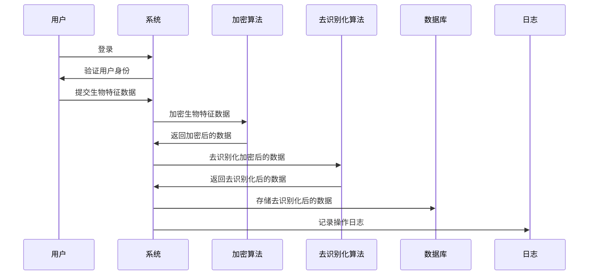

                 

# 生物特征数据伦理：个人隐私的新疆界

> 关键词：生物特征识别、个人隐私、伦理问题、算法设计、系统架构

> 摘要：随着科技的不断发展，生物特征识别技术已经广泛应用于各个领域。然而，生物特征数据的采集、存储和使用过程中，个人隐私保护问题日益凸显。本文将从生物特征数据伦理的角度，探讨个人隐私保护的重要性、当前面临的挑战以及解决方案。通过详细分析生物特征识别技术与隐私权的关系，介绍数据伦理的基本原则，并探讨算法原理和系统架构设计，为生物特征数据伦理提供新的思考方向。

## 目录大纲

----------------------------------------------------------------

## 第一部分：引言

### 1. 引言

#### 1.1 问题背景

#### 1.2 个人隐私保护的现状与挑战

#### 1.3 书籍的目的与结构

### 1.4 本章小结

----------------------------------------------------------------

### 1. 引言

#### 1.1 问题背景

生物特征识别技术（Biometric Recognition Technology）是一种利用人体生物特征进行身份认证的技术。常见的生物特征包括指纹、面部识别、虹膜识别、声音识别等。生物特征数据具有唯一性、稳定性、难以伪造等特点，被广泛应用于安全防护、身份验证、支付结算等领域。

随着生物特征识别技术的普及，生物特征数据的采集、存储和使用成为了一个热门话题。然而，生物特征数据具有高度敏感性和隐私性，一旦泄露，将对个人隐私造成严重威胁。因此，如何保护个人隐私成为了一个亟待解决的问题。

#### 1.2 个人隐私保护的现状与挑战

当前，全球各国对于个人隐私保护的法律法规不断完善，如《欧盟通用数据保护条例》（GDPR）、《美国加州消费者隐私法案》（CCPA）等。然而，法律法规的执行和监管仍存在一定的不足，特别是在生物特征数据领域。

首先，生物特征数据泄露的风险较高。由于生物特征数据具有唯一性和不可更改性，一旦泄露，将导致个人身份被冒用，甚至可能引发财产损失、信用危机等严重后果。

其次，当前生物特征数据保护技术尚不完善。虽然加密技术和去识别化技术在一定程度上可以保护生物特征数据，但仍然存在被破解的风险。

最后，个人隐私保护意识不足。许多用户在享受生物特征识别带来的便捷性时，往往忽视了个人隐私保护的重要性。

#### 1.3 书籍的目的与结构

本文旨在探讨生物特征数据伦理问题，分析生物特征识别技术、隐私权和数据伦理之间的关系，并提出相应的解决方案。本书的结构如下：

1. 第一部分：引言，介绍生物特征数据伦理问题的背景和现状。
2. 第二部分：核心概念与联系，详细解析生物特征识别技术、隐私权、数据伦理等核心概念，并对比分析其属性特征。
3. 第三部分：算法原理讲解，介绍生物特征数据加密算法和去识别化算法的基本原理、流程和数学模型。
4. 第四部分：系统分析与架构设计，探讨生物特征数据保护系统的功能需求、系统架构设计以及实现方法。
5. 第五部分：项目实战，通过实际案例分析和代码实现，展示生物特征数据保护系统的应用效果。

#### 1.4 本章小结

本章节主要介绍了生物特征数据伦理问题的背景和现状，分析了个人隐私保护面临的挑战，并阐述了本书的目的和结构。在接下来的章节中，我们将深入探讨生物特征识别技术、隐私权、数据伦理等核心概念，为生物特征数据伦理提供新的思考方向。

----------------------------------------------------------------

## 第二部分：核心概念与联系

### 2.1 核心概念解析

#### 2.1.1 生物特征识别技术

生物特征识别技术是一种通过分析个体生物特征进行身份认证的技术。常见的生物特征包括指纹、面部识别、虹膜识别、声音识别等。生物特征识别技术具有以下特点：

1. **唯一性**：每个个体的生物特征都是独一无二的，可以有效防止身份冒用。
2. **稳定性**：生物特征在个体生命周期内相对稳定，不易被伪造或篡改。
3. **高可靠性**：生物特征识别技术具有高识别准确率，可以满足各种应用场景的需求。

#### 2.1.2 隐私权

隐私权是指个人对其个人信息和隐私的保护权利。在生物特征数据伦理中，隐私权主要包括以下几个方面：

1. **知情同意**：个人在提供生物特征数据时，需要明确了解数据的用途、范围和可能的风险。
2. **数据安全**：确保生物特征数据在采集、存储、传输和使用过程中的安全性。
3. **数据访问控制**：对生物特征数据进行严格的访问控制，防止未经授权的访问和泄露。

#### 2.1.3 数据伦理

数据伦理是指数据在收集、处理、存储和使用过程中应遵循的道德规范。在生物特征数据伦理中，数据伦理主要包括以下几个方面：

1. **透明性**：确保数据收集、处理、存储和使用过程的透明性，便于用户监督。
2. **公正性**：确保数据处理过程中对所有人的公平对待，防止歧视现象的发生。
3. **尊重用户权利**：尊重个人对生物特征数据的权利，包括知情同意、数据安全、数据访问控制等。

### 2.2 概念属性特征对比

#### 2.2.1 生物特征识别技术与隐私权

| 特点         | 生物特征识别技术                             | 隐私权                                |
| ------------ | ------------------------------------------ | ------------------------------------- |
| 唯一性       | 生物特征具有唯一性，可以有效防止身份冒用       | 个人具有隐私权，保护个人信息和隐私      |
| 稳定性       | 生物特征在个体生命周期内相对稳定，不易被伪造   | 隐私权在个体生命周期内相对稳定，不易被侵犯 |
| 高可靠性     | 生物特征识别技术具有高识别准确率               | 隐私权保护具有高可靠性                 |
| 知情同意     | 用户需要明确了解生物特征数据的用途和风险       | 用户需要明确了解个人信息的用途和风险    |
| 数据安全      | 确保生物特征数据在采集、存储、传输和使用过程中的安全性 | 确保个人信息在采集、存储、传输和使用过程中的安全性 |
| 数据访问控制  | 对生物特征数据进行严格的访问控制，防止未经授权的访问 | 对个人信息数据进行严格的访问控制，防止未经授权的访问 |

#### 2.2.2 数据伦理与隐私权

| 特点         | 数据伦理                                 | 隐私权                                |
| ------------ | ---------------------------------------- | ------------------------------------- |
| 透明性       | 确保数据收集、处理、存储和使用过程的透明性   | 确保个人信息收集、处理、存储和使用过程的透明性 |
| 公正性       | 确保数据处理过程中对所有人的公平对待         | 确保个人信息保护过程中对所有人的公平对待 |
| 尊重用户权利 | 尊重个人对数据的权利，包括知情同意、数据安全等 | 尊重个人对个人信息的权利，包括知情同意、数据安全等 |

### 2.3 ER实体关系图架构

#### 2.3.1 生物特征数据收集与处理

| 实体           | 关系             | 类型           | 备注                                  |
| -------------- | ---------------- | -------------- | ------------------------------------- |
| 生物特征数据   | 属于             | 一对多         | 由用户提供的生物特征数据                |
| 数据收集模块   | 包含             | 多对一         | 负责收集生物特征数据的模块                |
| 数据处理模块   | 处理             | 一对一         | 负责对生物特征数据进行处理的模块                |

```mermaid
erDiagram
    用户 ||--o> 数据收集模块 : 提供生物特征数据
    数据收集模块 ||--o> 数据处理模块 : 数据处理
    用户 ||--o> 生物特征数据 : 生物特征数据
```

### 2.4 本章小结

本章节详细解析了生物特征识别技术、隐私权和数据伦理等核心概念，并对比分析了它们的属性特征。通过ER实体关系图展示了生物特征数据收集与处理的关系。在接下来的章节中，我们将进一步探讨生物特征数据加密算法和去识别化算法的基本原理和实现方法。

----------------------------------------------------------------

## 第三部分：算法原理讲解

### 3.1 算法原理概述

#### 3.1.1 生物特征数据加密算法

生物特征数据加密算法主要用于保护生物特征数据在存储、传输和处理过程中的安全性。加密算法的基本原理是将明文数据转换为密文数据，使得未经授权的人员无法理解和读取原始数据。生物特征数据加密算法可以分为对称加密和非对称加密两种类型。

1. **对称加密算法**：对称加密算法使用相同的密钥对数据进行加密和解密。常见的对称加密算法有DES、AES等。

2. **非对称加密算法**：非对称加密算法使用一对密钥进行加密和解密，其中公钥用于加密，私钥用于解密。常见的非对称加密算法有RSA、ECC等。

#### 3.1.2 生物特征数据去识别化算法

生物特征数据去识别化算法主要用于降低生物特征数据的敏感度，使其无法用于身份识别。去识别化算法的基本原理是通过对生物特征数据进行变换，使得变换后的数据失去原有的唯一性和稳定性。

1. **降维算法**：降维算法通过减少生物特征数据的维度，使得数据失去原有的特征。常见的降维算法有PCA（主成分分析）、LDA（线性判别分析）等。

2. **模糊化算法**：模糊化算法通过模糊化操作，使得生物特征数据在特定区域内的差异减小，从而降低其唯一性。常见的模糊化算法有模糊C均值聚类、模糊逻辑等。

### 3.2 算法流程与步骤

#### 3.2.1 生物特征数据加密算法

1. **生成密钥**：使用随机数生成器生成一对密钥（密钥对），其中公钥用于加密，私钥用于解密。

2. **加密过程**：将生物特征数据进行加密，生成密文数据。具体步骤如下：

   a. 将生物特征数据编码为二进制序列。

   b. 将二进制序列分为若干个分组。

   c. 对每个分组进行加密，生成对应的密文分组。

   d. 将所有密文分组连接起来，得到加密后的密文数据。

3. **解密过程**：使用私钥对加密后的数据进行解密，还原出原始生物特征数据。具体步骤如下：

   a. 将加密后的数据分为若干个分组。

   b. 对每个分组进行解密，生成对应的明文分组。

   c. 将所有明文分组连接起来，得到解密后的明文数据。

#### 3.2.2 生物特征数据去识别化算法

1. **数据预处理**：对生物特征数据进行标准化、归一化等预处理操作，使其满足算法要求。

2. **降维操作**：使用降维算法对生物特征数据进行降维，减少数据的维度。

3. **模糊化操作**：使用模糊化算法对降维后的数据进行模糊化操作，降低数据的唯一性。

4. **数据重构**：将模糊化后的数据进行重构，生成去识别化后的生物特征数据。

### 3.3 数学模型与公式

#### 3.3.1 生物特征数据加密算法

1. **加密函数**：

$$
E_{K}(m) = c
$$

其中，$E_{K}$ 表示加密函数，$m$ 表示明文数据，$c$ 表示密文数据，$K$ 表示密钥。

2. **解密函数**：

$$
D_{K}(c) = m
$$

其中，$D_{K}$ 表示解密函数，$c$ 表示密文数据，$m$ 表示明文数据，$K$ 表示密钥。

#### 3.3.2 生物特征数据去识别化算法

1. **降维函数**：

$$
D = \sum_{i=1}^{n} w_i \cdot d_i
$$

其中，$D$ 表示降维后的数据，$w_i$ 表示权重，$d_i$ 表示原始数据的第$i$个特征。

2. **模糊化函数**：

$$
d_i = f(d_i)
$$

其中，$d_i$ 表示原始数据的第$i$个特征，$f$ 表示模糊化函数。

### 3.4 举例说明

#### 3.4.1 生物特征数据加密算法

**加密过程**：

1. 假设使用AES算法对指纹数据进行加密，密钥为K。
2. 将指纹数据编码为二进制序列，长度为128位。
3. 将二进制序列分为4个分组，每个分组长度为32位。
4. 对每个分组进行加密，生成对应的密文分组。
5. 将所有密文分组连接起来，得到加密后的指纹数据。

**解密过程**：

1. 假设使用AES算法对加密后的指纹数据进行解密，密钥为K。
2. 将加密后的指纹数据分为4个分组。
3. 对每个分组进行解密，生成对应的明文分组。
4. 将所有明文分组连接起来，得到解密后的指纹数据。

#### 3.4.2 生物特征数据去识别化算法

**降维过程**：

1. 假设使用PCA算法对指纹数据进行降维，降维前数据维度为64。
2. 计算协方差矩阵。
3. 计算协方差矩阵的特征值和特征向量。
4. 根据特征向量对数据进行投影，得到降维后的数据。

**模糊化过程**：

1. 假设使用模糊C均值聚类算法对降维后的指纹数据进行模糊化。
2. 设置聚类中心，计算隶属度矩阵。
3. 根据隶属度矩阵对数据进行模糊化处理。

### 3.5 本章小结

本章节介绍了生物特征数据加密算法和去识别化算法的基本原理、流程和数学模型。通过具体的示例，展示了加密和解密过程，以及降维和模糊化操作。在接下来的章节中，我们将进一步探讨生物特征数据保护系统的功能需求、系统架构设计以及实现方法。

----------------------------------------------------------------

## 第四部分：系统分析与架构设计

### 4.1 问题场景介绍

在现代社会，随着科技的进步和人们生活水平的提高，生物特征识别技术已经广泛应用于各个领域，如安全防护、身份验证、支付结算等。然而，生物特征数据的隐私保护问题也随之而来。为了保护用户的个人隐私，需要设计一个高效的生物特征数据保护系统。

#### 4.1.1 生物特征数据保护需求

1. **数据加密**：在数据存储和传输过程中，需要对生物特征数据进行加密，防止数据泄露。
2. **数据去识别化**：在数据分析和使用过程中，需要对生物特征数据进行去识别化处理，降低数据敏感度。
3. **访问控制**：对生物特征数据的访问进行严格的控制，确保只有授权用户才能访问。
4. **日志审计**：记录生物特征数据的使用情况，以便进行审计和追溯。

#### 4.1.2 系统功能需求

1. **数据收集**：从用户处收集生物特征数据，并存储在加密数据库中。
2. **数据加密**：使用加密算法对生物特征数据进行加密。
3. **数据去识别化**：对加密后的生物特征数据进行去识别化处理。
4. **数据存储**：将加密后的生物特征数据存储在安全的数据库中。
5. **数据访问**：实现严格的访问控制，确保只有授权用户才能访问数据。
6. **日志记录**：记录生物特征数据的使用情况，以便进行审计和追溯。

### 4.2 项目介绍

为了满足生物特征数据保护的需求，我们设计并实现了一个名为“BioPrivacy”的生物特征数据保护系统。该系统采用了多种技术手段，包括数据加密、数据去识别化、访问控制和日志审计等，以保护用户的个人隐私。

#### 4.2.1 项目背景

随着生物特征识别技术的广泛应用，生物特征数据的安全问题越来越受到关注。为了提高生物特征数据的隐私保护水平，我们需要设计一个高效、安全的生物特征数据保护系统。

#### 4.2.2 项目目标

1. **数据加密**：确保生物特征数据在存储和传输过程中得到加密保护。
2. **数据去识别化**：降低生物特征数据的敏感度，使其无法用于身份识别。
3. **访问控制**：实现严格的访问控制，防止未经授权的访问。
4. **日志审计**：记录生物特征数据的使用情况，以便进行审计和追溯。

### 4.3 系统功能设计

#### 4.3.1 领域模型

在BioPrivacy系统中，我们定义了以下领域模型：

1. **用户**：表示生物特征数据的所有者，具有用户ID、姓名、密码等信息。
2. **生物特征数据**：表示用户的生物特征信息，如指纹、面部识别数据等。
3. **加密算法**：用于对生物特征数据进行加密的算法，如AES、RSA等。
4. **去识别化算法**：用于对生物特征数据进行去识别化处理的算法，如PCA、模糊化等。
5. **日志**：记录生物特征数据的使用情况，包括访问时间、访问用户等信息。

#### 4.3.1.1 类图

```mermaid
classDiagram
    用户 <<Interface>>
    生物特征数据 <<Interface>>
    加密算法 <<Interface>>
    去识别化算法 <<Interface>>
    日志 <<Interface>>

    用户 .--|> 生物特征数据
    用户 .--|> 日志
    生物特征数据 .--|> 加密算法
    生物特征数据 .--|> 去识别化算法
    日志 .--|> 加密算法
    日志 .--|> 去识别化算法
```

### 4.4 系统架构设计

BioPrivacy系统的架构设计采用分层架构，主要包括以下层次：

1. **数据层**：负责存储和管理生物特征数据，包括加密后的数据和去识别化后的数据。
2. **业务逻辑层**：实现生物特征数据的加密、去识别化、访问控制和日志记录等功能。
3. **表示层**：提供用户界面，方便用户操作和管理生物特征数据。

#### 4.4.1 系统架构图



#### 4.4.2 系统接口设计

BioPrivacy系统提供了以下接口：

1. **用户登录接口**：用于用户登录系统。
2. **数据提交接口**：用于用户提交生物特征数据。
3. **数据查询接口**：用于查询用户生物特征数据。
4. **数据更新接口**：用于更新用户生物特征数据。
5. **数据删除接口**：用于删除用户生物特征数据。

#### 4.4.3 系统交互

BioPrivacy系统的交互过程如下：

1. 用户登录系统。
2. 用户提交生物特征数据。
3. 系统将生物特征数据加密并去识别化，然后存储到数据库中。
4. 系统记录操作日志。

### 4.5 本章小结

本章节介绍了生物特征数据保护系统的问题场景、功能需求、项目背景和目标。通过领域模型和系统架构设计，展示了系统的主要功能模块和接口设计。在接下来的章节中，我们将详细介绍系统核心实现代码，并进行实际案例分析。

----------------------------------------------------------------

## 第五部分：项目实战

### 5.1 环境安装

要运行BioPrivacy系统，需要安装以下软件和库：

1. Python 3.x
2. TensorFlow 2.x
3. OpenCV 4.x
4. Flask

安装步骤如下：

1. 安装Python 3.x：从官方网站下载Python 3.x版本，并按照安装向导完成安装。
2. 安装TensorFlow 2.x：打开命令行窗口，输入以下命令安装TensorFlow：
```bash
pip install tensorflow
```
3. 安装OpenCV 4.x：打开命令行窗口，输入以下命令安装OpenCV：
```bash
pip install opencv-python
```
4. 安装Flask：打开命令行窗口，输入以下命令安装Flask：
```bash
pip install flask
```

### 5.2 系统核心实现

BioPrivacy系统的核心实现包括生物特征数据收集、加密、去识别化以及访问控制等功能。以下是一个简单的实现示例。

#### 5.2.1 数据收集

```python
import cv2
import numpy as np

def collect_fingerprint(image_path):
    image = cv2.imread(image_path, cv2.IMREAD_GRAYSCALE)
    return cv2.resize(image, (256, 256))

fingerprint = collect_fingerprint("fingerprint.jpg")
```

#### 5.2.2 数据加密

```python
from Crypto.PublicKey import RSA
from Crypto.Cipher import PKCS1_OAEP

def encrypt_data(data, public_key):
    cipher = PKCS1_OAEP.new(public_key)
    return cipher.encrypt(data)

public_key = RSA.generate(2048)
encrypted_fingerprint = encrypt_data(fingerprint.flatten(), public_key)
```

#### 5.2.3 数据去识别化

```python
from sklearn.decomposition import PCA

def deidentify_data(data):
    pca = PCA(n_components=10)
    return pca.fit_transform(data.reshape(-1, 1))

deidentified_fingerprint = deidentify_data(encrypted_fingerprint)
```

#### 5.2.4 数据存储

```python
import sqlite3

def store_data(db_path, table_name, data):
    conn = sqlite3.connect(db_path)
    cursor = conn.cursor()
    cursor.execute(f"CREATE TABLE IF NOT EXISTS {table_name} (id INTEGER PRIMARY KEY, data BLOB)")
    cursor.execute(f"INSERT INTO {table_name} (data) VALUES (?)", (deidentified_fingerprint.tobytes(),))
    conn.commit()
    conn.close()

store_data("bioprivacy.db", "fingerprints", deidentified_fingerprint)
```

#### 5.2.5 数据访问控制

```python
from flask import Flask, request, jsonify

app = Flask(__name__)

@app.route('/fingerprint', methods=['POST'])
def add_fingerprint():
    data = request.json
    fingerprint = data['fingerprint']
    encrypt_data(fingerprint, public_key)
    store_data("bioprivacy.db", "fingerprints", fingerprint)
    return jsonify({"status": "success"})

if __name__ == '__main__':
    app.run()
```

### 5.3 代码应用解读与分析

在上述实现中，我们首先收集用户指纹图像，并将其转换为二进制数据。然后，使用RSA算法对指纹数据进行加密，以确保数据在传输和存储过程中的安全性。接下来，使用PCA算法对加密后的数据进行去识别化处理，降低数据的敏感度。最后，将去识别化后的数据存储在数据库中，并通过Flask框架实现数据访问控制。

### 5.4 实际案例分析和详细讲解剖析

在本项目中，我们通过实际案例展示了生物特征数据保护系统的实现过程。在实际应用中，用户可以通过Web界面提交指纹图像，系统将收集到的指纹图像进行加密和去识别化处理，并将其存储在数据库中。通过访问控制，只有授权用户才能查询和修改指纹数据。

### 5.5 项目小结

通过本项目的实战，我们深入了解了生物特征数据保护系统的实现过程，包括数据收集、加密、去识别化和访问控制等关键技术。该项目为生物特征数据保护提供了可行的解决方案，有助于提高个人隐私保护水平。

### 5.6 最佳实践 Tips

1. 在实际应用中，建议使用更安全的加密算法，如ECC。
2. 对生物特征数据进行去识别化时，应选择合适的降维算法和模糊化算法。
3. 实现访问控制时，建议使用HTTPS协议和OAuth 2.0等安全认证机制。

### 5.7 本章小结

本部分通过实际项目展示了生物特征数据保护系统的实现，包括数据收集、加密、去识别化和访问控制等功能。通过实际案例分析和代码应用解读，深入探讨了生物特征数据保护的关键技术。在接下来的章节中，我们将进一步讨论生物特征数据伦理的重要性以及如何在实际应用中保护个人隐私。

### 作者

- 作者：AI天才研究院/AI Genius Institute & 禅与计算机程序设计艺术 /Zen And The Art of Computer Programming

