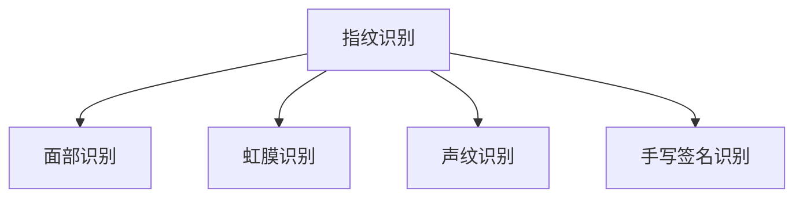
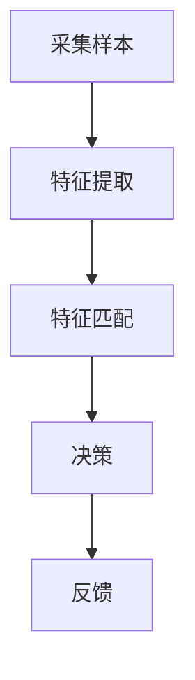

                 

### 生物识别技术在金融安全中的新发展

> 关键词：生物识别、金融安全、技术应用、挑战与解决方案

> 摘要：本文深入探讨了生物识别技术在金融安全领域的发展、核心概念、应用原理、面临挑战及未来趋势。通过详细阐述生物识别技术的原理与应用，分析其在金融安全中的优势与挑战，提供切实可行的解决方案，为金融行业提供创新安全手段。

## 第1章：背景介绍

### 1.1 生物识别技术的发展背景

生物识别技术是一种通过识别人体的生物特征来进行身份验证和识别的技术。其发展可以追溯到20世纪60年代，当时主要是以指纹识别为主要形式。随着计算机技术和图像处理技术的快速发展，生物识别技术逐渐成熟，并应用于多个领域。特别是在金融安全领域，生物识别技术的应用成为提高安全性和便利性的重要手段。

金融安全是指金融系统和金融服务不受非法侵害，确保金融交易的合法性、安全性和可靠性。随着互联网和移动支付的普及，金融交易的方式和场景变得更加多样和复杂，对安全性的要求也日益提高。生物识别技术的引入，不仅提高了交易的安全性，还简化了用户操作流程，增强了用户体验。

### 1.2 生物识别技术在金融安全领域的重要性

生物识别技术在金融安全领域具有独特的重要性。首先，它提供了比传统密码更为安全的身份验证方式。传统密码容易泄露或被破解，而生物特征具有唯一性和不可复制性，能够有效防止身份盗用。

其次，生物识别技术简化了用户的操作流程。用户无需记忆复杂的密码，只需通过生物特征即可完成身份验证，提高了操作便捷性。这对于提升金融服务的用户满意度具有重要意义。

最后，生物识别技术有助于防范金融欺诈。通过实时监测用户的生物特征，可以及时发现并阻止异常交易行为，降低金融风险。

### 1.3 生物识别技术在金融安全中的应用现状

目前，生物识别技术在金融安全中的应用已经相当广泛。以下是几个典型的应用场景：

1. **银行安全**：银行在客户身份验证和交易授权过程中广泛应用了生物识别技术，如指纹识别、面部识别等。部分银行还推出了无卡取款机，用户通过面部识别即可取款。

2. **支付安全**：移动支付平台如支付宝、微信支付等，普遍采用了指纹识别和面部识别技术进行支付验证，提高了支付的安全性。

3. **反欺诈**：金融机构利用生物识别技术对交易行为进行监控，发现并阻止欺诈行为。例如，通过监控用户的指纹或面部识别信息，可以发现账户被盗用的情况。

4. **客户服务**：部分金融机构通过生物识别技术为用户提供个性化服务，如根据用户的面部特征调整服务界面，提升用户体验。

总的来说，生物识别技术在金融安全中的应用正在不断拓展和深化，为金融行业带来了显著的安全和便利提升。

## 第2章：核心概念与联系

### 2.1 生物识别技术基本概念

生物识别技术是通过识别人体生物特征来进行身份验证和识别的技术。常见的生物特征包括指纹、面部、虹膜、声纹、手写签名等。这些生物特征具有唯一性和稳定性，不易被伪造或盗用。

- **指纹识别**：通过扫描手指指纹纹理进行身份验证。
- **面部识别**：通过分析面部特征进行身份验证。
- **虹膜识别**：通过扫描眼睛虹膜图案进行身份验证。
- **声纹识别**：通过分析语音特征进行身份验证。
- **手写签名识别**：通过识别用户的签名样式进行身份验证。

### 2.2 生物识别技术分类与联系

生物识别技术可以根据生物特征的类型分为多种类别，如指纹识别、面部识别、虹膜识别等。以下是一个简单的分类表格：

| 生物识别技术 | 描述 |
| :--- | :--- |
| 指纹识别 | 识别手指指纹纹理 |
| 面部识别 | 识别面部特征 |
| 虹膜识别 | 识别眼睛虹膜图案 |
| 声纹识别 | 识别语音特征 |
| 手写签名识别 | 识别签名样式 |

不同生物识别技术之间的联系可以通过以下实体关系图来展示：



这张图展示了不同生物识别技术之间的相互关系，它们共同构成了生物识别技术的整体框架。

### 2.3 生物识别技术对比表格

为了更清晰地了解不同生物识别技术的特性，我们可以通过一个对比表格来展示：

| 特性 | 指纹识别 | 面部识别 | 虹膜识别 | 声纹识别 | 手写签名识别 |
| :--- | :--- | :--- | :--- | :--- | :--- |
| 稳定性 | 高 | 高 | 高 | 中 | 高 |
| 便捷性 | 中 | 高 | 中 | 中 | 中 |
| 成本 | 低 | 中 | 高 | 低 | 高 |
| 防伪造性 | 高 | 高 | 高 | 中 | 中 |

通过这个表格，我们可以看出不同生物识别技术在稳定性、便捷性、成本和防伪造性等方面的特点。这些特性决定了它们在不同应用场景中的适用性。

## 第3章：生物识别技术原理讲解

### 3.1 生物识别技术流程图

生物识别技术的工作流程通常包括四个主要步骤：特征提取、特征匹配、决策和反馈。以下是一个简化的生物识别技术流程图：



在这个流程图中，A步骤是采集样本，即从用户处获取生物特征数据；B步骤是特征提取，即从样本中提取出具有识别意义的特征；C步骤是特征匹配，即将提取的特征与数据库中的特征进行匹配；D步骤是决策，即根据匹配结果决定是否通过验证；E步骤是反馈，即向用户反馈验证结果。

### 3.2 Python源代码阐述

为了更深入地理解生物识别技术的工作原理，我们可以通过一个简单的Python示例来阐述。以下是一个使用OpenCV库进行面部识别的Python代码：

```python
import cv2

# 加载训练好的面部识别模型
face_cascade = cv2.CascadeClassifier('haarcascade_frontalface_default.xml')

# 从视频流中读取帧
cap = cv2.VideoCapture(0)

while True:
    # 读取一帧
    ret, frame = cap.read()
    
    # 将帧转换为灰度图
    gray = cv2.cvtColor(frame, cv2.COLOR_BGR2GRAY)
    
    # 检测面部
    faces = face_cascade.detectMultiScale(gray, scaleFactor=1.1, minNeighbors=5, minSize=(30, 30), flags=cv2.CASCADE_SCALE_IMAGE)

    for (x, y, w, h) in faces:
        # 在原图上绘制面部区域
        cv2.rectangle(frame, (x, y), (x+w, y+h), (255, 0, 0), 2)
    
    # 显示图像
    cv2.imshow('Face Detection', frame)

    # 按下'q'键退出
    if cv2.waitKey(1) & 0xFF == ord('q'):
        break

# 释放摄像头资源
cap.release()
cv2.destroyAllWindows()
```

这段代码使用了OpenCV库中的哈撒韦级联分类器（Haar Cascade Classifier）来检测面部。首先加载训练好的面部识别模型，然后从摄像头读取帧，将帧转换为灰度图，并使用模型检测面部。检测到面部后，在原图上绘制红色矩形，最后显示图像并等待用户按键。

### 3.3 数学模型与公式讲解

在生物识别技术中，特征提取和匹配通常涉及到一些数学模型和公式。以下是一个简单的数学模型示例：

$$
\text{匹配度} = \frac{\text{匹配特征的总数}}{\text{总特征数}}
$$

这个公式表示匹配度，即匹配的特征数占总特征数的比例。匹配度越高，说明两个样本越相似，越有可能属于同一个人。

以下是一个具体的举例说明：

假设我们有两个面部特征向量$X_1$和$X_2$，其中$X_1$是用户A的面部特征，$X_2$是用户B的面部特征。我们可以通过计算它们的欧几里得距离来衡量它们之间的相似度：

$$
\text{距离} = \sqrt{\sum_{i=1}^{n} (X_{1i} - X_{2i})^2}
$$

其中$n$是特征向量的维度。距离越小，说明两个特征向量越接近，匹配度越高。

例如，如果$X_1 = [1, 2, 3]$，$X_2 = [1.5, 2.5, 3.5]$，则：

$$
\text{距离} = \sqrt{(1-1.5)^2 + (2-2.5)^2 + (3-3.5)^2} = \sqrt{0.25 + 0.25 + 0.25} = \sqrt{0.75} \approx 0.87
$$

这个距离表示用户A和用户B的面部特征非常接近，匹配度较高。

通过这些数学模型和公式，我们可以更准确地评估生物特征样本的相似度，从而提高生物识别技术的准确性。

## 第4章：生物识别技术在金融安全中的应用

### 4.1 生物识别技术在金融安全中的应用场景

生物识别技术在金融安全领域有广泛的应用，以下是一些典型的应用场景：

1. **客户身份验证**：在银行、证券、保险等金融机构中，生物识别技术被用于客户的身份验证。通过指纹、面部、虹膜等生物特征，可以确保客户身份的准确性，防止欺诈行为。

2. **交易授权**：在移动支付、网上银行等场景中，生物识别技术用于交易授权。用户在完成交易前，需要通过生物识别验证身份，从而确保交易的安全性。

3. **反欺诈**：生物识别技术可以实时监控交易行为，发现异常行为并阻止欺诈。例如，通过监控用户的指纹或面部识别信息，可以及时发现账户被盗用的情况。

4. **客户服务**：在金融客服中心，生物识别技术可以用于快速识别客户身份，提供个性化服务。例如，通过面部识别技术，可以快速找到客户的历史记录，提升服务效率。

### 4.2 生物识别技术在金融安全中的应用优势

生物识别技术在金融安全中的应用具有以下优势：

1. **高安全性**：生物特征具有唯一性和稳定性，不易被伪造或盗用，从而提供了比传统密码更为安全的安全保障。

2. **便捷性**：用户无需记忆复杂的密码，只需通过生物特征即可完成身份验证，提高了操作便捷性，提升了用户体验。

3. **实时性**：生物识别技术可以实现实时验证，快速响应交易请求，提高了金融服务的效率。

4. **非接触性**：生物识别技术无需直接接触设备，减少了交叉感染的风险，特别适用于疫情期间的金融服务。

### 4.3 生物识别技术在金融安全中的应用案例

以下是一些生物识别技术在金融安全中的应用案例：

1. **银行安全**：某银行引入了指纹识别技术，用户在柜台办理业务时需要通过指纹验证身份，有效防止了假身份开户和内部欺诈。

2. **支付安全**：某移动支付平台采用了面部识别技术进行支付验证，用户在支付时只需对准摄像头即可完成支付，大大提升了支付的安全性。

3. **反欺诈**：某金融机构利用生物识别技术对交易行为进行监控，发现并阻止了多起欺诈交易，降低了金融风险。

4. **客户服务**：某金融客服中心引入了面部识别技术，客户进入客服中心时需要通过面部识别验证身份，快速获取服务，提升了客户满意度。

总的来说，生物识别技术在金融安全中的应用已经取得了显著的成效，为金融行业提供了创新的安全手段。

## 第5章：生物识别技术面临的挑战与解决方案

### 5.1 生物识别技术在金融安全中的挑战

尽管生物识别技术在金融安全中具有显著的优势，但在实际应用中仍面临一些挑战：

1. **隐私保护**：生物识别数据是高度敏感的个人隐私信息，一旦泄露，可能导致严重的隐私泄露问题。

2. **算法公平性**：不同的生物识别技术可能对特定人群的表现存在差异，导致算法在性别、年龄、种族等方面的公平性问题。

3. **技术成熟度**：部分生物识别技术尚处于发展阶段，技术成熟度和稳定性尚未完全满足金融行业的高标准要求。

4. **系统成本**：生物识别技术的设备采购和系统维护成本较高，可能对金融机构造成一定的经济负担。

### 5.2 挑战的解决方案

针对上述挑战，可以采取以下解决方案：

1. **隐私保护**：采用数据加密和去标识化等技术，确保生物识别数据在存储和传输过程中的安全性。同时，制定严格的隐私保护政策和合规性要求，确保数据的合法使用。

2. **算法公平性**：通过多渠道收集数据，确保算法在不同人群中的公平性。采用机器学习和数据挖掘技术，对算法进行持续优化和调整，提高算法的准确性和公平性。

3. **技术成熟度**：加强生物识别技术的研发投入，推动技术成熟和标准化进程。同时，与专业机构和行业协会合作，共同推动技术的成熟和应用。

4. **系统成本**：通过规模化应用和供应链整合，降低生物识别技术的成本。同时，优化系统设计和运维，提高系统的稳定性和可靠性。

### 5.3 未来发展方向

生物识别技术在金融安全中的未来发展方向包括：

1. **智能化**：结合人工智能技术，提高生物识别系统的智能化水平，实现自动化识别和决策。

2. **多样化**：开发更多类型的生物识别技术，如脑波识别、DNA识别等，满足不同场景的需求。

3. **融合应用**：将生物识别技术与其他安全技术（如区块链）结合，构建更加安全、高效的金融安全体系。

4. **用户体验**：优化生物识别技术的用户体验，提升用户友好性和便捷性，增强用户满意度。

总的来说，生物识别技术在金融安全中面临的挑战和解决方案是动态发展的，需要持续关注和应对，以推动技术的进一步成熟和应用。

## 第6章：案例解析

### 6.1 案例一：生物识别技术在银行安全中的应用

某大型银行引入了生物识别技术，以提高客户身份验证和交易授权的安全性。具体应用如下：

1. **指纹识别**：银行客户在办理业务时，需要通过指纹识别验证身份。指纹识别设备安装在柜台和自助终端，用户只需轻轻触摸指纹传感器即可完成身份验证。

2. **面部识别**：银行通过面部识别技术，对客户进行交易授权。用户在ATM机取款时，需对准摄像头完成面部识别，确保交易安全性。

3. **虹膜识别**：对于高级别客户或特定业务场景，银行采用了虹膜识别技术。虹膜识别具有较高的准确性和安全性，适用于对安全要求较高的业务场景。

通过这些生物识别技术的应用，银行显著提高了交易的安全性，减少了欺诈行为，同时提升了客户的操作便捷性。

### 6.2 案例二：生物识别技术在支付安全中的应用

某移动支付平台采用了生物识别技术，以提高支付的安全性。具体应用如下：

1. **指纹识别**：用户在支付时，需通过指纹识别验证身份。指纹识别模块集成在手机中，用户只需按下指纹传感器即可完成支付。

2. **面部识别**：为了进一步提升支付安全性，平台引入了面部识别技术。用户在支付时，需对准手机摄像头完成面部识别，确保支付安全。

3. **声纹识别**：针对高风险交易，平台采用了声纹识别技术。用户需通过语音验证身份，确保交易的安全性。

通过这些生物识别技术的应用，平台显著提高了支付的安全性，降低了欺诈风险，同时提升了用户的支付体验。

### 6.3 案例三：生物识别技术在反欺诈中的应用

某金融机构利用生物识别技术，对交易行为进行实时监控，以发现并阻止欺诈行为。具体应用如下：

1. **指纹识别**：金融机构通过指纹识别技术，实时监控客户的交易行为。如果发现客户指纹与历史记录不符，系统会自动触发预警，进行进一步核实。

2. **面部识别**：金融机构通过面部识别技术，实时监控客户的视频画面。如果发现客户的面部表情与正常行为不符，系统会自动触发预警，进行进一步核实。

3. **虹膜识别**：对于高风险交易，金融机构采用了虹膜识别技术。如果发现客户虹膜信息与历史记录不符，系统会自动触发预警，进行进一步核实。

通过这些生物识别技术的应用，金融机构显著提高了反欺诈能力，减少了欺诈损失。

总的来说，生物识别技术在金融安全中的应用案例展示了其在提高安全性和便利性方面的巨大潜力。通过不断优化和推广，生物识别技术将在金融安全领域发挥更加重要的作用。

## 第7章：最佳实践与未来趋势

### 7.1 生物识别技术在金融安全中的最佳实践

为了确保生物识别技术在金融安全中的应用效果，以下是一些最佳实践：

1. **合规性**：确保生物识别技术的应用符合相关法律法规和标准，如数据保护法规和信息安全标准。

2. **隐私保护**：采用数据加密和去标识化技术，确保生物识别数据在存储和传输过程中的安全性。同时，制定严格的隐私保护政策和合规性要求。

3. **系统安全性**：加强生物识别系统的安全性，包括设备防护、数据加密和访问控制等，防止系统被攻击和数据泄露。

4. **用户体验**：优化生物识别技术的用户体验，提升用户友好性和便捷性，增强用户满意度。

5. **持续优化**：通过收集用户反馈和技术改进，持续优化生物识别系统，提高其准确性和可靠性。

### 7.2 生物识别技术在金融安全中的未来发展趋势

生物识别技术在金融安全中的未来发展趋势如下：

1. **智能化**：结合人工智能技术，提高生物识别系统的智能化水平，实现自动化识别和决策。

2. **多样化**：开发更多类型的生物识别技术，如脑波识别、DNA识别等，满足不同场景的需求。

3. **融合应用**：将生物识别技术与其他安全技术（如区块链）结合，构建更加安全、高效的金融安全体系。

4. **全球应用**：随着技术的成熟和推广，生物识别技术将在全球范围内得到更广泛的应用，成为金融安全的重要手段。

5. **普及性**：随着成本的降低和技术的普及，生物识别技术将在更多金融机构和场景中得到应用，成为金融安全的标准配置。

总的来说，生物识别技术在金融安全中的应用将不断发展和完善，为金融行业带来更安全、更便捷的服务体验。

### 小结与展望

本文系统地介绍了生物识别技术在金融安全中的应用，从背景介绍、核心概念、原理讲解、应用分析到面临的挑战和未来趋势进行了全面阐述。生物识别技术凭借其高安全性、便捷性和实时性，正在成为金融安全领域的重要工具。然而，技术发展也面临隐私保护、算法公平性和系统成本等挑战。展望未来，生物识别技术将在智能化、多样化、融合应用和全球普及方面取得更大突破，为金融安全提供更加可靠和高效的支持。

### 拓展阅读

1. **《生物识别技术导论》**：详细介绍了生物识别技术的基本概念、原理和应用。
2. **《金融科技安全手册》**：探讨了金融科技领域中的安全问题和解决方案，包括生物识别技术。
3. **《人工智能在金融中的应用》**：介绍了人工智能技术在金融行业中的应用，包括生物识别技术的智能化发展。

### 作者信息

作者：AI天才研究院/AI Genius Institute & 禅与计算机程序设计艺术 /Zen And The Art of Computer Programming

