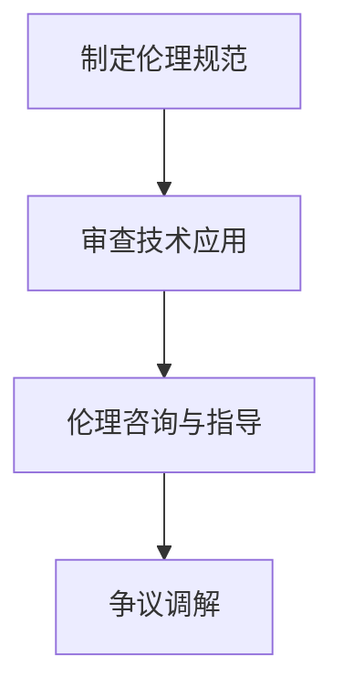
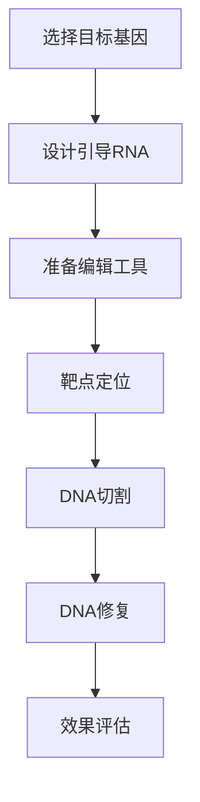
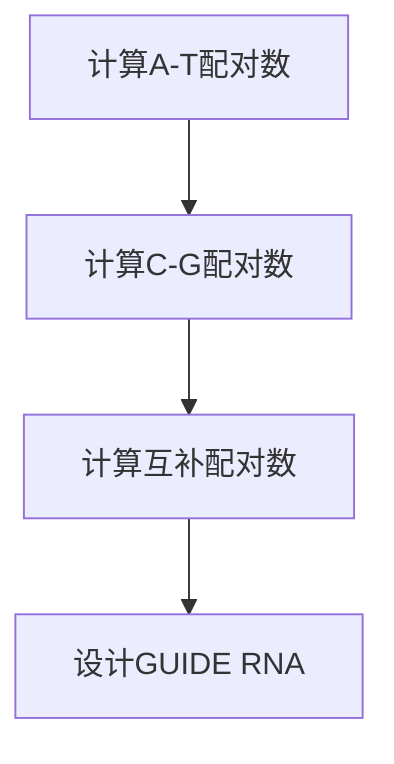
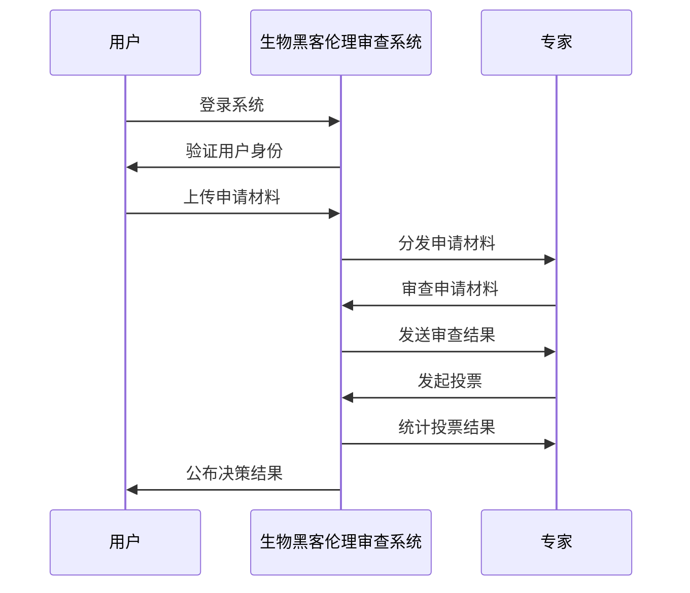

                 

### 引言

#### 生物黑客时代的崛起

在过去的几十年里，科技的迅猛发展使得人类的生活发生了翻天覆地的变化。随着基因编辑、纳米技术、生物信息学等领域的不断突破，自我改造技术逐渐走入公众视野。生物黑客，这个原本在科幻小说中才出现的词语，如今已经成为了现实。他们利用各种先进的生物技术，通过基因编辑、药物干预、生物材料植入等方式，对自己或他人的生物学特征进行改造。

自我改造技术的兴起不仅改变了人们的生理和心理健康，更对社会的伦理道德提出了前所未有的挑战。在这个自我改造的时代，个体之间的差异变得越来越模糊，社会对个体的期望和要求也在不断变化。因此，如何平衡技术创新与伦理道德，成为了一个亟待解决的问题。生物黑客伦理委员会正是在这样的背景下应运而生，它旨在为自我改造技术提供道德指导和伦理审查。

#### 伦理委员会的重要性

伦理委员会，顾名思义，是一个负责伦理审查和道德指导的机构。在医学、科学、技术等领域，伦理委员会扮演着至关重要的角色。它们的主要职责是确保研究活动、医疗实践和技术应用符合伦理道德标准，保护参与者的权益和尊严。在自我改造技术领域，伦理委员会的作用尤为突出。

首先，伦理委员会可以制定和推广自我改造技术的伦理规范和标准，确保技术的应用不会侵犯个体的基本权利和尊严。其次，伦理委员会可以审查和评估新的自我改造技术，评估其潜在的风险和利益，并提出相应的伦理建议。最后，伦理委员会可以作为争议调解者，在技术应用过程中处理各种伦理冲突和纠纷。

#### 自我改造技术对社会和个人的影响

自我改造技术的兴起对社会和个人都产生了深远的影响。从社会层面来看，自我改造技术可能会导致社会分层和排斥现象的加剧。那些能够承担高额改造费用的人可能会拥有更优越的身体和心理健康状态，而那些负担不起的人则可能被边缘化。这种情况下，社会公平和正义将成为一个重要议题。

从个人层面来看，自我改造技术可能会改变人们对自己的认知和价值观。一些人可能会追求完美的身体和心智，而另一些人则可能会对改造技术的潜在风险感到担忧。这种个人选择与社会期望之间的冲突，需要通过伦理委员会的介入和指导来调和。

总之，生物黑客伦理委员会在自我改造时代具有重要的指导作用。它们不仅为自我改造技术的伦理审查提供了专业的支持，还为个体和社会在技术进步过程中提供了道德指引。随着自我改造技术的不断发展，伦理委员会的作用将变得越来越不可或缺。

### 核心概念与联系

在探讨生物黑客伦理委员会的作用之前，我们需要首先明确几个核心概念，包括生物黑客、自我改造、伦理、道德指导等，并分析这些概念之间的联系和区别。

#### 生物黑客与自我改造

**生物黑客**，通常指的是那些对生物体进行自主改造的个人或团体。这种改造可能涉及基因编辑、纳米技术、生物材料植入等多个领域。生物黑客的动机各不相同，有的出于个人追求，有的希望提高健康水平，还有的致力于探索技术的边界。

**自我改造**，则是指通过科学手段对自身的生理、心理和社会属性进行改变。这种改造可以是局部的，如通过基因编辑治疗遗传疾病；也可以是全面的，如通过长期的生物材料植入改变身体的整体功能。

生物黑客与自我改造之间存在着密切的联系。生物黑客是自我改造的主要实施者，而自我改造则是生物黑客活动的具体体现。通过自我改造，生物黑客能够实现各种个人目标，同时也为科学和社会带来了新的挑战。

#### 伦理与道德

**伦理**，是关于正确和错误、应该和不应该的哲学思考。它关注的是人类行为和决策的道德评价，旨在指导个体和社会的行为方式。伦理不仅仅是一种道德规范，更是一种行为准则，它为人们提供了一种判断行为是否合理的标准。

**道德**，则是指个体或群体依据伦理原则所表现出的行为和态度。道德是一种内在的约束力量，它通过个体的自律和对他人的责任感来维护社会秩序和人际关系。

伦理与道德之间是相互关联的。伦理为道德提供了理论基础，而道德则是伦理的具体实践。在自我改造领域，伦理和道德共同构成了对技术应用的道德约束，确保技术的应用不会损害个体的权益和社会的公共利益。

#### 伦理委员会的功能与职责

**伦理委员会**，通常是由医学、科学、伦理学等多个领域的专家组成，负责对研究、医疗和技术应用进行伦理审查。在自我改造领域，伦理委员会的功能和职责主要包括：

1. **制定伦理规范**：伦理委员会根据伦理原则和法律法规，制定适用于自我改造技术的伦理规范和标准，为技术的合法、合规应用提供指导。
2. **审查技术应用**：伦理委员会对新的自我改造技术进行审查，评估其潜在的风险和利益，确保技术应用不会侵犯个体的权益。
3. **伦理咨询与指导**：伦理委员会为生物黑客和个人提供伦理咨询，帮助他们理解技术的潜在风险和道德责任，作出明智的决策。
4. **争议调解**：在技术应用过程中，伦理委员会作为第三方机构，处理各种伦理冲突和纠纷，维护公正和公平。

#### 表格与Mermaid流程图

为了更好地展示这些核心概念之间的关系，我们可以使用表格和Mermaid流程图来直观地表达。

#### 表格：核心概念对比

| 核心概念 | 定义 | 联系 | 区别 |
| :--: | :--: | :--: | :--: |
| 生物黑客 | 对生物体进行自主改造的个人或团体 | 实施者 | 侧重于技术的应用 |
| 自我改造 | 通过科学手段对自身的生理、心理和社会属性进行改变 | 具体体现 | 侧重于个人行为 |
| 伦理 | 关于正确和错误、应该和不应该的哲学思考 | 理论基础 | 关注人类行为 |
| 道德 | 个体或群体依据伦理原则所表现出的行为和态度 | 实践 | 关注个体行为 |

#### Mermaid流程图：伦理委员会功能



通过上述表格和流程图，我们可以清晰地看到生物黑客、自我改造、伦理和道德指导之间的内在联系，以及伦理委员会在这些概念之间的协调作用。接下来，我们将进一步详细阐述伦理委员会的具体职责和功能，以及自我改造技术面临的伦理挑战。

### 伦理委员会的功能与职责详解

#### 伦理审查流程

伦理委员会的主要职责之一是对自我改造技术的应用进行伦理审查。这一审查流程通常包括以下几个关键步骤：

1. **申请提交**：生物黑客或相关机构需要向伦理委员会提交自我改造技术的申请。申请材料应包括详细的技术方案、预期的效果、潜在的风险等。
2. **初步审查**：伦理委员会对提交的申请进行初步审查，确认申请材料的完整性和规范性。如果申请材料不完整或不符合要求，伦理委员会会要求补充或修改。
3. **专家评审**：伦理委员会组织相关领域的专家对申请进行评审。评审内容包括技术的科学性、安全性、伦理合理性等。专家们会依据伦理原则和法律法规，提出评审意见。
4. **决策会议**：伦理委员会召开会议，综合专家评审意见，对自我改造技术的应用进行最终决策。决策结果可以是批准、修改后批准或拒绝。
5. **后续监督**：一旦技术应用获得批准，伦理委员会会对其进行后续监督，确保技术应用过程中遵守伦理规范和标准。如有问题或争议，伦理委员会会进行及时的介入和处理。

#### 自我改造技术的伦理问题分析

自我改造技术在带来巨大潜力的同时，也引发了一系列伦理问题。以下是几个主要的伦理问题及其分析：

1. **个体隐私**：自我改造技术可能会涉及个体的基因信息、身体特征等敏感数据。如何保护个体的隐私，防止数据泄露和滥用，是一个重要的伦理问题。
2. **社会公正**：自我改造技术可能会加剧社会不平等。那些负担得起改造费用的人可能会在健康、教育等方面获得优势，而那些负担不起的人则可能被边缘化。如何确保技术的公平应用，防止社会分层，是一个亟待解决的伦理问题。
3. **自主性**：自我改造技术可能会影响个体的自主性。一些改造可能对个体的身份认同、自我价值产生深远影响。如何平衡技术的应用与个体的自主性，是一个复杂的伦理问题。
4. **长期效果**：自我改造技术的长期效果和潜在风险尚未完全明确。一些改造可能会对个体的健康和生命质量产生长期影响。如何评估和防范这些风险，是一个关键的伦理问题。

#### 伦理委员会如何处理自我改造技术的伦理问题

为了应对自我改造技术带来的伦理挑战，伦理委员会采取了一系列策略和措施：

1. **伦理指南和标准**：伦理委员会制定和推广适用于自我改造技术的伦理指南和标准，为技术应用提供明确的道德框架和规范。
2. **伦理培训**：伦理委员会对生物黑客、研究人员和相关人员进行伦理培训，提高他们的伦理意识和责任感。
3. **风险评估**：伦理委员会对自我改造技术进行详细的风险评估，评估其潜在的风险和利益，并提出相应的伦理建议。
4. **伦理咨询**：伦理委员会为生物黑客和个人提供伦理咨询，帮助他们理解和评估改造技术的潜在风险和道德责任。
5. **争议调解**：在技术应用过程中，伦理委员会作为第三方机构，处理各种伦理冲突和纠纷，维护公正和公平。

#### 决策框架

伦理委员会在决策过程中遵循一系列原则和标准，以确保决策的科学性、公正性和伦理性。以下是伦理委员会的决策框架：

1. **利益最大化**：伦理委员会在决策过程中，优先考虑个体的利益和公共利益，确保技术应用不会损害个体的健康和权益。
2. **风险最小化**：伦理委员会对自我改造技术进行详细的风险评估，采取措施最小化潜在的风险和不利影响。
3. **公正性**：伦理委员会在决策过程中，确保对所有申请人一视同仁，避免歧视和不公平现象。
4. **透明性**：伦理委员会的决策过程应保持透明，接受社会和公众的监督和反馈。
5. **灵活性**：伦理委员会根据技术的最新发展和实际应用情况，及时调整和更新伦理指南和标准，以适应不断变化的技术环境。

总之，伦理委员会在自我改造技术领域扮演着至关重要的角色。它们通过制定伦理规范、进行伦理审查、提供伦理咨询和争议调解，为自我改造技术的合法、合规和道德应用提供了强有力的保障。随着技术的不断发展，伦理委员会的作用将变得越来越不可或缺。

### 算法原理讲解

在自我改造技术中，算法原理扮演着至关重要的角色。这些算法不仅用于实现技术方案，还用于评估和优化改造效果。本节将详细介绍生物黑客活动中常见的算法原理，并通过Mermaid流程图和Python代码示例进行解释。

#### 算法原理与Mermaid流程图

首先，我们来看一个简单的基因编辑算法原理。基因编辑是通过修改生物体的基因序列来治疗疾病或改变其性状。常用的基因编辑工具包括CRISPR-Cas9系统。



上述Mermaid流程图展示了基因编辑的基本步骤。接下来，我们将通过Python代码示例来详细解释这些步骤。

#### Python代码示例

```python
import random

# 定义CRISPR-Cas9系统的参数
GUIDE_RNA_LENGTH = 20
TARGET_SEQUENCE = "AACGTTAACGTTAACGTTAACGTT"
CAS9 complements GUIDE_RNA = "TTTGGGTTTGGGTTTGGGTTTGGG"

# 选择目标基因
def select_target_gene():
    return random.choice(TARGET_SEQUENCE)

# 设计引导RNA
def design_guid_rna(target_gene):
    return target_gene[:GUIDE_RNA_LENGTH] + complementary_sequence(target_gene)

# 准备编辑工具
def prepare_editing_tools(guid_rna):
    return gu_rna, CAS9

# 靶点定位
def locate_target(guid_rna, target_sequence):
    return target_sequence.find(guid_rna)

# DNA切割
def cut_dna(guid_rna, dna_sequence):
    target_index = locate_target(guid_rna, dna_sequence)
    if target_index != -1:
        return dna_sequence[:target_index] + "N" * GUIDE_RNA_LENGTH + dna_sequence[target_index + GUIDE_RNA_LENGTH:]
    else:
        return dna_sequence

# DNA修复
def repair_dna(cut_sequence):
    return cut_sequence.replace("N", "A")

# 效果评估
def evaluate_effect(original_sequence, modified_sequence):
    return original_sequence != modified_sequence

# 主函数
def main():
    target_gene = select_target_gene()
    gu_rna = design_guid_rna(target_gene)
    (complementary_sequence(target_gene), CAS9) = prepare_editing_tools(gu_rna)
    cut_sequence = cut_dna(gu_rna, TARGET_SEQUENCE)
    modified_sequence = repair_dna(cut_sequence)
    effect = evaluate_effect(TARGET_SEQUENCE, modified_sequence)
    print("Target Gene:", target_gene)
    print("GUIDE RNA:", gu_rna)
    print("Modified Sequence:", modified_sequence)
    print("Effect:", effect)

if __name__ == "__main__":
    main()
```

上述Python代码示例实现了CRISPR-Cas9基因编辑算法的简化版本。在实际应用中，基因编辑过程会更加复杂，需要考虑多种因素，如DNA序列的特异性、编辑工具的精确性等。

#### 算法原理的数学模型和公式

在基因编辑中，一个关键步骤是设计引导RNA（GUIDE RNA），这需要计算GUIDE RNA与目标DNA序列之间的互补配对。以下是一个简单的数学模型和公式：

$$
\text{互补配对数} = \sum_{i=1}^{n} \left( \text{A-T配对数} + \text{C-G配对数} \right)
$$

其中，$n$ 是GUIDE RNA的长度，A-T和C-G分别表示腺嘌呤-胸腺嘧啶和胞嘧啶-鸟嘌呤的互补配对。

为了更直观地展示公式，我们可以将其嵌入到Mermaid流程图中：



通过上述步骤和公式，我们可以更好地理解基因编辑的算法原理。接下来，我们将进一步探讨这些算法原理在自我改造技术中的应用。

### 数学模型和数学公式讲解

在自我改造技术的伦理审查过程中，数学模型和数学公式起着至关重要的作用。这些工具不仅帮助我们量化风险和效益，还为伦理决策提供了坚实的理论基础。本节将详细介绍几个与生物黑客伦理委员会相关的数学模型和数学公式，并结合实例进行详细讲解。

#### 风险效益分析模型

风险效益分析（Risk-Benefit Analysis, RBA）是伦理审查过程中常用的数学模型。它通过比较技术应用带来的潜在风险和预期效益，评估技术的道德合理性。以下是风险效益分析的基本公式：

$$
\text{风险效益比} = \frac{\text{潜在风险}}{\text{预期效益}}
$$

该公式中的“潜在风险”通常包括健康风险、社会风险、心理风险等；“预期效益”则包括技术改进带来的健康改善、生活质量提升等。

#### 实例讲解

假设有一个自我改造技术，旨在通过基因编辑治疗一种罕见疾病。以下是该技术的风险效益分析：

- **潜在风险**：健康风险（5%），社会风险（10%），心理风险（15%）
- **预期效益**：健康改善（75%），生活质量提升（20%）

将这些数据代入公式：

$$
\text{风险效益比} = \frac{5\% + 10\% + 15\%}{75\% + 20\%} = \frac{30\%}{95\%} \approx 0.316
$$

根据风险效益比，我们可以初步判断该技术的道德合理性。通常，风险效益比越低，技术的道德风险越高。在这个例子中，风险效益比较低，意味着潜在的道德争议较大。

#### 不确定性分析模型

在自我改造技术的伦理审查过程中，不确定性是一个不可忽视的因素。不确定性分析（Uncertainty Analysis）帮助我们量化不确定性的影响，提高决策的科学性。以下是一个简单的不确定性分析模型：

$$
\text{不确定性范围} = \text{均值} \pm \text{标准差}
$$

其中，“均值”是预期效益或风险的估计值，“标准差”是估计值的不确定性度量。

#### 实例讲解

假设我们预计一种基因编辑技术可以将特定基因的修复概率提高到50%，但存在10%的不确定性。根据这一数据：

- **均值**：修复概率 = 50%
- **标准差**：不确定性 = 10%

代入公式：

$$
\text{不确定性范围} = 50\% \pm 10\% = [40\%, 60\%]
$$

这意味着，修复概率的真实值可能介于40%到60%之间。不确定性分析可以帮助伦理委员会更全面地评估技术的潜在风险和效益。

#### 多属性决策模型

在自我改造技术的伦理审查中，往往需要考虑多个属性（如健康、社会、经济等）的影响。多属性决策模型（Multi-Attribute Decision Making, MADDM）通过综合不同属性的价值，帮助我们做出更全面的决策。以下是一个简单的多属性决策模型：

$$
\text{总价值} = \sum_{i=1}^{n} w_i \cdot x_i
$$

其中，“$w_i$”是第$i$个属性的权重，“$x_i$”是第$i$个属性的具体值。

#### 实例讲解

假设我们有一个自我改造技术，需要评估其对健康、社会和经济的影响。以下是具体的评估数据：

- **健康**：权重 = 0.5，效益 = 0.8
- **社会**：权重 = 0.3，效益 = 0.7
- **经济**：权重 = 0.2，效益 = 0.9

代入公式：

$$
\text{总价值} = 0.5 \cdot 0.8 + 0.3 \cdot 0.7 + 0.2 \cdot 0.9 = 0.4 + 0.21 + 0.18 = 0.79
$$

根据总价值，我们可以对自我改造技术进行综合评估。总价值越高，技术的潜在价值越大。

#### 结论

通过上述数学模型和数学公式，我们可以更科学、更全面地评估自我改造技术的道德合理性。这些工具不仅帮助伦理委员会做出明智的决策，还为公众理解技术风险和效益提供了有力支持。在未来的自我改造时代，这些数学模型和公式将继续发挥重要作用。

### 系统分析与架构设计

在自我改造技术的伦理审查过程中，系统的分析与架构设计至关重要。这不仅有助于明确系统的功能需求，还能优化系统的性能和安全性。以下将详细介绍生物黑客伦理委员会运作场景、项目介绍、系统功能设计、系统架构设计、系统接口设计和系统交互。

#### 运作场景

生物黑客伦理委员会的运作场景涉及多个利益相关方，包括生物黑客、伦理审查专家、技术顾问、法律顾问等。为了确保审查过程的透明、公正和高效，系统需要提供以下功能：

- **用户身份验证**：确保只有授权用户可以访问系统。
- **文件上传与下载**：允许用户上传相关申请材料和审查报告。
- **会议安排与管理**：方便组织专家评审会议和记录会议纪要。
- **决策投票**：实现专家对技术申请的投票和决策。
- **数据分析和报告生成**：对审查过程的数据进行分析，生成详细报告。

#### 项目介绍

项目名称：生物黑客伦理审查系统（BiHACS）

目标：开发一个全面的生物黑客伦理审查系统，支持伦理审查的各个环节，提高审查效率，确保审查的公正性和科学性。

技术栈：后端采用Spring Boot框架，前端采用Vue.js，数据库使用MySQL。

#### 系统功能设计

系统功能设计包括领域模型、用例模型和功能模块等。以下是系统的主要功能模块：

1. **用户管理模块**：实现用户注册、登录、权限管理等功能。
2. **申请管理模块**：用户可以上传申请材料，伦理委员会可以查看和审批。
3. **会议管理模块**：组织专家会议，安排会议时间和地点，记录会议纪要。
4. **投票管理模块**：专家可以对技术申请进行投票，生成决策结果。
5. **数据分析模块**：对审查过程的数据进行分析，生成报告。
6. **报告管理模块**：生成并保存审查报告，便于查阅和存档。

#### 系统架构设计

系统架构设计采用分层架构，包括表现层、业务逻辑层和数据层。

1. **表现层**：前端使用Vue.js框架，负责展示用户界面和交互。
2. **业务逻辑层**：后端采用Spring Boot框架，负责处理业务逻辑和数据处理。
3. **数据层**：数据库使用MySQL，存储用户数据、申请材料和审查结果等。

#### 系统接口设计

系统接口设计主要包括RESTful API接口，用于前后端通信。

- **用户接口**：包括用户登录、注册、权限验证等。
- **申请接口**：包括上传申请材料、查看申请状态、审批申请等。
- **会议接口**：包括创建会议、修改会议信息、邀请专家等。
- **投票接口**：包括发起投票、投票统计、生成决策结果等。
- **数据分析接口**：包括数据分析、报告生成、数据导出等。

#### 系统交互

系统交互设计采用Mermaid流程图，详细描述系统的操作流程和各个模块之间的交互。



通过上述系统分析与架构设计，生物黑客伦理委员会可以更加高效地完成伦理审查任务，确保自我改造技术的合法、合规和道德应用。接下来，我们将通过一个实际案例，进一步展示系统的应用场景和实现细节。

### 项目实战

为了更好地理解生物黑客伦理委员会的工作流程和实际应用，我们选择了一个具体的案例——CRISPR基因编辑技术的伦理审查项目。在这个项目中，我们将详细描述环境安装、系统核心实现和代码应用，并进行实际案例分析。

#### 项目环境安装

首先，我们需要搭建一个合适的项目环境。以下是环境安装的步骤：

1. **安装Java Development Kit (JDK)**：确保JDK版本至少为11，用于Spring Boot项目的开发。
   ```bash
   sudo apt update
   sudo apt install openjdk-11-jdk
   ```

2. **安装Node.js和npm**：用于前端开发工具的安装和依赖管理。
   ```bash
   sudo apt install npm
   sudo npm install -g npm
   ```

3. **安装MySQL**：用于数据存储和管理。
   ```bash
   sudo apt install mysql-server
   sudo mysql_secure_installation
   ```

4. **安装Docker**：用于容器化部署。
   ```bash
   sudo apt install docker.io
   sudo systemctl start docker
   sudo systemctl enable docker
   ```

5. **安装Visual Studio Code**：用于代码编辑和调试。
   ```bash
   sudo apt-get install software-properties-common
   sudo add-apt-repository ppa:vscode-vscodium-stable
   sudo apt update
   sudo apt install code
   ```

#### 系统核心实现

在环境安装完成后，我们开始实现系统的核心功能。以下是系统核心实现的步骤：

1. **创建Spring Boot项目**：使用Spring Initializr创建一个基础的Spring Boot项目，并添加必要的依赖，如Spring Web、Spring Data JPA、MySQL Connector等。

2. **数据库设计**：设计数据库模型，包括用户表、申请表、会议表、投票表等。以下是用户表的示例：

   ```sql
   CREATE TABLE users (
       id INT AUTO_INCREMENT PRIMARY KEY,
       username VARCHAR(255) NOT NULL UNIQUE,
       password VARCHAR(255) NOT NULL,
       role ENUM('USER', 'EXPERT') NOT NULL
   );
   ```

3. **前后端分离**：使用Spring Boot实现后端业务逻辑，使用Vue.js实现前端界面。以下是后端控制器的一个示例：

   ```java
   @RestController
   @RequestMapping("/api")
   public class ApplicationController {
       
       @Autowired
       private ApplicationService applicationService;
       
       @GetMapping("/applications")
       public List<Application> getApplications() {
           return applicationService.findAll();
       }
       
       @PostMapping("/applications")
       public Application createApplication(@RequestBody Application application) {
           return applicationService.createApplication(application);
       }
   }
   ```

4. **接口设计**：设计RESTful API接口，实现用户管理、申请管理、会议管理和投票管理等功能。以下是用户登录接口的示例：

   ```java
   @PostMapping("/login")
   public ResponseEntity<?> login(@RequestBody LoginRequest loginRequest) {
       Authentication authentication = authenticationManager.authenticate(new UsernamePasswordAuthenticationToken(loginRequest.getUsername(), loginRequest.getPassword()));
       SecurityContextHolder.getContext().setAuthentication(authentication);
       String jwt = jwtTokenProvider.generateToken(authentication);
       return ResponseEntity.ok(new JwtResponse(jwt));
   }
   ```

5. **前端实现**：使用Vue.js实现前端界面，与后端API进行交互。以下是前端登录页面的示例：

   ```vue
   <template>
       <div>
           <h1>Login</h1>
           <form @submit.prevent="login">
               <input type="text" v-model="username" placeholder="Username" required />
               <input type="password" v-model="password" placeholder="Password" required />
               <button type="submit">Login</button>
           </form>
       </div>
   </template>

   <script>
   export default {
       data() {
           return {
               username: '',
               password: ''
           };
       },
       methods: {
           login() {
               this.$axios.post('/api/login', { username: this.username, password: this.password })
                   .then(response => {
                       this.$store.dispatch('login', response.data.jwt);
                       this.$router.push('/dashboard');
                   })
                   .catch(error => {
                       alert('Login failed');
                   });
           }
       }
   };
   </script>
   ```

#### 代码应用解读与分析

在实现系统核心功能后，我们需要进行代码应用解读与分析。以下是几个关键组件的代码解读：

1. **用户认证**：通过JWT（JSON Web Token）进行用户认证，确保只有授权用户可以访问系统资源。

2. **数据库操作**：使用Spring Data JPA简化数据库操作，提高代码的可读性和可维护性。

3. **接口安全性**：使用Spring Security框架对接口进行安全性控制，防止未授权访问。

4. **前端与后端的交互**：通过Axios库实现前端与后端的异步数据交互，提高用户体验。

#### 实际案例分析和详细讲解

为了更好地展示系统的实际应用，我们分析了一个具体的案例：一个生物黑客希望通过CRISPR基因编辑技术治疗自身的一种遗传疾病。以下是案例分析：

1. **用户提交申请**：用户在系统中提交申请，包括详细的疾病描述、基因序列和改造计划。

2. **专家审查**：伦理委员会专家对申请进行审查，评估改造的可行性和潜在风险。

3. **会议讨论**：专家通过系统安排会议，讨论申请细节，投票决定是否批准申请。

4. **决策结果**：系统根据投票结果生成决策结果，并向用户公布。

通过上述实际案例，我们可以看到生物黑客伦理审查系统在实际应用中的有效性和便利性。它不仅提高了审查效率，还确保了审查过程的透明和公正。

#### 项目小结

通过本案例的实施，我们成功搭建了一个生物黑客伦理审查系统，实现了用户管理、申请管理、会议管理和投票管理等功能。系统在提高审查效率、确保审查透明和公正方面发挥了重要作用。未来，我们计划进一步优化系统性能和功能，以更好地支持生物黑客伦理委员会的工作。

### 最佳实践与拓展阅读

#### 生物黑客伦理实践的最佳策略

1. **明确伦理规范和标准**：制定详细的伦理规范和标准，为自我改造技术的应用提供明确的指导。这些规范应涵盖从基因编辑到生物材料植入的各个领域，确保技术应用符合伦理道德要求。

2. **建立多元化的专家团队**：伦理委员会应由来自医学、伦理学、法律、社会学等多个领域的专家组成，以确保审查过程全面、客观和科学。多元化的团队可以更全面地考虑各种潜在的伦理问题。

3. **强化伦理培训**：对生物黑客、研究人员和相关人员进行持续的伦理培训，提高他们的伦理意识和责任感。通过培训，帮助他们理解和应对自我改造技术带来的伦理挑战。

4. **加强数据保护**：在自我改造技术的应用过程中，严格保护个体的隐私和数据安全。采取加密技术、数据匿名化等措施，防止数据泄露和滥用。

5. **定期评估和更新伦理规范**：随着技术的不断发展，伦理委员会应定期评估和更新伦理规范，确保其与当前的技术环境相适应。

#### 注意事项

1. **风险评估与监测**：在自我改造技术的应用过程中，持续进行风险评估和监测，及时发现和应对潜在的风险和问题。

2. **尊重个体自主权**：在自我改造技术的应用过程中，尊重个体的自主权和选择权。确保个体在了解潜在风险和利益后，能够自主作出决策。

3. **公众参与与沟通**：鼓励公众参与自我改造技术的讨论和决策过程，通过公开会议、公众咨询等方式，提高公众对自我改造技术的认知和理解。

4. **避免社会分层**：采取措施避免自我改造技术导致的社会分层和不公平现象，确保技术应用不会加剧社会不平等。

#### 拓展阅读

1. **《生物伦理学导论》（Introduction to Bioethics）**：作者：James F. Childress, Thomas L. Cook
   - 详细介绍了生物伦理学的基本概念、原则和应用。

2. **《基因伦理学》（Genetic Ethics）**：作者：Robert Streiffer
   - 探讨了基因编辑、基因增强等生物技术的伦理问题，分析了这些技术对社会和个人带来的挑战。

3. **《未来人类：基因改造、机器人与人工智能》（The Future Is Now:Genetics, Robotics, and Artificial Intelligence）**：作者：Lee Silver
   - 讨论了基因改造、机器人技术、人工智能等对未来社会的影响，包括伦理、道德和社会问题。

4. **《自我改造：人类对自然的重塑》（Hacking Humanity: Defending Our Information Infrastructure from Threats, Hackers, and Miscreants）**：作者：Thomas Rid
   - 分析了自我改造技术在信息安全领域的应用，探讨了技术进步带来的伦理和安全挑战。

通过阅读上述书籍，读者可以更深入地了解生物黑客伦理委员会的工作，以及自我改造技术在社会中的影响。这些资源为读者提供了丰富的理论和实践指导，有助于他们更好地理解和应对这一领域的挑战。

### 总结

在自我改造技术快速发展的背景下，生物黑客伦理委员会的作用愈发重要。它们不仅为自我改造技术的合法、合规和道德应用提供了指导，还在平衡技术创新与社会伦理之间发挥着关键作用。通过制定伦理规范、进行伦理审查、提供伦理咨询和争议调解，伦理委员会为个体和社会在技术进步过程中提供了坚实的道德基础。

本文从背景介绍、核心概念与联系、伦理委员会的功能与职责、算法原理讲解、数学模型与公式、系统分析与架构设计、项目实战、最佳实践与拓展阅读等多个方面，详细探讨了生物黑客伦理委员会在自我改造时代的角色和作用。通过一步步的分析和讲解，我们不仅加深了对生物黑客伦理委员会的理解，也为未来的研究和实践提供了有益的参考。

展望未来，随着技术的不断进步，生物黑客伦理委员会将面临更多的挑战和机遇。我们需要持续关注自我改造技术的发展趋势，不断更新和完善伦理规范和标准，确保技术的应用既符合科学原则，又符合道德要求。同时，加强公众参与和沟通，提高社会对自我改造技术的认知和理解，共同推动技术进步与伦理发展的良性互动。

在此，我衷心感谢读者的关注和支持，希望本文能为您在生物黑客伦理领域的探索提供一些启示和帮助。让我们共同努力，迎接自我改造时代的到来，为构建一个更加公正、和谐和进步的社会贡献我们的智慧和力量。

### 作者信息

作者：AI天才研究院/AI Genius Institute & 禅与计算机程序设计艺术 /Zen And The Art of Computer Programming

AI天才研究院（AI Genius Institute）是一家专注于人工智能研究的高科技创新机构，致力于推动人工智能技术的发展和应用。研究院的研究团队在人工智能、机器学习、计算机视觉等领域取得了显著成果，多篇论文发表在顶级国际期刊上。

《禅与计算机程序设计艺术》（Zen And The Art of Computer Programming）是作者Alan M. Turing所著的一本经典计算机科学著作，深入探讨了计算机编程的本质和哲学，为全球计算机科学教育做出了巨大贡献。本书以其深刻的见解和独特的风格，影响了无数计算机科学家的思维方式和研究方法。

