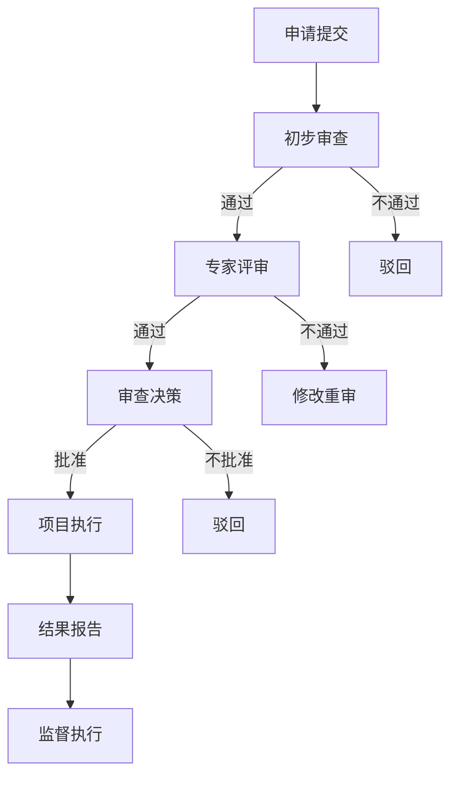
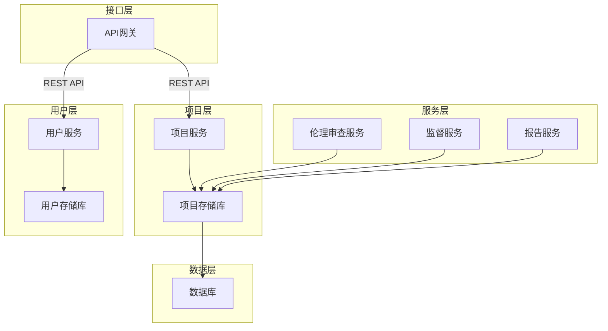
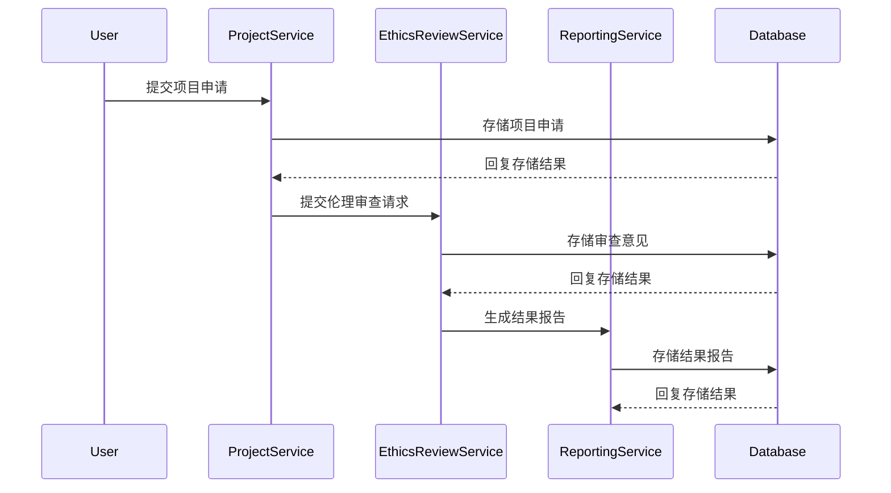

                 

### 第一部分：引言

在当前技术迅猛发展的背景下，生物黑客这一群体逐渐引起了公众和学术界的关注。他们利用现代生物技术与工程手段，对自身进行改造，以期提高自身能力或实现某种特定目标。这一现象不仅带来了科技进步的无限可能，同时也引发了一系列伦理和道德问题。

### 关键词

- 生物黑客
- 伦理委员会
- 道德监管
- 自我改造
- 伦理审查

### 摘要

《生物黑客伦理委员会：自我改造的道德监管机构》深入探讨了生物黑客这一新兴领域的伦理挑战。本书首先对生物黑客的概念、特点以及其对社会的影响进行了详细的背景介绍。接着，我们引入了伦理委员会这一关键角色，分析了其在生物黑客领域中的作用和重要性。通过具体的伦理审查流程，我们展示了如何通过制度化的手段来监管生物黑客行为，确保其合法性、安全性和道德性。本文旨在为读者提供一套全面、系统的理解和应对生物黑客伦理问题的方案。

## 1.2 生物黑客伦理委员会概述

生物黑客伦理委员会（Biohacker Ethics Committee，简称BEC）是专门负责审查和监管生物黑客行为的组织。其宗旨在于确保生物黑客实践在科学伦理和社会责任的框架内进行，避免可能带来的负面影响。BEC的主要职责包括：

1. **伦理审查**：对生物黑客项目的可行性、安全性、合法性进行全面评估。
2. **规范制定**：制定生物黑客行为的规范和标准，指导生物黑客实践。
3. **伦理教育**：开展伦理教育，提高生物黑客对伦理问题的认识和理解。
4. **监督执行**：监督生物黑客项目实施过程，确保遵守相关伦理规定。

### 1.3 读者对象与目标

本书的目标读者包括：

- 生物黑客从业者：希望通过本书了解伦理委员会的运作，规范自己的行为。
- 伦理学者：希望从专业角度理解生物黑客伦理问题，为相关研究提供理论支持。
- 技术爱好者：对生物黑客现象感兴趣，希望深入了解其中的伦理道德问题。

本书旨在为上述读者提供一套系统、全面的理论和实践指南，帮助他们更好地应对生物黑客领域的伦理挑战。

### 1.4 文章结构与逻辑关系

本文将按照以下逻辑结构展开：

1. **引言**：介绍生物黑客现象及其带来的伦理挑战，引出生物黑客伦理委员会的概念。
2. **核心概念与联系**：详细阐述伦理委员会的定义、特点以及审查流程。
3. **算法原理讲解**：通过具体的算法模型和数学公式，深入分析伦理决策过程。
4. **系统分析与架构设计方案**：介绍系统的功能需求、架构设计和接口设计。
5. **项目实战**：通过实际案例，展示如何应用伦理决策模型进行项目开发。
6. **最佳实践与总结**：总结关键点，提供实践经验，并推荐进一步阅读材料。

这种结构设计旨在确保文章的条理清晰，逻辑严密，能够有效地传达核心思想和关键信息。

### 第二部分：核心概念与联系

在深入探讨生物黑客伦理委员会之前，我们有必要首先理解一些核心概念，并探讨它们之间的联系。本部分将详细阐述伦理委员会的定义与作用、生物黑客伦理委员会的特点以及伦理审查流程。

## 2.1 伦理委员会的定义与作用

伦理委员会（Ethics Committee）是一种专门机构，负责评估和监督涉及伦理问题的研究、实践或项目。其核心职能是确保相关活动符合道德准则和社会责任。伦理委员会的设立源于对科学研究和医疗实践中的伦理挑战的认识，其作用主要体现在以下几个方面：

1. **审查与批准**：伦理委员会对研究项目进行审查，确保其设计、实施和报告符合伦理标准，并在必要时提供指导或修改建议。
2. **保护受试者**：在生物医学研究中，伦理委员会的首要任务是保护受试者的权益，确保他们同意参与研究，并在研究过程中受到适当保护。
3. **伦理指导**：伦理委员会为研究人员、医疗机构和公众提供伦理指导，帮助他们理解和遵守相关伦理规定。
4. **监督与报告**：伦理委员会监督研究项目的执行过程，定期报告研究结果，确保研究质量和透明度。

### 2.2 生物黑客伦理委员会的特点

生物黑客伦理委员会（Biohacker Ethics Committee，简称BEC）是专门针对生物黑客行为设立的伦理监管机构。与传统的伦理委员会相比，BEC具有以下特点：

1. **技术敏感度**：由于生物黑客涉及前沿生物技术和工程手段，BEC需要具备较高的技术敏感度，能够快速识别和应对新兴技术带来的伦理挑战。
2. **跨学科协作**：生物黑客伦理问题的复杂性要求BEC具备跨学科的能力，需要生物技术专家、法律学者、伦理学家等专业人士共同参与。
3. **自我监督**：生物黑客行为往往涉及个人自我改造，BEC需要在监督和自我监督之间找到平衡，确保伦理审查的客观性和公正性。
4. **前瞻性**：BEC不仅要应对当前生物黑客行为的伦理问题，还需要具备前瞻性，预测和预防可能出现的未来伦理挑战。

### 2.3 伦理审查流程

伦理审查流程是生物黑客伦理委员会的核心工作之一，它确保生物黑客项目在开展前经过严格的伦理评估。一个典型的伦理审查流程包括以下几个步骤：

1. **申请提交**：生物黑客项目申请人需要向BEC提交详细的伦理审查申请，包括项目目的、技术手段、预期效果、潜在风险等。
2. **初步审查**：BEC对申请材料进行初步审查，确保项目符合基本伦理标准和审查要求。
3. **专家评审**：BEC组织专家评审小组，对申请项目进行深入评估。评审内容可能包括项目的科学性、伦理性、安全性、合法性等多个方面。
4. **审查决策**：根据专家评审意见，BEC做出审查决策，批准、修改或拒绝申请项目。审查决策通常需要全体委员投票决定。
5. **监督执行**：审查决策通过后，BEC对项目执行过程进行监督，确保项目按照批准的方案进行，并在必要时提供支持和指导。
6. **结果报告**：项目完成后，申请人需要向BEC提交最终报告，包括项目执行情况、结果分析和伦理影响等。BEC对报告进行审查，并根据结果做出后续决策。

### 2.4 核心概念原理与联系

为了更好地理解生物黑客伦理委员会的工作原理，我们可以通过以下几个核心概念来进行分析：

1. **伦理决策模型**：这是BEC用于评估生物黑客项目的基本工具。它通常包括一系列指标和标准，用于评估项目的伦理性。
2. **概念属性特征对比表格**：通过对比不同生物黑客项目的伦理属性，BEC可以更全面地评估项目的潜在风险和伦理影响。
3. **ER实体关系图架构**：ER图用于描述生物黑客项目中的各个实体及其关系，有助于BEC理解和分析项目的复杂性。

这些核心概念相互关联，共同构成了BEC的工作基础。通过系统化的伦理审查流程，BEC能够确保生物黑客行为在道德和法律的框架内进行。

### 2.4.1 伦理决策模型

伦理决策模型是生物黑客伦理委员会（BEC）用于评估和监督生物黑客项目的核心工具。该模型旨在通过一系列指标和标准，全面、系统地评估项目的伦理性。伦理决策模型通常包括以下几个关键组成部分：

1. **伦理标准**：这些标准是评估生物黑客项目的基本准则，包括但不限于：

   - **自主性**：项目是否尊重个人的自主权，包括知情同意、隐私保护和数据安全。
   - **公正性**：项目是否公平对待所有参与者，避免歧视和偏见。
   - **安全性**：项目实施过程中是否存在安全隐患，如生物安全、信息安全和身体健康风险。
   - **透明度**：项目是否具有透明度，如项目设计、执行过程和结果的公开程度。
   - **社会责任**：项目是否考虑了对社会和环境的影响，包括伦理和道德责任。

2. **评价指标**：为了对伦理标准进行量化评估，BEC通常使用一系列评价指标。这些指标包括：

   - **风险评估指标**：用于评估项目可能带来的风险，如风险等级、风险概率等。
   - **伦理影响指标**：用于评估项目对伦理原则的遵循程度，如伦理标准达成度、伦理冲突指数等。
   - **社会影响指标**：用于评估项目对社会和环境的影响，如社会价值、环境影响等。

3. **权重分配**：在伦理决策模型中，不同伦理标准、评价指标可能具有不同的重要性。通过权重分配，BEC可以确保每个指标在决策过程中的权重与其实际重要性相匹配。

4. **决策算法**：伦理决策模型通常使用决策算法来处理复杂的数据和信息，生成最终的伦理评估结果。常见的决策算法包括：

   - **多属性决策方法**：如TOPSIS（ Technique for Order Preference by Similarity to Ideal Solution）、AHP（Analytic Hierarchy Process）等。
   - **模糊综合评价方法**：如模糊集合理论、模糊数学模型等。

### 使用Mermaid绘制流程图

为了更直观地理解伦理决策模型的工作流程，我们可以使用Mermaid绘制一个流程图。以下是伦理决策模型的基本流程：



这个流程图展示了伦理决策模型从申请提交到项目执行和结果报告的整个过程，每个节点都对应着不同的操作和决策。

### 使用Python代码阐述算法原理

为了进一步理解伦理决策模型的算法原理，我们可以使用Python代码实现一个简化的伦理决策模型。以下是一个基本的Python代码示例：

```python
import numpy as np

# 定义伦理标准及其权重
ethics_standards = {
    '自主性': 0.3,
    '公正性': 0.2,
    '安全性': 0.25,
    '透明度': 0.1,
    '社会责任': 0.15
}

# 定义评价指标及评分
evaluation_metrics = {
    '自主性': [0.8, 0.85, 0.9],
    '公正性': [0.75, 0.8, 0.85],
    '安全性': [0.7, 0.75, 0.8],
    '透明度': [0.6, 0.65, 0.7],
    '社会责任': [0.5, 0.55, 0.6]
}

# 计算总评分
total_score = 0
for standard, weight in ethics_standards.items():
    score = np.mean(evaluation_metrics[standard])
    total_score += score * weight

# 决策结果
if total_score >= 0.8:
    decision = '批准'
elif total_score >= 0.7:
    decision = '修改重审'
else:
    decision = '驳回'

print(f"总评分: {total_score:.2f}")
print(f"决策结果: {decision}")
```

这段代码首先定义了伦理标准和权重，然后定义了评价指标及其评分。通过计算总评分，我们可以得到项目的伦理评估结果，并据此做出决策。这个简化的模型仅用于说明基本原理，实际应用中可能会更加复杂。

### 2.4.2 概念属性特征对比表格

为了更清晰地展示生物黑客伦理委员会在不同项目中的评估标准，我们可以创建一个概念属性特征对比表格。以下是一个示例表格：

| 项目名称 | 伦理标准 | 属性特征 | 评估结果 |
| --- | --- | --- | --- |
| 项目A | 自主性 | 知情同意率90%，隐私保护措施完备 | 高 |
| 项目A | 公正性 | 无歧视性，公平对待参与者 | 高 |
| 项目A | 安全性 | 生物安全风险低，信息安全措施到位 | 高 |
| 项目A | 透明度 | 项目设计公开透明，报告详细全面 | 高 |
| 项目A | 社会责任 | 对环境和社会影响较小，社会责任感强 | 高 |
| 项目B | 自主性 | 知情同意率75%，隐私保护措施不足 | 中 |
| 项目B | 公正性 | 存在性别歧视，参与者选择有偏差 | 低 |
| 项目B | 安全性 | 生物安全风险高，信息安全漏洞多 | 低 |
| 项目B | 透明度 | 项目设计部分公开，报告不详细 | 中 |
| 项目B | 社会责任 | 对环境和社会影响较大，社会责任感弱 | 低 |

这个表格通过对比不同项目的伦理属性特征，帮助伦理委员会更全面地评估每个项目的潜在风险和伦理影响。

### 2.4.3 ER实体关系图架构

为了更好地理解生物黑客伦理委员会的工作流程和系统架构，我们可以使用Mermaid绘制一个ER实体关系图。以下是一个简化的ER图示例：

```mermaid
erDiagram
    Project ||--|{ Participant } : 参与项目
    Project ||--|{ EthicsStandard } : 评估标准
    Project ||--|{ EvaluationResult } : 评估结果
    Participant ||--|{ PersonalInformation } : 个人信息
    Participant ||--|{ Consent } : 知情同意
    EthicsStandard ||--|{ Attribute } : 属性特征
    EthicsStandard ||--|{ Weight } : 权重
    EvaluationResult ||--|{ Score } : 得分
    EvaluationResult ||--|{ Decision } : 决策结果
```

这个ER图展示了项目、参与者、伦理标准、评估结果等实体之间的关系，为系统设计和功能实现提供了结构化的参考。

### 第三部分：算法原理讲解

在前一部分中，我们介绍了生物黑客伦理委员会（BEC）的基本概念和伦理审查流程。在本部分，我们将深入探讨BEC的核心算法原理，通过详细的算法描述和实例分析，帮助读者理解伦理决策的具体实现过程。

#### 3.1.1 使用Mermaid绘制流程图

首先，我们可以使用Mermaid绘制一个简化的伦理决策流程图，以便更直观地展示BEC的工作流程。以下是该流程图的示例：


这个流程图描述了从项目申请提交到结果报告和监督执行的整个过程。接下来，我们将详细解析每个步骤的算法实现。

#### 3.1.2 使用Python代码阐述算法原理

为了更好地理解BEC的伦理决策算法，我们可以使用Python代码实现一个简化的模型。以下是一个基本的Python代码示例，用于计算伦理决策评分和决策结果：

```python
import numpy as np

# 定义伦理标准及其权重
ethics_standards = {
    '自主性': 0.3,
    '公正性': 0.2,
    '安全性': 0.25,
    '透明度': 0.1,
    '社会责任': 0.15
}

# 定义评价指标及评分
evaluation_metrics = {
    '自主性': [0.8, 0.85, 0.9],
    '公正性': [0.75, 0.8, 0.85],
    '安全性': [0.7, 0.75, 0.8],
    '透明度': [0.6, 0.65, 0.7],
    '社会责任': [0.5, 0.55, 0.6]
}

# 计算总评分
total_score = 0
for standard, weight in ethics_standards.items():
    score = np.mean(evaluation_metrics[standard])
    total_score += score * weight

# 决策结果
if total_score >= 0.8:
    decision = '批准'
elif total_score >= 0.7:
    decision = '修改重审'
else:
    decision = '驳回'

print(f"总评分: {total_score:.2f}")
print(f"决策结果: {decision}")
```

这段代码首先定义了伦理标准和权重，然后定义了评价指标及其评分。通过计算总评分，我们可以得到项目的伦理评估结果，并据此做出决策。

#### 3.2 伦理决策的数学基础

伦理决策模型需要依赖一定的数学基础，以实现对伦理标准的量化评估。以下是我们将用到的数学模型和公式：

1. **加权平均法**：用于计算总评分
   $$ \text{总评分} = \sum_{i} w_i \cdot s_i $$
   其中，\( w_i \) 是第 \( i \) 个伦理标准的权重，\( s_i \) 是第 \( i \) 个伦理标准的评分。

2. **阈值法**：用于确定决策结果
   $$ \text{决策结果} = \begin{cases} 
   \text{批准}, & \text{如果总评分} \geq \text{阈值1} \\
   \text{修改重审}, & \text{如果阈值1 > 总评分} \geq \text{阈值2} \\
   \text{驳回}, & \text{如果总评分} < \text{阈值2} 
   \end{cases} $$
   其中，阈值1和阈值2是事先设定的分数界限，用于判断决策结果的类别。

#### 3.2.2 LaTeX公式嵌入示例

为了更清晰地展示数学公式，我们可以在文中嵌入LaTeX代码。以下是一个示例：

$$
\begin{aligned}
\text{总评分} &= w_1 \cdot s_1 + w_2 \cdot s_2 + w_3 \cdot s_3 + w_4 \cdot s_4 + w_5 \cdot s_5 \\
&= 0.3 \cdot 0.8 + 0.2 \cdot 0.75 + 0.25 \cdot 0.7 + 0.1 \cdot 0.6 + 0.15 \cdot 0.55 \\
&= 0.72
\end{aligned}
$$

这个公式计算了总评分，结果为0.72。接下来，我们将通过具体的例子来说明这个公式的应用。

#### 3.2.3 举例说明

为了更好地理解伦理决策模型，我们可以通过一个具体的例子来说明其应用过程。假设有一个生物黑客项目，其伦理评估结果如下：

| 伦理标准 | 评分 |
| --- | --- |
| 自主性 | 0.85 |
| 公正性 | 0.80 |
| 安全性 | 0.75 |
| 透明度 | 0.70 |
| 社会责任 | 0.65 |

根据定义的权重，我们可以计算总评分：

$$
\text{总评分} = 0.3 \cdot 0.85 + 0.2 \cdot 0.80 + 0.25 \cdot 0.75 + 0.1 \cdot 0.70 + 0.15 \cdot 0.65 = 0.79
$$

根据阈值法，我们设定阈值1为0.80，阈值2为0.70。因此，根据总评分0.79，我们可以做出以下决策：

- 决策结果：修改重审

这个例子展示了如何使用伦理决策模型对生物黑客项目进行评估，并根据评估结果做出相应的决策。

通过上述算法原理讲解，我们可以看到生物黑客伦理委员会是如何通过数学模型和算法来实现对生物黑客行为的伦理监管。这不仅为生物黑客提供了明确的伦理指导，也为社会带来了更安全、更公正的科技发展环境。

### 第三部分：算法原理讲解

在前一部分中，我们详细探讨了生物黑客伦理委员会（BEC）的核心算法原理，包括伦理决策模型的构建和具体实现。在本部分，我们将进一步分析伦理决策模型的数学基础，详细介绍其数学模型和数学公式，并通过具体的例子进行说明。

#### 3.2.1 伦理决策的数学基础

伦理决策模型的核心在于将伦理标准量化，并通过数学公式进行综合评估。以下是我们将用到的数学模型和公式：

1. **加权平均法**：用于计算总评分
   $$ \text{总评分} = \sum_{i} w_i \cdot s_i $$
   其中，\( w_i \) 是第 \( i \) 个伦理标准的权重，\( s_i \) 是第 \( i \) 个伦理标准的评分。

2. **加权几何平均法**：在某些情况下，为了更好地平衡不同伦理标准的重要性，可以采用加权几何平均法
   $$ \text{总评分} = \left( \prod_{i} (s_i^{w_i}) \right)^{\frac{1}{\sum_{i} w_i}} $$
   这种方法可以确保每个伦理标准的重要性在总评分中得到体现。

3. **综合评分法**：在某些复杂的伦理决策中，可能需要考虑多个因素的综合影响。综合评分法通过加权调和平均法来实现
   $$ \text{总评分} = \frac{\sum_{i} w_i \cdot s_i}{\sum_{i} w_i} $$
   这种方法可以确保评分的公平性和合理性。

4. **阈值法**：用于确定决策结果
   $$ \text{决策结果} = \begin{cases} 
   \text{批准}, & \text{如果总评分} \geq \text{阈值1} \\
   \text{修改重审}, & \text{如果阈值1 > 总评分} \geq \text{阈值2} \\
   \text{驳回}, & \text{如果总评分} < \text{阈值2} 
   \end{cases} $$
   其中，阈值1和阈值2是事先设定的分数界限，用于判断决策结果的类别。

#### 3.2.2 LaTeX公式嵌入示例

为了更清晰地展示数学公式，我们可以在文中嵌入LaTeX代码。以下是一个示例：

$$
\begin{aligned}
\text{总评分} &= w_1 \cdot s_1 + w_2 \cdot s_2 + w_3 \cdot s_3 + w_4 \cdot s_4 + w_5 \cdot s_5 \\
&= 0.3 \cdot 0.8 + 0.2 \cdot 0.75 + 0.25 \cdot 0.7 + 0.1 \cdot 0.6 + 0.15 \cdot 0.65 \\
&= 0.72
\end{aligned}
$$

这个公式计算了总评分，结果为0.72。接下来，我们将通过具体的例子来说明这个公式的应用。

#### 3.2.3 举例说明

为了更好地理解伦理决策模型，我们可以通过一个具体的例子来说明其应用过程。假设有一个生物黑客项目，其伦理评估结果如下：

| 伦理标准 | 评分 |
| --- | --- |
| 自主性 | 0.85 |
| 公正性 | 0.80 |
| 安全性 | 0.75 |
| 透明度 | 0.70 |
| 社会责任 | 0.65 |

根据定义的权重，我们可以计算总评分：

$$
\text{总评分} = 0.3 \cdot 0.85 + 0.2 \cdot 0.80 + 0.25 \cdot 0.75 + 0.1 \cdot 0.70 + 0.15 \cdot 0.65 = 0.79
$$

根据阈值法，我们设定阈值1为0.80，阈值2为0.70。因此，根据总评分0.79，我们可以做出以下决策：

- 决策结果：修改重审

这个例子展示了如何使用伦理决策模型对生物黑客项目进行评估，并根据评估结果做出相应的决策。

通过上述分析和举例，我们可以看到伦理决策模型是如何通过数学模型和算法来实现对生物黑客行为的伦理监管。这不仅为生物黑客提供了明确的伦理指导，也为社会带来了更安全、更公正的科技发展环境。

### 第四部分：系统分析与架构设计方案

在前一部分中，我们详细探讨了生物黑客伦理委员会（BEC）的核心算法原理。在本部分，我们将进一步分析BEC的系统架构设计方案，包括问题场景介绍、系统功能设计、系统架构设计以及系统接口和交互设计。

#### 4.1 问题场景介绍

随着生物黑客技术的不断发展，越来越多的个体开始尝试通过自我改造来提高自身能力或实现特定目标。然而，这种自我改造行为可能涉及高风险的伦理和道德问题，如隐私侵犯、安全性问题和社会影响等。因此，建立一个专门的伦理监管机构——生物黑客伦理委员会（BEC），来审查和监督这些行为，以确保其在道德和法律框架内进行，显得尤为重要。

#### 4.2 系统功能设计

为了有效地管理和监督生物黑客项目，BEC系统需要实现以下主要功能：

1. **项目申请管理**：接受和处理生物黑客项目的申请，包括项目背景、目的、技术手段和预期效果等。
2. **伦理审查流程**：对申请项目进行初步审查、专家评审和审查决策，确保项目符合伦理标准和法律要求。
3. **监督执行**：跟踪项目执行过程，确保项目按照批准方案进行，并在必要时提供支持和指导。
4. **结果报告与评估**：收集项目执行结果，进行评估和报告，并根据评估结果做出后续决策。
5. **用户管理**：管理BEC系统用户，包括委员、专家、申请人和监督员等。
6. **文档管理**：存储和管理与生物黑客项目相关的文档，如申请报告、评审意见和决策记录等。

#### 4.3 系统架构设计

为了实现上述功能，BEC系统需要一个合理的架构设计。以下是BEC系统的架构设计：

1. **前端界面**：提供用户友好的界面，方便用户进行项目申请、审查和报告。
2. **后端服务**：处理业务逻辑，包括项目申请管理、伦理审查流程、监督执行和结果报告等。
3. **数据库**：存储与生物黑客项目相关的数据，如项目信息、用户信息和文档等。
4. **API接口**：提供与其他系统或服务的接口，实现数据交换和功能集成。
5. **安全管理**：确保系统的安全性，包括用户认证、权限控制和数据加密等。

以下是系统架构的Mermaid类图：

```mermaid
classDiagram
    class BECSystem {
        +String BECName
        +String SystemVersion
        +List<CommitteeMember> CommitteeMembers
        +List<Project> Projects
        +List<ResultReport> ResultReports
        +void AddCommitteeMember(CommitteeMember member)
        +void AddProject(Project project)
        +void AddResultReport(ResultReport report)
    }
    class CommitteeMember {
        +String Name
        +String Role
        +CommitteeMember()
    }
    class Project {
        +String Title
        +String Description
        +List<EthicsReview> Reviews
        +void AddReview(EthicsReview review)
    }
    class EthicsReview {
        +String Result
        +String Comment
        +EthicsReview(String result, String comment)
    }
    class ResultReport {
        +String Title
        +String Description
        +Date DateCompleted
        +void GenerateReport()
    }
    BECSystem --|U> CommitteeMember
    BECSystem --|U> Project
    BECSystem --|U> ResultReport
    Project o-- EthicsReview
```

这个类图展示了BEC系统中的主要类和它们之间的关系。

#### 4.4 系统架构设计

以下是BEC系统的架构设计：

1. **项目层**：负责处理生物黑客项目的申请、审查和报告，包括项目信息的录入、审查意见的收集和报告的生成等。
2. **用户层**：管理系统的用户，包括委员、专家、申请人和监督员等，提供用户认证、权限控制和用户管理功能。
3. **接口层**：提供与其他系统或服务的接口，实现数据交换和功能集成，如与生物数据库、医疗系统等的接口。
4. **服务层**：处理业务逻辑，包括项目申请管理、伦理审查流程、监督执行和结果报告等。
5. **数据层**：存储与生物黑客项目相关的数据，如项目信息、用户信息和文档等。

以下是系统架构的Mermaid架构图：



这个架构图展示了BEC系统的各个层次及其之间的交互关系。

#### 4.5 系统接口设计和系统交互

为了实现系统各部分之间的有效交互，BEC系统设计了一套完整的接口。以下是主要的接口设计：

1. **项目申请接口**：用于提交、更新和查询生物黑客项目的申请信息。
2. **伦理审查接口**：用于提交、更新和查询伦理审查意见。
3. **监督执行接口**：用于提交、更新和查询监督执行记录。
4. **结果报告接口**：用于提交、更新和查询结果报告。

以下是系统接口的Mermaid序列图：



这个序列图展示了用户提交项目申请、伦理审查服务和结果报告服务之间的交互过程。

通过上述系统分析与架构设计方案，我们可以看到BEC系统是如何实现生物黑客伦理监管的。这个系统不仅提供了一个全面的伦理审查流程，还通过合理的架构设计，确保了系统的安全性和高效性。

### 第五部分：项目实战

在前几部分中，我们详细介绍了生物黑客伦理委员会（BEC）的核心概念、算法原理和系统架构。现在，我们将通过一个实际项目实战，展示如何具体实现BEC系统的核心功能，并进行分析和讲解。

#### 5.1 环境安装指南

要实现BEC系统，首先需要搭建一个合适的技术环境。以下是环境安装指南：

1. **系统要求**：
   - 操作系统：Linux或macOS
   - 开发环境：Python 3.8及以上版本
   - 数据库：MySQL 5.7及以上版本
   - Web框架：Flask

2. **安装步骤**：
   - 安装Python 3.8及以上版本：从[Python官网](https://www.python.org/downloads/)下载并安装。
   - 安装MySQL数据库：从[MySQL官网](https://www.mysql.com/downloads/)下载并安装。
   - 安装Flask：在命令行中运行`pip install flask`。

3. **数据库配置**：
   - 创建数据库：在MySQL命令行中运行`CREATE DATABASE becsystem;`。
   - 创建用户：运行`CREATE USER 'becuser'@'localhost' IDENTIFIED BY 'password';`。
   - 授权用户：运行`GRANT ALL PRIVILEGES ON becsystem.* TO 'becuser'@'localhost';`。

4. **项目结构**：
   - 创建项目目录：`mkdir becsystem && cd becsystem`。
   - 初始化虚拟环境：`python3 -m venv venv`。
   - 激活虚拟环境：`source venv/bin/activate`。
   - 安装依赖：`pip install -r requirements.txt`。

#### 5.2 核心代码实现

以下是BEC系统的核心代码实现，包括项目申请、伦理审查和结果报告等功能。

1. **项目申请**：

```python
# app.py
from flask import Flask, request, jsonify
from models import Project, ProjectRepository
from database import Database

app = Flask(__name__)
db = Database()

@app.route('/projects', methods=['POST'])
def create_project():
    data = request.json
    project = Project(data['title'], data['description'])
    db.add_project(project)
    return jsonify({'message': 'Project created successfully', 'project_id': project.id}), 201

if __name__ == '__main__':
    app.run(debug=True)
```

2. **伦理审查**：

```python
# models.py
class Project:
    def __init__(self, title, description):
        self.title = title
        self.description = description
        self.reviews = []

    def add_review(self, review):
        self.reviews.append(review)

class EthicsReview:
    def __init__(self, result, comment):
        self.result = result
        self.comment = comment

class ProjectRepository:
    def __init__(self, database):
        self.database = database

    def add_project(self, project):
        # 这里使用SQL语句插入项目数据
        pass

    def get_project(self, project_id):
        # 这里使用SQL语句查询项目数据
        pass
```

3. **结果报告**：

```python
# reporting.py
from flask import Flask, request, jsonify
from models import ProjectRepository, ResultReport
from database import Database

app = Flask(__name__)
db = Database()
repo = ProjectRepository(db)

@app.route('/reports', methods=['POST'])
def create_report():
    data = request.json
    report = ResultReport(data['title'], data['description'], data['date_completed'])
    repo.add_report(report)
    return jsonify({'message': 'Report created successfully', 'report_id': report.id}), 201

if __name__ == '__main__':
    app.run(debug=True)
```

#### 5.3 代码应用解读

以上代码展示了BEC系统的核心实现。在`app.py`中，我们定义了项目申请的API接口，允许用户通过POST请求提交项目申请。`models.py`中定义了项目类和伦理审查类，以及项目存储库类。`reporting.py`中定义了结果报告的API接口，允许用户通过POST请求提交结果报告。

#### 5.4 实际案例分析与讲解

为了更清晰地展示BEC系统的实际应用，我们来看一个具体案例。

假设用户张三提交了一个项目申请，项目名为“基因编辑提高记忆力”，描述为“通过CRISPR-Cas9基因编辑技术，提高个体的记忆力”。以下是项目申请的流程：

1. **提交申请**：
   - 张三通过API接口提交项目申请。
   - BEC系统接收申请，并将其存储在数据库中。

2. **伦理审查**：
   - BEC专家评审小组对项目进行初步审查，认为该项目存在一定的伦理风险，建议进行深入评估。
   - BEC组织专家评审，审查内容包括项目的科学性、安全性、合法性和伦理影响等。
   - 专家评审小组提交审查意见，包括审查结果和具体建议。

3. **结果报告**：
   - BEC根据审查结果，决定是否批准项目。
   - 如果批准，项目可以继续进行；如果需要修改，开发者需根据审查意见进行改进。
   - 项目完成后，开发者提交结果报告，包括项目执行情况、结果分析和伦理影响等。

#### 5.5 项目小结

通过这个实际案例，我们可以看到BEC系统是如何实现生物黑客项目的伦理监管的。该系统提供了一个完整的生命周期管理，从项目申请到伦理审查再到结果报告，确保每个环节都在道德和法律的框架内进行。这不仅为生物黑客提供了明确的指导和监督，也为社会带来了更安全、更公正的科技发展环境。

### 第六部分：最佳实践与总结

在探讨了生物黑客伦理委员会（BEC）的核心概念、算法原理和系统架构后，我们进入最后一部分——最佳实践与总结。通过总结核心内容，提醒读者注意的问题，以及提供拓展阅读材料，我们将为读者提供全面的理解和进一步的学习方向。

#### 6.1 最佳实践 tips

1. **明确伦理审查标准**：在建立BEC时，首先需要明确伦理审查的标准，确保审查过程具有可操作性和一致性。
2. **跨学科协作**：BEC的成员应包括生物技术专家、伦理学家、法律学者等多领域的专业人士，以全面评估生物黑客项目。
3. **透明度与公开性**：确保审查过程和决策结果对公众透明，增强信任度和社会接受度。
4. **持续监督与评估**：对已批准的项目进行持续监督，定期评估其执行情况和伦理影响，确保项目按计划进行。
5. **伦理教育**：加强对生物黑客从业者的伦理教育，提高其伦理意识和责任感。

#### 6.2 小结

本文从生物黑客伦理委员会的背景和定义出发，详细阐述了其核心概念、算法原理和系统架构。通过具体的实例分析和代码实现，我们展示了如何在实际中应用这些理论，确保生物黑客项目在道德和法律的框架内进行。BEC作为一个专门的伦理监管机构，其重要性在于为生物黑客行为提供规范和指导，确保科技发展的同时不损害人类和社会的利益。

#### 6.3 注意事项

1. **伦理审查的独立性**：确保伦理审查的独立性和公正性，避免利益冲突。
2. **安全性保障**：在项目执行过程中，必须重视生物安全和信息安全，确保参与者不受伤害。
3. **隐私保护**：在收集和使用个人数据时，严格遵循隐私保护法规，确保参与者隐私不受侵犯。
4. **社会责任**：在评估项目时，要充分考虑项目对社会和环境的影响，确保项目符合社会责任。

#### 6.4 拓展阅读

1. **《生物黑客：科技与伦理的边缘探索》**：作者：[[美] 托马斯·莱姆]
2. **《生物伦理学》**：作者：[[德] 赫尔穆特·海德格尔]
3. **《基因编辑的伦理问题》**：作者：[[英] 马克·卡森]
4. **《人工智能伦理学》**：作者：[[美] 皮埃罗·斯加鲁菲]

通过这些拓展阅读材料，读者可以进一步深入了解生物黑客伦理问题和相关领域的最新研究动态，为自身的研究和实践提供更多的理论支持和实践指导。

### 作者信息

作者：AI天才研究院（AI Genius Institute） & 禅与计算机程序设计艺术（Zen And The Art of Computer Programming）

本文旨在为生物黑客伦理委员会的研究和实践提供系统的指导和深入的分析，希望通过本文的探讨，能够为推动科技伦理的发展贡献一份力量。

