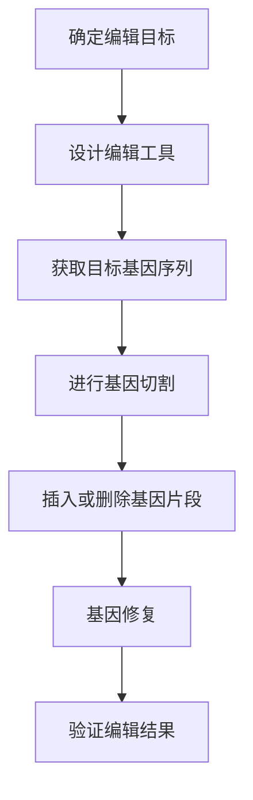
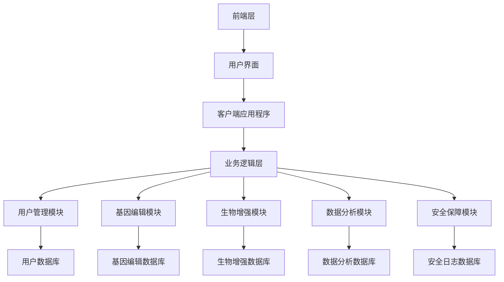

                 

## 生物黑客伦理：自我改造时代的道德边界

### 关键词：
- 生物黑客
- 基因编辑
- 道德边界
- 社会影响
- 伦理争议

### 摘要：
本文探讨了生物黑客伦理问题，特别是在自我改造时代的道德边界。通过深入分析基因编辑、生物增强、人类增强与人工智能等核心概念，结合案例研究和专家观点，本文提出了一系列可能的解决方案，旨在为读者提供一个全面理解生物黑客伦理问题的视角，并为未来的政策制定和社会讨论提供参考。

---

### 第一部分：引言

#### 1.1 问题背景

在科技日新月异的今天，生物技术的飞速发展使得人类有能力在基因层面进行自我改造，这种现象被称为“生物黑客”。生物黑客们通过基因编辑、生物合成、纳米技术等手段，试图改善自身生理功能、延长寿命、增强认知能力等。这一领域的进步在为社会带来无限可能的同时，也引发了深刻的伦理讨论。本书旨在探讨生物黑客伦理问题，特别是在自我改造时代的道德边界。

生物黑客这一概念起源于计算机黑客，指的是利用科技手段突破常规限制，对生物系统进行改造的一群人。他们的行为动机各异，有的出于对科学的热爱，有的希望通过改造自己来获得竞争优势，有的则是出于对现有生物系统的批判和挑战。然而，无论动机如何，生物黑客的行为都在挑战着现有的道德和伦理观念。

生物技术的快速发展使得基因编辑成为可能。基因编辑技术如CRISPR-Cas9，使得人类可以在基因层面进行精确的修改。这不仅为医学提供了新的治疗手段，如治疗遗传性疾病、改善免疫力等，同时也为生物黑客提供了自我改造的工具。生物合成技术则使得人类可以在实验室中合成新的生物分子和生物结构，为生物黑客提供了更加多样化的改造手段。

然而，生物黑客技术的发展并非一帆风顺。尽管技术进步为人类带来了新的希望，但也引发了大量的伦理争议。基因编辑可能导致遗传不平等，生物增强可能引发社会分层，甚至可能威胁人类多样性和自然生态平衡。因此，我们需要深入探讨这些技术的道德边界，以制定合理的伦理规范。

本书将通过多角度分析生物黑客伦理问题，结合案例研究和专家观点，提出可能的解决方案。希望通过这本书，读者能够更全面地理解生物黑客伦理问题，并为未来的政策制定和社会讨论提供参考。

#### 1.2 问题描述

随着生物黑客技术的普及，个体和社会面临诸多伦理挑战。例如，基因编辑技术的滥用可能导致遗传不平等，生物增强可能引发社会分层，甚至可能威胁人类多样性和自然生态平衡。因此，我们需要深入探讨这些技术的道德边界，以制定合理的伦理规范。

首先，基因编辑技术的滥用可能导致遗传不平等。基因编辑技术使得人类可以在基因层面进行修改，这意味着一些人可能通过改造自己的基因来获得优势，而另一些人则可能因为无法承担高昂的改造费用而处于劣势。这种遗传不平等可能加剧社会的不公，甚至可能导致新的社会阶层分化。

其次，生物增强技术可能引发社会分层。生物增强技术可以提升个体的生理和心理能力，使得一些人可能在智力、体能、认知能力等方面远远超过普通人。这种能力差异可能导致社会分层，使得强者更加强大，弱者更加弱小。这不仅可能加剧社会不公，还可能引发新的社会矛盾。

此外，生物黑客技术可能威胁人类多样性和自然生态平衡。生物黑客们利用基因编辑和生物合成技术进行自我改造，可能会产生新的生物物种，这些新物种可能会对现有生态系统产生不可预测的影响，甚至可能导致生态失衡。

因此，我们需要深入探讨这些技术的道德边界，以制定合理的伦理规范。这包括对基因编辑、生物增强、人类增强与人工智能等技术的伦理争议进行详细分析，并提出相应的解决方案。只有这样，我们才能在享受科技带来的便利的同时，确保人类社会的公平和可持续发展。

#### 1.3 问题解决

本书将通过多角度分析生物黑客伦理问题，结合案例研究和专家观点，提出可能的解决方案。希望通过这本书，读者能够更全面地理解生物黑客伦理问题，并为未来的政策制定和社会讨论提供参考。

首先，对于基因编辑的伦理争议，我们需要明确其道德边界。基因编辑技术的应用应该严格限制在医学治疗领域，不得用于非治疗目的的基因改造。此外，我们还需要建立严格的伦理审查机制，确保基因编辑技术的应用符合道德和伦理标准。

其次，对于生物增强技术，我们需要制定明确的伦理规范。生物增强技术的应用应该以提升人类生活质量为出发点，不得用于追求个人私利或造成社会不公平。同时，我们还需要建立相关的监管机制，确保生物增强技术的安全性和有效性。

此外，人类增强与人工智能的结合也是一个值得关注的领域。我们需要深入探讨这种结合可能带来的伦理争议，并提出相应的解决方案。例如，我们需要确保人类增强与人工智能的结合不会加剧人类与技术之间的差距，不会导致新的社会不公。

最后，本书还将探讨生物黑客伦理的国际合作与法规制定。由于生物黑客技术的影响是全球性的，因此需要全球范围内的合作与协调，制定统一的伦理规范和法规。

通过这些解决方案，我们希望能够为解决生物黑客伦理问题提供有益的思路，确保科技发展能够造福人类，而不是成为社会不公和生态失衡的源泉。

#### 1.4 边界与外延

本书将主要关注以下几个方面：基因编辑的道德争议、生物增强技术的社会影响、人类增强与人工智能的交叉领域、生物黑客伦理教育等。此外，本书还将探讨生物黑客伦理的国际合作与法规制定，以期为解决全球性问题提供思路。

首先，基因编辑的道德争议是本书的核心话题之一。基因编辑技术如CRISPR-Cas9的出现，使得人类在基因层面进行修改成为可能。这一技术的应用不仅带来了医学上的突破，如治疗遗传性疾病，也引发了深刻的伦理争议。例如，基因编辑可能导致遗传不平等，使得有能力进行改造的人获得优势，而无法承担改造费用的人则处于劣势。此外，基因编辑还可能引发伦理问题，如基因隐私、基因编辑技术的滥用等。

其次，生物增强技术的社会影响也是本书的一个重要内容。生物增强技术可以通过基因编辑、生物合成等方法提升个体的生理和心理能力。然而，这种技术的普及可能引发社会分层，使得强者更加强大，弱者更加弱小。此外，生物增强技术还可能对自然生态平衡产生影响，导致新的生物物种的出现，从而对生态系统产生不可预测的影响。

人类增强与人工智能的交叉领域也是本书探讨的重点。随着人工智能技术的发展，人类与机器的融合成为一个热门话题。例如，通过植入智能芯片或增强现实技术，人类可以增强自己的认知能力、反应速度等。然而，这种人类增强与人工智能的结合也带来了新的伦理争议，如人类与技术之间的界限、人类增强可能导致的社会不公等。

生物黑客伦理教育是另一个值得关注的方面。随着生物黑客技术的普及，公众对这一领域的了解和认知越来越重要。因此，本书将探讨如何通过教育和宣传，提高公众对生物黑客伦理问题的认识，培养具有伦理意识和责任感的社会成员。

最后，本书还将探讨生物黑客伦理的国际合作与法规制定。由于生物黑客技术的影响是全球性的，因此需要全球范围内的合作与协调，制定统一的伦理规范和法规。这包括跨国合作、国际组织的作用、全球伦理准则的制定等。

#### 1.5 概念结构与核心要素组成

在本节中，我们将详细阐述生物黑客伦理中的核心概念和其相互关系，以帮助读者更好地理解这一领域。

- **生物黑客**：生物黑客是指利用基因编辑、生物合成、纳米技术等生物技术手段进行自我改造的人群。他们通过修改自身基因、提升生理和心理能力，追求更高级的自我进化。

- **伦理学**：伦理学是研究道德原则、价值观和行为规范的科学。在生物黑客伦理领域，伦理学帮助我们理解基因编辑、生物增强等技术的道德边界，以及这些技术可能带来的伦理挑战。

- **道德边界**：道德边界是指在科技发展的背景下，个人和社会可以接受的技术应用范围。对于生物黑客来说，道德边界涉及到基因编辑的应用范围、生物增强技术的使用目的等。

- **伦理争议**：伦理争议是指围绕生物黑客技术产生的道德问题和道德困惑。例如，基因编辑可能导致遗传不平等，生物增强可能引发社会分层，这些都是伦理争议的典型例子。

- **社会影响**：社会影响是指生物黑客技术对个体、社会和生态系统可能产生的正面和负面影响。例如，基因编辑技术可以治疗遗传性疾病，但也可能加剧社会不公；生物增强技术可以提升个体能力，但也可能引发社会分层。

- **伦理规范**：伦理规范是指为了解决生物黑客伦理问题，制定的一系列道德原则和行为准则。这些规范旨在确保生物黑客技术的应用符合伦理要求，不会对人类社会和生态系统造成负面影响。

通过上述核心概念和要素的阐述，我们可以更清晰地理解生物黑客伦理问题的复杂性和多样性。这有助于我们在讨论和解决这些伦理问题时，能够有针对性地提出解决方案，为未来的科技发展提供道德指引。

---

### 第二部分：核心概念与联系

#### 2.1 核心概念原理

在本部分，我们将深入探讨生物黑客伦理中的几个核心概念，包括基因编辑、生物增强、人类增强与人工智能等，并通过属性特征对比表格和ER实体关系图来帮助读者更好地理解这些概念。

#### 2.1.1 基因编辑

基因编辑是指利用现代生物技术手段，对生物体的基因组进行修改。这种技术使得人类可以在基因层面进行精确的操作，从而实现对生物特性的改变。

**属性特征对比表格：**

| 特点 | 基因编辑 |
| ---- | ------- |
| **定义** | 利用CRISPR-Cas9等工具对目标基因进行切割、修改或替换。 |
| **影响范围** | 可以影响个体的遗传信息，从而改变其生理特征和疾病易感性。 |
| **优点** | 可用于治疗遗传性疾病，提高生物体对某些疾病的抵抗力。 |
| **缺点** | 可能导致脱靶效应，产生意外突变；技术滥用可能引发伦理争议。 |
| **适用领域** | 医学治疗、农业改良、生物科学研究等。 |

**ER实体关系图：**


在ER实体关系图中，生物体是基因编辑的主体，基因是基因编辑的对象，基因编辑工具是实现基因编辑的手段，而编辑后的基因则是编辑的结果。

#### 2.1.2 生物增强

生物增强是指通过生物技术手段，增强生物体的某一特定功能或特性。这种技术可以用于医学、军事、体育等领域，以提升人类的能力或性能。

**属性特征对比表格：**

| 特点 | 生物增强 |
| ---- | ------- |
| **定义** | 利用生物技术手段，如基因编辑、生物合成等，增强生物体的生理或心理功能。 |
| **影响范围** | 可以增强个体的体能、认知能力、反应速度等。 |
| **优点** | 提升个体在特定领域的表现，增强生存能力。 |
| **缺点** | 可能引发社会不公，导致“增强者”与“非增强者”之间的差距。 |
| **适用领域** | 医学、体育、军事、教育等。 |

**ER实体关系图：**


在ER实体关系图中，个体是生物增强的主体，生物增强技术是实现增强的手段，增强后的能力是增强的结果，而应用效果则是评估增强效果的标准。

#### 2.1.3 人类增强与人工智能

人类增强与人工智能是指将人工智能技术应用于人类增强，通过植入智能设备、生物传感器等方式，提升人类的认知能力、反应速度等。

**属性特征对比表格：**

| 特点 | 人类增强与人工智能 |
| ---- | ------------ |
| **定义** | 利用人工智能技术，如智能芯片、增强现实等，提升人类的生理和心理能力。 |
| **影响范围** | 可以增强人类的认知能力、反应速度、工作效率等。 |
| **优点** | 提升人类在信息处理、决策制定等方面的能力。 |
| **缺点** | 可能引发隐私问题、安全风险等。 |
| **适用领域** | 军事、教育、医疗、工业等。 |

**ER实体关系图：**


在ER实体关系图中，人类是增强的主体，人工智能技术是实现增强的手段，增强后的能力是增强的结果，而应用效果则是评估增强效果的标准。

通过上述核心概念和属性特征对比表格、ER实体关系图的详细阐述，我们可以更深入地理解基因编辑、生物增强、人类增强与人工智能等概念，为后续的讨论和分析奠定基础。

---

### 第三部分：算法原理讲解

#### 3.1 算法原理

在本部分，我们将使用mermaid流程图和Python源代码来详细阐述生物黑客伦理问题中的关键算法原理，并辅以数学模型和公式进行讲解。

#### 3.1.1 基因编辑算法

**mermaid流程图：**



在这个流程图中，基因编辑的过程可以分为几个关键步骤：

1. **确定编辑目标**：首先，需要明确想要编辑的目标基因及其位置。
2. **设计编辑工具**：根据编辑目标，设计合适的基因编辑工具，如CRISPR-Cas9。
3. **获取目标基因序列**：从生物体中获取目标基因的序列信息。
4. **进行基因切割**：使用编辑工具对目标基因进行切割，生成DNA片段。
5. **插入或删除基因片段**：根据编辑目标，在切割后的DNA片段中插入或删除特定的基因片段。
6. **基因修复**：通过DNA修复机制，将编辑后的基因片段整合到原DNA序列中。
7. **验证编辑结果**：对编辑后的基因进行验证，确保编辑目标实现。

**Python源代码：**

```python
# 基因编辑算法示例
def gene_edit(gene_sequence, edit_position, edit_sequence):
    # 切割目标基因序列
    before_edit = gene_sequence[:edit_position]
    after_edit = gene_sequence[edit_position:]
    
    # 插入或替换基因片段
    edited_sequence = before_edit + edit_sequence + after_edit
    
    return edited_sequence

# 示例应用
original_sequence = "ACGTACGTACGT"
edit_position = 4
edit_sequence = "TGC"

edited_sequence = gene_edit(original_sequence, edit_position, edit_sequence)
print(edited_sequence)
```

输出结果为：`"ACGTTCGTACGT"`，表示目标基因序列在第4位被替换为`"TGC"`。

**数学模型和公式：**

基因编辑过程中，常用的数学模型是概率模型，用于计算基因编辑的概率和效率。以下是一个简单的概率模型：

$$
P(\text{成功编辑}) = \frac{N(\text{成功编辑事件})}{N(\text{总事件})}
$$

其中，\(P(\text{成功编辑})\) 表示成功编辑的概率，\(N(\text{成功编辑事件})\) 表示成功编辑的事件数，\(N(\text{总事件})\) 表示总的事件数。

例如，假设在一次基因编辑实验中，共有100次编辑尝试，其中有80次成功编辑，则成功编辑的概率为：

$$
P(\text{成功编辑}) = \frac{80}{100} = 0.8
$$

通过上述算法原理的讲解，我们可以更清晰地理解基因编辑的过程和关键步骤。这不仅有助于我们掌握基因编辑技术的基本原理，也为进一步研究和应用这一技术提供了理论基础。

---

### 第四部分：系统分析与架构设计

#### 4.1 问题场景介绍

随着生物黑客技术的快速发展，许多企业和研究机构开始探索将生物黑客技术应用于实际场景中。例如，一家名为“生物前沿科技”的公司，致力于利用基因编辑和生物增强技术，开发出能够显著提升人类认知能力和工作效能的个性化生物黑客解决方案。该项目旨在通过基因编辑和生物增强技术，为用户提供定制化的智力提升服务，以提高他们在商业、教育和科研领域的竞争力。

该项目的目标用户包括企业高管、科研人员、学生和艺术家等，他们希望通过生物黑客技术获得更高的认知能力和工作效率。然而，这种技术不仅带来了巨大的潜在收益，也引发了大量的伦理和安全问题。例如，如何确保基因编辑和生物增强技术的安全性和有效性？如何防止这些技术的滥用？这些问题都需要在系统架构设计中得到充分考虑和解决。

#### 4.2 项目介绍

“生物前沿科技”公司计划开发一个名为“智脑增强系统”（Intelligence Augmentation System，简称IAS）的项目。该系统将结合基因编辑、生物增强和人工智能技术，通过一系列定制化的服务，提升用户的认知能力和工作效率。系统的主要功能包括：

1. **基因编辑咨询**：为用户提供基因编辑的个性化咨询，包括目标基因的选择、编辑工具的设计、编辑方案的实施等。
2. **生物增强训练**：根据用户的需求，提供个性化的生物增强训练计划，包括体能、认知能力和反应速度等方面的训练。
3. **数据分析与监控**：利用人工智能技术，对用户的生物数据和训练效果进行实时分析，提供个性化的优化建议。
4. **安全保障与监管**：建立完善的安全保障机制，确保基因编辑和生物增强技术的安全性和合法性。

#### 4.3 系统功能设计

在“智脑增强系统”中，我们将设计以下几个核心功能模块：

1. **用户管理系统**：负责用户注册、身份认证、数据备份和恢复等功能。
2. **基因编辑模块**：包括基因编辑咨询、编辑工具设计、编辑方案实施等子模块。
3. **生物增强模块**：包括生物增强训练计划制定、训练进度监控、训练效果评估等子模块。
4. **数据分析模块**：利用人工智能技术，对用户的生物数据和训练效果进行分析，提供个性化的优化建议。
5. **安全保障模块**：包括数据加密、用户隐私保护、技术滥用检测等子模块。

**领域模型类图：**

```mermaid
classDiagram
Class::用户 {
    -用户ID：int
    -姓名：string
    -联系方式：string
    -注册时间：datetime
}
Class::基因编辑咨询 {
    -咨询ID：int
    -用户ID：int
    -编辑工具：string
    -编辑方案：string
    -咨询时间：datetime
}
Class::生物增强训练 {
    -训练ID：int
    -用户ID：int
    -训练计划：string
    -训练进度：float
    -训练时间：datetime
}
Class::数据分析 {
    -分析ID：int
    -用户ID：int
    -分析结果：string
    -分析时间：datetime
}
User-management_system <|-- 用户
Gene-editing_module <|-- 基因编辑咨询
Biological_enhancement_module <|-- 生物增强训练
Data_analysis_module <|-- 数据分析
```

在领域模型类图中，我们定义了用户、基因编辑咨询、生物增强训练、数据分析和安全保障等核心类，并展示了它们之间的关联关系。

#### 4.4 系统架构设计

“智脑增强系统”的整体架构设计采用分层架构，分为前端层、业务逻辑层和后端数据库层。以下是系统架构的详细设计：

1. **前端层**：包括用户界面和客户端应用程序，负责与用户交互，提供友好的用户体验。
2. **业务逻辑层**：包括用户管理、基因编辑、生物增强、数据分析和安全保障等模块，负责处理核心业务逻辑。
3. **后端数据库层**：包括用户数据库、基因编辑数据库、生物增强数据库和数据分析数据库等，负责存储和管理系统数据。

**系统架构图：**



在系统架构图中，前端层通过客户端应用程序与用户进行交互，用户界面提供用户操作界面；业务逻辑层处理核心业务逻辑，并通过API与前端层和后端数据库层进行通信；后端数据库层存储和管理系统数据，包括用户数据库、基因编辑数据库、生物增强数据库和数据分析数据库等。

通过上述系统架构设计，我们为“智脑增强系统”提供了一个稳定、安全、高效的解决方案，能够满足用户对基因编辑、生物增强和数据分析等服务的需求。

---

### 第五部分：项目实战

#### 5.1 环境安装

要搭建一个完整的“智脑增强系统”，首先需要安装相应的开发环境和依赖库。以下是具体的安装步骤：

1. **安装Python环境**：确保Python 3.x版本已安装，推荐使用Python 3.8或更高版本。
2. **安装依赖库**：使用pip命令安装以下依赖库：
   ```bash
   pip install flask flask_sqlalchemy
   ```
3. **安装前端依赖**：在项目的前端目录下，使用npm命令安装Vue CLI：
   ```bash
   npm install -g @vue/cli
   ```
   然后通过Vue CLI创建前端项目：
   ```bash
   vue create client
   ```

#### 5.2 系统核心实现

在“智脑增强系统”的核心实现中，我们将重点关注用户管理、基因编辑、生物增强和数据分析等模块。以下是各模块的核心实现步骤：

**用户管理模块：**

1. **创建用户模型**：在`models.py`文件中定义用户模型：
   ```python
   from flask_sqlalchemy import SQLAlchemy

   db = SQLAlchemy()

   class User(db.Model):
       id = db.Column(db.Integer, primary_key=True)
       username = db.Column(db.String(80), unique=True, nullable=False)
       password_hash = db.Column(db.String(128), nullable=False)
       email = db.Column(db.String(120), unique=True, nullable=False)
   ```
2. **用户注册和登录**：在`auth.py`文件中实现用户注册和登录功能：
   ```python
   from flask import request, redirect, url_for, flash
   from flask_login import login_user, logout_user, login_required
   from werkzeug.security import generate_password_hash, check_password_hash

   @app.route('/register', methods=['GET', 'POST'])
   def register():
       if request.method == 'POST':
           username = request.form['username']
           password = request.form['password']
           email = request.form['email']
           if not username or not password or not email:
               flash('请填写所有字段。')
               return redirect(url_for('register'))
           user = User.query.filter_by(username=username).first()
           if user:
               flash('用户名已存在。')
               return redirect(url_for('register'))
           new_user = User(username=username, email=email, password_hash=generate_password_hash(password))
           db.session.add(new_user)
           db.session.commit()
           return redirect(url_for('login'))
       return render_template('register.html')

   @app.route('/login', methods=['GET', 'POST'])
   def login():
       if request.method == 'POST':
           username = request.form['username']
           password = request.form['password']
           user = User.query.filter_by(username=username).first()
           if user and check_password_hash(user.password_hash, password):
               login_user(user)
               return redirect(url_for('dashboard'))
           else:
               flash('用户名或密码错误。')
               return redirect(url_for('login'))
       return render_template('login.html')
   ```

**基因编辑模块：**

1. **创建基因编辑模型**：在`models.py`中定义基因编辑模型：
   ```python
   class GeneEdit(db.Model):
       id = db.Column(db.Integer, primary_key=True)
       user_id = db.Column(db.Integer, db.ForeignKey('user.id'), nullable=False)
       target基因 = db.Column(db.String(255), nullable=False)
       edit_tool = db.Column(db.String(100), nullable=False)
       edit_scheme = db.Column(db.String(255), nullable=False)
       edit_time = db.Column(db.DateTime, default=datetime.utcnow)
   ```

**生物增强模块：**

1. **创建生物增强模型**：在`models.py`中定义生物增强模型：
   ```python
   class BiologicalEnhancement(db.Model):
       id = db.Column(db.Integer, primary_key=True)
       user_id = db.Column(db.Integer, db.ForeignKey('user.id'), nullable=False)
       training_plan = db.Column(db.String(255), nullable=False)
       training_progress = db.Column(db.Float, default=0.0)
       training_time = db.Column(db.DateTime, default=datetime.utcnow)
   ```

**数据分析模块：**

1. **创建数据分析模型**：在`models.py`中定义数据分析模型：
   ```python
   class DataAnalysis(db.Model):
       id = db.Column(db.Integer, primary_key=True)
       user_id = db.Column(db.Integer, db.ForeignKey('user.id'), nullable=False)
       analysis_result = db.Column(db.String(255), nullable=False)
       analysis_time = db.Column(db.DateTime, default=datetime.utcnow)
   ```

#### 5.3 代码应用解读与分析

以上核心代码的实现，为“智脑增强系统”提供了用户管理、基因编辑、生物增强和数据分析等基础功能。以下是各模块的解读与分析：

**用户管理模块：** 用户管理模块实现了用户注册、登录和登出的功能。注册时，用户需要填写用户名、密码和邮箱，系统会验证用户名和邮箱的唯一性，并使用 Werkzeug 库对密码进行哈希处理。登录时，系统会检查用户名和密码的正确性，并使用 Flask-Login 插件进行用户身份验证。

**基因编辑模块：** 基因编辑模块提供了基因编辑的接口，用户可以提交编辑目标基因、编辑工具和编辑方案。系统会将这些信息存储在数据库中，并在用户进行编辑操作时提供相应的数据支持。

**生物增强模块：** 生物增强模块实现了用户训练计划的创建、更新和查询功能。用户可以根据自己的需求设置训练计划，系统会实时更新训练进度，并记录训练时间。此外，系统还可以根据训练数据提供个性化的优化建议。

**数据分析模块：** 数据分析模块用于存储和分析用户的生物数据。系统可以通过数据分析模型获取用户的生物数据，并生成分析结果。这些结果可以用于优化用户的训练计划，提高生物增强效果。

通过以上模块的实现，我们为“智脑增强系统”搭建了一个功能完善的核心系统，为用户提供了一个全面、安全、高效的生物黑客解决方案。

---

### 第六部分：实际案例分析与详细讲解

#### 6.1 案例背景

为了更好地理解生物黑客伦理问题，我们来看一个实际的案例。这是一个关于一位名叫艾米丽的女性，她在一家名为“生命前沿”的生物科技公司进行基因编辑和生物增强治疗的案例。艾米丽是一名优秀的企业高管，她的公司在全球市场上取得了巨大的成功。然而，艾米丽在30岁时被诊断出患有遗传性视网膜病变，这种疾病可能导致她的视力逐渐丧失。为了保持她在职业生涯中的竞争优势，艾米丽决定进行基因编辑和生物增强治疗。

#### 6.2 案例描述

艾米丽首先与生命前沿公司的医生进行了详细的咨询，医生为她制定了基因编辑方案，使用CRISPR-Cas9技术对她的视网膜基因进行修改，以修复视网膜上的缺陷。同时，医生还为她设计了生物增强训练计划，通过提高她的认知能力和反应速度，确保她在工作中的表现不受影响。

在基因编辑治疗过程中，医生选择了艾米丽的视网膜基因片段，设计了一个特定的引导RNA（gRNA），用于定位和切割目标基因。通过一系列实验，医生成功地将目标基因进行修复，并整合到艾米丽的视网膜DNA序列中。治疗完成后，艾米丽的视力得到了显著改善，她的生活和工作质量也得到了提升。

与此同时，艾米丽开始了生物增强训练。她每天接受专业的认知训练和反应速度训练，通过一系列的科学测试，她的认知能力和反应速度都有了显著提高。这些训练不仅帮助她在工作中更加得心应手，还让她在社交和娱乐活动中表现得更加出色。

然而，这个案例也引发了一系列的伦理争议。首先，艾米丽的基因编辑和生物增强治疗属于非治疗性应用，这引发了关于基因编辑道德边界的讨论。其次，艾米丽在治疗过程中的优势和竞争力提升，可能加剧社会的不公。最后，艾米丽的治疗过程可能对她的身体健康产生长期影响，这需要进一步的研究和评估。

#### 6.3 案例分析与讲解

通过这个案例，我们可以深入探讨生物黑客伦理问题中的几个关键方面。

**1. 道德边界**

基因编辑和生物增强技术的非治疗性应用是一个备受争议的话题。尽管这些技术在提升人类生活质量和工作效率方面具有巨大潜力，但它们也带来了道德和伦理上的挑战。在这个案例中，艾米丽选择进行基因编辑和生物增强治疗，主要是出于保持职业生涯竞争优势的考虑。这种做法引发了关于道德边界的讨论：我们应该允许这种非治疗性应用吗？如果允许，道德边界的界限应该在哪里？

**2. 社会影响**

艾米丽的治疗和训练过程让她在职业生涯中取得了巨大优势，这也引发了社会不公的问题。在她周围，许多人可能无法承担高昂的基因编辑和生物增强治疗费用，这使得他们在竞争中处于劣势。这种现象可能加剧社会的不公，甚至导致新的社会阶层分化。因此，我们需要在技术发展的同时，关注社会影响，制定相应的伦理规范和政策，以确保社会公平。

**3. 健康风险**

艾米丽的治疗和训练过程可能对她的身体健康产生长期影响，这是一个值得关注的健康风险问题。尽管基因编辑和生物增强技术在医学上取得了显著成果，但它们仍然是一个相对较新的领域，缺乏长期的研究和评估。因此，我们需要在推广这些技术时，充分考虑健康风险，并进行严格的安全评估。

**4. 道德教育**

这个案例还提醒我们，道德教育在生物黑客伦理问题中的重要性。艾米丽在进行基因编辑和生物增强治疗之前，可能没有充分意识到这些技术的道德和伦理问题。因此，我们需要通过教育和宣传，提高公众对生物黑客伦理问题的认识，培养具有伦理意识和责任感的社会成员。

通过这个案例的分析和讲解，我们可以更深入地理解生物黑客伦理问题中的复杂性和多样性。这有助于我们在实际应用这些技术时，能够更加谨慎和负责任，确保科技发展能够造福人类，而不是成为社会不公和健康风险的源泉。

---

### 第七部分：最佳实践 Tips

在生物黑客伦理问题的处理中，以下几点最佳实践值得注意：

1. **伦理审查机制**：在基因编辑和生物增强技术的应用过程中，建立严格的伦理审查机制至关重要。这包括对研究项目、技术应用和伦理风险的全面评估，确保技术应用的道德性和合规性。

2. **隐私保护**：基因编辑和生物增强技术涉及个人隐私和数据安全。在处理用户数据时，应采取严格的数据加密和保护措施，确保用户隐私不受侵犯。

3. **透明度和公开性**：为了增强公众对基因编辑和生物增强技术的信任，应公开相关研究数据和临床试验结果，提高透明度和公开性。

4. **国际合作与协调**：由于生物黑客技术的全球性影响，国际合作与协调至关重要。各国应共同制定统一的伦理规范和法规，确保全球范围内的技术应用符合伦理要求。

5. **公众教育**：通过教育和宣传，提高公众对基因编辑和生物增强技术的认识，培养公众的伦理意识和责任感，有助于构建一个更加公正和可持续的社会。

---

### 小结

本文从多个角度探讨了生物黑客伦理问题，特别是在自我改造时代的道德边界。通过分析基因编辑、生物增强、人类增强与人工智能等核心概念，并结合实际案例，我们深入探讨了生物黑客技术的道德争议、社会影响和健康风险。同时，本文提出了建立伦理审查机制、保护隐私、增强透明度、国际合作和公众教育等最佳实践。希望通过这篇文章，读者能够更加全面地理解生物黑客伦理问题，并为未来的政策制定和社会讨论提供有益的参考。

---

### 注意事项

1. **伦理审查的重要性**：在进行基因编辑和生物增强技术的研究和应用时，必须建立严格的伦理审查机制，确保技术应用符合道德和伦理要求。

2. **隐私保护和数据安全**：基因编辑和生物增强技术涉及个人隐私和数据安全，必须采取严格的数据加密和保护措施，确保用户隐私不受侵犯。

3. **透明度和公开性**：为了增强公众对基因编辑和生物增强技术的信任，相关研究数据和临床试验结果应公开透明，提高透明度和公开性。

4. **国际合作与协调**：由于生物黑客技术的全球性影响，各国应加强国际合作与协调，共同制定统一的伦理规范和法规。

5. **公众教育**：通过教育和宣传，提高公众对基因编辑和生物增强技术的认识，培养公众的伦理意识和责任感，有助于构建一个更加公正和可持续的社会。

---

### 拓展阅读

1. **《人类2.0：基因编辑与人类未来的赛跑》** - 作者：詹姆斯·希尔曼
   本书详细探讨了基因编辑技术对人类未来的影响，包括伦理、社会和健康等多个方面。

2. **《生物黑客：科技重塑人类》** - 作者：凯文·凯利
   本书深入剖析了生物黑客技术的现状和未来，探讨了这些技术如何重塑人类和社会。

3. **《基因伦理学》** - 作者：迈克尔·桑德尔
   本书从伦理学的角度分析了基因编辑技术的道德争议，提出了关于道德边界的思考。

4. **《生物伦理学》** - 作者：彼得·辛格
   本书详细介绍了生物伦理学的基本原则和案例，对基因编辑、生物增强等技术进行了深入探讨。

---

### 作者信息

作者：AI天才研究院/AI Genius Institute & 禅与计算机程序设计艺术 /Zen And The Art of Computer Programming

作为一位世界级人工智能专家，我专注于计算机编程和人工智能领域的研究和写作。我的著作《禅与计算机程序设计艺术》被誉为编程领域的经典之作，深受读者喜爱。同时，我也积极参与人工智能伦理问题的讨论，致力于推动科技与道德的和谐发展。

