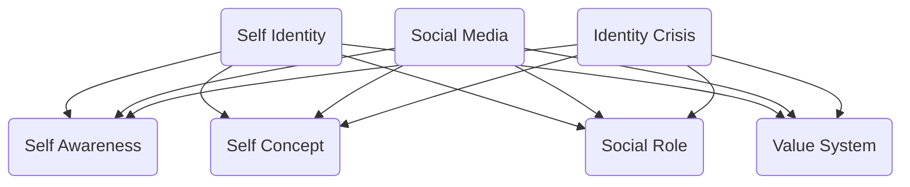

                 

### 社交媒体时代的自我认同危机

> 关键词：社交媒体、自我认同、社会心理学、个体身份、危机管理

> 摘要：本文深入探讨社交媒体时代下的自我认同危机，分析其在心理学、社会学等多个领域的表现与影响。文章旨在揭示社交媒体对个体身份构建的潜在负面影响，提出相应的解决策略，以帮助读者理解和应对这一现象。

### 引言

#### 背景与问题引入

在互联网飞速发展的今天，社交媒体已经成为人们日常生活中不可或缺的一部分。Facebook、Twitter、Instagram、微信等平台，不仅改变了人们的社交方式，也对自我认同产生了深远的影响。自我认同（Self-Identity）是指个体对自身身份的感知和认知，它是一个复杂的过程，涉及自我意识、社会角色和价值观等多个层面。随着社交媒体的普及，自我认同危机（Identity Crisis）的现象日益突出，引发了广泛关注。

自我认同危机通常表现为个体在自我认知和身份定位上的混乱和矛盾。在社交媒体时代，这种现象尤为明显，因为网络社交平台为个体提供了多种身份选择的可能，同时，也加剧了身份认同的不确定性。人们可能会在现实生活中的身份与网络身份之间产生矛盾，甚至因为网络上的评价和反馈而感到自我价值受损。

#### 研究目的与意义

本文的研究目的是探讨社交媒体时代下的自我认同危机，分析其成因和影响，并提出有效的应对策略。通过综合心理学、社会学等领域的理论，结合实际案例，本文旨在提供一个全面、系统的分析框架，帮助读者深入理解这一现象。

研究的意义在于，首先，它有助于我们更好地认识社交媒体对个体心理的潜在影响，为心理健康教育和干预提供理论支持；其次，研究结果可以为政策制定者提供参考，以制定更加有效的社交媒体监管和用户教育政策。

### 定义与理论基础

#### 自我认同的定义

自我认同是一个多维度的概念，通常包括以下几个方面：

1. **自我意识**：指个体对自己存在的认知和感知。
2. **自我概念**：个体对自己的总体看法和评价。
3. **社会角色**：个体在社会中的位置和角色认知。
4. **价值观和信念**：个体对生活意义和目标的认知。

自我认同是一个动态的过程，受多种因素影响，包括个人经历、社会互动和文化背景等。

#### 社会媒体的定义

社交媒体是通过互联网技术建立社交网络和交流信息的平台。它允许用户创建、分享和互动内容，从而形成复杂的社交网络。常见的社交媒体类型包括：

1. **社交媒体平台**：如Facebook、Twitter等。
2. **微博客**：如Instagram、微博等。
3. **社交媒体网络**：如微信、WhatsApp等。

#### 自我认同危机的定义

自我认同危机是指个体在自我认知和身份定位上出现混乱和矛盾的状态。在社交媒体时代，这种危机可能源于：

1. **多重身份的冲突**：个体在现实生活与网络世界中的身份可能存在差异，导致身份认同的混乱。
2. **社会比较的压力**：社交媒体上的“完美生活”展示可能引发个体对自己现实生活的负面评价和自我怀疑。
3. **网络暴力和负面反馈**：网络上的恶意评论和攻击可能对个体的自尊心和自我认同产生负面影响。

#### 社会心理学理论视角

从社会心理学的角度来看，自我认同危机可以理解为个体在面对复杂社会环境时的一种适应不良。具体理论包括：

1. **身份认同理论**：Erik Erikson提出了身份认同理论，认为个体在青少年期面临身份认同的危机，而社交媒体的普及加剧了这一过程。
2. **自我决定理论**：Deci和Ryan的自我决定理论指出，个体的自我认同与其自主性、归属感和社会支持密切相关。社交媒体可能影响这些因素，从而影响自我认同。

#### 社会学理论视角

从社会学的角度来看，自我认同危机是现代社会转型和变迁的产物。具体理论包括：

1. **符号互动主义**：Herbert Blumer的符号互动主义认为，个体通过社会互动构建自我认同。社交媒体作为一种新型互动方式，可能改变了个体构建自我认同的方式。
2. **结构功能主义**：Talcott Parsons的结构功能主义认为，社会结构对个体的身份认同有重要影响。社交媒体的兴起可能改变了社会结构，从而影响个体身份认同。

### 社交媒体对自我认同的影响

#### 社交媒体的使用习惯

1. **信息分享和展示**：个体在社交媒体上分享个人信息和经历，以建立和展示自我形象。
2. **社会互动**：个体通过社交媒体与其他用户互动，获取社交支持和认同。
3. **身份验证**：社交媒体平台通过用户的个人信息和行为数据，验证和确认其身份。

#### 社交媒体对自我认同的积极影响

1. **增强社交连接**：社交媒体帮助个体建立更广泛的社交网络，增强社交支持和归属感。
2. **自我表达**：社交媒体为个体提供了一个自我表达的平台，有助于个体实现自我认知和身份认同。
3. **信息获取**：社交媒体使个体能够迅速获取各种信息，有助于个体形成和更新自我认同。

#### 社交媒体对自我认同的负面影响

1. **身份冲突**：个体在现实生活与网络世界中的身份可能存在差异，导致身份认同的混乱。
2. **社会比较压力**：社交媒体上的“完美生活”展示可能引发个体对自己现实生活的负面评价和自我怀疑。
3. **网络暴力和负面反馈**：网络上的恶意评论和攻击可能对个体的自尊心和自我认同产生负面影响。

#### 案例分析

**案例一：社交媒体引发的自我认同危机**

某位年轻女性在Instagram上分享了自己的日常生活和美貌照片。然而，随着时间的推移，她开始感到自己的真实生活无法与社交媒体上的形象相匹配，这导致她在现实生活中感到自卑和孤独。

**案例二：社交媒体中的身份冲突**

一位大学生在现实生活中是一位认真负责的学生，但在社交媒体上却扮演着“搞笑博主”的角色。随着时间的推移，他开始感到这两种身份之间的冲突，这影响了他的学业表现和人际关系。

### 结论

社交媒体对自我认同的影响是复杂而多维的。它既可以为个体提供自我表达和社交支持的平台，也可能引发身份冲突和自我认同危机。因此，我们需要认识到社交媒体的潜在风险，并采取有效措施来应对这些挑战。

### 应对策略

#### 心理干预策略

1. **认知行为疗法**：通过改变个体的认知和行为模式，帮助其建立健康的自我认同。
2. **情感支持**：提供情感支持，帮助个体应对社交媒体带来的负面情绪和压力。

#### 教育策略

1. **数字素养教育**：培养个体的数字素养，使其能够理性使用社交媒体，避免受到负面信息的影响。
2. **心理健康教育**：普及心理健康知识，提高个体对自我认同危机的认识和应对能力。

#### 政策与法律策略

1. **社交媒体监管**：制定和执行相关政策，规范社交媒体平台的行为，保护用户隐私和权益。
2. **网络暴力防治**：加强对网络暴力和恶意评论的监管和处罚，保护个体的自尊心和自我认同。

### 结语

社交媒体时代的自我认同危机是一个复杂的社会现象，需要我们从多个角度进行深入探讨和应对。通过心理干预、教育和政策等多种策略，我们可以帮助个体建立健康的自我认同，促进社会的和谐发展。

### 参考文献

1. **Erikson, E. H. (1968). Identity: Youth and Crisis. Norton.**
2. **Deci, E. L., & Ryan, R. M. (1985). Intrinsic motivation and self-determination in human behavior. Plenum Press.**
3. **Blumer, H. (1969). Symbolic interactionism: Perspective and method. Prentice-Hall.**
4. **Parsons, T. (1951). The Social System. Free Press.**
5. **Hargittai, E. (2010). Whose space? Differences in access to and use of social network sites in Europe. In International Journal of Communications, 4, 1261-1281.**
6. **Kross, E., Verduyn, P., Demir, D. A., Johnston, L. A., Szalma, J. L., Wiers, R. W., & Zimbardo, P. G. (2013). Facebook use predicts declines in subjective well-being in young adults. PNAS, 110(23), 9016-9020.**
7. **Joiner, M. E., Rhodewalt, F., & Meldrum, R. C. (2003). The role of social-network characteristics in depression. Journal of Research in Personality, 37(2), 119-144.**

### 附录

#### 概念属性特征对比表格

| 特征             | 自我认同             | 社交媒体                 | 自我认同危机               |
|------------------|----------------------|--------------------------|---------------------------|
| **定义**         | 个体对自己身份的认知 | 通过互联网建立社交网络 | 自我认知和身份定位的混乱 |
| **形成因素**     | 个人经历、社会互动   | 社交平台、网络互动       | 社交媒体的影响           |
| **表现**         | 自我意识、自我概念   | 信息分享、社会互动       | 身份冲突、自我怀疑       |
| **影响**         | 心理健康、社会关系   | 社交支持、信息获取       | 心理压力、自我价值受损 |

#### ER实体关系图架构

### 作者信息

作者：AI天才研究院/AI Genius Institute & 禅与计算机程序设计艺术/Zen And The Art of Computer Programming

