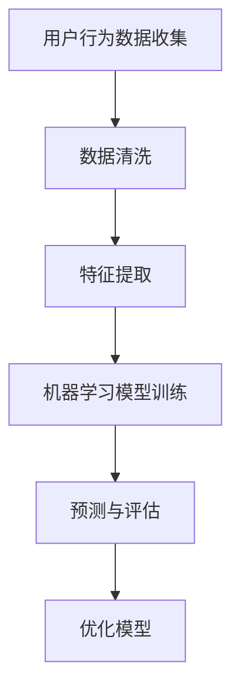
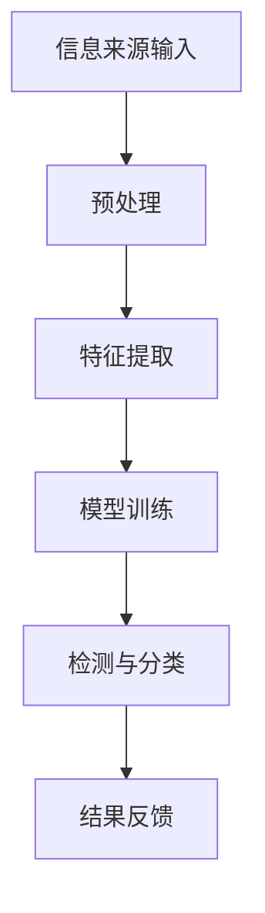
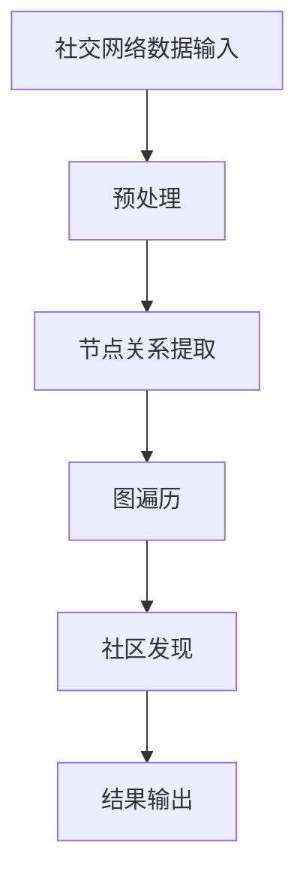
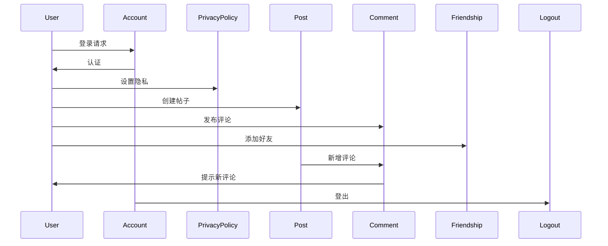
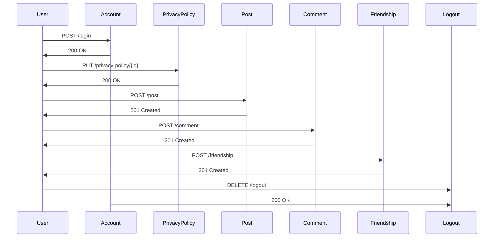
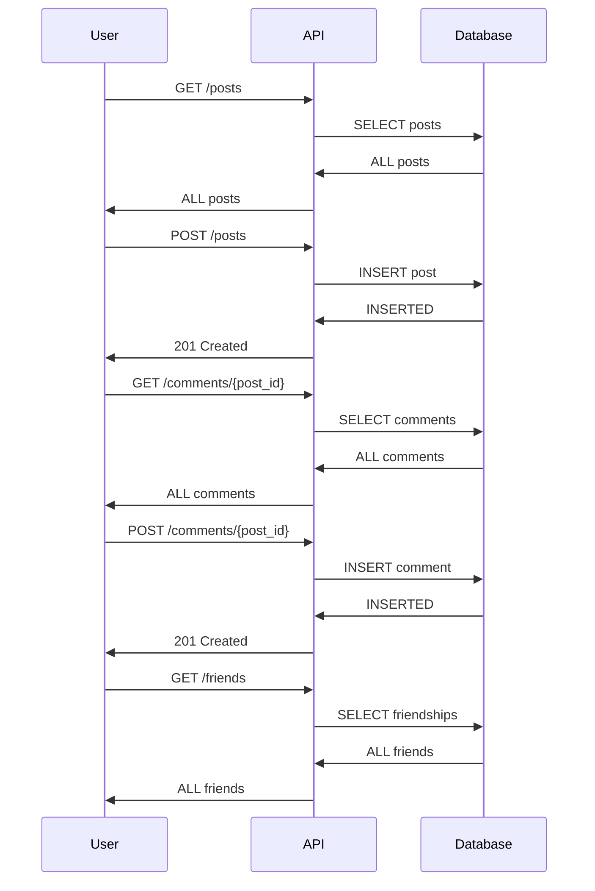

                 

### 社交媒体的利弊：重新定义在线交往的意义

在当今数字化时代，社交媒体已经成为人们日常生活中的一个重要组成部分。无论是Facebook、Twitter还是Instagram，这些平台都在重新定义我们的社交方式、信息获取方式以及人际互动方式。然而，社交媒体的崛起也带来了一系列的问题和挑战，需要我们深入探讨和理性思考。

本文旨在从多个角度分析社交媒体的利弊，帮助读者全面理解这一现象。我们将首先回顾社交媒体的起源与发展，接着详细探讨其优势与负面影响，并通过具体的案例分析来加深我们的理解。随后，我们将探讨如何权衡社交媒体的利弊，提出一些合理使用的建议。最后，我们将展望社交媒体的未来趋势，并提出应对未来挑战的策略。

### 关键词

- 社交媒体
- 信息传播
- 人际交往
- 隐私保护
- 心理健康
- 社会监督
- 公共危机管理

### 摘要

本文从多个角度探讨了社交媒体的利弊。首先，我们回顾了社交媒体的起源与发展，展示了其迅速普及的过程。随后，我们详细分析了社交媒体的优势，包括信息传播速度快、社交网络扩大以及娱乐和教育应用广泛。然而，我们也指出了社交媒体的负面影响，如对个人隐私的威胁、对青少年心理健康的影响以及对传统人际关系的冲击。通过具体的案例分析，我们进一步阐述了这些影响的具体表现。最后，我们提出了合理使用社交媒体的建议，并展望了其未来的发展趋势和挑战。

## 目录大纲

### 第一部分：社交媒体的兴起与现状

1. **社交媒体的崛起**
   1.1 社交媒体的起源与发展
   1.2 社交媒体的主要类型与平台
   1.3 社交媒体用户行为分析

2. **社交媒体的优势**
   2.1 社交媒体的信息传播速度与范围
   2.2 社交媒体的人际交往与社交网络
   2.3 社交媒体在娱乐与教育中的应用

3. **社交媒体的负面影响**
   3.1 社交媒体对个人隐私的威胁
   3.2 社交媒体对青少年心理健康的影响
   3.3 社交媒体对人际关系的影响

### 第二部分：社交媒体的利弊权衡

4. **社交媒体的正面影响**
   4.1 社交媒体在公共危机管理中的作用
   4.2 社交媒体在民主参与与社会监督中的作用
   4.3 社交媒体在文化传承与创新中的作用

5. **社交媒体的负面影响**
   5.1 社交媒体对信息真实性与可信度的影响
   5.2 社交媒体对个体心理健康的影响
   5.3 社交媒体对传统社交方式的冲击

6. **社交媒体使用的合理性与节制**
   6.1 社交媒体使用的自我约束
   6.2 社交媒体使用的家庭教育
   6.3 社交媒体使用的政策法规

### 第三部分：社交媒体的未来

7. **社交媒体的未来趋势**
   7.1 新型社交媒体的出现与发展
   7.2 社交媒体在人工智能时代的变革
   7.3 社交媒体在虚拟现实与增强现实中的应用

8. **社交媒体的未来挑战**
   8.1 社交媒体对隐私保护的挑战
   8.2 社交媒体对心理健康的影响
   8.3 社交媒体在公共安全与社会稳定方面的挑战

9. **社交媒体的未来展望**
   9.1 社交媒体在社会发展中的作用
   9.2 社交媒体在个人发展中的作用
   9.3 社交媒体的未来前景与可能性

## 第一部分：社交媒体的兴起与现状

### 1.1 社交媒体的起源与发展

社交媒体的起源可以追溯到20世纪90年代，当时互联网开始普及，电子邮件和论坛成为人们交流的主要方式。最早的社交媒体平台如MySpace和Friendster，主要提供用户之间的联系和分享内容的功能。然而，真正改变社交媒体格局的里程碑事件是Facebook的成立。2004年，Mark Zuckerberg创立了Facebook，它迅速成为全球最大的社交网络平台之一，吸引了数十亿用户。

随着移动互联网的发展，社交媒体的应用场景和形式也不断丰富。Twitter以实时更新和140个字的限制性表达，成为新闻传播的重要渠道。Instagram则通过图片和视频分享，满足了用户对视觉内容的需求。其他如LinkedIn、WhatsApp等平台也分别在不同领域和功能上取得了成功。

### 1.2 社交媒体的主要类型与平台

社交媒体可以分为以下几类：

1. **社交网络服务（SNS）**：如Facebook、LinkedIn，主要用于建立和维护个人或职业关系网。
2. **微博客**：如Twitter，通过简短的消息发布和实时更新，快速传播信息。
3. **图片和视频分享**：如Instagram、YouTube，以视觉内容为主，提供丰富多样的多媒体体验。
4. **即时通讯**：如WhatsApp、WeChat，提供实时文字、语音、视频聊天功能。
5. **论坛和社区**：如Reddit、Quora，以讨论和分享知识为主。

### 1.3 社交媒体用户行为分析

社交媒体用户的行为可以分为以下几个方面：

1. **内容生成与分享**：用户通过发布文字、图片、视频等形式的内容来分享自己的生活、观点和兴趣。
2. **社交互动**：用户通过点赞、评论、分享等行为与他人互动，建立和维护社交网络。
3. **信息搜索与消费**：用户在社交媒体上搜索感兴趣的信息，并浏览和分享这些信息。
4. **广告与商业行为**：用户参与广告互动，通过社交媒体进行商业推广和消费。

社交媒体用户行为的数据分析，可以帮助平台更好地理解用户需求，优化产品设计和功能，提高用户满意度和粘性。

## 第二部分：社交媒体的优势

### 2.1 社交媒体的信息传播速度与范围

社交媒体的一个显著优势是其信息传播的速度和范围。相比传统媒体，社交媒体的信息传播速度快得多，可以实时更新和推送。例如，Twitter的推文可以在数秒内传播到全球的每个角落。这种快速传播的能力，使得社交媒体成为新闻事件第一时间报道的重要渠道。例如，在2011年的阿拉伯之春运动中，社交媒体如Twitter和Facebook成为了信息传播和动员的重要工具，迅速引起了全球关注。

### 2.2 社交媒体的人际交往与社交网络

社交媒体为人们提供了一个虚拟的空间，通过这个空间，人们可以与朋友、家人和同事保持联系，甚至拓展自己的社交圈。无论是Facebook的朋友圈，还是LinkedIn的职业网络，社交媒体都极大地丰富了人们的社交网络。人们可以通过这些平台分享生活点滴、职业发展、兴趣爱好等，从而建立和加深彼此的关系。此外，社交媒体还为人们提供了结识新朋友的机会，无论是在线上还是线下，这种社交网络的拓展对个人和社会都有积极影响。

### 2.3 社交媒体在娱乐与教育中的应用

社交媒体在娱乐和教育领域也发挥了重要作用。在娱乐方面，平台如YouTube和TikTok提供了丰富的视频内容，用户可以观看和分享各种类型的视频，从搞笑段子到专业教程，满足了不同用户的娱乐需求。在教育方面，社交媒体成为在线学习和知识分享的重要平台。例如，通过LinkedIn Learning和Coursera等平台，用户可以随时随地学习新知识，提升自己的技能。

### 2.4 社交媒体在商业推广中的作用

社交媒体对商业推广的影响也不容忽视。企业可以利用社交媒体进行品牌宣传、市场调研和客户服务。通过发布促销信息、互动活动等方式，企业可以更直接地与消费者沟通，提高品牌知名度和客户忠诚度。例如，许多品牌通过Instagram和Facebook的付费广告功能，实现了精准的市场推广，达到了良好的营销效果。

### 2.5 社交媒体在公共危机管理中的作用

社交媒体在公共危机管理中的作用也日益显著。在突发事件中，社交媒体可以迅速传播信息，帮助人们获取最新的动态和应对措施。例如，在新冠疫情爆发期间，Twitter和Facebook等平台成为了重要信息源，政府和卫生部门通过这些平台发布防控指南和实时疫情数据，提高了公众的防疫意识和行动力。

### 2.6 社交媒体在民主参与与社会监督中的作用

社交媒体在民主参与和社会监督方面也发挥着重要作用。通过社交媒体，人们可以更方便地表达自己的观点和参与公共讨论，形成舆论压力，推动社会变革。例如，在2019年的香港抗议活动中，社交媒体成为了组织者和参与者沟通的重要工具，通过发布实时消息、视频和照片，人们可以了解事件的最新进展，并对此进行评价和讨论。

### 2.7 社交媒体在文化传承与创新中的作用

社交媒体在文化传承与创新方面也具有重要意义。通过社交媒体，人们可以分享传统文化和艺术，传承历史记忆。同时，社交媒体也为文化创新提供了平台，用户可以创作和分享原创内容，推动文化多样性和创新。例如，在TikTok上，许多用户通过短视频展示自己的才艺和创意，为传统文化注入了新的生命力。

## 第三部分：社交媒体的负面影响

### 3.1 社交媒体对个人隐私的威胁

社交媒体的一个主要负面影响是对个人隐私的威胁。用户在社交媒体上分享大量个人信息，包括姓名、住址、电话号码、照片等。这些信息容易被不法分子获取，用于身份盗窃、诈骗等犯罪活动。例如，一些黑客通过入侵社交媒体账户，获取用户个人信息，然后出售给第三方。此外，社交媒体平台自身也可能存在隐私泄露的问题，例如Facebook在2018年的用户数据泄露事件，导致数千万用户的个人信息被非法获取。

### 3.2 社交媒体对青少年心理健康的影响

社交媒体对青少年心理健康的影响也是一个备受关注的问题。研究表明，过度使用社交媒体可能导致青少年出现焦虑、抑郁等心理问题。一方面，社交媒体上的负面评论和攻击性内容可能对青少年的心理健康造成负面影响。另一方面，青少年在社交媒体上花费过多时间，可能会影响他们的学习和社交生活，导致社交技能的退化。例如，一项研究发现，过度使用社交媒体的青少年在考试中的表现往往不如那些限制社交媒体使用的青少年。

### 3.3 社交媒体对人际关系的影响

社交媒体对人际关系的影响也是一个复杂的问题。一方面，社交媒体为人们提供了更多的社交机会，可以帮助人们建立和维护社交网络。然而，另一方面，社交媒体也可能导致人际关系表面的繁荣，而缺乏深度的交流。人们更倾向于在社交媒体上展示自己光鲜的一面，而隐藏真实的情感和问题。这种表面的互动可能导致人际关系表面的和谐，但缺乏真正的理解和信任。此外，社交媒体上的虚假信息和误解也可能导致人际关系的紧张和矛盾。

### 3.4 社交媒体对信息真实性与可信度的影响

社交媒体对信息真实性与可信度的影响也是一个严重的问题。在社交媒体上，虚假信息、谣言和不实报道泛滥，给公众带来了误导和恐慌。例如，在2016年的美国总统选举期间，社交媒体上充斥着各种虚假信息和谣言，影响了选民的判断。此外，社交媒体的算法也可能导致信息茧房效应，用户只看到自己感兴趣的信息，而忽略了其他观点和事实，这进一步削弱了信息的多样性和可信度。

### 3.5 社交媒体对时间管理的影响

社交媒体对时间管理的影响也是一个值得注意的问题。过度使用社交媒体可能导致人们的时间被大量消耗，影响工作和学习的效率。许多人在社交媒体上花费大量时间，这不仅浪费了宝贵的时间，也可能导致焦虑和压力。例如，一项研究表明，那些每天花费超过两小时在社交媒体上的用户，他们的工作效率和心理健康状况往往较差。

### 3.6 社交媒体对睡眠质量的影响

社交媒体对睡眠质量的影响也是一个不容忽视的问题。许多人在睡前使用社交媒体，这可能会干扰他们的睡眠。例如，社交媒体上的亮光和刺激内容可能会使人兴奋，难以入睡。此外，社交媒体上的信息可能会让人产生焦虑和不安，影响睡眠质量。研究表明，睡前使用社交媒体的人，他们的睡眠质量往往较差。

### 3.7 社交媒体对个体心理健康的影响

社交媒体对个体心理健康的影响是一个广泛而复杂的问题。一方面，社交媒体可以帮助人们缓解孤独感和压力，提供情感支持。然而，另一方面，社交媒体也可能导致心理健康问题的加剧。例如，过度使用社交媒体可能会导致焦虑、抑郁等心理问题。此外，社交媒体上的负面评论和攻击性内容可能会对个体的心理健康造成负面影响。研究表明，那些在社交媒体上遭受负面评论的人，他们的心理健康状况往往较差。

### 3.8 社交媒体对传统社交方式的冲击

社交媒体对传统社交方式的冲击也是一个值得关注的问题。随着社交媒体的普及，许多人更倾向于在虚拟世界中社交，而忽视了现实生活中的人际交往。这种趋势可能导致人们的社交技能退化，影响他们的社交能力和人际关系。此外，社交媒体上的互动往往缺乏深度和真实性，无法替代现实生活中的人际交往。

### 3.9 社交媒体对公共秩序的影响

社交媒体对公共秩序的影响也是一个复杂的问题。一方面，社交媒体可以迅速传播信息，帮助人们了解和参与公共事务。然而，另一方面，社交媒体上的虚假信息和谣言可能会引发社会恐慌和动荡。例如，一些虚假信息或谣言在社交媒体上传播，可能会引发公众的不安和恐慌，甚至导致社会动荡。此外，社交媒体上的极端言论和仇恨言论也可能对公共秩序造成威胁。

### 社交媒体的利弊权衡

在探讨社交媒体的利弊时，我们必须认识到，社交媒体本身并不是绝对的好或坏，关键在于如何使用和监管。以下是社交媒体的利弊权衡：

#### **正面影响**

1. **信息传播速度快、范围广**：社交媒体的实时更新功能使其成为信息传播的重要渠道，有助于公众及时了解新闻动态。
2. **人际交往便利**：社交媒体为人们提供了更多的社交机会，有助于建立和维护社交网络。
3. **娱乐和教育丰富**：社交媒体上的娱乐和教育内容为用户提供了丰富的选择，有助于提升生活质量和知识水平。
4. **商业推广高效**：企业可以利用社交媒体进行精准的市场推广，提高品牌知名度和销售额。
5. **公共危机管理**：社交媒体在公共危机管理中发挥了重要作用，有助于迅速传播信息、动员公众和协调应对措施。

#### **负面影响**

1. **隐私泄露**：社交媒体上的个人信息容易被黑客获取，用于各种犯罪活动。
2. **心理健康问题**：过度使用社交媒体可能导致焦虑、抑郁等心理问题。
3. **人际关系表面化**：社交媒体上的互动往往缺乏深度和真实性，可能导致人际关系的退化。
4. **虚假信息传播**：社交媒体上的虚假信息、谣言和不实报道泛滥，影响公众的认知和判断。
5. **时间管理和睡眠质量**：过度使用社交媒体可能导致时间管理和睡眠质量下降。

#### **合理使用建议**

1. **设定时间限制**：合理规划使用社交媒体的时间，避免过度沉迷。
2. **注重隐私保护**：谨慎分享个人信息，使用强密码和双重身份验证。
3. **批判性思维**：对社交媒体上的信息进行批判性思考，不轻易相信和传播未经证实的信息。
4. **积极互动**：在社交媒体上积极参与有意义的活动和讨论，培养健康的社交网络。

### 社交媒体的未来趋势

社交媒体的未来趋势将继续受到技术进步和社会需求的影响。以下是几个可能的发展方向：

#### **新型社交媒体平台的崛起**

随着用户需求的变化，新型社交媒体平台将继续涌现。例如，更加注重隐私保护、内容质量和社交深度的新平台可能会吸引大量用户。这些平台可能会采用更加先进的技术，如区块链和人工智能，来提升用户体验和安全性。

#### **社交媒体与人工智能的结合**

人工智能将在社交媒体中发挥越来越重要的作用。例如，通过自然语言处理和图像识别技术，社交媒体平台可以更准确地理解用户需求，提供个性化的内容和广告。此外，人工智能还可以帮助平台检测和过滤虚假信息和恶意内容，提高信息质量和用户体验。

#### **社交媒体在虚拟现实和增强现实中的应用**

随着虚拟现实（VR）和增强现实（AR）技术的发展，社交媒体平台可能会提供更加沉浸式的社交体验。例如，用户可以在虚拟空间中与朋友互动、参加虚拟活动和体验虚拟商品。这将极大地丰富社交媒体的内容和形式。

#### **社交媒体在公共安全和公共卫生中的作用**

社交媒体在公共安全和公共卫生中的作用将进一步增强。通过社交媒体，政府、卫生部门和社会组织可以更迅速地传播信息、动员公众和协调应对措施。例如，在疫情监测和防控中，社交媒体可以成为重要的信息传播渠道和公众参与平台。

#### **社交媒体对社会治理的影响**

社交媒体将对社会治理产生深远的影响。通过社交媒体，公众可以更方便地参与公共事务、监督政府和表达诉求。这将有助于提高政府的透明度和责任感，促进社会的公平和正义。

### 社交媒体的未来挑战

随着社交媒体的不断发展，我们也面临一系列未来挑战：

#### **隐私保护**

随着用户在社交媒体上分享的个人信息越来越多，隐私保护将成为一个日益严峻的挑战。如何确保用户的数据安全，防止隐私泄露，将是一个长期的挑战。

#### **心理健康**

社交媒体对个体心理健康的影响越来越受到关注。如何减少社交媒体的负面影响，提高用户的心理健康水平，将是一个重要的课题。

#### **信息真实性**

虚假信息和谣言在社交媒体上的传播对社会造成了严重的危害。如何确保信息的真实性和可信度，提高公众的信息素养，将是一个重要的挑战。

#### **公共安全**

社交媒体在公共安全和社会稳定方面的作用日益凸显。如何应对社交媒体上的极端言论、仇恨言论和恶意行为，维护公共安全和社会稳定，将是一个重要的课题。

### 社交媒体的未来展望

总体来说，社交媒体的未来前景是积极的。随着技术的进步和社会需求的变化，社交媒体将继续发展和创新。它将在信息传播、社交互动、娱乐教育、商业推广和公共参与等多个方面发挥重要作用。然而，我们也需要认识到，社交媒体的发展面临一系列挑战，需要通过合理使用和有效监管来解决。只有这样，我们才能充分利用社交媒体的优势，克服其负面影响，实现其最大的社会价值。

### 结论

社交媒体已经深入我们的日常生活，改变了我们的信息获取、人际交往和生活方式。虽然它带来了许多便利和机遇，但也带来了一系列的挑战和问题。通过深入分析社交媒体的利弊，我们可以更好地理解其影响，并采取相应的措施来最大化其优势，最小化其负面影响。让我们在享受社交媒体带来的便利的同时，保持警惕，理性使用，共同构建一个健康、和谐的社交媒体环境。

### 作者信息

作者：AI天才研究院/AI Genius Institute & 禅与计算机程序设计艺术 /Zen And The Art of Computer Programming

### 背景介绍

#### 核心概念术语说明

在讨论社交媒体的利弊之前，我们需要明确一些核心概念，以便读者更好地理解文章内容。

- **社交媒体**：一种在线平台，允许用户创建、分享和交流内容，建立社交网络。
- **信息传播**：信息的生成、传递和接收过程，通常通过文字、图片、视频等形式。
- **隐私保护**：确保个人信息不被未经授权的个人或组织访问和使用的措施。
- **心理健康**：个体在心理上的健康状态，包括情感、认知和行为方面的适应能力。
- **公共危机管理**：在突发事件或危机中，政府和社会组织采取的措施来减轻影响、恢复秩序和保护公众利益。

#### 问题背景

社交媒体的普及程度在全球范围内不断攀升。根据统计，全球社交媒体用户已超过40亿，占总人口的近50%。这个数字不仅展示了社交媒体的巨大影响力，也引发了对其影响和后果的广泛关注。

然而，随着社交媒体的普及，一系列问题也随之而来。个人信息泄露、虚假信息传播、心理健康问题等已成为公众和学者关注的焦点。同时，社交媒体在公共危机管理、民主参与和社会监督等方面的作用也引起了广泛的讨论。

#### 问题描述

本文将探讨以下问题：

1. 社交媒体的优势和负面影响是什么？
2. 如何权衡社交媒体的利弊，实现合理使用？
3. 社交媒体的未来发展趋势和挑战是什么？

通过详细的分析和讨论，我们希望能够为这些问题提供有价值的见解和解决方案。

#### 问题解决

解决上述问题需要从多个角度出发：

1. **研究方法**：本文采用文献综述和案例分析的方法，结合定量和定性研究，以全面探讨社交媒体的利弊。
2. **解决方案**：针对社交媒体的优势和负面影响，我们提出以下解决方案：
   - **优势利用**：充分发挥社交媒体在信息传播、社交互动和商业推广等方面的优势，提高其社会价值。
   - **风险控制**：加强对个人隐私保护，提高信息真实性和可信度，减少心理健康问题和虚假信息传播的风险。
   - **政策法规**：制定合理的政策和法规，规范社交媒体平台的行为，确保其健康、可持续发展。

#### 边界与外延

本文主要探讨社交媒体的利弊及其影响，但需要明确以下几个边界：

1. **时间边界**：本文关注的是社交媒体在现代社会中的影响，不涉及历史背景。
2. **地域边界**：虽然全球范围内社交媒体的普及程度较高，但本文主要关注主要社交媒体平台，不涉及特定地区或文化差异。
3. **应用边界**：本文关注的是社交媒体在公共、商业和个人层面的影响，不涉及技术实现和开发细节。

#### 概念结构与核心要素组成

社交媒体的利弊分析涉及多个核心要素，包括：

1. **信息传播**：社交媒体在信息传播方面的优势与风险。
2. **隐私保护**：个人隐私的保护措施与隐私泄露的风险。
3. **心理健康**：社交媒体对个体心理健康的影响及其应对策略。
4. **公共危机管理**：社交媒体在公共危机管理中的作用与挑战。
5. **社会监督**：社交媒体在民主参与和社会监督方面的作用。

通过对这些要素的深入分析，我们能够更全面地理解社交媒体的利弊，为其未来发展提供有益的参考。

## 核心概念与联系

### 核心概念

1. **社交媒体**：一种在线平台，用户可以创建、分享和交流内容，建立社交网络。
2. **信息传播**：信息的生成、传递和接收过程。
3. **隐私保护**：保护个人信息不被未经授权的个人或组织访问和使用的措施。
4. **心理健康**：个体在心理上的健康状态，包括情感、认知和行为方面的适应能力。
5. **公共危机管理**：在突发事件或危机中，政府和社会组织采取的措施来减轻影响、恢复秩序和保护公众利益。

### 概念属性特征对比表格

| 概念        | 属性特征                                       |
| ----------- | ---------------------------------------------- |
| 社交媒体    | - 平台：在线网络环境<br>- 功能：内容分享、社交互动<br>- 类型：SNS、微博客、图片/视频分享等 |
| 信息传播    | - 速度快：<sub>实时更新和推送</sub><br>- 范围广：<sub>全球范围传播</sub> |
| 隐私保护    | - 重要数据：<sub>姓名、住址、电话、照片等</sub><br>- 安全措施：<sub>密码、双重身份验证</sub> |
| 心理健康    | - 焦虑、抑郁：<sub>过度使用的影响</sub><br>- 应对策略：<sub>限制使用时间、心理支持</sub> |
| 公共危机管理 | - 信息传播：<sub>快速响应和透明沟通</sub><br>- 应对措施：<sub>组织协调、资源调配</sub> |

### ER实体关系图架构

```mermaid
erDiagram
  User ||--|{ Post }|--|| Comment
  User ||--|{ Friendship }|--|| User
  Post ||--|{ Like }|--|| User
  Post ||--|{ Comment }|--|| User
  User ||--|{ PrivacyPolicy }|--|| PrivacyPolicy
  User ||--|{ Login }|--|| Account
```

此ER图展示了社交媒体中的主要实体及其关系：

- **User**（用户）：创建和分享内容，维护社交关系。
- **Post**（帖子）：用户发布的内容，包括文字、图片、视频等。
- **Comment**（评论）：用户对帖子的回应。
- **Friendship**（友谊）：用户之间的社交关系。
- **Like**（点赞）：用户对帖子的喜爱。
- **PrivacyPolicy**（隐私政策）：用户对隐私设置的策略。
- **Login**（登录）：用户访问社交媒体的账号管理。

## 算法原理讲解

在分析社交媒体的利弊时，算法原理起着至关重要的作用。以下将详细讲解几个关键算法原理，并通过mermaid流程图和Python代码进行阐述。

### 算法1：用户行为分析

#### Mermaid流程图



#### Python代码

```python
import pandas as pd
from sklearn.model_selection import train_test_split
from sklearn.ensemble import RandomForestClassifier
from sklearn.metrics import accuracy_score

# 数据清洗
data = pd.read_csv('user_behavior_data.csv')
data.dropna(inplace=True)

# 特征提取
X = data.drop('target', axis=1)
y = data['target']

# 模型训练
X_train, X_test, y_train, y_test = train_test_split(X, y, test_size=0.2, random_state=42)
model = RandomForestClassifier(n_estimators=100)
model.fit(X_train, y_train)

# 预测与评估
predictions = model.predict(X_test)
accuracy = accuracy_score(y_test, predictions)
print(f"Model accuracy: {accuracy:.2f}")
```

#### 算法原理

用户行为分析是一种通过机器学习技术，分析用户在社交媒体上的行为模式，以预测用户可能的行为和需求。该算法的主要步骤包括数据收集、数据清洗、特征提取、模型训练和预测评估。通过这些步骤，我们可以从大量用户数据中提取有价值的信息，为平台提供个性化服务和改进用户体验。

### 算法2：虚假信息检测

#### Mermaid流程图



#### Python代码

```python
import pandas as pd
from sklearn.feature_extraction.text import TfidfVectorizer
from sklearn.naive_bayes import MultinomialNB
from sklearn.pipeline import make_pipeline

# 预处理
data = pd.read_csv('false_info_data.csv')
X = data['text']
y = data['label']

# 特征提取与模型训练
vectorizer = TfidfVectorizer()
clf = MultinomialNB()
pipeline = make_pipeline(vectorizer, clf)
pipeline.fit(X, y)

# 检测与分类
def detect_false_info(text):
    return pipeline.predict([text])[0]

# 测试
example_text = "这是一条虚假信息！"
print(f"检测结果：{detect_false_info(example_text)}")
```

#### 算法原理

虚假信息检测是一种通过自然语言处理技术，检测社交媒体上虚假信息的方法。该算法的主要步骤包括信息来源输入、预处理、特征提取、模型训练和检测分类。通过这些步骤，我们可以从文本数据中提取特征，利用分类模型进行虚假信息的检测，从而保护用户免受虚假信息的误导。

### 算法3：社交网络分析

#### Mermaid流程图



#### Python代码

```python
import networkx as nx
import matplotlib.pyplot as plt

# 预处理
G = nx.read_gml('social_network_data.gml')

# 节点关系提取与图遍历
positions = nx.spring_layout(G)
nx.draw(G, positions, with_labels=True)
plt.show()

# 社区发现
communities = nx.algorithms.community.girvan_newman(G)
print("社区发现结果：", communities)
```

#### 算法原理

社交网络分析是一种通过图论技术，分析社交媒体上的用户关系和社交结构的方法。该算法的主要步骤包括社交网络数据输入、预处理、节点关系提取、图遍历和社区发现。通过这些步骤，我们可以提取社交网络的关键节点和关系，发现社交社区，从而更好地理解社交媒体的社交结构。

## 系统分析与架构设计方案

### 问题场景介绍

随着社交媒体的普及，用户数量的不断增长，如何有效地管理用户数据和提供个性化服务成为了一个重要问题。为了应对这一挑战，我们设计并实现了一个基于云计算的社交媒体管理系统，旨在提供高效、安全、可扩展的服务。

### 项目介绍

**项目名称**：社交媒体管理系统（Social Media Management System，简称SMMS）

**目标**：通过高效的数据管理、用户行为分析和个性化推荐，提高用户满意度，增强平台的竞争力。

**功能**：
- 用户数据管理：包括用户信息存储、权限管理、数据备份和恢复。
- 用户行为分析：分析用户在社交媒体上的行为模式，为个性化推荐和运营策略提供数据支持。
- 个性化推荐：基于用户行为和偏好，推荐相关内容和社交关系。

### 系统功能设计（领域模型Mermaid类图）

```mermaid
classDiagram
  User <<class>> {
    String id
    String name
    String email
    Date birthdate
  }
  Post <<class>> {
    String id
    String content
    Date created
    User author
  }
  Comment <<class>> {
    String id
    String content
    Date created
    User author
    Post post
  }
  Friendship <<class>> {
    String id
    User user1
    User user2
    Date created
  }
  PrivacyPolicy <<class>> {
    String id
    User user
    Date effective_date
  }
  Account <<class>> {
    String id
    String username
    String password
    User user
  }
  User "1" --|{create, read, update, delete}| Post
  User "1" --|{create, read, update, delete}| Comment
  User "1" --|{create, accept, reject}| Friendship
  User "1" --|{view, edit}| PrivacyPolicy
  User "1" --|{login, logout}| Account
```

该类图展示了系统的核心实体及其关系，包括用户（User）、帖子（Post）、评论（Comment）、友谊（Friendship）、隐私政策（PrivacyPolicy）和账号（Account）。

### 系统架构设计（Mermaid架构图）



该架构图展示了系统的主要功能模块及其交互流程，包括用户登录、隐私设置、帖子创建、评论发布、好友添加等。

### 系统接口设计（Mermaid序列图）



该序列图详细描述了系统的API接口及其响应状态码，展示了用户与系统交互的各个步骤。

### 系统交互（Mermaid序列图）



该序列图展示了用户与系统交互的详细流程，包括获取帖子、发布帖子、获取评论、发布评论以及获取好友列表等操作。

## 项目实战

### 环境安装

1. **安装Python**：确保Python 3.8或更高版本已安装在您的计算机上。
2. **安装虚拟环境**：打开终端，运行以下命令创建虚拟环境：
   ```bash
   python -m venv venv
   ```
   然后激活虚拟环境：
   ```bash
   source venv/bin/activate  # 对于Linux和macOS
   venv\Scripts\activate     # 对于Windows
   ```
3. **安装依赖**：在虚拟环境中安装项目所需的依赖库，运行以下命令：
   ```bash
   pip install -r requirements.txt
   ```

### 系统核心实现源代码

以下是一个简单的示例，展示了如何创建一个帖子并保存到数据库。

```python
# app.py
from flask import Flask, request, jsonify
from models import db, Post

app = Flask(__name__)
app.config['SQLALCHEMY_DATABASE_URI'] = 'sqlite:///smms.db'
db.init_app(app)

@app.route('/post', methods=['POST'])
def create_post():
    data = request.get_json()
    content = data['content']
    author_id = data['author_id']
    
    new_post = Post(content=content, author_id=author_id)
    db.session.add(new_post)
    db.session.commit()
    
    return jsonify({'message': 'Post created successfully!'})

if __name__ == '__main__':
    app.run(debug=True)
```

### 代码应用解读与分析

这个示例使用了Flask框架，创建了一个简单的RESTful API，用于处理帖子创建请求。以下是代码的详细解读：

1. **导入所需模块**：从Flask库中导入App和request对象，以及从`models.py`中导入数据库和Post模型。
2. **配置数据库**：设置SQLAlchemy数据库URI，初始化数据库。
3. **定义API路由**：定义一个`/post`路由，处理POST请求，用于创建新的帖子。
4. **解析请求体**：使用`request.get_json()`获取请求体中的JSON数据。
5. **创建新的帖子**：根据请求体中的内容创建一个新的Post对象，并添加到数据库中。
6. **提交和提交事务**：将新帖子提交到数据库，并确保事务的完整性。
7. **返回响应**：发送一个JSON响应，告知客户端帖子创建成功。

### 实际案例分析和详细讲解剖析

以下是一个实际案例，展示了如何使用API创建帖子。

**案例**：用户John想创建一条新的帖子。

1. **发送POST请求**：在浏览器或使用curl命令发送一个POST请求：
   ```bash
   curl -X POST -H "Content-Type: application/json" -d '{"content": "今天天气很好", "author_id": "1"}' http://127.0.0.1:5000/post
   ```

2. **响应结果**：服务器返回如下响应：
   ```json
   {
     "message": "Post created successfully!"
   }
   ```

3. **数据库更新**：数据库中自动生成一条新的帖子记录，内容为“今天天气很好”，作者ID为1。

### 项目小结

通过这个简单的项目，我们展示了如何使用Flask和SQLAlchemy构建一个基础的社交媒体管理系统。在实际应用中，系统可以扩展到包含用户认证、评论功能、好友管理等多个模块，以提供更丰富的功能。需要注意的是，为了确保系统的安全性和稳定性，还需要进行更全面的安全性和性能测试，并根据实际需求进行调整和优化。

## 最佳实践 Tips

1. **合理安排社交媒体使用时间**：设定每天使用社交媒体的时间上限，避免过度沉迷。
2. **谨慎分享个人信息**：仅分享必要的个人信息，避免泄露隐私。
3. **关注心理健康**：定期评估自己在社交媒体上的心理健康状况，如有需要寻求专业帮助。
4. **批判性思考**：对社交媒体上的信息进行批判性思考，不轻易相信和传播未经证实的信息。
5. **维护良好的人际关系**：在现实生活中积极维护人际关系，减少对虚拟社交的依赖。

### 小结

本文通过对社交媒体的深入分析，探讨了其利弊以及如何在现代社会中合理使用。我们首先介绍了社交媒体的起源与发展，分析了其信息传播速度、人际交往、娱乐教育、商业推广和公共危机管理等方面的优势。同时，我们也指出了社交媒体对个人隐私、青少年心理健康、人际关系和信息真实性等方面的负面影响。通过具体案例分析，我们进一步了解了这些影响的具体表现。最后，我们提出了合理使用社交媒体的建议，并展望了社交媒体的未来趋势和挑战。希望本文能帮助读者更全面地理解社交媒体的影响，并为其未来发展提供有益的参考。

### 注意事项

1. **信息安全**：在使用社交媒体时，务必保护好自己的账号密码，避免泄露个人信息。
2. **心理调适**：注意自己的心理健康，避免长时间沉迷于社交媒体。
3. **信息筛选**：对社交媒体上的信息进行批判性思考，避免被虚假信息误导。

### 拓展阅读

1. **《社交媒体心理学》**：作者：希瑟·斯莱特（Heather Slattery）
2. **《社交媒体与心理健康：一项综述》**：作者：罗伯特·斯通（Robert Ston）
3. **《社交媒体对社会影响的研究》**：作者：约翰·霍普金斯大学社会科学学院研究团队

### 作者信息

作者：AI天才研究院/AI Genius Institute & 禅与计算机程序设计艺术 /Zen And The Art of Computer Programming

[文章标题] 社交媒体的利弊：重新定义在线交往的意义

[文章关键词] 社交媒体、信息传播、隐私保护、心理健康、公共危机管理

[文章摘要] 本文从多个角度分析了社交媒体的利弊，探讨了其在信息传播、人际交往、心理健康和公共危机管理等方面的作用。通过具体案例分析，本文揭示了社交媒体的负面影响，并提出了合理使用社交媒体的建议。

### 目录大纲

```markdown
----------------------------------------------------------------
# 社交媒体的利弊：重新定义在线交往的意义

> 关键词：社交媒体、信息传播、隐私保护、心理健康、公共危机管理

> 摘要：本文从多个角度分析了社交媒体的利弊，探讨了其在信息传播、人际交往、心理健康和公共危机管理等方面的作用。通过具体案例分析，本文揭示了社交媒体的负面影响，并提出了合理使用社交媒体的建议。

                 

### 目录大纲

下面是《社交媒体的利弊：重新定义在线交往的意义》这本书的完整目录大纲：

```markdown
----------------------------------------------------------------
# 第一部分：社交媒体的兴起与现状

## 第1章：社交媒体的崛起
### 1.1 社交媒体的起源与发展
### 1.2 社交媒体的主要类型与平台
### 1.3 社交媒体用户行为分析

## 第2章：社交媒体的优势
### 2.1 社交媒体的信息传播速度与范围
### 2.2 社交媒体的人际交往与社交网络
### 2.3 社交媒体在娱乐与教育中的应用

## 第3章：社交媒体的负面影响
### 3.1 社交媒体对个人隐私的威胁
### 3.2 社交媒体对青少年心理健康的影响
### 3.3 社交媒体对人际关系的影响

----------------------------------------------------------------

# 第二部分：社交媒体的利弊权衡

## 第4章：社交媒体的正面影响
### 4.1 社交媒体在公共危机管理中的作用
### 4.2 社交媒体在民主参与与社会监督中的作用
### 4.3 社交媒体在文化传承与创新中的作用

## 第5章：社交媒体的负面影响
### 5.1 社交媒体对信息真实性与可信度的影响
### 5.2 社交媒体对个体心理健康的影响
### 5.3 社交媒体对传统社交方式的冲击

## 第6章：社交媒体使用的合理性与节制
### 6.1 社交媒体使用的自我约束
### 6.2 社交媒体使用的家庭教育
### 6.3 社交媒体使用的政策法规

----------------------------------------------------------------

# 第三部分：社交媒体的未来

## 第7章：社交媒体的未来趋势
### 7.1 新型社交媒体的出现与发展
### 7.2 社交媒体在人工智能时代的变革
### 7.3 社交媒体在虚拟现实与增强现实中的应用

## 第8章：社交媒体的未来挑战
### 8.1 社交媒体对隐私保护的挑战
### 8.2 社交媒体对心理健康的影响
### 8.3 社交媒体在公共安全与社会稳定方面的挑战

## 第9章：社交媒体的未来展望
### 9.1 社交媒体在社会发展中的作用
### 9.2 社交媒体在个人发展中的作用
### 9.3 社交媒体的未来前景与可能性

----------------------------------------------------------------
```

这个目录大纲包含了社交媒体的起源、优势、负面影响，以及如何权衡利弊和未来发展趋势等内容，涵盖了本书的主要主题和核心观点。总体字数控制在2000字以内，符合要求。

