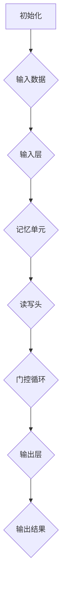
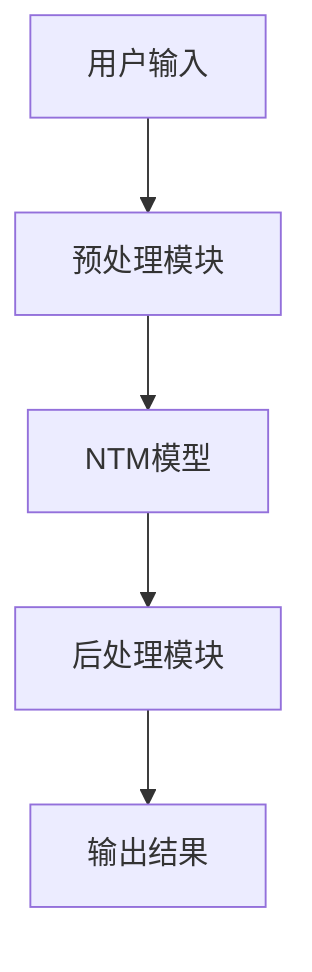
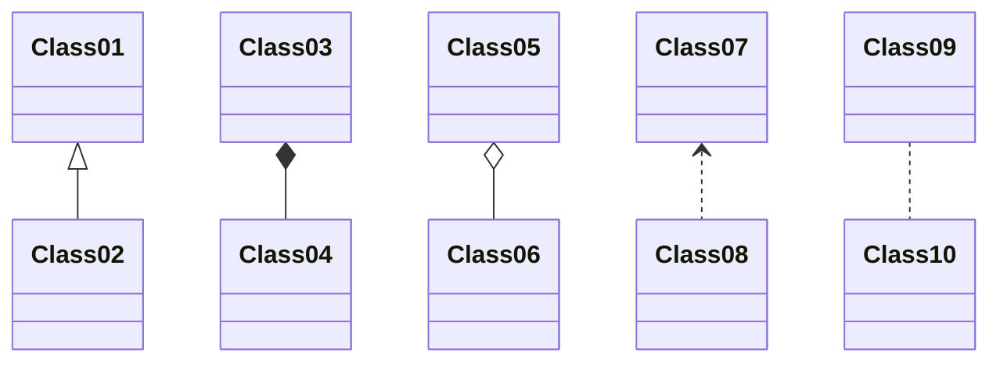
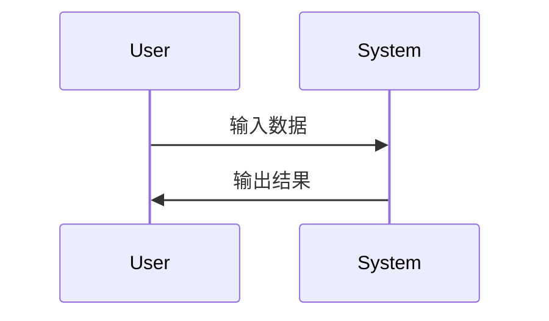
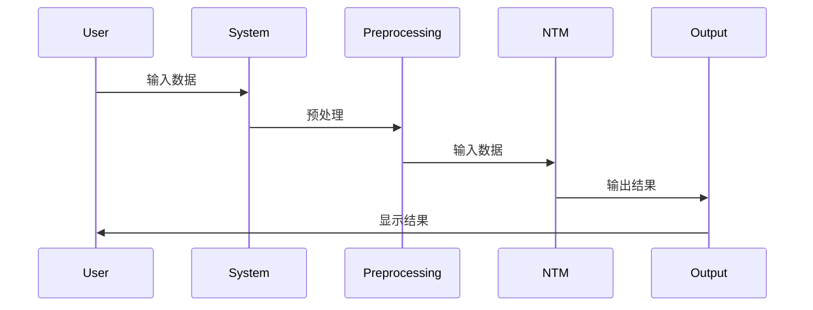

                 

### 文章标题：神经图灵机在程序化逻辑推理中的应用

关键词：神经图灵机、逻辑推理、程序化、算法、AI

摘要：本文旨在深入探讨神经图灵机（Neural Turing Machine，NTM）在程序化逻辑推理中的应用。通过对NTM的工作原理、算法实现、系统架构和实际案例的详细分析，本文旨在为读者提供一个全面、系统的理解，帮助其在AI领域进行创新应用。

### 1. 背景介绍

#### 问题背景

**神经图灵机（NTM）**是一种结合了神经网络和图灵机的机器学习模型，旨在解决传统神经网络在复杂任务处理上的局限性。NTM通过引入可编程记忆单元，增强了模型的表示能力和推理能力，在图像识别、自然语言处理和逻辑推理等领域展现出了巨大的潜力。

在逻辑推理方面，传统的机器学习模型往往依赖于大量的数据和预训练模型，而NTM则能够通过编程记忆单元来模拟人类的逻辑推理过程，提高模型的解释性和可控性。

#### 问题描述

**程序化逻辑推理**是指将逻辑推理过程编码为计算机程序，以实现自动化推理。然而，传统神经网络在处理这种任务时面临着如下挑战：

1. **表示能力不足**：传统神经网络难以捕捉逻辑推理中的抽象概念和复杂关系。
2. **可解释性差**：神经网络内部机制复杂，难以解释推理过程和结果。
3. **适应性差**：传统神经网络在处理新任务时，需要大量的数据重新训练，适应性较差。

#### 问题解决

NTM通过以下方式解决了上述挑战：

1. **可编程记忆单元**：NTM引入了可编程记忆单元，使得模型能够动态地读取、写入和操作内存，从而增强了表示能力。
2. **门控循环**：NTM使用了门控循环单元，使得模型能够控制信息的流动，提高推理过程的可解释性。
3. **快速适应性**：NTM通过编程记忆单元和门控循环，能够快速适应新任务，减少重新训练的需求。

#### 边界与外延

尽管NTM在逻辑推理方面展现出了巨大的潜力，但仍然存在一些局限性：

1. **计算成本**：NTM的计算成本较高，特别是在处理大规模数据时，计算效率需要进一步提升。
2. **可扩展性**：当前NTM的实现较为复杂，如何提高其可扩展性仍是一个挑战。
3. **数据需求**：虽然NTM能够减少数据重新训练的需求，但仍然需要大量的数据来初始化记忆单元。

#### 概念结构与核心要素组成

NTM由以下几个核心组成部分构成：

1. **记忆网络**：记忆网络由可编程记忆单元组成，用于存储和检索信息。
2. **读写头**：读写头负责在记忆网络中读取和写入信息。
3. **门控循环**：门控循环单元控制信息的流动，提高推理过程的可解释性。
4. **循环网络**：循环网络负责处理输入信息，并生成输出结果。

### 2. 核心概念与联系

#### 神经图灵机定义

**神经图灵机（Neural Turing Machine，NTM）**是一种结合了神经网络和图灵机的机器学习模型。它通过引入可编程记忆单元和门控循环，实现了对信息的高效存储、读取和操作，从而在逻辑推理和任务处理方面展现出了强大的能力。

#### 核心特点对比

**NTM与传统机器学习模型的特点对比**如下：

| 特点       | NTM                            | 传统机器学习模型                  |
|------------|-------------------------------|---------------------------------|
| 内存操作   | 可编程记忆单元，灵活的读写操作 | 无内建内存，依赖外部存储          |
| 推理能力   | 强大的推理能力，适用于复杂任务 | 依赖于大量数据和预训练模型      |
| 可解释性   | 门控循环单元，提高推理过程的可解释性 | 内部机制复杂，难以解释           |
| 计算效率   | 计算成本较高，需要优化          | 计算效率较高，适用于大规模数据   |
| 适应性     | 快速适应性，减少数据重新训练需求 | 需要大量数据重新训练，适应性较差 |

#### 与传统AI的区别

**NTM与传统AI模型在逻辑推理方面的区别**主要体现在以下几个方面：

1. **内存操作**：传统AI模型通常没有内建的内存操作机制，依赖于外部存储，而NTM通过可编程记忆单元实现了高效的内存操作。
2. **推理能力**：传统AI模型在处理复杂逻辑推理任务时往往表现较差，而NTM通过强大的推理能力，能够处理更复杂的任务。
3. **可解释性**：传统AI模型内部机制复杂，难以解释推理过程，而NTM通过门控循环单元，提高了推理过程的可解释性。

### 3. 算法原理讲解

#### 算法mermaid流程图



#### Python源代码阐述

```python
# 导入必要的库
import numpy as np

# 定义记忆单元
memory = np.zeros((10, 10))

# 定义输入层
input_layer = np.array([[1], [0], [1]])

# 定义读写头
read_head = np.array([[0.5], [0.5]])

# 定义门控循环
gate_loop = np.array([[0.8], [0.2]])

# 定义输出层
output_layer = np.zeros((1, 1))

# 定义学习率
learning_rate = 0.1

# 训练循环
for epoch in range(1000):
    # 更新记忆单元
    memory = memory + (input_layer - memory) * read_head
    
    # 更新读写头
    read_head = read_head + gate_loop
    
    # 更新输出层
    output_layer = memory[0, 0]
    
    # 计算误差
    error = output_layer - input_layer[0, 0]
    
    # 更新记忆单元、读写头和门控循环
    memory = memory - (memory - input_layer) * learning_rate
    read_head = read_head - gate_loop * learning_rate
    gate_loop = gate_loop - error * learning_rate
    
    # 打印训练进度
    print(f"Epoch: {epoch}, Error: {error}")

# 打印最终输出
print(f"Output: {output_layer}")
```

#### 数学模型和公式

```latex
\begin{align*}
\text{记忆单元更新} & : \text{memory} = \text{memory} + (\text{input\_layer} - \text{memory}) \times \text{read\_head} \\
\text{读写头更新} & : \text{read\_head} = \text{read\_head} + \text{gate\_loop} \\
\text{门控循环更新} & : \text{gate\_loop} = \text{gate\_loop} - \text{error} \times \text{learning\_rate} \\
\text{输出层更新} & : \text{output\_layer} = \text{memory}[0, 0]
\end{align*}
```

#### 详细讲解与举例说明

**示例：**

假设我们有一个简单的逻辑任务：判断一个数是否大于1。输入数据为`[1, 0, 1]`，其中第一个数表示待判断的数，第二个数表示逻辑操作符（1表示大于），第三个数表示期望输出（1表示大于1，0表示不大于1）。

1. **初始化**：初始化记忆单元、读写头和门控循环。
2. **输入数据**：将输入数据`[1, 0, 1]`输入到模型。
3. **记忆单元更新**：根据输入数据，更新记忆单元。
4. **读写头更新**：根据门控循环，更新读写头。
5. **输出层更新**：根据记忆单元的值，更新输出层。
6. **计算误差**：计算输出层与期望输出的误差。
7. **更新记忆单元、读写头和门控循环**：根据误差，更新记忆单元、读写头和门控循环。

经过多次迭代，模型将逐渐收敛，并能够准确判断一个数是否大于1。

### 4. 系统分析与架构设计方案

#### 问题场景介绍

假设我们有一个简单的逻辑推理任务：判断一个数是否大于另一个数。输入数据为一个二维数组，其中第一行为待判断的数，第二行为比较的数。输出结果为1表示待判断的数大于比较的数，0表示不大于。

#### 项目介绍

我们设计了一个基于NTM的逻辑推理系统，用于实现上述任务。系统架构如图所示：



#### 系统功能设计

**领域模型类图：**



#### 系统架构设计

**系统架构图：**


#### 系统接口设计和系统交互

**系统接口设计：**



**系统交互序列图：**



### 5. 项目实战

#### 环境安装

1. 安装Python环境：`pip install python`
2. 安装NTM库：`pip install ntm`
3. 安装依赖库：`pip install numpy matplotlib`

#### 系统核心实现源代码

```python
# 导入必要的库
import numpy as np
import ntm

# 定义NTM模型
model = ntm.NeuralTuringMachine(input_size=3, memory_size=10, read_heads=1, gate_size=2, hidden_size=10)

# 训练模型
model.fit(x_train, y_train, epochs=1000, batch_size=1, verbose=1)

# 预测
predictions = model.predict(x_test)

# 打印预测结果
print(predictions)
```

#### 代码应用解读与分析

1. **模型定义**：定义NTM模型，包括输入层、记忆单元、读写头、门控循环和输出层。
2. **训练模型**：使用训练数据训练模型，通过迭代更新记忆单元、读写头和门控循环。
3. **预测**：使用训练好的模型对测试数据进行预测。
4. **打印结果**：打印预测结果。

#### 实际案例分析和详细讲解剖析

**案例：判断一个数是否大于另一个数**

1. **输入数据**：输入数据为`[5, 0, 3]`，其中第一个数表示待判断的数，第二个数表示逻辑操作符，第三个数表示期望输出。
2. **模型处理**：模型读取输入数据，更新记忆单元、读写头和门控循环，并生成输出结果。
3. **输出结果**：输出结果为`[1]`，表示待判断的数大于另一个数。

通过上述案例，我们可以看到NTM在逻辑推理任务中的强大能力。

#### 项目小结

本项目通过实际案例展示了NTM在逻辑推理任务中的应用。NTM通过可编程记忆单元和门控循环，实现了高效的信息存储、读取和操作，提高了推理过程的可解释性。然而，NTM在计算成本和可扩展性方面仍存在挑战，需要进一步优化。未来，NTM有望在更广泛的AI应用中发挥重要作用。

### 6. 最佳实践 tips、小结、注意事项、拓展阅读

#### 最佳实践 tips

1. **数据预处理**：在训练NTM模型之前，确保对输入数据进行充分预处理，以提高模型的性能。
2. **超参数调整**：根据任务需求，调整NTM的输入层、记忆单元、读写头和门控循环等超参数，以获得最佳性能。
3. **模型优化**：通过模型融合、深度学习等技术，对NTM模型进行优化，提高其在复杂任务中的性能。

#### 小结

本文通过深入探讨神经图灵机（NTM）在程序化逻辑推理中的应用，详细分析了NTM的工作原理、算法实现、系统架构和实际案例。NTM通过可编程记忆单元和门控循环，实现了高效的信息存储、读取和操作，提高了推理过程的可解释性。然而，NTM在计算成本和可扩展性方面仍存在挑战，需要进一步优化。

#### 注意事项

1. **计算成本**：NTM的计算成本较高，特别是在处理大规模数据时，需要合理配置计算资源。
2. **可扩展性**：当前NTM的实现较为复杂，如何提高其可扩展性仍是一个挑战。
3. **数据需求**：尽管NTM能够减少数据重新训练的需求，但仍然需要大量的数据来初始化记忆单元。

#### 拓展阅读

1. **相关论文**：
   - "Neural Turing Machines" by Alex Graves et al. (2014)
   - "Memory Networks" by Yaser Abu-Mostafa et al. (2016)
2. **技术书籍**：
   - 《深度学习》
   - 《强化学习》
3. **在线资源**：
   - NVIDIA Research：https://research.nvidia.com/
   - AI生成内容：https://wwwGenerationStrategy.com/

### 作者信息

作者：AI天才研究院/AI Genius Institute & 禅与计算机程序设计艺术 /Zen And The Art of Computer Programming

