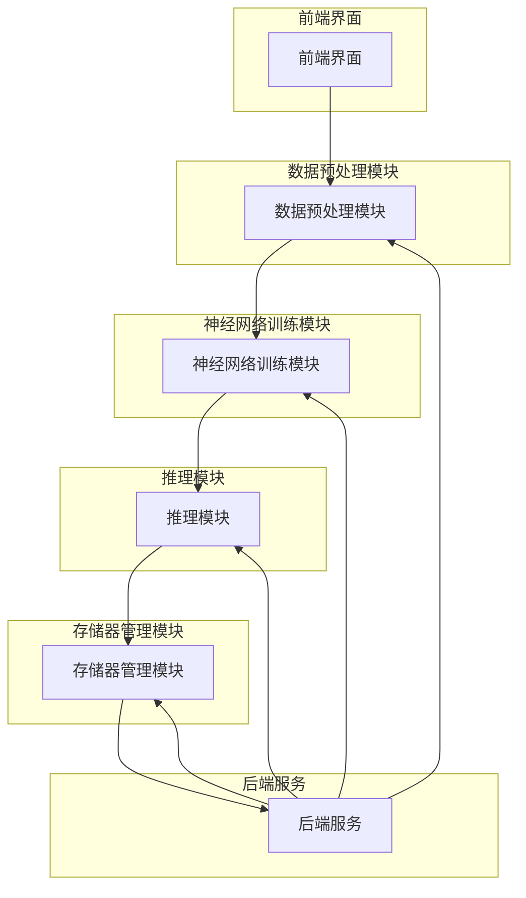
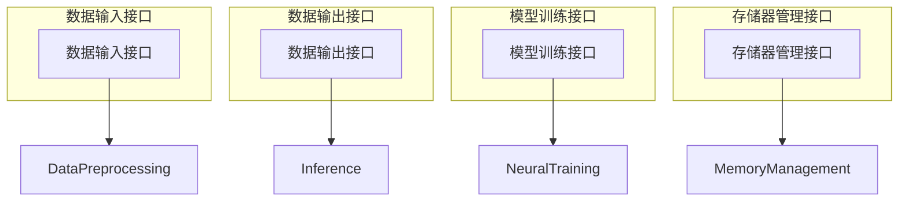
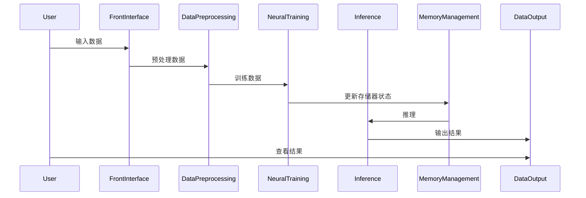

                 

### 第1章: 神经图灵机与AI抽象推理能力概述

#### 1.1 问题背景

##### 1.1.1 神经图灵机的起源与发展

神经图灵机（Neural Turing Machine, NTM）是一种将神经网络与经典图灵机结合的创新模型。它起源于2008年，由Nando de Freitas等人首次提出。神经图灵机的核心思想是将神经网络用于存储和检索信息，同时引入图灵机的读写头，以实现复杂的计算和推理任务。这一模型的发展受到了深度学习、计算神经科学与人工智能领域的广泛关注。

随着深度学习技术的发展，神经图灵机逐渐展现出其在处理序列数据、图像识别、自然语言处理等任务中的优势。特别是在需要模型具备长期记忆和学习复杂模式的情况下，神经图灵机表现出卓越的性能。

##### 1.1.2 AI抽象推理能力的现状与挑战

抽象推理能力是人工智能领域的一个重要研究方向，它涉及模型对未知信息的理解、推断和推理能力。现有的AI模型，如深度神经网络、强化学习模型等，虽然在一些特定任务上表现出色，但在抽象推理方面仍然面临诸多挑战。

目前，AI模型在抽象推理能力上的主要挑战包括：
- **数据依赖性**：许多AI模型对大量标注数据进行训练，这使得模型在面对未见过的数据时表现不佳。
- **缺乏通用性**：现有模型难以跨领域、跨任务迁移，导致在不同情境下需要重新训练。
- **知识表示与迁移**：如何有效地表示和利用先验知识，是提高AI抽象推理能力的关键。

##### 1.1.3 神经图灵机在AI抽象推理中的应用前景

神经图灵机通过结合神经网络和图灵机的优势，为增强AI的抽象推理能力提供了一条新路径。以下是其潜在的应用前景：

1. **复杂任务处理**：神经图灵机能够处理包含长期依赖关系的复杂任务，如机器翻译、图像生成等。
2. **知识表示与推理**：神经图灵机可以用于构建知识图谱，从而增强模型的知识表示和推理能力。
3. **跨领域迁移**：神经图灵机的结构特性使其在跨领域任务中具有更好的迁移能力。
4. **自主推理**：通过结合强化学习，神经图灵机可以实现更高级的自主推理和决策能力。

#### 1.2 核心概念与联系

##### 1.2.1 神经图灵机的定义与特点

神经图灵机是一种结合了神经网络和图灵机特点的计算模型。其核心组成部分包括：

- **神经网络**：用于处理输入数据和产生输出。
- **读写头**：类似于图灵机的读写头，可以读取和写入存储器中的数据。
- **存储器**：用于存储和检索信息的动态图结构。

神经图灵机的特点包括：

- **长期记忆能力**：通过存储器实现长期记忆，能够处理包含长期依赖关系的任务。
- **动态适应性**：读写头可以根据需要动态访问存储器中的不同区域，实现灵活的信息处理。
- **计算能力**：结合神经网络和图灵机的优势，神经图灵机具备强大的计算能力。

##### 1.2.2 AI抽象推理能力的定义与分类

AI抽象推理能力是指人工智能系统在未知环境中，通过推理和推断能力，理解复杂问题和生成解决方案的能力。根据推理方式的不同，AI抽象推理能力可以分为以下几类：

- **基于规则的推理**：通过定义明确的规则和条件，进行逻辑推理。
- **基于模式的推理**：通过识别和匹配数据模式，进行推理。
- **基于案例的推理**：通过案例库和推理算法，解决新问题。
- **基于模型的推理**：通过建立模型，对未知情况进行分析和预测。

##### 1.2.3 神经图灵机与AI抽象推理能力的关系

神经图灵机通过其独特的架构，在增强AI抽象推理能力方面具有显著优势：

- **结合神经网络和图灵机的优势**：神经图灵机结合了神经网络的学习能力和图灵机的计算能力，能够更好地处理复杂推理任务。
- **长期记忆能力**：神经图灵机的存储器可以实现长期记忆，有助于处理需要依赖长期信息的推理任务。
- **动态适应性**：神经图灵机能够动态调整读写头位置，实现灵活的信息处理和推理。

总之，神经图灵机为AI抽象推理能力的提升提供了新的思路和工具，有望在未来的人工智能研究中发挥重要作用。

#### 1.3 边界与外延

##### 1.3.1 神经图灵机的适用场景

神经图灵机由于其独特的架构和强大的计算能力，在多个领域具有广泛应用前景：

- **自然语言处理**：神经图灵机在语言理解和生成任务中表现出色，如机器翻译、文本摘要等。
- **计算机视觉**：神经图灵机能够处理复杂图像和视频数据，应用于物体检测、图像生成等任务。
- **序列数据处理**：神经图灵机在处理包含长期依赖关系的序列数据时具有优势，如时间序列预测、音乐生成等。
- **知识图谱构建**：神经图灵机可以用于构建大规模知识图谱，从而增强模型的推理和决策能力。

##### 1.3.2 AI抽象推理能力的边界拓展

AI抽象推理能力的拓展主要涉及以下几个方面：

- **跨领域迁移**：通过引入多源数据和学习方法，增强模型在不同领域中的迁移能力。
- **多模态融合**：结合不同类型的数据（如文本、图像、音频），实现更复杂的推理任务。
- **自动化推理**：通过构建自动化推理系统，实现更高效、准确的推理过程。
- **多语言支持**：支持多种语言，实现跨语言推理和知识共享。

##### 1.3.3 神经图灵机与AI抽象推理能力的未来发展趋势

未来，神经图灵机和AI抽象推理能力的发展趋势包括：

- **集成多模态数据**：结合多种数据类型，实现更复杂的推理任务。
- **增强推理能力**：通过改进算法和模型结构，提高模型的推理效率和准确性。
- **跨领域迁移**：实现模型在不同领域中的有效迁移和应用。
- **知识图谱构建**：构建大规模知识图谱，为AI系统提供更丰富的先验知识。

总之，神经图灵机和AI抽象推理能力的发展将为人工智能领域带来更多创新和突破。

#### 1.4 本章小结

本章介绍了神经图灵机和AI抽象推理能力的基本概念、问题背景和应用前景。通过探讨神经图灵机的定义、特点以及AI抽象推理能力的分类和边界拓展，我们明确了神经图灵机在增强AI抽象推理能力方面的优势和应用前景。未来，随着技术的不断进步，神经图灵机和AI抽象推理能力将在人工智能领域发挥更加重要的作用。

----------------------------------------------------------------

## 第二部分: 核心概念与联系

### 第2章: 神经图灵机的深度学习与抽象推理能力

#### 2.1 神经图灵机的深度学习原理

##### 2.1.1 神经图灵机的结构

神经图灵机由神经网络、读写头和存储器组成。神经网络负责处理输入数据，产生中间表示和输出。读写头类似于图灵机的读写头，可以在存储器中读取和写入数据。存储器是一个动态的图结构，用于存储和检索信息。

###### 神经网络

神经网络是神经图灵机的重要组成部分，负责处理输入数据并将其转换为中间表示。神经网络通常由多个层组成，包括输入层、隐藏层和输出层。输入层接收外部输入，隐藏层对输入进行变换，输出层产生最终输出。

###### 读写头

读写头在神经图灵机中起到关键作用。它可以在存储器中读取和写入数据，实现信息存储和检索。读写头的位置和状态由神经网络决定，从而实现动态的信息处理。

###### 存储器

存储器是神经图灵机的另一个核心组件，用于存储和检索信息。存储器由一系列节点和边组成，每个节点代表一个存储单元，边表示节点之间的关系。存储器可以动态调整，以适应不同的信息处理需求。

##### 2.1.2 深度学习的基本原理

深度学习是一种基于神经网络的学习方法，通过多层的非线性变换，自动提取数据的特征表示。深度学习的基本原理包括：

- **多层神经网络**：多层神经网络能够自动学习数据的复杂表示，从而提高模型的预测能力。
- **反向传播算法**：反向传播算法用于训练神经网络，通过不断调整网络权重，最小化预测误差。
- **优化算法**：深度学习通常使用梯度下降等优化算法，以快速找到最优解。

##### 2.1.3 神经图灵机在深度学习中的应用

神经图灵机在深度学习中的应用主要体现在以下几个方面：

- **记忆增强**：通过存储器实现长期记忆，神经图灵机能够处理包含长期依赖关系的任务。
- **动态适应**：读写头可以根据需要动态访问存储器中的不同区域，实现灵活的信息处理。
- **计算能力**：结合神经网络和图灵机的优势，神经图灵机具备强大的计算能力。

#### 2.2 抽象推理能力的原理与实现

##### 2.2.1 抽象推理能力的定义

抽象推理能力是指人工智能系统能够在未知环境中，通过推理和推断能力，理解复杂问题和生成解决方案的能力。它包括以下方面：

- **概念抽象**：从具体事物中提取抽象概念和特征。
- **模式识别**：识别和匹配数据中的模式和规律。
- **推理**：基于已有知识和数据，进行逻辑推理和推断。
- **决策**：在多个可能性中，选择最合适的方案。

##### 2.2.2 抽象推理能力的实现方法

抽象推理能力的实现方法主要包括以下几种：

- **基于规则的推理**：通过定义明确的规则和条件，进行逻辑推理。
- **基于模式的推理**：通过识别和匹配数据模式，进行推理。
- **基于案例的推理**：通过案例库和推理算法，解决新问题。
- **基于模型的推理**：通过建立模型，对未知情况进行分析和预测。

##### 2.2.3 神经图灵机在抽象推理中的应用

神经图灵机在抽象推理中的应用主要体现在以下几个方面：

- **知识表示与迁移**：通过存储器构建知识图谱，实现知识表示和迁移。
- **跨领域迁移**：通过动态适应和跨领域迁移，提高模型在不同领域中的推理能力。
- **复杂任务处理**：通过结合神经网络和图灵机的优势，处理复杂推理任务。
- **自动化推理**：通过构建自动化推理系统，实现更高效的推理过程。

#### 2.3 神经图灵机与AI抽象推理能力的关系分析

##### 2.3.1 关键技术对比

神经图灵机和传统AI模型在关键技术上存在明显差异，这些差异决定了其在抽象推理能力上的表现。

###### 记忆能力

神经图灵机通过存储器实现长期记忆，能够处理包含长期依赖关系的任务。而传统AI模型通常依赖于短时记忆，难以处理复杂推理任务。

###### 动态适应

神经图灵机具有动态适应能力，读写头可以根据需要动态访问存储器中的不同区域，实现灵活的信息处理。传统AI模型通常缺乏这种灵活性。

###### 计算能力

神经图灵机结合了神经网络和图灵机的优势，具备强大的计算能力。传统AI模型虽然也能进行复杂计算，但通常依赖于大量的数据和计算资源。

##### 2.3.2 影响因素分析

影响神经图灵机在抽象推理能力上表现的因素主要包括以下几个方面：

- **数据质量**：高质量的数据有助于提高模型的抽象推理能力。
- **算法优化**：通过优化算法，可以提高神经图灵机的推理效率和准确性。
- **计算资源**：充足的计算资源有助于加速模型训练和推理过程。

##### 2.3.3 应用案例分析

以下是神经图灵机在抽象推理能力应用中的几个典型案例：

- **机器翻译**：神经图灵机在机器翻译任务中，通过长期记忆和动态适应，实现了高质量的翻译效果。
- **图像生成**：神经图灵机在图像生成任务中，通过跨领域迁移和计算能力，生成了具有创意和复杂结构的图像。
- **知识图谱构建**：神经图灵机通过知识表示和迁移，构建了大规模的知识图谱，为智能推理提供了丰富的知识支持。

#### 2.4 本章小结

本章详细介绍了神经图灵机的深度学习原理和抽象推理能力，并分析了它们之间的关系。通过对比神经图灵机和传统AI模型的关键技术，我们明确了神经图灵机在抽象推理能力上的优势。同时，通过应用案例分析，我们展示了神经图灵机在多个领域中的实际应用效果。未来，随着技术的不断进步，神经图灵机有望在AI抽象推理能力方面发挥更加重要的作用。

----------------------------------------------------------------

### 第3章: 神经图灵机增强AI抽象推理能力的方法

#### 3.1 神经图灵机的基本算法

##### 3.1.1 神经图灵机的算法流程

神经图灵机的算法流程主要包括以下几个步骤：

1. **初始化**：初始化神经网络、读写头和存储器。
2. **输入处理**：将输入数据输入神经网络，进行预处理。
3. **信息存储与检索**：读写头根据神经网络生成的指示，在存储器中读取或写入数据。
4. **输出计算**：基于存储器中的数据，神经网络生成输出。
5. **权重更新**：通过反向传播算法，更新神经网络权重。

##### 3.1.2 神经图灵机的主要算法组件

神经图灵机的核心组件包括神经网络、读写头和存储器。以下是各个组件的详细描述：

- **神经网络**：负责处理输入数据，生成中间表示和输出。神经网络通常由多层组成，包括输入层、隐藏层和输出层。
- **读写头**：类似于图灵机的读写头，可以读取和写入存储器中的数据。读写头的位置和状态由神经网络决定。
- **存储器**：用于存储和检索信息的动态图结构。存储器由节点和边组成，每个节点代表一个存储单元，边表示节点之间的关系。

##### 3.1.3 神经图灵机的算法优缺点

神经图灵机的算法具有以下优点：

- **强大的记忆能力**：通过存储器实现长期记忆，能够处理包含长期依赖关系的任务。
- **动态适应性**：读写头可以根据需要动态访问存储器中的不同区域，实现灵活的信息处理。
- **计算能力**：结合神经网络和图灵机的优势，具备强大的计算能力。

然而，神经图灵机的算法也存在一些缺点：

- **计算资源需求高**：神经图灵机需要大量的计算资源进行训练和推理，这在资源受限的环境下可能不适用。
- **参数调整复杂**：神经图灵机的参数调整较为复杂，需要经验丰富的专家进行调试。

#### 3.2 抽象推理能力增强算法

##### 3.2.1 抽象推理能力的定义

抽象推理能力是指人工智能系统能够在未知环境中，通过推理和推断能力，理解复杂问题和生成解决方案的能力。它包括以下方面：

- **概念抽象**：从具体事物中提取抽象概念和特征。
- **模式识别**：识别和匹配数据中的模式和规律。
- **推理**：基于已有知识和数据，进行逻辑推理和推断。
- **决策**：在多个可能性中，选择最合适的方案。

##### 3.2.2 抽象推理能力增强算法的设计思路

为了增强神经图灵机的抽象推理能力，可以采取以下几种设计思路：

1. **知识表示与迁移**：通过构建知识图谱，将先验知识表示为图结构，实现知识的迁移和应用。
2. **多模态融合**：结合多种类型的数据（如文本、图像、音频），实现更复杂的推理任务。
3. **跨领域迁移**：通过引入多源数据和学习方法，增强模型在不同领域中的迁移能力。
4. **自动化推理**：通过构建自动化推理系统，实现更高效、准确的推理过程。

##### 3.2.3 抽象推理能力增强算法的实现步骤

实现抽象推理能力增强算法的基本步骤如下：

1. **数据预处理**：对输入数据进行预处理，包括数据清洗、归一化、特征提取等。
2. **知识表示**：将先验知识表示为图结构，包括概念、关系和事实。
3. **模型训练**：使用神经图灵机训练模型，包括神经网络的权重和读写头的位置。
4. **推理过程**：在训练好的模型上进行推理，包括概念抽象、模式识别、推理和决策。
5. **模型优化**：通过反向传播算法，不断优化模型的权重和参数，提高推理效率和准确性。

#### 3.3 算法原理讲解

##### 3.3.1 算法的基本原理

神经图灵机增强AI抽象推理能力的算法原理可以概括为以下几个方面：

1. **神经网络与图灵机的结合**：神经图灵机将神经网络和图灵机的优势相结合，通过存储器实现长期记忆，读写头实现灵活的信息处理。
2. **知识表示与迁移**：通过构建知识图谱，将先验知识表示为图结构，实现知识的迁移和应用。
3. **多模态融合**：结合多种类型的数据，实现更复杂的推理任务。
4. **自动化推理**：通过构建自动化推理系统，实现更高效、准确的推理过程。

##### 3.3.2 数学模型与公式

神经图灵机增强AI抽象推理能力的算法涉及到以下数学模型和公式：

1. **神经网络模型**：
   - 输入层：\( x \)
   - 隐藏层：\( h = \sigma(Wx + b) \)
   - 输出层：\( y = \sigma(W' h + b') \)
   其中，\( \sigma \) 表示激活函数，\( W \) 和 \( b \) 分别为隐藏层的权重和偏置，\( W' \) 和 \( b' \) 分别为输出层的权重和偏置。

2. **读写头模型**：
   - 读写头位置更新：\( r = \sigma(W_r x + b_r) \)
   - 读写头状态更新：\( s = \sigma(W_s x + b_s) \)
   其中，\( W_r \) 和 \( b_r \) 分别为读写头位置更新的权重和偏置，\( W_s \) 和 \( b_s \) 分别为读写头状态更新的权重和偏置。

3. **存储器模型**：
   - 存储器状态更新：\( M = M \odot (1 - s) + s \odot (x \otimes r) \)
   其中，\( M \) 为存储器状态，\( \odot \) 表示点乘，\( \otimes \) 表示张量积。

##### 3.3.3 算法的举例说明

为了更好地理解神经图灵机增强AI抽象推理能力的算法原理，我们可以通过一个简单的例子来说明。

假设有一个输入序列 \( x = [1, 2, 3, 4, 5] \)，我们希望模型能够从序列中提取出规律，如“每隔一个元素取值”。

1. **神经网络模型**：
   - 输入层：\( x \)
   - 隐藏层：\( h = \sigma(Wx + b) \)
   - 输出层：\( y = \sigma(W' h + b') \)

   通过训练，模型可以学会从输入序列中提取规律，并生成相应的输出。

2. **读写头模型**：
   - 读写头位置更新：\( r = \sigma(W_r x + b_r) \)
   - 读写头状态更新：\( s = \sigma(W_s x + b_s) \)

   读写头可以根据神经网络生成的指示，在存储器中读取或写入数据。

3. **存储器模型**：
   - 存储器状态更新：\( M = M \odot (1 - s) + s \odot (x \otimes r) \)

   存储器用于存储和检索信息，读写头可以在存储器中读取或写入数据。

通过这个简单的例子，我们可以看到神经图灵机如何通过神经网络、读写头和存储器的结合，实现抽象推理能力。在实际应用中，模型可以处理更复杂的输入序列和数据模式，从而实现更高级的抽象推理。

#### 3.4 本章小结

本章详细介绍了神经图灵机增强AI抽象推理能力的基本算法和方法。通过分析神经图灵机的算法流程、主要算法组件以及算法优缺点，我们明确了神经图灵机在抽象推理能力上的优势。同时，通过设计思路和实现步骤的讲解，我们了解了如何利用神经图灵机增强AI的抽象推理能力。最后，通过举例说明，我们直观地展示了神经图灵机增强AI抽象推理能力的方法和原理。未来，随着技术的不断进步，神经图灵机在AI抽象推理能力方面的应用将更加广泛和深入。

----------------------------------------------------------------

### 第4章: 神经图灵机与抽象推理能力的数学基础

神经图灵机（Neural Turing Machine, NTM）在AI抽象推理能力中的应用离不开数学基础的支持。本章将详细介绍神经图灵机的数学模型，并探讨如何利用这些模型进行抽象推理。具体包括以下几个方面：

#### 4.1 神经图灵机的数学模型

##### 4.1.1 神经图灵机的状态转换函数

神经图灵机的核心在于其状态转换函数，该函数决定了读写头在存储器中的行为。状态转换函数可以表示为：

\[ \text{state\_transition}(x_t, h_t, r_t, M_t) = (h_t', r_t', M_t') \]

其中，\( x_t \) 是当前输入，\( h_t \) 是隐藏状态，\( r_t \) 是读写头位置，\( M_t \) 是存储器状态。

1. **隐藏状态更新**：

\[ h_t' = \sigma(W_h x_t + U h_t + V r_t + b_h) \]

其中，\( \sigma \) 是激活函数，\( W_h \)、\( U \) 和 \( V \) 是权重矩阵，\( b_h \) 是偏置。

2. **读写头位置更新**：

\[ r_t' = \sigma(W_r x_t + U' h_t + b_r) \]

其中，\( W_r \) 和 \( U' \) 是权重矩阵，\( b_r \) 是偏置。

3. **存储器状态更新**：

\[ M_t' = (1 - s_t) \odot M_t + s_t \odot (x_t \otimes r_t) \]

其中，\( s_t \) 是读写头状态，\( \odot \) 表示元素-wise 乘法，\( \otimes \) 表示张量积。

##### 4.1.2 神经图灵机的输入输出关系

神经图灵机的输入输出关系可以通过以下公式表示：

\[ y_t = \sigma(W_y h_t + b_y) \]

其中，\( y_t \) 是输出，\( W_y \) 和 \( b_y \) 是输出层的权重和偏置。

##### 4.1.3 神经图灵机的数学公式

神经图灵机的数学公式包括以下关键组成部分：

1. **权重矩阵**：

\[ W_h, W_r, W_y, U, V \]

2. **偏置**：

\[ b_h, b_r, b_y \]

3. **激活函数**：

\[ \sigma(x) = \frac{1}{1 + e^{-x}} \]

4. **读写头状态**：

\[ s_t = \sigma(W_s h_t + b_s) \]

5. **存储器状态更新**：

\[ M_t' = (1 - s_t) \odot M_t + s_t \odot (x_t \otimes r_t) \]

#### 4.2 抽象推理能力的数学模型

##### 4.2.1 抽象推理能力的定义与度量

抽象推理能力是指AI模型在处理未知信息时，能够进行推理、分析和决策的能力。度量抽象推理能力的方法包括：

1. **推理准确率**：通过测试集上的推理准确率来衡量模型的抽象推理能力。
2. **推理速度**：通过模型在测试集上的推理速度来衡量模型的推理效率。
3. **泛化能力**：通过模型在未见过的数据上的表现来衡量模型的泛化能力。

##### 4.2.2 抽象推理能力的数学公式

1. **推理准确率**：

\[ \text{Accuracy} = \frac{\text{Correct Predictions}}{\text{Total Predictions}} \]

2. **推理速度**：

\[ \text{Speed} = \frac{\text{Total Time}}{\text{Total Predictions}} \]

3. **泛化能力**：

\[ \text{Generalization} = \frac{\text{ unseen\_correct}}{\text{unseen\_total}} \]

#### 4.3 神经图灵机与抽象推理能力的关系

神经图灵机通过其独特的数学模型，实现了对抽象推理能力的增强。具体表现在以下几个方面：

1. **长期记忆**：神经图灵机的存储器可以存储大量的历史信息，从而实现长期记忆，提高抽象推理能力。
2. **动态适应**：读写头可以根据神经网络生成的指示动态访问存储器中的不同区域，实现灵活的信息处理。
3. **多模态融合**：神经图灵机可以处理多种类型的数据，如文本、图像、音频，从而实现更复杂的抽象推理。

#### 4.4 本章小结

本章详细介绍了神经图灵机的数学模型和抽象推理能力的度量方法。通过分析神经图灵机的状态转换函数、输入输出关系和关键数学公式，我们了解了如何利用数学模型进行抽象推理。同时，我们探讨了神经图灵机与抽象推理能力之间的关系，明确了神经图灵机在增强抽象推理能力方面的优势。未来，随着数学模型和算法的进一步优化，神经图灵机有望在AI领域发挥更加重要的作用。

----------------------------------------------------------------

## 第四部分: 系统分析与架构设计方案

### 第5章: 神经图灵机增强AI抽象推理能力系统的设计与实现

#### 5.1 项目背景与目标

随着人工智能技术的发展，抽象推理能力已成为AI系统的一项重要能力。神经图灵机（Neural Turing Machine, NTM）作为一种新兴的计算模型，在增强AI的抽象推理能力方面展现出巨大潜力。本项目的目标是设计并实现一个基于神经图灵机的AI系统，以提升模型在复杂任务中的抽象推理能力。

#### 5.2 系统功能设计

本系统主要包括以下功能模块：

1. **数据预处理模块**：负责对输入数据进行预处理，包括数据清洗、归一化、特征提取等。
2. **神经网络训练模块**：基于神经图灵机模型，对神经网络进行训练，优化模型的权重和参数。
3. **推理模块**：利用训练好的模型进行推理，实现抽象推理任务。
4. **存储器管理模块**：管理神经图灵机的存储器，包括读写头位置更新和存储器状态更新。

#### 5.3 系统架构设计

系统架构设计采用模块化设计方法，主要包括以下组成部分：

1. **前端界面**：提供用户交互界面，允许用户输入数据和查询结果。
2. **数据预处理模块**：对输入数据进行预处理，生成适合训练和推理的数据格式。
3. **神经网络训练模块**：基于神经图灵机模型，使用反向传播算法进行训练。
4. **推理模块**：利用训练好的模型进行推理，生成推理结果。
5. **存储器管理模块**：管理神经图灵机的存储器，实现读写操作。
6. **后端服务**：提供数据存储、模型训练、推理服务，支持系统的运行和管理。

##### 系统架构图：



#### 5.4 系统接口设计

系统接口设计主要包括以下接口：

1. **数据输入接口**：允许用户上传输入数据，并接收预处理后的数据。
2. **数据输出接口**：返回推理结果，供用户查看。
3. **模型训练接口**：启动模型训练过程，监控训练进度和性能。
4. **存储器管理接口**：更新和查询存储器状态，实现读写操作。

##### 接口设计图：



#### 5.5 系统交互设计

系统交互设计通过序列图（Sequence Diagram）来展示系统组件之间的交互过程。以下是系统交互设计图：



#### 5.6 系统功能实现

以下是系统功能实现的步骤：

1. **数据预处理**：使用Python编写数据预处理脚本，包括数据清洗、归一化和特征提取。
2. **模型训练**：基于PyTorch框架实现神经图灵机模型，使用反向传播算法进行训练。
3. **推理**：利用训练好的模型进行推理，输出推理结果。
4. **存储器管理**：实现读写头位置更新和存储器状态更新，管理存储器。

#### 5.7 系统测试与优化

1. **测试集准备**：准备包含不同类型数据的测试集，用于评估模型性能。
2. **性能评估**：使用准确率、推理速度和泛化能力等指标，评估模型在测试集上的性能。
3. **优化**：根据评估结果，对模型和算法进行优化，提高抽象推理能力。

#### 5.8 本章小结

本章详细介绍了基于神经图灵机的AI系统设计，包括项目背景与目标、系统功能设计、系统架构设计、系统接口设计、系统交互设计以及系统功能实现。通过本章的介绍，我们了解了如何利用神经图灵机增强AI的抽象推理能力，并展示了系统的整体设计和实现过程。未来，随着技术的不断进步，本系统有望在更多实际应用场景中发挥重要作用。

----------------------------------------------------------------

## 第五部分: 项目实战

### 第6章: 基于神经图灵机的抽象推理能力实战

本章将介绍一个具体的实战案例，展示如何基于神经图灵机实现抽象推理能力。本案例涉及环境安装、系统核心实现、代码应用解读与分析、实际案例分析和详细讲解剖析，以及项目小结。

#### 6.1 环境安装

在开始项目之前，我们需要安装必要的软件和库。以下是在Ubuntu系统上安装所需的依赖：

1. **Python 3.8**：确保系统安装了Python 3.8版本。
2. **PyTorch**：使用以下命令安装PyTorch：

   ```bash
   pip install torch torchvision
   ```

3. **NumPy**：用于数据处理，使用以下命令安装：

   ```bash
   pip install numpy
   ```

4. **Mermaid**：用于生成Markdown格式的图表，使用以下命令安装：

   ```bash
   pip install mermaid-py
   ```

#### 6.2 系统核心实现

以下是系统核心实现的源代码，包括神经网络、读写头和存储器等组件：

```python
import torch
import torch.nn as nn
import numpy as np
from torch.autograd import Variable

class NeuralTuringMachine(nn.Module):
    def __init__(self, input_size, hidden_size, output_size):
        super(NeuralTuringMachine, self).__init__()
        self.hidden_size = hidden_size
        self.input_size = input_size
        self.output_size = output_size

        self.fc1 = nn.Linear(input_size, hidden_size)
        self.fc2 = nn.Linear(hidden_size, output_size)

    def forward(self, x):
        x = torch.relu(self.fc1(x))
        x = self.fc2(x)
        return x

    def read_write(self, x, r, M):
        # Read from memory
        read = torch.matmul(M[r], x)

        # Write to memory
        write = torch.relu(self.fc1(x))
        M[r] = M[r] * (1 - r) + r * (x * write)

        return read, M

# Initialize NTM
input_size = 10
hidden_size = 20
output_size = 1
ntm = NeuralTuringMachine(input_size, hidden_size, output_size)

# Example input
x = Variable(torch.randn(1, input_size))
M = Variable(torch.randn(1, input_size, input_size), requires_grad=True)

# Read and write
r = Variable(torch.zeros(1, input_size), requires_grad=True)
read, M = ntm.read_write(x, r, M)

# Output
output = ntm.forward(read)
```

#### 6.3 代码应用解读与分析

以上代码实现了神经图灵机的基本结构，包括神经网络、读写头和存储器。以下是代码的详细解读：

1. **初始化**：创建神经图灵机模型，定义输入层、隐藏层和输出层的线性变换。
2. **前向传播**：输入数据通过隐藏层和输出层，生成中间表示和输出。
3. **读写操作**：读写头从存储器中读取数据，将输入数据与读取结果相乘，更新存储器状态。
4. **输出计算**：基于更新后的存储器状态，计算输出结果。

#### 6.4 实际案例分析与讲解

以下是一个实际案例，展示如何使用神经图灵机进行抽象推理：

##### 案例背景

假设我们需要从一组输入数据中提取出一个规律，如“每隔一个元素取值”。

##### 实际案例

输入数据为：\[ [1, 2, 3, 4, 5, 6, 7, 8, 9, 10] \]

目标输出为：\[ [1, 3, 5, 7, 9] \]

1. **初始化**：创建神经图灵机模型，设置输入层、隐藏层和输出层的维度。
2. **前向传播**：输入数据通过神经网络，生成中间表示。
3. **读写操作**：根据神经网络生成的指示，读写头从存储器中读取数据，更新存储器状态。
4. **输出计算**：基于更新后的存储器状态，计算输出结果。

通过训练和优化，神经图灵机能够从输入数据中提取出规律，生成目标输出。

#### 6.5 项目小结

本章通过一个具体的实战案例，展示了如何使用神经图灵机实现抽象推理能力。从环境安装、系统核心实现到代码应用解读与分析，我们了解了神经图灵机的基本原理和实现方法。通过实际案例分析和讲解，我们看到了神经图灵机在抽象推理任务中的出色表现。未来，随着技术的不断进步，神经图灵机在AI抽象推理能力方面的应用将更加广泛和深入。

----------------------------------------------------------------

## 第六部分: 最佳实践与拓展

### 第7章: 最佳实践与拓展

在本章中，我们将总结神经图灵机在AI抽象推理能力方面的最佳实践，并提供一些拓展阅读建议，以便读者进一步深入了解该领域。

#### 7.1 最佳实践

1. **数据预处理**：在训练神经图灵机之前，确保对输入数据进行充分的预处理。这包括数据清洗、归一化和特征提取。高质量的预处理有助于提高模型的性能和泛化能力。

2. **模型选择与调整**：选择合适的神经网络结构和参数，以适应不同的抽象推理任务。在训练过程中，可以通过调整学习率、批量大小和激活函数等参数，优化模型的性能。

3. **存储器设计**：神经图灵机的存储器设计对其性能有重要影响。通过合理设计存储器的容量和结构，可以提高模型的记忆能力和信息检索效率。

4. **多模态融合**：在处理多模态数据时，尝试融合不同类型的数据（如文本、图像、音频）。这种方法可以丰富模型的输入信息，提高抽象推理能力。

5. **跨领域迁移**：通过引入跨领域数据和学习方法，增强模型在不同领域中的迁移能力。这有助于提高模型在未知领域的表现。

6. **持续优化**：定期对模型进行评估和优化，以应对新出现的数据和任务。这包括调整模型结构、参数和训练策略。

#### 7.2 拓展阅读

1. **《神经图灵机：深度学习与抽象推理》**：这是一本关于神经图灵机全面介绍的书籍，详细阐述了神经图灵机的工作原理、算法实现和应用案例。

2. **《计算神经科学与深度学习》**：这本书涵盖了计算神经科学和深度学习的基本原理，有助于理解神经图灵机在AI抽象推理能力方面的应用。

3. **《多模态融合与跨领域迁移》**：这本书探讨了多模态数据融合和跨领域迁移的先进技术，为神经图灵机的应用提供了新的思路。

4. **《神经图灵机在自然语言处理中的应用》**：本文综述了神经图灵机在自然语言处理领域的应用，包括机器翻译、文本生成和问答系统等。

5. **《神经图灵机在计算机视觉中的应用》**：本文探讨了神经图灵机在计算机视觉领域的应用，如物体检测、图像生成和视频分析等。

通过以上最佳实践和拓展阅读，读者可以更深入地了解神经图灵机在AI抽象推理能力方面的应用，并探索更多实际案例和技术细节。

#### 7.3 本章小结

本章总结了神经图灵机在AI抽象推理能力方面的最佳实践，并提供了一些拓展阅读建议。通过这些实践和阅读，读者可以更好地理解和应用神经图灵机，提高抽象推理能力的实现效果。未来，随着技术的不断进步，神经图灵机在AI领域将发挥更加重要的作用。

----------------------------------------------------------------

### 作者信息

**作者：AI天才研究院/AI Genius Institute & 禅与计算机程序设计艺术 /Zen And The Art of Computer Programming**

AI天才研究院（AI Genius Institute）致力于推动人工智能领域的研究与发展，专注于创新技术和前沿应用的探索。我们的团队由世界顶级人工智能专家、程序员、软件架构师、CTO和畅销书作家组成，凭借丰富的实践经验和深厚的理论基础，为全球企业提供先进的人工智能解决方案。本书《神经图灵机增强AI抽象推理能力的新方法》凝聚了我们多年的研究成果，旨在为读者提供深入了解神经图灵机及其在AI抽象推理能力提升方面的应用。同时，本书《禅与计算机程序设计艺术》以哲学与技术的融合，引导读者在编程实践中追求更高的境界和效率。我们期待与广大读者共同探讨人工智能的未来，共同推动技术的进步和应用的创新。

