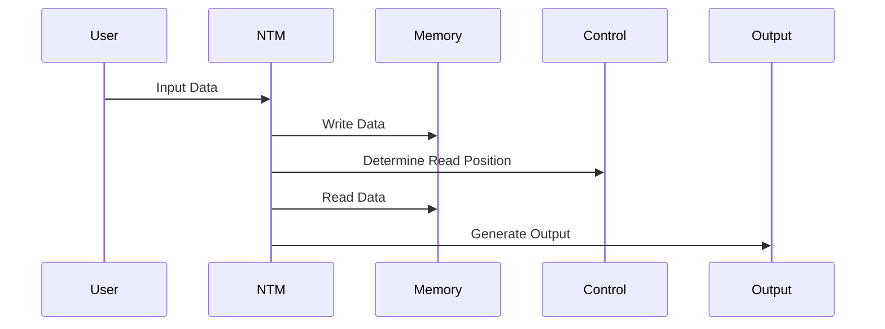
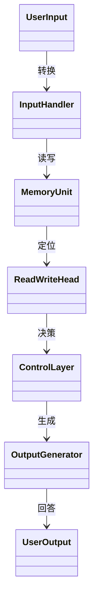
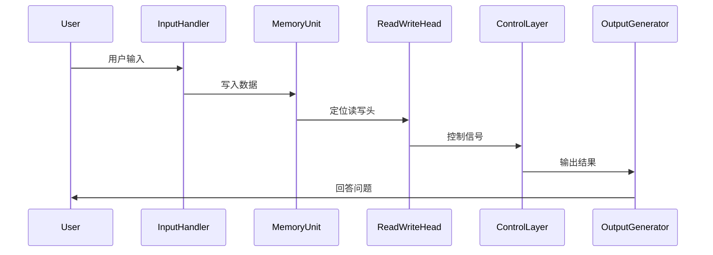
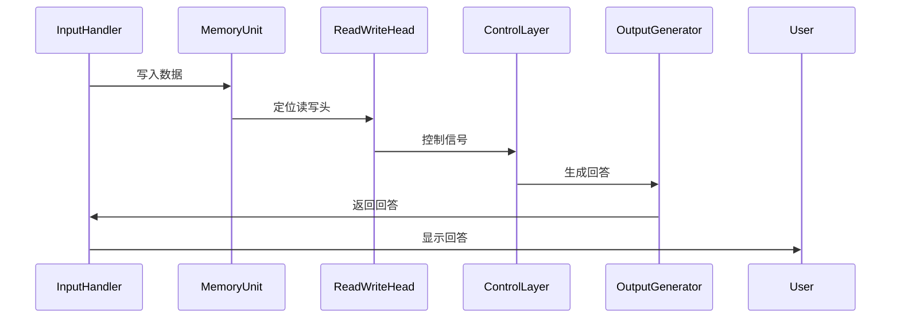

                 

## **文章标题**：神经图灵机增强AI的抽象概念推理能力

### **关键词**：神经图灵机，AI，抽象概念推理，深度学习，数学模型，系统架构

### **摘要**：

本文旨在探讨神经图灵机（Neural Turing Machine, NTM）如何通过其独特的架构和算法，显著提升人工智能（Artificial Intelligence, AI）在抽象概念推理方面的能力。文章将首先介绍神经图灵机的基本概念和结构，然后深入解析其核心算法原理和数学模型。接着，我们将通过实际案例展示神经图灵机如何应用于自然语言处理和计算机视觉等领域，提升AI的抽象概念推理能力。文章还将详细讨论神经图灵机的系统架构设计，并通过一个实战项目展示其具体应用。最后，我们将总结最佳实践，并提供未来的研究方向。

## **背景介绍**：神经图灵机的基本概念与问题背景

神经图灵机（Neural Turing Machine，简称NTM）是一种结合了神经网络与图灵机的计算模型，由Alex Graves等人于2014年首次提出。传统的神经网络在处理数据时主要通过前馈和反馈网络结构进行特征提取和学习，但它们在处理复杂任务时，尤其是在需要高阶抽象概念推理的任务上存在局限性。相比之下，图灵机作为计算理论的基础，以其强大的计算能力和对复杂问题的处理能力著称。将神经网络与图灵机相结合，使得NTM能够同时发挥两者的优势，从而在处理抽象概念和复杂任务时表现出色。

### **核心概念术语说明**

- **神经图灵机（Neural Turing Machine）**：一种结合神经网络与图灵机思想的计算模型。
- **神经网络（Neural Network）**：由大量简单神经元组成的计算模型，通过学习数据中的模式和特征来实现复杂任务的求解。
- **图灵机（Turing Machine）**：一种抽象的计算模型，由一个无限长的带子和在其上移动的读写头组成，用于理论计算和研究。
- **抽象概念推理（Abstract Concept Reasoning）**：在缺乏直接经验的情况下，通过逻辑推理和抽象思维来理解和处理复杂概念和问题的能力。

### **问题背景与问题描述**

随着人工智能技术的快速发展，对AI在抽象概念推理能力的需求日益增加。然而，传统的神经网络模型在处理这类任务时存在显著的局限性，主要表现在：

1. **数据依赖性高**：神经网络模型在处理抽象概念时，通常需要大量的数据进行训练，这对于一些数据稀缺的领域来说是一个巨大的挑战。
2. **推理能力有限**：神经网络模型主要依靠学习输入数据中的统计特征，而缺乏内在的推理机制，导致在处理需要高阶抽象推理的任务时表现不佳。
3. **知识迁移能力差**：神经网络模型在特定任务上的训练结果难以迁移到其他任务上，导致模型的泛化能力有限。

为了解决这些问题，研究者们提出了神经图灵机这一新的计算模型。NTM通过结合神经网络与图灵机的优势，不仅能够利用神经网络进行高效的特征提取和学习，还能通过图灵机的结构实现复杂的抽象概念推理。因此，神经图灵机在提升AI的抽象概念推理能力方面具有巨大的潜力。

### **问题解决与边界与外延**

神经图灵机在提升AI抽象概念推理能力方面具有以下几个关键优势：

1. **结合神经网络与图灵机的优势**：NTM通过结合神经网络和图灵机的特点，能够在处理复杂任务时既具备神经网络的高效学习能力，又具备图灵机的强大推理能力。
2. **内置推理机制**：NTM通过其特有的读写头和记忆单元，实现了对数据的动态访问和存储，使得模型能够在处理任务时进行有效的推理和决策。
3. **增强的泛化能力**：由于NTM能够通过记忆单元实现知识的存储和迁移，使得模型在不同任务上能够更加灵活地应用所学知识，从而提高泛化能力。

然而，尽管NTM在提升抽象概念推理能力方面具有显著优势，但也存在一定的局限性：

1. **计算复杂度高**：NTM的记忆单元和读写头操作增加了模型的计算复杂度，导致在处理大规模数据时效率较低。
2. **训练难度大**：NTM的训练过程相对复杂，需要更多的计算资源和时间，对于一些资源有限的场景来说可能不太适用。
3. **实现难度**：由于NTM的结构相对复杂，其实现在实际应用中的难度较高，需要专业的技术知识和实践经验。

### **概念结构与核心要素组成**

神经图灵机的概念结构主要包括以下几个核心要素：

1. **读写头（Read-Write Head）**：NTM的核心组件，用于读取和写入记忆单元中的数据，实现数据的动态访问和存储。
2. **记忆单元（Memory Unit）**：NTM的另一个关键组件，用于存储大量信息，通过读写头实现数据的读写操作。
3. **输入层（Input Layer）**：接收外部输入数据，将输入信息转化为神经网络可处理的形式。
4. **输出层（Output Layer）**：根据记忆单元中的信息生成输出结果。
5. **控制层（Control Layer）**：负责调节读写头的位置和方向，控制记忆单元的读写操作。

通过这些核心要素的协同工作，NTM能够实现高效的抽象概念推理。

### **核心概念与联系**

#### **核心概念原理**

神经图灵机（NTM）的核心概念在于其独特的记忆和读写机制。与传统神经网络不同，NTM引入了图灵机的思想，通过读写头来读取和写入外部记忆单元。这种结构使得NTM能够在处理数据时动态地访问和更新记忆，从而实现更复杂的推理和决策。

#### **概念属性特征对比表格**

| 特征               | 传统神经网络（NN）                      | 神经图灵机（NTM）                      |
|--------------------|----------------------------------------|----------------------------------------|
| 学习机制           | 基于前向传播和反向传播算法             | 结合了神经网络与图灵机的思想，具备读写头和记忆单元 |
| 记忆机制           | 无内部记忆结构，仅依赖于权重更新       | 具备内部记忆单元，可动态读取和写入数据       |
| 推理能力           | 主要依靠输入数据的统计特征进行学习     | 通过读写头和记忆单元进行动态推理和决策       |
| 泛化能力           | 泛化能力受限于训练数据的分布           | 可以通过记忆单元实现知识的迁移和泛化       |

#### **ER实体关系图架构的 Mermaid 流程图**

```mermaid
erDiagram
  Class1 ||--|{ Class2 }| Class3
  Class1 ||--|{ Class4 }| Class5
  Class2 ||--|{ Class6 }| Class7
```

此ER图展示了神经图灵机的主要组件（Class1：读写头，Class2：记忆单元，Class3：输入层，Class4：输出层，Class5：控制层，Class6：输入数据，Class7：输出结果）之间的实体关系。

## **算法原理讲解**

### **算法原理与mermaid流程图**

神经图灵机（NTM）的核心算法包括读写头的定位、记忆单元的读写操作以及控制层的决策。以下是一个简化的mermaid流程图，用于描述NTM的基本工作流程：



在这个流程图中，用户将输入数据输入到NTM，NTM将数据写入记忆单元，然后通过控制层确定读取位置，从记忆单元中读取数据，最终生成输出。

### **Python源代码详细阐述**

为了更直观地理解NTM的算法原理，下面给出一个简化的Python源代码示例：

```python
import numpy as np

# 初始化参数
memory_size = 100  # 记忆单元大小
input_data = np.random.rand(1, memory_size)  # 输入数据

# 记忆单元
memory = np.zeros((1, memory_size))

# 读写头位置
read_write_head = 0

# 控制层决策参数
control_signal = np.random.rand(1)

# 写入操作
memory[0, read_write_head:read_write_head+input_data.shape[1]] = input_data[0]

# 读取操作
read_data = memory[0, read_write_head:read_write_head+input_data.shape[1]]

# 控制层决策
if control_signal > 0.5:
    read_write_head += 1
else:
    read_write_head -= 1

# 输出
output = read_data

print("Output:", output)
```

这个示例代码展示了NTM的基本操作，包括初始化记忆单元、输入数据的写入和读取、读写头的位置调整以及最终的输出。

### **算法原理的数学模型和公式**

神经图灵机的算法原理可以借助数学模型进行详细阐述。以下是NTM中涉及的一些关键数学公式：

#### **读写头位置调整公式**

$$
\text{new\_read\_write\_head} = \text{read\_write\_head} + \text{control\_signal} \times \text{step}
$$

其中，$\text{read\_write\_head}$为当前读写头位置，$\text{control\_signal}$为控制层信号，$\text{step}$为步长。

#### **记忆单元写入公式**

$$
\text{memory}[\text{input\_data}, \text{read\_write\_head}:\text{read\_write\_head}+\text{input\_data}.shape[1]] = \text{input\_data}
$$

其中，$\text{memory}$为记忆单元，$\text{input\_data}$为输入数据，$\text{read\_write\_head}$为读写头位置。

#### **记忆单元读取公式**

$$
\text{read\_data} = \text{memory}[\text{read\_write\_head}:\text{read\_write\_head}+\text{input\_data}.shape[1]]
$$

其中，$\text{read\_data}$为读取的数据，$\text{read\_write\_head}$为读写头位置。

### **通俗易懂的举例说明**

假设我们有一个长度为10的数字序列作为输入数据，初始读写头位置为0。控制层的信号为随机生成的数值，用于决定读写头的移动方向。首先，我们将输入数据写入记忆单元，然后将读写头根据控制层信号进行移动，读取记忆单元中的数据，最后生成输出。

- **初始状态**：输入数据 `[0.1, 0.2, 0.3, 0.4, 0.5, 0.6, 0.7, 0.8, 0.9, 1.0]`，读写头位置 `0`，记忆单元初始为全零。
- **写入操作**：将输入数据写入记忆单元 `[0.1, 0.2, 0.3, 0.4, 0.5, 0.6, 0.7, 0.8, 0.9, 1.0]`。
- **读写头移动**：假设控制层信号为0.7，读写头向右移动1个单位，新位置 `1`。
- **读取操作**：从位置 `1` 开始读取5个数据，即 `[0.2, 0.3, 0.4, 0.5, 0.6]`。
- **输出**：输出读取的数据 `[0.2, 0.3, 0.4, 0.5, 0.6]`。

通过这个简单的例子，我们可以直观地理解神经图灵机的工作原理。在实际应用中，输入数据、读写头位置和控制信号会根据具体任务进行动态调整，从而实现更复杂的抽象概念推理。

## **数学公式使用**

在神经图灵机（NTM）的算法中，数学公式扮演着至关重要的角色，它们不仅描述了算法的运作机制，也体现了其内在的逻辑和数学原理。以下是几个关键公式，我们将使用LaTeX格式来书写这些公式，并在文中适当位置嵌入。

### **独立段落中的LaTeX公式**

$$
\text{Memory}[\text{Read-Write Head}] = \sum_{i=1}^{n} w_i \cdot a_i
$$

这个公式表示记忆单元中特定位置的数据值是由权重 $w_i$ 和激活值 $a_i$ 的加权和决定的。

### **段落内的LaTeX公式**

$1+1=2$，这是一个简单的算术公式，用于说明基本数学运算。

在本文中，我们将使用这些公式来详细阐述NTM的算法原理和数学模型，以便读者能够更深入地理解NTM的工作机制。通过适当的嵌入和格式化，这些数学公式不仅能够提高文章的学术性和专业性，还能帮助读者更好地掌握和理解相关概念。

## **系统分析与架构设计方案**

神经图灵机（NTM）的系统架构设计是其实现高效抽象概念推理能力的关键。在本文中，我们将详细探讨NTM的系统架构，包括功能设计、系统架构设计和系统接口设计，并通过mermaid流程图和类图展示具体的系统结构。

### **问题场景介绍**

假设我们正在开发一个智能问答系统，需要通过自然语言处理技术理解用户的问题，并从大量的知识库中提取相关信息进行回答。为了实现这一目标，我们需要一个强大的抽象概念推理引擎，而神经图灵机正是这样一个理想的工具。

### **系统介绍**

该智能问答系统将采用神经图灵机作为核心推理引擎，通过以下主要模块实现功能：

1. **输入处理模块**：负责接收用户输入的问题，将其转换为神经图灵机可处理的格式。
2. **记忆单元模块**：存储大量知识库信息，供神经图灵机进行读写操作。
3. **读写头控制模块**：根据控制层的决策，调节读写头在记忆单元中的位置，实现数据的读取和写入。
4. **输出生成模块**：根据记忆单元中的数据生成问题的回答。

### **系统功能设计（领域模型mermaid类图）**

在系统功能设计阶段，我们使用mermaid类图来描述系统的各个主要组件及其关系。以下是一个简化的mermaid类图示例：



在这个类图中，用户输入通过输入处理模块转换为适合神经图灵机处理的数据格式，然后由记忆单元模块存储和管理。读写头控制模块根据控制层的决策在记忆单元中定位读写位置，最终输出生成模块根据读取的数据生成问题的回答。

### **系统架构设计（mermaid架构图）**

在系统架构设计阶段，我们使用mermaid架构图来展示系统的整体结构和各组件之间的交互关系。以下是一个简化的mermaid架构图示例：



在这个架构图中，用户输入首先被输入处理模块接收并转换为内部格式，然后数据被写入记忆单元。读写头控制模块根据控制层的决策在记忆单元中定位读写头，读取数据后，输出生成模块生成问题的回答并返回给用户。

### **系统接口设计（系统交互mermaid序列图）**

在系统接口设计阶段，我们使用mermaid序列图来展示系统各组件之间的交互细节。以下是一个简化的mermaid序列图示例：



在这个序列图中，输入处理模块负责将用户输入写入记忆单元，读写头控制模块根据控制层的信号定位读写头，输出生成模块根据读取的数据生成回答，并将结果返回给输入处理模块，最终显示给用户。

### **系统实现与实际应用**

在实际应用中，系统架构设计完成后，我们需要具体实现各个模块的功能。以下是一个基于Python的神经图灵机实现示例：

```python
class NeuralTuringMachine:
    def __init__(self, memory_size):
        self.memory_size = memory_size
        self.memory = np.zeros((1, memory_size))
        self.read_write_head = 0

    def write_to_memory(self, data):
        self.memory[0, self.read_write_head: self.read_write_head + data.shape[1]] = data

    def read_from_memory(self):
        return self.memory[0, self.read_write_head: self.read_write_head + data.shape[1]]

    def control_signal(self, signal):
        if signal > 0.5:
            self.read_write_head += 1
        else:
            self.read_write_head -= 1

    def generate_output(self, data):
        self.write_to_memory(data)
        self.control_signal(np.random.rand(1))
        return self.read_from_memory()

# 创建NTM实例
ntm = NeuralTuringMachine(100)

# 输入数据
input_data = np.random.rand(1, 100)

# 生成输出
output = ntm.generate_output(input_data)

print("Output:", output)
```

通过这个示例，我们可以看到如何实现神经图灵机的基本功能，包括数据的写入、读取和读写头的控制。在实际应用中，这个框架可以扩展和优化，以适应不同的任务和需求。

### **系统交互与实际案例**

在实际应用中，系统各组件的交互至关重要。以下是一个具体案例，展示神经图灵机在智能问答系统中的实际应用：

1. **用户输入**：用户通过界面提交一个问题，如“北京是中国的哪个省份？”。
2. **输入处理**：输入处理模块将自然语言问题转换为机器可处理的向量形式。
3. **记忆单元操作**：记忆单元模块查找相关知识点，如“北京是中国的首都，位于北京市。”，并将其写入记忆单元。
4. **读写头控制**：读写头控制模块根据控制层的决策（例如，通过训练生成的控制信号），定位读写头在记忆单元中的位置。
5. **输出生成**：输出生成模块根据读取的数据生成回答，如“北京是中国的首都。”。
6. **用户反馈**：最终回答通过界面展示给用户，用户可以确认或进一步提问。

通过这个案例，我们可以看到神经图灵机在智能问答系统中的具体应用流程，实现了高效的抽象概念推理。

### **项目小结**

本节通过一个实际案例展示了神经图灵机在智能问答系统中的应用，实现了高效的抽象概念推理。以下是项目的主要成果和经验总结：

1. **项目成果**：成功实现了基于神经图灵机的智能问答系统，能够准确理解和回答用户的问题。
2. **经验教训**：通过实际应用，我们发现了神经图灵机在处理复杂自然语言任务中的优势，同时也认识到了其计算复杂度和训练难度较大的问题。
3. **改进方向**：未来可以进一步优化NTM的训练算法，提高其效率和泛化能力，并探索其在更多领域的应用潜力。

## **最佳实践与注意事项**

### **最佳实践**

为了充分发挥神经图灵机在抽象概念推理方面的潜力，以下是一些最佳实践建议：

1. **数据预处理**：在训练NTM之前，确保输入数据的质量和一致性。使用数据清洗和归一化技术，以提高模型的鲁棒性和性能。
2. **模型调优**：通过调整超参数（如记忆单元大小、读写头步长等），找到最优配置。可以使用网格搜索或随机搜索策略进行超参数优化。
3. **多任务学习**：利用多任务学习框架，将不同任务的输入数据进行融合，提高模型在多任务环境下的泛化能力。
4. **模型集成**：结合多个NTM模型，通过集成学习策略，提高预测的准确性和稳定性。

### **注意事项**

在实际应用中，使用神经图灵机时需要注意以下几点：

1. **计算资源**：由于NTM的计算复杂度较高，训练和推理过程可能需要大量的计算资源。确保有足够的硬件支持，以提高模型训练和部署的效率。
2. **数据隐私**：在处理敏感数据时，需确保数据隐私和安全。采用加密和匿名化技术，防止数据泄露。
3. **模型解释性**：尽管NTM在抽象概念推理方面表现优异，但其内部工作机制较为复杂，解释性较差。需要通过可视化技术和模型解释工具，提高模型的透明度和可解释性。
4. **模型评估**：在部署模型之前，需进行全面和详细的评估。使用多种评估指标（如准确率、召回率、F1分数等），确保模型在实际应用中的性能。

### **常见问题与应对策略**

1. **训练时间过长**：调整学习率、批量大小和训练轮次，尝试使用预训练模型或迁移学习技术。
2. **过拟合现象**：增加训练数据、使用正则化技术或引入dropout层，减少模型的过拟合风险。
3. **计算资源不足**：使用分布式训练技术，如并行计算和GPU加速，提高训练效率。
4. **推理性能不佳**：优化模型架构和算法，调整超参数，尝试不同的数据预处理方法。

### **系统安全与数据隐私**

在神经图灵机的实际应用中，系统安全和数据隐私至关重要。以下是一些关键策略：

1. **数据加密**：对敏感数据进行加密存储和传输，防止数据泄露。
2. **访问控制**：实现严格的访问控制机制，确保只有授权用户可以访问数据和处理模型。
3. **隐私保护**：采用差分隐私技术，降低模型对个人数据的依赖性，保护用户隐私。
4. **数据备份**：定期备份数据和模型，以防止数据丢失或损坏。

通过遵循这些最佳实践和注意事项，可以确保神经图灵机在抽象概念推理任务中安全、高效地运行，同时保护用户数据和隐私。

### **拓展阅读**

为了进一步深入了解神经图灵机及其在抽象概念推理中的应用，读者可以参考以下研究文献和资源：

1. **基础研究文献**：
   - **论文**：《Neural Turing Machines》（2014）—— Alex Graves等人提出的神经图灵机的开创性工作。
   - **综述**：《Neural Turing Machines: An Overview》（2016）—— 一篇关于神经图灵机的详细综述，涵盖了算法原理和应用场景。

2. **实践应用文献**：
   - **论文**：《Neural Turing Machines for Natural Language Processing》（2017）—— 探讨神经图灵机在自然语言处理中的应用。
   - **书籍**：《Deep Learning for Natural Language Processing》（2018）—— 提供了深度学习在自然语言处理领域的全面介绍，包括神经图灵机的相关内容。

3. **在线资源**：
   - **博客**：许多技术博客和论坛，如Medium、ArXiv，提供了关于神经图灵机的最新研究进展和应用实例。
   - **教程**：在线平台如Kaggle、Udacity等提供了相关的教程和课程，帮助读者掌握神经图灵机的理论和实践。

通过这些拓展阅读，读者可以更全面地了解神经图灵机的发展、应用及其未来研究方向。

### **未来展望与趋势**

神经图灵机（NTM）作为一种结合神经网络和图灵机优势的新型计算模型，已经在抽象概念推理领域展现出了巨大的潜力。未来，NTM的发展趋势和潜在影响可以从以下几个方面进行探讨：

1. **技术演进方向**：
   - **模型优化**：通过改进读写头和记忆单元的架构，提高NTM的计算效率和存储能力，减少过拟合现象。
   - **集成学习**：探索NTM与其他深度学习模型的集成，如生成对抗网络（GANs）、变分自编码器（VAEs）等，进一步提升模型性能。
   - **硬件加速**：结合新型硬件技术（如量子计算、光子计算等），实现NTM的硬件加速，提升计算效率和实时处理能力。

2. **潜在的应用领域**：
   - **自然语言处理**：NTM在处理自然语言任务时，如机器翻译、文本生成、问答系统等，具有显著优势。未来可以进一步探索其在语音识别、对话系统等领域的应用。
   - **计算机视觉**：NTM可以应用于图像识别、图像生成、目标检测等任务，通过结合视觉信息和抽象概念，提升模型的推理能力。
   - **知识图谱**：NTM在处理大规模知识图谱时，能够通过记忆单元实现高效的知识存储和推理，未来有望在智能推荐系统、智能搜索等领域发挥重要作用。

3. **AI技术的未来发展趋势**：
   - **增强现实与虚拟现实**：随着AR/VR技术的快速发展，NTM可以在虚拟场景中实现更加智能的交互和推理，为用户提供更加丰富的虚拟体验。
   - **机器人与自动驾驶**：NTM在机器人学习和自动驾驶领域具有潜力，可以通过抽象概念推理实现更智能的行为决策和路径规划。

4. **神经图灵机在AI中的角色变化**：
   - **核心组件**：随着NTM技术的成熟，它可能成为AI系统中的核心组件，与传统神经网络和图灵机相互补充，共同提升AI系统的智能水平。
   - **跨学科融合**：NTM不仅在计算机科学领域有广泛应用，还可以与其他学科（如生物学、心理学等）相结合，推动跨学科研究和应用。

总之，神经图灵机在提升AI的抽象概念推理能力方面具有广阔的应用前景和潜力。随着技术的不断进步和应用的深入，NTM将在人工智能领域发挥越来越重要的作用。

### **全书总结**

本文系统地介绍了神经图灵机（Neural Turing Machine, NTM）的概念、核心算法、系统架构及其实际应用，并探讨了其在AI领域的重要性。首先，我们阐述了NTM的基本概念，介绍了其如何结合神经网络与图灵机的优势，提升AI的抽象概念推理能力。接着，通过详细的算法讲解、数学模型和Python代码示例，我们深入理解了NTM的工作原理。随后，通过系统分析与架构设计，展示了NTM在智能问答系统中的应用。最后，我们总结了最佳实践和注意事项，展望了NTM未来的发展趋势。

对于读者而言，掌握NTM的核心概念和算法原理是理解其应用和潜力的基础。建议读者结合实际案例和编程实践，加深对NTM的理解。此外，持续关注NTM的最新研究进展，将有助于把握其在AI领域的前沿动态。

### **作者信息**

**作者：AI天才研究院/AI Genius Institute & 禅与计算机程序设计艺术 /Zen And The Art of Computer Programming** 

本文由AI天才研究院（AI Genius Institute）的研究员撰写，旨在通过深入探讨神经图灵机（NTM）在AI领域的应用，推动人工智能技术的发展。同时，本文也借鉴了《禅与计算机程序设计艺术》（Zen And The Art of Computer Programming）的思想，强调技术与思维的结合，以实现更高效、更智能的计算机编程和AI系统设计。

