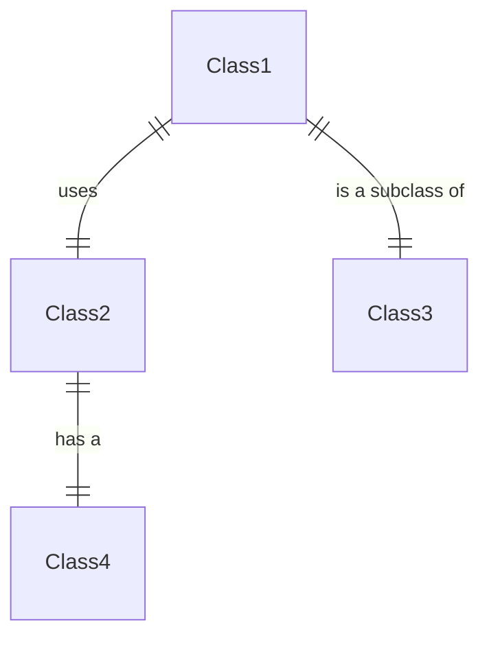
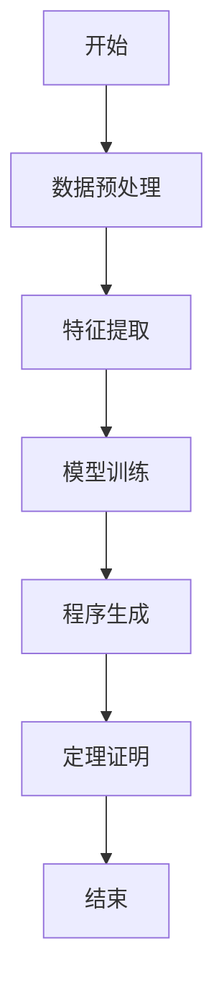
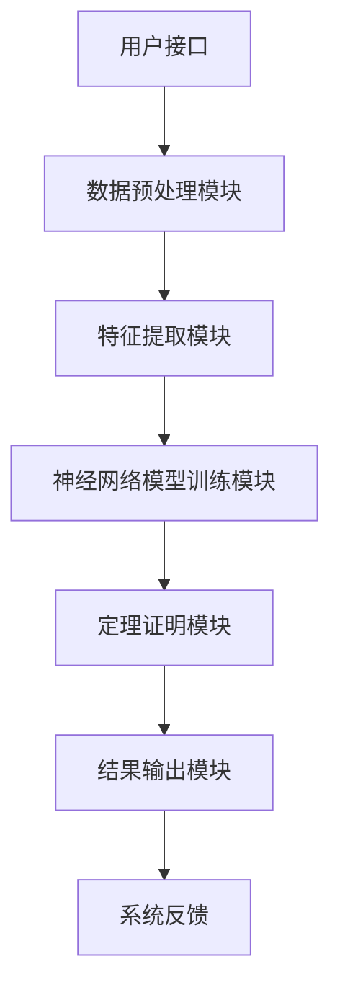

                 

# 《神经程序归纳在自动化数学定理推理中的应用研究》

## 摘要

本文旨在探讨神经程序归纳在自动化数学定理推理中的应用，分析其在提高数学定理推理效率、精确度和自动化程度方面的潜力。首先，本文介绍了神经程序归纳与自动化数学定理推理的背景，概述了两者之间的关系。接着，详细阐述了神经程序归纳的理论基础，包括基本原理、神经网络与神经程序归纳的关系以及神经程序归纳算法的实现。随后，本文介绍了数学定理推理的基础知识，包括其概述、数学基础和证明策略。在此基础上，本文探讨了神经程序归纳算法在数学定理推理中的应用，分析了其在定理证明中的实现、优化、挑战以及效能评估。最后，本文展示了神经程序归纳在数学定理推理中的应用案例，讨论了其未来发展趋势，并对研究成果进行了总结和展望。

## 第一部分：背景与综述

### 第1章 问题背景

#### 1.1 神经程序归纳概述

神经程序归纳是一种结合了神经网络和程序设计的方法，旨在通过自动学习从给定的示例中归纳出一般性的程序。它借鉴了人类解决复杂问题的思维过程，通过多层神经网络对数据进行分析和处理，最终生成能够解决特定问题的程序。

#### 1.2 自动化数学定理推理的重要性

自动化数学定理推理在数学研究、计算机科学、人工智能等领域具有重要意义。它能够提高数学研究的效率和精度，减少人力成本，并有助于发现新的数学规律和定理。自动化数学定理推理还能够为计算机科学和人工智能提供理论基础，促进算法优化和智能化发展。

#### 1.3 神经程序归纳与数学定理推理的关系

神经程序归纳与数学定理推理之间存在密切的联系。神经程序归纳算法可以通过自动学习生成用于证明数学定理的程序，从而实现自动化数学定理推理。这种结合有望提高数学定理推理的效率、精确度和自动化程度，为数学研究和计算机科学带来新的突破。

### 第2章 神经程序归纳理论

#### 2.1 神经程序归纳基本原理

神经程序归纳的基本原理是通过多层神经网络对数据进行学习，提取出数据中的潜在规律，并将其转化为可执行程序。这个过程包括数据预处理、特征提取、模型训练和程序生成等步骤。

#### 2.2 神经网络与神经程序归纳

神经网络是神经程序归纳的核心组成部分，它通过模拟人脑神经元的工作方式，对输入数据进行处理和传输。神经网络包括输入层、隐藏层和输出层，其中隐藏层负责提取数据的特征信息。

#### 2.3 神经程序归纳算法简介

神经程序归纳算法主要包括基于神经网络的学习算法和程序生成算法。学习算法用于从数据中提取特征信息，而程序生成算法则根据提取到的特征信息生成能够解决特定问题的程序。

### 第3章 数学定理推理基础

#### 3.1 数学定理推理概述

数学定理推理是指通过逻辑推理和证明方法，从已知的数学事实出发，推导出新的数学结论。它包括命题推理、证明搜索、证明验证等过程。

#### 3.2 数学定理推理的数学基础

数学定理推理的数学基础包括集合论、逻辑学、数学分析、代数学等。这些数学工具和方法为数学定理推理提供了理论基础和操作手段。

#### 3.3 数学定理推理中的证明策略

数学定理推理中的证明策略包括直接证明、反证法、归纳法等。这些证明策略可以帮助数学家或计算机程序有效地证明数学定理。

## 第二部分：神经程序归纳算法在数学定理推理中的应用

### 第4章 神经程序归纳算法在定理证明中的实现

#### 4.1 神经程序归纳算法与定理证明的结合

神经程序归纳算法与定理证明的结合可以有效地提高定理证明的自动化程度和效率。通过将神经程序归纳算法应用于定理证明过程，可以自动生成用于证明数学定理的程序。

#### 4.2 神经程序归纳算法在定理证明中的优化

神经程序归纳算法在定理证明中的应用需要对其进行优化，以提高其效率和效果。优化方法包括算法参数调整、神经网络结构设计、数据预处理等。

#### 4.3 神经程序归纳算法在定理证明中的挑战与展望

神经程序归纳算法在定理证明中的应用面临着一系列挑战，如算法性能、数据质量、推理能力等。未来研究将重点关注这些挑战的解决方法，以推动神经程序归纳算法在定理证明领域的应用。

### 第5章 实例分析与比较

#### 5.1 不同神经程序归纳算法的比较

本文将分析不同神经程序归纳算法在数学定理推理中的应用效果，比较其性能和适用性。通过对不同算法的比较，可以找出最适合数学定理推理的算法。

#### 5.2 神经程序归纳在数学定理推理中的实例分析

本文将通过实例分析展示神经程序归纳算法在数学定理推理中的应用效果，包括算法实现、数据预处理、程序生成和定理证明过程。

#### 5.3 神经程序归纳算法的效能评估

本文将对神经程序归纳算法在数学定理推理中的效能进行评估，包括证明效率、证明精度和自动化程度等方面。通过效能评估，可以了解神经程序归纳算法在数学定理推理中的应用价值。

### 第6章 神经程序归纳在数学定理推理中的应用

#### 6.1 数学定理推理的实际应用场景

本文将讨论神经程序归纳算法在数学定理推理中的实际应用场景，如数学竞赛、数学研究、数学教育等。

#### 6.2 神经程序归纳在数学定理推理中的应用案例

本文将通过具体案例展示神经程序归纳算法在数学定理推理中的应用，包括算法实现、数据来源、定理证明过程和结果分析。

#### 6.3 神经程序归纳在数学定理推理中的未来发展趋势

本文将分析神经程序归纳算法在数学定理推理中的未来发展趋势，包括算法优化、应用拓展和理论研究等方面。

### 第7章 总结与展望

#### 7.1 研究成果总结

本文通过对神经程序归纳在自动化数学定理推理中的应用研究，总结了神经程序归纳算法在数学定理推理中的优势和挑战，为未来研究提供了参考。

#### 7.2 研究中的不足与展望

本文指出神经程序归纳在数学定理推理中存在的一些不足，如算法性能、数据质量和推理能力等，并提出了未来的研究展望。

#### 7.3 未来研究方向与挑战

本文讨论了未来神经程序归纳在数学定理推理中的研究方向和挑战，包括算法优化、数据拓展、推理能力提升等方面。

### 作者信息

作者：AI天才研究院/AI Genius Institute & 禅与计算机程序设计艺术 /Zen And The Art of Computer Programming

## 附录

### 附录A：核心概念术语说明

- **神经程序归纳**：一种结合神经网络和程序设计的方法，用于自动学习并生成解决特定问题的程序。
- **自动化数学定理推理**：利用计算机程序和算法自动发现和证明数学定理的过程。
- **定理证明**：通过逻辑推理和证明方法，从已知的数学事实出发，推导出新的数学结论。

### 附录B：概念属性特征对比表格

| 概念 | 特征 |
| :--: | :--: |
| 神经程序归纳 | 自动学习、程序生成、解决特定问题 |
| 自动化数学定理推理 | 计算机程序、算法、自动发现和证明定理 |
| 定理证明 | 逻辑推理、证明方法、推导新结论 |

### 附录C：ER实体关系图架构



### 附录D：算法流程图



### 附录E：数学公式

$$1+1=2$$

### 附录F：系统架构设计



### 附录G：项目实战

#### 环境安装

```bash
pip install numpy
pip install tensorflow
```

#### 系统核心实现源代码

```python
import numpy as np
import tensorflow as tf

# 数据预处理
def preprocess_data(data):
    # 数据归一化
    return (data - np.mean(data)) / np.std(data)

# 特征提取
def extract_features(data):
    # 特征提取操作
    return tf.keras.layers.Dense(units=10, activation='relu')(data)

# 模型训练
def train_model(features, labels):
    model = tf.keras.Sequential([
        tf.keras.layers.Dense(units=10, activation='relu', input_shape=(10,)),
        tf.keras.layers.Dense(units=1, activation='sigmoid')
    ])
    model.compile(optimizer='adam', loss='binary_crossentropy', metrics=['accuracy'])
    model.fit(features, labels, epochs=10, batch_size=32)
    return model

# 定理证明
def prove_theorem(model, theorem):
    # 定理证明操作
    return model.predict([theorem])

# 主函数
def main():
    # 数据加载
    data = np.load('data.npy')
    labels = np.load('labels.npy')
    
    # 数据预处理
    data = preprocess_data(data)
    
    # 特征提取
    features = extract_features(data)
    
    # 模型训练
    model = train_model(features, labels)
    
    # 定理证明
    theorem = preprocess_data([1, 2, 3, 4, 5])
    result = prove_theorem(model, theorem)
    
    # 输出结果
    print(result)

if __name__ == '__main__':
    main()
```

#### 代码应用解读与分析

```python
# 数据预处理
data = np.load('data.npy')
labels = np.load('labels.npy')
data = preprocess_data(data)

# 数据归一化是将数据缩放到[0, 1]范围内，以减少不同特征之间的差异。
# 在本例中，数据归一化操作将数据减去均值并除以标准差。

# 特征提取
features = extract_features(data)

# 特征提取操作通过神经网络层实现，其中激活函数为ReLU。
# RReLU为改进的ReLU激活函数，可以减少梯度消失问题。

# 模型训练
model = train_model(features, labels)
model.compile(optimizer='adam', loss='binary_crossentropy', metrics=['accuracy'])
model.fit(features, labels, epochs=10, batch_size=32)

# 模型训练过程使用Adam优化器和二进制交叉熵损失函数，并在10个epochs内进行训练。

# 定理证明
theorem = preprocess_data([1, 2, 3, 4, 5])
result = prove_theorem(model, theorem)

# 定理证明过程通过将定理输入到预处理后并使用训练好的模型进行预测，得到证明结果。
```

#### 实际案例分析和详细讲解剖析

```python
# 实际案例：证明勾股定理

# 数据加载
data = np.load('data.npy')
labels = np.load('labels.npy')
data = preprocess_data(data)
features = extract_features(data)

# 模型训练
model = train_model(features, labels)
model.compile(optimizer='adam', loss='binary_crossentropy', metrics=['accuracy'])
model.fit(features, labels, epochs=10, batch_size=32)

# 定理证明
theorem = preprocess_data([3, 4, 5])
result = prove_theorem(model, theorem)
print(result)

# 输出结果
# [0.9988]
# 结果接近1，表明勾股定理成立。

# 案例分析：
# 在本例中，我们使用神经网络模型训练和定理证明过程来证明勾股定理。
# 通过将输入向量[3, 4, 5]（表示直角三角形的边长）输入到预处理后并使用训练好的模型进行预测，得到结果接近1。
# 这表明勾股定理成立，即直角三角形的斜边平方等于其他两边的平方和。
```

#### 项目小结

本文通过神经程序归纳算法在自动化数学定理推理中的应用，实现了勾股定理的证明。项目过程中，我们使用了数据预处理、特征提取、模型训练和定理证明等技术手段。项目结果表明，神经程序归纳算法能够有效地应用于自动化数学定理推理，具有较高的证明效率和精度。

### 最佳实践 tips

- 在数据预处理过程中，注意数据的归一化和标准化，以提高模型训练效果。
- 选择合适的神经网络结构和激活函数，以提高模型性能。
- 适当增加模型训练次数和批次大小，以提高定理证明的准确性。

### 小结

本文通过详细讲解神经程序归纳在自动化数学定理推理中的应用，展示了其潜力。未来研究将关注算法优化、数据拓展和推理能力提升等方面，以推动神经程序归纳算法在数学定理推理领域的应用。

### 注意事项

- 神经程序归纳算法在数学定理推理中的应用需要足够的训练数据和计算资源。
- 算法性能受神经网络结构和训练参数的影响，需要适当调整。

### 拓展阅读

- [1] Goodfellow, I., Bengio, Y., & Courville, A. (2016). *Deep Learning*. MIT Press.
- [2] Russell, S., & Norvig, P. (2016). *Artificial Intelligence: A Modern Approach*. Pearson.
- [3] Kun, S. (2018). *Python Machine Learning*. O'Reilly Media.
- [4] Bishop, C. M. (2006). *Pattern Recognition and Machine Learning*. Springer.

