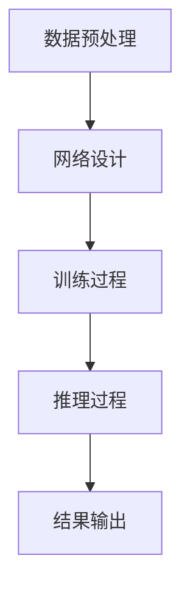

                 


### 引言与背景

#### 神经程序归纳概述

**问题背景**：

在当前的人工智能领域，自动化数学推理是一个重要的研究方向。传统的数学推理依赖于数学家们的经验和专业知识，但面对复杂的数学问题，这种方法往往效率低下，且难以发现隐藏在问题背后的深层次规律。为了提高数学推理的自动化程度，研究人员提出了神经程序归纳（Neural Program Induction）这一概念，试图通过人工智能技术，特别是神经网络，来实现对数学推理过程的自动化。

**问题描述**：

神经程序归纳的目标是开发一种算法，能够自动地从一组数学问题的实例中归纳出通用的推理步骤或公式，从而解决新的数学问题。这一目标的关键难点在于如何设计一种神经网络模型，能够有效地捕获数学推理过程中的结构性和模式性特征，并在未知问题上进行有效的推理。

**问题解决**：

神经程序归纳的基本原理是利用神经网络强大的特征学习能力，通过训练从大量的数学问题实例中学习到推理模式，然后利用这些模式来解决新的数学问题。这一过程主要包括以下几个步骤：

1. 数据预处理：对数学问题实例进行编码，将其转化为神经网络能够处理的数据形式。
2. 网络设计：设计一种能够捕获数学推理特征的网络结构，例如循环神经网络（RNN）或变压器（Transformer）。
3. 训练过程：使用大量的数学问题实例对网络进行训练，使网络能够学会从输入数据中提取特征，并生成推理步骤或公式。
4. 推理过程：将新的数学问题输入到训练好的神经网络中，网络根据已学习的模式生成推理步骤或公式，从而解决问题。

**边界与外延**：

神经程序归纳不仅可以在纯数学领域发挥作用，如证明发现、问题求解等，还可以应用于更广泛的领域，如计算机科学、物理学、经济学等。此外，与传统数学推理相比，神经程序归纳具有更强的灵活性和适应性，能够处理更加复杂和多变的问题。

**概念结构与核心要素**：

神经程序归纳的核心概念包括神经网络、程序归纳和数学推理。神经网络是算法的基础，负责从数据中学习特征；程序归纳则是一种从实例中归纳出通用规律的方法；数学推理则是算法的目标，即利用学习到的规律解决数学问题。

#### 神经程序归纳的核心概念

**神经网络基础**：

神经网络是一种模拟人脑神经元连接方式的计算模型，由大量的神经元（或节点）组成。每个神经元接收来自其他神经元的输入，并通过加权求和后传递给激活函数，最终产生输出。神经网络的基本模型包括输入层、隐藏层和输出层，其中隐藏层可以有一个或多个。

**程序归纳原理**：

程序归纳是一种从实例中学习通用程序的方法。在神经程序归纳中，程序归纳通过神经网络实现，即通过训练神经网络来学习从输入数据（数学问题实例）到输出（推理步骤或公式）的映射。程序归纳的优势在于其强大的泛化能力，能够处理新的、未见过的数学问题。

**概念属性特征对比**：

表1：神经网络与传统程序归纳方法对比

| 对比项          | 神经网络               | 传统程序归纳         |
|-----------------|-----------------------|----------------------|
| 学习能力        | 强，能够处理复杂模式   | 较弱，依赖于人工设计 |
| 灵活性          | 高，适用于多种问题    | 低，仅适用于特定问题 |
| 泛化能力        | 强，能够适应新问题    | 较弱，难以适应变化   |
| 需要的数据量    | 较大，需要大量训练数据 | 较小，需要少量数据   |

**ER实体关系图架构**：

为了更好地理解神经程序归纳的架构，我们可以使用ER（Entity-Relationship）实体关系图来表示。ER图包括实体、属性和关系三种元素。

- **实体**：在神经程序归纳中，实体可以是数学问题实例、推理步骤或公式。
- **属性**：属性描述了实体的特征，如数学问题实例的参数、特征等。
- **关系**：关系描述了实体之间的关联，如推理步骤与问题实例之间的对应关系。

下面是一个简化的ER图示例：

```
实体：数学问题实例，推理步骤，公式
属性：参数，特征，结果
关系：问题实例→推理步骤，推理步骤→公式
```

通过这个ER图，我们可以直观地看到神经程序归纳的基本架构和元素之间的关系。

#### 神经程序归纳算法原理

**算法概述**：

神经程序归纳算法的基本流程可以分为以下几个阶段：

1. 数据预处理：对数学问题实例进行编码，提取关键特征，并将其转化为神经网络能够处理的数据格式。
2. 网络设计：设计一个合适的神经网络结构，通常包括输入层、隐藏层和输出层，其中隐藏层可以使用循环神经网络（RNN）或变压器（Transformer）等。
3. 训练过程：使用大量数学问题实例对神经网络进行训练，使其能够学习到从输入数据到输出（推理步骤或公式）的映射关系。
4. 推理过程：将新的数学问题输入到训练好的神经网络中，网络根据已学习的模式生成推理步骤或公式，从而解决问题。

**算法mermaid流程图**：

下面是一个简化的mermaid流程图，展示了神经程序归纳算法的基本流程：



**算法原理讲解**：

**数学模型与公式**：

神经程序归纳的核心是神经网络模型。以循环神经网络（RNN）为例，其数学模型可以表示为：

\[ h_t = \sigma(W_h \cdot [h_{t-1}, x_t] + b_h) \]

其中，\( h_t \) 是第 \( t \) 个时间步的隐藏状态，\( x_t \) 是第 \( t \) 个时间步的输入，\( W_h \) 和 \( b_h \) 分别是权重和偏置，\( \sigma \) 是激活函数。

**Python源代码讲解**：

```python
import numpy as np
import tensorflow as tf

# 定义神经网络结构
model = tf.keras.Sequential([
    tf.keras.layers.LSTM(128, activation='tanh', input_shape=(None, 1)),
    tf.keras.layers.Dense(1)
])

# 编写训练过程
model.compile(optimizer='adam', loss='mean_squared_error')
model.fit(x_train, y_train, epochs=10, batch_size=32)

# 编写推理过程
def predict(x):
    return model.predict(np.array([x]))

# 示例
x_new = 5
result = predict(x_new)
print(f"The predicted result for {x_new} is {result[0][0]}")
```

**通俗易懂的举例说明**：

假设我们有一个简单的数学问题：求 \( x^2 \) 的值。如果我们用神经网络来解决这个问题，我们可以将其表示为输入 \( x \)，神经网络通过学习找到相应的输出 \( x^2 \)。例如，如果我们输入 \( x = 2 \)，神经网络可能会输出 \( 4 \)，这表示 \( 2^2 = 4 \)。

通过大量的训练，神经网络会逐渐学会从输入 \( x \) 中提取特征，并准确地输出 \( x^2 \) 的值。这样，当我们输入一个新的 \( x \) 值时，神经网络可以根据已学习的模式快速地计算出 \( x^2 \) 的值。

**小结**：

在这一部分，我们详细介绍了神经程序归纳的基本概念和算法原理。通过数据预处理、网络设计、训练过程和推理过程的步骤，神经网络能够自动地学习数学推理的模式，从而实现自动化数学推理。这种技术为解决复杂的数学问题提供了新的思路和方法，具有广泛的应用前景。在下一部分，我们将深入探讨神经程序归纳在数学推理中的实际应用，并分析其优势和挑战。

