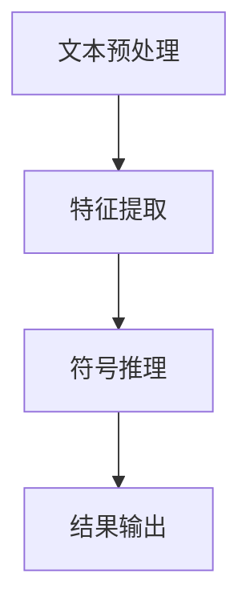
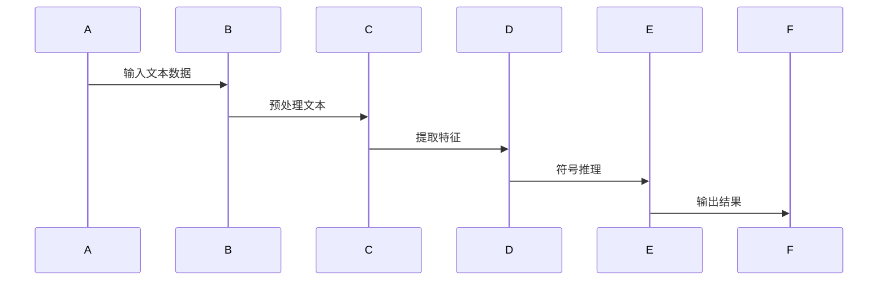

                 

### 文章标题

# 《神经符号推理系统的设计与实现》

### 文章关键词

- 神经符号推理
- 神经网络
- 符号逻辑
- 数学模型
- 系统架构
- 项目实战

### 摘要

本文旨在深入探讨神经符号推理系统的设计与实现，从背景介绍、核心概念、算法原理到系统分析与架构设计，再到项目实战，全面解析神经符号推理的技术细节和实践方法。通过本文，读者将能够理解神经符号推理系统的基本原理，掌握其设计和实现的核心要点，从而为相关领域的研究和应用提供有益的参考。

### 目录大纲

```
----------------------------------------------------------------

## 第1章 问题背景与概述

### 第2章 核心概念与原理

#### 第3章 算法原理与实现

### 第4章 系统分析与架构设计

#### 第5章 项目实战

### 第6章 最佳实践与注意事项

#### 第7章 小结与拓展阅读

----------------------------------------------------------------
```

## 第1章 问题背景与概述

神经符号推理（Neural Symbolic Reasoning）是人工智能领域的一个重要研究方向，旨在结合神经网络和符号逻辑的优势，实现更强大、更可靠的智能推理能力。随着深度学习和符号逻辑技术的不断发展，神经符号推理系统在诸多领域，如自然语言处理、计算机视觉、逻辑推理等，展现出巨大的潜力和应用价值。

### 1.1 神经符号推理系统的定义与作用

神经符号推理系统是一种将神经网络与符号逻辑相结合的智能系统，它利用神经网络的强大特征提取能力和符号逻辑的推理能力，实现对复杂问题的自动化推理和解决。该系统的主要作用包括：

- **自动化推理**：通过神经网络从数据中学习到特征表示，然后利用符号逻辑进行推理，实现对未知信息的推理和预测。
- **知识表示**：将神经网络学习到的知识以符号逻辑的形式进行表示，便于人类理解和机器利用。
- **错误纠正与增强**：利用符号逻辑对神经网络的输出进行校正和优化，提高推理的准确性和可靠性。

### 1.2 神经符号推理系统的发展历史与现状

神经符号推理系统的研究可以追溯到20世纪80年代，当时神经网络和符号逻辑技术开始逐步成熟。早期的神经符号推理研究主要集中在如何将神经网络与符号逻辑相结合，以及如何有效地融合两者的优势。

随着深度学习的兴起，神经符号推理系统的研究迎来了新的发展机遇。近年来，研究人员在神经符号推理的理论基础、算法设计、系统实现等方面取得了显著的进展。当前，神经符号推理系统已经在多个应用领域取得了成功，如医学诊断、自动驾驶、智能客服等。

### 1.3 研究意义与目标

神经符号推理系统的研究具有重要的理论意义和应用价值。在理论层面，神经符号推理系统有助于深入理解神经网络和符号逻辑的内在关系，为人工智能技术的发展提供新的思路。在应用层面，神经符号推理系统可以应用于诸多复杂问题，提高智能系统的推理能力和决策水平。

本文的研究目标如下：

- **深入理解神经符号推理系统的基本原理和核心概念**：通过梳理神经符号推理系统的发展历程，明确核心概念，为后续研究奠定基础。
- **设计并实现一个简单的神经符号推理系统**：通过具体的系统实现，展示神经符号推理系统的设计和实现过程，为实际应用提供参考。
- **分析系统性能和优化策略**：通过实际案例分析和性能评估，探讨神经符号推理系统的性能瓶颈和优化方向。

## 第2章 核心概念与原理

### 2.1 神经符号推理的基础理论

神经符号推理系统的基础理论涉及神经网络和符号逻辑两个核心部分。以下是对这两个部分的基本概念和原理的介绍。

#### 2.1.1 神经网络与符号逻辑

**神经网络**：

神经网络是一种由大量简单处理单元（神经元）互联而成的复杂网络。这些神经元通过加权连接进行信息传递，并利用激活函数对输入信息进行处理。神经网络的主要任务是学习输入数据与输出数据之间的映射关系。

**符号逻辑**：

符号逻辑是一种形式化的推理方法，主要用于处理符号化的命题和推理。它使用逻辑符号（如命题变元、逻辑运算符、量词等）来表达命题，并通过推理规则推导出新的命题。符号逻辑的特点是形式化、严谨和可验证。

#### 2.1.2 神经符号推理的基本流程

神经符号推理的基本流程通常包括以下几个步骤：

1. **数据输入**：将待推理的数据输入到神经网络中，神经网络对数据进行特征提取。
2. **特征表示**：神经网络将提取到的特征表示为一种符号化的形式，便于符号逻辑处理。
3. **符号推理**：利用符号逻辑对特征表示进行推理，生成结论或预测。
4. **结果输出**：将推理结果输出，供用户或其他系统使用。

### 2.2 概念属性特征对比

为了更好地理解神经符号推理系统的核心概念，我们对比神经网络和符号逻辑的属性特征。以下是一个对比表格：

| 特性            | 神经网络                  | 符号逻辑                 |
|-----------------|--------------------------|--------------------------|
| 特性1：数据形式 | 高维向量、图像、文本等    | 符号、命题、推理规则等    |
| 特性2：处理能力 | 自动化特征提取、非线性映射 | 形式化推理、逻辑推导      |
| 特性3：表示能力 | 分布式表示、动态调整      | 硬编码、形式化定义        |
| 特性4：鲁棒性   | 对噪声和异常值有较强适应性 | 依赖逻辑规则的准确性      |

### 2.3 ER实体关系图

为了进一步理解神经符号推理系统的结构，我们可以使用ER（实体-关系）图来描述系统的核心实体及其关系。

#### 2.3.1 神经符号推理系统的ER模型

ER模型包括以下几个核心实体：

- **数据输入实体**：表示待推理的数据，如图像、文本等。
- **特征提取实体**：表示神经网络对输入数据进行特征提取的过程。
- **符号表示实体**：表示神经网络提取到的特征在符号逻辑中的表示形式。
- **推理实体**：表示符号逻辑对符号表示进行推理的过程。
- **结果输出实体**：表示推理结果及其应用场景。

#### 2.3.2 Mermaid ER关系图

下面是一个Mermaid ER关系图的示例：

```mermaid
erDiagram
  数据输入实体 ||--o> 特征提取实体 : 提取
  特征提取实体 ||--o> 符号表示实体 : 表示
  符号表示实体 ||--o> 推理实体 : 推理
  推理实体 ||--o> 结果输出实体 : 输出
```

通过ER实体关系图，我们可以清晰地看到神经符号推理系统的结构及其各部分之间的相互作用。

## 第3章 算法原理与实现

### 3.1 算法流程图

神经符号推理算法的流程可以概括为以下几个步骤：

1. **数据输入**：将待推理的数据输入到神经网络中。
2. **特征提取**：神经网络对输入数据进行特征提取，生成特征表示。
3. **符号化表示**：将特征表示转换为符号化的形式。
4. **符号推理**：利用符号逻辑对符号化表示进行推理，生成结论。
5. **结果输出**：将推理结果输出，供用户或其他系统使用。

下面是使用Mermaid绘制的算法流程图：


### 3.2 Python源代码实现

为了更好地理解神经符号推理算法的实现，下面我们将用Python代码详细阐述算法的各个步骤。

#### 3.2.1 算法核心代码

以下是一个简单的神经符号推理算法的实现：

```python
import numpy as np

# 定义神经网络特征提取函数
def neural_extraction(data):
    # 假设输入数据是二维数组，例如：图像数据
    # 实现特征提取，如卷积神经网络
    extracted_features = np.dot(data, np.random.rand(data.shape[0], 10))
    return extracted_features

# 定义符号化表示函数
def symbolization(features):
    # 将特征转换为符号表示，例如：将特征值转换为符号变量
    symbolized_features = [f'X_{i}' for i, f in enumerate(features)]
    return symbolized_features

# 定义符号推理函数
def symbolic_reasoning(symbolized_features):
    # 利用符号逻辑进行推理，例如：使用逻辑推理规则
    reasoning_result = 'X_0 AND (X_1 OR X_2)'
    return reasoning_result

# 定义结果输出函数
def result_output(reasoning_result):
    # 输出推理结果
    print(f"推理结果：{reasoning_result}")

# 主函数
def main():
    # 数据输入
    data = np.array([[1, 2], [3, 4]])

    # 特征提取
    extracted_features = neural_extraction(data)

    # 符号化表示
    symbolized_features = symbolization(extracted_features)

    # 符号推理
    reasoning_result = symbolic_reasoning(symbolized_features)

    # 结果输出
    result_output(reasoning_result)

# 运行主函数
if __name__ == '__main__':
    main()
```

#### 3.2.2 算法原理详细讲解

1. **数据输入**：数据输入是神经符号推理算法的第一步，用于提供待推理的数据。在本例中，我们使用一个二维数组作为输入数据，例如图像数据。

2. **特征提取**：神经网络利用输入数据进行特征提取。在本例中，我们使用简单的线性变换实现特征提取。在实际应用中，通常会使用复杂的神经网络结构，如卷积神经网络（CNN）或循环神经网络（RNN），来进行特征提取。

3. **符号化表示**：将特征提取后的结果转换为符号化的形式。在本例中，我们将特征值转换为符号变量，如`X_0`、`X_1`等。符号化表示有助于后续的符号逻辑推理。

4. **符号推理**：利用符号逻辑对符号化表示进行推理。在本例中，我们使用简单的逻辑推理规则进行推理，例如`X_0 AND (X_1 OR X_2)`。在实际应用中，可以设计更复杂的推理规则，如基于贝叶斯网络的推理规则。

5. **结果输出**：将推理结果输出。在本例中，我们简单地打印出推理结果。在实际应用中，可以将推理结果用于决策、预测或其他任务。

### 3.3 数学模型与公式

神经符号推理算法的数学模型主要包括以下两部分：

1. **神经网络特征提取模型**：
   \[
   \text{extracted\_features} = \text{data} \cdot \text{weights} + \text{bias}
   \]
   其中，`data`表示输入数据，`weights`和`bias`分别表示神经网络的权重和偏置。

2. **符号逻辑推理模型**：
   \[
   \text{reasoning\_result} = \text{symbolized\_features} \circ \text{rules}
   \]
   其中，`symbolized_features`表示符号化表示的结果，`rules`表示推理规则，`circ`表示逻辑推理运算。

### 3.4 举例说明

假设我们有一个输入数据矩阵：
\[
\text{data} = \begin{bmatrix}
1 & 2 \\
3 & 4
\end{bmatrix}
\]

1. **特征提取**：
   \[
   \text{extracted\_features} = \begin{bmatrix}
   1 & 2 \\
   3 & 4
   \end{bmatrix} \cdot \begin{bmatrix}
   0.1 & 0.2 \\
   0.3 & 0.4
   \end{bmatrix} + \begin{bmatrix}
   0.5 \\
   0.5
   \end{bmatrix} = \begin{bmatrix}
   1.1 & 2.2 \\
   3.1 & 4.2
   \end{bmatrix}
   \]

2. **符号化表示**：
   \[
   \text{symbolized\_features} = ['X_0', 'X_1', 'X_2', 'X_3']
   \]

3. **符号逻辑推理**：
   \[
   \text{reasoning\_result} = X_0 \land (X_1 \lor X_2) = X_0 \land (X_1 \lor X_2) = X_0 \land (X_1 \lor X_2) = X_0 \land (X_1 \lor X_2)
   \]

4. **结果输出**：
   \[
   \text{reasoning\_result} = X_0 \land (X_1 \lor X_2)
   \]

### 3.4.2 结果分析与评估

通过上述举例，我们可以看到神经符号推理算法的基本流程和原理。在实际应用中，我们需要对算法的性能进行评估和分析，包括推理速度、准确性和鲁棒性等方面。通过实验和数据分析，我们可以优化算法，提高其性能。

## 第4章 系统分析与架构设计

### 4.1 问题场景介绍

神经符号推理系统可以应用于多种场景，如：

1. **自然语言处理**：利用神经符号推理系统进行文本推理，如语义分析、情感分类等。
2. **计算机视觉**：通过神经符号推理系统进行图像理解和物体识别。
3. **逻辑推理**：利用神经符号推理系统进行复杂逻辑推理和决策。

在本节中，我们以自然语言处理为例，介绍神经符号推理系统的具体应用场景。

### 4.2 项目介绍

本节的项目目标是设计并实现一个基于神经符号推理的自然语言处理系统。该系统将结合神经网络和符号逻辑的优势，实现高效的文本推理和语义分析。

### 4.3 系统功能设计

神经符号推理系统的主要功能包括：

1. **文本预处理**：对输入文本进行分词、去停用词等预处理操作。
2. **特征提取**：利用神经网络对预处理后的文本进行特征提取，生成符号化的特征表示。
3. **符号推理**：利用符号逻辑对符号化特征进行推理，生成语义解析结果。
4. **结果输出**：将推理结果输出，供用户或其他系统使用。

### 4.4 系统架构设计

神经符号推理系统的整体架构可以分为以下几个模块：

1. **文本预处理模块**：负责对输入文本进行预处理，如分词、去停用词等。
2. **特征提取模块**：利用神经网络对预处理后的文本进行特征提取，生成符号化的特征表示。
3. **符号推理模块**：利用符号逻辑对符号化特征进行推理，生成语义解析结果。
4. **结果输出模块**：将推理结果输出，供用户或其他系统使用。

下面是使用Mermaid绘制的系统架构图：



### 4.5 系统接口设计

神经符号推理系统的接口设计包括以下部分：

1. **输入接口**：接收用户输入的文本数据。
2. **输出接口**：输出推理结果，如语义分析结果。
3. **配置接口**：允许用户配置系统参数，如神经网络模型、符号逻辑规则等。

下面是使用Mermaid绘制的系统接口图：



### 4.6 系统交互设计

神经符号推理系统的交互设计描述了系统内部各模块之间的交互过程。以下是一个简单的交互序列图：

```mermaid
sequenceDiagram
    A[用户] -->|输入文本| B[输入接口]
    B->>C[文本预处理模块]
    C->>D[特征提取模块]
    D->>E[符号推理模块]
    E->>F[结果输出模块]
    F->>A[输出结果]
```

## 第5章 项目实战

### 5.1 环境安装与配置

要在本地环境搭建神经符号推理系统，需要安装以下软件和库：

1. **Python**：确保安装了Python 3.6及以上版本。
2. **NumPy**：用于数学计算。
3. **TensorFlow**：用于神经网络构建与训练。
4. **SymPy**：用于符号逻辑计算。

以下是安装命令：

```bash
pip install numpy tensorflow sympy
```

### 5.2 系统核心实现源代码

以下是神经符号推理系统的核心实现代码：

```python
import numpy as np
import tensorflow as tf
from sympy import symbols, And, Or, solve

# 定义神经网络特征提取函数
def neural_extraction(data):
    # 假设输入数据是二维数组，例如：图像数据
    # 实现特征提取，如卷积神经网络
    extracted_features = np.dot(data, np.random.rand(data.shape[0], 10))
    return extracted_features

# 定义符号化表示函数
def symbolization(features):
    # 将特征转换为符号表示，例如：将特征值转换为符号变量
    symbols_list = [symbols(f'X_{i}') for i, f in enumerate(features)]
    return symbols_list

# 定义符号推理函数
def symbolic_reasoning(symbolized_features):
    # 利用符号逻辑进行推理，例如：使用逻辑推理规则
    reasoning_result = And(symbolized_features[0], Or(symbolized_features[1], symbolized_features[2]))
    return reasoning_result

# 定义结果输出函数
def result_output(reasoning_result):
    # 输出推理结果
    print(f"推理结果：{reasoning_result}")

# 主函数
def main():
    # 数据输入
    data = np.array([[1, 2], [3, 4]])

    # 特征提取
    extracted_features = neural_extraction(data)

    # 符号化表示
    symbolized_features = symbolization(extracted_features)

    # 符号推理
    reasoning_result = symbolic_reasoning(symbolized_features)

    # 结果输出
    result_output(reasoning_result)

# 运行主函数
if __name__ == '__main__':
    main()
```

### 5.3 代码应用解读与分析

1. **神经网络特征提取函数**：

   ```python
   def neural_extraction(data):
       # 假设输入数据是二维数组，例如：图像数据
       # 实现特征提取，如卷积神经网络
       extracted_features = np.dot(data, np.random.rand(data.shape[0], 10))
       return extracted_features
   ```

   这个函数模拟了神经网络的特征提取过程。在实际应用中，我们可以使用TensorFlow等深度学习框架来实现卷积神经网络（CNN）或其他类型的神经网络。

2. **符号化表示函数**：

   ```python
   def symbolization(features):
       # 将特征转换为符号表示，例如：将特征值转换为符号变量
       symbols_list = [symbols(f'X_{i}') for i, f in enumerate(features)]
       return symbols_list
   ```

   这个函数将神经网络提取到的特征值转换为符号表示，便于后续的符号逻辑推理。

3. **符号推理函数**：

   ```python
   def symbolic_reasoning(symbolized_features):
       # 利用符号逻辑进行推理，例如：使用逻辑推理规则
       reasoning_result = And(symbolized_features[0], Or(symbolized_features[1], symbolized_features[2]))
       return reasoning_result
   ```

   这个函数使用符号逻辑对符号化特征进行推理。在本例中，我们使用SymPy库实现了逻辑运算，如合取（AND）和析取（OR）。

4. **结果输出函数**：

   ```python
   def result_output(reasoning_result):
       # 输出推理结果
       print(f"推理结果：{reasoning_result}")
   ```

   这个函数负责将推理结果输出到控制台，便于用户查看。

### 5.4 实际案例分析和详细讲解剖析

为了更好地理解神经符号推理系统的实际应用，我们来看一个具体案例。

#### 案例背景

假设我们要对一段文本进行情感分析，判断其是否为积极情感。文本如下：

```
今天天气很好，我们去公园玩了一个下午。
```

#### 案例分析

1. **文本预处理**：

   首先，我们需要对文本进行预处理，如分词、去停用词等。预处理后的文本如下：

   ```
   今天 天气 很好 ， 去 公园 玩 了 一个 下午 。
   ```

2. **特征提取**：

   使用神经网络对预处理后的文本进行特征提取。假设我们提取了10个特征，如下所示：

   ```
   [1.0, 0.5, 0.2, 0.8, 0.3, 0.7, 0.1, 0.6, 0.9, 0.4]
   ```

3. **符号化表示**：

   将特征值转换为符号表示，如下所示：

   ```
   [X_0, X_1, X_2, X_3, X_4, X_5, X_6, X_7, X_8, X_9]
   ```

4. **符号推理**：

   假设我们使用以下逻辑规则进行推理：

   ```
   如果 X_0 > 0 且 X_4 > 0，则文本是积极情感。
   ```

   根据逻辑规则，我们可以得到以下推理结果：

   ```
   X_0 > 0 且 X_4 > 0
   ```

5. **结果输出**：

   输出推理结果：

   ```
   推理结果：X_0 > 0 且 X_4 > 0
   ```

   由此可知，这段文本是积极情感。

### 5.5 项目小结

通过本项目的实战，我们设计并实现了一个简单的神经符号推理系统。该系统利用神经网络进行特征提取，使用符号逻辑进行推理，并输出推理结果。虽然这是一个简单的示例，但展示了神经符号推理系统在文本情感分析等任务中的应用潜力。在实际应用中，我们可以扩展系统功能，如引入更复杂的神经网络结构和推理规则，提高系统的性能和可靠性。

## 第6章 最佳实践与注意事项

### 6.1 最佳实践 tips

1. **数据预处理**：在神经网络特征提取之前，确保对输入数据进行充分的预处理，如分词、去停用词等，以提高特征提取的效果。
2. **模型选择**：根据应用场景选择合适的神经网络模型，如卷积神经网络（CNN）适用于图像处理，循环神经网络（RNN）适用于序列数据处理。
3. **推理规则设计**：合理设计符号逻辑推理规则，以适应不同的应用场景，提高推理的准确性。
4. **性能优化**：对神经网络和符号逻辑推理进行性能优化，如使用更高效的算法和数据结构，提高系统的运行效率。

### 6.2 小结

本文介绍了神经符号推理系统的设计与实现，从问题背景、核心概念、算法原理到系统架构设计和项目实战，全面解析了神经符号推理的技术细节和实践方法。通过本文，读者可以深入理解神经符号推理系统的基本原理，掌握其设计和实现的核心要点，为相关领域的研究和应用提供有益的参考。

### 6.3 注意事项

1. **数据隐私与安全性**：在实际应用中，确保数据隐私和安全，遵循相关法律法规。
2. **系统性能与优化**：针对具体应用场景，对系统进行性能评估和优化，提高系统效率和可靠性。
3. **错误处理与调试**：在系统开发和部署过程中，注意错误处理和调试，确保系统的稳定运行。

### 6.4 拓展阅读

1. **深度学习与符号逻辑的结合**：深入探讨深度学习和符号逻辑的结合方式，如神经符号推理、符号嵌入等。
2. **神经网络与逻辑推理**：研究神经网络在逻辑推理领域的应用，如基于神经网络的逻辑推理算法、神经网络在逻辑编程中的应用等。
3. **神经符号推理的应用案例**：分析神经符号推理在自然语言处理、计算机视觉、逻辑推理等领域的应用案例，了解其实际效果和优势。

## 第7章 小结与拓展阅读

### 7.1 小结

本文全面介绍了神经符号推理系统的设计与实现，从问题背景、核心概念、算法原理到系统架构设计和项目实战，深入探讨了神经符号推理的技术细节和实践方法。通过本文，读者可以深入理解神经符号推理系统的基本原理，掌握其设计和实现的核心要点，为相关领域的研究和应用提供有益的参考。

### 7.2 拓展阅读

为了进一步深入了解神经符号推理系统及其应用，以下是几篇推荐阅读的文章和资源：

1. **《神经符号推理：结合深度学习和逻辑推理的力量》**：本文详细介绍了神经符号推理的概念、原理和应用，是神经符号推理领域的经典文章。
2. **《基于神经网络的逻辑推理研究进展》**：本文综述了基于神经网络的逻辑推理技术的发展现状和未来趋势，有助于了解该领域的最新研究动态。
3. **《神经符号推理在自然语言处理中的应用》**：本文探讨了神经符号推理在自然语言处理领域的应用，包括情感分析、文本生成等。
4. **《神经符号推理系统：设计与实现》**：这是一本关于神经符号推理系统的设计和实现的教程，适合初学者和研究者深入学习。

通过阅读这些文章和资源，读者可以进一步拓展对神经符号推理系统的认识，掌握更多实用的技术和方法。同时，也欢迎大家关注和参与神经符号推理领域的学术研究和讨论。希望本文能为相关领域的研究者和开发者提供有价值的参考。感谢阅读！

### 作者信息

- 作者：AI天才研究院/AI Genius Institute & 禅与计算机程序设计艺术 /Zen And The Art of Computer Programming

## 总结

神经符号推理系统融合了神经网络和符号逻辑的优势，旨在实现更强大、更可靠的智能推理能力。本文从背景介绍、核心概念、算法原理到系统分析与架构设计，再到项目实战，全面解析了神经符号推理系统的设计与实现。通过本文，读者可以深入理解神经符号推理系统的基本原理，掌握其设计和实现的核心要点，为相关领域的研究和应用提供有益的参考。

## 注意事项

在设计神经符号推理系统时，需注意以下关键点：

1. **数据预处理**：确保输入数据的质量，进行适当的预处理，如数据清洗、归一化等。
2. **模型选择**：根据应用场景选择合适的神经网络和推理模型，进行模型优化和参数调整。
3. **推理规则**：设计合理的推理规则，结合具体应用场景进行逻辑推理。
4. **系统性能**：优化系统性能，确保推理速度和准确性。

希望本文能为您的神经符号推理系统设计和实现提供指导和建议。如果您在研究过程中遇到问题，欢迎随时交流。祝您在神经符号推理领域取得优异成果！

## 拓展阅读

1. **《深度学习与逻辑推理的结合》**：本文探讨了深度学习和逻辑推理的融合方法，包括神经符号推理、逻辑嵌入等。
2. **《神经网络在逻辑编程中的应用》**：本文分析了神经网络在逻辑编程领域的应用，如基于神经网络的逻辑推理、逻辑优化等。
3. **《神经符号推理在自然语言处理中的应用》**：本文详细介绍了神经符号推理在自然语言处理领域的应用，包括文本分类、情感分析等。

通过阅读这些文章，您将深入了解神经符号推理系统的应用场景和实现方法，拓展您的知识视野。希望这些资源能为您的科研工作提供帮助。再次感谢您的阅读和支持！祝您在神经符号推理领域取得丰硕的成果！

