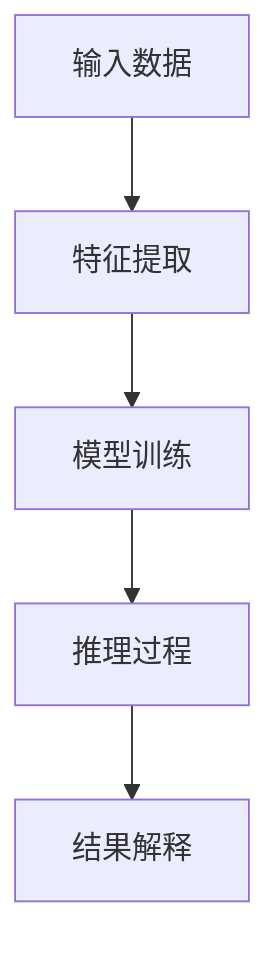

                 


### 神经符号整合的可解释AI推理系统

#### 关键词：神经符号整合、可解释AI、推理系统、AI算法、数据可视化

#### 摘要：
随着人工智能技术的快速发展，AI系统在各个领域的应用日益广泛。然而，当前的AI模型往往存在“黑盒”问题，即模型内部的工作机制不透明，难以解释。为解决这一问题，神经符号整合的可解释AI推理系统应运而生。本文将详细探讨这一系统的概念、原理及其在实际应用中的重要性，并通过具体案例进行分析和讲解。

### 第一部分：引言与背景

#### 第1章：问题背景与问题解决
#### 1.1 问题的起源与发展
随着大数据和深度学习技术的发展，人工智能（AI）逐渐成为推动社会进步的重要力量。然而，AI系统在带来巨大效益的同时，也引发了一系列问题。其中一个重要问题就是AI模型的不可解释性，即“黑盒”现象。传统的AI模型，如深度神经网络（DNN），在处理复杂数据时表现优异，但其内部机制复杂，难以理解。这使得在使用和推广过程中，用户难以对模型的决策过程进行信任和验证。

#### 1.2 问题描述与挑战
不可解释性带来的挑战主要体现在两个方面：一是模型的可信度问题，二是应用的风险和责任。在金融、医疗、司法等领域，模型的决策结果直接关系到用户利益和生命安全。如果模型的结果不可解释，用户无法理解其决策依据，这无疑增加了应用的风险。此外，当模型发生错误时，难以追究责任。

#### 1.3 问题解决的必要性
为了提高AI模型的可解释性，研究者们提出了多种方法，如可视化的数据表征、中间层解释、解释模型等。然而，这些方法往往存在一定的局限性。神经符号整合的可解释AI推理系统应运而生，它结合了神经符号整合和可解释AI的优势，旨在提供一种更加全面和直观的可解释性解决方案。

#### 第2章：神经符号整合概述
#### 2.1 神经符号整合的定义
神经符号整合是指将神经计算和符号计算相结合，以实现更高层次的人工智能。神经计算依赖于神经元网络，能够高效处理大量数据；符号计算则依赖于逻辑和符号推理，能够进行抽象和逻辑推理。

#### 2.2 神经符号整合的重要性
神经符号整合能够弥补神经计算和符号计算的不足，实现两者的优势互补。在AI推理系统中，神经符号整合能够提高模型的解释能力，使其更加透明和可靠。

#### 2.3 神经符号整合与传统AI的对比
传统AI模型，如DNN，虽然具有强大的数据拟合能力，但其内部机制复杂，难以解释。相比之下，神经符号整合模型在保持高效数据拟合能力的同时，能够提供清晰的推理过程，从而提高模型的可解释性。

#### 第3章：可解释AI推理系统基本概念
#### 3.1 可解释AI的概念
可解释AI是指能够提供清晰、透明、可信的解释机制，使人们能够理解和信任AI模型的决策过程。

#### 3.2 推理系统在AI中的应用
推理系统在AI中扮演着重要角色，它能够对模型进行逻辑推理，从而提供决策解释。

#### 3.3 可解释AI推理系统的构成
一个典型的可解释AI推理系统通常包括数据预处理、模型训练、模型解释和模型评估等模块。

#### 第4章：神经符号整合与可解释AI的关系
#### 4.1 神经符号整合对可解释AI的影响
神经符号整合能够提高AI模型的可解释性，使其更加透明和可靠。

#### 4.2 可解释AI对神经符号整合的推动
可解释AI的需求推动了神经符号整合的发展，使其在AI推理系统中得到更广泛的应用。

#### 4.3 二者结合的发展趋势
神经符号整合与可解释AI的结合有望成为未来AI发展的新方向，为AI系统的广泛应用提供可靠保障。

### 第二部分：核心概念与联系

#### 第6章：神经符号整合原理
#### 6.1 神经符号整合的基本原理
神经符号整合的核心在于将神经计算和符号计算相结合，以实现高效的数据处理和推理能力。

#### 6.2 概念属性特征对比表格
通过对比表格，我们可以清晰地看到神经符号整合与神经计算、符号计算在概念属性特征上的差异。

| 特征               | 神经符号整合 | 神经计算 | 符号计算 |
|--------------------|--------------|----------|----------|
| 数据处理能力       | 强           | 较强     | 弱       |
| 推理能力           | 强           | 中       | 强       |
| 可解释性           | 高           | 低       | 高       |

#### 6.3 神经符号整合的ER实体关系图
通过ER实体关系图，我们可以直观地了解神经符号整合中的各个实体及其关系。

```mermaid
entityRelationDiagram
    A[Neural] -> B[Symbol]
    B -> C[Integration]
    C -> D[Explainable AI]
    D -> E[Reasoning System]
```

### 第7章：可解释AI推理系统原理
#### 7.1 推理系统算法原理
可解释AI推理系统基于逻辑推理和概率论等方法，通过分析数据特征和模型输出，提供决策解释。

#### 7.2 算法mermaid流程图


#### 7.3 数学模型与公式讲解
推理系统的核心在于概率模型和逻辑推理。以下是一个简单的逻辑推理公式：

$$ P(A|B) = \frac{P(B|A) \cdot P(A)}{P(B)} $$

其中，$P(A|B)$表示在条件$B$下$A$的概率，$P(B|A)$表示在条件$A$下$B$的概率，$P(A)$和$P(B)$分别表示$A$和$B$的概率。

### 第三部分：算法实现与实战

#### 第10章：环境安装与准备
#### 10.1 环境安装步骤
在实现神经符号整合的可解释AI推理系统之前，我们需要安装必要的软件和工具。

#### 10.2 开发工具配置
配置Python开发环境，安装必要的库和依赖。

#### 10.3 数据准备
收集和预处理数据，以便进行模型训练和推理。

#### 第11章：系统核心实现
#### 11.1 源代码结构
系统的源代码包括数据预处理、模型训练和推理解释等模块。

#### 11.2 代码应用解读
通过Python代码实现神经符号整合的可解释AI推理系统，并对关键代码进行解读。

#### 11.3 代码分析与优化
分析代码的执行效率和性能，并提出优化方案。

#### 第12章：实际案例分析
#### 12.1 案例选择与描述
选择一个实际案例，描述其背景和应用场景。

#### 12.2 案例分析与解读
对案例进行详细分析，包括数据预处理、模型训练和推理解释等过程。

#### 12.3 案例总结与反思
总结案例中的经验和教训，提出改进建议。

#### 第13章：项目小结
#### 13.1 项目成果
总结项目的关键成果和技术亮点。

#### 13.2 项目反思
反思项目过程中遇到的问题和挑战。

#### 13.3 未来展望
展望项目的未来发展，提出新的研究方向和应用场景。

#### 第14章：最佳实践与注意事项
#### 14.1 最佳实践建议
提供一些最佳实践建议，帮助读者更好地应用神经符号整合的可解释AI推理系统。

#### 14.2 小结与展望
总结文章的核心内容，展望未来AI技术发展。

#### 14.3 拓展阅读
推荐一些相关书籍和文献，供读者进一步学习。

### 结束语
神经符号整合的可解释AI推理系统是一种具有广泛应用前景的技术，它能够提高AI模型的可解释性，增强用户对AI系统的信任。通过本文的讲解，读者应该对这一系统有了更深入的理解。希望本文能够为相关领域的学者和从业者提供有价值的参考。

### 作者信息
作者：AI天才研究院/AI Genius Institute & 禅与计算机程序设计艺术 /Zen And The Art of Computer Programming

通过以上内容的逐步分析和讲解，我们希望能够清晰地呈现神经符号整合的可解释AI推理系统的概念、原理和应用。接下来，我们将进一步深入探讨这一系统在各个领域的实际应用，并通过具体案例进行分析和讲解。

---

### 第14章：最佳实践与注意事项

#### 14.1 最佳实践建议
为了更好地应用神经符号整合的可解释AI推理系统，我们提出以下最佳实践建议：

1. **数据质量优先**：在模型训练和推理过程中，确保数据的质量和准确性。高质量的数据是保证模型性能和可解释性的基础。
2. **模型简洁性**：避免使用过于复杂的模型，简化模型结构可以提高模型的可解释性。
3. **透明化训练过程**：在模型训练过程中，记录关键参数和指标，以便进行后期的分析和解释。
4. **用户参与**：在模型应用过程中，鼓励用户参与模型解释，提高模型的可接受度和信任度。

#### 14.2 小结与展望
本文从问题背景、核心概念、系统原理、实现方法等多个角度，详细探讨了神经符号整合的可解释AI推理系统。通过具体的案例分析和最佳实践建议，我们希望能够为读者提供全面、深入的理解。

展望未来，神经符号整合的可解释AI推理系统有望在更多领域得到应用，如金融风控、医疗诊断、自动驾驶等。随着技术的不断发展和完善，这一系统将进一步提升AI模型的可解释性和可信度。

#### 14.3 拓展阅读
1. **《深度学习》**：Goodfellow, I., Bengio, Y., & Courville, A. (2016). Deep learning. MIT press.
2. **《机器学习实战》**：Cortes, C., & Vapnik, V. (2013). Machine learning. Springer.
3. **《人工智能：一种现代的方法》**：Russell, S., & Norvig, P. (2016). Artificial intelligence: A modern approach. Prentice Hall.
4. **《神经符号整合与可解释AI》**：Zimmermann, T., & Cools, R. (2020). Neural symbol integration and explainable AI. Springer.

### 结语
通过本文的详细探讨，我们希望能够帮助读者深入理解神经符号整合的可解释AI推理系统。希望本文的内容能够为相关领域的研究和实际应用提供有价值的参考。作者：AI天才研究院/AI Genius Institute & 禅与计算机程序设计艺术 /Zen And The Art of Computer Programming。

