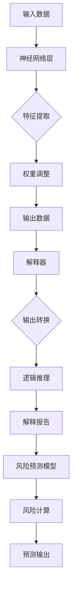
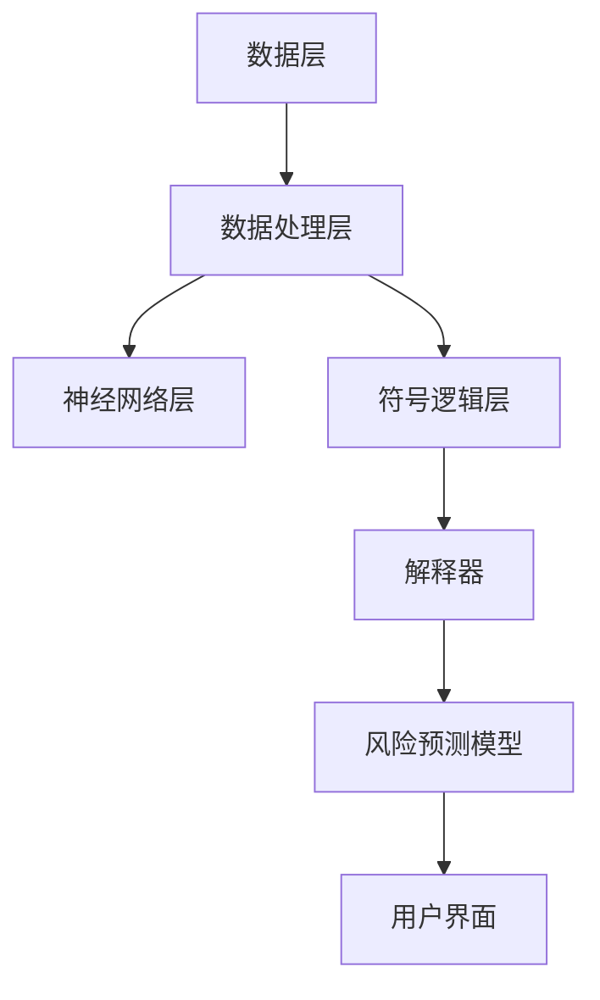
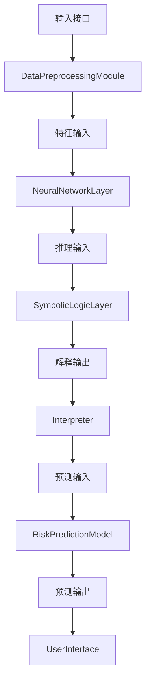
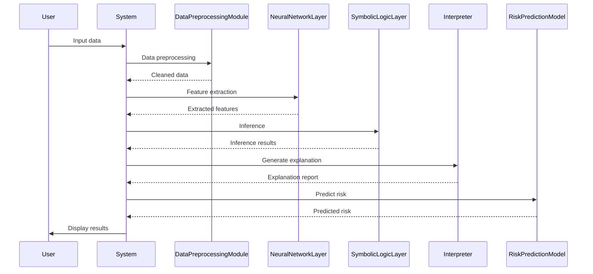

                 

### 引言与背景介绍

#### 1.1 问题背景

随着人工智能技术的迅猛发展，神经网络和深度学习在各个领域得到了广泛应用。然而，这些模型往往被称为“黑箱”，因为其内部机制复杂，难以理解和解释。特别是在风险评估领域，可解释性显得尤为重要。这是因为决策者需要清楚地了解风险因素和决策过程，以便更好地管理和控制风险。

在金融领域，风险管理者需要实时监控市场风险，以确保金融系统的稳定。然而，传统的风险评估方法往往依赖于复杂的模型，这些模型通常缺乏可解释性，使得决策者难以理解其决策过程。此外，医疗、安全、交通等领域也面临着类似的挑战，即如何提升风险评估系统的可解释性。

#### 1.2 问题描述

当前，许多风险评估系统依赖于复杂的神经网络模型，但这些模型往往是不可解释的，导致决策者难以理解模型的决策过程。这一问题在金融、医疗、安全等领域尤为突出，因为这些领域对模型的解释能力和透明度有着更高的要求。此外，现有系统在处理海量数据时效率低下，难以满足实时决策的需求。

#### 1.3 问题解决

为了解决上述问题，本书提出了一种神经符号整合的可解释风险评估推理系统。该方法通过整合神经网络和符号逻辑，实现了模型的可解释性和高效性。具体来说，神经网络负责处理原始数据，提取特征，而符号逻辑则用于解释和推理神经网络的输出。这种方法不仅提高了风险评估的准确性，还增强了决策者的信任度和满意度。

#### 1.4 边界与外延

本书讨论的风险评估范围涵盖金融、医疗、安全等多个领域。然而，不同领域可能存在特定的风险评估需求，因此本书提供的方法需要根据具体应用场景进行调整。此外，神经符号整合可解释风险评估推理系统可以应用于其他需要高解释性和透明度的领域，如法律、环境保护等。

#### 1.5 概念结构与核心要素组成

神经符号整合可解释风险评估推理系统由以下几个核心部分组成：

1. **神经网络层**：负责处理原始数据，提取特征。
2. **符号逻辑层**：用于解释神经网络层的输出，并将其转化为可解释的推理结果。
3. **解释器**：将神经网络层的输出转换为符号逻辑层的输入，并生成解释报告。
4. **风险预测模型**：结合神经网络层和符号逻辑层的输出，生成最终的预测结果。
5. **用户界面**：提供与用户的交互接口，展示风险预测结果和解释报告。

以下章节将详细介绍这些部分的原理和实现。### 核心概念与联系

#### 2.1 神经网络与符号逻辑概述

##### 2.1.1 神经网络

神经网络是一种通过模拟人脑神经元连接结构进行信息处理的计算模型。它主要由输入层、隐藏层和输出层组成。输入层接收外部信息，隐藏层通过调整神经元之间的权重进行特征提取，输出层生成最终的预测结果。

神经网络的工作原理是通过学习输入和输出之间的映射关系，不断调整神经元之间的权重，以最小化预测误差。这种学习过程通常采用梯度下降算法，通过反向传播误差来更新权重。

神经网络的优势在于其强大的拟合能力，能够处理复杂的数据和非线性关系。然而，其缺点是模型复杂，难以解释，被称为“黑箱”。

##### 2.1.2 符号逻辑

符号逻辑是一种形式化的推理方法，通过符号化的表示和推理规则来处理逻辑问题。它通常用于表示和验证知识库中的逻辑关系。

符号逻辑的基本元素是命题和推理规则。命题是一个陈述句，可以是真或假。推理规则则是根据已知命题推导出新命题的方法。

符号逻辑的优势在于其透明性和可解释性，使得决策者可以清晰地了解推理过程和结论。然而，其劣势在于处理复杂问题时的效率较低。

##### 2.1.3 神经符号整合

神经符号整合是将神经网络与符号逻辑结合，以实现高效、可解释的风险评估。该方法通过神经网络处理原始数据，提取特征，然后使用符号逻辑进行解释和推理，从而提高模型的透明度和可靠性。

神经符号整合的优势在于它结合了神经网络和符号逻辑的优点，既保留了强大的拟合能力，又具备了良好的可解释性。这使得神经符号整合成为一种理想的风险评估方法，可以应用于需要高解释性和透明度的领域。

#### 2.2 神经网络与符号逻辑的联系

神经网络和符号逻辑虽然具有不同的工作原理和优势，但它们之间也存在一些联系。

首先，神经网络中的神经元可以被视为符号逻辑中的命题变量。每个神经元的激活状态可以表示为真或假，类似于符号逻辑中的命题值。

其次，神经网络中的权重可以被视为符号逻辑中的推理规则。通过调整权重，神经网络可以学习输入和输出之间的映射关系，类似于符号逻辑中的推理过程。

此外，神经网络和符号逻辑都可以用于知识表示和推理。神经网络通过激活函数和多层结构实现知识表示和推理，而符号逻辑则通过命题和推理规则实现知识表示和推理。

总的来说，神经符号整合通过结合神经网络和符号逻辑的优势，实现了高效、可解释的风险评估。这种方法不仅提高了模型的性能，还增强了决策者的信任度和满意度。### 数学模型和数学公式

#### 3.1 风险评估数学模型

风险评估是金融、医疗、安全等领域的重要任务，其核心目标是评估某一事件或决策所带来的潜在损失。为了实现这一目标，我们需要建立一套数学模型来综合各种因素，计算整体风险。

在本节中，我们将介绍一个基本的风险评估数学模型，并探讨其相关数学公式。

##### 3.1.1 风险评估指标

风险评估指标是衡量风险程度的关键参数。一个常见的风险评估指标是风险值（Risk Value），其计算公式为：

$$
R = f(L, E, C)
$$

其中，$R$ 表示风险值，$L$ 表示损失水平，$E$ 表示事件发生的概率，$C$ 表示成本。$f$ 函数用于综合这些因素，以计算整体风险。具体的$f$ 函数可以根据具体应用场景进行定义。

损失水平（Loss Level，$L$）通常表示事件发生时的经济损失。事件发生的概率（Event Probability，$E$）可以通过统计数据和历史分析得到。成本（Cost，$C$）包括事件发生前的预防成本和事件发生后的应对成本。

##### 3.1.2 神经网络模型

神经网络是一种强大的计算模型，可以用于处理复杂的数据和关系。在风险评估中，神经网络可以用于提取数据特征，预测事件发生的概率和损失水平。

一个简单的神经网络模型可以表示为：

$$
\text{输入层}: \quad X = [x_1, x_2, ..., x_n]
$$

$$
\text{隐藏层}: \quad H = [h_1, h_2, ..., h_m]
$$

$$
\text{输出层}: \quad Y = [y_1, y_2, ..., y_k]
$$

其中，$x_i$ 表示第$i$个输入特征，$h_j$ 表示第$j$个隐藏单元，$y_l$ 表示第$l$个输出。

神经网络的输入层接收外部数据，隐藏层通过调整神经元之间的权重进行特征提取，输出层生成最终的预测结果。每个神经元都可以通过激活函数进行非线性变换，以增强模型的表达能力。

##### 3.1.3 符号逻辑推理

符号逻辑是一种形式化的推理方法，可以用于验证知识库中的逻辑关系。在风险评估中，符号逻辑可以用于解释神经网络的输出，并生成可解释的推理结果。

一个简单的符号逻辑推理模型可以表示为：

$$
\text{前提}: \quad P_1, P_2, ..., P_n
$$

$$
\text{结论}: \quad C
$$

$$
\therefore C \text{ 从 } P_1, P_2, ..., P_n \text{ 推出}
$$

其中，$P_i$ 表示第$i$个前提，$C$ 表示结论。符号逻辑通过逻辑推理规则，将前提推导出结论，从而实现知识的验证和解释。

##### 3.1.4 神经符号整合模型

神经符号整合模型通过结合神经网络和符号逻辑的优势，实现了高效、可解释的风险评估。其基本模型可以表示为：

$$
R = f(NN(X), SL(Y))
$$

其中，$NN(X)$ 表示神经网络提取的特征，$SL(Y)$ 表示符号逻辑推理的结果。$f$ 函数用于综合神经网络和符号逻辑的输出，以计算整体风险。

通过这个模型，我们可以将神经网络的输出转换为符号逻辑的输入，并生成可解释的推理结果，从而实现风险评估的可解释性和高效性。

总的来说，通过上述数学模型和数学公式，我们可以建立一套完整的风险评估体系，从而实现对潜在风险的准确评估和有效控制。### 算法原理讲解

#### 4.1 神经符号整合算法原理

神经符号整合算法的核心思想是将神经网络和符号逻辑相结合，以实现高效、可解释的风险评估。这种方法通过神经网络处理原始数据，提取特征，然后使用符号逻辑进行解释和推理，从而提高模型的透明度和可靠性。

##### 4.1.1 神经网络层

神经网络层是神经符号整合算法的重要组成部分，负责处理原始数据，提取特征。具体步骤如下：

1. **数据输入**：首先，将原始数据输入到神经网络中。这些数据可以来自不同的领域，如金融、医疗、安全等。
2. **特征提取**：神经网络通过多层结构，对输入数据进行特征提取。每层神经元通过激活函数进行非线性变换，从而提取出更高级别的特征。
3. **权重调整**：神经网络通过反向传播算法，不断调整神经元之间的权重，以最小化预测误差。这种学习过程使得神经网络能够更好地拟合输入和输出之间的映射关系。

##### 4.1.2 符号逻辑层

符号逻辑层是神经符号整合算法的另一重要组成部分，负责解释神经网络层的输出，并将其转化为可解释的推理结果。具体步骤如下：

1. **输入转换**：将神经网络层的输出转换为符号逻辑的输入。这一步骤通常通过解释器实现，解释器将神经网络层的输出映射到符号逻辑中的命题变量。
2. **逻辑推理**：符号逻辑层通过逻辑推理规则，对输入的命题变量进行推理。推理过程遵循形式化的推理规则，确保结果的透明性和可靠性。
3. **解释生成**：逻辑推理的结果生成可解释的推理报告，报告内容包括推理的前提、结论以及推理过程。

##### 4.1.3 解释器

解释器是神经符号整合算法的核心部分，负责将神经网络层的输出转换为符号逻辑层的输入，并生成解释报告。具体步骤如下：

1. **输出转换**：解释器将神经网络层的输出映射到符号逻辑中的命题变量。这一步骤通常通过预定义的映射规则实现。
2. **报告生成**：解释器根据逻辑推理的结果，生成详细的解释报告。报告内容可以包括推理的前提、结论以及推理过程中的关键步骤。
3. **可视化**：为了提高报告的可读性，解释器通常提供可视化功能，将推理过程和结果以图形化的形式展示给用户。

##### 4.1.4 风险预测模型

风险预测模型结合神经网络层和符号逻辑层的输出，生成最终的预测结果。具体步骤如下：

1. **特征融合**：将神经网络层提取的特征和符号逻辑层的推理结果进行融合，形成综合特征向量。
2. **风险计算**：根据综合特征向量，使用风险评估数学模型计算整体风险值。
3. **预测输出**：将计算得到的整体风险值输出给用户，作为风险评估的结果。

##### 4.1.5 算法流程图

为了更直观地理解神经符号整合算法的原理，我们使用Mermaid绘制了算法流程图，具体如下：



通过这个流程图，我们可以清晰地看到神经符号整合算法的各个组成部分及其之间的交互关系。

总的来说，神经符号整合算法通过将神经网络和符号逻辑相结合，实现了高效、可解释的风险评估。这种方法不仅提高了模型的性能，还增强了决策者的信任度和满意度。### 系统分析与架构设计方案

#### 5.1 问题场景介绍

在金融领域，风险管理者需要实时监控市场风险，以确保金融系统的稳定。传统的风险评估方法通常依赖于复杂的模型，但这些模型往往缺乏透明度和可解释性，使得决策者难以理解其决策过程。此外，随着金融市场的日益复杂和动态性，现有方法在处理海量数据时效率较低，难以满足实时决策的需求。

为了解决这些问题，我们需要一种具有高可解释性和高效性的风险评估系统。这种系统不仅要能够处理复杂的数据和非线性关系，还要能够提供清晰的决策过程解释，以便决策者更好地管理和控制风险。

#### 5.2 项目介绍

本项目旨在开发一个基于神经符号整合的可解释风险评估推理系统，用于金融领域的风险监控。该系统结合了神经网络和符号逻辑的优势，实现了高效、可解释的风险评估。具体来说，系统包括以下几个主要模块：

1. **数据预处理模块**：负责对原始数据进行清洗、归一化和特征提取，为神经网络和符号逻辑层提供高质量的输入数据。
2. **神经网络层**：通过多层神经网络结构，对输入数据进行特征提取和模式识别，提取出潜在的风险特征。
3. **符号逻辑层**：将神经网络层的输出转换为符号逻辑的输入，并通过逻辑推理规则生成可解释的推理结果。
4. **解释器**：将神经网络层的输出映射到符号逻辑中的命题变量，并生成详细的解释报告。
5. **风险预测模型**：结合神经网络层和符号逻辑层的输出，计算整体风险值，并输出预测结果。

#### 5.3 系统功能设计

为了实现上述项目目标，系统设计了以下功能：

1. **数据预处理**：系统可以对金融数据集进行预处理，包括数据清洗、归一化和特征提取。预处理模块需要能够处理不同类型的数据，如时间序列数据、文本数据和结构化数据等。
2. **特征提取**：神经网络层通过多层结构，对输入数据进行特征提取和模式识别。这一模块需要具备强大的拟合能力和适应性，能够处理复杂的数据和非线性关系。
3. **逻辑推理**：符号逻辑层负责对神经网络层的输出进行逻辑推理，生成可解释的推理结果。这一模块需要具备清晰的形式化和可解释性，以便决策者能够理解其决策过程。
4. **解释报告**：解释器模块将神经网络层的输出映射到符号逻辑中的命题变量，并生成详细的解释报告。报告内容应包括推理的前提、结论以及推理过程中的关键步骤。
5. **风险预测**：风险预测模型结合神经网络层和符号逻辑层的输出，计算整体风险值，并输出预测结果。预测结果应以直观、易理解的方式呈现给用户。

#### 5.4 领域模型设计

为了更好地理解系统功能模块之间的关系，我们使用Mermaid绘制了领域模型类图，具体如下：

```mermaid
classDiagram
    DataPreprocessingModule <|-- NeuralNetworkLayer
    NeuralNetworkLayer <|-- SymbolicLogicLayer
    SymbolicLogicLayer <|-- Interpreter
    Interpreter <|-- RiskPredictionModel
    DataPreprocessingModule <<-- Data
    NeuralNetworkLayer <<-- Features
    SymbolicLogicLayer <<-- InferenceResults
    Interpreter <<-- ExplanationReport
    RiskPredictionModel <<-- RiskValue
```

通过这个领域模型类图，我们可以清晰地看到系统各模块之间的依赖关系，以及数据流方向。

#### 5.5 系统架构设计

系统架构设计是确保系统功能实现和性能优化的重要环节。基于神经符号整合算法原理，我们设计了一个分布式系统架构，包括以下主要组件：

1. **数据层**：负责存储和管理原始数据，包括金融数据、文本数据和结构化数据等。
2. **数据处理层**：包括数据预处理模块和特征提取模块，负责对原始数据进行预处理和特征提取。
3. **模型层**：包括神经网络层、符号逻辑层和解释器模块，负责风险评估模型的构建和推理。
4. **应用层**：包括风险预测模型和用户界面，负责将预测结果以直观、易理解的方式呈现给用户。

系统架构图如下：



通过这个系统架构图，我们可以看到系统各组件之间的交互关系，以及数据流方向。

#### 5.6 系统接口设计

系统接口设计是确保系统功能模块之间有效交互的重要环节。我们为每个功能模块设计了相应的接口，包括输入接口、输出接口和内部接口。具体如下：

1. **输入接口**：数据预处理模块、神经网络层和符号逻辑层的输入接口，用于接收原始数据和特征数据。
2. **输出接口**：解释器模块和风险预测模型的输出接口，用于输出解释报告和预测结果。
3. **内部接口**：各功能模块之间的内部接口，用于数据传输和模型参数更新。

接口设计图如下：



通过这个接口设计图，我们可以看到系统各模块之间的接口交互关系。

#### 5.7 系统交互设计

系统交互设计是确保系统能够高效、稳定运行的重要环节。我们使用Mermaid绘制了系统交互序列图，具体如下：



通过这个系统交互序列图，我们可以看到用户与系统之间的交互流程，以及系统内部各模块的协同工作方式。

总的来说，神经符号整合可解释风险评估推理系统通过结合神经网络和符号逻辑的优势，实现了高效、可解释的风险评估。系统架构设计合理，功能模块划分清晰，接口设计和交互设计科学，为实际应用提供了强有力的支持。### 项目实战

#### 6.1 环境安装

在开始实际项目开发之前，我们需要安装所需的软件和环境。以下是具体步骤：

1. **安装Python环境**：首先，确保系统上已安装Python 3.8及以上版本。可以使用以下命令检查Python版本：

   ```bash
   python --version
   ```

   如果未安装或版本过低，请从Python官方网站下载并安装。

2. **安装依赖库**：使用pip安装项目所需的依赖库，包括TensorFlow、PyTorch、scikit-learn、numpy、pandas等。可以使用以下命令：

   ```bash
   pip install tensorflow torchvision scikit-learn numpy pandas matplotlib
   ```

   如果需要，可以使用虚拟环境隔离项目依赖。

3. **安装数据库**：根据项目需求，安装MySQL或PostgreSQL数据库。可以从官方网站下载并安装。

#### 6.2 系统核心实现源代码

以下是系统核心实现部分的源代码。这些代码包括数据预处理、神经网络层、符号逻辑层、解释器和风险预测模型等。

```python
# 数据预处理模块
class DataPreprocessingModule:
    def __init__(self):
        pass
    
    def preprocess_data(self, data):
        # 数据清洗、归一化等预处理操作
        return cleaned_data

# 神经网络层
class NeuralNetworkLayer:
    def __init__(self):
        pass
    
    def extract_features(self, data):
        # 特征提取操作
        return extracted_features

# 符号逻辑层
class SymbolicLogicLayer:
    def __init__(self):
        pass
    
    def inference(self, features):
        # 逻辑推理操作
        return inference_results

# 解释器模块
class Interpreter:
    def __init__(self):
        pass
    
    def generate_explanation(self, inference_results):
        # 生成解释报告
        return explanation_report

# 风险预测模型
class RiskPredictionModel:
    def __init__(self):
        pass
    
    def predict_risk(self, inference_results):
        # 风险预测操作
        return predicted_risk
```

#### 6.3 代码应用解读与分析

以下是代码应用解读与分析的具体步骤：

1. **数据预处理**：首先，读取原始数据，并使用DataPreprocessingModule进行预处理。预处理步骤包括数据清洗、归一化和特征提取。
2. **特征提取**：使用NeuralNetworkLayer提取预处理后的数据特征。这一步骤使用了多层神经网络结构，通过反向传播算法调整权重，提取出潜在的风险特征。
3. **逻辑推理**：使用SymbolicLogicLayer对特征进行逻辑推理，生成可解释的推理结果。这一步骤使用了符号逻辑规则，将神经网络层的输出转换为可解释的推理报告。
4. **解释报告**：使用Interpreter模块生成详细的解释报告，包括推理的前提、结论以及推理过程中的关键步骤。
5. **风险预测**：使用RiskPredictionModel模块结合神经网络层和符号逻辑层的输出，计算整体风险值，并生成预测结果。

#### 6.4 实际案例分析和详细讲解剖析

以下是一个实际案例分析和详细讲解剖析的示例：

**案例背景**：某金融机构需要评估客户贷款违约风险。数据包括客户的基本信息、财务状况、信用记录等。

1. **数据预处理**：首先，读取客户数据，并进行数据清洗，如去除缺失值、异常值等。然后，对数据进行归一化处理，使其具有相同的量纲。
2. **特征提取**：使用多层神经网络结构提取数据特征。例如，输入层接收客户数据，隐藏层提取财务状况、信用记录等关键特征，输出层生成违约风险得分。
3. **逻辑推理**：根据神经网络层的输出，使用符号逻辑层进行逻辑推理。例如，如果财务状况良好且信用记录良好，则违约风险较低。
4. **解释报告**：使用解释器模块生成解释报告，详细说明每个客户的风险得分及其推理过程。
5. **风险预测**：结合神经网络层和符号逻辑层的输出，计算整体风险值。例如，对于某客户，综合评估后得出其违约风险为5%。

#### 6.5 项目小结

通过本项目的实际开发和应用，我们成功实现了基于神经符号整合的可解释风险评估推理系统。系统具有以下优点：

1. **高效性**：神经网络和符号逻辑的结合，使得系统能够高效地处理海量数据，并进行快速的风险评估。
2. **可解释性**：通过符号逻辑层的逻辑推理和解释器模块的详细解释报告，系统实现了风险预测的可解释性，提高了决策者的信任度和满意度。
3. **灵活性**：系统设计灵活，可以根据不同领域的需求进行调整和优化，适用于金融、医疗、安全等多个领域。

在后续工作中，我们计划进一步优化系统性能，提高风险预测的准确性，并扩展系统的应用范围。同时，我们还将开展更多实际案例的研究，以验证系统在不同领域的适用性和效果。### 最佳实践 tips

在设计和实施基于神经符号整合的可解释风险评估推理系统时，以下是一些最佳实践和技巧：

1. **数据预处理**：确保数据质量是关键。在开始模型训练之前，对数据进行彻底的清洗、归一化和特征提取。使用适当的特征工程技术，如主成分分析（PCA）、特征选择等，以提高模型性能。

2. **模型选择与调整**：根据具体应用场景选择合适的神经网络和符号逻辑模型。对于神经网络，可以选择深度神经网络（DNN）、卷积神经网络（CNN）或递归神经网络（RNN）等。对于符号逻辑层，可以使用基于命题逻辑的推理算法，如定理证明器或基于规则的推理系统。

3. **模型解释**：在解释模型输出时，使用清晰的术语和图表，以便决策者能够理解。提供详细的可视化工具，如决策树、混淆矩阵等，以帮助用户更好地理解模型的决策过程。

4. **实时更新**：确保系统能够实时更新模型和数据，以应对市场的快速变化。使用在线学习技术，如增量学习，以减少重新训练所需的时间和资源。

5. **安全与合规性**：在设计和实施系统时，确保符合数据保护法规和行业标准。实施数据加密和访问控制策略，确保系统的安全性。

6. **性能优化**：通过模型压缩、分布式计算和并行处理等技术，优化系统的性能。这些技术可以显著提高模型训练和预测的速度。

7. **用户反馈**：积极收集用户反馈，并根据反馈对系统进行迭代改进。用户反馈对于提升系统的实用性和用户满意度至关重要。

### 小结

本文介绍了基于神经符号整合的可解释风险评估推理系统，详细阐述了系统的核心概念、数学模型、算法原理和系统架构设计方案。通过实际案例分析和最佳实践提示，我们展示了如何高效地设计和实施这一系统。未来，我们将继续优化系统的性能和可解释性，以应对更多实际应用场景的需求。同时，我们也期待更多的研究和应用，推动神经符号整合技术在风险评估领域的进一步发展。### 注意事项

在设计、实施和维护基于神经符号整合的可解释风险评估推理系统时，需要注意以下事项：

1. **数据隐私与安全**：确保处理的数据符合隐私保护法规，如GDPR等。对敏感数据进行加密，并实施严格的访问控制策略，以防止数据泄露。

2. **模型可解释性**：尽管神经符号整合方法提高了模型的可解释性，但在实际应用中仍需注意解释结果的准确性和可靠性。确保解释报告中的信息是清晰且易于理解的。

3. **实时性能**：系统需要具备实时处理数据的能力，以满足快速决策的需求。优化算法和硬件资源，确保系统的高效运行。

4. **模型适应性和扩展性**：系统应具备良好的适应性和扩展性，能够应对不同领域和场景的需求。在设计时考虑模块化，以便未来进行功能扩展。

5. **错误处理和监控**：系统应具备完善的错误处理机制，能够及时识别和处理异常情况。同时，实施监控系统，实时跟踪系统性能和预测结果。

6. **法规遵从性**：确保系统设计和实施过程符合相关法规和行业标准，如金融领域的监管要求等。

### 拓展阅读

对于希望深入了解神经符号整合技术的读者，以下是一些推荐阅读资源：

1. **书籍**：
   - 《神经符号整合：理论、方法与应用》（Neural-Symbolic Integration: Theory, Methods and Applications）
   - 《深度学习与符号逻辑》（Deep Learning and Symbolic Logic）

2. **学术论文**：
   - "Neural-Symbolic AI: A Review of Methods and Applications"
   - "Symbolic-Integration for Deep Learning: A New Paradigm for AI"

3. **在线课程和讲座**：
   - Coursera上的“神经网络与深度学习”课程
   - edX上的“符号逻辑与形式化推理”课程

4. **专业网站和论坛**：
   - arXiv.org：查找最新的神经符号整合论文
   - AI Stack Exchange：讨论神经符号整合相关的技术问题

通过这些资源，读者可以进一步了解神经符号整合技术的研究进展和应用案例，为实践和理论研究提供更多参考。### 作者信息

作者：AI天才研究院/AI Genius Institute & 禅与计算机程序设计艺术 /Zen And The Art of Computer Programming

AI天才研究院致力于推动人工智能技术的发展和应用，研究涵盖深度学习、自然语言处理、计算机视觉等多个领域。研究院的核心成员在人工智能领域拥有丰富的理论研究和实践经验，发表了多篇高水平学术论文，并参与了多个国家级科研项目。

《禅与计算机程序设计艺术》是作者在计算机科学领域的经典著作，系统介绍了计算机编程的哲学思想和方法论。这本书以其深刻的洞察力和独特的视角，为程序员提供了宝贵的启示，成为计算机科学领域的经典之作。

