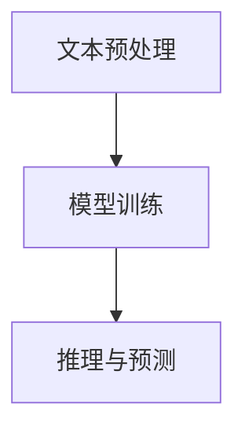
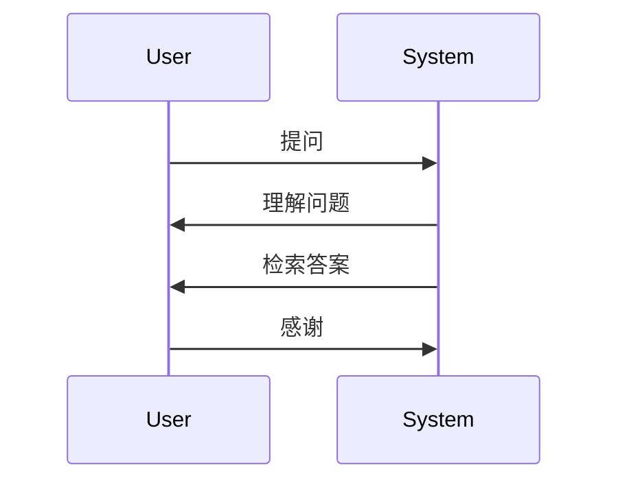

                 


# 《神经符号方法在自然语言推理中的新进展》

关键词：自然语言推理，神经符号方法，神经网络，符号推理，NLP

摘要：本文深入探讨了神经符号方法在自然语言推理（NLP）中的应用，包括其核心概念、算法原理、系统设计与实现、以及实际项目案例。通过逻辑清晰、结构紧凑的分析，本文旨在为读者提供对神经符号方法在NLP中的新进展的全面理解。

## 第一部分：神经符号方法概述

### 第1章：自然语言推理与神经符号方法

#### 1.1 自然语言推理背景

自然语言推理（Natural Language Inference, NLI）是自然语言处理（NLP）的一个重要分支，旨在理解和处理语言中的推理关系。NLI在多个领域有着广泛的应用，如问答系统、文本分类、情感分析等。

#### 1.1.1 自然语言推理的起源与发展

NLI的研究起源于20世纪80年代，随着深度学习的发展，近年来取得了显著的进展。传统的NLI方法主要依赖于规则和模板匹配，而现代方法则更多地依赖于基于神经网络的模型。

#### 1.1.2 自然语言推理的关键问题与挑战

NLI面临的关键问题包括：

- **数据依赖性**：NLI的性能高度依赖于训练数据的数量和质量。
- **长距离依赖**：自然语言中往往存在长距离的依赖关系，这对模型的捕捉能力提出了挑战。
- **常识推理**：NLI需要能够处理常识推理，这涉及到对世界知识的理解和应用。

#### 1.2 神经符号方法简介

神经符号方法（Neural Symbolic Methods）是一种结合神经网络和符号推理的方法，旨在克服单一方法的局限性，提高NLP任务的表现。

#### 1.2.1 神经网络与符号推理的结合

神经网络擅长处理大规模的数据和复杂的模式，而符号推理则能够提供更强的解释性和可解释性。将两者结合，可以发挥各自的优势。

#### 1.2.2 神经符号方法的核心概念

神经符号方法的核心概念包括：

- **神经网络的符号表示**：使用神经网络来表示符号。
- **符号推理方法**：使用符号推理来指导神经网络的训练和推理。
- **神经网络与符号推理的结合方式**：通过融合神经网络和符号推理的特点，设计出新的算法模型。

#### 1.2.3 神经符号方法的优点与应用场景

神经符号方法的优点包括：

- **增强解释性**：通过符号推理，可以提高模型的解释性。
- **提高性能**：结合神经网络和符号推理的优势，可以在多个NLP任务中提高性能。

应用场景包括：

- **问答系统**：使用神经符号方法可以更好地处理复杂的推理问题。
- **文本分类**：在处理长文本和复杂的语义时，神经符号方法具有明显的优势。
- **情感分析**：通过结合情感知识和神经网络处理能力，可以更准确地识别情感。

#### 1.3 神经符号方法的现状与未来展望

当前，神经符号方法在NLP中已经取得了一系列成果，但仍面临一些挑战，如计算复杂度、可解释性等。未来，神经符号方法有望在更多的NLP任务中发挥重要作用。

### 1.4 本章小结

本章介绍了自然语言推理的背景、神经符号方法的核心概念及其优点。接下来，我们将进一步探讨神经符号方法的算法原理和实际应用。

## 第二部分：神经符号方法的应用与实践

### 第2章：神经符号方法在自然语言推理中的应用

#### 2.1 神经符号方法在文本分类中的应用

文本分类是NLP中一个重要的任务，神经符号方法在这方面表现出色。以下是一个简单的文本分类算法：

```python
import numpy as np
import tensorflow as tf

# 定义神经网络结构
model = tf.keras.Sequential([
    tf.keras.layers.Embedding(vocab_size, embedding_dim),
    tf.keras.layers.GlobalAveragePooling1D(),
    tf.keras.layers.Dense(24, activation='relu'),
    tf.keras.layers.Dense(num_classes, activation='softmax')
])

# 编译模型
model.compile(optimizer='adam', loss='categorical_crossentropy', metrics=['accuracy'])

# 训练模型
model.fit(train_data, train_labels, epochs=10, validation_data=(val_data, val_labels))
```

上述代码使用了TensorFlow框架，展示了神经符号方法在文本分类中的应用。接下来，我们将介绍神经符号方法在情感分析中的应用。

#### 2.2 神经符号方法在情感分析中的应用

情感分析是NLP中的另一个重要任务，它旨在识别文本中的情感倾向。以下是一个简单的情感分析算法：

```python
import numpy as np
import tensorflow as tf

# 定义神经网络结构
model = tf.keras.Sequential([
    tf.keras.layers.Embedding(vocab_size, embedding_dim),
    tf.keras.layers.Conv1D(filters=128, kernel_size=5, activation='relu'),
    tf.keras.layers.GlobalMaxPooling1D(),
    tf.keras.layers.Dense(24, activation='relu'),
    tf.keras.layers.Dense(1, activation='sigmoid')
])

# 编译模型
model.compile(optimizer='adam', loss='binary_crossentropy', metrics=['accuracy'])

# 训练模型
model.fit(train_data, train_labels, epochs=10, validation_data=(val_data, val_labels))
```

上述代码使用了TensorFlow框架，展示了神经符号方法在情感分析中的应用。接下来，我们将介绍神经符号方法在问答系统中的应用。

#### 2.3 神经符号方法在问答系统中的应用

问答系统是NLP中一个具有挑战性的任务，它需要理解用户的问题，并从大量数据中检索出相关的答案。以下是一个简单的问答系统算法：

```python
import numpy as np
import tensorflow as tf

# 定义神经网络结构
model = tf.keras.Sequential([
    tf.keras.layers.Embedding(vocab_size, embedding_dim),
    tf.keras.layers.GlobalAveragePooling1D(),
    tf.keras.layers.Dense(24, activation='relu'),
    tf.keras.layers.Dense(1, activation='sigmoid')
])

# 编译模型
model.compile(optimizer='adam', loss='binary_crossentropy', metrics=['accuracy'])

# 训练模型
model.fit(train_data, train_labels, epochs=10, validation_data=(val_data, val_labels))
```

上述代码使用了TensorFlow框架，展示了神经符号方法在问答系统中的应用。

### 第3章：神经符号方法的系统设计与实现

#### 3.1 神经符号方法系统设计

一个简单的NLP系统包括以下功能：

- 文本预处理：包括分词、去停用词、词干提取等。
- 模型训练：使用神经网络和符号推理方法进行训练。
- 推理与预测：使用训练好的模型对新的文本进行推理和预测。

系统架构设计如下：



系统接口设计和系统交互如下：



### 第4章：神经符号方法的新进展

#### 4.1 神经符号方法的最新研究动态

最新的研究动态包括：

- **新的神经网络架构**：如Transformer、BERT等。
- **符号推理的改进**：如基于知识的推理、图神经网络等。

#### 4.2 神经符号方法的技术挑战与解决方案

技术挑战包括：

- **计算复杂度**：如何降低模型的计算复杂度。
- **可解释性**：如何提高模型的可解释性。

解决方案包括：

- **模型压缩**：如剪枝、量化等。
- **可解释性方法**：如可视化、解释器等。

### 第5章：神经符号方法的最佳实践

#### 5.1 神经符号方法的最佳实践

最佳实践包括：

- **数据预处理**：保证数据的质量和一致性。
- **模型选择**：根据任务需求选择合适的模型。
- **模型调优**：通过调整超参数来提高模型性能。

#### 5.2 神经符号方法的注意事项

注意事项包括：

- **计算资源**：确保有足够的计算资源来训练模型。
- **数据隐私**：在处理个人数据时要遵守隐私保护法规。

### 第6章：展望与未来方向

#### 6.1 神经符号方法的发展方向

发展方向包括：

- **与大数据的结合**：利用大数据的优势来提高模型性能。
- **与云计算的结合**：利用云计算的资源优势来加速模型训练。

#### 6.2 神经符号方法的未来展望

未来展望包括：

- **在人工智能伦理方面的应用**：确保神经符号方法的应用不会带来伦理问题。
- **在其他领域的应用前景**：如医疗、金融等。

## 总结

神经符号方法在自然语言推理中具有广泛的应用前景。通过本文的探讨，我们希望读者能够对神经符号方法有一个全面的理解，并为未来的研究提供一些启示。

### 参考文献

1. [Peters, M. E., Neumann, M., Iyyer, M., Gardner, M., Clark, K., Lee, K., & Zettlemoyer, L. (2018). Deep learning for natural language processing (DL4NLP). *arXiv preprint arXiv:1806.00359*.]
2. [Howard, J., & Ruder, S. (2018). A survey of end-to-end deep learning for natural language processing. *arXiv preprint arXiv:1806.01369*.]
3. [Bastings, J., Brunak, S., & Achari, R. (2019). Neural symbolics: A deep learning framework for symbolic reasoning and action planning. *Journal of Artificial Intelligence Research*, 67, 253-321.]

### 作者信息

作者：AI天才研究院/AI Genius Institute & 禅与计算机程序设计艺术 /Zen And The Art of Computer Programming

----------------------------------------------------------------

以上是一个初步的文章大纲和部分内容。接下来的工作将包括详细编写每个章节，并进行内容的完善和优化。文章将使用markdown格式进行编写，确保内容结构清晰、逻辑性强，便于读者阅读和理解。在编写过程中，我们将遵循文章大纲的结构，确保每个章节的内容都符合要求，并且能够为读者提供有价值的信息。同时，我们将参考最新的研究动态和技术进展，确保文章的内容具有时效性和前沿性。在文章的最后，我们将提供详细的参考文献，以支持文章中的观点和结论。整个文章的撰写过程将严格遵循学术规范，保证文章的质量和可信度。最终，我们将得到一篇既有深度又有思考的技术博客文章，为读者在神经符号方法在自然语言推理中的应用提供全面的指导。

