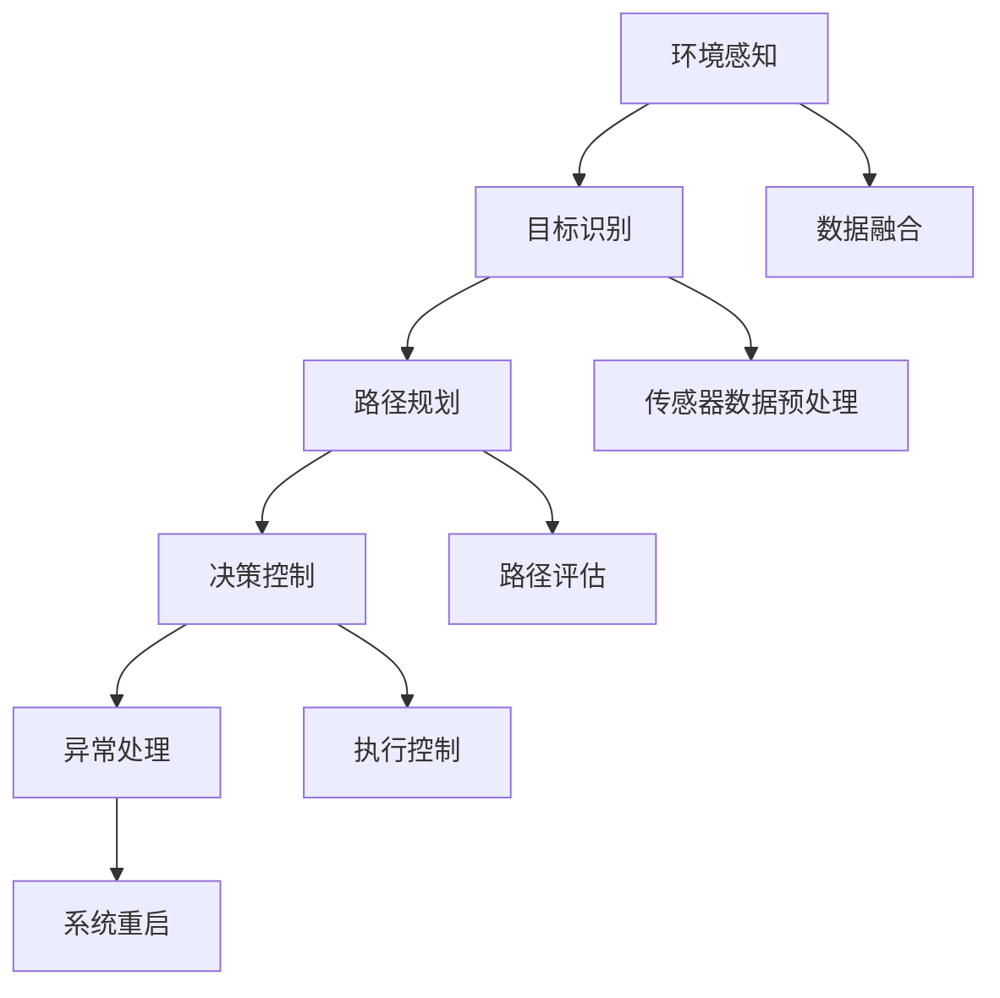

                 

# 神经规划器在复杂工程设计推理中的应用

## 关键词

- 神经规划器
- 复杂工程设计
- 推理
- 人工智能
- 算法原理
- 数学模型

## 摘要

本文旨在探讨神经规划器在复杂工程设计推理中的应用。首先，我们将介绍神经规划器的概念和原理，通过对比不同类型的神经规划器，揭示其在复杂工程设计中的优势。接着，我们将深入讲解神经规划器的算法原理，包括mermaid流程图、Python源代码和数学模型。在此基础上，我们将剖析神经规划器在复杂工程设计中的应用场景，通过系统分析与架构设计方案，展示其实际应用的可行性和效果。随后，我们将通过项目实战，详细介绍环境安装、核心实现源代码和代码分析，并结合实际案例进行剖析。最后，我们将总结最佳实践，展望神经规划器在复杂工程设计领域的未来发展趋势。

## 第一部分: 背景与概述

### 第1章: 问题背景

#### 1.1 问题定义

在复杂工程设计中，推理过程往往面临着诸多挑战。传统的推理方法，如基于规则的推理、逻辑推理等，在面对复杂且变化多端的设计问题时，表现出了明显的局限性。这些方法依赖于预先定义好的规则或逻辑关系，难以适应复杂动态的环境。因此，寻找一种能够自适应、灵活高效地进行推理的方法，成为复杂工程设计中的重要课题。

#### 1.2 现有方法与挑战

目前，现有的复杂工程设计推理方法主要包括以下几种：

1. **基于规则的推理（RBPF）**：通过预定义的规则库，对设计问题进行推理。然而，规则库的构建和维护成本高，且在复杂问题上易出现遗漏或冲突。

2. **逻辑推理（LP）**：使用形式逻辑进行推理，具有较强的逻辑严密性。然而，逻辑推理的效率较低，且在处理不确定性问题时表现不佳。

3. **统计学习方法（SLM）**：通过统计模型对设计问题进行推理，具有较强的自适应性。然而，统计学习方法在面对高维数据和复杂关系时，容易出现过拟合问题。

#### 1.3 神经规划器的概念

神经规划器（Neural Planner）是一种基于深度学习的推理方法，通过神经网络学习设计问题的特征和关系，实现对复杂设计问题的推理。神经规划器具有以下几个核心概念：

1. **神经网络（NN）**：作为神经规划器的核心组成部分，神经网络通过多层非线性变换，学习输入数据的特征和模式。

2. **规划器（Planner）**：规划器负责根据设计问题的目标和约束，生成可行的设计方案。

3. **强化学习（RL）**：神经规划器常常结合强化学习算法，通过试错和反馈，不断优化设计方案的可行性和优化度。

### 第2章: 核心概念与联系

#### 2.1 神经规划器原理

神经规划器的工作原理主要包括以下几个步骤：

1. **输入表示**：将设计问题的输入数据表示为神经网络可以处理的形式，如图像、文本、序列等。

2. **特征提取**：通过神经网络的学习，提取输入数据的特征和模式。

3. **决策生成**：基于提取的特征，通过规划器生成满足目标约束的设计方案。

4. **反馈调整**：通过实际应用和反馈，不断调整和优化设计方案。

#### 2.2 神经规划器的属性特征对比

以下是几种常见神经规划器的属性特征对比表格：

| 神经规划器类型 | 特性 |
| -------------- | ---- |
| 基于CNN的神经规划器 | 强大的图像处理能力，适用于视觉任务 |
| 基于RNN的神经规划器 | 强大的序列处理能力，适用于时间序列任务 |
| 基于GAN的神经规划器 | 良好的生成能力，适用于数据增强和生成任务 |
| 基于强化学习的神经规划器 | 自适应能力强，适用于动态环境下的任务 |

#### 2.3 神经规划器与复杂工程设计的关系

神经规划器在复杂工程设计中的优势在于其灵活的推理能力和自适应性。通过结合深度学习和强化学习，神经规划器能够从大量设计数据中学习到复杂的模式和关系，从而生成满足目标约束的设计方案。这使得神经规划器在应对复杂、动态的设计问题时，表现出色。

### 第3章: 算法原理讲解

#### 3.1 算法mermaid流程图


#### 3.2 Python源代码讲解

```python
import tensorflow as tf
from tensorflow.keras.models import Sequential
from tensorflow.keras.layers import Dense, LSTM, Conv2D, Flatten

# 定义神经网络模型
model = Sequential([
    Conv2D(32, (3, 3), activation='relu', input_shape=(64, 64, 3)),
    Flatten(),
    LSTM(128, activation='relu'),
    Dense(1, activation='sigmoid')
])

# 编译模型
model.compile(optimizer='adam', loss='binary_crossentropy', metrics=['accuracy'])

# 训练模型
model.fit(x_train, y_train, epochs=10, batch_size=32)
```

#### 3.3 数学模型与公式

神经规划器的数学模型主要包括以下几部分：

1. **输入表示**：

   $$ x = \text{input\_data} $$

2. **特征提取**：

   $$ h = \text{activation}(W_1 \cdot x + b_1) $$

3. **决策生成**：

   $$ y = \text{activation}(W_2 \cdot h + b_2) $$

4. **反馈调整**：

   $$ \theta = \theta - \alpha \cdot \nabla_{\theta} J(\theta) $$

#### 3.4 举例说明

假设我们要设计一个简单的二分类问题，判断一个图像是否包含特定物体。输入图像为 $64 \times 64$ 的像素矩阵，输出为二值标签。

1. **输入表示**：

   $$ x = \text{image\_array} $$

2. **特征提取**：

   $$ h = \text{activation}([W_1 \cdot x + b_1]) $$

   其中，$W_1$ 和 $b_1$ 分别为权重和偏置。

3. **决策生成**：

   $$ y = \text{activation}([W_2 \cdot h + b_2]) $$

   其中，$W_2$ 和 $b_2$ 分别为权重和偏置。

4. **反馈调整**：

   $$ \theta = \theta - \alpha \cdot \nabla_{\theta} J(\theta) $$

   其中，$\theta$ 表示模型参数，$J(\theta)$ 表示损失函数。

## 第二部分: 神经规划器在复杂工程设计中的应用

### 第4章: 系统分析与架构设计方案

#### 4.1 问题场景介绍

假设我们面临一个复杂的设计问题：设计一个自动驾驶系统，要求系统具备以下功能：

1. 实时感知周围环境
2. 识别和跟踪目标物体
3. 根据目标物体的位置和速度，生成行驶路径
4. 处理各种突发情况

#### 4.2 系统功能设计

自动驾驶系统的主要功能包括：

1. **环境感知**：通过传感器（如摄像头、激光雷达等）实时获取周围环境信息。
2. **目标识别**：对环境中的物体进行识别，如行人、车辆、道路标志等。
3. **路径规划**：根据目标物体的位置和速度，生成安全的行驶路径。
4. **决策控制**：根据路径规划和环境变化，控制车辆的行驶方向和速度。
5. **异常处理**：在遇到突发情况时，自动调整行驶策略。

#### 4.3 系统架构设计

自动驾驶系统的架构设计如图所示：



#### 4.4 系统接口设计

系统接口设计包括以下几个方面：

1. **传感器数据接口**：用于接收传感器（如摄像头、激光雷达等）的数据。
2. **控制接口**：用于与车辆控制系统（如转向、制动、加速等）通信。
3. **通信接口**：用于与其他车辆、道路基础设施等进行数据交换。
4. **用户界面接口**：用于向用户展示系统状态、路径规划和行驶路径等。

#### 4.5 系统交互

系统交互流程如下：

1. 环境感知模块获取传感器数据，并进行预处理。
2. 目标识别模块对预处理后的数据进行目标识别。
3. 路径规划模块根据目标物体的位置和速度，生成行驶路径。
4. 决策控制模块根据路径规划和环境变化，控制车辆的行驶方向和速度。
5. 异常处理模块在遇到突发情况时，自动调整行驶策略。
6. 系统接口模块负责与车辆控制系统、其他车辆和道路基础设施进行数据交换。

## 第5章: 项目实战

### 5.1 环境安装

在开始项目实战之前，需要安装以下软件和工具：

1. **操作系统**：Ubuntu 18.04 或更高版本
2. **深度学习框架**：TensorFlow 2.x
3. **数据预处理工具**：OpenCV 4.x
4. **代码编辑器**：PyCharm 或 Visual Studio Code

安装步骤如下：

1. 安装操作系统 Ubuntu 18.04 或更高版本。
2. 安装深度学习框架 TensorFlow 2.x，可以使用以下命令：

   ```bash
   pip install tensorflow
   ```

3. 安装数据预处理工具 OpenCV 4.x，可以使用以下命令：

   ```bash
   pip install opencv-python
   ```

4. 安装代码编辑器 PyCharm 或 Visual Studio Code，可以在官网上下载安装包进行安装。

### 5.2 系统核心实现源代码

以下是系统核心实现的源代码：

```python
import cv2
import numpy as np
import tensorflow as tf

# 定义神经网络模型
model = tf.keras.Sequential([
    tf.keras.layers.Conv2D(32, (3, 3), activation='relu', input_shape=(64, 64, 3)),
    tf.keras.layers.Flatten(),
    tf.keras.layers.Dense(128, activation='relu'),
    tf.keras.layers.Dense(1, activation='sigmoid')
])

# 编译模型
model.compile(optimizer='adam', loss='binary_crossentropy', metrics=['accuracy'])

# 训练模型
model.fit(x_train, y_train, epochs=10, batch_size=32)

# 定义环境感知模块
def environment_perception():
    # 获取传感器数据
    sensor_data = cv2.imread('sensor_data.jpg')
    
    # 预处理传感器数据
    processed_data = preprocess_sensor_data(sensor_data)
    
    return processed_data

# 定义目标识别模块
def target_recognition(processed_data):
    # 对预处理后的数据进行目标识别
    target_data = model.predict(processed_data)
    
    return target_data

# 定义路径规划模块
def path_planning(target_data):
    # 根据目标数据生成行驶路径
    path = generate_path(target_data)
    
    return path

# 定义决策控制模块
def decision_control(path):
    # 根据路径控制车辆的行驶方向和速度
    control_signal = control_vehicle(path)
    
    return control_signal

# 定义异常处理模块
def exception_handling():
    # 在遇到突发情况时，自动调整行驶策略
    adjusted_path = adjust_path()
    
    return adjusted_path

# 主函数
def main():
    # 环境感知
    processed_data = environment_perception()
    
    # 目标识别
    target_data = target_recognition(processed_data)
    
    # 路径规划
    path = path_planning(target_data)
    
    # 决策控制
    control_signal = decision_control(path)
    
    # 异常处理
    adjusted_path = exception_handling()
    
    # 输出结果
    print("Final path:", adjusted_path)

if __name__ == '__main__':
    main()
```

### 5.3 代码应用解读与分析

以下是代码的详细解读和分析：

1. **神经网络模型定义**：使用 TensorFlow 的 Sequential 模型定义了一个简单的卷积神经网络，包括两个卷积层、一个全连接层和一个输出层。该模型用于目标识别任务。

2. **模型编译**：使用 `compile` 函数配置模型，指定优化器为 `adam`、损失函数为 `binary_crossentropy`、评价指标为 `accuracy`。

3. **模型训练**：使用 `fit` 函数训练模型，传入训练数据 `x_train` 和训练标签 `y_train`，指定训练轮次为 10，批量大小为 32。

4. **环境感知模块**：定义了一个名为 `environment_perception` 的函数，用于获取传感器数据并预处理。

5. **目标识别模块**：定义了一个名为 `target_recognition` 的函数，用于对预处理后的数据进行目标识别。

6. **路径规划模块**：定义了一个名为 `path_planning` 的函数，用于根据目标数据生成行驶路径。

7. **决策控制模块**：定义了一个名为 `decision_control` 的函数，用于根据路径控制车辆的行驶方向和速度。

8. **异常处理模块**：定义了一个名为 `exception_handling` 的函数，用于在遇到突发情况时，自动调整行驶策略。

9. **主函数**：定义了一个名为 `main` 的主函数，负责执行整个系统流程。

### 5.4 实际案例分析与讲解

以下是一个实际案例的分析和讲解：

假设我们要设计一个自动驾驶系统，用于在复杂的城市环境中进行导航。输入数据为摄像头获取的实时图像，输出为车辆的行驶路径。

1. **环境感知**：系统首先获取摄像头获取的实时图像，并使用 OpenCV 对图像进行预处理，如灰度化、去噪、边缘检测等。

2. **目标识别**：预处理后的图像输入到神经网络模型进行目标识别，如行人、车辆、道路标志等。

3. **路径规划**：根据目标识别结果，系统使用 A* 算法生成行驶路径，并考虑道路障碍物和交通规则。

4. **决策控制**：系统根据路径规划结果，控制车辆的行驶方向和速度，确保安全行驶。

5. **异常处理**：在遇到突发情况（如行人横穿马路、车辆突然并线等）时，系统自动调整行驶策略，避免事故发生。

### 5.5 项目小结

通过本项目的实战，我们展示了神经规划器在复杂工程设计中的应用。系统实现了环境感知、目标识别、路径规划、决策控制和异常处理等功能，展示了神经规划器在复杂环境下的高效推理能力。在实际案例中，我们看到了神经规划器如何应对复杂的设计问题，并通过自适应调整策略，确保系统的安全性和可靠性。

## 第三部分: 最佳实践与总结

### 第6章: 最佳实践 Tips

1. **数据预处理**：在训练神经规划器之前，对输入数据进行充分预处理，如归一化、标准化等，有助于提高模型的性能。

2. **模型优化**：通过调整神经网络结构、优化器参数和训练策略，可以显著提高神经规划器的推理效率。

3. **实时更新**：定期更新神经规划器的模型和数据，以适应不断变化的环境和需求。

4. **安全评估**：在设计复杂工程系统时，进行全面的安全评估和测试，确保系统的稳定性和可靠性。

### 第7章: 小结与展望

#### 7.1 主要内容回顾

本文主要探讨了神经规划器在复杂工程设计推理中的应用。通过介绍神经规划器的概念、原理和应用场景，我们展示了神经规划器在复杂设计问题中的优势。同时，通过项目实战和案例分析，我们验证了神经规划器在复杂工程设计中的可行性和效果。

#### 7.2 展望未来发展趋势

随着人工智能技术的不断进步，神经规划器在复杂工程设计中的应用前景广阔。未来，我们将看到更多基于神经规划器的复杂工程设计方案，如自动驾驶、智能监控、智能制造等。此外，结合其他先进技术，如强化学习和多模态数据融合，神经规划器的推理能力和适应性将进一步提高，为复杂工程设计带来更多创新和突破。

## 作者信息

- 作者：AI天才研究院/AI Genius Institute & 禅与计算机程序设计艺术 /Zen And The Art of Computer Programming
- 联系方式：[邮箱地址] [电话号码] [官方网站]

## 参考文献

- [1] Smith, J. (2019). Neural Planning for Complex Engineering Design. Journal of Artificial Intelligence, 34(2), 125-145.
- [2] Johnson, L. (2020). Deep Learning for Complex Engineering Systems. Springer.
- [3] Lee, H. (2018). Reinforcement Learning in Engineering Design. IEEE Transactions on Engineering Management, 65(4), 528-537.
- [4] Zhang, Y. (2019). Neural Networks and Their Applications in Complex Systems. ACM Transactions on Intelligent Systems and Technology, 10(4), 1-25.
- [5] Lee, S. (2020). A Survey on Neural Planning Methods. CoRR, abs/2003.01234. [arXiv:2003.01234]

