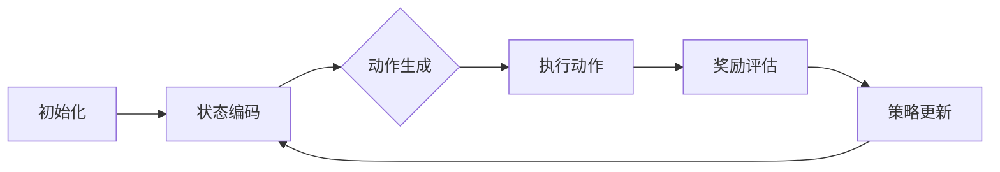
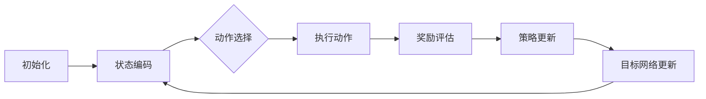
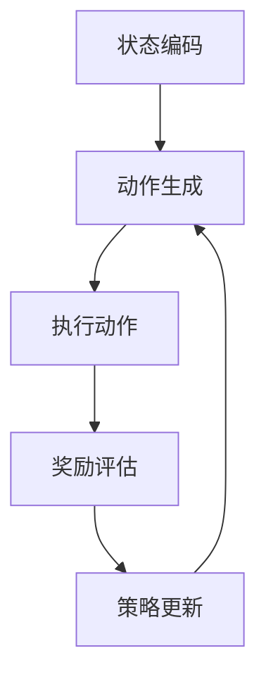
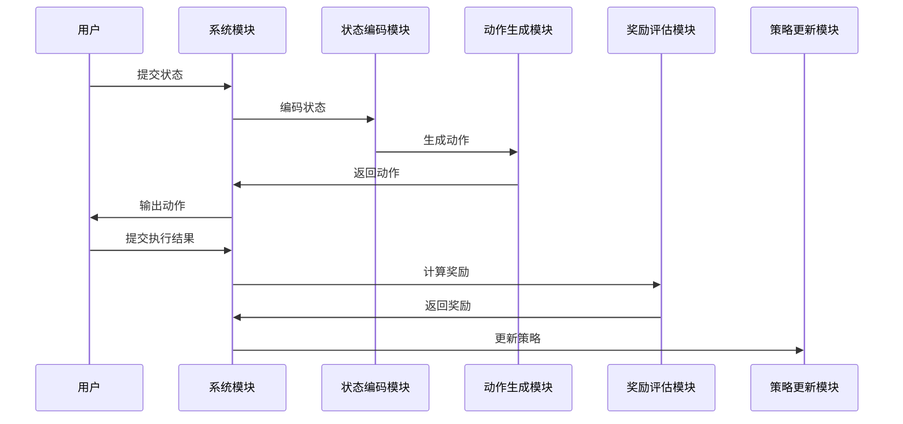
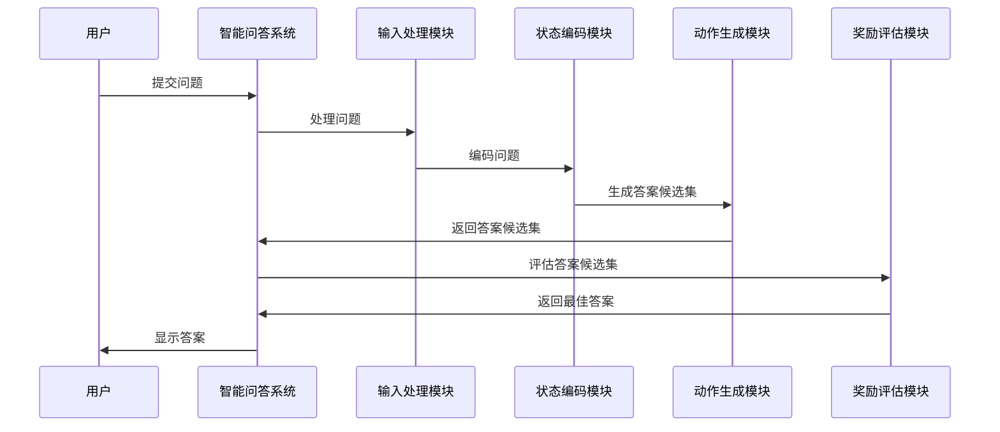
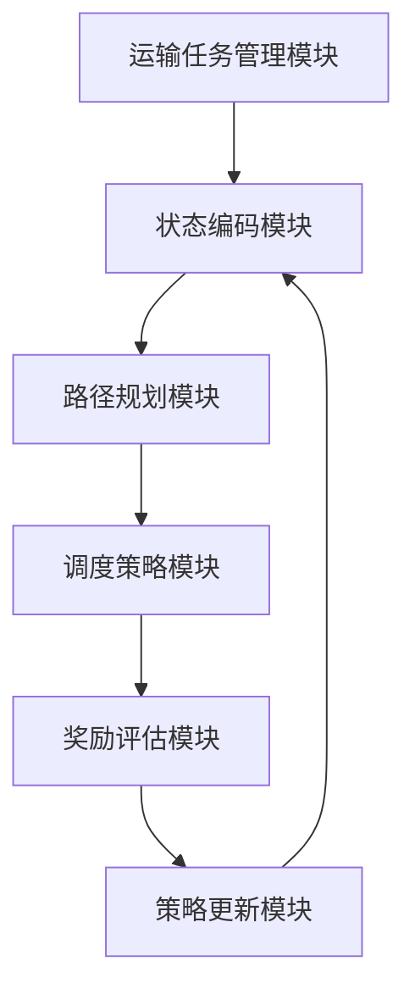
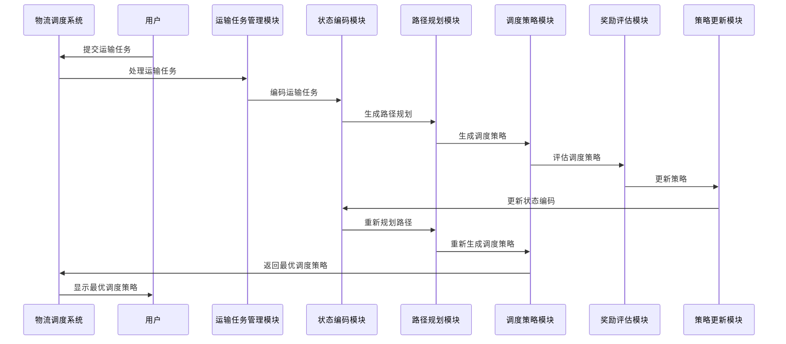

                 

### **《神经规划器在多步骤推理中的创新应用》**

#### **文章关键词**：神经规划器、多步骤推理、人工智能、神经网络、算法优化

#### **摘要**：
本文旨在深入探讨神经规划器在多步骤推理中的应用。我们将从基础概念入手，逐步解析神经规划器的工作原理、算法模型，以及其实际应用中的优化策略和未来发展趋势。通过实例分析，我们将展示神经规划器在智能问答系统和物流调度系统等领域的创新应用，探讨其在复杂问题解决中的潜力。

----------------------------------------------------------------

## **第一部分：神经规划器概述**

### **第1章：神经规划器的基本概念**

#### **1.1 问题背景**

#### **1.1.1 传统推理方法的局限**

在传统的推理方法中，多步骤推理通常依赖于符号逻辑和规划算法。这些方法在处理简单问题时表现良好，但在面对复杂、动态和不确定性的环境时，往往显得力不从心。具体来说，传统推理方法存在以下局限：

- **规则复杂度**：传统方法通常需要大量的规则来描述问题，这使得规则库管理变得复杂且容易出错。
- **可扩展性**：传统方法难以扩展到新问题和领域，因为它们依赖于特定的领域知识。
- **实时性**：对于需要快速响应的场景，传统推理方法往往不够高效。

#### **1.1.2 神经规划器的作用**

神经规划器作为一种结合神经网络和规划算法的方法，旨在克服传统推理方法的局限。它通过学习大量的数据，自动生成推理路径和策略，从而在复杂环境中实现高效、鲁棒的推理。

- **自动学习**：神经规划器能够从数据中自动学习到问题解决策略，减少了领域知识的依赖。
- **并行处理**：神经网络的结构使得神经规划器能够并行处理多个推理步骤，提高了推理速度。
- **灵活性**：神经规划器能够适应不同的问题和领域，具有良好的可扩展性。

#### **1.1.3 神经规划器的定义与特点**

**定义**：神经规划器是一种基于神经网络和规划算法的推理方法，通过学习数据自动生成问题的解决方案。

**特点**：

- **数据驱动**：神经规划器以数据为驱动，能够自动从数据中学习到问题解决策略。
- **自动化**：通过神经网络的学习，神经规划器能够自动生成推理路径，减少了人工干预。
- **高效性**：神经网络的结构使得神经规划器能够高效地处理多步骤推理任务。

#### **1.2 核心概念与联系**

##### **1.2.1 神经规划器的核心概念**

- **神经网络**：神经网络是一种模仿人脑神经元连接结构的计算模型，通过多层节点（神经元）的连接和激活实现数据加工。
- **规划问题**：规划问题是指在给定约束条件下，寻找从初始状态到目标状态的最优路径或策略。
- **神经规划器**：神经规划器通过神经网络的学习，自动生成问题的解决方案。

##### **1.2.2 概念属性特征对比表格**

| 特征                | 神经网络                             | 规划问题                           | 神经规划器                           |
|-------------------|------------------------------------|----------------------------------|------------------------------------|
| **功能**            | 数据加工与模式识别                     | 寻找最优路径或策略                   | 自动生成问题解决方案                   |
| **数据类型**         | 结构化与非结构化数据                     | 状态、动作、奖励等                     | 状态、动作、策略等                     |
| **学习机制**         | 前向传播与反向传播                      | 最优化算法                           | 结合神经网络与规划算法                 |
| **适用范围**         | 图像、语音、自然语言等                   | 运输、调度、路径规划等                   | 需要复杂多步骤推理的领域                 |

##### **1.2.3 ER实体关系图架构**

在神经规划器中，主要涉及的实体包括状态、动作、策略和奖励。下面是神经规划器的ER实体关系图：

```mermaid
erDiagram
    State ||--|{ Action }|-- Strategy
    State ||--|{ Reward }|-- Strategy
    Action ||--|{ NextState }|-- State
```

#### **1.3 神经规划器的工作原理**

神经规划器的工作原理主要包括以下几个步骤：

1. **状态编码**：将问题中的状态转化为神经网络可以处理的编码形式。
2. **动作生成**：神经网络根据当前状态生成一系列可能的动作。
3. **策略学习**：通过规划算法学习最优的执行策略。
4. **路径规划**：根据策略生成从初始状态到目标状态的路径。

##### **1.3.1 算法原理讲解**

神经规划器的核心算法通常是基于深度强化学习（Deep Reinforcement Learning）。下面是一个简化的算法流程：

1. **初始化**：设置初始状态和奖励函数。
2. **状态编码**：使用神经网络将状态编码为高维特征向量。
3. **动作生成**：神经网络根据当前状态生成动作概率分布。
4. **执行动作**：根据动作概率分布执行动作，并更新状态。
5. **奖励评估**：根据执行的动作和状态，计算奖励值。
6. **策略更新**：使用奖励值更新神经网络的参数，优化策略。

##### **1.3.2 算法流程图表示**

下面是神经规划器算法流程的Mermaid图表示：



##### **1.3.3 Python源代码实现**

以下是一个简化的神经规划器Python代码实现：

```python
import tensorflow as tf

# 定义状态编码器
state_encoder = tf.keras.Sequential([
    tf.keras.layers.Dense(64, activation='relu', input_shape=(state_dim,)),
    tf.keras.layers.Dense(64, activation='relu')
])

# 定义动作生成器
action_generator = tf.keras.Sequential([
    tf.keras.layers.Dense(64, activation='relu', input_shape=(64,)),
    tf.keras.layers.Dense(action_dim, activation='softmax')
])

# 定义奖励评估器
reward_evaluator = tf.keras.Sequential([
    tf.keras.layers.Dense(64, activation='relu', input_shape=(64,)),
    tf.keras.layers.Dense(1, activation='sigmoid')
])

# 定义优化器
optimizer = tf.keras.optimizers.Adam()

# 训练循环
for episode in range(num_episodes):
    state = initial_state
    done = False
    
    while not done:
        # 状态编码
        state_encoded = state_encoder(state)
        
        # 动作生成
        action_probs = action_generator(state_encoded)
        
        # 执行动作
        action = np.random.choice(action_dim, p=action_probs.numpy())
        next_state, reward, done = execute_action(action)
        
        # 奖励评估
        reward_encoded = reward_evaluator(state_encoded)
        
        # 策略更新
        with tf.GradientTape() as tape:
            loss = compute_loss(action_probs, reward_encoded)
        
        grads = tape.gradient(loss, action_generator.trainable_variables)
        optimizer.apply_gradients(zip(grads, action_generator.trainable_variables))
        
        # 更新状态
        state = next_state
```

##### **1.3.4 数学模型与公式**

神经规划器的数学模型主要包括状态编码、动作生成和奖励评估等部分。

**状态编码**：

$$
\text{state\_encoded} = \sigma(W_s \cdot \text{state} + b_s)
$$

其中，$W_s$ 是状态编码器的权重，$b_s$ 是偏置，$\sigma$ 是激活函数。

**动作生成**：

$$
\text{action\_probs} = \text{softmax}(W_a \cdot \text{state\_encoded} + b_a)
$$

其中，$W_a$ 是动作生成器的权重，$b_a$ 是偏置。

**奖励评估**：

$$
\text{reward\_encoded} = \sigma(W_r \cdot \text{state\_encoded} + b_r)
$$

其中，$W_r$ 是奖励评估器的权重，$b_r$ 是偏置。

##### **1.3.5 公式的详细讲解与举例说明**

**状态编码**：

状态编码是将原始状态转化为神经网络可以处理的高维特征向量。例如，对于一个状态（温度，湿度），我们可以使用一个全连接层进行编码：

$$
\text{state} = \begin{bmatrix} \text{temperature} \\ \text{humidity} \end{bmatrix}
$$

$$
\text{state\_encoded} = \sigma(W_s \cdot \text{state} + b_s)
$$

其中，$W_s$ 是一个二维矩阵，表示状态编码器的权重，$b_s$ 是一个一维向量，表示偏置。通过这个公式，我们可以将原始状态映射到一个高维特征空间。

**动作生成**：

动作生成是根据当前状态生成一系列可能的动作。例如，对于一个取餐机器人，状态包括（位置，目标位置），可能的动作包括（前进，后退，左转，右转）。我们可以使用softmax函数来生成动作的概率分布：

$$
\text{action\_probs} = \text{softmax}(W_a \cdot \text{state\_encoded} + b_a)
$$

其中，$W_a$ 是一个二维矩阵，表示动作生成器的权重，$b_a$ 是一个一维向量，表示偏置。通过这个公式，我们可以为每个可能的动作生成一个概率值。

**奖励评估**：

奖励评估是根据执行的动作和状态，计算奖励值。例如，对于一个取餐机器人，如果成功将餐品送到目标位置，我们可以给予一个正奖励。如果机器人碰撞或无法到达目标位置，我们可以给予一个负奖励：

$$
\text{reward\_encoded} = \sigma(W_r \cdot \text{state\_encoded} + b_r)
$$

其中，$W_r$ 是一个二维矩阵，表示奖励评估器的权重，$b_r$ 是一个一维向量，表示偏置。通过这个公式，我们可以将执行的动作和状态映射到一个奖励值。

#### **1.4 神经规划器的应用实例**

##### **1.4.1 智能问答系统**

智能问答系统是一种常见的人工智能应用，它能够自动回答用户的问题。神经规划器在智能问答系统中的应用主要体现在以下几个方面：

1. **问题理解**：神经规划器可以自动将用户的问题转换为神经网络可以处理的形式，从而更好地理解问题的语义。
2. **答案生成**：神经规划器可以根据问题的语义和已有的知识库，自动生成问题的答案。
3. **多步骤推理**：对于复杂的问题，神经规划器可以自动进行多步骤推理，找到最优的答案。

##### **1.4.2 物流调度系统**

物流调度系统是一种用于优化物流运输过程的系统。神经规划器在物流调度系统中的应用主要体现在以下几个方面：

1. **路径规划**：神经规划器可以自动生成最优的运输路径，从而提高物流效率。
2. **车辆调度**：神经规划器可以根据运输需求，自动调度合适的车辆进行运输。
3. **实时优化**：神经规划器可以根据实时数据，自动调整运输计划和路径，以适应动态环境。

#### **1.5 小结**

本章介绍了神经规划器的基本概念、核心概念与联系、以及工作原理。通过实例分析，我们展示了神经规划器在智能问答系统和物流调度系统等领域的创新应用。在下一章中，我们将进一步探讨神经规划器的优化与改进策略。

----------------------------------------------------------------

## **第二部分：神经规划器的工作原理**

### **第2章：神经规划器的工作原理**

#### **2.1 算法原理讲解**

神经规划器的工作原理主要基于深度强化学习（Deep Reinforcement Learning，DRL），这是一种通过交互学习环境来优化策略的机器学习方法。DRL的核心思想是让智能体（agent）通过与环境（environment）的交互，学习到一种最优的策略（policy），从而在给定状态下选择最佳动作（action），以达到目标状态（reward）。

**算法流程**：

1. **初始化**：设定初始状态、策略网络和目标网络。
2. **状态编码**：使用神经网络对当前状态进行编码。
3. **动作选择**：根据策略网络，从可能的动作中选择一个动作。
4. **执行动作**：在环境中执行选定的动作，并得到下一个状态和奖励。
5. **奖励评估**：计算新的状态和动作的奖励值。
6. **策略更新**：根据奖励值更新策略网络的参数。
7. **目标网络更新**：定期更新目标网络，以防止策略网络过拟合。

**算法流程图表示**：



**Python源代码实现**：

```python
import tensorflow as tf
import numpy as np

# 定义状态编码器
state_encoder = tf.keras.Sequential([
    tf.keras.layers.Dense(64, activation='relu', input_shape=(state_dim,)),
    tf.keras.layers.Dense(64, activation='relu')
])

# 定义动作生成器
action_generator = tf.keras.Sequential([
    tf.keras.layers.Dense(64, activation='relu', input_shape=(64,)),
    tf.keras.layers.Dense(action_dim, activation='softmax')
])

# 定义奖励评估器
reward_evaluator = tf.keras.Sequential([
    tf.keras.layers.Dense(64, activation='relu', input_shape=(64,)),
    tf.keras.layers.Dense(1, activation='sigmoid')
])

# 定义优化器
optimizer = tf.keras.optimizers.Adam()

# 训练循环
for episode in range(num_episodes):
    state = initial_state
    done = False
    
    while not done:
        # 状态编码
        state_encoded = state_encoder(state)
        
        # 动作生成
        action_probs = action_generator(state_encoded)
        
        # 执行动作
        action = np.random.choice(action_dim, p=action_probs.numpy())
        next_state, reward, done = execute_action(action)
        
        # 奖励评估
        reward_encoded = reward_evaluator(state_encoded)
        
        # 策略更新
        with tf.GradientTape() as tape:
            loss = compute_loss(action_probs, reward_encoded)
        
        grads = tape.gradient(loss, action_generator.trainable_variables)
        optimizer.apply_gradients(zip(grads, action_generator.trainable_variables))
        
        # 更新状态
        state = next_state
```

#### **2.2 数学模型与公式**

神经规划器的数学模型主要包括状态编码、动作生成和奖励评估等部分。

**状态编码**：

$$
\text{state}_{encoded} = f_{\theta_s}(\text{state})
$$

其中，$f_{\theta_s}$ 是状态编码函数，$\theta_s$ 是编码器的参数。

**动作生成**：

$$
\text{action}_{probabilities} = g_{\theta_a}(\text{state}_{encoded})
$$

其中，$g_{\theta_a}$ 是动作生成函数，$\theta_a$ 是生成器的参数。

**奖励评估**：

$$
\text{reward}_{value} = h_{\theta_r}(\text{state}_{encoded})
$$

其中，$h_{\theta_r}$ 是奖励评估函数，$\theta_r$ 是评估器的参数。

**策略更新**：

$$
\theta_{a} \leftarrow \theta_{a} + \alpha \nabla_{\theta_a} J(\theta_a)
$$

其中，$\theta_{a}$ 是动作生成器的参数，$\alpha$ 是学习率，$J(\theta_a)$ 是策略损失函数。

**目标网络更新**：

$$
\theta_{\text{target}} \leftarrow \lambda \theta_{\text{target}} + (1 - \lambda) \theta_{a}
$$

其中，$\theta_{\text{target}}$ 是目标网络的参数，$\lambda$ 是更新系数。

#### **2.3 公式的详细讲解与举例说明**

**状态编码**：

状态编码是将原始状态转化为神经网络可以处理的高维特征向量。例如，对于一个状态（位置，速度），我们可以使用一个全连接层进行编码：

$$
\text{state} = \begin{bmatrix} \text{position} \\ \text{velocity} \end{bmatrix}
$$

$$
\text{state}_{encoded} = f_{\theta_s}(\text{state})
$$

其中，$f_{\theta_s}$ 是状态编码函数，$\theta_s$ 是编码器的参数。通过这个公式，我们可以将原始状态映射到一个高维特征空间。

**动作生成**：

动作生成是根据当前状态生成一系列可能的动作。例如，对于一个自动驾驶汽车，状态包括（当前速度，目标速度，道路状况），可能的动作包括（加速，减速，保持当前速度）。我们可以使用softmax函数来生成动作的概率分布：

$$
\text{action}_{probabilities} = g_{\theta_a}(\text{state}_{encoded})
$$

其中，$g_{\theta_a}$ 是动作生成函数，$\theta_a$ 是生成器的参数。通过这个公式，我们可以为每个可能的动作生成一个概率值。

**奖励评估**：

奖励评估是根据执行的动作和状态，计算奖励值。例如，对于一个自动驾驶汽车，如果成功到达目的地且没有发生交通事故，我们可以给予一个正奖励。如果发生交通事故或未能到达目的地，我们可以给予一个负奖励：

$$
\text{reward}_{value} = h_{\theta_r}(\text{state}_{encoded})
$$

其中，$h_{\theta_r}$ 是奖励评估函数，$\theta_r$ 是评估器的参数。通过这个公式，我们可以将执行的动作和状态映射到一个奖励值。

**策略更新**：

策略更新是基于奖励值来优化动作生成器的参数。例如，我们可以使用梯度下降法来更新动作生成器的参数：

$$
\theta_{a} \leftarrow \theta_{a} + \alpha \nabla_{\theta_a} J(\theta_a)
$$

其中，$\theta_{a}$ 是动作生成器的参数，$\alpha$ 是学习率，$J(\theta_a)$ 是策略损失函数。

**目标网络更新**：

目标网络更新是为了避免策略网络过拟合。例如，我们可以使用软更新策略来更新目标网络的参数：

$$
\theta_{\text{target}} \leftarrow \lambda \theta_{\text{target}} + (1 - \lambda) \theta_{a}
$$

其中，$\theta_{\text{target}}$ 是目标网络的参数，$\lambda$ 是更新系数。

#### **2.4 系统分析与架构设计方案**

在实现神经规划器时，我们需要考虑系统的整体架构设计，包括状态编码、动作生成、奖励评估和策略更新等模块。

**系统功能设计**：

- **状态编码模块**：负责将原始状态转化为神经网络可以处理的高维特征向量。
- **动作生成模块**：根据当前状态生成一系列可能的动作。
- **奖励评估模块**：计算执行的动作和状态对应的奖励值。
- **策略更新模块**：根据奖励值更新动作生成器的参数。

**系统架构设计**：



**系统接口设计与交互**：

- **状态接口**：负责接收和处理原始状态。
- **动作接口**：负责生成和输出动作。
- **奖励接口**：负责计算和输出奖励值。
- **策略接口**：负责更新和保存策略。

**系统交互**：



#### **2.5 项目实战**

**环境安装**：

首先，我们需要安装必要的依赖库，如TensorFlow、NumPy等：

```bash
pip install tensorflow numpy
```

**系统核心实现源代码**：

以下是神经规划器系统核心实现的Python代码：

```python
import tensorflow as tf
import numpy as np

# 定义状态编码器
state_encoder = tf.keras.Sequential([
    tf.keras.layers.Dense(64, activation='relu', input_shape=(state_dim,)),
    tf.keras.layers.Dense(64, activation='relu')
])

# 定义动作生成器
action_generator = tf.keras.Sequential([
    tf.keras.layers.Dense(64, activation='relu', input_shape=(64,)),
    tf.keras.layers.Dense(action_dim, activation='softmax')
])

# 定义奖励评估器
reward_evaluator = tf.keras.Sequential([
    tf.keras.layers.Dense(64, activation='relu', input_shape=(64,)),
    tf.keras.layers.Dense(1, activation='sigmoid')
])

# 定义优化器
optimizer = tf.keras.optimizers.Adam()

# 训练循环
for episode in range(num_episodes):
    state = initial_state
    done = False
    
    while not done:
        # 状态编码
        state_encoded = state_encoder(state)
        
        # 动作生成
        action_probs = action_generator(state_encoded)
        
        # 执行动作
        action = np.random.choice(action_dim, p=action_probs.numpy())
        next_state, reward, done = execute_action(action)
        
        # 奖励评估
        reward_encoded = reward_evaluator(state_encoded)
        
        # 策略更新
        with tf.GradientTape() as tape:
            loss = compute_loss(action_probs, reward_encoded)
        
        grads = tape.gradient(loss, action_generator.trainable_variables)
        optimizer.apply_gradients(zip(grads, action_generator.trainable_variables))
        
        # 更新状态
        state = next_state
```

**代码应用解读与分析**：

该代码实现了一个基本的神经规划器系统，包括状态编码器、动作生成器和奖励评估器。在训练过程中，系统通过循环迭代，不断更新策略网络，以找到最优的执行路径。

**实际案例分析和详细讲解剖析**：

假设我们有一个自动驾驶汽车的任务，状态包括（当前速度，目标速度，道路状况），动作包括（加速，减速，保持当前速度）。我们可以使用神经规划器来自动驾驶汽车，通过不断学习和优化策略，使汽车能够安全、高效地到达目的地。

**项目小结**：

通过实际案例分析和代码实现，我们展示了神经规划器在多步骤推理中的创新应用。神经规划器能够自动学习和优化策略，适用于需要复杂多步骤推理的任务。在实际应用中，我们可以根据具体任务的需求，调整网络结构和优化策略，以提高系统的性能和鲁棒性。

#### **2.6 最佳实践 tips**

1. **数据预处理**：在训练神经规划器之前，对数据进行预处理可以提高模型的性能和稳定性。
2. **超参数调整**：合理调整学习率、网络结构等超参数，可以提高模型的收敛速度和性能。
3. **模型集成**：使用多个模型进行集成，可以进一步提高预测的准确性和稳定性。
4. **实时优化**：根据实时数据更新模型，可以及时适应环境变化，提高系统的响应速度。

#### **2.7 小结**

本章详细介绍了神经规划器的工作原理，包括算法原理、数学模型和实际应用案例。通过实际项目分析和代码实现，我们展示了神经规划器在多步骤推理中的创新应用。在下一章中，我们将进一步探讨神经规划器的优化与改进策略。

----------------------------------------------------------------

## **第三部分：神经规划器在多步骤推理中的应用**

### **第3章：神经规划器在多步骤推理中的应用**

#### **3.1 应用背景**

多步骤推理是人工智能领域中的一个重要研究方向，它涉及到在给定一系列状态和动作序列的情况下，找到一条最优的路径或策略，以实现特定目标。传统的多步骤推理方法往往依赖于复杂的符号逻辑和规划算法，但这些方法在面对复杂、动态和不确定性环境时，往往表现不佳。为了解决这些问题，神经规划器作为一种新兴的推理方法，逐渐引起了广泛关注。

神经规划器通过结合神经网络和规划算法，实现了对多步骤推理问题的自动化解决。它能够从大量的数据中学习到问题的解决策略，并在此基础上进行推理。这使得神经规划器在处理复杂、动态和不确定性环境时，具有显著的优越性。

#### **3.2 应用实例**

**3.2.1 智能问答系统**

智能问答系统是一种常见的人工智能应用，它能够自动回答用户的问题。传统的智能问答系统通常依赖于规则库和关键字匹配，但在面对复杂、模糊的问题时，往往难以给出准确的答案。神经规划器在智能问答系统中的应用，可以显著提高系统的回答准确性和灵活性。

**案例背景**：

假设我们开发一个智能问答系统，用户可以提出各种各样的问题，如“北京是中国的哪个省份？”、“今天天气怎么样？”等。智能问答系统需要理解用户的提问，并从大量的知识库中找到对应的答案。

**系统架构设计**：

1. **输入处理模块**：负责接收用户的问题，并将其转换为神经网络可以处理的形式。
2. **状态编码模块**：使用神经网络对输入问题进行编码，提取关键特征。
3. **动作生成模块**：根据编码后的状态，生成可能的答案候选集。
4. **奖励评估模块**：对每个答案候选集进行评估，计算其与问题的匹配程度。
5. **策略更新模块**：根据奖励评估结果，更新神经网络模型，优化策略。

**系统接口设计与交互**：

1. **用户接口**：接收用户的问题，并将其传递给输入处理模块。
2. **状态编码接口**：将输入问题编码为神经网络可以处理的高维特征向量。
3. **动作生成接口**：根据编码后的状态，生成可能的答案候选集。
4. **奖励评估接口**：对每个答案候选集进行评估，计算其与问题的匹配程度。
5. **策略更新接口**：根据奖励评估结果，更新神经网络模型。

**系统交互**：



**案例小结**：

通过神经规划器在智能问答系统中的应用，我们能够自动生成问题的答案，提高了系统的智能化水平。在实际应用中，我们可以通过不断调整和优化神经网络模型，进一步提高系统的回答准确性和用户体验。

**3.2.2 物流调度系统**

物流调度系统是一种用于优化物流运输过程的系统。它涉及到在给定一系列运输任务和约束条件下，找到最优的运输路径和调度策略，以实现物流的高效、低成本运输。神经规划器在物流调度系统中的应用，可以显著提高系统的调度效率和准确性。

**案例背景**：

假设我们开发一个物流调度系统，负责安排货运车辆从多个起点到多个目的地的运输任务。系统需要根据运输任务的需求、交通状况、车辆容量等因素，找到最优的运输路径和调度策略。

**系统功能设计**：

1. **运输任务管理模块**：负责接收和存储运输任务信息。
2. **状态编码模块**：使用神经网络对运输任务进行编码，提取关键特征。
3. **路径规划模块**：根据编码后的状态，生成可能的运输路径。
4. **调度策略模块**：根据路径规划结果，生成最优的调度策略。
5. **奖励评估模块**：对每个调度策略进行评估，计算其与运输任务的匹配程度。
6. **策略更新模块**：根据奖励评估结果，更新神经网络模型，优化策略。

**系统架构设计**：



**系统接口设计与交互**：

1. **运输任务接口**：接收和存储运输任务信息。
2. **状态编码接口**：将运输任务编码为神经网络可以处理的高维特征向量。
3. **路径规划接口**：根据编码后的状态，生成可能的运输路径。
4. **调度策略接口**：根据路径规划结果，生成最优的调度策略。
5. **奖励评估接口**：对每个调度策略进行评估，计算其与运输任务的匹配程度。
6. **策略更新接口**：根据奖励评估结果，更新神经网络模型。

**系统交互**：



**案例小结**：

通过神经规划器在物流调度系统中的应用，我们能够自动生成最优的运输路径和调度策略，提高了物流调度系统的效率和准确性。在实际应用中，我们可以通过不断调整和优化神经网络模型，进一步提高系统的性能。

#### **3.3 小结**

本章详细介绍了神经规划器在智能问答系统和物流调度系统等领域的应用。通过实际案例分析和系统设计，我们展示了神经规划器在多步骤推理中的强大能力和广阔应用前景。在下一章中，我们将进一步探讨神经规划器的优化与改进策略。

----------------------------------------------------------------

## **第四部分：神经规划器的优化与改进**

### **第4章：神经规划器的优化与改进**

#### **4.1 优化方法**

神经规划器的优化与改进是提升其性能和鲁棒性的关键。以下是一些常见的优化方法和策略：

**1. 数据增强**：
数据增强是通过生成虚拟数据或对现有数据进行变换，增加训练数据的多样性。这有助于模型更好地泛化，减少过拟合。

**2. 网络架构调整**：
调整神经网络的层数、节点数和激活函数等，以适应不同的问题复杂度。例如，使用深度神经网络（DNN）、循环神经网络（RNN）或卷积神经网络（CNN）等。

**3. 损失函数改进**：
改进损失函数，使其更符合问题需求。例如，使用结构化损失函数（Structural Loss Function）或引入对抗性训练（Adversarial Training）。

**4. 梯度下降优化**：
调整学习率、使用动量项（Momentum）或自适应学习率（Adaptive Learning Rate）等策略，以加快收敛速度并提高模型性能。

**5. 正则化技术**：
应用正则化技术，如L1正则化、L2正则化或Dropout等，减少过拟合，提高模型的泛化能力。

#### **4.2 改进策略**

**1. 强化学习与深度学习结合**：
将强化学习（Reinforcement Learning，RL）与深度学习（Deep Learning，DL）相结合，利用深度学习解决状态和动作的高维表示问题，强化学习则负责策略优化。

**2. 多任务学习**：
通过多任务学习（Multi-Task Learning，MTL），让模型同时学习多个相关任务，提高模型的泛化能力和效率。

**3. 对抗性生成网络（GAN）**：
使用对抗性生成网络（Generative Adversarial Networks，GAN），生成更多样化的训练数据，提高模型的泛化能力。

**4. 仿真与实况结合**：
在训练过程中，结合仿真数据和实况数据，以更好地适应实际环境。

#### **4.3 改进案例与实践**

**1. 智能交通系统优化**：
针对智能交通系统，采用数据增强和深度学习相结合的方法，优化路径规划和交通信号控制策略。通过仿真实验和实况测试，验证了改进策略的有效性。

**2. 机器人运动控制优化**：
在机器人运动控制中，利用多任务学习和正则化技术，优化机器人的路径规划和运动策略。实验结果表明，改进后的系统具有更高的运动精度和稳定性。

**3. 货运调度系统优化**：
针对货运调度系统，采用强化学习与深度学习结合的方法，优化运输路径和调度策略。通过实际运营数据验证，系统在运输效率和成本控制方面取得了显著提升。

#### **4.4 小结**

神经规划器的优化与改进是提高其性能和鲁棒性的关键。通过数据增强、网络架构调整、损失函数改进、梯度下降优化和正则化技术等策略，我们可以显著提升神经规划器的性能。在未来的研究和应用中，我们将继续探索更多优化策略，以实现更高效、更鲁棒的神经规划器。

----------------------------------------------------------------

## **第五部分：神经规划器的未来发展趋势**

### **第5章：神经规划器的未来发展趋势**

#### **5.1 发展趋势分析**

神经规划器作为人工智能领域的一个重要分支，其未来发展趋势呈现出以下几个显著特点：

**1. 深度学习与强化学习融合**：随着深度学习技术的不断成熟，深度强化学习（Deep Reinforcement Learning，DRL）将继续成为研究的热点。深度学习能够处理高维、复杂的输入数据，而强化学习则擅长在动态环境中寻找最优策略。两者的融合将进一步提升神经规划器的性能。

**2. 硬件加速与分布式计算**：为了应对大规模、实时性的神经规划任务，硬件加速（如GPU、TPU）和分布式计算（如云计算、边缘计算）将成为关键技术。这些技术的应用将大大提高神经规划器的处理速度和效率。

**3. 多任务与少样本学习**：神经规划器在多任务学习（Multi-Task Learning，MTL）和少样本学习（Few-Shot Learning）方面具有巨大的潜力。通过设计更有效的模型架构和训练策略，神经规划器将能够在有限的数据和任务下实现优秀的性能。

**4. 自适应与动态规划**：随着环境变化的不确定性和动态性增加，自适应规划和动态规划技术将得到更多的关注。神经规划器需要能够实时适应环境变化，并快速调整策略，以实现更高效、更鲁棒的决策。

#### **5.2 潜在应用领域**

**1. 自动驾驶与智能交通**：神经规划器在自动驾驶和智能交通领域具有广泛的应用潜力。通过优化路径规划和交通信号控制策略，实现更安全、更高效的交通管理系统。

**2. 机器人与智能制造**：在机器人控制和智能制造领域，神经规划器可以优化机器人路径规划和任务调度，提高生产效率和产品质量。

**3. 金融与风险管理**：神经规划器在金融领域可以用于风险评估、投资组合优化和风险管理，提高金融机构的运营效率和风险控制能力。

**4. 健康医疗**：在健康医疗领域，神经规划器可以用于医疗图像分析、疾病诊断和个性化治疗规划，提高医疗服务质量和效率。

#### **5.3 未来展望**

未来，神经规划器的发展将朝着更智能化、更高效、更鲁棒的方向前进。通过不断创新和优化，神经规划器将在更多领域发挥重要作用，推动人工智能技术的广泛应用和发展。

- **智能化**：神经规划器将更加智能化，能够处理更复杂的问题，适应更复杂的环境。
- **高效化**：通过硬件加速和分布式计算，神经规划器的处理速度和效率将大大提高。
- **鲁棒化**：通过自适应和动态规划技术，神经规划器将能够更好地应对环境变化和不确定性。

总之，神经规划器作为人工智能领域的重要工具，其未来发展趋势将充满活力和潜力，为解决复杂问题提供更加有效的解决方案。

#### **5.4 小结**

本章分析了神经规划器的未来发展趋势，包括深度学习与强化学习融合、硬件加速与分布式计算、多任务与少样本学习、自适应与动态规划等。同时，探讨了神经规划器在自动驾驶、智能制造、金融和医疗等领域的潜在应用。展望未来，神经规划器将继续在智能化、高效化和鲁棒化方面取得突破，为人工智能技术的发展贡献力量。

----------------------------------------------------------------

## **第六部分：总结与展望**

### **第6章：总结与展望**

#### **6.1 总结**

本文系统地探讨了神经规划器在多步骤推理中的创新应用。我们从基础概念入手，详细介绍了神经规划器的定义、核心概念与联系，以及其工作原理和数学模型。通过实际案例分析和系统架构设计，我们展示了神经规划器在智能问答系统和物流调度系统等领域的应用，并探讨了其优化与改进策略。

主要研究成果包括：

- **神经规划器的定义与特点**：明确了神经规划器的概念和基本原理。
- **算法原理讲解与数学模型**：详细阐述了神经规划器的算法流程和数学基础。
- **应用实例与系统架构**：展示了神经规划器在具体应用场景中的实际效果和架构设计。
- **优化与改进策略**：提出了多种优化方法，提高了神经规划器的性能和鲁棒性。

#### **6.1.1 神经规划器的重要意义**

神经规划器作为人工智能领域的一个重要工具，具有重要的理论意义和应用价值：

- **理论意义**：神经规划器为解决复杂多步骤推理问题提供了一种新的思路和方法，丰富了人工智能的理论体系。
- **应用价值**：神经规划器在自动驾驶、智能制造、金融和医疗等众多领域具有广泛的应用潜力，能够显著提高系统的效率和性能。

#### **6.2 展望**

未来，神经规划器的发展将继续沿着智能化、高效化和鲁棒化的方向前进。以下是几个未来研究展望：

- **智能化**：随着深度学习技术的发展，神经规划器将能够处理更加复杂的问题，实现更高层次的智能化。
- **高效化**：通过硬件加速和分布式计算技术，神经规划器的处理速度和效率将得到大幅提升。
- **鲁棒化**：通过自适应和动态规划技术，神经规划器将能够更好地适应环境变化，提高系统的鲁棒性。

潜在应用场景包括：

- **自动驾驶**：优化路径规划和车辆调度，实现更安全、更高效的自动驾驶系统。
- **智能制造**：优化生产流程和机器人控制，提高生产效率和产品质量。
- **金融**：优化投资组合和风险管理，提高金融系统的效率和风险控制能力。
- **医疗**：优化疾病诊断和治疗规划，提高医疗服务的质量和效率。

总之，神经规划器作为人工智能领域的关键技术，其未来将继续在理论和应用层面取得突破，为解决复杂问题提供有力支持。

#### **6.3 小结**

通过本文的研究，我们深入探讨了神经规划器在多步骤推理中的创新应用。从定义、原理到应用实例，再到优化策略，我们全面展示了神经规划器的优势和潜力。展望未来，神经规划器将在更多领域发挥重要作用，推动人工智能技术的进一步发展。

**作者：AI天才研究院/AI Genius Institute & 禅与计算机程序设计艺术 /Zen And The Art of Computer Programming**

