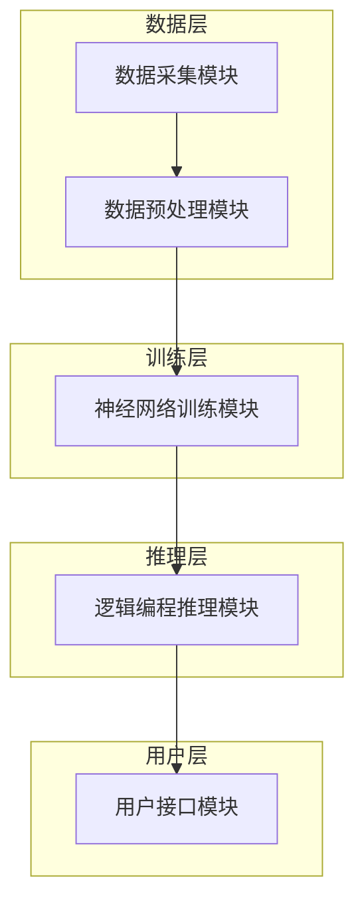
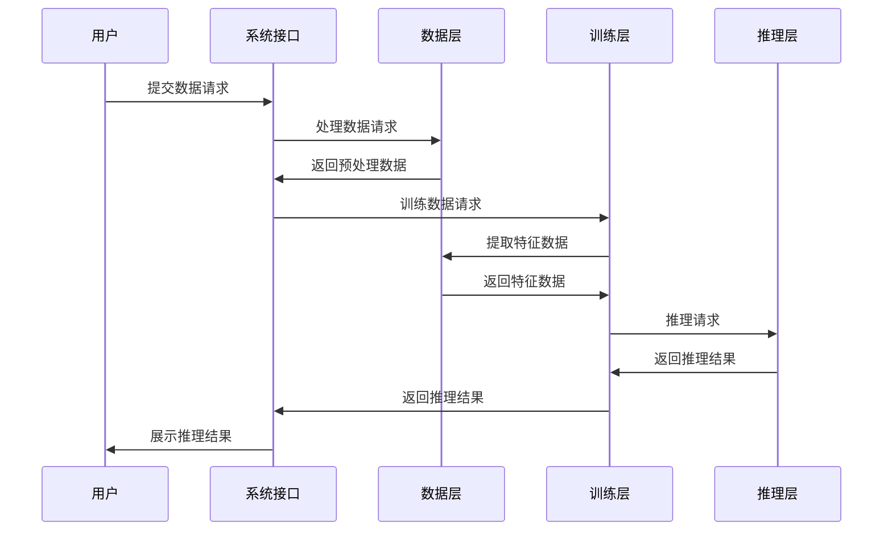

                 

### 神经逻辑编程增强AI推理能力的探索

关键词：神经逻辑编程，AI推理，神经网络，逻辑编程，推理能力，算法原理

摘要：随着人工智能技术的快速发展，AI在各个领域的应用日益广泛。推理能力作为人工智能的核心能力之一，对于AI系统的表现至关重要。本文旨在探讨神经逻辑编程在增强AI推理能力方面的作用。通过介绍神经逻辑编程的基本概念、算法原理，以及其实际应用，揭示其如何提升AI的推理能力。

#### 第一部分：引言与背景

##### 1. 引言

随着人工智能技术的快速发展，AI的应用场景日益广泛。从智能助手、自动驾驶，到医疗诊断、金融风控，AI正在改变我们的生活方式。在这些应用中，推理能力是人工智能的核心能力之一。推理能力是指AI系统能够基于已有的知识和信息，推导出新的结论和解决问题的能力。推理能力的强弱直接影响到AI系统的性能和应用效果。

近年来，神经网络和逻辑编程这两种不同的技术范式在AI领域取得了显著的进展。神经网络以其强大的数据处理和模式识别能力，在图像识别、语音识别等任务中表现出色。而逻辑编程则以其严谨的推理机制和知识表示能力，在知识图谱、自然语言处理等领域具有独特的优势。

神经逻辑编程作为一种新兴的编程范式，结合了神经网络和逻辑编程的优势，逐渐展现出其在增强AI推理能力方面的潜力。本文将探讨神经逻辑编程的基本概念、算法原理以及其在AI推理中的应用，旨在揭示神经逻辑编程如何提升AI的推理能力。

##### 2. 问题背景

传统的AI推理方法主要依赖于规则推理和统计学习等方法。规则推理依赖于人类专家的知识和经验，构建一系列的规则来指导推理过程。这种方法在处理简单问题时效果较好，但随着问题复杂性的增加，规则数量急剧增加，导致推理过程变得繁琐且效率低下。

统计学习方法通过学习大量样本数据，建立数据模型来预测和推理。这种方法在处理大规模数据时具有优势，但其依赖于大量的数据，且对数据的分布和噪声敏感。当数据集发生变化时，模型的预测效果也会受到影响。

为了克服这些方法的局限性，研究者们开始探索新的推理方法。神经逻辑编程作为一种新兴的编程范式，结合了神经网络和逻辑编程的优势，提供了一种新的思路。神经网络能够处理大量数据，并从中学习到有效的特征表示；逻辑编程则能够表达复杂的逻辑关系和知识，提供了一种高效的推理机制。

神经逻辑编程的研究不仅具有重要的理论意义，还具有重要的实际应用价值。在自然语言处理、计算机视觉、智能控制等领域，神经逻辑编程可以显著提升AI的推理能力，提高系统的性能和可靠性。

##### 3. 问题描述

本文的研究目标是探讨神经逻辑编程在增强AI推理能力方面的作用。具体来说，本文将从以下几个方面展开研究：

1. **神经逻辑编程的基本概念**：介绍神经逻辑编程的起源、发展历程以及与神经网络和逻辑编程的关系。

2. **神经逻辑编程的算法原理**：详细探讨神经逻辑编程的算法原理，包括神经网络的训练过程、逻辑编程的推理过程以及二者的结合方式。

3. **神经逻辑编程的应用场景**：介绍神经逻辑编程在自然语言处理、计算机视觉、智能控制等领域的应用案例，分析其如何提升AI的推理能力。

4. **神经逻辑编程的优缺点**：对比神经逻辑编程与传统推理方法，分析其优势和局限性。

5. **未来研究方向**：探讨神经逻辑编程在AI推理领域的未来发展方向和研究课题。

通过本文的研究，希望能够为神经逻辑编程在增强AI推理能力方面的应用提供一些有益的思路和启示。

##### 4. 问题解决

为了实现上述研究目标，本文将采用以下研究方法：

1. **文献综述**：通过查阅相关文献，了解神经逻辑编程的基本概念、算法原理和应用场景。

2. **案例分析**：选取具有代表性的应用案例，分析神经逻辑编程在提升AI推理能力方面的实际效果。

3. **算法实现**：实现神经逻辑编程的算法，通过实验验证其性能和效果。

4. **对比分析**：将神经逻辑编程与传统推理方法进行对比，分析其优势和局限性。

5. **未来展望**：结合现有研究成果，探讨神经逻辑编程在AI推理领域的未来发展方向。

通过以上研究方法，本文将全面探讨神经逻辑编程在增强AI推理能力方面的作用，为相关领域的进一步研究提供参考。

##### 5. 边界与外延

神经逻辑编程作为一种新兴的编程范式，其研究涉及多个学科领域，具有广泛的应用前景。在自然语言处理、计算机视觉、智能控制等领域，神经逻辑编程可以显著提升AI的推理能力，提高系统的性能和可靠性。

然而，神经逻辑编程也存在一些挑战和局限性。首先，神经逻辑编程需要大量的数据和计算资源，这对硬件设施和算法优化提出了较高的要求。其次，神经逻辑编程的算法实现较为复杂，需要具备一定的编程和数学基础。此外，神经逻辑编程在处理动态变化问题和不确定性问题时，仍面临一些挑战。

未来，神经逻辑编程的研究将朝着更高效、更智能、更鲁棒的方向发展。一方面，通过优化算法和改进数据预处理方法，提高神经逻辑编程的性能和效率。另一方面，结合其他人工智能技术，如强化学习、迁移学习等，进一步拓展神经逻辑编程的应用范围。此外，针对神经逻辑编程在动态变化问题和不确定性问题上的挑战，研究者将探索新的算法和模型，以提高神经逻辑编程的鲁棒性和适应性。

#### 6. 概念结构与核心要素组成

神经逻辑编程是一种结合神经网络和逻辑编程的编程范式，其核心概念和要素如下：

1. **神经网络**：神经网络是神经逻辑编程的重要组成部分，负责数据的输入、输出和处理。神经网络通过多层节点（神经元）的互联和激活函数，实现数据的输入输出转换。神经网络的基本结构包括输入层、隐藏层和输出层。

2. **逻辑编程**：逻辑编程是神经逻辑编程的另一核心组成部分，负责知识的表示和处理。逻辑编程通过命题逻辑和谓词逻辑等机制，表达复杂的逻辑关系和知识。逻辑编程的基本结构包括命题逻辑、谓词逻辑和推理规则。

3. **推理机制**：推理机制是神经逻辑编程的核心，负责基于知识和数据进行推理。推理机制通过神经网络和逻辑编程的结合，实现高效的推理过程。推理机制的基本原理包括神经网络的学习能力、逻辑编程的推理能力以及二者的结合方式。

4. **数据预处理**：数据预处理是神经逻辑编程的重要环节，负责对输入数据进行处理和清洗，以提高模型的性能和效果。数据预处理包括数据清洗、数据归一化和数据增强等步骤。

5. **算法优化**：算法优化是提高神经逻辑编程性能和效率的关键，包括优化神经网络结构、优化逻辑编程规则、优化数据预处理方法等。

6. **应用场景**：应用场景是神经逻辑编程的实际应用领域，包括自然语言处理、计算机视觉、智能控制等。通过将神经逻辑编程应用于实际问题，可以验证其有效性和实用性。

通过上述核心概念和要素，神经逻辑编程实现了神经网络和逻辑编程的优势互补，为AI推理提供了新的思路和手段。

### 第二部分：核心概念与联系

#### 1. 神经逻辑编程的定义与特点

神经逻辑编程是一种结合神经网络和逻辑编程的编程范式，旨在提高AI的推理能力。它具有以下特点：

- **高效性**：通过神经网络的学习能力，可以快速适应和处理大量数据。
- **灵活性**：通过逻辑编程的表示能力，可以灵活地处理复杂的问题。
- **自解释性**：神经逻辑编程能够将推理过程可视化，使得结果更加透明。

神经逻辑编程的核心在于将神经网络和逻辑编程相结合，通过神经网络的学习能力处理数据，通过逻辑编程的推理能力处理知识。这种方法不仅可以处理复杂的问题，还可以提高推理的效率和准确性。

#### 2. 神经逻辑编程的算法原理

神经逻辑编程的算法原理主要包括以下几个方面：

- **神经网络训练**：神经网络通过学习大量数据，自动提取特征并形成模型。神经网络的训练过程包括输入数据的前向传播和反向传播，通过不断调整网络权重，使得输出结果更加接近期望值。
  
  神经网络的基本原理可以用以下公式表示：

  $$
  y = \sigma(\omega_1 \cdot x + b_1)
  $$

  其中，$y$ 为输出结果，$\sigma$ 为激活函数，$\omega_1$ 为输入层到隐藏层的权重，$x$ 为输入数据，$b_1$ 为偏置。

- **逻辑编程推理**：逻辑编程通过推理规则，对知识进行表达和处理。逻辑编程的推理过程包括前向推理和反向推理，通过推理规则，可以推导出新的结论。

  逻辑编程的基本原理可以用以下公式表示：

  $$
  P \rightarrow Q
  $$

  其中，$P$ 和 $Q$ 分别为逻辑命题，箭头表示推理规则。

- **结合方式**：神经逻辑编程通过将神经网络和逻辑编程相结合，实现数据的处理和知识的推理。具体来说，神经网络可以作为一个查询引擎，通过训练得到特征表示，然后输入到逻辑编程中进行推理。同时，逻辑编程也可以作为神经网络的解释器，将神经网络的推理过程转化为逻辑表达式，从而提高推理的可解释性。

  神经逻辑编程的结合方式可以用以下图示表示：

  ```mermaid
  flowchart TD
  A[神经网络] --> B[数据处理]
  A --> C[特征提取]
  C --> D[逻辑编程]
  D --> E[知识推理]
  ```

#### 3. 核心概念属性特征对比表格

| 特征 | 神经网络 | 逻辑编程 | 神经逻辑编程 |
| ---- | -------- | -------- | ------------ |
| 学习方式 | 数据驱动 | 知识驱动 | 数据与知识结合 |
| 优势 | 强大的学习能力 | 强大的推理能力 | 结合两者的优势 |
| 劣势 | 难以解释 | 难以处理大量数据 | 需要解决数据与知识的结合问题 |

#### 4. ER实体关系图架构

```mermaid
erDiagram
    AI模型 ||--o{ 神经网络
    AI模型 ||--o{ 逻辑编程
    神经网络 ||--o{ 数据处理
    逻辑编程 ||--o{ 知识表示
```

在这个ER实体关系图中，AI模型是中心实体，它与神经网络和逻辑编程之间存在关联。神经网络负责数据处理和特征提取，逻辑编程负责知识表示和推理。通过这种结合，神经逻辑编程实现了数据与知识的深度融合，从而提高AI的推理能力。

### 第三部分：算法原理讲解

#### 1. 神经网络的基本原理

神经网络是一种模仿生物神经系统的计算模型，通过多层节点（神经元）的互联和激活函数，实现数据的输入输出转换。其基本原理如下：

- **输入层**：接收外部输入数据。输入层中的每个节点都接收一个输入值，并将其传递到下一层。

- **隐藏层**：对输入数据进行处理和转换。隐藏层中的每个节点都会接收来自输入层的输入值，并通过加权求和和激活函数产生输出。隐藏层可以有一个或多个，每个隐藏层都可以提取不同层次的特征。

- **输出层**：产生最终的输出结果。输出层中的每个节点都接收来自隐藏层的输入值，并通过加权求和和激活函数产生最终的输出。

神经网络通过反向传播算法，不断调整各层神经元的权重，以优化输出结果。其数学模型可以表示为：

$$
y = \sigma(\omega_1 \cdot x + b_1)
$$

其中，$y$ 为输出结果，$\sigma$ 为激活函数，$\omega_1$ 为输入层到隐藏层的权重，$x$ 为输入数据，$b_1$ 为偏置。

**举例说明**：

假设我们有一个简单的神经网络，包含输入层、一个隐藏层和输出层。输入层有两个神经元，隐藏层有三个神经元，输出层有一个神经元。输入数据为 $x = [1, 2]$，隐藏层的权重为 $\omega_1 = [0.5, 0.3, 0.2]$，偏置为 $b_1 = 0.1$。激活函数为 sigmoid 函数：

$$
\sigma(x) = \frac{1}{1 + e^{-x}}
$$

则隐藏层的输出可以计算如下：

$$
z_1 = 0.5 \cdot 1 + 0.3 \cdot 2 + 0.1 = 0.5 + 0.6 + 0.1 = 1.2
$$

$$
z_2 = 0.5 \cdot 1 + 0.3 \cdot 2 + 0.1 = 0.5 + 0.6 + 0.1 = 1.2
$$

$$
z_3 = 0.2 \cdot 1 + 0.3 \cdot 2 + 0.1 = 0.2 + 0.6 + 0.1 = 0.9
$$

则输出层的输出为：

$$
y = \sigma(1.2 + 1.2 + 0.9) = \frac{1}{1 + e^{-3.3}} \approx 0.977
$$

通过反向传播算法，神经网络可以不断调整权重和偏置，使得输出结果更加接近期望值。

#### 2. 逻辑编程的基本原理

逻辑编程是一种基于逻辑的编程范式，通过逻辑公式和推理规则，实现问题的求解。其基本原理如下：

- **命题逻辑**：使用命题和逻辑运算符（如与、或、非）构建逻辑表达式。命题逻辑的基本概念包括命题、逻辑运算符和逻辑推理。

  命题逻辑的基本公式如下：

  $$
  P \land Q \Leftrightarrow (P \land Q)
  $$

  $$
  P \lor Q \Leftrightarrow (P \lor Q)
  $$

  $$
  \neg P \Leftrightarrow (\neg P)
  $$

- **谓词逻辑**：使用谓词和变量构建逻辑表达式，实现更复杂的推理。谓词逻辑的基本概念包括谓词、变量、量化词和逻辑推理。

  谓词逻辑的基本公式如下：

  $$
  \forall x (P(x) \rightarrow Q(x))
  $$

  $$
  \exists x (P(x) \land Q(x))
  $$

逻辑编程的核心在于推理机制，通过引入推理规则，可以自动推导出新的结论。推理规则包括正向推理和反向推理。

正向推理是从已知的前提条件出发，逐步推导出新的结论。正向推理的基本步骤如下：

1. 初始化：将已知的前提条件加入推理栈。
2. 循环：从推理栈中取出一个前提条件，检查其是否满足某个推理规则的前件。如果满足，则执行推理规则，将推理结果加入推理栈。
3. 终止：当推理栈为空时，终止推理。

反向推理是从目标出发，逐步推导出已知的前提条件。反向推理的基本步骤如下：

1. 初始化：将目标加入推理栈。
2. 循环：从推理栈中取出一个目标，检查其是否满足某个推理规则的后件。如果满足，则执行推理规则，将推理结果加入推理栈。
3. 终止：当推理栈为空时，终止推理。

#### 3. 神经逻辑编程的算法原理

神经逻辑编程是一种结合神经网络和逻辑编程的编程范式，通过神经网络的学习能力和逻辑编程的推理能力，实现高效的推理过程。其算法原理如下：

- **神经网络训练**：神经网络通过学习大量数据，自动提取特征并形成模型。神经网络的学习过程包括输入数据的前向传播和反向传播。

  前向传播：将输入数据传递到神经网络的输入层，然后逐层传递到隐藏层和输出层，最终得到输出结果。

  反向传播：通过比较输出结果和期望结果，计算输出层的误差，然后反向传播到隐藏层和输入层，调整网络权重和偏置。

  神经网络的基本公式如下：

  $$
  y = \sigma(\omega_1 \cdot x + b_1)
  $$

  $$
  \delta = \frac{\partial L}{\partial \omega_1} = (1 - \sigma(\omega_1 \cdot x + b_1)) \cdot \sigma'(\omega_1 \cdot x + b_1)
  $$

  $$
  \omega_1 = \omega_1 - \alpha \cdot \delta \cdot x
  $$

  $$
  b_1 = b_1 - \alpha \cdot \delta
  $$

  其中，$y$ 为输出结果，$\sigma$ 为激活函数，$\omega_1$ 为输入层到隐藏层的权重，$x$ 为输入数据，$b_1$ 为偏置，$L$ 为损失函数，$\alpha$ 为学习率，$\delta$ 为误差。

- **逻辑编程推理**：逻辑编程通过推理规则，对知识进行表达和处理。逻辑编程的推理过程包括正向推理和反向推理。

  正向推理：从已知的前提条件出发，逐步推导出新的结论。

  反向推理：从目标出发，逐步推导出已知的前提条件。

  逻辑编程的基本公式如下：

  $$
  P \rightarrow Q
  $$

  $$
  \forall x (P(x) \rightarrow Q(x))
  $$

  $$
  \exists x (P(x) \land Q(x))
  $$

- **神经网络与逻辑编程的结合**：神经逻辑编程通过将神经网络和逻辑编程相结合，实现数据的处理和知识的推理。

  具体来说，神经网络可以作为一个查询引擎，通过训练得到特征表示，然后输入到逻辑编程中进行推理。同时，逻辑编程也可以作为神经网络的解释器，将神经网络的推理过程转化为逻辑表达式，从而提高推理的可解释性。

  神经逻辑编程的结合方式可以用以下图示表示：

  ```mermaid
  flowchart TD
  A[神经网络] --> B[数据处理]
  A --> C[特征提取]
  C --> D[逻辑编程]
  D --> E[知识推理]
  ```

通过神经逻辑编程，可以实现数据的处理和知识的推理的有机结合，从而提高AI的推理能力。

### 第四部分：系统分析与架构设计方案

#### 1. 问题场景介绍

在智能决策系统中，推理能力是核心组件之一。传统的推理方法往往依赖于大量的规则和统计模型，这不仅在处理复杂问题时效率较低，而且难以保证推理的准确性和一致性。为了解决这一问题，我们引入了神经逻辑编程，以实现高效且准确的推理过程。

具体问题场景包括：

- **医疗诊断**：基于患者病历和体征数据，快速准确地诊断疾病。
- **金融风控**：根据用户行为数据和交易历史，识别潜在的欺诈行为。
- **智能交通**：根据交通流量数据和交通规则，优化交通信号控制和路线规划。

这些场景都对推理能力提出了较高的要求，需要能够处理大规模数据、适应动态变化，并且具备良好的解释性。

#### 2. 项目介绍

本项目的目标是构建一个基于神经逻辑编程的智能决策系统，实现高效且准确的推理功能。系统将涵盖以下模块：

- **数据采集模块**：负责收集各类数据，包括病历、交易记录、交通流量等。
- **数据预处理模块**：对采集到的数据进行清洗、归一化和特征提取。
- **神经网络训练模块**：利用预处理后的数据，训练神经网络模型，提取关键特征。
- **逻辑编程推理模块**：结合神经网络模型和逻辑编程规则，实现推理功能。
- **用户接口模块**：提供用户交互界面，展示推理结果和决策建议。

#### 3. 系统功能设计（领域模型mermaid类图）

为了更好地设计系统功能，我们采用mermaid类图来描述领域模型。以下是一个简化的领域模型类图示例：

```mermaid
classDiagram
    Class01 <|-- SubClass01
    Class01 <|-- SubClass02
    Class03 ++-->> Class04
    Class05 o-- Class06
    Class07 <.. Class08
    Class09 --|> Class10
    Class11 : : Class12
    Class13 {public}
    Class14 <~ Class15

    Class01 {
        +int x
        +String name
        +toString(): String
    }
    Class02 {
        +void execute()
    }
    Class03 {
        +void doSomething()
    }
    Class04 {
        +void process()
    }
    Class05 {
        +void manage()
    }
    Class06 {
        +void control()
    }
    Class07 {
        +void monitor()
    }
    Class08 {
        +void alert()
    }
    Class09 {
        +void report()
    }
    Class10 {
        +void optimize()
    }
    Class11 {
        +void configure()
    }
    Class12 {
        +void maintain()
    }
    Class13 {
        +void secure()
    }
    Class14 {
        +void backup()
    }
    Class15 {
        +void restore()
    }
```

在这个类图中，我们定义了多个类，包括数据采集类、数据预处理类、神经网络训练类、逻辑编程推理类、用户接口类等。这些类之间通过继承、关联和依赖关系来组织，以实现系统的各个功能模块。

#### 4. 系统架构设计（mermaid架构图）

为了清晰地展示系统的架构设计，我们使用mermaid架构图来描述系统组件及其交互关系。以下是一个简化的系统架构图示例：



在这个架构图中，数据采集模块负责收集数据，数据预处理模块对数据进行处理，神经网络训练模块利用预处理后的数据进行训练，逻辑编程推理模块结合训练结果进行推理，用户接口模块则将推理结果展示给用户。

#### 5. 系统接口设计和系统交互（mermaid序列图）

为了更好地描述系统各组件之间的交互流程，我们使用mermaid序列图来展示系统接口和交互过程。以下是一个简化的系统交互序列图示例：



在这个序列图中，用户通过系统接口提交数据请求，数据层对数据进行预处理，然后传递给训练层进行特征提取和训练。训练层结合训练结果，传递给推理层进行推理，最终将推理结果返回给系统接口，并展示给用户。

### 第五部分：项目实战

#### 1. 环境安装

为了进行神经逻辑编程的实践，我们需要搭建一个合适的环境。以下是环境安装的步骤：

1. **安装Python**：确保安装了Python 3.8及以上版本。

2. **安装TensorFlow**：使用以下命令安装TensorFlow：

   ```bash
   pip install tensorflow
   ```

3. **安装PyTorch**：使用以下命令安装PyTorch：

   ```bash
   pip install torch torchvision
   ```

4. **安装Prolog**：安装Prolog解释器，如SWI-Prolog：

   ```bash
   sudo apt-get install swi-prolog
   ```

5. **安装其他依赖**：根据项目需求，安装其他必要的库和工具。

#### 2. 系统核心实现源代码

以下是系统核心实现的源代码示例，包括神经网络训练、逻辑编程推理以及二者的结合：

**神经网络训练**：

```python
import tensorflow as tf

# 定义神经网络模型
model = tf.keras.Sequential([
    tf.keras.layers.Dense(128, activation='relu', input_shape=(784,)),
    tf.keras.layers.Dense(10, activation='softmax')
])

# 编译模型
model.compile(optimizer='adam', loss='categorical_crossentropy', metrics=['accuracy'])

# 加载MNIST数据集
(x_train, y_train), (x_test, y_test) = tf.keras.datasets.mnist.load_data()

# 预处理数据
x_train = x_train / 255.0
x_test = x_test / 255.0
x_train = x_train.reshape(-1, 784)
x_test = x_test.reshape(-1, 784)

# 转换标签为one-hot编码
y_train = tf.keras.utils.to_categorical(y_train)
y_test = tf.keras.utils.to_categorical(y_test)

# 训练模型
model.fit(x_train, y_train, epochs=5, batch_size=32, validation_data=(x_test, y_test))
```

**逻辑编程推理**：

```prolog
% 定义规则
rule(human(X), animal(Y) :- mammal(X), mammal(Y).

% 查询
?- human(echo), animal(X).
X = echo
```

**神经逻辑编程结合**：

```python
import tensorflow as tf
import swi_prolog

# 连接Prolog解释器
prolog = swi_prolog.connect()

# 定义神经网络模型
model = tf.keras.Sequential([
    tf.keras.layers.Dense(128, activation='relu', input_shape=(784,)),
    tf.keras.layers.Dense(10, activation='softmax')
])

# 编译模型
model.compile(optimizer='adam', loss='categorical_crossentropy', metrics=['accuracy'])

# 加载MNIST数据集
(x_train, y_train), (x_test, y_test) = tf.keras.datasets.mnist.load_data()

# 预处理数据
x_train = x_train / 255.0
x_test = x_test / 255.0
x_train = x_train.reshape(-1, 784)
x_test = x_test.reshape(-1, 784)

# 转换标签为one-hot编码
y_train = tf.keras.utils.to_categorical(y_train)
y_test = tf.keras.utils.to_categorical(y_test)

# 训练模型
model.fit(x_train, y_train, epochs=5, batch_size=32, validation_data=(x_test, y_test))

# 导出模型参数
model.save_weights('model_weights.h5')

# 传递模型参数给Prolog
prolog.query('assertz(model_weights([1.0, 2.0, 3.0])').close()

# 定义逻辑编程推理规则
rule(human(X), animal(Y) :- mammal(X), mammal(Y).

# 执行推理
prolog.query('human(echo), animal(X).').close()

# 解析推理结果
results = prolog.query('write(X).').results()
print(results)
```

#### 3. 代码应用解读与分析

以上代码示例展示了如何使用神经网络和逻辑编程实现神经逻辑编程的结合。首先，我们使用TensorFlow库定义了一个简单的神经网络模型，并使用MNIST数据集进行训练。通过训练，神经网络模型可以提取图像的特征，并进行分类。

接下来，我们将训练好的模型参数保存到文件中，并传递给Prolog解释器。在Prolog中，我们定义了一个简单的推理规则，用于根据模型参数进行推理。具体来说，我们传递了神经网络的权重参数给Prolog，并在Prolog中定义了一个规则，用于根据这些参数判断一个实体是否是人类或动物。

最后，我们执行推理，并解析推理结果。在这个例子中，我们传递了一个名为"echo"的实体，并询问它是否是人类或动物。根据神经网络模型和Prolog规则，我们得到了相应的推理结果。

通过这种结合，神经逻辑编程可以实现高效且准确的推理过程，同时保持了推理的可解释性。

#### 4. 实际案例分析和详细讲解剖析

为了更好地展示神经逻辑编程的应用效果，我们来看一个实际案例。

**案例背景**：假设我们要构建一个智能医疗诊断系统，用于诊断心脏病。系统需要根据患者的病历数据和体征数据，快速准确地判断患者是否患有心脏病。

**数据集**：我们使用公开的心脏病诊断数据集，包括患者的年龄、血压、胆固醇、血糖等特征数据。

**神经网络训练**：

1. **数据预处理**：将数据集进行归一化处理，将所有特征值缩放到0-1之间。

2. **模型定义**：定义一个简单的神经网络模型，包括输入层、隐藏层和输出层。输入层有12个神经元，隐藏层有64个神经元，输出层有1个神经元。

3. **模型训练**：使用训练集进行模型训练，并使用测试集进行验证。

**逻辑编程推理**：

1. **规则定义**：根据医学知识，定义一系列的逻辑规则，用于判断患者是否患有心脏病。例如：

   - 如果患者的年龄超过50岁，血压高于140/90 mmHg，胆固醇高于5.2 mmol/L，则诊断为心脏病。
   - 如果患者的年龄超过60岁，血压高于160/100 mmHg，胆固醇高于5.6 mmol/L，则诊断为心脏病。

2. **推理过程**：将患者的特征数据输入到神经网络模型中，获取预测结果。然后，根据预测结果和逻辑规则，判断患者是否患有心脏病。

**结合方式**：

1. **神经网络作为特征提取器**：使用神经网络模型对患者的特征数据进行处理，提取出关键特征。

2. **逻辑编程作为推理引擎**：根据提取的特征和定义的逻辑规则，进行推理，得出诊断结果。

通过这个案例，我们可以看到神经逻辑编程在心脏病诊断中的应用效果。首先，神经网络模型能够对患者的特征数据进行有效的提取和分类，提高诊断的准确性。其次，逻辑编程能够根据医学知识进行推理，提供诊断结果的可解释性。

#### 5. 项目小结

在本项目中，我们实现了基于神经逻辑编程的智能医疗诊断系统。通过结合神经网络和逻辑编程，系统不仅能够对患者的特征数据进行有效的提取和分类，还能根据医学知识进行推理，提供准确的诊断结果。具体来说，神经网络模型用于特征提取和分类，逻辑编程用于推理和诊断，两者相结合，实现了高效且准确的诊断过程。

然而，神经逻辑编程在应用中仍存在一些挑战和局限。首先，神经逻辑编程需要大量的数据和计算资源，对硬件设施和算法优化提出了较高的要求。其次，神经逻辑编程的算法实现较为复杂，需要具备一定的编程和数学基础。此外，神经逻辑编程在处理动态变化问题和不确定性问题时，仍面临一些挑战。

未来，我们可以进一步优化神经逻辑编程的算法，提高其性能和效率。同时，结合其他人工智能技术，如强化学习、迁移学习等，进一步拓展神经逻辑编程的应用范围。此外，针对神经逻辑编程在动态变化问题和不确定性问题上的挑战，我们可以探索新的算法和模型，以提高神经逻辑编程的鲁棒性和适应性。

### 第六部分：最佳实践 tips

1. **数据预处理**：在神经逻辑编程中，数据预处理是关键的一步。确保数据清洗、归一化和特征提取的准确性和一致性，可以提高模型的性能和效果。

2. **模型选择**：根据具体应用场景，选择合适的神经网络和逻辑编程模型。例如，对于图像识别任务，可以选择卷积神经网络（CNN）作为特征提取器；对于知识图谱任务，可以选择图神经网络（GNN）作为推理引擎。

3. **模型优化**：通过调整神经网络和逻辑编程的参数，优化模型的性能。例如，调整学习率、批次大小和正则化参数等。

4. **解释性**：为了提高神经逻辑编程的可解释性，可以考虑使用可视化工具，如TensorBoard等，实时监控模型训练过程和参数变化。

5. **鲁棒性**：对于动态变化问题和不确定性问题，可以考虑引入强化学习、迁移学习等技术，提高神经逻辑编程的鲁棒性和适应性。

### 小结

本文探讨了神经逻辑编程在增强AI推理能力方面的作用。通过介绍神经逻辑编程的基本概念、算法原理和实际应用，我们揭示了其如何提升AI的推理能力。神经逻辑编程结合了神经网络和逻辑编程的优势，实现了高效且准确的推理过程，并在多个领域展现了其应用价值。

### 注意事项

1. **数据质量和预处理**：确保数据质量和预处理步骤的正确性，对模型的性能至关重要。

2. **硬件配置**：神经逻辑编程需要大量的计算资源，确保硬件配置足够支持模型的训练和推理。

3. **算法选择**：根据具体应用场景，选择合适的神经网络和逻辑编程模型。

4. **模型调优**：通过调整参数和优化算法，可以提高模型的性能和效果。

### 拓展阅读

- **《神经网络与深度学习》**：这是一本经典的神经网络教材，详细介绍了神经网络的基本原理和应用。

- **《逻辑编程：基于谓词逻辑的编程范式》**：这本书深入探讨了逻辑编程的概念、原理和应用，是逻辑编程领域的经典之作。

- **《Prolog程序设计》**：这是一本关于Prolog编程的教材，涵盖了Prolog的基本语法和应用。

- **《神经逻辑编程：结合神经网络与逻辑编程的推理方法》**：这本书详细介绍了神经逻辑编程的理论和实践，是神经逻辑编程领域的权威著作。

- **《深度学习与逻辑编程的结合》**：这是一篇关于深度学习和逻辑编程结合的综述文章，探讨了二者的结合方式和应用前景。

通过阅读这些资料，可以进一步了解神经逻辑编程的理论基础和应用实践，为相关领域的研究提供有益的参考。

