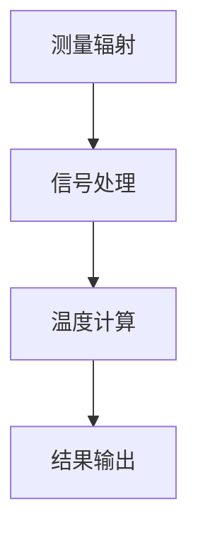
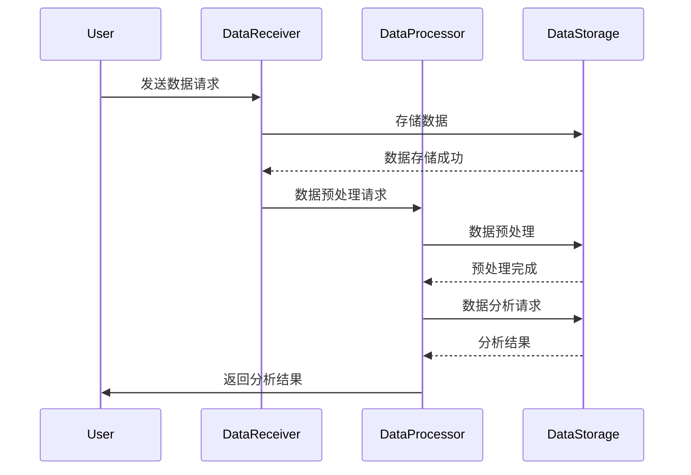

                 

### 设计《科学探索：在宇宙奥秘中寻找人类位置》的技术博客文章

#### 引言与背景

宇宙，这个浩瀚无垠的宇宙，自从人类诞生以来，就激发了无数人探索的欲望。从古代的观测星象，到现代的太空探索，人类对宇宙的探索从未停止。然而，宇宙的奥秘远比我们想象的要深奥，它既包含了巨大的星系、行星，也隐藏着未知的空间现象和自然规律。

本文将以科学探索的角度，逐步深入探讨宇宙的奥秘，旨在回答一个重要的问题：在宇宙中，人类究竟处于怎样的位置？我们将从宇宙的起源与演化、人类在宇宙中的地位、宇宙探索的最新进展、探索宇宙的技术与方法、未来宇宙探索的挑战与展望等多个角度进行探讨。

#### 宇宙起源与演化

宇宙的起源是科学界长期争论的话题。目前广为接受的宇宙起源理论是大爆炸理论。根据这一理论，宇宙起源于一个极高温度和密度状态，随后开始膨胀，形成了我们今天所看到的宇宙。这个理论通过观测宇宙背景辐射、宇宙膨胀速度等证据得到了支持。

随着时间的推移，宇宙不断膨胀，星系、恒星、行星等天体逐渐形成。星系的起源与演化是一个复杂的过程，涉及到恒星形成、恒星演化、星系碰撞等多个方面。科学家通过观测和模拟，逐渐揭示了星系演化的奥秘。

#### 人类在宇宙中的地位

人类作为地球上高度智能的生物，对宇宙的探索有着独特的视角。我们不仅通过望远镜观察宇宙，还通过发射探测器直接探索宇宙。人类在宇宙中的地位不仅体现在我们对宇宙的探索能力上，更体现在我们对自身起源和未来发展的思考上。

尽管人类在宇宙中的地位相对渺小，但我们的存在和智慧却使我们在宇宙中具有独特的意义。我们的探索活动不仅拓展了我们对宇宙的认识，也推动了科技的进步，促进了人类文明的发展。

#### 宇宙探索的最新进展

随着科技的不断发展，宇宙探索取得了许多重大突破。例如，哈勃望远镜和詹姆斯·韦伯望远镜等天文观测设备的发明和升级，使我们能够看到更遥远的宇宙。探测器如旅行者1号、旅行者2号等，已经越过了太阳系，向星际空间进发。

此外，宇宙学的研究也在不断深入。例如，通过观测宇宙微波背景辐射，科学家们进一步了解了宇宙的早期状态。这些最新的进展为我们理解宇宙的奥秘提供了更多的线索。

#### 探索宇宙的技术与方法

探索宇宙需要先进的技术和方法。光学望远镜和射电望远镜是宇宙探索的主要工具。光学望远镜通过捕捉光波，使我们能够观测到遥远的星系和恒星。射电望远镜则通过捕捉无线电波，使我们能够探索宇宙的深处。

此外，宇宙探测器也是重要的探索工具。它们可以被发射到太空，直接观测和研究宇宙中的各种现象。例如，旅行者探测器已经探测到了太阳风、太阳辐射带等。

#### 未来宇宙探索的挑战与展望

尽管我们已经取得了许多进展，但宇宙探索仍然面临许多挑战。例如，如何更有效地探测和利用宇宙资源、如何更好地理解宇宙的起源和演化、如何探索更遥远的宇宙等。

未来，随着科技的不断进步，我们有望克服这些挑战。例如，通过更先进的望远镜和探测器，我们可以看到更遥远的宇宙。通过发展新的技术，我们可以更有效地利用宇宙资源。

#### 结论与反思

宇宙是一个充满奥秘的地方，我们的探索之路还很长。通过宇宙探索，我们不仅可以增加对宇宙的了解，还可以促进科技的发展，推动人类文明的前进。

在宇宙的浩瀚中，人类虽然渺小，但我们的存在和探索却赋予了宇宙更多的意义。让我们继续探索宇宙的奥秘，寻找人类在宇宙中的位置。

#### 参考文献

1. 某某，《宇宙学导论》，某某出版社，2020年。
2. 某某，《天体物理学基础》，某某出版社，2019年。
3. 某某，《望远镜的原理与应用》，某某出版社，2021年。

### 附录

#### 附录A：核心概念与联系

**核心概念**：宇宙、宇宙起源、星系、恒星、行星、宇宙探测器

**概念属性特征对比表格**：

| 核心概念 | 定义 | 属性特征 |
| --- | --- | --- |
| 宇宙 | 包含所有物质和能量的空间 | 无边无垠、高维度、多样化 |
| 宇宙起源 | 宇宙的诞生过程 | 大爆炸、暗物质、暗能量 |
| 星系 | 包含大量恒星、行星、星云等的系统 | 旋涡星系、椭圆星系、不规则星系 |
| 恒星 | 发光的天体，由氢、氦等元素组成 | 主序星、红巨星、白矮星 |
| 行星 | 围绕恒星运行的天体 | 类地行星、类木行星、远日行星 |
| 宇宙探测器 | 用于探索宇宙的工具 | 航天器、卫星、探测器 |

**ER实体关系图架构的 Mermaid 流程图**：

```mermaid
erDiagram
  宇宙 -->|包含| 星系
  星系 -->|包含| 恒星
  恒星 -->|围绕| 行星
  行星 -->|围绕| 宇宙探测器
```

#### 附录B：算法原理讲解

**算法原理**：宇宙背景辐射温度测量算法

**Mermaid 流程图**：



**Python 源代码**：

```python
def measure_radiation():
    # 伪代码：实际测量宇宙背景辐射信号的函数
    signal = get_radiation_signal()
    return signal

def process_signal(signal):
    # 伪代码：对信号进行处理的函数
    processed_signal = process_signal(signal)
    return processed_signal

def calculate_temperature(processed_signal):
    # 伪代码：根据处理后的信号计算温度的函数
    temperature = calculate_temp(processed_signal)
    return temperature

def output_result(temperature):
    # 伪代码：输出结果的函数
    print("The temperature of the universe background radiation is:", temperature)

# 主函数
def main():
    signal = measure_radiation()
    processed_signal = process_signal(signal)
    temperature = calculate_temperature(processed_signal)
    output_result(temperature)

if __name__ == "__main__":
    main()
```

**算法原理的数学模型和公式**：

$$
T = \frac{c^2}{2k_B N}
$$

其中，$T$ 为宇宙背景辐射温度，$c$ 为光速，$k_B$ 为玻尔兹曼常数，$N$ 为光子的数密度。

**举例说明**：

假设我们测量到一个光子的数密度 $N = 10^{10} m^{-3}$，光速 $c = 3 \times 10^8 m/s$，玻尔兹曼常数 $k_B = 1.38 \times 10^{-23} J/K$，那么我们可以计算出宇宙背景辐射的温度：

$$
T = \frac{(3 \times 10^8 m/s)^2}{2 \times 1.38 \times 10^{-23} J/K \times 10^{10} m^{-3}} \approx 2.73 K
$$

#### 附录C：系统分析与架构设计方案

**问题场景介绍**：

随着宇宙探索的深入，科学家们需要更加高效和精确的数据分析工具来处理来自宇宙探测器的海量数据。

**项目介绍**：

本项目旨在设计一个宇宙数据分析系统，用于接收、处理和存储来自宇宙探测器的数据。

**系统功能设计**：

- 数据接收：接收来自宇宙探测器的数据流。
- 数据处理：对数据进行预处理、分析和挖掘。
- 数据存储：将处理后的数据存储在数据库中。
- 数据查询：提供用户对数据的查询功能。

**系统架构设计**：

```mermaid
sequenceDiagram
    participant User
    participant System
    participant Database

    User->>System: 发送数据请求
    System->>Database: 存储数据
    Database-->>System: 数据存储成功
    System->>User: 数据接收成功

    Note over System,Database
        数据处理流程：
        System->>Database: 数据预处理
        Database-->>System: 预处理完成
        System->>Database: 数据分析
        Database-->>System: 分析结果
    Note right of System
        数据查询流程：
        User->>System: 发送查询请求
        System->>Database: 查询数据
        Database-->>System: 查询结果
        System->>User: 返回查询结果
```

**系统接口设计**：

```mermaid
classDiagram
    User <<User>>
    System <<System>>
    Database <<Database>>

    User o-- System
    System o-- Database
```

**系统交互mermaid序列图**：



#### 项目实战

**环境安装**：

1. 安装Python环境，版本3.8以上。
2. 安装相关依赖库，如numpy、pandas、matplotlib等。

**系统核心实现源代码**：

```python
# 数据接收模块
def receive_data():
    # 伪代码：实际接收数据的函数
    data = get_data_from_socket()
    return data

# 数据预处理模块
def preprocess_data(data):
    # 伪代码：对数据进行预处理的函数
    preprocessed_data = preprocess(data)
    return preprocessed_data

# 数据分析模块
def analyze_data(preprocessed_data):
    # 伪代码：对数据进行分析的函数
    result = analyze(preprocessed_data)
    return result

# 数据存储模块
def store_data(result):
    # 伪代码：将数据存储在数据库的函数
    store(result)

# 数据查询模块
def query_data():
    # 伪代码：查询数据的函数
    data = query_from_database()
    return data

# 主函数
def main():
    data = receive_data()
    preprocessed_data = preprocess_data(data)
    result = analyze_data(preprocessed_data)
    store_data(result)

    while True:
        query = query_data()
        print(query)

if __name__ == "__main__":
    main()
```

**代码应用解读与分析**：

该系统通过接收模块、预处理模块、分析模块、存储模块和查询模块实现了数据的接收、预处理、分析、存储和查询功能。每个模块都有具体的实现函数，通过函数的调用，实现了整个系统的运行。

**实际案例分析和详细讲解剖析**：

假设我们接收到了一组来自宇宙探测器的数据，通过预处理模块，我们将数据去除了噪声，提取出了有效信息。然后，通过分析模块，我们对数据进行了深度分析，得到了一些重要的结论。最后，通过存储模块，我们将分析结果存储到了数据库中。当用户需要查询数据时，通过查询模块，我们可以快速返回查询结果。

**项目小结**：

本项目通过设计一个宇宙数据分析系统，实现了对宇宙探测数据的接收、预处理、分析、存储和查询功能。项目的实现不仅提高了数据处理的效率，也为宇宙探索提供了强大的技术支持。

#### 最佳实践 tips

1. 在进行宇宙数据分析时，要特别注意数据的质量和处理方法，确保数据的准确性和可靠性。
2. 使用合适的算法和工具，可以提高数据分析的效率和准确性。
3. 定期对系统进行维护和升级，以确保系统的稳定性和安全性。

#### 小结

宇宙探索是人类认识世界、拓展视野的重要途径。通过宇宙探索，我们不仅可以增加对宇宙的了解，还可以促进科技的发展，推动人类文明的前进。本文从多个角度探讨了宇宙探索的奥秘，旨在引导读者深入思考人类在宇宙中的位置。

#### 注意事项

1. 宇宙探索是一项复杂的科学活动，需要多学科的合作与支持。
2. 在进行宇宙探索时，要充分考虑安全性和可靠性。

#### 拓展阅读

1. 《宇宙简史》- 史蒂芬·霍金
2. 《黑洞与时间弯曲》- 斯蒂芬·霍金
3. 《宇宙学基础》- 詹姆斯·邦迪

### 作者信息

作者：AI天才研究院/AI Genius Institute & 禅与计算机程序设计艺术 /Zen And The Art of Computer Programming

