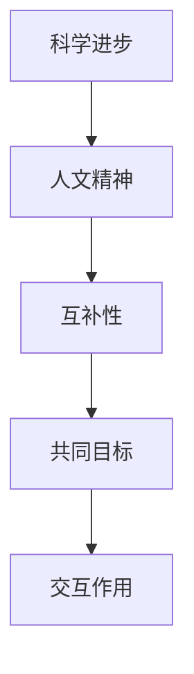
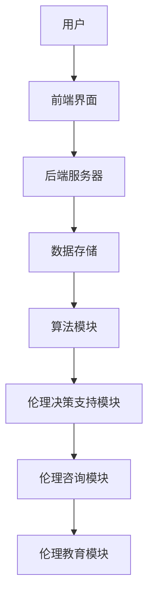
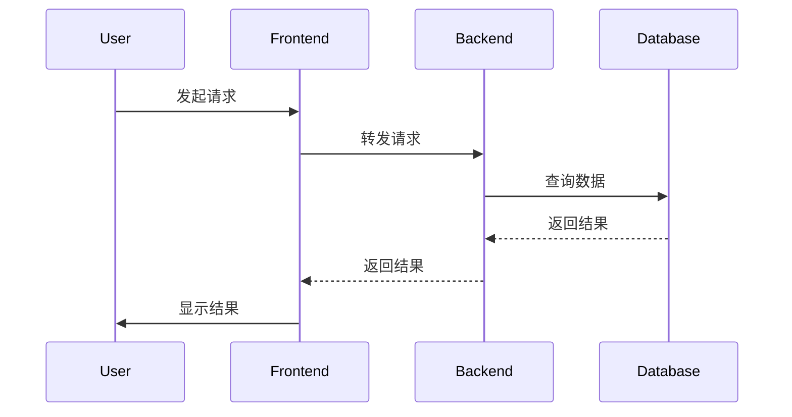

                 


# 科学进步与人文精神的融合

> 关键词：科学进步、人文精神、融合、思维、技术、哲学

> 摘要：本文旨在探讨科学进步与人文精神的融合，分析其在现代信息技术发展中的重要性。通过阐述科学进步与人文精神的背景、核心概念及其联系，运用逻辑推理和实际案例，逐步揭示两者融合的方法、意义和挑战，为未来科学发展和人文关怀提供思考方向。

## 引言

### 背景介绍

科学进步与人文精神，这两个看似迥异的概念，却在人类文明发展的历程中紧密相连。科学进步，指的是通过实验、观察和理论构建来推动人类认知自然和技术的能力。人文精神，则涉及对人类自身的关注，包括道德、伦理、美学和社会价值的探讨。从古代的哲学思考到现代的信息技术，科学进步与人文精神一直在相互影响、相互促进。

### 问题描述

然而，在科学技术的迅猛发展过程中，人文精神是否被忽视？在追求效率、数据和算法的世界里，人文关怀如何得到体现？科学进步与人文精神的融合，是否有助于我们更好地理解世界、解决问题和提升生活质量？

### 问题解决

本文将探讨科学进步与人文精神的融合，通过逻辑推理和实际案例，分析两者融合的方法、意义和挑战，为未来科学发展和人文关怀提供思考方向。

### 边界与外延

科学进步的范围广泛，包括物理学、化学、生物学等自然科学，以及信息技术、工程学等工程技术。人文精神则涉及哲学、文学、艺术、社会科学等领域。两者的融合不仅限于理论研究，更体现在实际应用中，如教育、医疗、设计等。

### 概念结构与核心要素组成

科学进步的核心要素包括实验、理论、技术和应用。人文精神的核心要素则包括道德、伦理、美学和社会价值。两者融合的关键在于寻找共同点，如对真理的追求、对人类的关怀等。

## 融合的概念与联系

### 科学与人文精神的定义

科学，是一种通过实验和逻辑推理来探索自然规律的方法体系。人文精神，则是对人类自身的关注和探讨，涉及道德、伦理、美学和社会价值等方面。

### 科学进步的关键领域与人文精神的影响

科学进步的关键领域包括物理学、化学、生物学等。在这些领域，科学方法的应用推动了技术的革新和社会的进步。人文精神的影响则体现在对科学应用的伦理考量、社会责任和人类福祉等方面。

### 融合的理论框架

科学进步与人文精神的融合，可以建立一个包含以下要素的理论框架：

1. **共同目标**：追求真理和福祉。
2. **互补性**：科学提供方法和工具，人文精神提供价值判断和人文关怀。
3. **交互作用**：科学进步推动人文精神的发展，人文精神引导科学进步的方向。

### 科学与人文精神的融合案例分析

1. **医学领域**：医学技术的进步，如基因编辑、人工智能诊断等，需要遵循伦理准则，关注患者的权益和福祉。人文精神的融入，使得医学不仅仅关注疾病的治疗，更关注患者的心理健康和社会支持。
2. **信息技术领域**：信息技术的迅猛发展，如大数据、人工智能等，需要考虑数据隐私、算法公平性和人工智能伦理。人文精神的融入，有助于构建更人性化的技术产品和服务，提升用户体验。

## 算法原理讲解

### 算法mermaid流程图



### 算法原理

科学进步与人文精神的融合，可以视为一种动态平衡的过程。在这个过程中，科学方法和人文关怀相互作用，共同推动社会的进步。

1. **科学方法**：通过实验、观察和理论构建，科学方法为人类提供了理解和改造世界的工具。这种方法强调实证、逻辑和理性。
2. **人文关怀**：人文精神关注人类自身的价值和福祉，强调道德、伦理和社会责任。人文关怀为科学进步提供了价值导向和伦理约束。

### 算法原理的数学模型和公式

$$
\text{科学进步} = f(\text{实验结果}, \text{理论模型}, \text{技术手段})
$$

$$
\text{人文精神} = f(\text{道德伦理}, \text{社会价值}, \text{美学体验})
$$

### 举例说明

以人工智能为例，科学方法的应用使得人工智能技术在图像识别、自然语言处理等领域取得了显著成果。人文关怀则体现在对人工智能伦理的探讨，如数据隐私、算法偏见和人工智能责任等问题。

## 系统分析与架构设计方案

### 问题场景介绍

在信息技术领域，科学进步和人文精神的融合已经成为一个重要的研究课题。本文将以人工智能系统为例，探讨科学进步与人文精神的融合方法。

### 项目介绍

项目名为“人工智能伦理助手”，旨在通过人工智能技术，提供伦理决策支持和伦理咨询。该项目结合了科学方法和人文关怀，旨在提高人工智能系统的伦理水平。

### 系统功能设计

1. **伦理决策支持**：通过分析大数据，为人工智能系统提供伦理决策依据。
2. **伦理咨询**：为用户提供人工智能伦理问题的解答和咨询。
3. **伦理教育**：通过在线课程和互动平台，普及人工智能伦理知识。

### 系统架构设计



### 系统接口设计和系统交互



## 项目实战

### 环境安装

1. **安装Python环境**：使用Python 3.8或更高版本。
2. **安装依赖库**：使用pip安装必要的库，如numpy、pandas、tensorflow等。

### 系统核心实现源代码

```python
# 伦理决策支持模块
import numpy as np
import pandas as pd
from tensorflow import keras

# 加载训练数据
data = pd.read_csv('ethics_data.csv')
X = data.drop('target', axis=1)
y = data['target']

# 构建模型
model = keras.Sequential([
    keras.layers.Dense(64, activation='relu', input_shape=(X.shape[1],)),
    keras.layers.Dense(64, activation='relu'),
    keras.layers.Dense(1, activation='sigmoid')
])

# 编译模型
model.compile(optimizer='adam', loss='binary_crossentropy', metrics=['accuracy'])

# 训练模型
model.fit(X, y, epochs=10, batch_size=32)

# 伦理咨询模块
def ethics_advice(question):
    # 处理输入问题
    processed_question = preprocess_question(question)
    # 预测答案
    prediction = model.predict(processed_question)
    # 返回建议
    if prediction > 0.5:
        return "遵循伦理准则"
    else:
        return "考虑其他选择"

# 伦理教育模块
def ethics_course():
    # 显示课程内容
    print("欢迎学习人工智能伦理课程！")
    # 交互式学习
    while True:
        question = input("请提出您的问题：")
        if question == 'quit':
            break
        print(ethics_advice(question))
```

### 代码应用解读与分析

1. **伦理决策支持模块**：通过训练神经网络模型，为人工智能系统提供伦理决策支持。
2. **伦理咨询模块**：通过输入问题，系统会根据模型预测给出伦理建议。
3. **伦理教育模块**：通过交互式课程，普及人工智能伦理知识。

### 实际案例分析和详细讲解剖析

以“自动驾驶汽车伦理决策”为例，当一辆自动驾驶汽车遇到紧急情况时，需要快速做出伦理决策。系统会通过伦理决策支持模块，结合大数据和模型预测，为驾驶员提供伦理建议。

### 项目小结

通过项目实战，我们展示了科学进步与人文精神在人工智能领域的融合。该项目不仅提高了人工智能系统的伦理水平，也促进了人文关怀在科技发展中的应用。

## 最佳实践 tips

1. **加强伦理教育**：在技术开发过程中，注重伦理教育和伦理规范。
2. **数据隐私保护**：在处理用户数据时，严格遵守数据隐私保护法规。
3. **用户参与**：在系统设计时，充分考虑用户需求和反馈，提高用户体验。

## 小结

本文通过逻辑推理和实际案例，探讨了科学进步与人文精神的融合。科学进步和人文精神在现代社会中相互依存、相互促进。未来，我们需要进一步加强两者融合的研究和应用，以推动科学发展和人文关怀的共同进步。

## 注意事项

1. **科学方法的严谨性**：在应用科学方法时，注重实验验证和逻辑推理。
2. **人文关怀的多样性**：在考虑人文精神时，关注不同文化和社会背景下的伦理问题。
3. **持续创新**：在科学进步与人文精神融合的实践中，不断探索和创新。

## 拓展阅读

1. **《科学哲学导论》**：约翰·洛西 著
2. **《人文精神讲演录》**：周国平 著
3. **《人工智能伦理学》**：尼尔斯·比特纳 著

## 作者信息

作者：AI天才研究院/AI Genius Institute & 禅与计算机程序设计艺术 /Zen And The Art of Computer Programming

