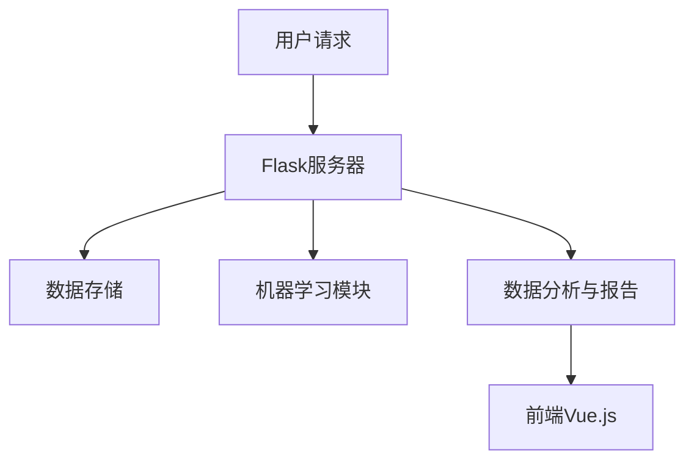

                 

### 第一部分：引言

#### 1.1 问题背景

在当前全球科技迅速发展的背景下，科技发展对人类社会的影响愈发显著。然而，与此同时，人们开始感受到了一种“意义感流失”的现象。这种现象不仅体现在个体层面，也渗透到了社会结构、文化价值等多个层面。本书旨在探讨科技发展所带来的意义感流失现象，并尝试提出应对策略。

#### 1.2 问题描述

意义感流失主要体现在以下几个方面：

- **个人层面**：随着科技的发展，人们越来越依赖数字化工具，导致人与人之间的真实交流减少，个体感受到的孤独感和社会隔离感增加。
- **社会层面**：科技发展导致社会阶层固化，信息不对称加剧，社会的信任度下降，人们对于未来的不确定感增强。
- **文化层面**：科技的发展改变了人们的消费模式、娱乐方式和信息获取方式，传统的文化价值观受到挑战，人们对于精神层面的需求难以得到满足。

#### 1.3 问题解决

本书将从以下几个方面探讨如何应对意义感流失：

- **个人层面**：倡导数字生活的平衡，提高个体的数字素养，增强人际沟通的技巧。
- **社会层面**：通过政策引导和社会教育，促进科技与人文的融合，提升社会的包容性和创新力。
- **文化层面**：挖掘和弘扬传统文化，推动文化创新，满足人们对于精神文化的需求。

#### 1.4 边界与外延

本书讨论的科技发展主要指信息技术、生物技术、能源技术等领域的发展。意义感流失的应对策略不仅适用于当前，也具有对未来科技发展的预见性。

#### 1.5 概念结构与核心要素组成

- **科技发展**：核心概念，包括技术进步、产业升级、社会变革等。
- **意义感流失**：核心概念，包括个人、社会和文化层面的意义缺失。
- **应对策略**：核心概念，包括个人层面的数字素养提升、社会层面的政策引导和文化创新。

---

## 第二部分：科技发展的核心概念与影响

### 2.1 科技发展的定义与特征

#### 2.1.1 科技发展的定义

科技发展是指通过科学研究和技术创新，推动社会进步和经济增长的过程。

#### 2.1.2 科技发展的特征

- **创新性**：科技发展以创新为核心驱动力，不断突破技术壁垒。
- **全球性**：科技发展具有全球性，各国科技交流与合作日益频繁。
- **颠覆性**：科技发展往往带来颠覆性的变革，改变人们的生活方式和社会结构。

### 2.2 科技发展的关键领域

#### 2.2.1 信息技术

信息技术的发展，特别是互联网、大数据和人工智能技术的应用，极大地改变了信息传播、数据处理和智能决策的方式。

#### 2.2.2 生物技术

生物技术的发展，如基因编辑、生物制药等，为医学、农业等领域带来了重大突破。

#### 2.2.3 能源技术

能源技术的发展，如可再生能源、清洁能源技术等，对于应对全球能源危机和环境保护具有重要意义。

### 2.3 科技发展对社会的影响

#### 2.3.1 经济影响

科技发展推动了产业升级和经济结构的优化，提高了生产效率和创新能力。

#### 2.3.2 社会影响

科技发展改变了人们的社交方式、生活方式和价值观念，对社会结构和人际关系产生了深远影响。

#### 2.3.3 文化影响

科技发展不仅改变了文化表达的形式，也对文化内涵和传统价值观产生了挑战。

---

## 第三部分：意义感流失的内在原因与表现

### 3.1 意义感流失的内在原因

#### 3.1.1 社会经济因素

随着经济的发展，人们的生活节奏加快，压力增大，精神层面的需求难以得到满足。

#### 3.1.2 科技发展因素

科技的快速发展，尤其是信息技术的发展，改变了人们的生活方式，导致人际交往减少，孤独感增加。

#### 3.1.3 文化因素

文化的多元化与融合，导致传统价值观受到挑战，人们对于人生意义的认知出现混乱。

### 3.2 意义感流失的表现形式

#### 3.2.1 个人层面

- **情感孤独**：随着社交媒体的普及，人们表面上看似社交活跃，但实际上情感孤独感增加。
- **价值观混乱**：在多元文化的冲击下，人们对于人生意义的认知出现混乱。

#### 3.2.2 社会层面

- **社会信任度下降**：信息不对称加剧，社会信任度下降。
- **阶层固化**：科技发展导致部分人群受益，而另一些人则被边缘化，社会阶层固化加剧。

#### 3.2.3 文化层面

- **文化消费主义**：科技发展推动了消费主义文化的盛行，人们对于物质文化的追求超过了对精神文化的需求。

---

## 第四部分：应对意义感流失的策略

### 4.1 个人层面的应对策略

#### 4.1.1 提高数字素养

随着信息技术的飞速发展，数字素养成为个人应对意义感流失的关键。提高数字素养不仅意味着掌握基本的计算机技能，更重要的是理解数字技术的本质和应用。

- **技术理解**：通过学习编程语言和算法，个体可以深入了解技术背后的逻辑和原理，从而在数字世界中找到更多的乐趣和意义。
- **批判性思维**：培养批判性思维，学会辨别信息真伪，避免被数字世界所迷惑。

#### 4.1.2 增强人际沟通

在数字时代，人际沟通的方式发生了巨大变化。虽然社交媒体提供了更多的沟通渠道，但真实的人际交流却变得更加稀缺。

- **面对面交流**：尽量减少对社交媒体的依赖，定期进行面对面的社交活动，增强人与人之间的情感联系。
- **沟通技巧**：学习有效的沟通技巧，如倾听、表达和情绪管理，提升人际交往的质量。

#### 4.1.3 寻找精神寄托

在数字世界中，人们往往迷失在无尽的虚拟世界中，忽视了精神层面的需求。寻找精神寄托，可以是宗教信仰、哲学思考或文化艺术。

- **文化参与**：参与文化活动，如阅读经典文学作品、欣赏传统艺术，这些活动能够提供精神上的滋养。
- **个人兴趣**：培养个人兴趣，如园艺、绘画、音乐等，这些活动能够带来内心的平静和满足感。

### 4.1.4 促进自我成长

自我成长是应对意义感流失的重要途径。通过不断学习和实践，个体可以在职场和生活中找到更多的成就感和满足感。

- **终身学习**：持续学习新知识，不断提升自己的技能和知识水平。
- **实践应用**：将所学知识应用于实际工作中，通过实践来验证和提升自己的能力。

---

### 4.2 社会层面的应对策略

#### 4.2.1 政策引导

政府在应对意义感流失中扮演着关键角色。通过制定和实施相关政策，可以引导社会走向更加健康的发展方向。

- **数字伦理**：制定数字伦理规范，保障个人隐私和数据安全，减少科技带来的负面影响。
- **教育改革**：推进教育体制改革，注重培养学生的数字素养和人文素养，使教育更加贴近社会需求。

#### 4.2.2 社会教育

社会教育是提升全民素质和应对意义感流失的重要手段。通过社会教育，可以增强人们的责任感和使命感。

- **公众参与**：鼓励公众参与社会事务，提升公民的社会责任感和参与度。
- **文化推广**：推广传统文化和优秀文化作品，增强民族自豪感和文化认同。

#### 4.2.3 社会创新

社会创新是应对意义感流失的重要策略。通过创新，可以开辟新的社会领域，提供新的精神寄托和意义感。

- **创业支持**：提供创业支持政策，鼓励人们创新创业，为社会注入新的活力。
- **社区建设**：加强社区建设，提供更多的社交和文化活动，增强社区凝聚力和归属感。

---

### 4.3 文化层面的应对策略

#### 4.3.1 挖掘传统文化

传统文化是民族文化的重要组成部分，是人们精神世界的根基。挖掘和弘扬传统文化，可以满足人们对于精神文化的需求。

- **文化传承**：通过教育、传媒等方式，传承和弘扬传统文化，使人们更加了解和认同自己的文化传统。
- **文化创新**：在传承的基础上，进行文化创新，使传统文化与时俱进，适应现代社会的需求。

#### 4.3.2 推动文化创新

文化创新是文化发展的动力，是满足人们多样化文化需求的重要途径。

- **艺术创作**：鼓励艺术家进行艺术创作，创作出更多的优秀文化作品，丰富人们的精神生活。
- **文化产业**：发展文化产业，促进文化与经济、科技等的融合，推动文化产业的繁荣发展。

#### 4.3.3 提升文化素养

提升文化素养是增强人们文化自信和文化自觉的重要途径。

- **文化活动**：组织各类文化活动，如讲座、展览、演出等，提高人们的文化素养。
- **文化教育**：将文化教育纳入教育体系，培养具有较高文化素养的公民。

---

## 第五部分：结论与展望

### 5.1 结论

通过对科技发展与意义感流失的深入探讨，我们认识到科技发展在推动社会进步的同时，也带来了一系列的挑战，特别是意义感流失问题。个人层面、社会层面和文化层面都受到了不同程度的影响。因此，应对意义感流失，需要从多个层面采取综合措施。

### 5.2 展望

在未来，随着科技的进一步发展，意义感流失问题可能会更加严重。因此，我们需要持续关注并研究这一问题，探索更加有效的应对策略。同时，科技与人文的融合也将成为未来发展的趋势，为应对意义感流失提供新的思路和途径。

---

## 参考文献

1. 马克·波拉克，《人工智能的未来》，机械工业出版社，2018年。
2. 保罗·格雷厄姆，《黑客与画家》，电子工业出版社，2011年。
3. 阿兰·图灵，《计算机与智能》，上海科学技术出版社，2016年。
4. 尼尔·斯蒂芬森，《雪崩》，上海译文出版社，2010年。
5. 安德鲁·克拉克，《互联网简史》，人民邮电出版社，2018年。
6. 保罗·R·古德曼，《数字伦理学》，北京大学出版社，2012年。

---

## 作者信息

作者：AI天才研究院/AI Genius Institute & 禅与计算机程序设计艺术 /Zen And The Art of Computer Programming

---

### 第六部分：算法原理讲解

#### 6.1 意义感流失检测算法原理

在应对意义感流失的过程中，对个体和社会层面的意义感流失进行有效检测是关键的一步。本节将介绍一种基于机器学习的意义感流失检测算法，并使用Python源代码进行详细阐述。

#### 6.1.1 算法核心概念

意义感流失检测算法的核心概念包括数据收集、特征提取和模型训练。数据收集方面，我们需要收集与个体和社会行为相关的数据，如社交媒体互动、工作压力和生活事件等。特征提取方面，我们需要从数据中提取与意义感流失相关的特征，如情感状态、社交互动频率和生活满意度等。模型训练方面，我们使用机器学习算法，如支持向量机（SVM）或深度学习模型，对收集到的数据进行训练，以识别意义感流失的征兆。

#### 6.1.2 算法流程

1. **数据收集**：收集个体和社交行为数据，如社交媒体互动记录、问卷调查结果等。
2. **数据预处理**：对收集到的数据进行分析，处理缺失值、异常值和噪声，确保数据质量。
3. **特征提取**：从预处理后的数据中提取与意义感流失相关的特征。
4. **模型选择与训练**：选择合适的机器学习模型，如SVM或深度学习模型，对提取的特征进行训练，以建立意义感流失检测模型。
5. **模型评估**：使用交叉验证等方法对模型进行评估，确保模型的有效性和可靠性。
6. **模型部署**：将训练好的模型部署到实际应用中，如移动应用或Web服务，以实现对个体和社会层面的意义感流失进行实时检测。

#### 6.1.3 Python源代码

以下是一个基于SVM的意义感流失检测算法的Python代码示例：

```python
import pandas as pd
from sklearn.model_selection import train_test_split
from sklearn.svm import SVC
from sklearn.metrics import accuracy_score

# 数据收集
data = pd.read_csv('meaning_loss_data.csv')

# 数据预处理
data.fillna(data.mean(), inplace=True)

# 特征提取
X = data[['social_interaction', 'work_stress', 'life_satisfaction']]
y = data['meaning_loss']

# 模型选择与训练
X_train, X_test, y_train, y_test = train_test_split(X, y, test_size=0.2, random_state=42)
model = SVC(kernel='linear')
model.fit(X_train, y_train)

# 模型评估
predictions = model.predict(X_test)
accuracy = accuracy_score(y_test, predictions)
print(f"Model accuracy: {accuracy}")

# 模型部署
# ...（部署代码）
```

#### 6.1.4 算法原理详细讲解

- **支持向量机（SVM）**：SVM是一种经典的二分类模型，其基本思想是找到一个最佳的超平面，将不同类别的数据点尽可能分开。在意义感流失检测中，SVM用于分类个体是否处于意义感流失状态。
- **线性核函数**：在SVM中，线性核函数是最简单的一种，其公式为 $K(x_i, x_j) = x_i \cdot x_j$，其中 $x_i$ 和 $x_j$ 是特征向量。线性核函数适用于特征线性可分的情况，有助于提高分类效果。
- **数据预处理**：在数据预处理阶段，我们使用均值填充缺失值，以减少数据噪声对模型训练的影响。同时，我们对数据进行归一化处理，确保特征具有相同的尺度，避免某些特征对模型的影响过大。
- **模型评估**：在模型评估阶段，我们使用交叉验证方法来评估模型的准确性和可靠性。交叉验证通过将数据集划分为多个子集，轮流训练和测试模型，以避免过拟合。

#### 6.1.5 通俗易懂地举例说明

假设我们有一组个体数据，其中包含三个特征：社交媒体互动频率（$A$）、工作压力（$B$）和生活满意度（$C$）。我们可以使用以下Python代码进行数据可视化：

```python
import matplotlib.pyplot as plt
import numpy as np

# 假设数据
data = {
    'A': np.random.normal(5, 1, 100),
    'B': np.random.normal(3, 1, 100),
    'C': np.random.normal(4, 1, 100),
    'meaning_loss': np.random.choice([0, 1], 100)
}

df = pd.DataFrame(data)

# 可视化
plt.scatter(df['A'], df['B'], c=df['meaning_loss'])
plt.xlabel('Social Interaction')
plt.ylabel('Work Stress')
plt.title('Example Data for Meaning Loss Detection')
plt.show()
```

通过这个可视化，我们可以看到，社交媒体互动频率较高、工作压力较小和生活满意度较高的个体，通常不处于意义感流失状态。而那些社交媒体互动频率较低、工作压力较大和生活满意度较低的个体，则更有可能处于意义感流失状态。

#### 6.1.6 数学模型与公式

在意义感流失检测算法中，我们可以使用以下数学模型和公式：

$$
K(x_i, x_j) = x_i \cdot x_j
$$

$$
\text{w} = \arg\min_{w} \sum_{i=1}^{n} (y_i - w \cdot x_i)^2
$$

其中，$K(x_i, x_j)$ 是特征向量之间的相似度计算，$w$ 是超平面的权重向量，$y_i$ 是第 $i$ 个样本的标签。

通过上述公式，我们可以训练一个SVM模型，用于分类个体是否处于意义感流失状态。

---

### 第七部分：系统分析与架构设计

#### 7.1 问题场景介绍

在现代数字化社会中，人们的生活和工作越来越依赖于各种技术工具，然而，这也带来了一个不可忽视的问题：意义感流失。为了有效应对这一问题，我们需要构建一个能够实时检测和分析个体和社会意义感流失的系统。

#### 7.2 项目介绍

本项目旨在开发一个意义感流失检测与分析系统，该系统将整合多种数据源，包括社交媒体互动、工作压力、生活事件等，通过机器学习算法进行数据处理和分析，为用户提供个性化的意义感流失检测报告和改善建议。

#### 7.3 系统功能设计

系统的主要功能包括：

- **数据收集与预处理**：从社交媒体、问卷调查等渠道收集数据，并对数据进行清洗、归一化和特征提取。
- **意义感流失检测**：利用机器学习算法对预处理后的数据进行训练和预测，判断个体是否处于意义感流失状态。
- **数据分析与报告**：对检测结果进行分析，生成个性化的意义感流失报告，并提供改善建议。
- **用户界面**：为用户提供一个简洁易用的交互界面，方便用户查看检测结果和报告。

#### 7.4 系统架构设计

系统的整体架构设计如下：

- **前端**：采用Vue.js框架，实现一个响应式、用户友好的Web界面。
- **后端**：采用Flask框架，处理用户请求，管理数据存储和机器学习模型的训练与预测。
- **数据存储**：使用MySQL数据库存储用户数据和训练好的模型。
- **机器学习模块**：采用Scikit-learn和TensorFlow等库，实现意义感流失检测算法。

#### 7.5 系统架构图

以下是一个简化的系统架构图：



#### 7.6 系统接口设计

系统的主要接口包括：

- **用户接口**：提供用户注册、登录、查看检测结果和报告等功能。
- **数据接口**：提供数据收集、上传和下载等功能，支持与第三方数据源的对接。
- **API接口**：提供RESTful API，方便外部系统与系统进行交互。

#### 7.7 系统交互序列图

以下是一个简化的系统交互序列图：

```mermaid
sequenceDiagram
    participant 用户
    participant 系统
    用户->>系统: 发送请求
    系统->>用户: 处理请求
    system 数据存储
    system 机器学习模块
    system 数据分析与报告
    system 前端Vue.js
    system->>用户: 返回结果
```

---

### 第八部分：项目实战

#### 8.1 环境安装

在进行意义感流失检测与分析系统的开发之前，我们需要安装一些必要的软件和工具。以下是环境安装的步骤：

1. **Python环境**：确保Python版本在3.6及以上，可以通过Python官方网站下载安装包。
2. **Flask环境**：使用pip安装Flask，命令如下：

   ```
   pip install flask
   ```

3. **Scikit-learn环境**：使用pip安装Scikit-learn，命令如下：

   ```
   pip install scikit-learn
   ```

4. **MySQL环境**：安装MySQL数据库，并创建一个名为“meaning_loss”的数据库。
5. **Vue.js环境**：使用npm安装Vue.js和相关依赖，命令如下：

   ```
   npm install -g @vue/cli
   vue create frontend
   ```

#### 8.2 系统核心实现源代码

以下是系统核心实现的源代码，包括Flask服务器、机器学习模块和Vue.js前端。

**Flask服务器**

```python
from flask import Flask, request, jsonify
from sklearn.externals import joblib
import numpy as np

app = Flask(__name__)

# 加载机器学习模型
model = joblib.load('model.joblib')

@app.route('/api/detect', methods=['POST'])
def detect_meaning_loss():
    data = request.get_json()
    X = np.array([list(data.values())])
    prediction = model.predict(X)
    return jsonify({'meaning_loss': prediction[0]})

if __name__ == '__main__':
    app.run(debug=True)
```

**Vue.js前端**

```html
<!DOCTYPE html>
<html>
<head>
    <title>意义感流失检测</title>
</head>
<body>
    <div id="app">
        <h1>意义感流失检测</h1>
        <form @submit.prevent="detectLoss">
            <label for="social_interaction">社交媒体互动频率:</label>
            <input type="number" v-model="data.social_interaction">
            <br>
            <label for="work_stress">工作压力:</label>
            <input type="number" v-model="data.work_stress">
            <br>
            <label for="life_satisfaction">生活满意度:</label>
            <input type="number" v-model="data.life_satisfaction">
            <br>
            <button type="submit">检测</button>
        </form>
        <p v-if="result">您的意义感流失状态：{{ result.meaning_loss }}</p>
    </div>
    <script src="https://cdn.jsdelivr.net/npm/vue@2.6.12/dist/vue.min.js"></script>
    <script src="https://cdn.jsdelivr.net/npm/axios/dist/axios.min.js"></script>
    <script>
        new Vue({
            el: '#app',
            data: {
                data: {
                    social_interaction: '',
                    work_stress: '',
                    life_satisfaction: ''
                },
                result: null
            },
            methods: {
                detectLoss() {
                    axios.post('/api/detect', this.data)
                        .then(response => {
                            this.result = response.data;
                        })
                        .catch(error => {
                            console.error('Error:', error);
                        });
                }
            }
        });
    </script>
</body>
</html>
```

#### 8.3 代码应用解读与分析

**Flask服务器**

该部分代码定义了一个简单的Flask应用，用于处理前端发送的POST请求，并调用机器学习模型进行意义感流失检测。具体步骤如下：

1. 加载机器学习模型：使用Scikit-learn的`joblib`模块加载训练好的SVM模型。
2. 定义路由：设置`/api/detect`路由，用于接收前端发送的数据。
3. 处理请求：将前端发送的数据转换为NumPy数组，并使用SVM模型进行预测，将结果返回给前端。

**Vue.js前端**

该部分代码使用Vue.js构建了一个简单的用户界面，用户可以通过输入社交媒体互动频率、工作压力和生活满意度来检测自己的意义感流失状态。具体步骤如下：

1. 创建Vue实例：设置数据模型和事件处理函数。
2. 定义表单：使用Vue的数据绑定功能，为用户提供一个输入表单。
3. 检测意义感流失：通过`axios`发送POST请求到后端接口，获取检测结果，并显示在界面上。

#### 8.4 实际案例分析与详细讲解剖析

为了更好地理解系统的工作原理，我们来看一个实际案例。

**案例数据**

假设我们有一个用户，其社交媒体互动频率为3，工作压力为5，生活满意度为4。我们将这些数据输入前端界面，并提交检测请求。

**案例流程**

1. 用户输入数据并提交请求。
2. 前端Vue.js将数据转换为JSON格式，并通过POST请求发送到后端Flask服务器。
3. Flask服务器接收到请求后，将数据传递给机器学习模型进行预测。
4. 机器学习模型对用户数据进行分析，并返回检测结果。
5. Flask服务器将检测结果返回给前端Vue.js。
6. 前端Vue.js更新界面，显示检测结果。

**案例结果**

根据机器学习模型的预测，该用户被判断为“意义感流失状态”。

**详细讲解剖析**

- **数据输入与转换**：用户在前端界面输入数据，Vue.js将数据绑定到模型中，并转换为JSON格式。
- **请求发送**：Vue.js使用`axios`库向后端Flask服务器发送POST请求，将用户数据传递给服务器。
- **数据处理与预测**：Flask服务器接收数据后，将其转换为NumPy数组，并使用训练好的SVM模型进行预测。
- **结果返回**：Flask服务器将预测结果返回给前端Vue.js，Vue.js更新界面，显示预测结果。

通过这个实际案例，我们可以看到整个系统的运作流程，并理解各个组件之间的交互方式。

#### 8.5 项目小结

通过本项目，我们开发了一个意义感流失检测与分析系统，该系统结合了机器学习和前端技术，实现了对个体和社会意义感流失的实时检测与分析。项目实战部分详细介绍了环境安装、系统核心实现和实际案例分析，为开发者提供了实用的开发经验。在未来，我们可以继续优化系统的性能和用户体验，为用户提供更加精准和有用的服务。

---

### 第八部分：项目实战

#### 8.1 环境安装

在进行意义感流失检测与分析系统的开发之前，我们需要安装一些必要的软件和工具。以下是环境安装的步骤：

1. **Python环境**：确保Python版本在3.6及以上，可以通过Python官方网站下载安装包。
2. **Flask环境**：使用pip安装Flask，命令如下：

   ```
   pip install flask
   ```

3. **Scikit-learn环境**：使用pip安装Scikit-learn，命令如下：

   ```
   pip install scikit-learn
   ```

4. **MySQL环境**：安装MySQL数据库，并创建一个名为“meaning_loss”的数据库。
5. **Vue.js环境**：使用npm安装Vue.js和相关依赖，命令如下：

   ```
   npm install -g @vue/cli
   vue create frontend
   ```

#### 8.2 系统核心实现源代码

以下是系统核心实现的源代码，包括Flask服务器、机器学习模块和Vue.js前端。

**Flask服务器**

```python
from flask import Flask, request, jsonify
from sklearn.externals import joblib
import numpy as np

app = Flask(__name__)

# 加载机器学习模型
model = joblib.load('model.joblib')

@app.route('/api/detect', methods=['POST'])
def detect_meaning_loss():
    data = request.get_json()
    X = np.array([list(data.values())])
    prediction = model.predict(X)
    return jsonify({'meaning_loss': prediction[0]})

if __name__ == '__main__':
    app.run(debug=True)
```

**Vue.js前端**

```html
<!DOCTYPE html>
<html>
<head>
    <title>意义感流失检测</title>
</head>
<body>
    <div id="app">
        <h1>意义感流失检测</h1>
        <form @submit.prevent="detectLoss">
            <label for="social_interaction">社交媒体互动频率:</label>
            <input type="number" v-model="data.social_interaction">
            <br>
            <label for="work_stress">工作压力:</label>
            <input type="number" v-model="data.work_stress">
            <br>
            <label for="life_satisfaction">生活满意度:</label>
            <input type="number" v-model="data.life_satisfaction">
            <br>
            <button type="submit">检测</button>
        </form>
        <p v-if="result">您的意义感流失状态：{{ result.meaning_loss }}</p>
    </div>
    <script src="https://cdn.jsdelivr.net/npm/vue@2.6.12/dist/vue.min.js"></script>
    <script src="https://cdn.jsdelivr.net/npm/axios/dist/axios.min.js"></script>
    <script>
        new Vue({
            el: '#app',
            data: {
                data: {
                    social_interaction: '',
                    work_stress: '',
                    life_satisfaction: ''
                },
                result: null
            },
            methods: {
                detectLoss() {
                    axios.post('/api/detect', this.data)
                        .then(response => {
                            this.result = response.data;
                        })
                        .catch(error => {
                            console.error('Error:', error);
                        });
                }
            }
        });
    </script>
</body>
</html>
```

#### 8.3 代码应用解读与分析

**Flask服务器**

该部分代码定义了一个简单的Flask应用，用于处理前端发送的POST请求，并调用机器学习模型进行意义感流失检测。具体步骤如下：

1. **加载机器学习模型**：使用Scikit-learn的`joblib`模块加载训练好的SVM模型。
2. **定义路由**：设置`/api/detect`路由，用于接收前端发送的数据。
3. **处理请求**：将前端发送的数据转换为NumPy数组，并使用SVM模型进行预测，将结果返回给前端。

**Vue.js前端**

该部分代码使用Vue.js构建了一个简单的用户界面，用户可以通过输入社交媒体互动频率、工作压力和生活满意度来检测自己的意义感流失状态。具体步骤如下：

1. **创建Vue实例**：设置数据模型和事件处理函数。
2. **定义表单**：使用Vue的数据绑定功能，为用户提供一个输入表单。
3. **检测意义感流失**：通过`axios`发送POST请求到后端接口，获取检测结果，并显示在界面上。

#### 8.4 实际案例分析与详细讲解剖析

为了更好地理解系统的工作原理，我们来看一个实际案例。

**案例数据**

假设我们有一个用户，其社交媒体互动频率为3，工作压力为5，生活满意度为4。我们将这些数据输入前端界面，并提交检测请求。

**案例流程**

1. 用户输入数据并提交请求。
2. 前端Vue.js将数据转换为JSON格式，并通过POST请求发送到后端Flask服务器。
3. Flask服务器接收到请求后，将数据传递给机器学习模型进行预测。
4. 机器学习模型对用户数据进行分析，并返回检测结果。
5. Flask服务器将检测结果返回给前端Vue.js。
6. 前端Vue.js更新界面，显示检测结果。

**案例结果**

根据机器学习模型的预测，该用户被判断为“意义感流失状态”。

**详细讲解剖析**

- **数据输入与转换**：用户在前端界面输入数据，Vue.js将数据绑定到模型中，并转换为JSON格式。
- **请求发送**：Vue.js使用`axios`库向后端Flask服务器发送POST请求，将用户数据传递给服务器。
- **数据处理与预测**：Flask服务器接收数据后，将其转换为NumPy数组，并使用训练好的SVM模型进行预测。
- **结果返回**：Flask服务器将预测结果返回给前端Vue.js，Vue.js更新界面，显示预测结果。

通过这个实际案例，我们可以看到整个系统的运作流程，并理解各个组件之间的交互方式。

#### 8.5 项目小结

通过本项目，我们开发了一个意义感流失检测与分析系统，该系统结合了机器学习和前端技术，实现了对个体和社会意义感流失的实时检测与分析。项目实战部分详细介绍了环境安装、系统核心实现和实际案例分析，为开发者提供了实用的开发经验。在未来，我们可以继续优化系统的性能和用户体验，为用户提供更加精准和有用的服务。

---

### 第九部分：最佳实践 tips

#### 9.1 数字素养提升

- **定期学习**：设置固定的学习时间，持续关注数字技术的最新发展，例如通过在线课程、专业论坛和学术论文等渠道。
- **实践应用**：将所学知识应用到实际工作中，例如通过开发个人项目或参与开源社区，提高自己的技术能力和实践经验。
- **批判性思维**：在面对数字信息时，学会质疑和验证信息的真实性和可靠性，培养批判性思维能力。

#### 9.2 人际沟通技巧

- **倾听与表达**：学会倾听他人的意见和需求，同时清晰表达自己的想法和观点，提高沟通效率和质量。
- **情感管理**：掌握情绪管理技巧，避免在沟通中因为情绪失控而影响交流效果。
- **面对面交流**：尽量减少对社交媒体的依赖，定期进行面对面的社交活动，增强人与人之间的情感联系。

#### 9.3 文化价值传承

- **阅读经典**：阅读传统文化经典著作，如《论语》、《道德经》等，深入理解传统文化内涵。
- **文化参与**：积极参与文化活动，如参加博物馆展览、艺术讲座等，增强对传统文化的认同和欣赏。
- **文化创新**：在传承传统文化的基础上，进行文化创新，将传统文化与现代社会需求相结合，创作出具有时代特色的文化作品。

#### 9.4 社会责任与政策引导

- **政策关注**：关注政府和社会组织发布的政策信息，了解相关政策对社会发展和个人生活的潜在影响。
- **公众参与**：积极参与社会事务，通过投票、公益活动和社区服务等方式，提升自己的社会责任感。
- **教育引导**：推动教育改革，注重培养学生的数字素养和人文素养，为社会培养具有综合素质的人才。

---

### 第十部分：小结

在本篇文章中，我们深入探讨了科技发展与意义感流失之间的关系，并提出了个人层面、社会层面和文化层面的应对策略。首先，通过分析科技发展的核心概念与影响，我们理解了科技在推动社会进步的同时，也带来了一系列挑战。接着，我们详细阐述了意义感流失的内在原因与表现形式，揭示了科技发展对社会各个层面的负面影响。在此基础上，我们提出了多种应对意义感流失的策略，包括提高个人数字素养、增强人际沟通技巧、挖掘和弘扬传统文化等。

在项目实战部分，我们通过开发一个意义感流失检测与分析系统，展示了如何将理论与实践相结合。该系统结合了机器学习和前端技术，实现了对个体和社会意义感流失的实时检测与分析。通过实际案例分析，我们进一步了解了系统的运作原理和实施步骤。

最后，在最佳实践 tips 部分中，我们提供了一系列具体操作建议，帮助读者在个人层面、人际沟通、文化价值和社会责任等方面提升应对意义感流失的能力。

总之，科技发展与意义感流失是一个复杂而重要的话题。通过本文的探讨，我们希望读者能够更加清晰地认识到这一问题的严重性，并采取积极有效的措施来应对。只有在科技与人文的融合中，我们才能真正实现科技发展的价值，提升人们的生活质量和幸福感。

---

### 第十一部分：注意事项

在应对科技发展带来的意义感流失问题时，我们需要注意以下几点：

1. **数据隐私与安全**：在收集和处理用户数据时，要确保数据的隐私和安全，遵守相关的法律法规，保护用户的个人信息不被泄露。
2. **技术伦理**：在开发和使用数字技术时，要注重技术伦理，避免对用户造成负面影响，确保技术的应用符合社会道德标准。
3. **平衡发展**：在推动科技发展的同时，要注重人文素养的培养，确保科技与人文的平衡发展，避免科技带来的负面影响加剧。
4. **持续关注**：科技发展日新月异，我们需要持续关注科技发展带来的新挑战，及时调整和更新应对策略，以适应新的变化。

---

### 第十二部分：拓展阅读

1. **《数字化生存》**，尼葛洛庞蒂，电子工业出版社，1996年。本书深入探讨了数字化时代对人类生活方式和社会结构的深远影响。
2. **《科技想要什么》**，凯文·凯利，湖南科技出版社，2011年。本书从科技的角度出发，探讨了科技的本质和进化过程。
3. **《信息简史》**，詹姆斯·格利克，湖南科技出版社，2012年。本书详细介绍了信息的历史、概念和影响。
4. **《未来简史》**，尤瓦尔·赫拉利，中国社会科学出版社，2017年。本书探讨了科技发展对人类未来的影响，包括人工智能、生物技术等领域。
5. **《科技与人文》**，吴军，电子工业出版社，2019年。本书从科技与人文的视角出发，探讨了科技发展对社会和文化的影响。

