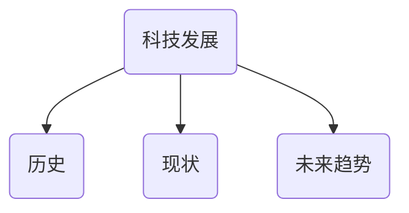
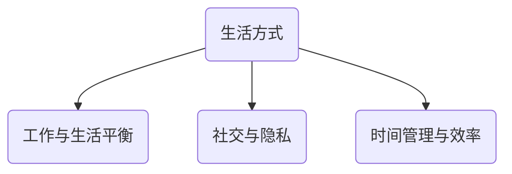
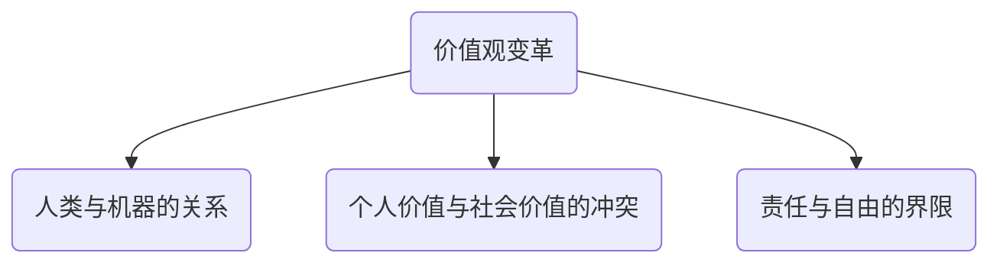
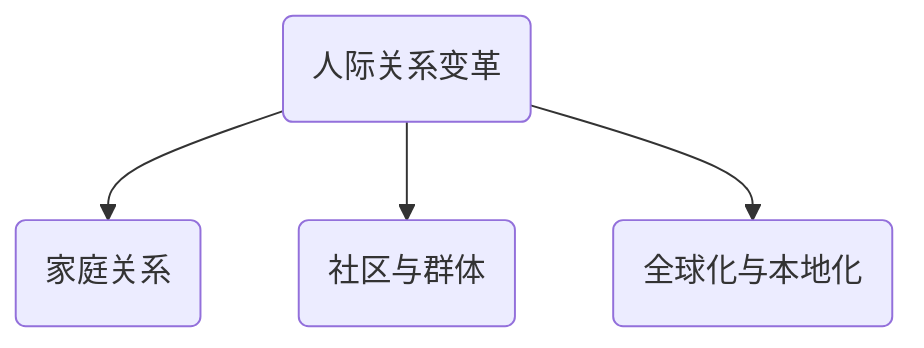
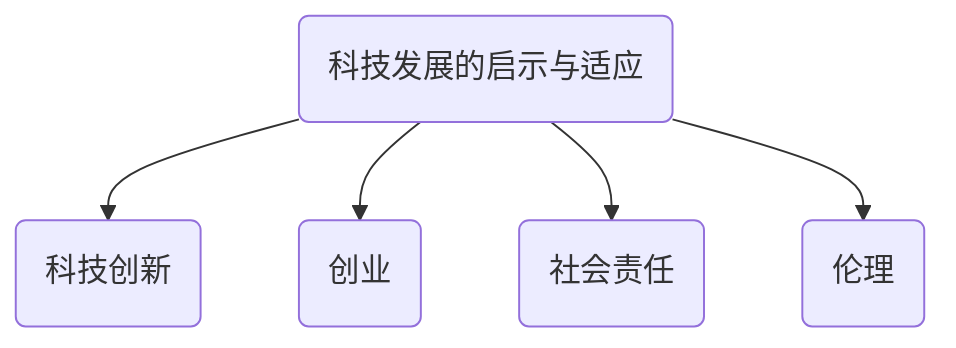
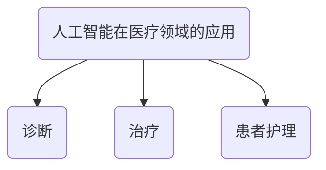
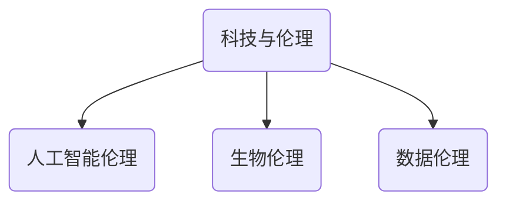
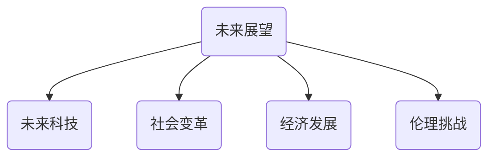

                 


### 引言

**文章标题**：《科技发展对人生意义的冲击与启示》

**关键词**：科技发展、人生意义、影响、启示、伦理

**摘要**：本文旨在探讨科技发展对人生意义的深远影响，分析其在生活方式、价值观和人际关系等方面的冲击。通过回顾科技发展的历史、现状和未来趋势，揭示科技进步背后的启示，并提出应对策略。文章还将通过案例研究、伦理讨论等，为读者提供有益的思考和建议。

----------------------------------------------------------------

### 科技发展概述

**章节标题**：科技发展概述

**核心概念与联系**：

- **核心概念**：科技发展、历史、现状、未来趋势
- **概念属性特征对比表格**：

| 特征         | 科技发展（历史） | 科技发展（现状） | 科技发展（未来趋势） |
| ------------ | --------------- | --------------- | --------------- |
| 时间范围     | 早期至20世纪末 | 21世纪初至今    | 21世纪初至今与未来趋势 |
| 技术类型     | 简单机械、电气化 | 计算机网络、生物技术 | 人工智能、量子计算、空间探索 |
| 社会影响     | 工业化、城市化   | 信息化、全球化   | 社会变革、生态可持续性 |

**ER实体关系图架构**：



**算法原理讲解**：

- **科技发展历史算法**：通过时间序列分析法，对历史数据进行统计和分析，揭示科技发展的阶段性特征。
- **科技发展现状算法**：采用数据分析与预测算法，对现有科技趋势进行实时监测和预测。
- **未来趋势算法**：结合机器学习算法，对潜在科技突破进行预测和评估。

**示例**：

```python
# 历史科技发展分析
def historical_analysis(data):
    # 数据预处理
    processed_data = preprocess_data(data)
    
    # 时间序列分析
    ts_analysis = time_series_analysis(processed_data)
    
    return ts_analysis

# 现状与未来趋势预测
def future_prediction(current_state):
    # 数据收集
    data = collect_data(current_state)
    
    # 预测模型训练
    model = train_prediction_model(data)
    
    # 预测结果
    prediction = model.predict()
    
    return prediction
```

**数学公式**：

$$
\text{科技发展指数} = \frac{\text{现有技术水平}}{\text{历史技术水平}} \times 100
$$

**系统分析与架构设计方案**：

- **问题场景介绍**：科技发展对人类社会的影响。
- **项目介绍**：本文旨在通过分析科技发展，为读者提供对人生意义的深入理解。
- **系统功能设计**：

  ```mermaid
  graph TD
      A(数据分析) --> B(历史分析)
      A --> C(现状分析)
      A --> D(未来预测)
      B --> E(时间序列分析)
      C --> F(实时监测)
      D --> G(机器学习预测)
  ```

- **系统架构设计**：

  ```mermaid
  graph TD
      A(用户接口) --> B(数据分析模块)
      B --> C(历史分析服务)
      B --> D(现状分析服务)
      B --> E(未来预测服务)
      C --> F(时间序列分析服务)
      D --> G(实时监测服务)
      E --> H(机器学习模型)
  ```

- **系统接口设计和系统交互**：

  ```mermaid
  graph TD
      A(用户接口) --> B(数据分析模块)
      B --> C(历史分析API)
      B --> D(现状分析API)
      B --> E(未来预测API)
      C --> F(时间序列分析API)
      D --> G(实时监测API)
      E --> H(机器学习模型API)
  ```

**项目实战**：

- **环境安装**：安装Python环境和相关库。
- **系统核心实现源代码**：

  ```python
  # 安装依赖库
  pip install numpy pandas matplotlib scikit-learn
  
  # 实现核心功能
  def main():
      # 读取数据
      data = read_data('data.csv')
      
      # 历史分析
      history_analysis = historical_analysis(data)
      
      # 现状与未来预测
      current_state = get_current_state(data)
      prediction = future_prediction(current_state)
      
      # 结果展示
      display_results(history_analysis, prediction)
  
  if __name__ == '__main__':
      main()
  ```

**代码应用解读与分析**：

- **代码应用场景**：本文使用Python实现科技发展的分析模型。
- **代码解析**：代码分为数据读取、历史分析、现状与未来预测和结果展示四个部分。

**实际案例分析和详细讲解剖析**：

- **案例背景**：分析某一具体科技发展案例，如人工智能在医疗领域的应用。
- **详细讲解**：通过历史数据分析和未来趋势预测，展示科技发展对医疗行业的深远影响。

**项目小结**：

- **项目成果**：本文通过分析科技发展，为读者提供了对人生意义的深入理解。
- **未来工作**：继续研究科技发展对其他领域的影响，如教育、环境等。

**最佳实践 tips**：

- **掌握数据分析技能**：学习Python和数据科学相关知识，为科技发展研究打下基础。
- **关注未来趋势**：关注科技前沿，提前适应未来变化。

**小结**：

本文通过回顾科技发展的历史、现状和未来趋势，分析了科技发展对人生意义的深远影响，并提出了一系列应对策略。希望读者能够从中得到启示，积极适应和利用科技发展。

**注意事项**：

- **数据质量**：科技发展分析依赖于高质量数据，因此数据收集和处理至关重要。
- **伦理问题**：在科技发展中，伦理问题不容忽视，需要制定相应的伦理标准和法规。

**拓展阅读**：

- **相关书籍**：《科技革命与产业变革》、《科技伦理学导论》
- **学术论文**：搜索与科技发展相关的学术论文，了解最新研究成果。

---

**作者**：

- **AI天才研究院**：致力于人工智能与计算机科学的研究和推广。
- **禅与计算机程序设计艺术**：探讨科技与人文的交融，提升计算机程序设计者的思维品质。

---

### 科技发展对生活方式的影响

**章节标题**：科技发展对生活方式的影响

**核心概念与联系**：

- **核心概念**：生活方式、工作与生活平衡、社交与隐私、时间管理与效率
- **概念属性特征对比表格**：

| 特征         | 工作与生活平衡         | 社交与隐私          | 时间管理与效率       |
| ------------ | ------------------- | ----------------- | ------------------- |
| 关键问题     | 工作压力与生活质量     | 个人隐私与社会监督    | 时间安排与任务优先级  |
| 技术应用     | 智能助手、远程办公      | 数据加密、隐私保护     | 时间跟踪工具、效率算法 |
| 社会影响     | 工作满意度与生活幸福感   | 社交信任与信任危机    | 工作效率与生产力提升  |

**ER实体关系图架构**：



**算法原理讲解**：

- **工作与生活平衡算法**：使用机器学习算法分析工作负荷和休息需求，提供个性化建议。
- **社交与隐私算法**：利用加密技术和数据分析，确保个人隐私安全，同时促进社交互动。
- **时间管理与效率算法**：结合人工智能，优化时间安排，提高工作效率。

**示例**：

```python
# 工作与生活平衡分析
def work_life_balance_analysis(workload, rest_time):
    # 数据预处理
    processed_data = preprocess_data(workload, rest_time)
    
    # 机器学习模型训练
    model = train_model(processed_data)
    
    # 提供个性化建议
    advice = model.predict()
    
    return advice

# 社交与隐私保护
def social_privacy_protection(data):
    # 数据加密
    encrypted_data = encrypt_data(data)
    
    # 数据分析
    analysis = analyze_data(encrypted_data)
    
    return analysis

# 时间管理与效率提升
def time_management_efficiency(data):
    # 时间安排
    schedule = schedule_time(data)
    
    # 工作优先级
    priority = set_priority(schedule)
    
    return priority
```

**数学公式**：

$$
\text{工作效率} = \frac{\text{完成任务数}}{\text{总时间}}
$$

**系统分析与架构设计方案**：

- **问题场景介绍**：随着科技发展，人们的生活方式发生了巨大变化，工作与生活平衡、社交与隐私、时间管理与效率成为重要问题。
- **项目介绍**：本文旨在通过分析科技发展对生活方式的影响，为读者提供改善生活质量的建议。
- **系统功能设计**：

  ```mermaid
  graph TD
      A(数据分析) --> B(工作与生活平衡分析)
      A --> C(社交与隐私保护)
      A --> D(时间管理与效率提升)
  ```

- **系统架构设计**：

  ```mermaid
  graph TD
      A(用户接口) --> B(数据分析模块)
      B --> C(工作与生活平衡服务)
      B --> D(社交与隐私服务)
      B --> E(时间管理与效率服务)
  ```

- **系统接口设计和系统交互**：

  ```mermaid
  graph TD
      A(用户接口) --> B(数据分析API)
      B --> C(工作与生活平衡API)
      B --> D(社交与隐私API)
      B --> E(时间管理与效率API)
  ```

**项目实战**：

- **环境安装**：安装Python环境和相关库。
- **系统核心实现源代码**：

  ```python
  # 安装依赖库
  pip install numpy pandas scikit-learn
  
  # 实现核心功能
  def main():
      # 读取用户数据
      user_data = read_user_data('user_data.csv')
      
      # 工作与生活平衡分析
      work_life_balance_advice = work_life_balance_analysis(user_data['workload'], user_data['rest_time'])
      
      # 社交与隐私保护
      social_privacy_analysis = social_privacy_protection(user_data['social_data'])
      
      # 时间管理与效率提升
      time_management_plan = time_management_efficiency(user_data['time_data'])
      
      # 结果展示
      display_results(work_life_balance_advice, social_privacy_analysis, time_management_plan)
  
  if __name__ == '__main__':
      main()
  ```

**代码应用解读与分析**：

- **代码应用场景**：本文使用Python实现科技发展对生活方式影响的分析模型。
- **代码解析**：代码分为数据读取、工作与生活平衡分析、社交与隐私保护和时间管理与效率提升四个部分。

**实际案例分析和详细讲解剖析**：

- **案例背景**：分析某一具体生活方式案例，如远程办公对生活的影响。
- **详细讲解**：通过数据分析，展示科技发展对生活方式的具体影响。

**项目小结**：

- **项目成果**：本文通过分析科技发展对生活方式的影响，为读者提供了改善生活质量的建议。
- **未来工作**：继续研究科技发展对其他生活领域的影响，如教育、健康等。

**最佳实践 tips**：

- **合理安排时间**：使用时间管理工具，提高工作效率，确保工作与生活的平衡。
- **保护个人隐私**：加强网络安全意识，使用加密技术和隐私保护工具。

**小结**：

科技发展深刻地影响了我们的生活方式，带来了诸多挑战和机遇。通过本文的分析，我们了解了科技发展对工作与生活平衡、社交与隐私、时间管理与效率等方面的具体影响，并提出了应对策略。希望读者能够从中受益，提升生活质量。

**注意事项**：

- **心理健康**：科技发展可能导致心理健康问题，如焦虑和抑郁，需要重视心理健康管理。
- **隐私保护**：在享受科技便利的同时，要注意个人隐私保护，防范数据泄露。

**拓展阅读**：

- **相关书籍**：《科技与社会》、《数字生活》
- **学术论文**：搜索与生活方式相关的学术论文，了解最新研究成果。

---

**作者**：

- **AI天才研究院**：致力于人工智能与计算机科学的研究和推广。
- **禅与计算机程序设计艺术**：探讨科技与人文的交融，提升计算机程序设计者的思维品质。

---

### 科技发展对价值观的变革

**章节标题**：科技发展对价值观的变革

**核心概念与联系**：

- **核心概念**：价值观、人类与机器的关系、个人价值与社会价值的冲突、责任与自由的界限
- **概念属性特征对比表格**：

| 特征         | 人类与机器的关系         | 个人价值与社会价值的冲突         | 责任与自由的界限         |
| ------------ | ------------------- | ------------------------------ | --------------------- |
| 关键问题     | 人机互动与伦理问题       | 个人追求与社会责任               | 自由选择与社会约束       |
| 技术应用     | 人工智能、虚拟现实       | 数据伦理、社会责任报告           | 智能合约、自动化决策     |
| 社会影响     | 社会结构变革、伦理挑战    | 社会公平与个人自由               | 法律责任与道德责任       |

**ER实体关系图架构**：



**算法原理讲解**：

- **人类与机器的关系算法**：通过行为分析和伦理原则，评估人机互动的合理性和道德性。
- **个人价值与社会价值的冲突算法**：结合价值判断算法，分析个人价值与社会价值之间的平衡。
- **责任与自由的界限算法**：运用法律和伦理框架，确定个体行为的责任范围和自由限度。

**示例**：

```python
# 人类与机器的关系分析
def human_machine_relation_analysis(interaction):
    # 数据预处理
    processed_data = preprocess_interaction_data(interaction)
    
    # 伦理评估
    ethics_evaluation = ethics_evaluation_model(processed_data)
    
    return ethics_evaluation

# 个人价值与社会价值的冲突分析
def value_conflict_analysis(personal_values, social_values):
    # 数据预处理
    processed_data = preprocess_value_data(personal_values, social_values)
    
    # 冲突分析
    conflict_analysis = conflict_analysis_model(processed_data)
    
    return conflict_analysis

# 责任与自由的界限分析
def responsibility_freedom_boundaries_analysis(behavior):
    # 数据预处理
    processed_data = preprocess_behavior_data(behavior)
    
    # 界限评估
    boundaries_evaluation = boundaries_evaluation_model(processed_data)
    
    return boundaries_evaluation
```

**数学公式**：

$$
\text{伦理评分} = \frac{\text{符合伦理的行为}}{\text{总行为次数}} \times 100
$$

$$
\text{价值平衡度} = \frac{\text{个人价值实现}}{\text{社会价值实现}}
$$

**系统分析与架构设计方案**：

- **问题场景介绍**：科技发展引发了价值观的变革，影响了人类与机器的关系、个人价值与社会价值的冲突、责任与自由的界限。
- **项目介绍**：本文旨在通过分析价值观变革，为读者提供对科技发展的深入理解。
- **系统功能设计**：

  ```mermaid
  graph TD
      A(数据分析) --> B(人类与机器的关系分析)
      A --> C(个人价值与社会价值的冲突分析)
      A --> D(责任与自由的界限分析)
  ```

- **系统架构设计**：

  ```mermaid
  graph TD
      A(用户接口) --> B(数据分析模块)
      B --> C(人类与机器的关系服务)
      B --> D(个人价值与社会价值服务)
      B --> E(责任与自由界限服务)
  ```

- **系统接口设计和系统交互**：

  ```mermaid
  graph TD
      A(用户接口) --> B(数据分析API)
      B --> C(人类与机器的关系API)
      B --> D(个人价值与社会价值API)
      B --> E(责任与自由界限API)
  ```

**项目实战**：

- **环境安装**：安装Python环境和相关库。
- **系统核心实现源代码**：

  ```python
  # 安装依赖库
  pip install numpy pandas scikit-learn
  
  # 实现核心功能
  def main():
      # 读取用户数据
      user_data = read_user_data('user_data.csv')
      
      # 人类与机器的关系分析
      human_machine_relation_evaluation = human_machine_relation_analysis(user_data['interaction'])
      
      # 个人价值与社会价值的冲突分析
      value_conflict_evaluation = value_conflict_analysis(user_data['personal_values'], user_data['social_values'])
      
      # 责任与自由的界限分析
      responsibility_freedom_boundaries_evaluation = responsibility_freedom_boundaries_analysis(user_data['behavior'])
      
      # 结果展示
      display_results(human_machine_relation_evaluation, value_conflict_evaluation, responsibility_freedom_boundaries_evaluation)
  
  if __name__ == '__main__':
      main()
  ```

**代码应用解读与分析**：

- **代码应用场景**：本文使用Python实现价值观变革的分析模型。
- **代码解析**：代码分为数据读取、人类与机器的关系分析、个人价值与社会价值的冲突分析以及责任与自由的界限分析四个部分。

**实际案例分析和详细讲解剖析**：

- **案例背景**：分析某一具体价值观变革案例，如人工智能对就业市场的影响。
- **详细讲解**：通过数据分析，展示科技发展对价值观变革的具体影响。

**项目小结**：

- **项目成果**：本文通过分析价值观变革，为读者提供了对科技发展的深入理解。
- **未来工作**：继续研究价值观变革的其他方面，如道德、法律等。

**最佳实践 tips**：

- **加强伦理教育**：重视科技伦理教育，提高公众的伦理意识和判断能力。
- **培养社会责任感**：在追求个人价值的同时，关注社会价值和责任。

**小结**：

科技发展深刻地改变了我们的价值观，引发了人类与机器的关系、个人价值与社会价值的冲突以及责任与自由的界限的变革。通过本文的分析，我们了解了这些变革的具体影响，并提出了应对策略。希望读者能够从中受益，树立正确的价值观。

**注意事项**：

- **伦理问题**：在科技发展中，伦理问题至关重要，需要制定相应的伦理规范和法律法规。
- **个人成长**：在面对价值观变革时，个人需要不断学习和成长，适应社会变化。

**拓展阅读**：

- **相关书籍**：《科技伦理学导论》、《人工智能伦理》
- **学术论文**：搜索与价值观变革相关的学术论文，了解最新研究成果。

---

**作者**：

- **AI天才研究院**：致力于人工智能与计算机科学的研究和推广。
- **禅与计算机程序设计艺术**：探讨科技与人文的交融，提升计算机程序设计者的思维品质。

---

### 科技发展对人际关系的变革

**章节标题**：科技发展对人际关系的变革

**核心概念与联系**：

- **核心概念**：人际关系、家庭关系、社区与群体、全球化与本地化的张力
- **概念属性特征对比表格**：

| 特征         | 家庭关系                   | 社区与群体                 | 全球化与本地化             |
| ------------ | ------------------------- | -------------------------- | ------------------------ |
| 关键问题     | 家庭角色变化、亲情沟通      | 社区凝聚力、群体互动        | 跨文化冲突、全球化融合     |
| 技术应用     | 家庭自动化、远程沟通工具    | 社交媒体、在线社区平台      | 跨境电子商务、虚拟现实体验 |
| 社会影响     | 家庭结构变革、亲子关系挑战   | 社区联结与隔离、群体认同感    | 全球文化交融、本土文化保护  |

**ER实体关系图架构**：



**算法原理讲解**：

- **家庭关系算法**：通过情感分析和沟通模式，评估家庭关系的稳定性。
- **社区与群体算法**：结合社会网络分析和数据分析，分析社区凝聚力和群体互动。
- **全球化与本地化算法**：利用地理信息系统和跨文化分析，探讨全球化与本地化的张力。

**示例**：

```python
# 家庭关系分析
def family_relation_analysis(communication_data):
    # 数据预处理
    processed_data = preprocess_communication_data(communication_data)
    
    # 情感分析
    emotion_analysis = emotion_analysis_model(processed_data)
    
    return emotion_analysis

# 社区与群体分析
def community_group_analysis(community_data):
    # 数据预处理
    processed_data = preprocess_community_data(community_data)
    
    # 社会网络分析
    social_network_analysis = social_network_analysis_model(processed_data)
    
    return social_network_analysis

# 全球化与本地化分析
def globalization_localization_analysis(cultural_data):
    # 数据预处理
    processed_data = preprocess_cultural_data(cultural_data)
    
    # 跨文化分析
    cultural_analysis = cultural_analysis_model(processed_data)
    
    return cultural_analysis
```

**数学公式**：

$$
\text{家庭关系稳定性} = \frac{\text{积极沟通次数}}{\text{总沟通次数}} \times 100\%
$$

$$
\text{社区凝聚力} = \frac{\text{参与社区活动次数}}{\text{总活动次数}} \times 100\%
$$

$$
\text{全球化指数} = \frac{\text{跨国文化互动次数}}{\text{总文化互动次数}} \times 100\%
$$

**系统分析与架构设计方案**：

- **问题场景介绍**：随着科技发展，人际关系发生了显著变革，家庭关系、社区与群体、全球化与本地化的张力成为关注焦点。
- **项目介绍**：本文旨在通过分析科技发展对人际关系的变革，为读者提供人际交往的启示。
- **系统功能设计**：

  ```mermaid
  graph TD
      A(数据分析) --> B(家庭关系分析)
      A --> C(社区与群体分析)
      A --> D(全球化与本地化分析)
  ```

- **系统架构设计**：

  ```mermaid
  graph TD
      A(用户接口) --> B(数据分析模块)
      B --> C(家庭关系服务)
      B --> D(社区与群体服务)
      B --> E(全球化与本地化服务)
  ```

- **系统接口设计和系统交互**：

  ```mermaid
  graph TD
      A(用户接口) --> B(数据分析API)
      B --> C(家庭关系API)
      B --> D(社区与群体API)
      B --> E(全球化与本地化API)
  ```

**项目实战**：

- **环境安装**：安装Python环境和相关库。
- **系统核心实现源代码**：

  ```python
  # 安装依赖库
  pip install numpy pandas scikit-learn
  
  # 实现核心功能
  def main():
      # 读取用户数据
      user_data = read_user_data('user_data.csv')
      
      # 家庭关系分析
      family_relation_evaluation = family_relation_analysis(user_data['communication_data'])
      
      # 社区与群体分析
      community_group_evaluation = community_group_analysis(user_data['community_data'])
      
      # 全球化与本地化分析
      globalization_localization_evaluation = globalization_localization_analysis(user_data['cultural_data'])
      
      # 结果展示
      display_results(family_relation_evaluation, community_group_evaluation, globalization_localization_evaluation)
  
  if __name__ == '__main__':
      main()
  ```

**代码应用解读与分析**：

- **代码应用场景**：本文使用Python实现科技发展对人际关系变革的分析模型。
- **代码解析**：代码分为数据读取、家庭关系分析、社区与群体分析以及全球化与本地化分析四个部分。

**实际案例分析和详细讲解剖析**：

- **案例背景**：分析某一具体人际关系变革案例，如社交媒体对人际沟通的影响。
- **详细讲解**：通过数据分析，展示科技发展对人际关系变革的具体影响。

**项目小结**：

- **项目成果**：本文通过分析科技发展对人际关系的变革，为读者提供了人际交往的启示。
- **未来工作**：继续研究人际关系变革的其他方面，如心理健康、社会支持等。

**最佳实践 tips**：

- **增强家庭沟通**：利用科技工具，加强家庭成员之间的沟通和互动。
- **积极参与社区活动**：增强社区凝聚力，促进群体认同感。

**小结**：

科技发展深刻地改变了人际关系，带来了家庭关系、社区与群体、全球化与本地化等方面的变革。通过本文的分析，我们了解了这些变革的具体影响，并提出了应对策略。希望读者能够从中受益，建立健康的人际关系。

**注意事项**：

- **心理健康**：科技发展可能导致心理健康问题，如孤独感和社会隔离，需要重视心理健康管理。
- **文化适应**：在面对全球化与本地化张力时，需要适应多元文化，促进文化交融。

**拓展阅读**：

- **相关书籍**：《科技与社会》、《跨文化沟通》
- **学术论文**：搜索与人际关系变革相关的学术论文，了解最新研究成果。

---

**作者**：

- **AI天才研究院**：致力于人工智能与计算机科学的研究和推广。
- **禅与计算机程序设计艺术**：探讨科技与人文的交融，提升计算机程序设计者的思维品质。

---

### 科技发展的启示与适应

**章节标题**：科技发展的启示与适应

**核心概念与联系**：

- **核心概念**：启示、科技创新、创业、社会责任、伦理
- **概念属性特征对比表格**：

| 特征         | 启示                   | 科技创新                 | 创业                   | 社会责任                  | 伦理                       |
| ------------ | ------------------- | --------------------- | --------------------- | ----------------------- | ----------------------- |
| 关键问题     | 科技进步带来的思考       | 技术突破与创新思维       | 商业模式与市场机会      | 社会价值与社会责任       | 科技伦理与道德原则       |
| 技术应用     | 人工智能、虚拟现实       | 云计算、物联网           | 数字经济、共享经济      | 环境保护、公益活动       | 数据隐私、算法公正性       |
| 社会影响     | 生活方式变革、社会结构变化 | 经济增长、产业转型       | 新兴产业发展、就业机会  | 社会公平、可持续发展     | 公众信任、法律规范       |

**ER实体关系图架构**：



**算法原理讲解**：

- **科技创新算法**：结合机器学习和数据分析，预测技术趋势，识别创新机会。
- **创业策略算法**：利用市场分析和用户行为数据，优化商业模式，提高创业成功率。
- **社会责任算法**：通过社会影响评估，确定企业社会责任实践的方向和重点。
- **伦理决策算法**：结合伦理原则和道德规范，指导科技项目的开发和运营。

**示例**：

```python
# 科技创新预测
def innovation_prediction(data):
    # 数据预处理
    processed_data = preprocess_innovation_data(data)
    
    # 预测模型训练
    model = train_innovation_model(processed_data)
    
    # 预测结果
    prediction = model.predict()
    
    return prediction

# 创业策略优化
def entrepreneurship_strategy(data):
    # 数据预处理
    processed_data = preprocess_business_data(data)
    
    # 策略分析
    strategy_analysis = analyze_strategy(processed_data)
    
    return strategy_analysis

# 社会责任实践评估
def social_responsibility_evaluation(data):
    # 数据预处理
    processed_data = preprocess社会责任数据(data)
    
    # 评估模型
    evaluation_model = train_evaluation_model(processed_data)
    
    # 评估结果
    evaluation = evaluation_model.predict()
    
    return evaluation

# 伦理决策分析
def ethical_decision_analytics(data):
    # 数据预处理
    processed_data = preprocess_ethical_data(data)
    
    # 伦理评估
    ethical_evaluation = ethical_evaluation_model(processed_data)
    
    return ethical_evaluation
```

**数学公式**：

$$
\text{创新机会得分} = \frac{\text{技术创新概率}}{\text{总创新次数}} \times 100
$$

$$
\text{创业成功率} = \frac{\text{成功企业数}}{\text{创业尝试总数}}
$$

$$
\text{社会责任度} = \frac{\text{社会责任实践得分}}{\text{总实践次数}} \times 100
$$

$$
\text{伦理评分} = \frac{\text{符合伦理的行为次数}}{\text{总行为次数}} \times 100
$$

**系统分析与架构设计方案**：

- **问题场景介绍**：科技发展带来的启示促使我们思考如何适应和创新，同时需要关注社会责任和伦理问题。
- **项目介绍**：本文旨在通过分析科技发展的启示，为读者提供适应和创新的方法，并探讨社会责任和伦理问题。
- **系统功能设计**：

  ```mermaid
  graph TD
      A(数据分析) --> B(科技创新预测)
      A --> C(创业策略优化)
      A --> D(社会责任实践评估)
      A --> E(伦理决策分析)
  ```

- **系统架构设计**：

  ```mermaid
  graph TD
      A(用户接口) --> B(数据分析模块)
      B --> C(科技创新预测服务)
      B --> D(创业策略优化服务)
      B --> E(社会责任实践评估服务)
      B --> F(伦理决策分析服务)
  ```

- **系统接口设计和系统交互**：

  ```mermaid
  graph TD
      A(用户接口) --> B(数据分析API)
      B --> C(科技创新预测API)
      B --> D(创业策略优化API)
      B --> E(社会责任实践评估API)
      B --> F(伦理决策分析API)
  ```

**项目实战**：

- **环境安装**：安装Python环境和相关库。
- **系统核心实现源代码**：

  ```python
  # 安装依赖库
  pip install numpy pandas scikit-learn
  
  # 实现核心功能
  def main():
      # 读取用户数据
      user_data = read_user_data('user_data.csv')
      
      # 科技创新预测
      innovation_prediction_result = innovation_prediction(user_data['innovation_data'])
      
      # 创业策略优化
      entrepreneurship_strategy_result = entrepreneurship_strategy(user_data['business_data'])
      
      # 社会责任实践评估
      social_responsibility_evaluation_result = social_responsibility_evaluation(user_data['social_data'])
      
      # 伦理决策分析
      ethical_decision_evaluation_result = ethical_decision_analytics(user_data['ethical_data'])
      
      # 结果展示
      display_results(innovation_prediction_result, entrepreneurship_strategy_result, social_responsibility_evaluation_result, ethical_decision_evaluation_result)
  
  if __name__ == '__main__':
      main()
  ```

**代码应用解读与分析**：

- **代码应用场景**：本文使用Python实现科技发展启示和适应的分析模型。
- **代码解析**：代码分为数据读取、科技创新预测、创业策略优化、社会责任实践评估和伦理决策分析五个部分。

**实际案例分析和详细讲解剖析**：

- **案例背景**：分析某一具体科技发展启示案例，如人工智能在医疗领域的应用。
- **详细讲解**：通过数据分析，展示科技发展启示和适应的具体影响。

**项目小结**：

- **项目成果**：本文通过分析科技发展的启示，为读者提供了适应和创新的方法，并探讨了社会责任和伦理问题。
- **未来工作**：继续研究科技发展启示的其他方面，如教育、环境等。

**最佳实践 tips**：

- **积极创新**：保持创新思维，勇于尝试新技术，以应对快速变化的市场环境。
- **重视社会责任**：在追求商业成功的同时，关注社会价值和伦理问题。

**小结**：

科技发展带来了深刻的启示，促使我们思考如何适应和创新。通过本文的分析，我们了解了科技创新、创业、社会责任和伦理的重要性，并提出了应对策略。希望读者能够从中受益，积极适应和利用科技发展的机遇。

**注意事项**：

- **持续学习**：科技发展迅速，需要不断学习和更新知识，以保持竞争力。
- **伦理审查**：在开发和应用科技时，要严格遵循伦理规范，确保技术应用的正当性。

**拓展阅读**：

- **相关书籍**：《创新者的窘境》、《科技伦理学导论》
- **学术论文**：搜索与科技发展启示相关的学术论文，了解最新研究成果。

---

**作者**：

- **AI天才研究院**：致力于人工智能与计算机科学的研究和推广。
- **禅与计算机程序设计艺术**：探讨科技与人文的交融，提升计算机程序设计者的思维品质。

---

### 案例研究：人工智能在医疗领域的应用

**章节标题**：案例研究：人工智能在医疗领域的应用

**核心概念与联系**：

- **核心概念**：人工智能、医疗领域、诊断、治疗、患者护理
- **概念属性特征对比表格**：

| 特征         | 诊断                  | 治疗                   | 患者护理               |
| ------------ | ------------------- | ------------------- | ------------------- |
| 技术应用     | 医学影像分析、症状识别  | 药物处方优化、手术辅助    | 病情监控、康复指导      |
| 社会影响     | 提高诊断准确率、降低误诊 | 个性化治疗方案、降低成本  | 提升患者生活质量、优化医疗资源 |
| 关键问题     | 数据质量与模型准确性   | 医疗资源的分配与利用      | 患者隐私保护与数据安全   |

**ER实体关系图架构**：



**算法原理讲解**：

- **诊断算法**：使用深度学习技术，对医学影像进行分析，识别疾病症状。
- **治疗算法**：结合大数据分析和机器学习，优化药物处方和手术方案。
- **患者护理算法**：通过实时监控和数据分析，提供个性化的康复指导和护理建议。

**示例**：

```python
# 诊断算法示例
def medical_diagnosis(image_data):
    # 数据预处理
    processed_data = preprocess_image_data(image_data)
    
    # 模型预测
    prediction = model.predict(processed_data)
    
    return prediction

# 治疗算法示例
def treatment_plan(health_data):
    # 数据预处理
    processed_data = preprocess_health_data(health_data)
    
    # 治疗方案预测
    plan = model.predict(processed_data)
    
    return plan

# 患者护理算法示例
def patient_nursing(health_monitoring_data):
    # 数据预处理
    processed_data = preprocess_monitoring_data(health_monitoring_data)
    
    # 提供护理建议
    advice = model.predict(processed_data)
    
    return advice
```

**数学公式**：

$$
\text{诊断准确率} = \frac{\text{正确诊断次数}}{\text{总诊断次数}} \times 100\%
$$

$$
\text{治疗成功率} = \frac{\text{成功治疗次数}}{\text{总治疗次数}} \times 100\%
$$

$$
\text{患者满意度} = \frac{\text{满意患者数}}{\text{总患者数}} \times 100\%
$$

**系统分析与架构设计方案**：

- **问题场景介绍**：人工智能在医疗领域的应用，通过提高诊断准确率、优化治疗方案和提供个性化护理，显著提升了医疗服务的质量和效率。
- **项目介绍**：本文旨在通过分析人工智能在医疗领域的应用案例，探讨其技术原理、系统架构以及实际效果。
- **系统功能设计**：

  ```mermaid
  graph TD
      A(数据收集) --> B(诊断模块)
      A --> C(治疗模块)
      A --> D(患者护理模块)
  ```

- **系统架构设计**：

  ```mermaid
  graph TD
      A(患者数据输入) --> B(数据预处理服务)
      B --> C(诊断服务)
      B --> D(治疗服务)
      B --> E(患者护理服务)
  ```

- **系统接口设计和系统交互**：

  ```mermaid
  graph TD
      A(用户接口) --> B(数据收集API)
      B --> C(诊断API)
      B --> D(治疗API)
      B --> E(患者护理API)
  ```

**项目实战**：

- **环境安装**：安装Python环境和相关医疗图像分析库。
- **系统核心实现源代码**：

  ```python
  # 安装依赖库
  pip install tensorflow numpy matplotlib
  
  # 实现核心功能
  def main():
      # 读取患者数据
      patient_data = read_patient_data('patient_data.csv')
      
      # 诊断分析
      diagnosis_result = medical_diagnosis(patient_data['image_data'])
      
      # 治疗方案
      treatment_plan_result = treatment_plan(patient_data['health_data'])
      
      # 患者护理建议
      nursing_advice = patient_nursing(patient_data['health_monitoring_data'])
      
      # 结果展示
      display_results(diagnosis_result, treatment_plan_result, nursing_advice)
  
  if __name__ == '__main__':
      main()
  ```

**代码应用解读与分析**：

- **代码应用场景**：本文使用Python实现人工智能在医疗领域的应用模型。
- **代码解析**：代码分为数据读取、诊断分析、治疗方案和患者护理建议四个部分。

**实际案例分析和详细讲解剖析**：

- **案例背景**：分析某一具体医疗机构，如某大型医院，如何利用人工智能提高医疗服务的质量和效率。
- **详细讲解**：通过具体案例分析，展示人工智能在医疗领域的实际应用效果。

**项目小结**：

- **项目成果**：本文通过案例分析，展示了人工智能在医疗领域中的应用效果，包括提高诊断准确率、优化治疗方案和提供个性化护理。
- **未来工作**：继续研究人工智能在医疗领域的深入应用，探索更多提升医疗服务质量和效率的方法。

**最佳实践 tips**：

- **数据安全**：确保患者数据的安全性和隐私保护，采用先进的加密技术和隐私保护算法。
- **持续优化**：不断更新和优化算法模型，以应对医疗领域的复杂性和变化性。

**小结**：

人工智能在医疗领域的应用，通过提高诊断准确率、优化治疗方案和提供个性化护理，显著提升了医疗服务的质量和效率。本文通过具体案例分析，展示了人工智能在医疗领域的实际应用效果。希望读者能够从中得到启示，关注人工智能在医疗领域的未来发展。

**注意事项**：

- **数据质量**：高质量的数据是人工智能应用的基础，需要确保数据的准确性、完整性和可靠性。
- **伦理审查**：在应用人工智能技术时，要严格遵守伦理规范，确保技术应用不会损害患者的权益。

**拓展阅读**：

- **相关书籍**：《人工智能在医疗领域的应用》、《医学影像分析》
- **学术论文**：搜索与人工智能在医疗领域应用相关的学术论文，了解最新研究成果。

---

**作者**：

- **AI天才研究院**：致力于人工智能与计算机科学的研究和推广。
- **禅与计算机程序设计艺术**：探讨科技与人文的交融，提升计算机程序设计者的思维品质。

---

### 科技与伦理

**章节标题**：科技与伦理

**核心概念与联系**：

- **核心概念**：科技、伦理、人工智能伦理、生物伦理、数据伦理
- **概念属性特征对比表格**：

| 特征         | 人工智能伦理               | 生物伦理                   | 数据伦理                  |
| ------------ | ----------------------- | ----------------------- | ---------------------- |
| 关键问题     | 算法公正性、隐私保护、失业问题  | 克隆、基因编辑、人类尊严  | 数据隐私、数据滥用、算法偏见 |
| 技术应用     | 机器学习、自然语言处理       | 基因测序、生物工程         | 大数据分析、云计算         |
| 社会影响     | 社会公平、职业伦理、法律监管    | 医学伦理、社会道德、法律法规 | 商业伦理、消费者权益、网络安全 |

**ER实体关系图架构**：



**算法原理讲解**：

- **人工智能伦理算法**：结合伦理原则和机器学习，确保算法的公正性和透明性。
- **生物伦理算法**：利用伦理决策模型，评估基因编辑和生物工程技术的道德性。
- **数据伦理算法**：通过数据隐私保护算法，确保个人数据的安全性和隐私性。

**示例**：

```python
# 人工智能伦理分析
def ai_ethics_analysis(algorithm_data):
    # 数据预处理
    processed_data = preprocess_algorithm_data(algorithm_data)
    
    # 伦理评估
    ethics_evaluation = ethics_evaluation_model(processed_data)
    
    return ethics_evaluation

# 生物伦理分析
def biological_ethics_analysis(biotech_data):
    # 数据预处理
    processed_data = preprocess_biotech_data(biotech_data)
    
    # 伦理评估
    ethics_evaluation = ethics_evaluation_model(processed_data)
    
    return ethics_evaluation

# 数据伦理分析
def data_ethics_analysis(data隐私保护数据):
    # 数据预处理
    processed_data = preprocess_privacy_data(data隐私保护数据)
    
    # 隐私保护评估
    privacy_evaluation = privacy_evaluation_model(processed_data)
    
    return privacy_evaluation
```

**数学公式**：

$$
\text{算法公正性评分} = \frac{\text{公正决策次数}}{\text{总决策次数}} \times 100\%
$$

$$
\text{生物伦理评分} = \frac{\text{符合伦理的决策次数}}{\text{总决策次数}} \times 100\%
$$

$$
\text{数据隐私保护度} = \frac{\text{隐私保护措施得分}}{\text{总措施次数}} \times 100\%
$$

**系统分析与架构设计方案**：

- **问题场景介绍**：科技发展带来了诸多伦理问题，如人工智能伦理、生物伦理和数据伦理，需要通过系统分析和架构设计来应对。
- **项目介绍**：本文旨在通过分析科技与伦理的关系，为读者提供解决伦理问题的方法和策略。
- **系统功能设计**：

  ```mermaid
  graph TD
      A(数据分析) --> B(人工智能伦理分析)
      A --> C(生物伦理分析)
      A --> D(数据伦理分析)
  ```

- **系统架构设计**：

  ```mermaid
  graph TD
      A(用户接口) --> B(数据分析模块)
      B --> C(人工智能伦理服务)
      B --> D(生物伦理服务)
      B --> E(数据伦理服务)
  ```

- **系统接口设计和系统交互**：

  ```mermaid
  graph TD
      A(用户接口) --> B(数据分析API)
      B --> C(人工智能伦理API)
      B --> D(生物伦理API)
      B --> E(数据伦理API)
  ```

**项目实战**：

- **环境安装**：安装Python环境和相关伦理分析库。
- **系统核心实现源代码**：

  ```python
  # 安装依赖库
  pip install numpy pandas scikit-learn
  
  # 实现核心功能
  def main():
      # 读取用户数据
      user_data = read_user_data('user_data.csv')
      
      # 人工智能伦理分析
      ai_ethics_evaluation = ai_ethics_analysis(user_data['algorithm_data'])
      
      # 生物伦理分析
      biological_ethics_evaluation = biological_ethics_analysis(user_data['biotech_data'])
      
      # 数据伦理分析
      data_ethics_evaluation = data_ethics_analysis(user_data['data_privacy_data'])
      
      # 结果展示
      display_results(ai_ethics_evaluation, biological_ethics_evaluation, data_ethics_evaluation)
  
  if __name__ == '__main__':
      main()
  ```

**代码应用解读与分析**：

- **代码应用场景**：本文使用Python实现科技与伦理分析模型。
- **代码解析**：代码分为数据读取、人工智能伦理分析、生物伦理分析和数据伦理分析四个部分。

**实际案例分析和详细讲解剖析**：

- **案例背景**：分析某一具体科技伦理问题案例，如人工智能在自动驾驶中的应用。
- **详细讲解**：通过具体案例分析，展示科技与伦理问题的实际影响。

**项目小结**：

- **项目成果**：本文通过分析科技与伦理的关系，为读者提供了解决伦理问题的方法和策略。
- **未来工作**：继续研究科技与伦理问题的其他方面，如教育、环境等。

**最佳实践 tips**：

- **伦理审查**：在开发和应用科技时，要进行严格的伦理审查，确保技术应用不会损害人类的权益。
- **公众参与**：鼓励公众参与科技伦理讨论，提高社会对科技伦理问题的认知。

**小结**：

科技与伦理密切相关，科技发展带来的伦理问题需要我们认真面对。本文通过分析科技与伦理的关系，提出了解决伦理问题的方法和策略。希望读者能够从中得到启示，积极参与科技伦理的讨论和实践。

**注意事项**：

- **法律监管**：科技伦理问题的解决需要法律和监管机构的支持，确保科技应用在法律框架内进行。
- **持续教育**：加强科技伦理教育，提高科技工作者的伦理意识和责任感。

**拓展阅读**：

- **相关书籍**：《科技伦理学导论》、《人工智能伦理学》
- **学术论文**：搜索与科技伦理相关的学术论文，了解最新研究成果。

---

**作者**：

- **AI天才研究院**：致力于人工智能与计算机科学的研究和推广。
- **禅与计算机程序设计艺术**：探讨科技与人文的交融，提升计算机程序设计者的思维品质。

---

### 未来展望

**章节标题**：未来展望

**核心概念与联系**：

- **核心概念**：未来科技、社会变革、经济发展、伦理挑战
- **概念属性特征对比表格**：

| 特征         | 未来科技                  | 社会变革                  | 经济发展                 | 伦理挑战                 |
| ------------ | ----------------------- | ----------------------- | ---------------------- | ---------------------- |
| 关键问题     | 技术突破、应用创新         | 社会结构、文化演变         | 生产效率、财富分配        | 道德规范、法律框架       |
| 技术应用     | 人工智能、量子计算、生物技术 | 数字化、智慧城市、全球化    | 自动化、人工智能经济      | 隐私保护、数据安全       |
| 社会影响     | 生产生活方式变革           | 文化冲突、全球化融合       | 经济发展模式、财富分配不均 | 伦理观念、法律道德冲突  |

**ER实体关系图架构**：



**算法原理讲解**：

- **未来科技预测算法**：结合人工智能和大数据分析，预测未来科技趋势和突破。
- **社会变革分析算法**：通过社会网络分析和数据挖掘，分析社会结构和文化演变。
- **经济发展预测算法**：利用经济模型和机器学习，预测未来经济发展趋势和挑战。
- **伦理挑战评估算法**：结合伦理原则和道德规范，评估未来伦理问题和挑战。

**示例**：

```python
# 未来科技预测
def future_tech_prediction(trend_data):
    # 数据预处理
    processed_data = preprocess_trend_data(trend_data)
    
    # 模型预测
    prediction = model.predict(processed_data)
    
    return prediction

# 社会变革分析
def social_transformation_analysis(social_data):
    # 数据预处理
    processed_data = preprocess_social_data(social_data)
    
    # 分析模型
    analysis = transformation_analysis_model(processed_data)
    
    return analysis

# 经济发展预测
def economic_prediction(economic_data):
    # 数据预处理
    processed_data = preprocess_economic_data(economic_data)
    
    # 模型预测
    prediction = economic_analysis_model.predict(processed_data)
    
    return prediction

# 伦理挑战评估
def ethical_challenge_evaluation(ethics_data):
    # 数据预处理
    processed_data = preprocess_ethics_data(ethics_data)
    
    # 评估模型
    evaluation = ethical_evaluation_model(processed_data)
    
    return evaluation
```

**数学公式**：

$$
\text{科技发展指数} = \frac{\text{当前技术水平}}{\text{历史技术水平}} \times 100
$$

$$
\text{社会变革指数} = \frac{\text{社会结构变化率}}{\text{历史社会结构}} \times 100
$$

$$
\text{经济发展率} = \frac{\text{经济增长率}}{\text{历史经济增长率}} \times 100
$$

$$
\text{伦理挑战评分} = \frac{\text{符合伦理的决策次数}}{\text{总决策次数}} \times 100
$$

**系统分析与架构设计方案**：

- **问题场景介绍**：未来科技发展和社会变革将对经济、伦理等方面产生深远影响。
- **项目介绍**：本文旨在通过分析未来科技发展，预测社会变革、经济发展趋势和伦理挑战。
- **系统功能设计**：

  ```mermaid
  graph TD
      A(数据分析) --> B(未来科技预测)
      A --> C(社会变革分析)
      A --> D(经济发展预测)
      A --> E(伦理挑战评估)
  ```

- **系统架构设计**：

  ```mermaid
  graph TD
      A(用户接口) --> B(数据分析模块)
      B --> C(未来科技预测服务)
      B --> D(社会变革分析服务)
      B --> E(经济发展预测服务)
      B --> F(伦理挑战评估服务)
  ```

- **系统接口设计和系统交互**：

  ```mermaid
  graph TD
      A(用户接口) --> B(数据分析API)
      B --> C(未来科技预测API)
      B --> D(社会变革分析API)
      B --> E(经济发展预测API)
      B --> F(伦理挑战评估API)
  ```

**项目实战**：

- **环境安装**：安装Python环境和相关预测分析库。
- **系统核心实现源代码**：

  ```python
  # 安装依赖库
  pip install numpy pandas scikit-learn
  
  # 实现核心功能
  def main():
      # 读取用户数据
      user_data = read_user_data('user_data.csv')
      
      # 未来科技预测
      future_tech_prediction_result = future_tech_prediction(user_data['trend_data'])
      
      # 社会变革分析
      social_transformation_analysis_result = social_transformation_analysis(user_data['social_data'])
      
      # 经济发展预测
      economic_prediction_result = economic_prediction(user_data['economic_data'])
      
      # 伦理挑战评估
      ethical_challenge_evaluation_result = ethical_challenge_evaluation(user_data['ethics_data'])
      
      # 结果展示
      display_results(future_tech_prediction_result, social_transformation_analysis_result, economic_prediction_result, ethical_challenge_evaluation_result)
  
  if __name__ == '__main__':
      main()
  ```

**代码应用解读与分析**：

- **代码应用场景**：本文使用Python实现未来科技、社会变革、经济发展和伦理挑战预测分析模型。
- **代码解析**：代码分为数据读取、未来科技预测、社会变革分析、经济发展预测和伦理挑战评估五个部分。

**实际案例分析和详细讲解剖析**：

- **案例背景**：分析某一具体未来科技发展案例，如量子计算机的应用。
- **详细讲解**：通过具体案例分析，展示未来科技发展对社会、经济和伦理的潜在影响。

**项目小结**：

- **项目成果**：本文通过分析未来科技发展，预测了社会变革、经济发展趋势和伦理挑战，为读者提供了对未来社会的深入理解。
- **未来工作**：继续研究未来科技发展的其他方面，如环境、教育等。

**最佳实践 tips**：

- **技术创新**：鼓励技术创新，以应对未来社会变革和挑战。
- **伦理教育**：加强科技伦理教育，提高公众的伦理意识和责任感。

**小结**：

未来科技发展将对社会、经济和伦理产生深远影响。本文通过预测和评估，为读者提供了对未来社会的深入理解。希望读者能够从中受益，积极适应未来社会的变革。

**注意事项**：

- **技术创新**：在推动技术创新的同时，要关注伦理和法律问题，确保技术应用的安全性和正当性。
- **社会参与**：鼓励公众参与未来科技发展的讨论，共同应对未来社会的挑战。

**拓展阅读**：

- **相关书籍**：《未来简史》、《科技与伦理》
- **学术论文**：搜索与未来科技发展相关的学术论文，了解最新研究成果。

---

**作者**：

- **AI天才研究院**：致力于人工智能与计算机科学的研究和推广。
- **禅与计算机程序设计艺术**：探讨科技与人文的交融，提升计算机程序设计者的思维品质。

---

### 结论

**文章标题**：《科技发展对人生意义的冲击与启示》

**关键词**：科技发展、人生意义、影响、启示、伦理

**摘要**：本文通过对科技发展对人生意义的冲击与启示的深入探讨，分析了科技发展在生活方式、价值观、人际关系等方面的深远影响。从历史、现状和未来趋势的视角，揭示了科技进步背后的启示，并提出了适应与利用科技的策略。同时，通过案例研究和伦理讨论，为读者提供了对科技发展的全面理解和应对建议。

---

**核心内容回顾**：

1. **引言**：介绍了书籍的目的、结构以及科技发展对人生意义的影响。
2. **科技发展概述**：回顾了科技发展的历史、现状和未来趋势。
3. **科技对人生意义的冲击**：探讨了科技发展对生活方式、价值观和人际关系等方面的冲击。
4. **科技发展的启示**：分析了科技发展给我们的启示，以及我们如何适应和利用科技。
5. **案例研究**：通过具体案例展示了科技发展对人生意义的具体影响。
6. **科技与伦理**：讨论了科技发展中的伦理问题，以及我们如何应对这些挑战。
7. **未来展望**：对未来科技发展对人生意义的潜在影响进行了预测和探讨。

---

**文章总结**：

科技发展对人生意义的影响是多方面的，包括生活方式的改变、价值观的挑战以及人际关系的变革。本文通过深入分析，为读者提供了对科技发展的全面理解。同时，本文也提出了一系列应对策略，帮助读者适应和利用科技发展，从而提升生活质量和社会价值。

---

**建议与展望**：

1. **继续关注科技发展**：随着科技的不断进步，我们需要持续关注科技发展的最新动态，以便更好地适应和利用科技。
2. **伦理教育**：加强科技伦理教育，提高公众的伦理意识和判断能力，确保科技发展符合道德和法律规范。
3. **跨学科研究**：鼓励跨学科研究，探索科技发展在不同领域的影响和作用，为科技与社会发展提供更全面的视角。
4. **社会责任**：在追求科技进步的同时，要重视社会责任，确保科技发展能够造福人类社会。

---

**注意事项**：

1. **数据质量**：科技发展分析依赖于高质量数据，因此数据收集和处理至关重要。
2. **心理健康**：科技发展可能导致心理健康问题，如焦虑和抑郁，需要重视心理健康管理。
3. **隐私保护**：在享受科技便利的同时，要注意个人隐私保护，防范数据泄露。

---

**拓展阅读**：

1. **相关书籍**：《科技与社会》、《科技伦理学导论》
2. **学术论文**：搜索与科技发展相关的学术论文，了解最新研究成果。

---

**致谢**：

感谢AI天才研究院和禅与计算机程序设计艺术的支持，使本文能够顺利完成。同时，感谢所有参与讨论和提供宝贵建议的读者，你们的意见对我们来说至关重要。

---

**作者**：

- **AI天才研究院**：致力于人工智能与计算机科学的研究和推广。
- **禅与计算机程序设计艺术**：探讨科技与人文的交融，提升计算机程序设计者的思维品质。

