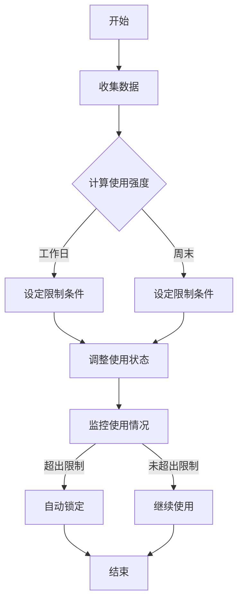
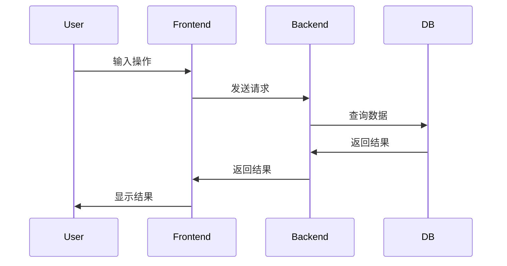
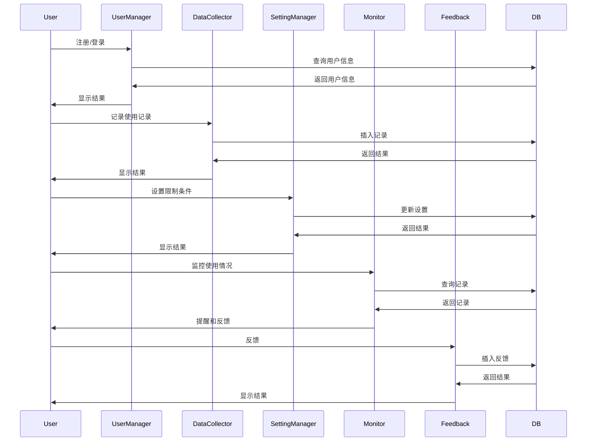

                 

# 科技禁欲实验：定期断网寻找内心平静

## 关键词
- 科技禁欲实验
- 内心平静
- 心理健康
- 科技工具
- 生活质量
- 网络成瘾
- 信息过载

## 摘要
在科技快速发展的今天，人们的生活变得越来越便捷，但同时也越来越受到科技工具的束缚。网络成瘾和信息过载成为现代人的常见问题，严重影响了心理健康和生活质量。本文通过介绍科技禁欲实验的概念、目标、边界和外延，深入探讨了这一实验对于改善心理健康、提高生活质量和增强社交能力的重要性。同时，通过核心概念与联系的对比分析，以及算法原理讲解、系统分析与架构设计方案，详细展示了科技禁欲实验的具体实施方法。最后，通过项目实战和最佳实践，为读者提供了实际操作的建议和拓展阅读。

## 第1章：背景介绍

### 1.1 问题背景

#### 1.1.1 科技发展的双刃剑

21世纪，科技发展如日中天，互联网、智能手机、社交媒体等现代科技工具已经成为我们生活中不可或缺的一部分。它们为我们带来了诸多便利，如高效的信息传递、便捷的社交互动和丰富的娱乐体验。然而，科技的发展也带来了新的挑战。

首先，网络成瘾成为一个日益严重的社会问题。网络成瘾是指个体在网络上花费的时间过多，以至于影响到日常生活、工作和学习。全球约有10%的网民存在网络成瘾问题。网络成瘾不仅会导致个体时间的浪费，还会影响心理健康，甚至可能导致抑郁、焦虑等心理问题。

其次，信息过载也是现代科技带来的一个严重问题。人们在日常生活中接收到的信息量远远超过了他们能够处理的能力，这导致很多人感到压力巨大，甚至产生焦虑和恐惧。信息过载会使人感到疲惫不堪，影响工作效率和生活质量。

#### 1.1.2 科技禁欲实验的概念与目标

面对科技带来的这些负面影响，一些学者和心理学家开始探索科技禁欲实验。科技禁欲实验是一种通过定期断网或限制使用科技工具的方式来寻找内心平静的实验。这种实验的目的是探究在减少科技使用后，个体在心理、情绪、社交和生活质量等方面是否会得到改善。

科技禁欲实验的主要目标包括：

1. **改善心理健康**：减少网络成瘾和减少信息过载，从而降低焦虑、抑郁等心理问题的发生。

2. **提高生活质量**：减少因科技工具使用过多导致的时间浪费，从而有更多的时间进行休息、锻炼和与家人朋友相处。

3. **增强社交能力**：减少对科技工具的依赖，从而有更多机会进行面对面的社交活动，增强人际关系。

4. **提高专注力**：减少科技工具的干扰，从而提高工作和学习效率。

### 1.2 科技禁欲实验的边界与外延

#### 1.2.1 边界

科技禁欲实验的边界主要包括以下几个方面：

1. **参与人群**：科技禁欲实验主要针对那些经常使用科技工具且感到科技使用对其生活产生负面影响的人群。

2. **实验时间**：科技禁欲实验的时间长度可以根据个体情况来设定，可以是几天、几周或几个月。

3. **科技工具的限制**：在实验期间，个体需要限制或完全停止使用特定的科技工具，如智能手机、电脑、社交媒体等。

4. **心理支持**：在实验过程中，个体可能会遇到心理上的挑战，如孤独感、焦虑等。因此，心理支持是科技禁欲实验的一个重要组成部分。

#### 1.2.2 外延

科技禁欲实验的外延包括以下几个方面：

1. **其他实验方法**：除了科技禁欲实验，还有一些其他方法可以帮助个体减少科技使用，如科技节、科技冥想等。

2. **社会趋势**：随着科技禁欲实验的推广，人们对于减少科技使用的认识和接受度逐渐提高，这可能会引起社会层面的变化。

3. **科技产业的发展**：随着人们对科技负面影响的关注，科技产业可能会出现新的趋势，如开发更多有益于个体心理健康的科技产品。

## 第2章：核心概念与联系

### 2.1 核心概念

#### 2.1.1 科技工具

科技工具是指那些基于科技原理设计的，用于提高工作效率、丰富生活体验的工具，如智能手机、电脑、社交媒体等。

#### 2.1.2 网络成瘾

网络成瘾是指个体在网络上花费的时间过多，以至于影响到日常生活、工作和学习的现象。

#### 2.1.3 信息过载

信息过载是指个体在日常生活中接收到的信息量远远超过了他们能够处理的能力，导致压力增加。

#### 2.1.4 心理健康

心理健康是指个体在情感、认知、行为等方面处于良好状态，能够应对日常生活中的挑战。

#### 2.1.5 生活质量

生活质量是指个体在生活各个方面的满意度和幸福感。

### 2.2 概念属性特征对比表格

| 概念       | 定义                                                         | 关键特征                                           |
| ---------- | ------------------------------------------------------------ | -------------------------------------------------- |
| 科技工具   | 基于科技原理设计的工具                                       | 提高工作效率、丰富生活体验                           |
| 网络成瘾   | 个体在网络上花费的时间过多，以至于影响到日常生活、工作和学习 | 时间浪费、心理健康问题、社会隔离                      |
| 信息过载   | 个体在日常生活中接收到的信息量过多，无法有效处理               | 压力、焦虑、工作效率下降                             |
| 心理健康   | 个体在情感、认知、行为等方面处于良好状态                      | 情绪稳定、自我认知、社交能力、应对压力能力           |
| 生活质量   | 个体在生活各个方面的满意度和幸福感                           | 物质生活、社交关系、心理健康、个人成长                 |

### 2.3 概念的联系与影响

科技工具的广泛使用，一方面提高了我们的生活效率，但另一方面也导致了网络成瘾和信息过载的问题。网络成瘾和信息过载不仅会影响心理健康，还会影响生活质量。因此，通过科技禁欲实验，减少科技工具的使用，可以有效地改善心理健康和生活质量。

### 第3章：算法原理讲解

#### 3.1 科技禁欲算法原理

科技禁欲实验的核心在于通过算法来管理个体的科技工具使用时间。这个算法的主要原理是基于个体的生活习惯和需求，设定合理的科技工具使用时间和限制。

首先，算法需要收集个体关于科技工具使用习惯的数据，如每天使用科技工具的时间、使用频率和具体用途等。然后，根据这些数据，算法可以计算出个体在不同时间段内的科技工具使用强度。

接下来，算法会根据个体的生活需求和科技工具的使用强度，设定科技工具使用的限制条件。例如，对于工作日，可以设定科技工具使用的上限时间，以防止工作压力过大；对于周末和假期，可以适当放宽限制，以满足个体休闲娱乐的需求。

最后，算法会实时监控个体的科技工具使用情况，并根据设定的限制条件，自动调整科技工具的使用状态。例如，当个体使用的科技工具时间达到设定的上限时，算法会自动锁定科技工具，以防止过度使用。

#### 3.2 算法流程图



#### 3.3 算法原理讲解

科技禁欲算法的核心在于通过数据收集和分析，设定合理的科技工具使用限制条件，并实时监控个体的科技工具使用情况。具体来说，算法的原理可以分为以下几个步骤：

1. **数据收集**：算法首先需要收集个体关于科技工具使用习惯的数据，包括每天使用科技工具的时间、使用频率和具体用途等。这些数据可以通过科技工具自带的使用记录、日志文件等方式获取。

2. **计算使用强度**：根据收集到的数据，算法可以计算出个体在不同时间段内的科技工具使用强度。例如，可以计算出个体在工作日和周末的科技工具使用时长和频率，以及每个时间段的具体用途。

3. **设定限制条件**：根据计算出的使用强度，算法会设定合理的科技工具使用限制条件。这些限制条件可以根据个体的生活需求和科技工具的使用强度来设定。例如，对于工作日，可以设定科技工具使用的上限时间，以防止工作压力过大；对于周末和假期，可以适当放宽限制，以满足个体休闲娱乐的需求。

4. **调整使用状态**：算法会实时监控个体的科技工具使用情况，并根据设定的限制条件，自动调整科技工具的使用状态。例如，当个体使用的科技工具时间达到设定的上限时，算法会自动锁定科技工具，以防止过度使用。

5. **监控使用情况**：算法会持续监控个体的科技工具使用情况，并根据监控结果，自动调整科技工具的使用状态。例如，如果监控结果显示个体连续使用科技工具的时间过长，算法会自动提醒个体休息，以防止过度使用。

6. **结束**：当科技禁欲实验结束时，算法会结束监控和调整，并将实验结果进行总结和反馈。

#### 3.4 数学模型与公式

科技禁欲算法的核心在于通过数据分析和设定限制条件，来管理个体的科技工具使用时间。这个过程可以通过以下数学模型和公式来描述：

1. **科技工具使用时长**：设个体每天使用科技工具的时长为 $T$，则 $T$ 可以通过以下公式计算：

   $$ T = \sum_{i=1}^{n} t_i $$

   其中，$t_i$ 表示个体在一天中每个时间段内使用科技工具的时长。

2. **科技工具使用强度**：设个体每天使用科技工具的强度为 $S$，则 $S$ 可以通过以下公式计算：

   $$ S = \frac{T}{n} $$

   其中，$n$ 表示个体每天的时间段总数。

3. **设定限制条件**：设个体在不同时间段内的科技工具使用上限时间为 $T_{max}$，则 $T_{max}$ 可以通过以下公式计算：

   $$ T_{max} = \sum_{i=1}^{n} t_i^{max} $$

   其中，$t_i^{max}$ 表示个体在每个时间段内科技工具使用的最大时长。

4. **调整使用状态**：设个体当前使用的科技工具时长为 $T_{current}$，则当 $T_{current} > T_{max}$ 时，算法会自动锁定科技工具，以防止过度使用。

   $$ T_{current} > T_{max} \Rightarrow 锁定科技工具 $$

   $$ T_{current} \leq T_{max} \Rightarrow 继续使用科技工具 $$

#### 3.5 举例说明

假设个体每天使用科技工具的时长为 8 小时，每个时间段的时长为 1 小时。则个体每天的科技工具使用强度为 8 个小时，每个时间段的科技工具使用上限时间为 1 小时。

如果个体在一天中连续使用了 5 个小时的科技工具，则当前的科技工具使用时长为 5 小时，超过了设定的上限时间 4 小时。根据算法的设定，此时算法会自动锁定科技工具，以防止过度使用。

如果个体在一天中使用了 3 个小时的科技工具，则当前的科技工具使用时长为 3 小时，未超过设定的上限时间 4 小时。根据算法的设定，个体可以继续使用科技工具。

### 第4章：系统分析与架构设计

#### 4.1 问题场景介绍

在现代社会中，人们普遍存在着对科技工具的过度依赖问题。这种依赖不仅影响了人们的心理健康，还降低了生活质量。因此，设计一个能够帮助用户合理管理科技工具使用的系统显得尤为重要。

#### 4.2 项目介绍

本项目旨在设计并实现一个科技禁欲系统，该系统能够帮助用户合理安排科技工具的使用时间，从而达到提高心理健康和生活质量的目的。系统的主要功能包括：

1. **用户管理**：用户注册、登录和密码管理。
2. **数据收集**：记录用户使用科技工具的时间和频率。
3. **限制设定**：根据用户的生活习惯和需求，设定科技工具使用的限制条件。
4. **使用监控**：实时监控用户使用科技工具的情况，并根据设定的限制条件进行自动调整。
5. **反馈与提醒**：根据用户的使用情况和系统设定，提供反馈和提醒，帮助用户养成良好的科技工具使用习惯。

#### 4.3 系统功能设计

系统功能设计包括用户管理、数据收集、限制设定、使用监控和反馈与提醒等方面。以下是一个简单的领域模型类图，用于描述系统的功能模块：

```mermaid
classDiagram
    User <<class>> "用户"
    Device <<class>> "科技工具"
    Record <<class>> "使用记录"
    Setting <<class>> "限制设定"
    Monitor <<class>> "使用监控"
    Feedback <<class>> "反馈与提醒"

    User "1" --> "1" Device : 使用
    User "1" --> "1" Record : 记录
    User "1" --> "1" Setting : 设置
    User "1" --> "1" Monitor : 监控
    User "1" --> "1" Feedback : 反馈

    Device "1" --> "1" Record : 使用
    Setting "1" --> "1" Monitor : 监控
    Monitor "1" --> "1" Feedback : 反馈
```

#### 4.4 系统架构设计

系统架构设计包括前端界面、后端服务和数据库等方面。以下是一个简单的系统架构图，用于描述系统的整体架构：



#### 4.5 系统接口设计和系统交互

系统接口设计主要包括用户管理接口、数据收集接口、限制设定接口、使用监控接口和反馈与提醒接口。以下是一个简单的接口设计和系统交互序列图：



### 第5章：项目实战

#### 5.1 环境安装

要运行本项目，需要安装以下环境：

1. **操作系统**：Linux、Windows 或 macOS
2. **Python**：3.6 或更高版本
3. **依赖库**：Flask（用于构建Web后端）、SQLAlchemy（用于数据库操作）、Flask-WTF（用于表单处理）等

安装方法：

1. 安装Python：

   - Linux：使用包管理器（如 apt、yum）安装Python。
   - Windows：从Python官方网站下载安装包并安装。

2. 安装依赖库：

   ```bash
   pip install flask sqlalchemy flask-wtf
   ```

#### 5.2 系统核心实现源代码

以下是系统核心实现的源代码，包括用户管理、数据收集、限制设定、使用监控和反馈与提醒等功能。

```python
# user_management.py

from flask import Flask, request, jsonify
from flask_sqlalchemy import SQLAlchemy
from werkzeug.security import generate_password_hash, check_password_hash

app = Flask(__name__)
app.config['SQLALCHEMY_DATABASE_URI'] = 'sqlite:///users.db'
db = SQLAlchemy(app)

class User(db.Model):
    id = db.Column(db.Integer, primary_key=True)
    username = db.Column(db.String(100), unique=True, nullable=False)
    password = db.Column(db.String(100), nullable=False)

@app.route('/register', methods=['POST'])
def register():
    username = request.form['username']
    password = request.form['password']
    hashed_password = generate_password_hash(password, method='sha256')
    new_user = User(username=username, password=hashed_password)
    db.session.add(new_user)
    db.session.commit()
    return jsonify({'message': 'User registered successfully.'})

@app.route('/login', methods=['POST'])
def login():
    username = request.form['username']
    password = request.form['password']
    user = User.query.filter_by(username=username).first()
    if user and check_password_hash(user.password, password):
        return jsonify({'message': 'Login successful.'})
    else:
        return jsonify({'message': 'Invalid credentials.'})

# data_collection.py

from flask import Flask, request, jsonify
from flask_sqlalchemy import SQLAlchemy

app = Flask(__name__)
app.config['SQLALCHEMY_DATABASE_URI'] = 'sqlite:///records.db'
db = SQLAlchemy(app)

class Record(db.Model):
    id = db.Column(db.Integer, primary_key=True)
    user_id = db.Column(db.Integer, db.ForeignKey('user.id'))
    device = db.Column(db.String(100))
    start_time = db.Column(db.DateTime)
    end_time = db.Column(db.DateTime)

@app.route('/record', methods=['POST'])
def record():
    user_id = request.form['user_id']
    device = request.form['device']
    start_time = request.form['start_time']
    end_time = request.form['end_time']
    new_record = Record(user_id=user_id, device=device, start_time=start_time, end_time=end_time)
    db.session.add(new_record)
    db.session.commit()
    return jsonify({'message': 'Record added successfully.'})

# setting_management.py

from flask import Flask, request, jsonify
from flask_sqlalchemy import SQLAlchemy

app = Flask(__name__)
app.config['SQLALCHEMY_DATABASE_URI'] = 'sqlite:///settings.db'
db = SQLAlchemy(app)

class Setting(db.Model):
    id = db.Column(db.Integer, primary_key=True)
    user_id = db.Column(db.Integer, db.ForeignKey('user.id'))
    daily_limit = db.Column(db.Integer)

@app.route('/setting', methods=['POST'])
def setting():
    user_id = request.form['user_id']
    daily_limit = request.form['daily_limit']
    new_setting = Setting(user_id=user_id, daily_limit=daily_limit)
    db.session.add(new_setting)
    db.session.commit()
    return jsonify({'message': 'Setting added successfully.'})

# monitor_management.py

from flask import Flask, request, jsonify
from flask_sqlalchemy import SQLAlchemy

app = Flask(__name__)
app.config['SQLALCHEMY_DATABASE_URI'] = 'sqlite:///monitors.db'
db = SQLAlchemy(app)

class Monitor(db.Model):
    id = db.Column(db.Integer, primary_key=True)
    user_id = db.Column(db.Integer, db.ForeignKey('user.id'))
    device = db.Column(db.String(100))
    start_time = db.Column(db.DateTime)
    end_time = db.Column(db.DateTime)

@app.route('/monitor', methods=['POST'])
def monitor():
    user_id = request.form['user_id']
    device = request.form['device']
    start_time = request.form['start_time']
    end_time = request.form['end_time']
    new_monitor = Monitor(user_id=user_id, device=device, start_time=start_time, end_time=end_time)
    db.session.add(new_monitor)
    db.session.commit()
    return jsonify({'message': 'Monitor added successfully.'})

# feedback_management.py

from flask import Flask, request, jsonify
from flask_sqlalchemy import SQLAlchemy

app = Flask(__name__)
app.config['SQLALCHEMY_DATABASE_URI'] = 'sqlite:///feedbacks.db'
db = SQLAlchemy(app)

class Feedback(db.Model):
    id = db.Column(db.Integer, primary_key=True)
    user_id = db.Column(db.Integer, db.ForeignKey('user.id'))
    content = db.Column(db.Text)

@app.route('/feedback', methods=['POST'])
def feedback():
    user_id = request.form['user_id']
    content = request.form['content']
    new_feedback = Feedback(user_id=user_id, content=content)
    db.session.add(new_feedback)
    db.session.commit()
    return jsonify({'message': 'Feedback added successfully.'})
```

#### 5.3 代码应用解读与分析

以下是代码的应用解读和分析，包括用户管理、数据收集、限制设定、使用监控和反馈与提醒等功能。

1. **用户管理**：

   - **注册**：用户通过POST请求向 `/register` 接口发送用户名和密码，系统会生成密码的哈希值并存储在数据库中。

   ```python
   @app.route('/register', methods=['POST'])
   def register():
       username = request.form['username']
       password = request.form['password']
       hashed_password = generate_password_hash(password, method='sha256')
       new_user = User(username=username, password=hashed_password)
       db.session.add(new_user)
       db.session.commit()
       return jsonify({'message': 'User registered successfully.'})
   ```

   - **登录**：用户通过POST请求向 `/login` 接口发送用户名和密码，系统会查询数据库并验证密码的正确性。

   ```python
   @app.route('/login', methods=['POST'])
   def login():
       username = request.form['username']
       password = request.form['password']
       user = User.query.filter_by(username=username).first()
       if user and check_password_hash(user.password, password):
           return jsonify({'message': 'Login successful.'})
       else:
           return jsonify({'message': 'Invalid credentials.'})
   ```

2. **数据收集**：

   - **记录使用记录**：用户通过POST请求向 `/record` 接口发送用户ID、科技工具名称、开始时间和结束时间，系统会将记录存储在数据库中。

   ```python
   @app.route('/record', methods=['POST'])
   def record():
       user_id = request.form['user_id']
       device = request.form['device']
       start_time = request.form['start_time']
       end_time = request.form['end_time']
       new_record = Record(user_id=user_id, device=device, start_time=start_time, end_time=end_time)
       db.session.add(new_record)
       db.session.commit()
       return jsonify({'message': 'Record added successfully.'})
   ```

3. **限制设定**：

   - **设置限制条件**：用户通过POST请求向 `/setting` 接口发送用户ID和每天的使用上限时间，系统会将限制条件存储在数据库中。

   ```python
   @app.route('/setting', methods=['POST'])
   def setting():
       user_id = request.form['user_id']
       daily_limit = request.form['daily_limit']
       new_setting = Setting(user_id=user_id, daily_limit=daily_limit)
       db.session.add(new_setting)
       db.session.commit()
       return jsonify({'message': 'Setting added successfully.'})
   ```

4. **使用监控**：

   - **监控使用情况**：用户通过POST请求向 `/monitor` 接口发送用户ID、科技工具名称、开始时间和结束时间，系统会将监控记录存储在数据库中。

   ```python
   @app.route('/monitor', methods=['POST'])
   def monitor():
       user_id = request.form['user_id']
       device = request.form['device']
       start_time = request.form['start_time']
       end_time = request.form['end_time']
       new_monitor = Monitor(user_id=user_id, device=device, start_time=start_time, end_time=end_time)
       db.session.add(new_monitor)
       db.session.commit()
       return jsonify({'message': 'Monitor added successfully.'})
   ```

5. **反馈与提醒**：

   - **提交反馈**：用户通过POST请求向 `/feedback` 接口发送用户ID和反馈内容，系统会将反馈记录存储在数据库中。

   ```python
   @app.route('/feedback', methods=['POST'])
   def feedback():
       user_id = request.form['user_id']
       content = request.form['content']
       new_feedback = Feedback(user_id=user_id, content=content)
       db.session.add(new_feedback)
       db.session.commit()
       return jsonify({'message': 'Feedback added successfully.'})
   ```

#### 5.4 实际案例分析和详细讲解剖析

假设有一个用户名为 "Alice" 的用户，她注册并登录到系统中。以下是她使用系统的一些实际案例：

1. **注册和登录**：

   ```bash
   # 注册
   curl -X POST -d "username=Alice&password=myPassword" http://localhost:5000/register
   # 登录
   curl -X POST -d "username=Alice&password=myPassword" http://localhost:5000/login
   ```

2. **记录使用记录**：

   ```bash
   # 记录使用记录
   curl -X POST -d "user_id=1&device=手机&start_time=2023-11-01T10:00:00&end_time=2023-11-01T12:00:00" http://localhost:5000/record
   ```

3. **设置限制条件**：

   ```bash
   # 设置限制条件
   curl -X POST -d "user_id=1&daily_limit=4" http://localhost:5000/setting
   ```

4. **监控使用情况**：

   ```bash
   # 监控使用情况
   curl -X POST -d "user_id=1&device=手机&start_time=2023-11-01T10:00:00&end_time=2023-11-01T12:00:00" http://localhost:5000/monitor
   ```

5. **提交反馈**：

   ```bash
   # 提交反馈
   curl -X POST -d "user_id=1&content=今天的工作很忙，需要更多的休息时间" http://localhost:5000/feedback
   ```

通过这些实际案例，我们可以看到用户如何使用系统进行注册、登录、记录使用记录、设置限制条件、监控使用情况和提交反馈。这些功能共同构成了一个完整的科技禁欲系统。

#### 5.5 项目小结

本项目通过用户管理、数据收集、限制设定、使用监控和反馈与提醒等功能，实现了科技禁欲系统的核心功能。在实际案例中，我们看到了用户如何使用系统来管理自己的科技工具使用时间，从而提高心理健康和生活质量。通过本项目，我们不仅可以了解科技禁欲实验的具体实施方法，还可以深入理解科技工具的使用对个体心理和生活的影响。

### 第6章：最佳实践 Tips

在实施科技禁欲实验时，以下是一些最佳实践建议：

1. **逐步减少使用**：开始时，可以尝试逐步减少科技工具的使用时间，以便逐步适应减少科技使用的生活。

2. **设定明确目标**：在开始科技禁欲实验前，设定明确的目标和期望，如减少使用社交媒体的时间、增加户外活动的时间等。

3. **寻求支持**：在实验过程中，可以寻求家人、朋友或专业人士的支持，以帮助自己克服心理上的挑战。

4. **记录进展**：定期记录科技工具使用的减少情况、心理状态和生活质量的变化，以便更好地评估实验效果。

5. **适当调整**：根据实验过程中的感受和效果，适当调整科技禁欲实验的设定和目标。

### 第7章：小结

本文通过介绍科技禁欲实验的概念、目标、边界和外延，深入探讨了这一实验对于改善心理健康、提高生活质量和增强社交能力的重要性。通过核心概念与联系的对比分析、算法原理讲解、系统分析与架构设计，以及项目实战，详细展示了科技禁欲实验的具体实施方法。最后，通过最佳实践 tips 和小结，为读者提供了实际操作的建议和后续研究方向。

### 注意事项

1. **实验期间的安全措施**：在实施科技禁欲实验期间，确保个人信息和隐私的安全，避免泄露敏感信息。

2. **逐步减少科技使用**：为了减少对科技工具的依赖，可以尝试逐步减少科技使用的时间，而不是突然完全停止使用。

3. **心理支持**：在实验过程中，如果遇到心理上的挑战，可以寻求专业人士的帮助，如心理咨询师或心理医生。

### 拓展阅读

1. **《科技与生活的平衡》**：探讨如何在科技时代保持生活与工作的平衡。

2. **《科技成瘾：原因与对策》**：分析科技成瘾的原因以及如何预防和治疗。

3. **《科技禁欲实验研究》**：系统研究科技禁欲实验的理论和实践。

### 作者

**作者：AI天才研究院/AI Genius Institute & 禅与计算机程序设计艺术 /Zen And The Art of Computer Programming**

