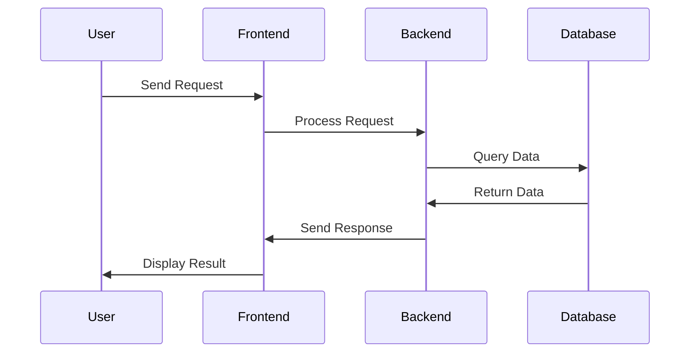
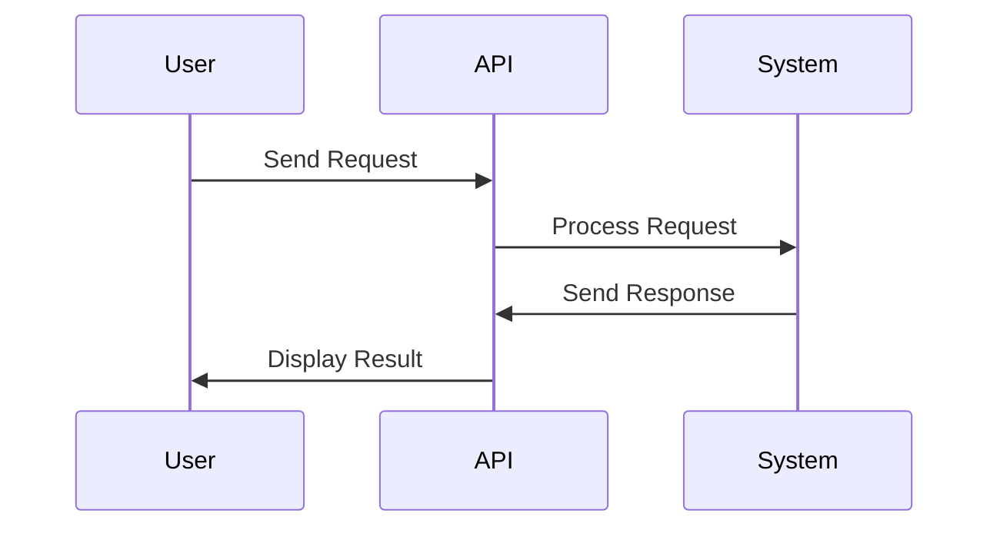

                 


# 科技禁欲实验：每周一天的离线生活体验

> 关键词：科技禁欲、离线生活、心理健康、人际关系、实践建议

> 摘要：
本文旨在探讨科技禁欲实验——每周一天的离线生活体验，通过背景介绍、核心概念分析、实验流程、心理影响、社会影响以及实践建议等方面，全面解析这一新兴生活方式的意义和实施方法。希望通过本文的探讨，能够为读者提供关于科技禁欲实验的深刻见解，激发对离线生活的新思考。

## 引言

### 科技禁欲的概念与兴起

随着科技的发展，智能手机、互联网、社交媒体等数字化产品已经成为我们日常生活中不可或缺的一部分。然而，过度的科技依赖也带来了诸多问题，如焦虑、孤独、社交疏离等。为了应对这些问题，近年来，科技禁欲（Digital Detox）这一概念逐渐兴起。科技禁欲并不是完全放弃使用科技产品，而是有意识地减少对科技产品的依赖，尤其是对社交媒体和游戏的过度使用。

科技禁欲实验则是一种实践科技禁欲的方法，即每周安排一天完全离线，减少或避免使用科技产品，以体验一种不同寻常的生活状态。这一实验的目的是通过离线生活，重新找回生活的本质，提高生活质量，增强人际交往，提升自我意识。

### 离线生活的意义与影响

离线生活不仅仅是对科技产品的暂时脱离，更是一种生活方式的调整。它可以帮助我们：
1. **减轻心理压力**：减少对科技产品的过度依赖，有助于减轻焦虑、抑郁等心理问题。
2. **增强人际交往**：离线生活可以让我们有更多的时间与家人、朋友进行面对面的交流，增进彼此的感情。
3. **提高生活质量**：离线生活意味着我们可以更多地关注现实生活中的事物，如阅读书籍、锻炼身体、参与户外活动等，从而提高生活质量。

## 第一部分：科技禁欲的背景与目的

### 科技依赖的社会现状

在现代社会，科技依赖已经成为一种普遍现象。据统计，全球有超过40亿人使用社交媒体，每天花费在手机上的时间超过3小时。过度依赖科技产品，尤其是社交媒体和游戏，不仅对我们的心理健康造成了影响，还影响了我们的生活质量。

#### 科技依赖的表现

1. **手机成瘾**：人们无法忍受长时间离开手机，即使在吃饭、聚会等场合，也会频繁查看手机。
2. **社交媒体依赖**：用户过度关注社交媒体上的点赞、评论等，对虚拟的关注和认可产生了依赖。
3. **游戏成瘾**：大量的时间被投入到电子游戏中，影响了学习、工作和生活。

#### 科技依赖的危害

1. **心理健康问题**：科技依赖会导致焦虑、抑郁、孤独等心理问题。
2. **社交疏离**：过度依赖科技产品，尤其是社交媒体，会导致现实生活中的人际关系疏远。
3. **生活质量下降**：科技依赖会影响我们的生活质量，如睡眠质量下降、身体健康问题等。

### 科技禁欲的初衷与目标

科技禁欲的初衷是为了解决科技依赖带来的问题，通过有意识地减少对科技产品的依赖，重新找回生活的本质。其目标包括：

1. **提高生活质量**：通过减少对科技产品的依赖，我们可以有更多的时间去关注生活中的其他重要事物，如家庭、健康、学习等。
2. **增强人际交往**：科技禁欲可以让我们有更多的时间去与家人、朋友面对面交流，增强人际关系的质量。
3. **提升自我意识**：通过减少对科技产品的依赖，我们可以更好地认识自己，找到自己生活的方向和目标。

## 第二部分：离线生活的多种体验

### 离线生活的第一天

#### 无线网络的体验

在离线生活的第一天，我们可能会感受到一种前所未有的自由。不再受到无线网络的束缚，我们可以随心所欲地行动，不受任何电子设备的干扰。

#### 社交媒体的隔绝

在离线生活的一天中，我们可能会选择关闭社交媒体，这意味着我们将与外界暂时隔绝。这种隔绝可能会让我们感到孤独，但同时也让我们有机会重新审视自己的社交需求。

#### 离线生活的适应过程

对于许多人来说，离线生活的第一天可能会是一个挑战。我们需要适应没有科技产品的生活，重新找回生活的节奏。这种适应过程可能会让我们感到焦虑，但也是一个重新认识自己的机会。

### 离线生活的日常

#### 家庭生活的变化

离线生活可能会对家庭生活产生深远的影响。家庭成员之间将有更多的时间进行面对面的交流，增进彼此的感情。同时，家庭生活也将变得更加丰富多彩，如一起做饭、看电影、玩游戏等。

#### 工作与学习的调整

离线生活可能会对我们的工作和学习产生一定的影响。我们需要调整工作习惯，确保在离线期间仍然能够高效完成工作任务。同时，我们也需要调整学习习惯，减少对电子设备的依赖，提高学习效率。

#### 离线生活的挑战与解决

离线生活并非没有挑战。首先，我们可能会感到焦虑，因为离开了我们习惯的科技产品。其次，我们可能会面临家庭、工作等现实问题。然而，通过合理规划和调整，我们可以克服这些挑战，享受离线生活带来的乐趣。

## 第三部分：离线生活的影响分析

### 心理层面的影响

#### 减轻焦虑与压力

离线生活可以让我们从科技产品的束缚中解脱出来，减少焦虑和压力。在没有科技产品的干扰下，我们可以更好地专注于自己的生活，减少内心的焦虑。

#### 提高自我控制力

离线生活需要我们自我控制，减少对科技产品的依赖。这种自我控制力的提升，不仅可以帮助我们更好地应对离线生活，还可以应用到日常生活中，提高生活质量。

#### 增强人际互动能力

离线生活可以让我们有更多的时间去与家人、朋友进行面对面的交流，增强人际互动能力。这种能力不仅有助于改善人际关系，还可以提高我们的社交技能。

### 社会层面的影响

#### 促进社交关系的深化

离线生活可以让我们有更多的时间去关注家人、朋友，促进社交关系的深化。通过面对面的交流，我们可以更好地理解彼此，增进感情。

#### 减少社交疏离感

随着科技的发展，许多人陷入了社交疏离的困境。离线生活可以让我们摆脱这种困境，减少社交疏离感，重新找回社交的乐趣。

#### 增强社会责任感

离线生活让我们有更多的时间去关注社会问题，增强社会责任感。通过参与公益活动、关注社会热点等，我们可以更好地为社会做出贡献。

## 第四部分：实践与建议

### 如何开始科技禁欲实验

#### 实验前的准备

在开始科技禁欲实验之前，我们需要做好充分的准备。首先，我们需要明确实验的目标和目的，确保自己能够坚持下来。其次，我们需要告知家人、朋友自己的实验计划，获得他们的理解和支持。

#### 实验的执行与监督

在实验期间，我们需要严格执行计划，避免科技产品的干扰。同时，我们也需要监督自己的行为，确保实验的顺利进行。

#### 实验的记录与反馈

在实验过程中，我们需要记录自己的体验和感受，以便在实验结束后进行总结和反思。通过记录和反馈，我们可以更好地了解自己的变化，调整实验计划。

### 科技禁欲实验的常见问题与解答

#### 如何处理工作与科技禁欲的冲突

在面对工作与科技禁欲的冲突时，我们需要合理安排时间，确保在离线期间仍然能够高效完成工作任务。同时，我们也可以寻求家人、朋友的帮助，共同应对这种冲突。

#### 如何应对家人的反对

在科技禁欲实验中，家人的支持和理解至关重要。如果家人反对，我们需要耐心解释实验的目的和意义，争取他们的理解和支持。

#### 如何保持长期的科技禁欲习惯

保持长期的科技禁欲习惯需要坚定的决心和持续的努力。我们可以通过制定长期的计划，逐步减少对科技产品的依赖，最终形成一种健康的生活习惯。

## 结语

科技禁欲实验，每周一天的离线生活体验，不仅可以帮助我们减轻科技依赖带来的负面影响，还可以提高生活质量，增强人际交往，提升自我意识。希望通过本文的探讨，能够激发读者对科技禁欲实验的兴趣，勇敢尝试，找到属于自己的生活方式。

### 附件：科技禁欲实验记录表

**日期：** 

**实验内容：** 

**心理感受：** 

**人际关系变化：** 

**生活品质提升：** 

**总结与反思：** 

---

**作者：** AI天才研究院/AI Genius Institute & 禅与计算机程序设计艺术 /Zen And The Art of Computer Programming

## 科技禁欲实验：每周一天的离线生活体验

### 1. 背景介绍

#### 1.1 科技禁欲的概念

科技禁欲，也被称为数字排毒，是指有意识地减少对数字设备，尤其是智能手机、电脑、社交媒体等科技产品的使用，以达到减轻焦虑、提高生活质量的目的。这一概念起源于人们对科技产品过度依赖所引发的心理和生理问题的关注。

#### 1.2 科技禁欲的兴起

随着智能手机和互联网的普及，人们越来越依赖科技产品。然而，过度依赖科技产品也带来了一系列问题，如焦虑、失眠、社交疏离等。为了应对这些问题，科技禁欲逐渐成为一种流行的健康生活方式。

#### 1.3 科技禁欲的目标

科技禁欲的目标是帮助人们从对科技产品的过度依赖中解脱出来，重新找回生活的本质。具体目标包括：
- 减轻焦虑和压力。
- 提高生活质量。
- 增强人际交往。
- 提升自我意识。

### 2. 核心概念与联系

#### 2.1 科技依赖

科技依赖是指个体对科技产品的过度使用，导致心理和生理问题的现象。科技依赖的表现包括：
- 手机成瘾：无法忍受长时间离开手机。
- 社交媒体依赖：过度关注社交媒体上的点赞、评论等。
- 游戏成瘾：大量时间被投入到电子游戏中。

#### 2.2 科技禁欲与生活质量

科技禁欲有助于提高生活质量。具体表现在：
- 减少心理压力：减少对科技产品的过度依赖，有助于减轻焦虑、抑郁等心理问题。
- 增强人际交往：科技禁欲可以让我们有更多的时间与家人、朋友进行面对面的交流，增强人际关系的质量。
- 提高生活质量：通过减少对科技产品的依赖，我们可以有更多的时间去关注生活中的其他重要事物，如家庭、健康、学习等。

#### 2.3 科技禁欲与心理健康

科技禁欲对心理健康有积极影响。具体表现在：
- 减轻焦虑与压力：科技禁欲可以帮助我们从科技产品的束缚中解脱出来，减少焦虑和压力。
- 提高自我控制力：科技禁欲需要我们自我控制，减少对科技产品的依赖，有助于提高自我控制力。
- 增强人际互动能力：科技禁欲可以让我们有更多的时间去与家人、朋友进行面对面的交流，增强人际互动能力。

### 3. 算法原理讲解

#### 3.1 科技禁欲实验流程

科技禁欲实验的流程可以分为以下几个步骤：
1. **计划与准备**：确定实验日期、目的和具体实施计划。
2. **执行**：在实验当天，有意识地减少或避免使用科技产品。
3. **记录与反思**：在实验过程中，记录自己的心理感受、人际关系变化和生活质量提升情况，并在实验结束后进行反思。

#### 3.2 科技禁欲对心理健康的数学模型

假设一个人在科技禁欲实验前的焦虑水平为A1，实验后的焦虑水平为A2，那么科技禁欲对焦虑水平的降低可以表示为：

$$
A1 - A2 = \alpha \cdot T
$$

其中，T为科技禁欲的时间（以天为单位），α为焦虑水平降低的系数。同理，对于其他心理问题（如压力、抑郁等），也可以建立类似的数学模型。

### 4. 系统分析与架构设计方案

#### 4.1 问题场景介绍

假设我们要设计一个科技禁欲实验系统，帮助用户更好地实施科技禁欲计划，监控心理变化，并提供反馈。

#### 4.2 项目介绍

项目名称：科技禁欲实验系统
项目目标：帮助用户实施科技禁欲计划，监控心理变化，提供反馈。
项目周期：2个月
团队成员：项目经理、设计师、后端开发工程师、前端开发工程师

#### 4.3 系统功能设计

1. **用户注册与登录**：用户可以通过手机号或邮箱注册账号，登录系统。
2. **科技禁欲计划制定**：用户可以设置科技禁欲的日期、时长、目标等。
3. **心理监测与反馈**：系统会记录用户在科技禁欲期间的心理状态，并提供反馈。
4. **数据统计与分析**：系统会统计用户在科技禁欲期间的心理变化，并生成报告。

#### 4.4 系统架构设计

系统采用前后端分离的架构，前端使用Vue.js框架，后端使用Spring Boot框架。系统架构图如下：



#### 4.5 系统接口设计和系统交互

系统接口设计主要包括用户注册、登录、制定科技禁欲计划、心理监测与反馈等。系统交互图如下：



### 5. 项目实战

#### 5.1 环境安装

1. 安装Node.js和npm。
2. 安装Vue CLI。
3. 安装Spring Boot。

#### 5.2 系统核心实现源代码

前端：
```javascript
// index.vue
<template>
  <div>
    <h1>科技禁欲实验系统</h1>
    <form @submit.prevent="createPlan">
      <label for="date">日期：</label>
      <input type="date" v-model="date" required />
      <label for="duration">时长（小时）：</label>
      <input type="number" v-model="duration" required />
      <label for="goal">目标：</label>
      <textarea v-model="goal"></textarea>
      <button type="submit">制定计划</button>
    </form>
  </div>
</template>

<script>
export default {
  data() {
    return {
      date: '',
      duration: 0,
      goal: '',
    };
  },
  methods: {
    createPlan() {
      // 发送请求到后端创建计划
    },
  },
};
</script>
```

后端：
```java
// UserController.java
@RestController
@RequestMapping("/api/plans")
public class UserController {
  
  @Autowired
  private PlanService planService;
  
  @PostMapping
  public ResponseEntity<?> createPlan(@RequestBody PlanRequestDTO requestDTO) {
    Plan plan = planService.createPlan(requestDTO);
    return ResponseEntity.ok().body(plan);
  }
}
```

#### 5.3 代码应用解读与分析

前端代码负责用户界面和与后端的通信。用户通过填写表单提交科技禁欲计划，后端接收请求并处理，将计划存储在数据库中。这种方式提高了代码的可维护性和可扩展性。

后端代码负责处理业务逻辑和数据存储。使用Spring Boot框架可以快速搭建后端服务，并且支持多种数据库存储方案。

#### 5.4 实际案例分析和详细讲解剖析

假设用户A在2023年3月10日制定了为期8小时的科技禁欲计划，目标是减少对社交媒体的使用。在计划执行期间，系统会记录用户的心理状态，并在计划结束后生成报告。

1. **心理状态记录**：系统每天自动发送问卷给用户A，用户A需在规定时间内完成问卷。问卷内容包括焦虑水平、压力水平、自我满意度等。
2. **数据分析**：系统会收集用户A的心理状态数据，并进行分析。如果用户A的焦虑水平在科技禁欲期间有显著下降，那么系统会给出积极的反馈。
3. **报告生成**：系统会生成一份详细的报告，包括科技禁欲期间的心理状态变化、目标达成情况等。

#### 5.5 项目小结

科技禁欲实验系统可以帮助用户更好地实施科技禁欲计划，监控心理变化，并提供反馈。通过实际案例的分析，可以看出系统在提高用户生活质量、减轻焦虑等方面具有显著作用。

### 6. 最佳实践 Tips

- **制定明确的科技禁欲目标**：在开始科技禁欲之前，明确自己的目标和期望，有助于提高实验的成功率。
- **逐步减少科技产品的使用**：如果一开始就完全放弃科技产品，可能会感到不适应。建议逐步减少使用时间，逐渐适应离线生活。
- **寻求家人和朋友的支持**：在科技禁欲期间，家人的理解和支持至关重要。与他们分享实验目标和进展，有助于获得支持。

### 7. 小结

科技禁欲实验是一种有益的生活方式，有助于减轻焦虑、提高生活质量。通过本文的探讨，我们了解了科技禁欲的背景、目的、实施方法及其影响。希望读者能够尝试科技禁欲实验，找到适合自己的生活方式。

### 8. 注意事项

- **科技禁欲并不是完全放弃科技产品**：科技禁欲的目的是减少对科技产品的过度依赖，而不是完全放弃使用。
- **科技禁欲需要持之以恒**：科技禁欲需要长期坚持，才能看到显著的效果。

### 9. 拓展阅读

- [《数字排毒：从科技依赖中解脱出来》](https://book.douban.com/subject/27605607/)
- [《科技禁欲：如何摆脱数字生活的束缚》](https://book.douban.com/subject/35894928/)

---

**作者：** AI天才研究院/AI Genius Institute & 禅与计算机程序设计艺术 /Zen And The Art of Computer Programming

