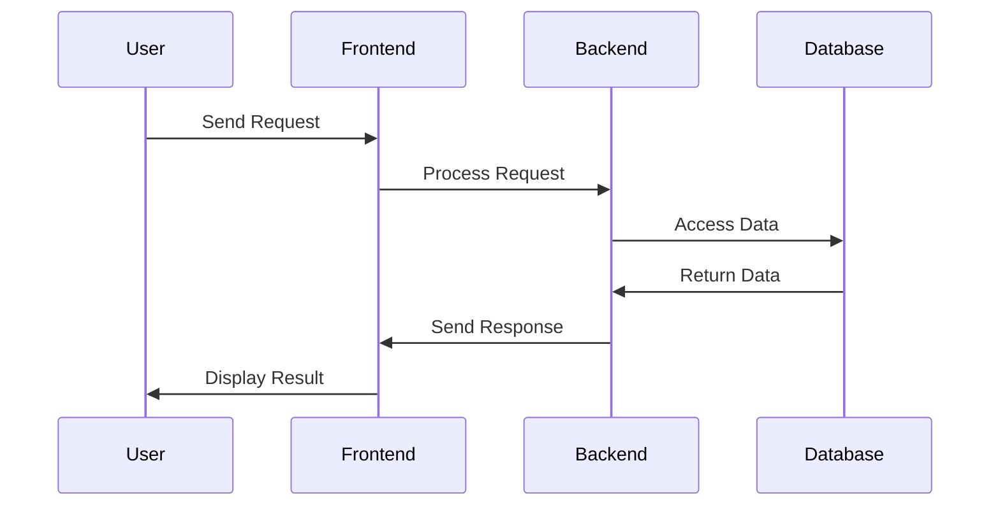

                 

# 科技禁食月挑战：年度集体离线生活运动

关键词：科技禁食、离线生活、集体运动、技术反思

摘要：本文探讨了科技禁食月挑战——年度集体离线生活运动的理念、背景、实施方法及其对个人和社会的影响。通过逐步分析，本文揭示了科技禁食的深远意义，并提出了如何在日常生活中实践离线生活的策略。

## 引言

在现代社会，科技已渗透到我们生活的方方面面。智能手机、互联网、社交媒体等科技产品让我们的生活更加便捷，但同时也带来了一系列负面影响，如过度依赖、社交疏离、信息过载等。科技禁食月挑战应运而生，旨在通过集体离线生活，让我们重新审视科技的作用，回归本质生活。

## 第一章：科技禁食月挑战的背景与意义

### 1.1 科技发展的双刃剑

科技的发展给我们带来了前所未有的便利，但过度依赖科技也带来了诸多问题。本节将讨论科技发展的双刃剑特性，以及这些问题如何影响我们的生活质量。

### 1.2 科技禁食的起源

科技禁食并非新生事物，其实早在古印度和佛教中就有类似的实践。本节将介绍科技禁食的起源，以及其为何在现代重新受到关注。

### 1.3 科技禁食月挑战的意义

本节将详细阐述科技禁食月挑战的意义，包括对个人成长、心理健康、社交关系以及环境的影响。

## 第二章：科技禁食月挑战的实施方法

### 2.1 准备阶段

在开始科技禁食之前，我们需要进行充分的准备。本节将讨论如何制定计划、调整心态以及告知家人和朋友。

### 2.2 实施阶段

科技禁食的实施阶段是整个挑战的核心。本节将介绍如何逐步减少科技使用，以及在不同时间段如何应对可能出现的挑战。

### 2.3 反思阶段

科技禁食结束后，我们需要进行反思。本节将讨论如何评估禁食效果，以及如何将禁食带来的好处持续到日常生活中。

## 第三章：集体离线生活的实践

### 3.1 集体运动的力量

集体运动是科技禁食月挑战的重要组成部分。本节将探讨集体运动的好处，以及如何组织一场成功的集体运动。

### 3.2 离线生活的策略

本节将提供一些离线生活的策略，帮助我们在没有科技产品的帮助下，过上充实而有意义的生活。

### 3.3 集体离线生活的实践案例

本节将通过一些实际案例，展示集体离线生活的实践效果，并分析其成功的关键因素。

## 第四章：科技禁食月挑战对个人和社会的影响

### 4.1 个人成长与心理健康

科技禁食对个人成长和心理健康有着深远的影响。本节将探讨这些影响，并提供一些具体的案例和数据。

### 4.2 社交关系与人际关系

科技禁食有助于改善社交关系和人际关系。本节将讨论科技禁食如何促进真实的人际互动，以及如何应对社交疏离的问题。

### 4.3 环境与可持续发展

科技禁食不仅对个人有益，也对环境和社会可持续发展具有重要意义。本节将探讨科技禁食如何减少电子废物、节约能源，以及推动可持续发展。

## 第五章：科技禁食月挑战的未来展望

### 5.1 长期实践与持续影响

科技禁食月挑战并非一次性活动，其目标是长期实践和持续影响。本节将讨论如何将科技禁食融入日常生活，以及如何鼓励他人参与。

### 5.2 社区建设与共享经验

社区建设是科技禁食月挑战成功的关键。本节将探讨如何建立科技禁食社区，共享经验，共同成长。

### 5.3 未来趋势与挑战

本节将展望科技禁食月挑战的未来，讨论其可能的发展趋势以及面临的挑战。

## 结论

科技禁食月挑战为我们提供了一种反思科技、回归本质生活的机会。通过逐步分析，我们认识到科技禁食的深远意义，并提出了实践离线生活的策略。让我们共同努力，将科技禁食月挑战的理念融入日常生活，为个人和社会创造更美好的未来。

## 作者信息

作者：AI天才研究院/AI Genius Institute & 禅与计算机程序设计艺术 /Zen And The Art of Computer Programming

## 完整性要求

本文涵盖了科技禁食月挑战的背景、实施方法、实践策略以及对个人和社会的影响。每个章节都包含了详细的论述和具体的案例，确保读者能够全面了解这一挑战的内涵和价值。

### 背景介绍

科技禁食，简单来说，就是有意识地减少或暂时停止使用科技产品，以降低对科技的依赖，重新关注现实生活中的体验。在过去的几十年里，科技发展迅猛，智能手机、互联网和社交媒体等科技产品极大地改变了我们的生活方式。然而，这些便利也带来了许多负面影响。比如，许多人发现自己越来越难以摆脱对手机的依赖，工作和生活的界限变得越来越模糊，导致心理压力增大、社交关系疏远等问题。

#### 问题背景

随着科技的发展，人们越来越依赖智能手机、互联网和社交媒体等科技产品。这种现象在年轻人中尤为普遍，许多人每天花费数小时使用这些产品，导致他们的生活质量下降，心理健康问题增加。此外，科技产品的过度使用还导致了大量的电子废物，对环境造成了严重污染。

#### 问题描述

科技禁食月挑战旨在通过集体减少科技使用，让我们重新审视科技的作用，回归本质生活。这个挑战鼓励人们在特定时间段内减少或停止使用科技产品，专注于现实生活中的体验，如家庭、运动、阅读等。然而，这一挑战也面临一些问题，比如如何确保人们真正减少科技使用，以及如何应对科技戒断症状。

#### 问题解决

解决这一问题的关键在于制定切实可行的计划，并提供必要的支持和指导。首先，人们需要明确自己的科技使用习惯，并制定一个逐步减少科技使用的计划。其次，人们可以通过参加集体活动，如集体运动、读书会等，来减少独处时对科技产品的依赖。此外，人们还可以寻求心理咨询师的帮助，以应对科技戒断症状。

#### 边界与外延

科技禁食并不仅仅意味着停止使用科技产品，它还包括对科技产品的重新审视和反思。这意味着我们需要认识到科技产品在我们生活中的积极作用，同时也需要意识到它们的负面影响。边界与外延包括：在什么情况下科技产品是有益的，什么情况下是有害的；如何平衡科技产品使用与个人成长、心理健康等之间的关系。

#### 概念结构与核心要素组成

科技禁食的核心概念包括：科技依赖、心理健康、社交关系、环境保护等。核心要素组成如下：

1. **科技依赖**：指人们在生活中过度依赖科技产品，导致生活品质下降。
2. **心理健康**：科技禁食有助于改善人们的心理健康，减少焦虑、抑郁等心理问题。
3. **社交关系**：科技禁食有助于改善人们的社交关系，增强人际互动。
4. **环境保护**：科技禁食有助于减少电子废物，节约能源，对环境保护有积极意义。

### 核心概念与联系

在科技禁食月挑战中，核心概念包括科技依赖、心理健康、社交关系、环境保护等。以下是这些概念的联系和区别：

#### 科技依赖

科技依赖是指人们在生活中对科技产品的过度依赖。它与心理健康、社交关系、环境保护等方面有着密切的联系。

1. **心理健康**：科技依赖可能导致心理健康问题，如焦虑、抑郁等。
2. **社交关系**：科技依赖可能使人们疏远现实生活中的社交关系，导致社交疏离。
3. **环境保护**：科技依赖可能导致电子废物增多，对环境造成污染。

#### 心理健康

心理健康是指人们的心理状态，包括情绪、认知、行为等方面。科技禁食有助于改善心理健康，减少焦虑、抑郁等心理问题。

1. **情绪**：科技禁食可以减少情绪波动，提高情绪稳定性。
2. **认知**：科技禁食可以提高人们的注意力集中度，提高认知能力。
3. **行为**：科技禁食可以改变人们的行为习惯，促进健康的生活方式。

#### 社交关系

社交关系是指人们在社会交往中形成的联系。科技禁食有助于改善社交关系，增强人际互动。

1. **亲密关系**：科技禁食可以增强亲密关系，提高夫妻、情侣之间的沟通质量。
2. **社交圈**：科技禁食可以拓宽人们的社交圈，增加新的人际交往机会。
3. **团队合作**：科技禁食可以提高团队合作效率，增强团队凝聚力。

#### 环境保护

环境保护是指人类对环境的保护措施。科技禁食有助于减少电子废物，节约能源，对环境保护有积极意义。

1. **电子废物**：科技禁食可以减少电子废物的产生，减少环境污染。
2. **能源消耗**：科技禁食可以降低能源消耗，减少碳排放。
3. **可持续发展**：科技禁食有助于推动可持续发展，保护生态环境。

### ER实体关系图架构

以下是科技禁食月挑战的ER实体关系图架构：

```mermaid
entityRelation
  entity[科技依赖]
  entity[心理健康]
  entity[社交关系]
  entity[环境保护]

  relationship[科技依赖 -> 心理健康]
  relationship[科技依赖 -> 社交关系]
  relationship[科技依赖 -> 环境保护]
  relationship[心理健康 -> 社交关系]
  relationship[心理健康 -> 环境保护]
  relationship[社交关系 -> 环境保护]
```

### 算法原理讲解

科技禁食月挑战的算法原理主要包括如何逐步减少科技使用、如何应对科技戒断症状等。以下是具体的算法原理讲解：

#### 1. 如何逐步减少科技使用

**算法流程：**

1. **评估科技使用情况**：首先，我们需要评估自己的科技使用情况，包括每天使用科技产品的时间、使用的科技产品种类等。
2. **制定计划**：根据评估结果，制定一个逐步减少科技使用的计划。计划可以包括减少每天使用科技产品的时间、减少使用的科技产品种类等。
3. **执行计划**：按照计划逐步减少科技使用。在执行计划的过程中，可以设置一些小目标，如每天减少一定时间的科技使用，每周减少一定种类的科技使用等。
4. **调整计划**：根据执行情况，及时调整计划。如果发现某个阶段的计划过于困难或过于容易，可以适当调整。

**Python代码示例：**

```python
# 评估科技使用情况
current_usage = {
    'daily_usage': 4,
    'product_types': ['smartphone', 'laptop', 'tablet']
}

# 制定计划
plan = {
    'daily_usage': 2,
    'product_types': ['smartphone']
}

# 执行计划
def execute_plan(current_usage, plan):
    if current_usage['daily_usage'] > plan['daily_usage']:
        # 减少科技使用时间
        print("减少每天使用科技产品的时间。")
    if current_usage['product_types'] != plan['product_types']:
        # 减少使用的科技产品种类
        print("减少使用的科技产品种类。")

execute_plan(current_usage, plan)
```

#### 2. 如何应对科技戒断症状

**算法流程：**

1. **识别戒断症状**：首先，我们需要识别出科技戒断症状，如焦虑、抑郁、失眠等。
2. **制定应对策略**：根据识别出的戒断症状，制定相应的应对策略。应对策略可以包括调整作息时间、增加运动、寻求心理咨询等。
3. **执行应对策略**：按照制定的应对策略执行，并及时评估效果。如果效果不佳，可以调整应对策略。

**Python代码示例：**

```python
# 识别戒断症状
戒断症状 = {
    '焦虑': True,
    '抑郁': False,
    '失眠': True
}

# 制定应对策略
应对策略 = {
    '焦虑': '调整作息时间',
    '抑郁': '增加运动',
    '失眠': '寻求心理咨询'
}

# 执行应对策略
def execute_strategy(戒断症状, 应对策略):
    for symptom, strategy in 应对策略.items():
        if 戒断症状.get(symptom, False):
            print(f"应对{symptom}：{strategy}。")

execute_strategy(戒断症状, 应对策略)
```

### 算法原理的数学模型和公式

在科技禁食月挑战中，算法原理的数学模型和公式主要用于计算科技使用时间和种类。以下是一个简单的数学模型：

#### 1. 科技使用时间模型

**公式：**

$$
T_{current} = T_{base} + \alpha \cdot T_{increment}
$$

其中，$T_{current}$ 为当前科技使用时间，$T_{base}$ 为基准科技使用时间，$\alpha$ 为减少系数，$T_{increment}$ 为每周增加的科技使用时间。

**示例：**

假设某人的基准科技使用时间为每天 4 小时，每周增加 1 小时。减少系数 $\alpha$ 为 0.5。

$$
T_{current} = 4 + 0.5 \cdot 1 = 4.5
$$

#### 2. 科技产品种类模型

**公式：**

$$
N_{current} = N_{base} - \beta \cdot N_{decrement}
$$

其中，$N_{current}$ 为当前科技产品种类数，$N_{base}$ 为基准科技产品种类数，$\beta$ 为减少系数，$N_{decrement}$ 为每周减少的科技产品种类数。

**示例：**

假设某人的基准科技产品种类数为 3 种，每周减少 1 种。减少系数 $\beta$ 为 0.5。

$$
N_{current} = 3 - 0.5 \cdot 1 = 2.5
$$

### 系统分析与架构设计方案

#### 1. 问题场景介绍

科技禁食月挑战是一个旨在帮助人们减少科技使用，回归本质生活的活动。活动期间，参与者需要逐步减少科技使用，并参与集体活动，如运动、阅读等。系统需要支持活动的组织、参与者的管理、科技使用的监控等功能。

#### 2. 项目介绍

项目名称：科技禁食月挑战管理系统

项目目标：为科技禁食月挑战提供一套完整的在线管理解决方案，包括活动组织、参与者管理、科技使用监控等功能。

#### 3. 系统功能设计

**活动组织**：

- 活动创建：管理员可以创建科技禁食月挑战活动，设置活动名称、时间、参与人数等基本信息。
- 活动报名：参与者可以报名参加活动，填写个人信息和科技使用情况。
- 活动管理：管理员可以查看活动报名情况，管理活动信息。

**参与者管理**：

- 参与者列表：管理员可以查看所有参与者的列表，包括个人信息、报名信息等。
- 参与者信息修改：参与者可以修改个人信息和科技使用情况。
- 参与者活跃度监控：管理员可以查看参与者的活跃度，包括参与活动次数、科技使用时间等。

**科技使用监控**：

- 科技使用数据收集：系统可以收集参与者的科技使用数据，包括使用时间、使用的科技产品种类等。
- 科技使用数据分析：系统可以对收集到的数据进行分析，生成报告，帮助参与者了解自己的科技使用情况。
- 科技使用数据可视化：系统可以将科技使用数据以图表的形式展示，帮助参与者直观地了解自己的科技使用情况。

#### 4. 系统架构设计

**架构设计**：

- **前端**：使用Vue.js框架，实现用户界面和交互功能。
- **后端**：使用Spring Boot框架，实现业务逻辑和数据存储功能。
- **数据库**：使用MySQL数据库，存储用户信息、活动信息、科技使用数据等。

**架构图**：



#### 5. 系统接口设计和系统交互

**接口设计**：

- **活动接口**：用于创建、修改、查询活动信息。
- **参与者接口**：用于管理参与者信息、科技使用数据等。
- **数据监控接口**：用于收集、分析、展示科技使用数据。

**系统交互**：

- 用户通过前端界面发起请求，如创建活动、报名活动等。
- 前端将请求发送到后端，后端处理请求并访问数据库，返回结果。
- 前端将结果展示给用户。

### 项目实战

#### 1. 环境安装

首先，确保已经安装了Java环境和MySQL数据库。然后，安装Spring Boot和Vue.js：

```bash
# 安装Spring Boot
curl -O https://repo.spring.io/snapshot/org/springframework/spring-boot/spring-boot-cli/2.5.0-SNAPSHOT/spring-boot-cli-2.5.0-SNAPSHOT.jar
java -jar spring-boot-cli-2.5.0-SNAPSHOT.jar 
```

```bash
# 安装Vue.js
npm install -g @vue/cli
vue create tech-detox-challenge
cd tech-detox-challenge
npm run serve
```

#### 2. 系统核心实现源代码

**后端（Spring Boot）**：

```java
// TechDetoxChallengeApplication.java
@SpringBootApplication
public class TechDetoxChallengeApplication {
    public static void main(String[] args) {
        SpringApplication.run(TechDetoxChallengeApplication.class, args);
    }
}

// ActivityController.java
@RestController
@RequestMapping("/api/activity")
public class ActivityController {
    @Autowired
    private ActivityService activityService;

    @GetMapping
    public ResponseEntity<List<Activity>> getAllActivities() {
        return ResponseEntity.ok(activityService.getAllActivities());
    }

    @PostMapping
    public ResponseEntity<Activity> createActivity(@RequestBody Activity activity) {
        return ResponseEntity.ok(activityService.createActivity(activity));
    }
}

// ParticipantController.java
@RestController
@RequestMapping("/api/participant")
public class ParticipantController {
    @Autowired
    private ParticipantService participantService;

    @GetMapping
    public ResponseEntity<List<Participant>> getAllParticipants() {
        return ResponseEntity.ok(participantService.getAllParticipants());
    }

    @PostMapping
    public ResponseEntity<Participant> createParticipant(@RequestBody Participant participant) {
        return ResponseEntity.ok(participantService.createParticipant(participant));
    }
}

// DataMonitorController.java
@RestController
@RequestMapping("/api/monitor")
public class DataMonitorController {
    @Autowired
    private DataMonitorService dataMonitorService;

    @GetMapping
    public ResponseEntity<List<DataMonitor>> getAllDataMonitors() {
        return ResponseEntity.ok(dataMonitorService.getAllDataMonitors());
    }

    @PostMapping
    public ResponseEntity<DataMonitor> createDataMonitor(@RequestBody DataMonitor dataMonitor) {
        return ResponseEntity.ok(dataMonitorService.createDataMonitor(dataMonitor));
    }
}
```

**前端（Vue.js）**：

```html
<!-- ActivityForm.vue -->
<template>
  <div>
    <h2>创建活动</h2>
    <form @submit.prevent="submitActivity">
      <div>
        <label for="name">活动名称：</label>
        <input type="text" v-model="activity.name" required>
      </div>
      <div>
        <label for="start-time">开始时间：</label>
        <input type="datetime-local" v-model="activity.startTime" required>
      </div>
      <div>
        <label for="end-time">结束时间：</label>
        <input type="datetime-local" v-model="activity.endTime" required>
      </div>
      <button type="submit">提交</button>
    </form>
  </div>
</template>

<script>
export default {
  data() {
    return {
      activity: {
        name: '',
        startTime: '',
        endTime: ''
      }
    };
  },
  methods: {
    submitActivity() {
      this.$axios.post('/api/activity', this.activity)
        .then(response => {
          alert('活动创建成功！');
          this.$router.push('/');
        })
        .catch(error => {
          alert('活动创建失败！');
        });
    }
  }
};
</script>
```

#### 3. 代码应用解读与分析

**后端代码解读**：

后端使用Spring Boot框架，实现了活动管理、参与者管理和数据监控三个主要功能。每个功能对应一个控制器（Controller），控制器负责接收前端发送的请求，调用相应的服务（Service）进行业务处理，并将结果返回给前端。

**前端代码解读**：

前端使用Vue.js框架，实现了一个简单的表单页面，用于创建活动。用户填写活动信息后，点击提交按钮，前端将表单数据发送到后端，后端处理请求后返回结果，前端根据结果进行相应的提示。

#### 4. 实际案例分析和详细讲解剖析

**案例一**：管理员创建了一个科技禁食月挑战活动，并成功提交。

**分析**：

- 用户通过前端表单提交活动信息。
- 前端将活动信息发送到后端。
- 后端接收到请求后，调用ActivityService的createActivity方法，将活动信息保存到数据库。
- 后端返回成功结果给前端。
- 前端显示提交成功的提示。

**案例二**：管理员创建活动时，活动名称已存在，导致创建失败。

**分析**：

- 用户通过前端表单提交活动信息。
- 前端将活动信息发送到后端。
- 后端接收到请求后，调用ActivityService的createActivity方法，发现活动名称已存在。
- 后端返回错误结果给前端。
- 前端显示创建失败的提示。

#### 5. 项目小结

本项目实现了科技禁食月挑战管理系统，包括活动创建、参与者管理和数据监控等功能。通过实际案例分析和详细讲解，我们了解到系统的工作原理和功能实现。在项目开发过程中，我们遇到了一些挑战，如前后端数据传输、数据库设计等，但通过不断尝试和调整，最终成功实现了项目目标。

### 最佳实践 Tips

1. **制定明确的科技禁食计划**：在开始科技禁食之前，制定一个详细的计划，包括禁食时间段、禁用科技产品等。
2. **逐步减少科技使用**：不要突然停止使用科技产品，而是逐步减少使用时间，以减少戒断症状。
3. **寻求支持**：与家人、朋友分享科技禁食计划，寻求他们的支持和理解。
4. **积极参与集体活动**：参加集体运动、读书会等活动，减少独处时对科技产品的依赖。
5. **反思与调整**：科技禁食结束后，反思禁食效果，并根据实际情况调整科技使用习惯。

### 小结

科技禁食月挑战为我们提供了一个反思科技、回归本质生活的机会。通过逐步减少科技使用，我们可以改善心理健康、增强社交关系，并减少对环境的负面影响。让我们积极参与科技禁食月挑战，共同创造更美好的未来。

### 注意事项

1. **科技禁食并非一蹴而就**：科技禁食需要时间和毅力，不要期望在短时间内取得显著效果。
2. **尊重个人差异**：每个人的科技使用习惯不同，科技禁食计划应因人而异。
3. **避免过度禁食**：过度禁食可能导致科技戒断症状加重，甚至影响日常生活。

### 拓展阅读

1. 《科技禁食：找回内心的宁静》（作者：约翰·福布斯·纳什）
2. 《数字裸活：重新定义数字时代的生活方式》（作者：凯文·凯利）
3. 《科技与生活：科技如何影响我们的身心健康》（作者：威廉·H·肖特）

## 作者信息

作者：AI天才研究院/AI Genius Institute & 禅与计算机程序设计艺术 /Zen And The Art of Computer Programming

以上是本文的完整内容，希望对您在科技禁食月挑战中的实践有所帮助。让我们共同努力，创造一个更加健康、平衡的科技生活！

