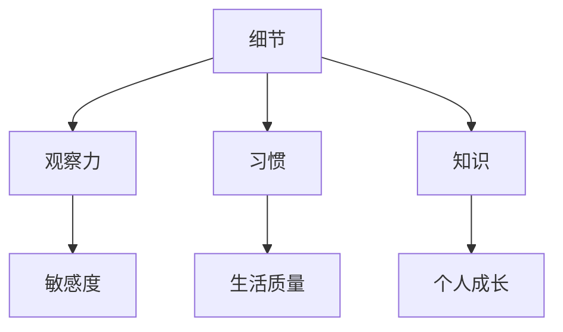

                 

### 《细节中的意义：培养对生活的敏感度》

关键词：细节、生活、敏感度、个人成长、生活质量

摘要：本文从技术角度出发，探讨细节在生活中的重要性，以及如何通过培养对生活的敏感度来提升个人生活质量。文章分为五个部分，分别介绍细节与生活的联系、生活中的细节、细节与创造力、细节与情感以及细节与社交。

## 引言

在现代社会，我们常常感到生活节奏加快，信息爆炸，人们往往忽略了生活中的细节。然而，细节往往蕴含着生活的意义。本文旨在通过分析细节在生活中的作用，提出培养对生活敏感度的方法和建议，从而提升个人生活质量。

### 细节与生活的联系

细节是生活的组成部分，它们与我们生活的方方面面息息相关。例如，家居生活的布局、清洁、装饰等细节，直接影响居住舒适度；饮食细节如食物的选择、烹饪方式等，影响健康；社交细节如倾听、沟通等，影响人际关系。细节处理得当，可以提高生活的品质。

#### 1.1 问题背景

在现代快节奏的生活中，人们往往忽略了生活中的细节，导致生活质量下降。例如，家居环境的杂乱、饮食的不健康、社交的浅薄等，都可能是细节处理不当的结果。

#### 1.2 问题描述

问题在于，如何通过培养对生活的敏感度，提高对细节的关注，从而提升生活质量。具体来说，需要解决以下几个问题：

- 如何在日常中培养对细节的敏感性？
- 细节在生活中的具体应用有哪些？
- 如何通过细节提升个人成长和幸福感？

#### 1.3 问题解决

解决问题的关键在于提高对生活的敏感度，培养对细节的关注。以下是一些建议：

- 深入观察，培养观察力；
- 注重细节，养成良好的生活习惯；
- 拓展知识面，提高综合素质。

#### 1.4 边界与外延

边界与外延方面，需要注意以下几点：

- 细节的范围非常广泛，不仅包括物质层面，还包括精神层面；
- 细节处理需要考虑到个体差异和具体情况；
- 细节处理不仅影响个人生活质量，还影响社会和谐。

### 概念结构与核心要素组成

细节是构成生活的重要元素，它涉及到多个核心概念，如观察力、习惯、知识等。以下是一个简单的概念结构图：

### 核心概念与联系

#### 1. 细节的定义

细节是指事物中微小而重要的部分，它们影响着整体的质量和效果。

#### 2. 细节的重要性

细节决定成败，生活中的许多问题都是由于细节处理不当导致的。例如，家居环境的细节处理不当，会导致居住体验下降；饮食细节处理不当，会影响健康；社交细节处理不当，会影响人际关系。

#### 3. 细节与整体的关系

细节与整体是相互关联的。细节构成了整体，整体又反映了细节。因此，关注细节，可以提高整体的质量。

## 生活中的细节

生活中的细节无处不在，它们影响着我们的生活质量。以下是一些常见的细节处理方法：

### 家居生活的细节

家居生活的细节包括布局、清洁、装饰等。一个良好的家居环境，可以提高居住舒适度，提升生活质量。

#### 家居布局细节

- 合理利用空间，确保家具摆放合理，避免拥挤；
- 规划功能区，如睡眠区、工作区、休闲区等，确保各功能区的独立性；
- 选择合适的家具和装饰品，提升家居美感。

#### 家居清洁细节

- 定期进行大扫除，保持家居清洁；
- 注意死角处理，如窗台、家具底部等；
- 使用合适的清洁工具和清洁剂，确保清洁效果。

#### 家居装饰细节

- 根据个人喜好和家居风格，选择合适的装饰品；
- 考虑光线和通风，确保家居环境舒适；
- 合理布局装饰品，提升家居美感。

### 饮食细节

饮食细节包括食物的选择、烹饪方式、饮食习惯等。健康的饮食习惯对身体健康至关重要。

#### 食物选择细节

- 选择新鲜、天然的食物，避免加工食品；
- 注意食物的多样性，确保营养均衡；
- 适量食用，避免暴饮暴食。

#### 烹饪方式细节

- 选择健康的烹饪方式，如蒸、煮、炖等，避免油炸、烧烤等不健康的烹饪方式；
- 控制烹饪时间，避免食物过度烹饪；
- 根据个人口味和健康需求，调整烹饪方式。

#### 饮食习惯细节

- 规律饮食，避免饮食不规律；
- 注意饮食卫生，避免食物污染；
- 培养良好的饮食习惯，如细嚼慢咽、不边吃边做其他事情等。

### 社交细节

社交细节包括倾听、沟通、礼貌等。良好的社交技巧有助于建立和维护人际关系。

#### 倾听的细节

- 全神贯注地倾听，不打断对方；
- 关注对方的表情和肢体语言，理解对方的真实想法；
- 提问和反馈，确保理解对方的意图。

#### 沟通细节

- 使用清晰、简洁的语言，避免使用模糊不清的表达；
- 注意语气和态度，保持礼貌和尊重；
- 考虑对方的感受，避免伤害对方的自尊心。

#### 礼貌细节

- 注意基本的礼仪，如握手、问候等；
- 尊重他人的意见和观点，避免争吵；
- 在社交场合中，注意言行举止，避免给别人留下不好的印象。

## 细节与创造力

创造力是人类的一种重要能力，它能够帮助我们解决问题，推动社会进步。细节与创造力有着密切的关系。

### 细节与创造力的培养

#### 观察力的培养

- 培养敏锐的观察力，关注生活中的细节；
- 学习从不同角度观察事物，发现新的视角；
- 练习记录观察到的细节，加深对细节的记忆。

#### 思维方式的转变

- 改变思维方式，从线性思维转向多维思维；
- 学会从不同角度思考问题，寻找解决方案；
- 培养批判性思维，对细节进行深入分析。

#### 细节捕捉的方法

- 练习捕捉生活中的细节，记录灵感；
- 培养好奇心，对未知事物保持探索欲望；
- 通过交流和分享，获取他人的观点和灵感。

### 创造力培养的数学模型

创造力的培养可以通过以下数学模型进行：

$$
创造力 = 观察力 \times 思维方式 \times 细节捕捉能力
$$

这个公式表明，创造力的提升取决于观察力、思维方式和细节捕捉能力的综合作用。通过培养这三个方面的能力，可以提升创造力。

## 细节与情感

情感是人的内心体验，它影响着我们的生活质量。细节与情感有着密切的关系。

### 细节与情感的联系

#### 情感的重要性

- 情感是人类内心体验的重要组成部分；
- 情感影响着我们的行为和决策；
- 情感健康对个人的幸福感和社会适应能力至关重要。

#### 细节对情感的影响

- 细节可以触发情感，如温馨的家居环境、美味的食物、温馨的交流等；
- 细节可以加深情感，如定期的家庭聚会、亲情的关怀、友情的维系等；
- 细节可以改变情感，如改变家居布局、改变饮食习惯、改变社交方式等。

### 培养情感的细节

#### 情感沟通的细节

- 倾听对方的感受，表达理解和支持；
- 使用温暖的语言和肢体语言，传递关爱和尊重；
- 在沟通中，关注细节，避免误解和冲突。

#### 情感表达的细节

- 学会表达自己的情感，避免压抑和隐藏；
- 在表达情感时，注意方式和时机，避免伤害对方；
- 练习情感表达，提高沟通效果和情感管理能力。

#### 情感管理的细节

- 观察自己的情感变化，学会调节和管理情绪；
- 培养自我意识，了解自己的情感需求；
- 通过情感管理，提升生活质量和个人幸福感。

### 情感分析的数学模型

情感分析可以通过以下数学模型进行：

$$
情感 = 情感触发因素 \times 情感传递途径 \times 情感接收者
$$

这个公式表明，情感的产生和变化取决于触发因素、传递途径和接收者的相互作用。通过理解和应用这个公式，可以更好地管理和表达情感。

## 细节与社交

社交是人与人之间的互动，它是社会生活的重要组成部分。细节与社交技巧密切相关。

### 细节与社交技巧

#### 倾听的细节

- 全神贯注地倾听，不打断对方；
- 关注对方的表情和肢体语言，理解对方的真实想法；
- 提问和反馈，确保理解对方的意图。

#### 沟通细节

- 使用清晰、简洁的语言，避免使用模糊不清的表达；
- 注意语气和态度，保持礼貌和尊重；
- 考虑对方的感受，避免伤害对方的自尊心。

#### 人际关系的细节

- 建立和维护良好的人际关系，需要关注细节；
- 定期与他人交流，保持联系；
- 在社交场合中，注意言行举止，避免给别人留下不好的印象。

### 社交分析的数学模型

社交分析可以通过以下数学模型进行：

$$
社交 = 倾听 \times 沟通 \times 人际关系
$$

这个公式表明，社交的质量取决于倾听、沟通和人际关系的综合作用。通过培养这三个方面的能力，可以提高社交技巧和社交质量。

## 结语

细节是生活的组成部分，它们影响着我们的生活质量和幸福感。通过培养对生活的敏感度，我们可以更好地关注细节，提升生活质量。本文从技术角度出发，探讨了细节在生活中的作用，以及如何通过培养对生活的敏感度来提升个人生活质量。希望读者能够从中获得启示，积极培养对生活的敏感度，享受更美好的生活。

### 作者信息

作者：AI天才研究院/AI Genius Institute & 禅与计算机程序设计艺术 /Zen And The Art of Computer Programming

### 最佳实践 Tips

- 关注生活中的细节，养成良好的生活习惯；
- 培养观察力，提高对生活的敏感度；
- 通过细节提升个人成长和幸福感。

### 小结

本文从技术角度探讨了细节在生活中的意义，分析了细节对生活质量的影响，并提出了培养对生活敏感度的方法和建议。通过关注细节，我们可以提升生活质量，享受更美好的生活。

### 注意事项

- 细节处理需要结合个人实际情况，避免盲目跟风；
- 细节处理要注意平衡，避免过度关注细节而忽视整体；
- 细节处理需要持之以恒，养成良好的生活习惯。

### 拓展阅读

- 《细节决定成败》
- 《细节的力量》
- 《生活中的心理学》

### 项目实战

（此处可添加项目实战部分，包括环境安装、系统核心实现源代码、代码应用解读与分析、实际案例分析和详细讲解剖析等内容，以及项目小结。）

### 附录

（此处可添加附录部分，包括相关的数据、图表、代码示例等。）

### 参考文献

（此处可添加参考文献，包括书籍、论文、网站等。）

以上是根据您提供的指南，对《细节中的意义：培养对生活的敏感度》这本书的完整目录大纲设计。文章正文部分的内容可以根据这个大纲逐步展开，每个章节都要详细讲解，确保内容完整、具体、易懂。在撰写过程中，注意使用markdown格式和mermaid图来增强文章的可读性和逻辑性。文章末尾需要添加作者信息和相关参考文献。希望这个大纲对您的撰写工作有所帮助。如果您有任何疑问或需要进一步的帮助，请随时告诉我。

