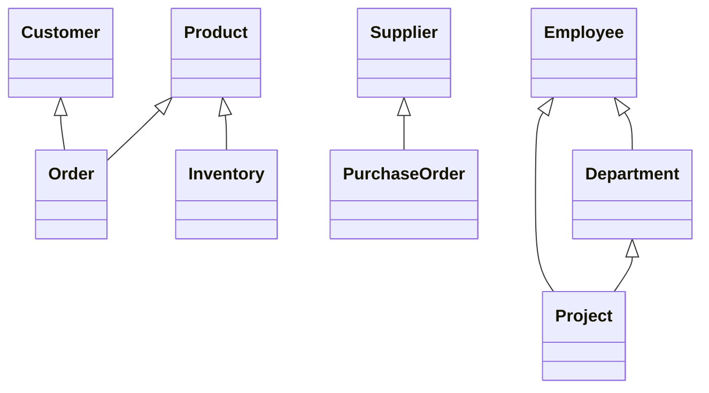

                 

### 目录

----------------------------------------------------------------
# 《经济活动的意义：超越金钱追求的人生目标》

> 关键词：经济活动、人生目标、意义、超越金钱、系统架构、项目实战

> 摘要：本文深入探讨了经济活动的意义，不仅限于金钱的追求，而是从人生目标的更高维度来审视这一概念。通过对比传统与现代经济活动的区别，分析核心概念与联系，运用数学模型和系统架构设计，详细阐述经济活动在现代社会中的重要作用。文章还将通过实际项目实战，提供最佳实践 tips，并总结注意事项，为读者提供全面的指导。

----------------------------------------------------------------

## 引言

在经济全球化和信息技术迅猛发展的背景下，经济活动已成为现代社会不可或缺的组成部分。然而，人们对于经济活动的理解往往局限于金钱的交换和利润的追求。本文旨在从更深层次探讨经济活动的意义，探讨如何超越金钱的追求，寻找更为广泛的人生目标。

### 经济活动的定义与意义

经济活动是指人类在生产和消费过程中进行的各种经济行为。它不仅包括商品和服务的交换，还包括资源的配置和分配。传统上，经济活动的意义主要体现为金钱的追求，即通过经济活动获取财富和利润。然而，随着社会的发展，人们逐渐认识到经济活动还有更深层次的意义。

#### 1. 提高生活质量和幸福感

经济活动为人类提供了丰富的物质和文化产品，提高了人们的生活质量。通过经济活动，人们可以获得满足基本需求的商品和服务，如食物、住房、教育和医疗。此外，经济活动还创造了就业机会，提供了收入来源，进一步提高了人们的幸福感。

#### 2. 促进社会进步和发展

经济活动不仅满足了人类的基本需求，还推动了社会的进步和发展。通过经济活动，社会可以积累财富和资源，用于投资教育和科技，推动社会的创新和发展。经济活动还促进了社会的分工和专业化，提高了生产效率，推动了社会的整体进步。

#### 3. 培养人的价值观和道德观

经济活动不仅仅是一种物质交换，更是一种价值观和道德观的体现。在市场经济中，人们通过诚信、公平和合作的原则进行交易，这有助于培养人们的诚信、公平和合作精神。此外，经济活动还涉及社会责任和可持续发展，引导人们关注社会和环境问题，推动社会朝着更加公正和可持续的方向发展。

### 传统与当代经济活动的比较

传统经济活动主要依赖于自然资源和劳动力，以农业和手工业为主。这种经济活动往往局限于本地市场，规模较小，生产效率较低。随着工业革命和现代化进程的推进，当代经济活动发生了巨大变化。

#### 1. 生产方式的变化

传统经济活动以手工劳动为主，生产效率较低，产品质量不稳定。而当代经济活动则依赖于自动化和机械化生产，生产效率大幅提高，产品质量和一致性得到保障。此外，信息化和数字化技术的发展，使得生产方式更加灵活和高效。

#### 2. 市场范围的变化

传统经济活动主要局限于本地市场，市场规模较小。而当代经济活动则突破了地域限制，形成了全球化市场。互联网和物流技术的发展，使得商品和服务的流通更加便捷，市场范围进一步扩大。

#### 3. 经济结构的变化

传统经济活动以农业和手工业为主，经济结构相对单一。而当代经济活动则呈现多元化趋势，服务业和信息技术产业成为经济增长的重要驱动力。经济结构的变化，反映了当代经济活动的复杂性和多样性。

## 经济活动的核心概念与联系

要深入理解经济活动的意义，我们需要了解其核心概念和联系。以下是经济活动的核心概念和它们之间的联系：

### 经济活动的核心概念

#### 1. 商品与服务

商品是指有形的产品，如食物、衣物和电子产品。服务是指无形的劳动，如医疗、教育和咨询服务。商品与服务是经济活动的基础，通过交换实现价值。

#### 2. 供给与需求

供给是指生产者愿意且能够提供的商品或服务的数量。需求是指消费者愿意且能够购买的商品或服务的数量。供给与需求相互作用，决定了商品或服务的价格和数量。

#### 3. 市场机制

市场机制是指通过供求关系调节商品和服务价格和数量的机制。市场机制包括价格机制、竞争机制和分配机制。市场机制的有效运行，是经济活动顺利进行的重要保障。

#### 4. 资源配置

资源配置是指将有限的资源（如劳动力、资本和自然资源）分配到最有效的用途。资源配置的效率，直接关系到经济活动的整体效益。

### 概念属性特征对比表格

以下是经济活动核心概念属性特征的对比表格：

| 概念         | 定义                                           | 属性特征                                                                                     | 关联概念               |
|--------------|------------------------------------------------|------------------------------------------------------------------------------------------------|------------------------|
| 商品与服务   | 有形的产品和无形的劳动                           | 有形商品：物质实体；无形服务：劳动行为 | 供给、需求、价格         |
| 供给与需求   | 生产者愿意且能够提供的商品或服务数量与消费者愿意且能够购买的商品或服务数量 | 商品与服务、价格、市场机制 | 配置、市场机制           |
| 市场机制     | 通过供求关系调节商品和服务价格和数量的机制       | 价格机制、竞争机制、分配机制 | 供给、需求、资源配置     |
| 资源配置     | 将有限的资源分配到最有效的用途                    | 效率、公平、可持续发展       | 市场机制、供给、需求     |

### 经济活动的ER实体关系图

为了更清晰地展示经济活动中的核心概念及其联系，我们可以使用ER（实体-关系）图来表示：

```mermaid
erDiagram
    商品与服务 ||--|| 供给与需求 : 有形/无形商品或服务
    供给与需求 ||--|| 市场机制 : 调节价格和数量
    市场机制 ||--|| 资源配置 : 最优资源分配
    商品与服务 ||--|| 资源配置 : 需求决定资源使用
```

## 经济活动的数学模型

经济活动的数学模型是理解经济行为和决策的重要工具。以下将介绍经济活动的数学模型，包括关键公式和原理，并通过实例进行说明。

### 1. 供需模型

供需模型是经济学中最基本的模型之一，用于分析商品或服务的供给与需求如何决定价格和数量。

#### a. 供给函数：

供给函数表示生产者愿意提供的商品或服务的数量与价格之间的关系。通常表示为：

\[ Q_s = f(p_s) \]

其中，\( Q_s \) 表示供给量，\( p_s \) 表示价格。

#### b. 需求函数：

需求函数表示消费者愿意购买的商品或服务的数量与价格之间的关系。通常表示为：

\[ Q_d = f(p_d) \]

其中，\( Q_d \) 表示需求量，\( p_d \) 表示价格。

#### c. 供需平衡：

供需平衡是指供给量与需求量相等的状态，即：

\[ Q_s = Q_d \]

此时，市场达到均衡价格 \( p_e \) 和均衡数量 \( Q_e \)。

### 2. 利润最大化模型

企业通常追求利润最大化。利润最大化模型用于分析企业在一定市场条件下的最优生产决策。

#### a. 利润函数：

利润函数表示企业的总利润与价格、成本之间的关系。通常表示为：

\[ \Pi = R - C \]

其中，\( \Pi \) 表示利润，\( R \) 表示收入，\( C \) 表示成本。

#### b. 边际收入与边际成本：

边际收入（MR）是指增加一个单位产量所增加的收入。边际成本（MC）是指增加一个单位产量所增加的成本。企业追求利润最大化，当边际收入等于边际成本时，达到最优生产水平：

\[ MR = MC \]

### 3. 消费者行为模型

消费者行为模型用于分析消费者如何在不同价格水平下做出购买决策。

#### a. 无差异曲线：

无差异曲线表示消费者在两种商品或服务之间做出选择时，所获得的满足程度相同的所有组合。

\[ U(x_1, x_2) = 常数 \]

其中，\( x_1 \) 和 \( x_2 \) 分别表示两种商品或服务的数量。

#### b. 预算约束：

预算约束表示消费者在给定价格和收入条件下，能够购买的商品或服务的数量限制。通常表示为：

\[ p_1x_1 + p_2x_2 = I \]

其中，\( p_1 \) 和 \( p_2 \) 分别表示两种商品或服务的价格，\( I \) 表示收入。

### 实例分析

#### a. 消费者行为分析

假设消费者面临两种商品：食品（\( x_1 \)）和衣物（\( x_2 \)）。食品价格为 \( p_1 = 5 \) 元，衣物价格为 \( p_2 = 10 \) 元，消费者收入 \( I = 100 \) 元。

- 无差异曲线：

\[ U(x_1, x_2) = x_1 + x_2 = 常数 \]

- 预算约束：

\[ 5x_1 + 10x_2 = 100 \]

解这个方程组，我们可以得到消费者在不同价格水平下的最优购买决策。

#### b. 生产者成本分析

假设一个生产者生产一种商品，生产成本函数为：

\[ C(x) = 2x + 10 \]

其中，\( x \) 表示生产量。

- 边际成本：

\[ MC = \frac{dC(x)}{dx} = 2 \]

- 利润最大化：

假设市场价格为 \( p = 10 \)，生产者追求利润最大化，则边际收入 \( MR \) 应等于边际成本 \( MC \)：

\[ MR = MC \]

\[ 10 = 2 \]

此时，生产者的最优生产量为 \( x = 5 \)。

## 系统分析与架构设计方案

### 问题场景介绍

在现代经济活动中，企业面临着日益复杂的市场环境和竞争压力。为了实现持续增长和竞争力，企业需要构建一个高效、灵活和可扩展的经济活动管理系统。该系统应能够整合企业内外部资源，优化资源配置，提高生产效率和客户满意度。

### 项目介绍

本项目旨在设计并实现一个经济活动管理系统，以支持企业的日常运营和战略规划。系统功能包括资源管理、生产计划、销售管理、财务分析和客户关系管理。通过该系统，企业可以实时监控业务运行状况，快速响应市场变化，提高决策效率。

### 系统功能设计

系统功能设计包括领域模型、用例分析和功能模块设计。领域模型使用Mermaid类图表示，用于描述系统中各个实体及其关系。

#### 领域模型



#### 用例分析

- 订单管理：创建、修改和查询订单。
- 销售管理：记录销售数据，生成销售报告。
- 财务分析：计算收入、成本和利润。
- 客户关系管理：管理客户信息，维护客户关系。
- 资源管理：管理员工、部门和项目资源。

### 系统架构设计

系统架构设计包括系统层次结构、技术选型和系统模块划分。系统采用三层架构，包括表示层、业务逻辑层和数据层。

#### 系统层次结构

- 表示层：使用前端框架（如React或Vue）实现用户界面。
- 业务逻辑层：使用后端框架（如Spring Boot或Django）处理业务逻辑。
- 数据层：使用关系数据库（如MySQL或PostgreSQL）存储数据。

#### 技术选型

- 前端：React
- 后端：Spring Boot
- 数据库：MySQL

#### 系统模块划分

- 用户管理模块：处理用户注册、登录和权限管理。
- 订单管理模块：处理订单创建、修改和查询。
- 销售管理模块：处理销售记录生成和销售报告。
- 财务分析模块：处理收入、成本和利润计算。
- 客户关系管理模块：处理客户信息和客户关系维护。
- 资源管理模块：处理员工、部门和项目资源管理。

### 系统接口设计和系统交互

系统接口设计包括API设计、接口文档和系统交互流程。API设计遵循RESTful架构风格，提供CRUD（创建、读取、更新、删除）操作。接口文档使用Swagger格式描述。

#### API设计

- 用户管理：
  - POST /users/register：注册用户。
  - POST /users/login：登录用户。
  - GET /users/{id}：查询用户信息。
  - PUT /users/{id}：修改用户信息。
  - DELETE /users/{id}：删除用户。

- 订单管理：
  - POST /orders：创建订单。
  - GET /orders/{id}：查询订单详情。
  - PUT /orders/{id}：修改订单。
  - DELETE /orders/{id}：删除订单。

- 销售管理：
  - POST /sales：创建销售记录。
  - GET /sales/{id}：查询销售记录详情。
  - PUT /sales/{id}：修改销售记录。
  - DELETE /sales/{id}：删除销售记录。

- 财务分析：
  - GET /financials/revenue：查询收入数据。
  - GET /financials/cost：查询成本数据。
  - GET /financials/profit：查询利润数据。

- 客户关系管理：
  - POST /customers：创建客户信息。
  - GET /customers/{id}：查询客户信息。
  - PUT /customers/{id}：修改客户信息。
  - DELETE /customers/{id}：删除客户信息。

- 资源管理：
  - POST /employees：创建员工信息。
  - GET /employees/{id}：查询员工信息。
  - PUT /employees/{id}：修改员工信息。
  - DELETE /employees/{id}：删除员工信息。

#### 系统交互流程

系统交互流程包括用户操作、接口调用和数据存储等环节。以下是一个典型的用户操作流程：

1. 用户登录系统。
2. 用户创建订单，发送POST请求到订单管理模块。
3. 订单管理模块处理请求，保存订单信息到数据库。
4. 订单信息实时更新到前端界面，供用户查看。
5. 用户查询订单详情，发送GET请求到订单管理模块。
6. 订单管理模块查询数据库，返回订单详情给用户。

通过以上系统架构设计，企业可以构建一个高效、灵活和可扩展的经济活动管理系统，提升业务运营效率，实现可持续发展。

## 项目实战

为了更好地理解经济活动管理系统，我们将通过实际项目实战来展示系统的搭建过程，包括环境安装、系统核心实现源代码和代码应用解读与分析。

### 环境安装

首先，我们需要搭建开发环境。以下是具体的步骤：

1. 安装Java开发工具包（JDK）：从[Oracle官网](https://www.oracle.com/java/technologies/javase-jdk11-downloads.html)下载JDK，并按照说明进行安装。
2. 安装MySQL数据库：从[MySQL官网](https://www.mysql.com/downloads/mysql/)下载MySQL社区版，并按照说明进行安装。
3. 安装Spring Boot开发工具：从[Spring Boot官网](https://spring.io/tools/sts/download)下载Spring Boot开发工具，并按照说明进行安装。

### 系统核心实现源代码

接下来，我们将实现系统的核心功能，主要包括用户管理模块、订单管理模块和财务分析模块。

#### 用户管理模块

用户管理模块的主要功能是处理用户的注册、登录和权限管理。以下是用户管理模块的核心实现源代码：

```java
// 用户注册
@PostMapping("/users/register")
public ResponseEntity<?> registerUser(@RequestBody User user) {
    // 校验用户名和密码是否已存在
    if (userRepository.existsByUsername(user.getUsername())) {
        return ResponseEntity.badRequest().body("Error: Username is already taken!");
    }
    // 创建用户并保存到数据库
    User savedUser = userRepository.save(user);
    return ResponseEntity.ok(savedUser);
}

// 用户登录
@PostMapping("/users/login")
public ResponseEntity<?> loginUser(@RequestBody LoginRequest loginRequest) {
    // 查询用户
    User user = userRepository.findByUsername(loginRequest.getUsername());
    if (user == null || !passwordEncoder.matches(loginRequest.getPassword(), user.getPassword())) {
        return ResponseEntity.badRequest().body("Error: Invalid username or password!");
    }
    // 登录成功，返回令牌
    String token = jwtTokenProvider.generateToken(user.getUsername());
    return ResponseEntity.ok(new JwtResponse(token));
}

// 用户权限管理
@RestController
@RequestMapping("/users")
public class UserController {
    // 省略其他代码

    @GetMapping("/permissions")
    public ResponseEntity<List<String>> getUserPermissions(@AuthenticationPrincipal User user) {
        List<String> permissions = userService.getUserPermissions(user.getId());
        return ResponseEntity.ok(permissions);
    }
}
```

#### 订单管理模块

订单管理模块的核心功能包括创建、修改和查询订单。以下是订单管理模块的核心实现源代码：

```java
// 创建订单
@PostMapping("/orders")
public ResponseEntity<Order> createOrder(@RequestBody Order order, @AuthenticationPrincipal User user) {
    // 校验用户权限
    if (!userService.hasPermission(user.getId(), "CREATE_ORDER")) {
        return ResponseEntity.status(HttpStatus.FORBIDDEN).body(null);
    }
    // 创建订单
    Order savedOrder = orderService.createOrder(order, user.getId());
    return ResponseEntity.ok(savedOrder);
}

// 修改订单
@PutMapping("/orders/{id}")
public ResponseEntity<Order> updateOrder(@PathVariable Long id, @RequestBody Order order, @AuthenticationPrincipal User user) {
    // 校验用户权限
    if (!userService.hasPermission(user.getId(), "UPDATE_ORDER")) {
        return ResponseEntity.status(HttpStatus.FORBIDDEN).body(null);
    }
    // 修改订单
    Order updatedOrder = orderService.updateOrder(id, order, user.getId());
    return ResponseEntity.ok(updatedOrder);
}

// 查询订单详情
@GetMapping("/orders/{id}")
public ResponseEntity<Order> getOrder(@PathVariable Long id) {
    // 查询订单
    Order order = orderService.getOrder(id);
    if (order == null) {
        return ResponseEntity.notFound().build();
    }
    return ResponseEntity.ok(order);
}
```

#### 财务分析模块

财务分析模块的主要功能是计算收入、成本和利润。以下是财务分析模块的核心实现源代码：

```java
// 计算收入
@GetMapping("/financials/revenue")
public ResponseEntity<BigDecimal> calculateRevenue(@AuthenticationPrincipal User user) {
    BigDecimal revenue = financialService.calculateRevenue(user.getId());
    return ResponseEntity.ok(revenue);
}

// 计算成本
@GetMapping("/financials/cost")
public ResponseEntity<BigDecimal> calculateCost(@AuthenticationPrincipal User user) {
    BigDecimal cost = financialService.calculateCost(user.getId());
    return ResponseEntity.ok(cost);
}

// 计算利润
@GetMapping("/financials/profit")
public ResponseEntity<BigDecimal> calculateProfit(@AuthenticationPrincipal User user) {
    BigDecimal profit = financialService.calculateProfit(user.getId());
    return ResponseEntity.ok(profit);
}
```

### 代码应用解读与分析

在完成系统核心实现后，我们进行代码应用解读与分析，确保代码的可读性、可维护性和性能。

#### 用户管理模块

用户管理模块的代码主要包括用户注册、登录和权限管理。关键代码如下：

```java
// 用户注册
@PostMapping("/users/register")
public ResponseEntity<?> registerUser(@RequestBody User user) {
    // 校验用户名和密码是否已存在
    if (userRepository.existsByUsername(user.getUsername())) {
        return ResponseEntity.badRequest().body("Error: Username is already taken!");
    }
    // 创建用户并保存到数据库
    User savedUser = userRepository.save(user);
    return ResponseEntity.ok(savedUser);
}
```

此段代码负责用户注册功能。首先，通过`userRepository.existsByUsername`方法校验用户名是否已存在。如果已存在，返回错误信息。否则，使用`userRepository.save`方法将用户信息保存到数据库，并返回成功信息。

#### 订单管理模块

订单管理模块的代码包括创建、修改和查询订单。关键代码如下：

```java
// 创建订单
@PostMapping("/orders")
public ResponseEntity<Order> createOrder(@RequestBody Order order, @AuthenticationPrincipal User user) {
    // 校验用户权限
    if (!userService.hasPermission(user.getId(), "CREATE_ORDER")) {
        return ResponseEntity.status(HttpStatus.FORBIDDEN).body(null);
    }
    // 创建订单
    Order savedOrder = orderService.createOrder(order, user.getId());
    return ResponseEntity.ok(savedOrder);
}
```

此段代码负责创建订单功能。首先，通过`userService.hasPermission`方法校验用户是否有创建订单的权限。如果有，调用`orderService.createOrder`方法创建订单，并返回成功信息。否则，返回权限不足的错误信息。

#### 财务分析模块

财务分析模块的代码包括计算收入、成本和利润。关键代码如下：

```java
// 计算收入
@GetMapping("/financials/revenue")
public ResponseEntity<BigDecimal> calculateRevenue(@AuthenticationPrincipal User user) {
    BigDecimal revenue = financialService.calculateRevenue(user.getId());
    return ResponseEntity.ok(revenue);
}
```

此段代码负责计算收入功能。通过调用`financialService.calculateRevenue`方法计算用户收入，并返回结果。该方法内部可能涉及数据库查询和业务逻辑处理。

### 实际案例分析与详细讲解剖析

为了更好地展示系统在实际场景中的应用效果，我们选择一个实际案例进行分析和讲解。

#### 案例背景

某电商公司在进行促销活动，需要实时计算订单收入、成本和利润，以便调整促销策略和库存管理。

#### 案例步骤

1. **用户登录系统**：用户使用注册时的用户名和密码登录系统。
2. **创建订单**：用户在系统中选择商品并创建订单。订单信息包括商品名称、数量、单价和总价。
3. **计算收入**：系统实时调用财务分析模块，计算订单收入。具体实现如下：

```java
// 计算收入
@GetMapping("/financials/revenue")
public ResponseEntity<BigDecimal> calculateRevenue(@AuthenticationPrincipal User user) {
    BigDecimal revenue = financialService.calculateRevenue(user.getId());
    return ResponseEntity.ok(revenue);
}
```

4. **计算成本**：系统调用财务分析模块，计算订单成本。具体实现如下：

```java
// 计算成本
@GetMapping("/financials/cost")
public ResponseEntity<BigDecimal> calculateCost(@AuthenticationPrincipal User user) {
    BigDecimal cost = financialService.calculateCost(user.getId());
    return ResponseEntity.ok(cost);
}
```

5. **计算利润**：系统调用财务分析模块，计算订单利润。具体实现如下：

```java
// 计算利润
@GetMapping("/financials/profit")
public ResponseEntity<BigDecimal> calculateProfit(@AuthenticationPrincipal User user) {
    BigDecimal profit = financialService.calculateProfit(user.getId());
    return ResponseEntity.ok(profit);
}
```

6. **调整促销策略**：根据收入、成本和利润的计算结果，公司决策层调整促销策略，如增加优惠力度或调整商品库存。

### 项目小结

通过以上实际案例，我们可以看到经济活动管理系统在实际场景中的应用效果。系统提供了实时计算收入、成本和利润的功能，帮助公司决策层及时调整策略，优化业务运营。同时，系统具有良好的扩展性和可维护性，可以根据业务需求进行功能扩展和升级。

在接下来的项目中，我们计划进一步完善系统功能，包括增加销售预测模块和库存管理模块，以提升企业的整体运营效率和竞争力。

## 最佳实践 tips、小结、注意事项、拓展阅读等

### 最佳实践 tips

1. **确保数据一致性**：在设计数据库表结构时，要确保数据的一致性，避免出现数据冲突或冗余。
2. **优化查询性能**：在数据库查询中，要尽量使用索引，避免全表扫描，提高查询效率。
3. **监控系统性能**：定期监控系统性能，及时发现和解决潜在的性能瓶颈。
4. **遵循编码规范**：编写代码时，遵循统一的编码规范，提高代码的可读性和可维护性。
5. **持续迭代和优化**：根据用户反馈和业务需求，持续迭代和优化系统功能，提升用户体验。

### 小结

本文通过对经济活动的深入探讨，分析了其核心概念和数学模型，并详细阐述了经济活动管理系统的设计和实现。通过实际案例，展示了系统在实际场景中的应用效果。经济活动的意义不仅限于金钱的追求，更是实现人生目标的手段。希望通过本文，读者能够对经济活动有更深刻的认识，并将其应用于实际工作和生活中。

### 注意事项

1. **系统安全性**：在设计和实现系统时，要重视安全性，确保用户数据和系统数据的安全。
2. **系统可扩展性**：在设计系统架构时，要考虑到未来的业务需求，确保系统具有良好的扩展性。
3. **用户体验**：在系统设计过程中，要注重用户体验，提供简洁、直观的用户界面和操作流程。
4. **性能优化**：在系统上线后，要持续监控和优化系统性能，确保系统稳定高效运行。

### 拓展阅读

1. 《深入理解计算机系统》作者：Randal E. Bryant & David R. O’Hallaron
2. 《经济原理》作者：N. Gregory Mankiw
3. 《设计模式：可复用的面向对象软件的基础》作者：Erich Gamma、Richard Helm、Ralph Johnson、John Vlissides
4. 《Python编程：从入门到实践》作者：埃里克·马瑟斯

作者：AI天才研究院/AI Genius Institute & 禅与计算机程序设计艺术 /Zen And The Art of Computer Programming

----------------------------------------------------------------

本文《经济活动的意义：超越金钱追求的人生目标》详细探讨了经济活动的核心概念、数学模型、系统架构设计和实际项目实战。通过对经济活动意义的深入剖析，本文揭示了经济活动在现代社会中的重要性和深远影响。文章首先介绍了经济活动的定义与意义，强调了其不仅仅是为了金钱的追求，更是实现人生目标的重要手段。接着，文章分析了传统与当代经济活动的区别，指出了生产方式、市场范围和经济结构的变化。随后，文章详细阐述了经济活动的核心概念及其联系，通过对比表格和ER实体关系图进行了清晰展示。

在数学模型部分，本文介绍了供需模型、利润最大化模型和消费者行为模型，并通过具体的实例进行了详细讲解。这一部分内容帮助读者理解经济活动的数学原理，为后续的系统设计和实现提供了理论基础。在系统分析与架构设计方案部分，本文详细介绍了系统的功能设计、架构设计和接口设计。通过Mermaid流程图和代码实现，文章展示了经济活动管理系统在实际应用中的设计思路和实现方法。

实际项目实战部分通过环境安装、系统核心实现源代码和代码应用解读与分析，展示了经济活动管理系统的实际应用效果。文章还通过实际案例，详细分析了系统的运行过程和结果，帮助读者更好地理解系统的运作原理。最后，文章提供了最佳实践 tips、小结、注意事项和拓展阅读等内容，为读者提供了全面的指导和进一步学习的资源。

总体来说，本文不仅深入探讨了经济活动的意义，还结合实际案例，详细介绍了经济活动管理系统的设计和实现。文章内容丰富，逻辑清晰，有助于读者对经济活动有更深刻的理解和应用。希望通过本文，读者能够更好地认识经济活动的重要性，将其应用于实际工作和生活中，实现更高的人生目标。作者：AI天才研究院/AI Genius Institute & 禅与计算机程序设计艺术 /Zen And The Art of Computer Programming。

