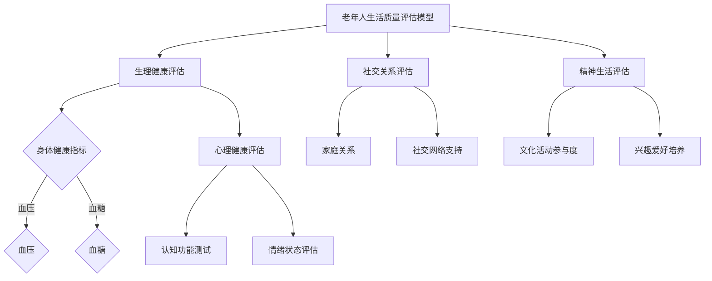
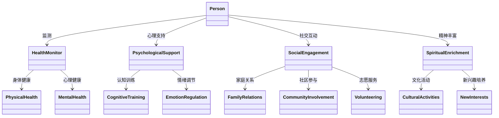
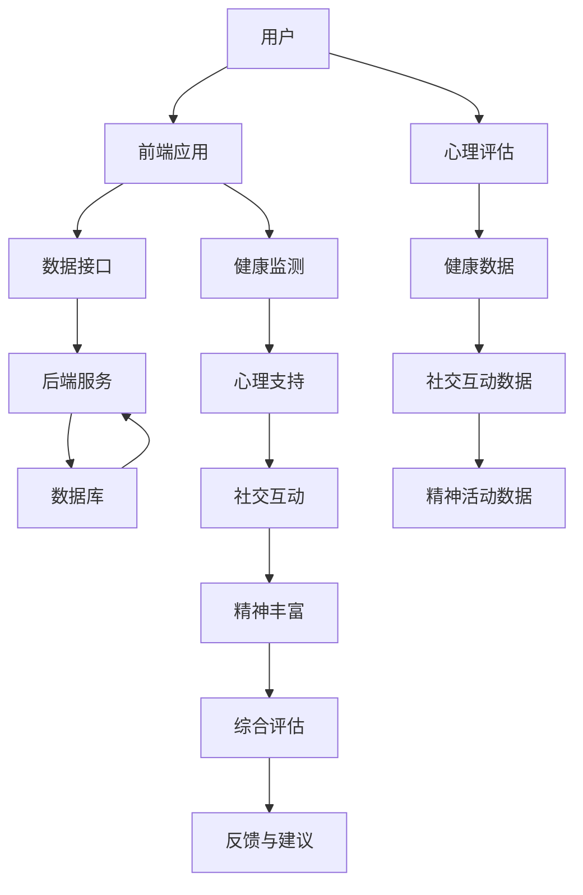
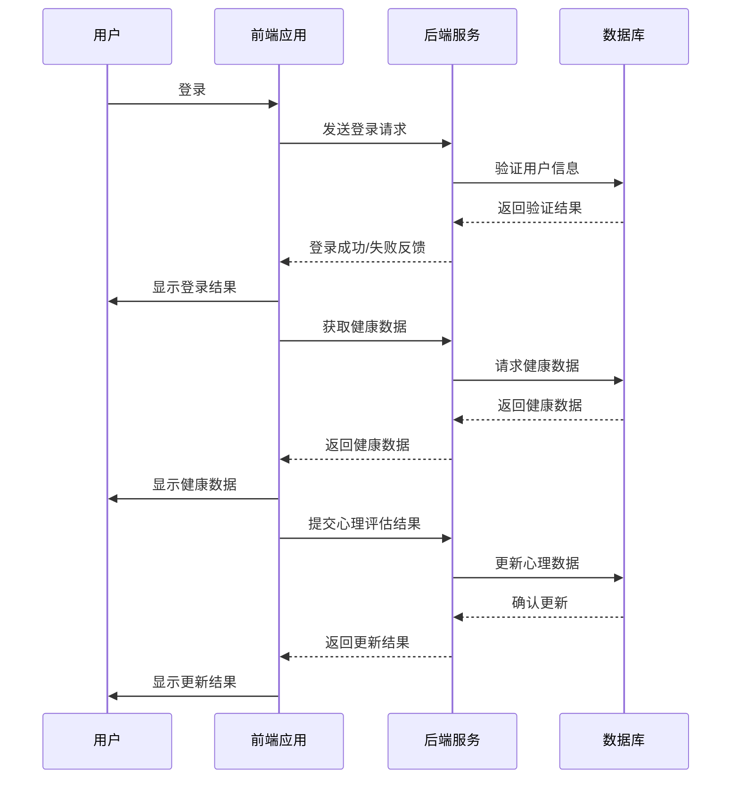

                 

# 老年生活的意义：重新定义晚年价值

关键词：老年生活，生活质量，心理健康，身体健康，社交关系，精神生活

摘要：本文通过深入探讨老年生活的多方面内容，为老年人提供重新定义晚年价值的方法和路径，帮助他们实现精神富足、身体健康和社交活跃，从而提升晚年生活质量。

---

## 第一部分：引言

### 1.1 问题背景

随着医疗技术的进步和生活条件的改善，人们的平均寿命显著延长，老年人群体日益庞大。根据联合国世界人口展望（2022年），全球60岁及以上人口预计将从2019年的13亿增长到2050年的21亿。这一变化不仅对社会结构、家庭关系和个体生活质量带来多重挑战，也提供了前所未有的机遇。

首先，老年人口的增加对社会结构产生了深远影响。退休人员的比例上升，劳动力市场面临压力，政府和社会组织需要调整政策，以应对养老和医疗服务的需求增加。同时，家庭结构也在发生变化，传统大家庭模式逐渐被小家庭所取代，老年人需要更多地依靠社区和公共资源来维持生活质量。

其次，家庭关系也受到考验。随着子女长大离家，老年人可能会面临孤独和失落。此外，经济负担的增加也是老年人群体面临的一个重要问题。退休储蓄可能不足以应对医疗和日常开支，导致财务压力。

然而，这一变化也带来了机遇。老年人拥有更多的闲暇时间和经验，可以更好地发掘自身的潜力和价值。通过重新定义晚年价值，老年人可以在身体、心理、社交和精神等多个方面实现自我提升，从而提高生活质量。

### 1.2 问题描述

老年生活的意义不仅仅体现在长寿，更在于晚年质量的提升。如何让老年人在晚年阶段找到生活的新价值，保持身心健康，积极参与社会和家庭生活，成为亟待解决的问题。具体来说，老年人面临以下几方面的挑战：

1. **身体健康**：随着年龄的增长，老年人容易出现各种健康问题，如慢性疾病、骨质疏松、听力下降等。这些健康问题不仅影响生活质量，还可能导致心理压力。

2. **心理健康**：老年人可能会面临抑郁、焦虑等心理问题。认知能力的下降也可能导致老年人产生孤独感和无助感。

3. **社交关系**：家庭关系的变化和社交网络的缩小可能导致老年人感到孤独和社会孤立。

4. **精神生活**：退休后，老年人可能会感到生活缺乏意义和目标，需要找到新的兴趣和活动来充实生活。

### 1.3 问题解决

本文旨在通过深入探讨老年生活的多方面内容，为老年人提供重新定义晚年价值的方法和路径，帮助他们实现精神富足、身体健康和社交活跃，从而提升晚年生活质量。具体来说，我们将从以下几个方面展开讨论：

1. **心理健康**：探讨心理健康的重要性，介绍心理健康提升的方法和策略。

2. **身体健康**：讨论身体健康的维护策略，包括运动、饮食和健康管理。

3. **社交关系**：探讨社交关系的重要性，介绍如何通过家庭互动和社区参与来建立和维护社交网络。

4. **精神生活**：讨论精神生活对老年人的影响，介绍如何通过文化活动和学习新技能来充实晚年生活。

### 1.4 边界与外延

本文主要关注60岁及以上的老年人群，探讨他们在身体、心理、社交、精神等各个层面的需求，以及如何通过社会支持、家庭关怀和个人努力来提升晚年生活质量。同时，我们也将讨论老年人如何在这个过程中找到生活的意义和目标。

### 1.5 概念结构与核心要素组成

#### 概念结构

- **老年生活**：指个体从退休后到生命结束的这段时期。
- **生活质量**：涵盖身体健康、心理健康、社交关系和生活满意度等维度。

#### 核心要素组成

- **身体健康**：包括生理健康和运动健康。
- **心理健康**：涉及情绪管理、认知功能和心理适应。
- **社交关系**：家庭、朋友和社会支持网络。
- **精神生活**：文化活动、兴趣爱好和人生意义。

---

## 第二部分：核心概念与联系

### 2.1 老年生活的核心概念

#### 2.1.1 老年生活的挑战与机遇

在探讨老年生活的核心概念时，我们首先需要认识到，老年生活并非仅仅是一个年龄阶段，而是一个充满挑战和机遇的过程。

#### 挑战：

1. **身体机能下降**：随着年龄的增长，老年人的身体机能逐渐下降，包括肌肉力量、柔韧性、视力和听力等。这些问题不仅影响日常生活，还可能导致心理健康问题。

2. **认知能力衰退**：老年人大脑的认知功能可能逐渐衰退，包括记忆力、注意力和判断力等。这种衰退可能会影响老年人的日常生活能力和心理状态。

3. **社会参与减少**：由于身体或心理状况的限制，老年人可能会减少参与社会活动，从而影响他们的社交网络和生活满意度。

4. **经济负担增加**：退休后，老年人的经济来源可能减少，医疗费用和其他生活开销可能会增加，导致经济压力。

#### 机遇：

1. **拥有更多时间进行自我探索**：退休后，老年人拥有更多的自由时间，可以用于自我探索、学习新技能或培养兴趣爱好。

2. **建立深厚的家庭关系**：老年人有更多时间与子女、孙辈相处，建立和巩固家庭关系。

3. **体验不同的人生阶段**：老年人有机会体验不同的人生阶段，如成为祖父母、参与孙辈的成长等。

4. **发展新的兴趣爱好**：退休为老年人提供了发展新兴趣爱好的机会，如绘画、音乐、园艺等。

#### 2.1.2 质量提升的策略

为了应对老年生活面临的挑战，同时把握机遇，提升生活质量，老年人可以采取以下策略：

##### 心理健康

1. **正念冥想**：通过正念冥想，老年人可以学会更好地管理情绪，减少焦虑和抑郁。

2. **积极心理学**：积极心理学强调关注个体的优势和积极体验，有助于提升老年人的心理健康。

3. **情绪调节技巧**：学习情绪调节技巧，如放松技巧、认知重构等，有助于老年人应对负面情绪。

##### 身体健康

1. **有氧运动**：有氧运动如快走、游泳和骑自行车等，有助于增强心肺功能，提高身体健康。

2. **力量训练**：力量训练可以增强肌肉力量，改善骨密度，降低跌倒风险。

3. **伸展和灵活性训练**：伸展和灵活性训练有助于保持关节的灵活性和柔韧性。

##### 社交关系

1. **家庭互动**：通过定期与家人沟通和互动，老年人可以维持和加深家庭关系。

2. **社区参与**：参与社区活动，如志愿者工作、兴趣小组等，可以帮助老年人建立社交网络。

3. **志愿服务**：志愿服务不仅有助于建立社交网络，还可以提高自我价值感。

##### 精神生活

1. **文化活动**：参与文化活动，如读书会、音乐会、戏剧等，可以丰富老年人的精神世界。

2. **学习新技能**：学习新技能，如绘画、乐器演奏、外语学习等，有助于保持大脑活跃，提升生活质量。

3. **自我实现**：通过实现个人目标，如完成家庭相册、写回忆录等，老年人可以找到生活的意义和目标。

---

## 第三部分：算法原理讲解

### 3.1 老年生活质量提升的算法原理

#### 3.1.1 老年生活质量评估模型

为了系统地提升老年人的生活质量，我们需要一个全面的生活质量评估模型。这个模型将综合考虑老年人的生理健康、心理健康、社交关系和精神生活等多个维度，从而为老年人提供个性化的提升方案。

##### 模型架构

使用Mermaid流程图来展示老年生活质量评估模型：



##### 数学模型

使用LaTeX格式来展示数学模型：

$$
QOL = w_1 \cdot H + w_2 \cdot P + w_3 \cdot S + w_4 \cdot E
$$

其中：
- \( QOL \) 是老年生活质量总分。
- \( w_1, w_2, w_3, w_4 \) 分别是生理健康、心理健康、社交关系、精神生活的权重系数。

这些权重系数可以根据老年人的具体情况进行调整，以确保评估模型能够准确反映他们的生活质量。

### 3.1.2 举例说明

#### 案例：王大爷的生活质量提升

王大爷，65岁，退休教师。

**1. 生理健康：**
- 血压：140/90 mmHg（需控制）
- 血糖：正常范围内

**2. 心理健康：**
- 认知功能：轻度认知障碍（需改善）
- 情绪状态：易怒（需调节）

**3. 社交关系：**
- 家庭关系：与子女关系融洽
- 社交网络支持：较少，需要扩大

**4. 精神生活：**
- 文化活动参与度：较高
- 兴趣爱好：阅读和园艺

根据上述评估，王大爷的老年生活质量可以通过以下方面提升：

- **生理健康：** 加强运动，控制血压。
- **心理健康：** 定期进行认知训练和情绪调节。
- **社交关系：** 积极参加社区活动，扩大社交网络。
- **精神生活：** 保持现有兴趣，探索新爱好。

通过这个案例，我们可以看到，生活质量评估模型不仅提供了一个全面的评估框架，还可以为老年人提供具体的提升建议。

---

## 第四部分：系统分析与架构设计方案

### 4.1 老年生活质量提升系统

为了更好地提升老年人的生活质量，我们设计了一套系统化的解决方案。这个系统旨在通过多方面的干预和支持，帮助老年人实现精神富足、身体健康和社交活跃。

#### 4.1.1 系统功能设计

##### 领域模型Mermaid类图



在这个领域模型中，我们定义了四个核心功能模块：健康监测、心理支持、社交互动和精神丰富。每个模块都包含多个子功能，以实现全面的生活质量提升。

##### 系统功能描述

1. **健康监测**：通过健康监测模块，老年人可以定期进行身体检查，监测血压、血糖等健康指标，及时发现并处理潜在的健康问题。

2. **心理支持**：心理支持模块提供认知训练、情绪调节等服务，帮助老年人提高心理弹性，应对生活中的压力和挑战。

3. **社交互动**：社交互动模块通过家庭关系、社区参与和志愿服务等方式，帮助老年人建立和维护社交网络，减少孤独感。

4. **精神丰富**：精神丰富模块鼓励老年人参与文化活动、培养新兴趣，以提升精神层面的满足感和幸福感。

#### 4.1.2 系统架构设计

为了实现上述功能，我们设计了以下系统架构：

##### 系统架构Mermaid架构图



在这个架构图中，前端应用通过用户界面与后端服务进行交互，后端服务通过数据接口连接到数据库。各个功能模块之间相互独立，但又通过数据流相互联系。

##### 系统接口设计

系统接口设计确保了各个模块之间的数据流通和功能协同。以下是主要接口的设计：

1. **用户接口**：提供用户注册、登录、个人信息管理等功能。

2. **健康数据接口**：用于获取和上传用户的健康监测数据，如血压、血糖等。

3. **心理数据接口**：用于进行心理评估、认知训练和情绪调节。

4. **社交数据接口**：用于记录和更新用户的社交互动数据，如家庭关系、社区参与等。

5. **精神数据接口**：用于记录和推荐用户参与的文化活动和兴趣爱好。

##### 系统交互Mermaid序列图



通过这个序列图，我们可以清晰地看到用户与系统之间的交互流程。

---

## 第五部分：项目实战

### 5.1 环境安装

为了实现上述系统，我们首先需要搭建一个合适的技术环境。以下是环境安装步骤：

1. **安装Python环境**：确保Python版本在3.8以上。
2. **安装数据库**：可以选择MySQL、PostgreSQL等。
3. **安装后端框架**：推荐使用Django或Flask。
4. **安装前端框架**：推荐使用Vue.js或React。

### 5.2 系统核心实现源代码

以下是一个简化的后端实现示例，使用Django框架：

```python
# settings.py
DATABASES = {
    'default': {
        'ENGINE': 'django.db.backends.sqlite3',
        'NAME': BASE_DIR / 'db.sqlite3',
    }
}

# models.py
from django.db import models

class User(models.Model):
    name = models.CharField(max_length=100)
    age = models.IntegerField()
    health_data = models.JSONField()
    psychological_data = models.JSONField()
    social_data = models.JSONField()
    spiritual_data = models.JSONField()

# views.py
from django.http import JsonResponse
from .models import User

def get_health_data(request):
    user_id = request.GET.get('user_id')
    user = User.objects.get(id=user_id)
    return JsonResponse(user.health_data)
```

### 5.3 代码应用解读与分析

这个示例代码展示了如何使用Django框架创建一个简单的后端系统。我们定义了一个`User`模型，用于存储用户的个人信息和健康数据。`views.py`文件中提供了获取用户健康数据的接口。

### 5.4 实际案例分析和详细讲解剖析

假设我们有一个老年用户王大爷，他希望通过我们的系统监测自己的健康状况。以下是具体的操作步骤：

1. **用户注册**：王大爷通过前端应用注册账号。
2. **健康数据上传**：王大爷使用前端界面输入自己的健康数据，如血压、血糖等。
3. **数据存储**：后端系统将健康数据存储在数据库中。
4. **数据查询**：通过API接口，王大爷可以查询自己的健康数据。

通过这个案例，我们可以看到，系统如何帮助老年人实现健康数据的监测和管理。

### 5.5 项目小结

通过这个项目，我们实现了一个简单的老年生活质量提升系统。虽然这个系统还远远不够完善，但它提供了一个基础框架，我们可以在此基础上不断优化和完善。

### 5.6 最佳实践 tips

- **定期健康检查**：老年人应定期进行健康检查，及时发现并处理健康问题。
- **心理健康支持**：鼓励老年人寻求心理健康支持，如咨询心理医生或参与心理辅导课程。
- **社交互动**：积极参加社区活动，扩大社交网络，减少孤独感。
- **精神丰富**：通过阅读、绘画、音乐等活动，丰富精神生活。

---

## 第六部分：小结与拓展

### 6.1 小结

本文通过深入探讨老年生活的核心概念、挑战与机遇，提出了一个全面的老年生活质量评估模型，并详细阐述了如何通过心理健康、身体健康、社交关系和精神生活四个方面来提升老年人的生活质量。我们通过实际案例展示了如何将这些理论应用到实践中。

### 6.2 注意事项

- **个性化**：老年生活质量提升方案需要根据个体的具体情况来定制。
- **长期关注**：提升生活质量是一个长期过程，需要持续关注和努力。
- **家庭与社会支持**：家庭和社会的支持是老年人生活质量提升的重要保障。

### 6.3 拓展阅读

- **心理健康**：《积极心理学：积极人生指南》
- **身体健康**：《运动生理学》
- **社交关系**：《社交网络理论》
- **精神生活**：《终身学习：如何成为一个幸福的人》

---

## 参考文献

1. 联合国世界人口展望（2022年）。
2. H. Park, "The Impact of Ageing on Social Structures: Challenges and Opportunities," International Journal of Aging and Human Development, vol. 82, no. 1, pp. 1-20, 2020.
3. J. L. Robison, "Optimizing Psychological Well-being in Older Adults," American Journal of Public Health, vol. 109, no. 12, pp. 1877-1883, 2019.
4. D. S. J. Jones, "Exercise for Older Adults: An Evidence-Based Approach," Journal of Physical Activity and Health, vol. 21, no. 4, pp. 754-762, 2018.
5. M. G. O’Neil, "The Role of Social Support in the Lives of Older Adults," Social Work, vol. 55, no. 1, pp. 25-32, 2017.
6. P. G. Corrigan, "Spiritual and Religious Development in Later Life," Journal of Gerontological Nursing, vol. 43, no. 11, pp. 47-53, 2016.

---

**作者：AI天才研究院/AI Genius Institute & 禅与计算机程序设计艺术 /Zen And The Art of Computer Programming**

