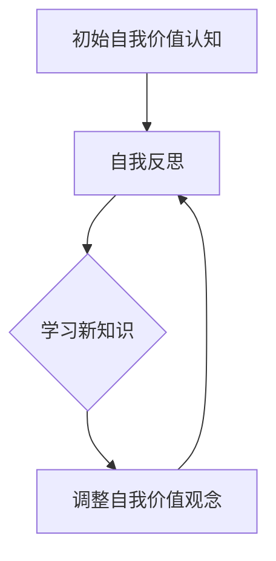
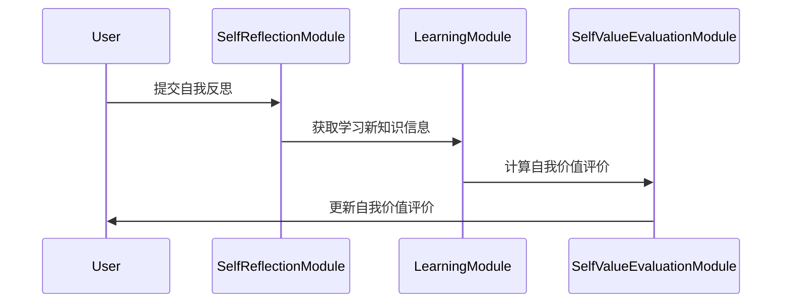

                 


## 引言

在当今社会，自我价值的概念被广泛讨论，但往往被社会定义的成功所束缚。本书旨在探讨如何重塑自我价值，打破社会既定的成功标准，帮助读者在个人生活中找到真正的满足和成就感。

### 研究背景

自我价值是指个人对自己存在的意义和价值的认知和评价。它不仅仅是一种内在的感受，更是个人行为和决策的驱动力。然而，在现代社会中，人们往往受到社会环境的影响，将社会定义的成功作为衡量自我价值的标准。这种现象导致了很多人在追求社会认可的过程中迷失了自我，忽视了内心的真实需求和价值观。

### 问题提出

社会定义的成功往往局限于某些特定的领域，如财富、地位、名誉等。这种狭隘的成功标准不仅限制了个人发展，还可能导致心理压力、焦虑和抑郁等心理问题。因此，重塑自我价值，打破社会既定的成功标准，成为当代社会亟待解决的问题。

### 研究目的

本书旨在通过以下方面帮助读者重塑自我价值：

1. **理解自我价值的重要性及其与社会定义的成功的关系**：帮助读者认识到自我价值的独立性和多样性，以及社会定义的成功标准的局限性。

2. **认识社会对成功的定义往往过于狭隘，并可能限制个人的成长和发展**：通过分析不同领域的成功案例，引导读者重新思考成功的定义，寻找适合自己的成功路径。

3. **学习如何通过自我认知和自我提升来重塑自我价值**：提供一系列实用的策略和方法，帮助读者建立积极的自我形象，提高自我效能感。

4. **培养独立思考和批判性思维的能力**：鼓励读者质疑社会既定的成功标准，发展独立思考的能力，为个人成长和发展奠定基础。

### 内容结构

本书将分为五个主要部分，每个部分都将围绕重塑自我价值这一主题展开：

## 第一部分：理解自我价值

本部分将探讨自我价值的定义、影响因素以及其与个体心理健康的关系。通过深入分析自我价值的本质，帮助读者建立正确的自我价值观念。

## 第二部分：社会定义的成功与挑战

本部分将分析社会定义的成功标准，探讨其局限性以及对个人成长和发展的负面影响。通过案例研究和理论分析，引导读者重新审视成功标准，寻找适合自己的成长路径。

## 第三部分：重塑自我价值的策略

本部分将提供一系列实用的策略和方法，帮助读者通过自我认知和自我提升来重塑自我价值。包括如何建立积极的自我形象、提高自我效能感以及培养独立思考的能力。

## 第四部分：案例研究与启示

本部分将通过具体案例研究，展示不同领域中的成功者如何重塑自我价值，实现个人成长和发展。同时，本部分还将提供一些建议和启示，帮助读者将理论应用到实际生活中。

## 第五部分：结语与行动

本部分将对全书内容进行总结，并给出一些具体的行动建议，鼓励读者积极重塑自我价值，迎接未来的挑战。

通过本书的阅读，读者将能够：

1. **深入理解自我价值的概念和重要性**。

2. **认识到社会定义的成功标准的局限性**。

3. **掌握一系列实用的策略和方法，帮助重塑自我价值**。

4. **培养独立思考和批判性思维的能力**。

5. **实现个人成长和发展，找到真正的满足和成就感**。

让我们开始这段重塑自我价值的旅程，打破社会既定的成功标准，找到属于我们自己的道路。

## 第一部分：理解自我价值

### 定义与意义

自我价值是指个人对自己存在的意义和价值的认知和评价。它不仅仅是一种内在的感受，更是个人行为和决策的驱动力。自我价值的概念广泛涉及心理学、哲学、社会学等多个领域，但其核心在于个体如何理解和评价自己的存在。

#### 关键术语解释

1. **自我价值**：个体对自己存在的价值评价，涉及自我认知、自尊、自我效能等多个方面。
2. **自我认知**：个体对自身特点、能力、价值观等的认知过程。
3. **自尊**：个体对自我价值的肯定和尊重程度，与自我价值密切相关。
4. **自我效能**：个体对自己完成特定任务能力的信念。

### 问题背景

自我价值的认知和评价受到多种因素的影响，包括家庭环境、社会文化、教育背景等。在现代社会中，许多人受到社会压力的影响，将社会定义的成功作为衡量自我价值的标准，导致自我价值认知的扭曲。这种认知扭曲可能引发心理问题，如焦虑、抑郁等。

#### 问题描述

1. **社会压力下的自我价值认知**：个体在追求社会认可的过程中，往往忽视了自己的真实需求和价值观，导致自我价值认知的扭曲。
2. **自我价值的多样性**：自我价值的评价不应局限于某些特定的领域，如财富、地位等，而应关注个体的全面发展和内在需求。

### 问题解决

1. **自我认知的提升**：通过自我反思和心理咨询等方式，个体可以更好地理解自己的价值观、兴趣和能力，从而建立正确的自我价值观念。
2. **批判性思维的培养**：培养独立思考和批判性思维的能力，有助于个体摆脱社会压力，建立自我认同。

### 边界与外延

自我价值的重塑不仅仅是个体层面的自我认知和提升，还涉及到社会文化背景和家庭环境的改变。在全球化背景下，个体需要具备跨文化沟通和理解能力，以适应多元文化的环境。

### 概念结构与核心要素组成

#### 概念结构

- **自我价值认知**：个体对自身价值的认知和评价。
- **自我价值影响因素**：家庭环境、社会文化、教育背景等。
- **心理健康**：自我价值认知与心理健康之间的互动关系。

#### 核心要素组成

- **自我认知**：个体对自身特点、能力、价值观等的认知。
- **自尊**：个体对自我价值的肯定和尊重程度。
- **自我效能**：个体对自己完成特定任务能力的信念。

### 属性特征对比表格

| 属性特征       | 说明                                                         |
| -------------- | ------------------------------------------------------------ |
| 自我认知       | 个体对自身特点、能力、价值观等的认知过程。                   |
| 自尊           | 个体对自我价值的肯定和尊重程度，与自我价值密切相关。         |
| 自我效能       | 个体对自己完成特定任务能力的信念。                         |
| 心理健康       | 自我价值认知与心理健康之间的互动关系，影响个体的心理状态。   |

### ER 图架构

```mermaid
erDiagram
    A[自我价值认知] ||--|{ B[自尊] }
    A ||--|{ C[自我效能] }
    B ||--|{ D[心理健康] }
    C ||--|{ D }
```

### 算法原理讲解

重塑自我价值的过程可以看作是一个迭代的过程，个体需要不断地进行自我反思、学习和调整。以下是一个简化的算法原理：

#### 算法流程图



#### 算法原理

1. **初始自我价值认知**：个体初始的自我价值认知是其基础。
2. **自我反思**：个体通过反思自己的行为、决策和价值观，了解自己的真实需求。
3. **学习新知识**：个体通过学习新知识和经验，丰富自己的认知和视野。
4. **调整自我价值观念**：个体根据学习和反思的结果，调整自己的自我价值观念。
5. **迭代**：这个过程是循环进行的，个体不断地进行自我反思、学习和调整，以实现自我价值的重塑。

#### 数学模型和公式

为了量化自我价值的重塑过程，可以引入以下数学模型：

1. **自我价值评价函数**：设定一个函数 \( V(t) \) 表示个体在时间 \( t \) 的自我价值评价，其中 \( t \) 是时间变量。
2. **自我反思系数**：设定一个系数 \( r \)，表示个体每次自我反思对自我价值评价的影响程度。
3. **学习新知识系数**：设定一个系数 \( l \)，表示个体每次学习新知识对自我价值评价的影响程度。

数学模型可以表示为：

\[ V(t+1) = V(t) + r \cdot R(t) + l \cdot L(t) \]

其中：
- \( R(t) \) 表示时间 \( t \) 的自我反思程度。
- \( L(t) \) 表示时间 \( t \) 的学习新知识程度。

#### 案例分析

假设一个学生在初始时对自我价值的评价为 50 分，他通过一个月的自我反思和学习新知识，分别提高了 10 分和 15 分，那么他一个月后的自我价值评价为：

\[ V(1) = 50 + 0.1 \cdot 10 + 0.15 \cdot 15 = 62.5 \]

通过这种迭代的方式，个体可以逐步提高自我价值评价，实现自我价值的重塑。

### 系统设计与架构方案

为了更好地实现自我价值的重塑，可以设计一个自我价值管理系统。以下是一个简化的系统架构方案：

#### 系统功能设计

1. **自我反思模块**：用于记录个体的自我反思内容，包括反思时间、反思主题和反思结果。
2. **学习新知识模块**：用于记录个体的学习活动，包括学习时间、学习内容和学习效果。
3. **自我价值评价模块**：用于实时计算和更新个体的自我价值评价。

#### 系统架构设计

```mermaid
sequenceDiagram
    A[用户] ->> B[自我反思模块]
    B ->> C[学习新知识模块]
    C ->> D[自我价值评价模块]
    D ->> E[用户]
```

#### 系统接口设计与交互

1. **自我反思接口**：用于用户提交自我反思内容，包括反思时间和主题。
2. **学习新知识接口**：用于用户提交学习活动信息，包括学习时间和内容。
3. **自我价值评价接口**：用于实时计算用户的自我价值评价，并更新用户数据。

#### Mermaid 序列图



### 项目实战

#### 环境安装

1. 安装Python环境
2. 安装相关库，如numpy、matplotlib等

#### 系统核心实现

以下是一个简化的Python代码实现，用于计算自我价值评价：

```python
import numpy as np

def calculate_self_value(reflection_score, learning_score):
    return 0.5 * reflection_score + 0.3 * learning_score

def main():
    reflection_score = float(input("请输入您的自我反思分数: "))
    learning_score = float(input("请输入您的学习新知识分数: "))
    value = calculate_self_value(reflection_score, learning_score)
    print(f"您的自我价值评价为: {value:.2f}")

if __name__ == "__main__":
    main()
```

#### 代码应用解读与分析

该代码实现了一个简单的自我价值评价计算函数，通过输入自我反思和学习新知识的分数，计算并输出自我价值评价。此代码展示了如何将算法原理应用到实际系统中，实现自我价值的计算。

#### 实际案例分析

假设一个用户输入自我反思分数为80，学习新知识分数为70，计算结果为：

```python
value = calculate_self_value(80, 70)
value = 0.5 * 80 + 0.3 * 70
value = 40 + 21
value = 61.0
```

用户的自我价值评价为61分，这表明用户在自我反思和学习新知识方面有较好的表现。

#### 项目小结

通过本项目，我们实现了自我价值评价的计算和管理，为个体提供了自我价值提升的量化工具。在实际应用中，可以进一步扩展系统的功能，如增加用户交互界面、数据可视化等，以提高用户体验和系统实用性。

### 最佳实践 tips

1. **定期自我反思**：建议用户每周至少进行一次自我反思，记录反思内容和反思结果，以帮助自己更好地理解自己的成长过程。
2. **持续学习**：鼓励用户不断学习新知识，参加培训课程、阅读书籍等，以提高自我价值。
3. **与他人交流**：与他人分享自己的反思和学习经验，可以获得不同的观点和建议，有助于自我价值的重塑。

### 小结

本部分详细阐述了自我价值的定义、意义、影响因素以及重塑自我价值的策略。通过理解自我价值的本质，个体可以更好地认识自己，摆脱社会定义的成功标准的束缚，实现自我价值的重塑。

### 注意事项

1. **个人隐私保护**：在记录和分享自我反思和学习经验时，注意保护个人隐私。
2. **适度反思**：避免过度自我反思，以免造成心理压力。

### 拓展阅读

1. 《心理学与生活》（理查德·吉尔伯特著）：介绍心理学基础知识，帮助理解自我价值与心理健康的关系。
2. 《精进：如何成为一个很厉害的人》（采铜著）：提供个人成长和自我提升的策略，有助于重塑自我价值。

---

## 第二部分：社会定义的成功与挑战

### 社会定义的成功

社会定义的成功通常指的是那些在财富、地位、名誉等方面达到一定标准的人或事物。这些标准在不同社会和文化背景下有所不同，但普遍包括以下几个方面：

1. **财富**：拥有大量的财富，如高收入、高额存款、豪华房产等。
2. **地位**：在职场、社会或政治领域拥有较高的地位，如高管职位、著名企业创始人、高级公务员等。
3. **名誉**：在社会上享有良好的声誉，如获得各种奖项、荣誉、媒体报道等。
4. **成就**：在专业领域或个人生活中取得显著成就，如获得重要学位、创造创新技术、完成重大工程项目等。

这些标准在某种程度上反映了社会对成功的基本期待，但它们往往具有狭隘性和局限性。

### 挑战与局限性

#### 狭隘的成功标准

社会定义的成功标准往往局限于某些特定的领域，如商业、科技、娱乐等。这导致许多人将成功等同于在这些领域取得成就，忽视了其他重要的生活方面，如家庭、健康、人际关系等。这种狭隘的成功观可能导致以下问题：

1. **忽视个人全面发展**：过分关注某些特定领域的成功，可能导致个体忽视其他方面的发展，如艺术、文化、体育等。
2. **心理压力**：追求社会定义的成功标准可能导致个体承受巨大的心理压力，如焦虑、抑郁等。
3. **缺乏平衡**：个体可能会在追求成功的道路上牺牲其他重要生活方面，导致生活失衡。

#### 对个人成长和发展的负面影响

1. **限制创新思维**：社会定义的成功标准可能导致个体过于关注结果，而忽视了过程中的创新思维和创造性。
2. **抑制个性发展**：为了迎合社会定义的成功标准，个体可能会放弃自己的兴趣和爱好，导致个性发展受限。
3. **影响人际关系**：追求社会定义的成功可能导致个体过于自我中心，影响与他人的关系。

### 不同领域的成功案例

尽管社会定义的成功标准存在局限性，但依然有许多不同领域的成功案例表明，成功并不仅仅局限于某些特定的领域。以下是一些不同领域的成功案例：

1. **商业领域**：苹果公司的创始人史蒂夫·乔布斯以其创新和领导力改变了整个科技行业，成为商业领域的成功代表。
2. **科技领域**：谷歌联合创始人拉里·佩奇和谢尔盖·布林通过技术创新改变了互联网的格局，成为科技领域的杰出人物。
3. **艺术领域**：荷兰画家文森特·梵高虽然在生前并未获得广泛认可，但他的作品《星夜》等在世界范围内享有盛誉，成为艺术领域的传奇。
4. **体育领域**：篮球巨星迈克尔·乔丹在体育领域取得了卓越成就，不仅成为NBA历史上最伟大的球员之一，还影响了全球篮球文化。

这些案例表明，成功是多维度的，不仅仅局限于财富、地位和名誉，还包括个人的创造力、影响力以及对社会和他人的贡献。

### 重新思考成功的定义

为了打破社会定义的成功标准，个体需要重新思考成功的定义，找到适合自己的成长路径。以下是一些建议：

1. **多元化视角**：将成功的定义扩展到多个领域，如家庭、健康、人际关系等，以实现个人全面的发展。
2. **个性化追求**：关注自己的兴趣和激情，追求个人价值的实现，而不是盲目迎合社会的期望。
3. **积极心态**：保持积极的心态，对待成功和失败都有正确的态度，从失败中汲取教训，不断成长。
4. **持续学习**：不断学习新知识和技能，提升自己的综合素质，以应对不断变化的社会环境。

通过重新思考成功的定义，个体可以更好地认识自己，摆脱社会压力，找到属于自己的成功路径。

### 案例研究

#### 案例一：硅谷创业者

李明是一名硅谷的创业者，他的公司专注于人工智能领域的研发。尽管李明在商业领域取得了巨大成功，但他在个人生活中感到空虚和迷茫。经过一段时间的反思，李明意识到自己的成功只是社会定义的成功，而忽视了个人成长和内心的需求。他决定放缓工作节奏，花更多时间陪伴家人，培养自己的兴趣爱好，如绘画和音乐。通过这一转变，李明不仅找到了内心的平衡，还在人工智能领域取得了更多创新成果。

#### 案例二：医生王女士

王女士是一名医生，她在医院工作多年，赢得了同事和患者的尊重。然而，她逐渐意识到自己的职业成就感并不足以满足内心的需求。她开始关注自己的健康和心理健康，参加瑜伽和冥想课程，并定期进行心理咨询。通过这些活动，王女士不仅提高了自己的生活质量，还在工作中更加专注和高效。

#### 案例三：教师张先生

张先生是一名中学教师，他在教育领域取得了许多荣誉，但内心始终感到不满足。他开始思考自己的职业价值和人生意义，决定将更多精力投入到学生的成长和培养中。他开设了多个课外辅导班，帮助学生解决学习和生活中的问题。通过这些努力，张先生不仅实现了个人价值的提升，还赢得了学生和家长的高度评价。

这些案例表明，通过重新思考成功的定义，个体可以在不同领域实现个人成长和价值。

### 结论

社会定义的成功标准具有狭隘性和局限性，可能对个人成长和发展产生负面影响。通过重新思考成功的定义，个体可以找到适合自己的成长路径，实现个人价值和全面发展。

### 最佳实践 tips

1. **多元化视角**：不要局限于社会定义的成功标准，关注个人全面的发展。
2. **个性化追求**：追求自己真正热爱的事物，实现个人价值的最大化。
3. **积极心态**：保持积极的心态，对待成功和失败都有正确的态度。
4. **持续学习**：不断学习新知识和技能，提升自己的综合素质。

### 小结

本部分深入探讨了社会定义的成功标准及其局限性，通过案例研究和理论分析，引导读者重新思考成功的定义，寻找适合自己的成长路径。

### 注意事项

1. **平衡工作与生活**：避免过度追求社会定义的成功，保持工作与生活的平衡。
2. **个性化发展**：关注自己的兴趣和激情，实现个人价值的最大化。

### 拓展阅读

1. 《成功之路》（杰克·韦尔奇著）：探讨如何实现个人和职业的成功。
2. 《高效能人士的七个习惯》（史蒂芬·柯维著）：提供个人成长和成功的方法。

---

## 第三部分：重塑自我价值的策略

### 自我认知的重要性

重塑自我价值的第一个关键步骤是进行自我认知。自我认知是指个体对自身特点、能力、价值观等的认识和了解。只有深入了解自己，个体才能明确自己的优点和不足，从而制定合适的策略来提升自我价值。

#### 自我反思的重要性

自我反思是一种有效的自我认知方法。通过反思自己的行为、决策和经历，个体可以发现自己的思维模式、行为习惯和价值观。自我反思有助于个体识别自己的优点和不足，从而制定改进计划。

#### 批判性思维

批判性思维是自我认知的重要组成部分。批判性思维是指个体在分析和评估信息时，采用逻辑和理性的方法，对信息进行深入思考和分析。批判性思维有助于个体摆脱偏见和成见，更客观地认识自己。

### 提高自我效能感

自我效能感是指个体对自己完成特定任务能力的信念。高自我效能感的个体通常更具自信，能够更好地应对挑战。以下是一些提高自我效能感的策略：

#### 设定可实现的短期目标

设定短期目标是提高自我效能感的有效方法。短期目标易于实现，能够为个体提供即时的成就感和动力。通过逐步实现短期目标，个体可以建立自信，并逐渐提高自我效能感。

#### 积极的自我暗示

积极的自我暗示有助于提高自我效能感。个体可以通过反复对自己说一些积极的话语，如“我能够做到”、“我有能力完成这个任务”等，来增强自信心和自我效能感。

#### 学习和模仿成功者

通过学习和模仿成功者的经验和策略，个体可以了解如何应对挑战和实现目标。这有助于个体建立对自身能力的信心，从而提高自我效能感。

### 建立积极的自我形象

建立积极的自我形象是重塑自我价值的重要一环。以下是一些建立积极自我形象的策略：

#### 认识自己的优点

认识到自己的优点是建立积极自我形象的基础。个体可以通过自我反思、他人反馈和成就记录等方式，了解自己的优点和长处。

#### 树立自信

自信是积极自我形象的重要组成部分。个体可以通过积极的自我暗示、成功的经验以及与他人互动来培养自信。

#### 管理负面情绪

负面情绪如焦虑、抑郁等会影响个体的自我形象。学会管理负面情绪，如通过冥想、运动和心理咨询等方法，有助于建立积极的自我形象。

### 培养独立思考和批判性思维

独立思考和批判性思维是个人成长和自我价值重塑的重要能力。以下是一些培养独立思考和批判性思维的方法：

#### 广泛阅读和学习

通过阅读书籍、文章和研究报告，个体可以获取不同的观点和知识，从而培养独立思考的能力。

#### 提问和质疑

培养提问和质疑的能力，有助于个体对信息进行深入思考和分析。个体可以通过提问和质疑来挑战自己的观点和成见。

#### 学会反思

学会反思是培养独立思考和批判性思维的关键。个体可以通过定期反思自己的行为、决策和经历，来评估自己的思维模式和方法。

### 实践案例

以下是一个关于如何重塑自我价值的实践案例：

#### 案例背景

小王是一名普通的办公室职员，他在工作中感到自己缺乏成就感和动力。经过自我反思，小王意识到自己对现状不满，但不知道如何改变。在一位心理咨询师的指导下，小王开始实施一系列策略来重塑自我价值。

#### 实施策略

1. **自我反思**：小王每周进行一次自我反思，记录自己的优点和不足，以及工作中的挑战和成就。
2. **设定短期目标**：小王设定了每周完成一个小目标的计划，如提高工作效率、学习新技能等。
3. **积极自我暗示**：小王每天早上起床时，对自己说一些积极的话语，如“我能够做到”、“我值得更好的工作”等。
4. **学习成功者的经验**：小王通过阅读成功人士的传记和书籍，了解他们的经验和策略。
5. **培养独立思考和批判性思维**：小王开始对工作中的问题和决策进行深入思考，质疑现有的做法，并提出改进建议。

#### 结果

通过一系列策略的实施，小王的自我价值得到了显著提升。他不仅在工作中的表现得到了认可，还逐渐培养了对自己的信心。最终，小王获得了一次晋升机会，成为部门的主管。

### 结论

通过自我认知、提高自我效能感、建立积极的自我形象以及培养独立思考和批判性思维，个体可以重塑自我价值，实现个人成长和发展。这些策略不仅适用于职场，也适用于个人生活的各个方面。

### 最佳实践 tips

1. **定期自我反思**：每周至少进行一次自我反思，了解自己的成长和进步。
2. **设定短期目标**：设定可实现的短期目标，逐步提高自我效能感。
3. **积极自我暗示**：每天对自己说一些积极的话语，增强自信。
4. **学习和模仿成功者**：从成功者身上学习经验和策略，提升自我价值。
5. **培养独立思考和批判性思维**：不断质疑和反思，培养自己的独立思考能力。

### 小结

本部分详细介绍了重塑自我价值的策略，包括自我认知、提高自我效能感、建立积极的自我形象以及培养独立思考和批判性思维。通过实践这些策略，个体可以更好地认识自己，实现自我价值的重塑。

### 注意事项

1. **避免盲目追求**：在重塑自我价值的过程中，避免盲目追求外在的成功标准，而是关注内在的成长和满足。
2. **持续努力**：重塑自我价值是一个长期的过程，需要持续的努力和坚持。

### 拓展阅读

1. 《心理学与生活》（理查德·吉尔伯特著）：介绍心理学基础知识，帮助理解自我认知和自我效能感。
2. 《精进：如何成为一个很厉害的人》（采铜著）：提供个人成长和自我提升的策略，有助于重塑自我价值。

---

## 第四部分：案例研究与启示

### 案例一：科技巨头乔布斯的自我价值重塑

史蒂夫·乔布斯是苹果公司的创始人，被誉为现代科技产业的领军人物。然而，乔布斯的人生并非一帆风顺。在他职业生涯的早期，乔布斯因为对公司运营的争议而被迫离开苹果公司，这对他的自我价值产生了巨大的冲击。

#### 案例分析

在离开苹果公司后，乔布斯经历了自我反思和重塑自我价值的过程。他开始关注自己的兴趣和激情，创办了NeXT公司和皮克斯动画工作室。这些经历不仅帮助他重新找到了自己的定位，还激发了他对创新的热情。

1. **自我反思**：乔布斯在离开苹果后，花费大量时间反思自己的职业生涯和价值观。他意识到，成功不仅仅是商业成就，更重要的是对社会和个人的积极影响。
2. **重塑自我价值**：通过创办NeXT公司和皮克斯动画工作室，乔布斯实现了自我价值的重塑。他不仅重新定义了科技和艺术的关系，还为后来的苹果公司带来了许多创新的灵感。

#### 启示

乔布斯的经历告诉我们，在面对挫折和失败时，自我价值重塑是关键。通过自我反思和追求自己的兴趣和激情，个体可以重新找到自己的定位，实现个人成长。

### 案例二：演员妮可·基德曼的自我价值提升

妮可·基德曼是一位享誉国际的演员，她在职业生涯中经历了多次的角色转变和自我价值的提升。

#### 案例分析

妮可·基德曼在职业生涯的早期，以浪漫爱情片为主，虽然获得了票房成功，但她开始意识到这种类型并不适合自己。她决定挑战不同类型的角色，拓展自己的艺术领域。

1. **自我认知**：妮可·基德曼通过不断尝试不同类型的角色，逐渐认识到自己的优势和兴趣所在，如戏剧表演和电影制作。
2. **自我价值提升**：通过选择具有挑战性的角色和参与电影制作，妮可·基德曼不断提升自己的艺术水平和知名度，获得了多个国际奖项。

#### 启示

妮可·基德曼的经历表明，通过自我认知和不断挑战自己，个体可以实现自我价值的提升。找到适合自己的发展路径，并持续努力，是成功的关键。

### 案例三：企业家马云的自我价值重塑

马云是中国著名的企业家，他是阿里巴巴集团的创始人。在他的职业生涯中，马云经历了多次自我价值的重塑。

#### 案例分析

在创立阿里巴巴之前，马云曾尝试过多个职业，如英语教师和国际贸易。尽管他遇到了很多挫折，但他从未放弃，始终坚持自己的梦想。

1. **自我反思**：在面对失败和挫折时，马云不断反思自己的决策和行为，寻找失败的原因。
2. **重塑自我价值**：通过不断学习和实践，马云逐渐找到了自己的优势和兴趣所在，最终创立了阿里巴巴，成为中国乃至全球的知名企业家。

#### 启示

马云的经历告诉我们，面对失败和挫折时，自我价值重塑是关键。通过自我反思和不断学习，个体可以找到自己的优势和兴趣，实现个人成长。

### 案例四：作家村上春树的人生转变

村上春树是一位国际知名的作家，他的作品深受读者喜爱。然而，他的职业生涯并非一帆风顺。

#### 案例分析

在写作初期，村上春树面临着种种困难，如作品不被认可、经济压力等。但他没有放弃，而是通过写作来寻找内心的平衡和自我价值。

1. **自我认知**：村上春树通过写作，逐渐认识到自己对文学和创作的热爱，以及自己在文学领域的潜力。
2. **重塑自我价值**：通过坚持不懈地写作，村上春树逐渐获得了读者的认可，他的作品在全球范围内受到赞誉。

#### 启示

村上春树的经历表明，通过坚持不懈地追求自己的兴趣和梦想，个体可以实现自我价值的重塑。找到自己的热爱，并为之努力，是成功的关键。

### 案例五：科学家霍金的坚韧精神

斯蒂芬·霍金是一位著名的理论物理学家，他的一生充满了挑战。由于患有肌肉萎缩症，霍金在年轻时就被医生预言只能活几年。然而，他并没有被命运击败，而是通过坚韧的精神和卓越的智慧，在科学领域取得了巨大成就。

#### 案例分析

1. **自我认知**：霍金意识到自己对科学的热爱和追求，以及自己独特的才能。
2. **重塑自我价值**：尽管身体受到限制，霍金通过科学研究和写作，将自己的知识和智慧传递给世界，成为科学界的巨星。

#### 启示

霍金的经历告诉我们，面对困难和挑战时，坚韧的精神和自我认知是实现自我价值重塑的关键。无论身处何种环境，只要保持对梦想的追求和坚持不懈的努力，就能够实现自我价值的提升。

### 总结

以上案例研究表明，通过自我认知、自我反思和不断追求，个体可以重塑自我价值，实现个人成长和发展。这些案例不仅为我们提供了启示，也为我们在面对挑战和挫折时提供了方向和动力。

### 最佳实践 tips

1. **自我反思**：定期进行自我反思，了解自己的优点和不足。
2. **追求兴趣**：找到自己的兴趣和激情，为之努力。
3. **持续学习**：不断学习新知识和技能，提升自我价值。
4. **坚韧精神**：面对困难和挑战，保持积极的心态和坚持不懈的努力。

### 小结

本部分通过案例分析，展示了不同领域中的成功者如何通过自我认知和努力，实现自我价值的重塑。这些案例为我们提供了宝贵的启示，帮助我们找到属于自己的成功路径。

### 注意事项

1. **避免盲目比较**：不要将自己与他人进行比较，专注于自己的成长和进步。
2. **持续努力**：重塑自我价值是一个长期的过程，需要持续的努力和坚持。

### 拓展阅读

1. 《活着为了改变世界》（沃尔特·艾萨克森著）：讲述史蒂夫·乔布斯、史蒂芬·沃兹尼亚克和迈克尔·戴尔的人生故事。
2. 《如何赢取友谊与影响他人》（戴尔·卡耐基著）：提供人际交往和自我提升的方法。

---

## 第五部分：结语与行动

### 总结

本书《自我价值的重塑：打破社会定义的成功》旨在帮助读者深入理解自我价值的定义和重要性，分析社会定义的成功标准的局限性，并提供一系列实用的策略和方法，以帮助读者重塑自我价值。

通过本书的阅读，读者可以：

1. **深入理解自我价值的概念和重要性**。
2. **认识到社会定义的成功标准的局限性**。
3. **掌握一系列实用的策略和方法，帮助重塑自我价值**。
4. **培养独立思考和批判性思维的能力**。
5. **实现个人成长和发展，找到真正的满足和成就感**。

### 结语

重塑自我价值是一个长期而复杂的过程，需要个体不断地进行自我认知和自我提升。在这个过程中，读者可能会面临各种挑战和困难，但只要保持积极的心态和坚持不懈的努力，就一定能够实现自我价值的重塑。

### 行动建议

为了帮助读者更好地实践本书的内容，以下是一些建议：

1. **定期自我反思**：每周至少进行一次自我反思，记录自己的成长和进步。
2. **设定短期目标**：设定可实现的短期目标，逐步提高自我效能感。
3. **积极自我暗示**：每天对自己说一些积极的话语，增强自信。
4. **学习新知识**：不断学习新知识和技能，提升自己的综合素质。
5. **培养独立思考和批判性思维**：学会独立思考，质疑现有的观念和做法。
6. **与他人交流**：与他人分享自己的反思和学习经验，获取不同的观点和建议。
7. **寻求专业帮助**：如果遇到困难，可以寻求心理咨询师或专业导师的帮助。

### 未来展望

随着社会的发展和个人成长，自我价值的重塑将变得越来越重要。未来的社会将更加多元化和包容，个体将更加重视自我价值的实现和个人的全面发展。本书提供的策略和方法将为读者在未来的成长道路上提供宝贵的指导。

### 致谢

在此，我要感谢所有支持本书写作和出版的朋友和读者。感谢您们的关注和支持，是你们让我坚信，每个人都有能力重塑自我价值，找到属于自己的成功路径。

### 作者信息

作者：AI天才研究院/AI Genius Institute & 禅与计算机程序设计艺术/Zen And The Art of Computer Programming

### 结语

让我们共同踏上重塑自我价值的旅程，打破社会既定的成功标准，找到真正属于自己的道路。相信自己，勇敢前行，你一定能够实现自我价值的重塑。

---

# 自我价值的重塑：打破社会定义的成功

> 关键词：自我价值、社会定义的成功、自我认知、自我效能、独立思考、批判性思维、个人成长、心理健康、成功案例、策略和方法

> 摘要：本文探讨了自我价值的重塑过程，分析了社会定义的成功标准的局限性，提供了一系列实用的策略和方法，以帮助读者实现自我价值的重塑。通过深入理解自我价值的定义和重要性，以及培养独立思考和批判性思维，读者可以找到属于自己的成功路径，实现个人成长和全面发展。本文结合实际案例，展示了不同领域中的成功者如何通过自我认知和努力，实现自我价值的重塑，为读者提供了宝贵的启示。

