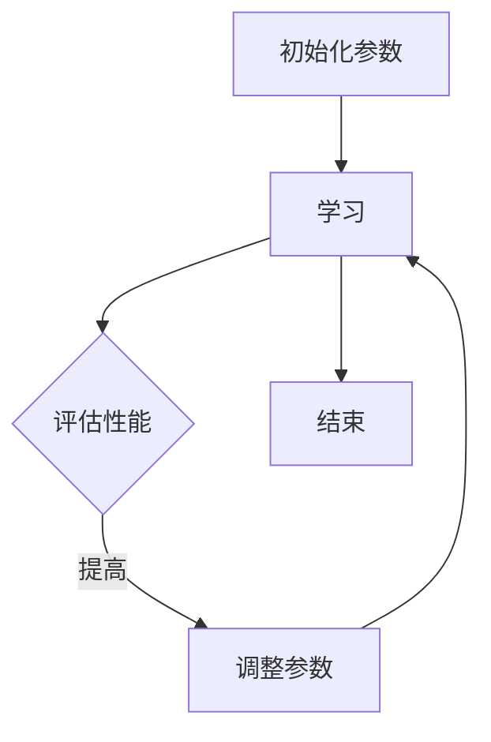
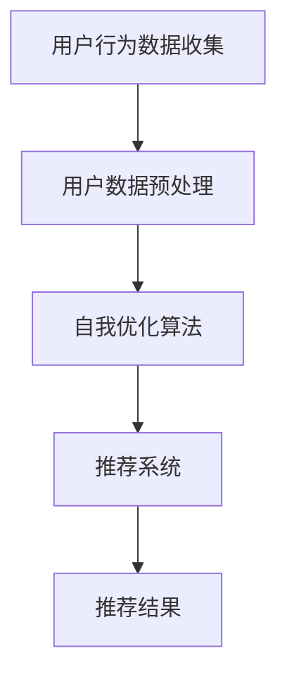
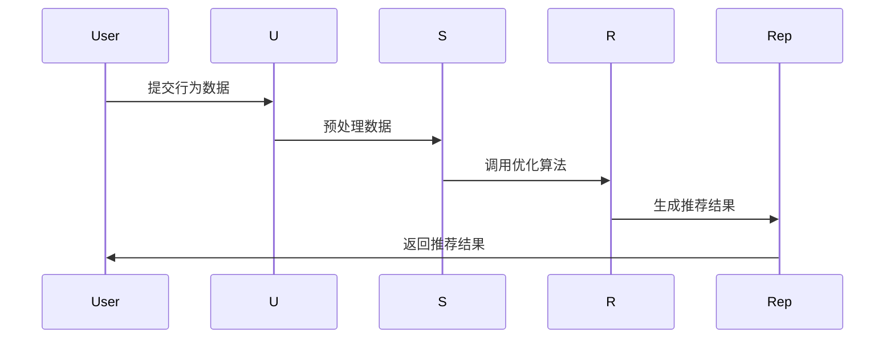

                 


### 1.1.1 自我完善型AI的定义

自我完善型AI，或称自我优化AI（Self-Improving AI），是指一种能够在运行过程中自我优化、提升自身性能的智能系统。这种AI不仅仅依赖预设的参数和规则，还能够通过学习、自我调整以及与环境交互，不断提高自身的效率和效果。

#### 核心概念术语说明

- **自我优化**：AI系统通过自我调整其内部参数和行为，以优化性能的过程。
- **学习机制**：AI系统从数据中学习，提取知识和模式，用以改进自身。
- **反馈循环**：AI系统使用结果反馈来调整其行为，形成一个持续的改进过程。

#### 问题背景

自我完善型AI的出现源于对传统AI的局限性认识。传统AI系统依赖于人类专家的预先设定和指导，缺乏灵活性和适应性。随着数据量的增加和问题复杂性的提升，人类专家难以应对所有情况，这就催生了自我完善型AI的需求。

#### 问题描述

传统AI系统面临以下问题：
- **可解释性差**：系统行为难以理解，依赖于复杂的模型和算法。
- **适应性低**：系统难以应对新的环境和问题。
- **可扩展性差**：系统难以处理大规模的数据和应用。

#### 问题解决

自我完善型AI通过以下方式解决上述问题：
- **自我调整**：系统可以根据反馈自我调整，提高性能。
- **自主学习**：系统可以自动从数据中学习，适应新环境和问题。
- **灵活扩展**：系统可以适应不同规模的数据和应用场景。

#### 边界与外延

自我完善型AI的边界在于其自我调整的范围和程度。过度自我优化可能导致系统不稳定或偏离人类期望，因此需要在安全和可控的范围内进行。

#### 概念结构与核心要素组成

自我完善型AI的结构主要包括：
- **基础模型**：用于初始学习和任务执行的模型。
- **优化算法**：用于调整模型参数，提高性能的算法。
- **学习机制**：用于自动学习新数据和模式。
- **反馈系统**：用于收集和利用结果反馈，调整模型行为。

### **核心概念与联系**

#### 自我优化与学习机制

| 自我优化 | 学习机制 |
| :----: | :----: |
| 调整模型参数 | 从数据中提取知识和模式 |
| 提高性能 | 提高适应性 |

#### 自我完善型AI的组成部分

**ER实体关系图架构：**

```mermaid
erDiagram
  AI模型 ||--|{ 学习机制 }|--|| 自我优化
  AI模型 ||--|{ 反馈系统 }|--|| 结果调整
```

### **算法原理讲解**

#### 自我优化算法的工作原理

自我优化算法通常包括以下几个步骤：

1. **初始化模型参数**：设定初始模型参数。
2. **学习过程**：模型从数据中学习，调整参数。
3. **评估性能**：使用性能指标评估模型。
4. **调整参数**：根据评估结果调整模型参数。
5. **重复循环**：不断重复学习、评估和调整过程。

**Mermaid流程图：**



#### 数学模型和公式

自我优化算法的核心是优化函数，用于调整模型参数。假设优化目标为最小化损失函数 \( J(\theta) \)，则优化过程可以表示为：

$$
\theta_{\text{new}} = \theta_{\text{current}} - \alpha \frac{\partial J(\theta)}{\partial \theta}
$$

其中，\( \theta \) 是模型参数，\( \alpha \) 是学习率，\( \frac{\partial J(\theta)}{\partial \theta} \) 是损失函数对参数的梯度。

### **系统分析与架构设计方案**

#### 问题描述

设计一个自我完善型AI系统，用于优化推荐算法的性能。系统需要能够从用户行为数据中学习，并不断调整推荐策略。

#### 项目介绍

项目名称：自我优化推荐系统（Self-Optimizing Recommendation System，简称SORS）

目标：通过自我优化算法，提高推荐算法的准确性和用户满意度。

#### 系统功能设计（领域模型）

**Mermaid类图：**

```mermaid
classDiagram
    User <<类>> 
    Item <<类>> 
    Recommendation <<类>> {
        - itemId: int
        - userId: int
        - rating: float
    }
    User --|> Recommendation
    Item --|> Recommendation
```

#### 系统架构设计

**Mermaid架构图：**



#### 系统接口设计

- **用户接口**：提供用户行为数据输入，接收推荐结果。
- **数据预处理接口**：处理和清洗用户数据。
- **算法接口**：提供自我优化算法的接口。
- **推荐接口**：生成推荐结果。

#### 系统交互

**Mermaid序列图：**



### **项目实战**

#### 环境安装

- 安装Python环境（3.8以上版本）
- 安装TensorFlow库

```bash
pip install tensorflow
```

#### 系统核心实现源代码

```python
# 自我优化推荐系统核心实现
import tensorflow as tf
from tensorflow.keras.layers import Dense, Embedding, LSTM
from tensorflow.keras.models import Model

# 参数设置
learning_rate = 0.001
batch_size = 64
embedding_size = 128
lstm_units = 128

# 数据预处理
def preprocess_data(user_data):
    # 数据清洗和归一化
    # 略
    return processed_data

# 模型构建
def build_model():
    user_embedding = Embedding(input_dim=num_users, output_dim=embedding_size)
    item_embedding = Embedding(input_dim=num_items, output_dim=embedding_size)
    
    user_input = Input(shape=(1,), name='user_input')
    item_input = Input(shape=(1,), name='item_input')
    
    user_embedding_layer = user_embedding(user_input)
    item_embedding_layer = item_embedding(item_input)
    
    merged = tf.keras.layers.concatenate([user_embedding_layer, item_embedding_layer], axis=-1)
    lstm = LSTM(units=lstm_units, activation='tanh')(merged)
    output = Dense(1, activation='sigmoid')(lstm)
    
    model = Model(inputs=[user_input, item_input], outputs=output)
    model.compile(optimizer=tf.keras.optimizers.Adam(learning_rate=learning_rate), loss='binary_crossentropy', metrics=['accuracy'])
    
    return model

# 训练模型
def train_model(model, data, labels):
    model.fit(data, labels, batch_size=batch_size, epochs=10, validation_split=0.2)

# 预测
def predict(model, user_input, item_input):
    return model.predict([user_input, item_input])
```

#### 代码应用解读与分析

- **用户输入和商品输入**：用户输入和商品输入通过Embedding层转换为嵌入向量。
- **LSTM层**：使用LSTM层处理序列数据，提取用户行为特征。
- **全连接层**：使用全连接层进行分类预测。

#### 实际案例分析和详细讲解剖析

假设有一个电商平台，用户行为数据包括用户ID和购买的商品ID，我们需要通过自我优化推荐系统，为用户推荐商品。

1. **数据收集**：收集用户行为数据，如点击、浏览、购买等。
2. **数据预处理**：对用户行为数据进行清洗和归一化处理。
3. **模型训练**：使用预处理后的数据训练模型，通过自我优化算法调整模型参数。
4. **推荐**：根据用户行为数据，为用户推荐商品。

#### 项目小结

通过自我优化推荐系统，我们可以提高电商平台的用户满意度，增加销售额。自我优化算法使得推荐系统更加智能和自适应，能够不断优化推荐效果。

### **最佳实践 tips**

- **数据质量**：确保数据质量，进行数据清洗和预处理。
- **调整超参数**：通过实验调整模型超参数，找到最佳配置。
- **监控性能**：定期监控模型性能，及时调整。

### **小结**

自我完善型AI通过自我优化和自主学习，实现了传统AI所不具备的灵活性和适应性。在推荐系统、自动驾驶、游戏AI等领域，自我完善型AI展现了巨大的潜力。

### **注意事项**

- **安全性和可控性**：确保自我完善型AI系统的安全性和可控性，避免潜在风险。
- **伦理问题**：在设计和使用自我完善型AI时，要充分考虑伦理问题，确保系统的公正性和透明度。

### **拓展阅读**

- [深度学习](https://www.deeplearningbook.org/)
- [强化学习](https://www.rlgorithms.com/)
- [人工智能伦理](https://www.aaai.org/Organization/AAAI-ethics)
```

