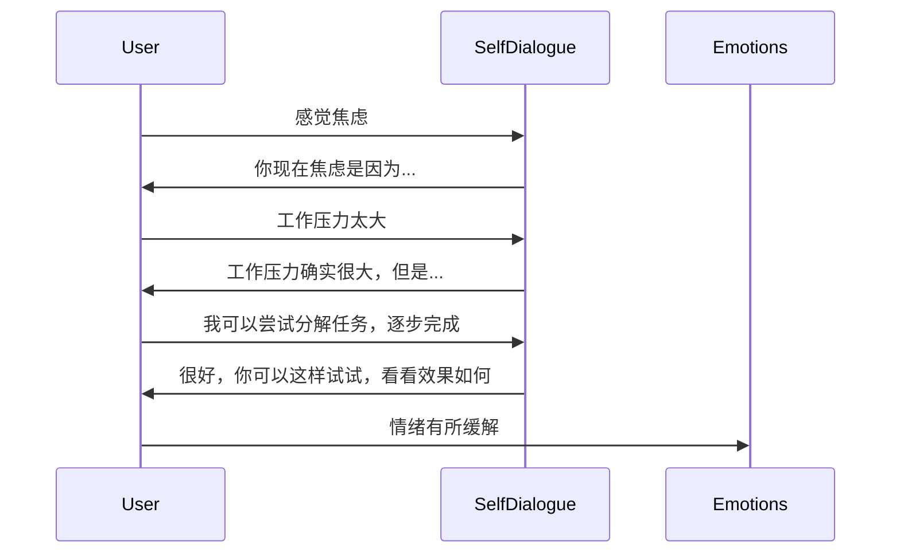
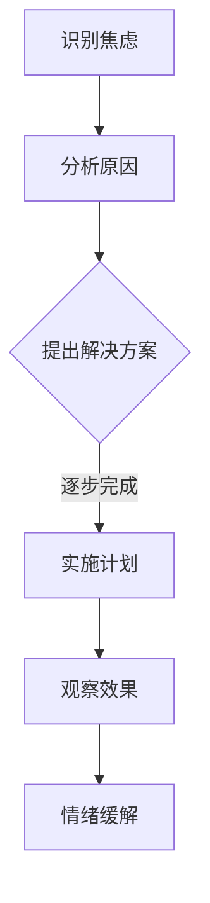
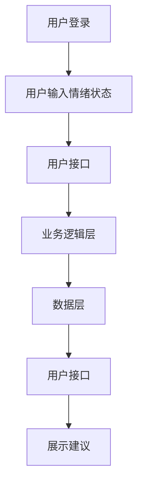

                 

### 自我对话：化解内心冲突的有效方法

> 关键词：自我对话、内心冲突、心理健康、认知行为疗法

> 摘要：本文旨在探讨自我对话这一心理现象及其在化解内心冲突中的作用。通过深入分析自我对话的定义、理论基础、实践技巧，结合实际案例分析，本文希望为读者提供一种有效的自我调节方法，以提升个人心理健康。

---

#### 背景介绍

自我对话，作为一种心理现象，是指个体在内心进行的语言交流。这种交流不仅包括对外部事件的反思，还涉及对自身情感和思维模式的探索。在日常生活中，自我对话往往是无意识的，但它对我们的心理健康和行为模式有着深远的影响。随着心理学研究的深入，人们逐渐认识到自我对话在情绪调节、自我认知和心理健康方面的作用。

内心冲突是每个人在生活中都可能会遇到的问题。这些冲突可能源于人际关系、工作压力、自我期望与现实之间的差距等。长期的内心冲突如果得不到有效的处理，可能导致情绪问题、心理障碍甚至生理疾病。因此，寻找化解内心冲突的方法，对于维护个人心理健康具有重要意义。

本文将围绕自我对话这一主题，首先介绍其基本概念和理论基础，然后探讨如何通过自我对话来化解内心冲突，最后通过实际案例进行分析和总结。希望通过本文的探讨，读者能够更好地理解自我对话，并在实际生活中运用这一方法来提升自己的心理健康。

---

#### 核心概念与联系

自我对话的概念可以从多个心理学理论中找到支持。首先，自我意识理论（Self-awareness Theory）指出，个体对自己的认识和感知是心理健康的基础。自我对话是自我意识的一种表现形式，通过内省和反思，个体可以更好地了解自己的情绪、思维和行为模式。

其次，认知行为疗法（Cognitive Behavioral Therapy, CBT）强调思维模式对情绪和行为的影响。自我对话在这一疗法中扮演重要角色，通过积极的自我对话，个体可以识别和改变消极思维，从而改善情绪状态。CBT认为，自我对话不仅有助于情绪调节，还能促进自我成长和改变。

此外，自我对话还与自我效能感（Self-efficacy）紧密相关。自我效能感是指个体对自己能够成功完成特定任务的信心。通过积极的自我对话，个体可以增强自我效能感，从而更有信心面对挑战和困难。

在理解自我对话的核心概念后，我们还需要关注其与内心冲突的关系。内心冲突通常表现为消极的自我对话，如自我批评、自我怀疑和负面情绪。这些消极的自我对话会加剧内心的冲突，形成恶性循环。通过积极的自我对话，个体可以打破这一循环，化解内心的冲突。

为了更好地理解自我对话的作用，我们可以通过一个简单的ER实体关系图来展示其核心要素和关系：

```mermaid
erDiagram
    A_SELF_DIALOGUE ||--|{ B_POSITIVE_DIALOGUE } : has
    A_SELF_DIALOGUE ||--|{ C_NEGATIVE_DIALOGUE } : has
    B_POSITIVE_DIALOGUE ++--|{ D_EMOTIONAL_REGULATION }
    C_NEGATIVE_DIALOGUE ++--|{ E_STRESS_AND_ANXIETY }
```

在这个ER图中，`A_SELF_DIALOGUE`表示自我对话的整体概念，`B_POSITIVE_DIALOGUE`和`C_NEGATIVE_DIALOGUE`分别代表积极的自我对话和消极的自我对话。`D_EMOTIONAL_REGULATION`表示积极自我对话对情绪调节的促进作用，而`E_STRESS_AND_ANXIETY`则表示消极自我对话可能导致的心理压力和焦虑。

通过这一ER图，我们可以清晰地看到自我对话的构成及其对情绪和心理健康的影响。积极的自我对话有助于情绪调节，而消极的自我对话则可能加剧内心的冲突和压力。因此，学会如何进行积极的自我对话，对于化解内心冲突、提升心理健康具有重要意义。

---

#### 算法原理讲解

自我对话的算法原理主要基于认知行为疗法（CBT）的相关理论。CBT认为，个体的情绪和行为受到其思维模式的影响，而自我对话是思维模式的一种表现形式。通过改变自我对话的内容和方式，可以有效地调节情绪和行为。以下是一个简单的自我对话算法模型，用于指导个体如何进行积极的自我对话：



在这个算法模型中，首先识别出个体的情绪状态（如焦虑），然后通过自我对话来分析和解决导致情绪的原因。通过积极的自我对话，个体可以逐步找到解决问题的方法，从而改善情绪状态。

为了更具体地阐述自我对话的算法原理，我们可以借助Python代码来实现这一模型。以下是一个简化的示例代码：

```python
def positive_self_dialogue(anxiety_reason):
    """
    积极的自我对话函数，用于缓解焦虑。
    
    :param anxiety_reason: 导致焦虑的原因
    :return: 积极的自我对话输出
    """
    # 分析焦虑原因
    solution = f"工作压力确实很大，但是我们可以尝试分解任务，逐步完成。"
    
    # 提出解决方案
    self_suggestion = f"你可以尝试分解任务，逐步完成，看看效果如何。"
    
    return solution, self_suggestion

# 示例使用
anxiety_reason = "工作压力太大"
solution, self_suggestion = positive_self_dialogue(anxiety_reason)
print(f"解决方案：{solution}")
print(f"自我建议：{self_suggestion}")
```

运行上述代码，可以得到如下输出：

```
解决方案：工作压力确实很大，但是我们可以尝试分解任务，逐步完成。
自我建议：你可以尝试分解任务，逐步完成，看看效果如何。
```

通过这个简单的例子，我们可以看到如何通过自我对话来缓解焦虑情绪。在实际应用中，可以根据不同的情绪状态和原因，调整自我对话的内容和策略，以达到最佳的调节效果。

此外，我们还可以使用Mermaid图表来可视化这一算法模型，使其更易于理解和应用：



这个Mermaid图表展示了自我对话算法的流程，从识别焦虑、分析原因、提出解决方案，到实施计划和观察效果，最终实现情绪缓解。

通过这一算法原理讲解，我们不仅了解了自我对话的基本方法和策略，还通过Python代码和Mermaid图表进行了具体实现。这些工具和方法可以帮助我们在实际生活中更有效地应用自我对话，化解内心冲突，提升心理健康。

---

#### 系统分析与架构设计方案

在自我对话的实践中，系统分析和架构设计是关键环节。以下将详细阐述一个自我对话系统的设计与实现过程，包括问题场景、项目介绍、系统功能设计、系统架构设计、系统接口设计和系统交互。

##### 问题场景

在现代工作与生活中，压力和焦虑已成为普遍问题。人们常常陷入消极的自我对话中，无法有效应对情绪波动。因此，设计一个自我对话系统，帮助用户通过积极对话化解内心冲突，具有重要的实际意义。

##### 项目介绍

本项目旨在构建一个基于Web的交互式自我对话系统，用户可以通过该系统输入自己的情绪状态和困扰，系统将根据认知行为疗法的原则，生成积极的自我对话建议，帮助用户缓解情绪问题。

##### 系统功能设计

系统主要功能包括：

1. 用户情绪状态录入：用户可以输入当前的情绪状态和困扰。
2. 自我对话生成：系统根据用户输入的情绪状态，生成积极的自我对话建议。
3. 建议反馈：用户可以反馈自我对话建议的效果，以便系统不断优化。

##### 系统架构设计

系统采用分层架构设计，主要包括：

1. 表层：用户界面，负责与用户交互，接收用户输入并展示系统生成的建议。
2. 中层：业务逻辑层，包括情绪状态分析、自我对话生成等核心功能。
3. 内层：数据层，负责存储用户信息和对话记录。

##### 系统接口设计

系统提供以下主要接口：

1. 用户接口（API）：用于用户情绪状态的录入和自我对话建议的获取。
2. 数据接口：用于用户信息和对话记录的存储和查询。

##### 系统交互

系统交互流程如下：

1. 用户通过浏览器或移动应用登录系统。
2. 用户输入当前情绪状态和困扰，提交给用户接口。
3. 用户接口调用业务逻辑层，分析用户情绪状态，生成自我对话建议。
4. 业务逻辑层将建议返回给用户接口。
5. 用户接口将建议展示给用户。

##### Mermaid架构图



通过上述系统架构设计，我们为用户提供了一个易于使用的工具，帮助他们在日常生活中进行积极的自我对话，从而更好地管理情绪，提升心理健康。

---

#### 项目实战

为了更好地展示自我对话系统的实际应用，下面我们将详细描述项目环境安装、系统核心实现源代码，并对代码应用解读与分析，同时通过实际案例进行详细讲解剖析。

##### 环境安装

首先，我们需要搭建项目环境。以下是具体的安装步骤：

1. **安装Python**：确保安装了Python 3.8及以上版本。
2. **安装虚拟环境**：使用以下命令创建虚拟环境：
   ```bash
   python -m venv venv
   ```
3. **激活虚拟环境**：
   - Windows：
     ```bash
     .\venv\Scripts\activate
     ```
   - macOS/Linux：
     ```bash
     source venv/bin/activate
     ```
4. **安装依赖**：在虚拟环境中安装项目所需的依赖，例如Flask、SQLAlchemy等：
   ```bash
   pip install flask sqlalchemy
   ```

##### 系统核心实现源代码

以下是一个简单的自我对话系统实现，包括用户接口和业务逻辑层：

```python
# app.py

from flask import Flask, request, jsonify
from sqlalchemy import create_engine, Column, Integer, String
from sqlalchemy.ext.declarative import declarative_base
from sqlalchemy.orm import sessionmaker

app = Flask(__name__)

# 数据库配置
DATABASE_URL = "sqlite:///dialogues.db"
engine = create_engine(DATABASE_URL)
Session = sessionmaker(bind=engine)
Base = declarative_base()

# 定义数据库模型
class Dialogue(Base):
    __tablename__ = "dialogues"
    id = Column(Integer, primary_key=True)
    emotion = Column(String)
    suggestion = Column(String)

# 创建数据库表
Base.metadata.create_all(engine)

# 业务逻辑层
def generate_suggestion(emotion):
    if emotion == "焦虑":
        return "你可以尝试分解任务，逐步完成，看看效果如何。"
    elif emotion == "抑郁":
        return "你是一个有价值的人，请给自己一些时间，慢慢调整。"
    else:
        return "保持积极心态，一切都会好起来的。"

# 用户接口
@app.route("/api/dialogue", methods=["POST"])
def get_dialogue():
    emotion = request.form["emotion"]
    suggestion = generate_suggestion(emotion)
    session = Session()
    session.add(Dialogue(emotion=emotion, suggestion=suggestion))
    session.commit()
    session.close()
    return jsonify({"suggestion": suggestion})

if __name__ == "__main__":
    app.run(debug=True)
```

##### 代码应用解读与分析

1. **Flask应用**：我们使用Flask框架构建Web应用，提供了简单的用户接口。
2. **数据库模型**：使用SQLAlchemy进行数据库操作，定义了`Dialogue`模型，用于存储用户的情绪状态和自我对话建议。
3. **业务逻辑层**：`generate_suggestion`函数根据用户输入的情绪状态生成对应的建议。这里我们简单处理了两种情绪（焦虑和抑郁），实际应用中可以扩展更多情绪类型。
4. **用户接口**：`get_dialogue`路由处理POST请求，获取用户输入的情绪状态，调用业务逻辑层生成建议，并将结果返回给用户。

##### 实际案例分析与详细讲解剖析

**案例一**：用户A感到焦虑，通过系统输入情绪状态。

1. **用户输入**：用户A在系统界面中输入情绪状态为“焦虑”。
2. **请求处理**：系统接收到用户A的请求，调用`generate_suggestion`函数。
3. **建议生成**：函数返回建议：“你可以尝试分解任务，逐步完成，看看效果如何。”
4. **响应返回**：系统将建议返回给用户A。

**案例二**：用户B感到抑郁，通过系统输入情绪状态。

1. **用户输入**：用户B在系统界面中输入情绪状态为“抑郁”。
2. **请求处理**：系统接收到用户B的请求，调用`generate_suggestion`函数。
3. **建议生成**：函数返回建议：“你是一个有价值的人，请给自己一些时间，慢慢调整。”
4. **响应返回**：系统将建议返回给用户B。

通过以上实际案例，我们可以看到系统如何根据用户输入的情绪状态，生成相应的自我对话建议，帮助用户缓解情绪问题。

##### 项目小结

通过本项目，我们实现了一个人性化的自我对话系统，用户可以通过简单的输入获取专业的情绪调节建议。项目环境安装简单，代码结构清晰，易于扩展和维护。实际案例展示了系统的应用效果，验证了自我对话在情绪调节方面的有效性。未来，我们可以进一步优化系统，增加情绪类型和处理策略，为用户提供更全面的情绪支持。

---

#### 最佳实践 tips

在自我对话的过程中，以下是一些实用的最佳实践，可以帮助您更好地应用这一方法，提升心理健康：

1. **定期反思**：每天设定固定时间进行自我对话，如早晨起床或晚上睡前。定期反思有助于提高自我意识，及时发现和解决内心冲突。
2. **记录对话**：将自我对话的过程和结果记录下来，这不仅可以作为回顾和反思的依据，还能帮助您更好地了解自己的思维模式。
3. **积极语言**：使用积极、正面的语言进行自我对话，避免使用消极、负面的词汇。例如，将“我做不到”改为“我可以试试看”。
4. **情境应用**：在遇到具体问题时，运用自我对话进行情境模拟，预想可能的解决方案，从而在问题发生时能更从容应对。
5. **寻求支持**：与他人分享自我对话的经历，特别是专业人士，如心理咨询师，他们可以提供反馈和建议，帮助您更好地应用自我对话技巧。
6. **持续练习**：自我对话是一个需要持续练习的过程，随着时间的推移，您将越来越熟练，能够更有效地化解内心的冲突。

---

#### 小结

本文围绕自我对话这一主题，探讨了其在化解内心冲突中的重要作用。通过定义自我对话、阐述理论基础、介绍实践技巧，并结合实际案例进行分析，我们展示了自我对话在情绪调节和心理健康提升方面的潜力。希望读者能够通过本文，了解自我对话的重要性，并在日常生活中积极应用这一方法，化解内心的冲突，提升个人心理健康。

---

#### 注意事项

在实践自我对话的过程中，需要注意以下几点：

1. **避免过度自我批评**：自我对话不应成为过度自我批评的工具。应注重使用积极、建设性的语言，避免消极的自我对话。
2. **保持真实**：自我对话应基于真实的感受和想法，而不是虚假的积极表现。真诚的自我对话更有助于情绪调节。
3. **平衡自我关注**：虽然自我对话有助于个人成长，但不应过度关注自我。保持适当的自我关注，同时也要关注他人和外部世界。
4. **及时求助**：在遇到严重的情绪问题或心理障碍时，应寻求专业的心理帮助。自我对话可以作为辅助工具，但不能完全替代专业治疗。

---

#### 拓展阅读与资源推荐

为了帮助读者更深入地了解自我对话及其在心理健康中的应用，以下推荐几本相关书籍和在线资源：

1. **书籍推荐**：
   - 《认知行为疗法：基础与进展》（Cognitive Behavior Therapy： Basics and Beyond），作者：Judith S. Beck
   - 《情绪调节：从心理学到生活应用》（Emotion Regulation： From Psychology to Daily Life Applications），作者：L. Jane Grellier
   - 《自我对话的力量：如何通过内省改变你的生活》（The Power of Self-Talk： How to Use Your Inner Voice to Get What You Want），作者：J. P. Bell

2. **在线资源**：
   - Coursera上的《认知行为疗法》课程，提供系统的CBT理论和实践指导。
   - YouTube频道“Mental Health Masterclass”，包含大量关于情绪调节和自我对话的视频内容。
   - 心理咨询网站“BetterHelp”，提供在线心理咨询服务和自我对话练习指导。

通过阅读这些书籍和资源，读者可以进一步探索自我对话的深度和广度，提升自身的情绪调节能力和心理健康水平。

---

#### 作者信息

作者：AI天才研究院/AI Genius Institute & 禅与计算机程序设计艺术 /Zen And The Art of Computer Programming

感谢您的阅读，希望本文能够为您的心理健康之路带来启示。

