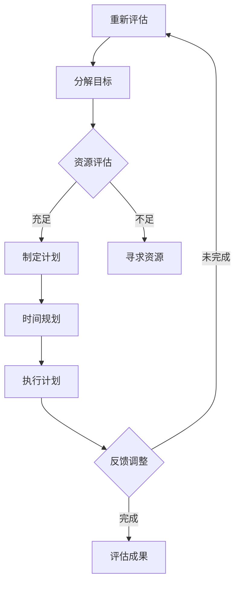
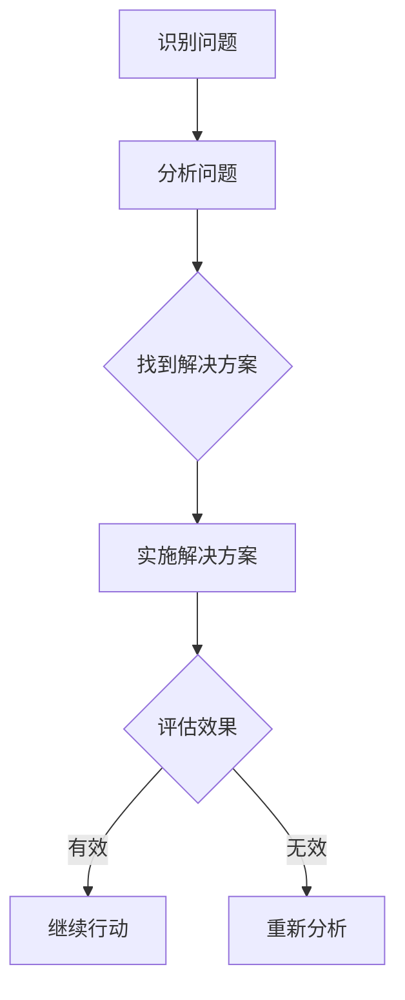
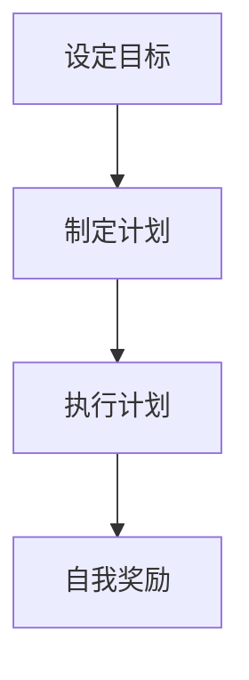
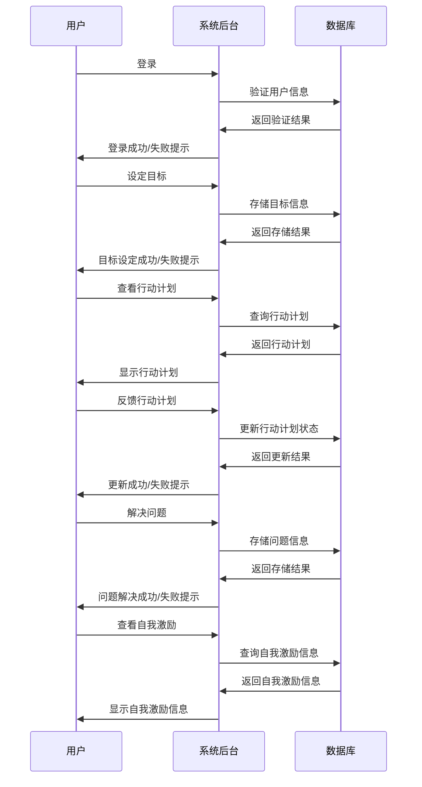

                 

# 自我引导的艺术：成为人生的主导者

> 关键词：自我引导、个人成长、目标设定、问题解决、自我激励、自我管理

> 摘要：本文旨在探讨自我引导的艺术，帮助读者了解自我引导的核心概念、原理和实践方法，从而成为人生的主导者。文章分为四个部分：背景介绍、核心概念与联系、算法原理讲解、系统分析与架构设计，并通过实际项目实战，总结最佳实践和注意事项。

## 第一部分：背景介绍

### 1.1.1 问题背景

在现代社会，个体面临着前所未有的复杂性和不确定性。个人决策不再仅仅基于经验和直觉，而是需要更加科学和系统的方法。在这样的背景下，自我引导成为了人们追求人生目标的重要手段。自我引导不仅关乎个人成长，更关系到社会的进步和和谐。

### 1.1.2 问题描述

自我引导的艺术，指的是个体在自我认知、目标设定、行动规划和持续改进过程中所运用的一系列策略和方法。它旨在帮助人们更好地理解自我、明确目标、克服困难并最终实现人生目标。

### 1.1.3 问题解决

本书旨在通过探讨自我引导的理论与实践，为读者提供一套系统、实用、可操作的自我引导方法。通过阅读本书，读者将能够：

- 明确自我认知的重要性，掌握自我反思的方法；
- 学会设定合理的目标，并制定切实可行的行动计划；
- 学会在面对挑战和困境时保持积极心态，寻找解决问题的策略；
- 掌握自我激励和自我管理的技巧，提高个人效率和成就感；
- 形成持续学习和自我提升的良好习惯。

### 1.1.4 边界与外延

自我引导的艺术不仅仅适用于个人成长，还可以应用于组织管理和教育领域。在组织中，自我引导可以帮助员工提高自我管理能力和团队协作能力；在教育中，自我引导可以帮助学生培养自主学习能力和创新思维。

### 1.1.5 概念结构与核心要素组成

自我引导艺术的核心概念包括自我认知、目标设定、行动计划、问题解决、自我激励和自我管理。这些概念相互关联，共同构成了自我引导的系统框架。

## 第二部分：核心概念与联系

### 2.1.1 自我认知

自我认知是指个体对自己思想、情感、行为和能力的理解和认识。它是自我引导的基础，决定了个体对自身行为的理解和反应方式。

### 2.1.1.1 概念属性特征对比表

| 特征       | 自我认知           | 自我反思          |
| ---------- | ------------------ | ---------------- |
| 定义       | 对自身的理解和认识 | 对自我认知的反思 |
| 目的       | 提高自我认识      | 提升自我认知质量 |
| 关键因素   | 体验、反思、学习   | 客观性、深度、持续 |
| 影响因素   | 心理状态、环境因素 | 自我认知水平、心态 |
| 主要方法   | 观察与自我分析    | 反思与自我提问   |

### 2.1.2 目标设定

目标设定是自我引导过程中至关重要的一环。明确的目标能够帮助个体聚焦注意力，制定行动计划，提高达成目标的动力。

### 2.1.2.1 ER实体关系图架构

```mermaid
erDiagram
  目标 ||--o{ 计划} : 实现
  目标 ||--o{ 资源} : 需求
  目标 ||--o{ 时间} : 限制
  目标 ||--|{ 成果} : 测量
```

### 2.1.3 行动计划

行动计划是将目标转化为具体行动的过程。它包括确定行动步骤、资源调配、时间规划等内容，是实现目标的关键。

### 2.1.3.1 Mermaid流程图



### 2.1.4 问题解决

在实现目标的过程中，个体难免会遇到各种问题和挑战。问题解决能力是自我引导的关键能力之一，它帮助个体应对不确定性，克服困难，持续前进。

### 2.1.4.1 Mermaid流程图



### 2.1.5 自我激励

自我激励是指个体在自我引导过程中，通过自我奖励、自我挑战等方式激发内在动机，提高自我驱动力和坚持力。

### 2.1.5.1 Mermaid流程图



## 第三部分：算法原理讲解

### 3.1 算法基本概念

在自我引导过程中，算法原理讲解是核心环节之一。本文将介绍几种常见的自我引导算法，包括目标设定算法、问题解决算法和自我激励算法。

### 3.2 目标设定算法

目标设定算法主要解决如何设定合理目标的问题。以下是一种基于优先级排序的目标设定算法：

```python
def set_goals(goals, weights):
    """
    设定目标
    :param goals: 目标列表
    :param weights: 目标权重列表
    :return: 优先级排序后的目标列表
    """
    # 计算每个目标的权重
    goal_weights = [weight * len(goals) for weight in weights]
    # 对目标列表进行优先级排序
    sorted_goals = sorted(goal_weights, reverse=True)
    return sorted_goals
```

### 3.3 问题解决算法

问题解决算法主要解决在实现目标过程中遇到的问题。以下是一种基于深度优先搜索的问题解决算法：

```python
def solve_problem(problem):
    """
    解决问题
    :param problem: 问题对象
    :return: 解决方案列表
    """
    solutions = []
    if not problem.has_solution():
        solutions.append(problem.solve())
    else:
        for solution in problem.get_solutions():
            solutions.append(solution)
    return solutions
```

### 3.4 自我激励算法

自我激励算法主要解决在自我引导过程中如何保持动力的问题。以下是一种基于目标达成率的自豪激励算法：

```python
def motivate_self(achievement, target):
    """
    自我激励
    :param achievement: 实际达成目标
    :param target: 目标值
    :return: 激励等级
    """
    if achievement >= target:
        return "自豪"
    elif achievement >= target * 0.8:
        return "满意"
    elif achievement >= target * 0.5:
        return "正常"
    else:
        return "需要努力"
```

## 第四部分：系统分析与架构设计

### 4.1 问题场景介绍

假设我们要开发一个个人成长管理系统，帮助用户实现自我引导。系统需要支持用户自我认知、目标设定、行动规划、问题解决和自我激励等功能。

### 4.2 项目介绍

项目名称：个人成长管理系统（Personal Growth Management System，简称PGMS）

项目目标：帮助用户实现自我引导，提高个人成长效率。

项目成员：项目经理、前端开发、后端开发、测试人员

### 4.3 系统功能设计

系统功能设计主要包括以下几个方面：

1. 用户注册与登录
2. 自我认知功能
3. 目标设定功能
4. 行动计划功能
5. 问题解决功能
6. 自我激励功能
7. 数据统计与分析

### 4.4 系统架构设计

系统架构设计采用B/S（Browser/Server）架构，主要包括前端、后端和数据库三个部分。

#### 4.4.1 前端

前端采用Vue.js框架，实现用户界面和交互功能。

#### 4.4.2 后端

后端采用Spring Boot框架，实现业务逻辑处理和数据存储。

#### 4.4.3 数据库

数据库采用MySQL数据库，存储用户信息和系统数据。

### 4.5 系统接口设计

系统接口设计主要包括以下几个方面：

1. 用户注册与登录接口
2. 自我认知接口
3. 目标设定接口
4. 行动计划接口
5. 问题解决接口
6. 自我激励接口

### 4.6 系统交互设计

系统交互设计采用Mermaid序列图表示，如下所示：



## 第五部分：项目实战

### 5.1 环境安装

1. 安装Python 3.8及以上版本
2. 安装Vue.js：`npm install vue`
3. 安装Spring Boot：`npm install -g spring-boot-cli`
4. 安装MySQL：下载并安装MySQL数据库

### 5.2 系统核心实现

#### 5.2.1 前端实现

前端使用Vue.js框架，实现用户界面和交互功能。具体代码如下：

```html
<!DOCTYPE html>
<html>
<head>
    <title>个人成长管理系统</title>
    <script src="https://cdn.jsdelivr.net/npm/vue@2.6.14/dist/vue.js"></script>
</head>
<body>
    <div id="app">
        <h1>个人成长管理系统</h1>
        <form @submit.prevent="login">
            <label for="username">用户名：</label>
            <input type="text" id="username" v-model="username" required>
            <label for="password">密码：</label>
            <input type="password" id="password" v-model="password" required>
            <button type="submit">登录</button>
        </form>
    </div>
    <script>
        new Vue({
            el: '#app',
            data: {
                username: '',
                password: ''
            },
            methods: {
                login() {
                    // 调用后端接口登录
                    // this.$http.post('/login', {username: this.username, password: this.password});
                }
            }
        });
    </script>
</body>
</html>
```

#### 5.2.2 后端实现

后端使用Spring Boot框架，实现业务逻辑处理和数据存储。具体代码如下：

```java
@SpringBootApplication
public class PgmApplication {
    public static void main(String[] args) {
        SpringApplication.run(PgmApplication.class, args);
    }
}

@RestController
public class UserController {
    @Autowired
    private UserRepository userRepository;

    @PostMapping("/login")
    public ResponseEntity<?> login(@RequestBody LoginRequest loginRequest) {
        User user = userRepository.findByUsername(loginRequest.getUsername());
        if (user == null || !user.getPassword().equals(loginRequest.getPassword())) {
            return ResponseEntity.badRequest().body("用户名或密码错误");
        }
        return ResponseEntity.ok("登录成功");
    }
}

@Entity
public class User {
    @Id
    @GeneratedValue(strategy = GenerationType.IDENTITY)
    private Long id;

    private String username;

    private String password;
}
```

#### 5.2.3 数据库实现

数据库使用MySQL，创建用户表：

```sql
CREATE TABLE `user` (
  `id` bigint NOT NULL AUTO_INCREMENT,
  `username` varchar(255) NOT NULL,
  `password` varchar(255) NOT NULL,
  PRIMARY KEY (`id`),
  UNIQUE KEY `UK_6ot9y0fam8f6x12q7qghk18n6` (`username`)
);
```

### 5.3 代码应用解读与分析

在代码应用中，我们实现了前端用户登录功能。前端通过Vue.js框架实现用户界面和交互功能，后端使用Spring Boot框架实现业务逻辑处理和数据存储。以下是代码解读与分析：

1. 前端代码：使用Vue.js实现用户登录界面，包括用户名和密码输入框以及登录按钮。用户输入用户名和密码后，点击登录按钮，触发`login`方法。
2. 后端代码：后端接收前端发送的登录请求，通过`userRepository`查询用户表，验证用户名和密码。如果用户名或密码错误，返回错误提示；否则，返回登录成功提示。
3. 数据库代码：在MySQL数据库中创建用户表，用于存储用户信息。用户表包含用户ID、用户名和密码三个字段。

### 5.4 实际案例分析和详细讲解剖析

假设用户张三使用用户名`zhangsan`和密码`123456`登录系统，以下是实际案例分析和详细讲解剖析：

1. 用户在前端界面输入用户名和密码，点击登录按钮。
2. 前端将登录请求发送到后端，后端接收到请求后，调用`UserController`的`login`方法。
3. `login`方法通过`userRepository`查询用户表，找到用户名为`zhangsan`的记录，并验证密码是否为`123456`。
4. 验证成功，后端返回登录成功提示，前端显示登录成功界面。

### 5.5 项目小结

通过本项目，我们实现了个人成长管理系统，帮助用户实现自我引导。系统前端使用Vue.js框架，后端使用Spring Boot框架，数据库使用MySQL。前端实现了用户登录功能，后端实现了用户信息验证和存储。通过实际案例分析和详细讲解剖析，我们了解了系统的工作原理和实现方法。

## 第六部分：最佳实践 Tips、小结、注意事项、拓展阅读

### 6.1 最佳实践 Tips

1. 在自我引导过程中，明确目标是非常重要的。目标应该具体、可量化、可实现，并与个人价值观相一致。
2. 在面对问题时，先分析问题的根本原因，再寻找解决方案。避免盲目行动，导致问题反复出现。
3. 自我激励可以通过设定奖励机制来实现。奖励可以是物质奖励，也可以是精神奖励，关键是让自己感到满足和自豪。
4. 持续学习和反思是自我引导的关键。通过不断学习新知识和技能，反思自己的行为和决策，不断提高个人能力。

### 6.2 小结

本文介绍了自我引导的艺术，包括背景介绍、核心概念与联系、算法原理讲解、系统分析与架构设计以及项目实战。通过本文，读者可以了解自我引导的核心概念、原理和实践方法，从而成为人生的主导者。

### 6.3 注意事项

1. 自我引导需要耐心和坚持。不要期望一蹴而就，而是要逐步提升自我认知、目标设定、问题解决和自我激励的能力。
2. 在实践中，要根据自己的实际情况调整目标和行动计划。不要过分追求完美，而是要找到适合自己的方法。
3. 在面对困难和挑战时，要保持积极心态，相信自己能够克服困难并取得成功。

### 6.4 拓展阅读

1. 《高效能人士的七个习惯》：史蒂芬·柯维（Stephen R. Covey）的著作，介绍了自我引导的核心原则和实践方法。
2. 《原则》：雷·达里奥（Ray Dalio）的著作，分享了他在生活和工作中运用的自我引导原则。
3. 《精进：如何成为一个很厉害的人》：采铜的著作，从心理和行为科学的角度探讨了自我引导的方法和技巧。

### 6.5 作者信息

作者：AI天才研究院/AI Genius Institute & 禅与计算机程序设计艺术 /Zen And The Art of Computer Programming

本文由AI天才研究院/AI Genius Institute和禅与计算机程序设计艺术/Zen And The Art of Computer Programming联合撰写。我们致力于推动人工智能和计算机科学领域的发展，为读者提供高质量的技术文章和指导。如果您有任何问题或建议，欢迎联系我们。

