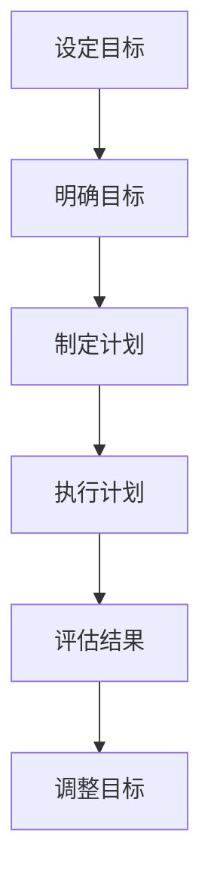
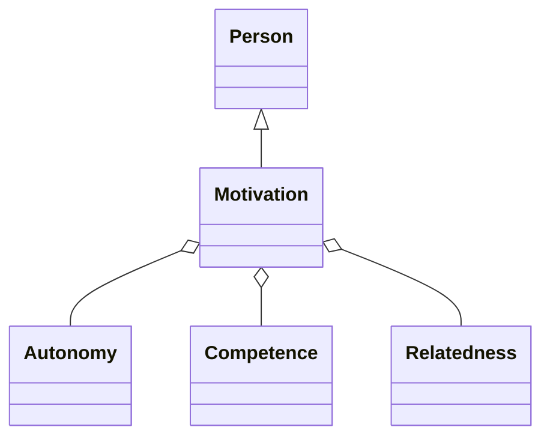
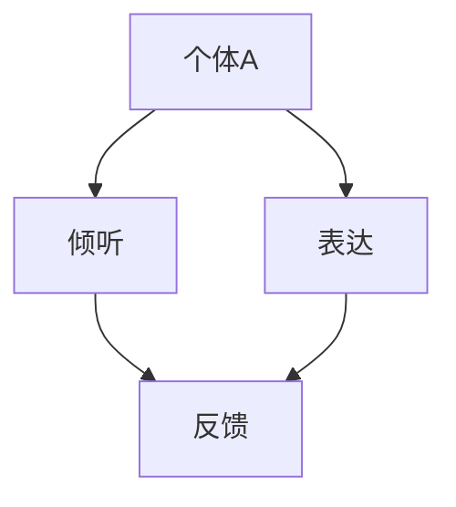
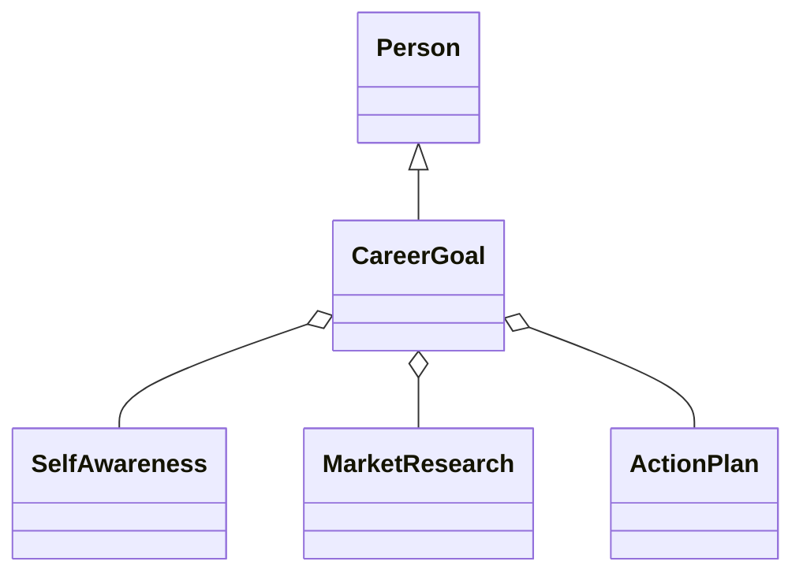
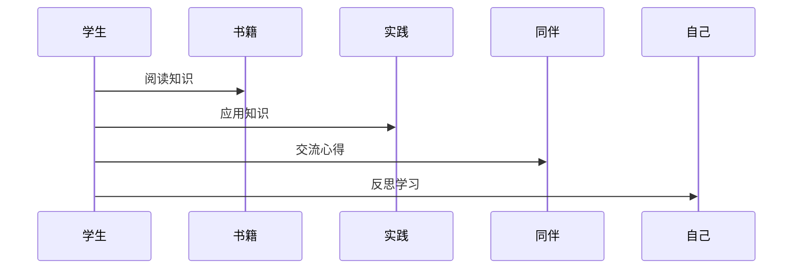

                 

**《自我引导：成为内在智慧的跟随者》**

> 关键词：自我引导、内在智慧、情绪管理、目标设定、自我激励、决策与问题解决、人际关系与沟通、职业生涯规划、终身学习

> 摘要：本文将深入探讨自我引导与内在智慧的关系，详细分析自我引导的各个方面，并提供实用的方法和技巧，帮助读者成为内在智慧的跟随者。

## 引言

在快节奏的现代社会，自我引导和内在智慧成为我们应对复杂生活、实现个人成长的关键。自我引导不仅仅是管理日常生活的技巧，更是培养内在智慧的基础。内在智慧是一种深刻理解世界、自我和他人的能力，它帮助我们做出明智的决策，应对挑战，实现个人目标。

本文将分步骤地探讨自我引导的各个方面，包括情绪管理、目标设定、自我激励、决策与问题解决、人际关系与沟通、职业生涯规划以及终身学习。通过这些实践，我们将成为内在智慧的跟随者，更好地理解自己和世界。

### 第1步：自我认知的重要性

自我认知是自我引导的第一步。它要求我们深入理解自己的情绪、需求和价值观。只有真正了解自己，我们才能做出符合内心需求的决策。

**核心概念与联系**

| 概念       | 定义                                       |
|------------|--------------------------------------------|
| 自我认知   | 对自己心理、情绪和行为的认识和理解               |
| 情绪       | 感知、表达和调节个体情绪的能力                   |
| 需求       | 个体内在的欲望或需要                           |
| 价值观     | 个人对事物判断的标准和选择依据                   |

**ER实体关系图架构**

```mermaid
erDiagram
  Person ||--|{ Emotion }|--:>> Regulation
  Person ||--|{ Need }|:>> Satisfied
  Person ||--|{ Value }|:>> Guideline
```

### 第2步：情绪管理

情绪管理是自我引导的重要组成部分。它要求我们学会识别、理解和调节情绪，以保持心理平衡。

**算法原理讲解**

情绪管理的算法原理可以简化为以下步骤：

1. **识别情绪**：使用自我认知了解情绪的来源和特征。
2. **理解情绪**：分析情绪背后的需求和价值观。
3. **调节情绪**：采用认知行为疗法、冥想等方法进行情绪调节。

```python
# 情绪管理算法示例

def manage_emotion(emotion):
    # 识别情绪
    emotion_source = identify_emotion_source(emotion)
    
    # 理解情绪
    emotion_meaning = understand_emotion_meaning(emotion)
    
    # 调节情绪
    regulate_emotion(emotion_source, emotion_meaning)
```

### 第3步：目标设定与时间管理

目标设定和时间管理是自我引导的重要实践。设定清晰的目标和有效管理时间可以帮助我们实现个人成长和职业发展。

**数学模型**

目标设定的SMART原则：

- **S** - Specific（具体的）
- **M** - Measurable（可衡量的）
- **A** - Achievable（可实现的）
- **R** - Relevant（相关的）
- **T** - Time-bound（有时限的）

**Mermaid 流程图**



### 第4步：自我激励与成长

自我激励是自我引导的核心。它要求我们找到内在动力，持续成长。

**激励理论**

**自我决定理论**：认为人们具有自我决定的需求，包括自主性、能力和关联性。

**Mermaid 类图**



### 第5步：决策与问题解决

决策与问题解决是自我引导的重要组成部分。通过科学的决策方法和问题解决策略，我们可以更有效地应对挑战。

**决策模型**

1. **问题识别**：明确决策目标和问题。
2. **信息收集**：收集与决策相关的信息。
3. **方案评估**：评估各个方案的优缺点。
4. **决策选择**：选择最优方案。
5. **实施与反馈**：执行决策并收集反馈。

**Mermaid 序列图**

```mermaid
sequenceDiagram
    participant 决策者
    participant 问题
    决策者->>问题: 识别问题
    decision 收集信息?
    yes->>决策者: 收集信息
    decision 评估方案?
    yes->>决策者: 评估方案
    decision 选择最优方案?
    yes->>决策者: 选择方案
    decision 实施决策?
    yes->>决策者: 实施决策
    decision 收集反馈?
    yes->>决策者: 收集反馈
```

### 第6步：人际关系与沟通

人际关系与沟通是自我引导的重要实践。通过有效的沟通和人际关系管理，我们可以建立良好的人际网络，提升个人影响力。

**沟通技巧**

- **倾听**：积极倾听对方的观点和感受。
- **表达**：清晰表达自己的意图和感受。
- **非言语沟通**：注意身体语言和面部表情。

**Mermaid 架构图**



### 第7步：职业生涯规划

职业生涯规划是自我引导的重要组成部分。通过合理的规划和持续的努力，我们可以实现职业目标。

**职业生涯规划原则**

- **自我认知**：了解自己的兴趣、价值观和优势。
- **市场调研**：了解行业趋势和市场需求。
- **目标设定**：设定明确的职业目标。
- **行动计划**：制定实现目标的行动计划。

**Mermaid 类图**



### 第8步：终身学习

终身学习是自我引导的重要组成部分。通过不断学习和更新知识，我们可以不断提升自我。

**终身学习策略**

- **自我驱动学习**：培养自我学习的习惯和动力。
- **多样化学习**：采用不同的学习方式，如阅读、实践、交流等。
- **持续反思**：反思学习过程和成果，调整学习策略。

**Mermaid 序列图**



### 总结

通过本文的探讨，我们了解到自我引导和内在智慧的重要性。通过情绪管理、目标设定、自我激励、决策与问题解决、人际关系与沟通、职业生涯规划以及终身学习，我们可以成为内在智慧的跟随者，更好地理解自己和世界。

**注意事项**

- **持续实践**：自我引导和内在智慧的培养需要持续的努力和实践。
- **反思与调整**：定期反思自己的行为和决策，调整自我引导的方法。
- **寻求帮助**：在遇到困难时，不妨寻求专业人士的帮助。

**拓展阅读**

- **《自控力》**：凯利·麦格尼格尔
- **《智慧书》**：巴尔塔沙·葛拉西安
- **《如何赢得朋友与影响他人》**：戴尔·卡耐基

作者：AI天才研究院/AI Genius Institute & 禅与计算机程序设计艺术 /Zen And The Art of Computer Programming

