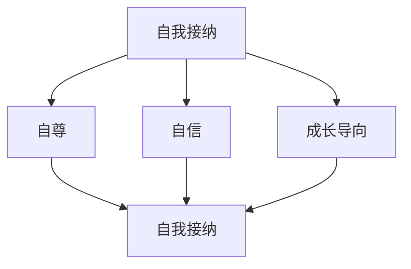
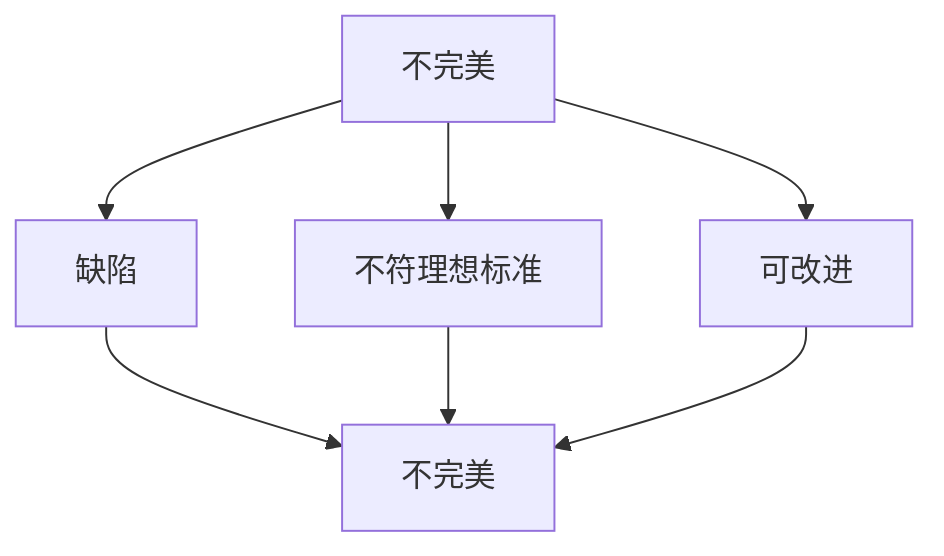
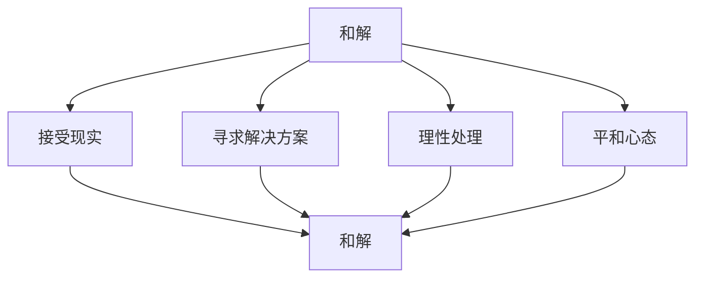

                 

### 引言

在快节奏的现代生活中，我们常常被追求完美、他人期望和社会标准所束缚。在这样的环境中，自我接纳成为了许多人追求的奢侈品质。自我接纳不仅是心理健康的基石，更是我们个人成长和幸福感的重要保障。那么，何为自我接纳？为什么它如此重要？如何在不完美中找到和解？这些问题将成为本文探讨的核心。

首先，自我接纳是一个深奥而广泛的概念，它涉及到心理学、社会学和哲学等多个领域。自我接纳意味着接受自己的全部，包括优点和缺点，接受自己是一个不断成长和变化的个体。它并不是自我放弃或自暴自弃，而是在认识到自身局限性的同时，依然保持自尊和自信。

### 1.1 书籍主题介绍

本书旨在探讨自我接纳这一核心主题，通过多学科的角度，全面解析自我接纳的内涵、外延及其在各个领域中的重要性。书中不仅会介绍心理学、社会学和哲学对自我接纳的解读，还会结合实际案例，探讨自我接纳的具体实践方法和挑战。

首先，在心理学视角下，我们会深入探讨自我接纳的理论基础，包括自我接纳的概念框架、心理学研究对自我接纳的解析以及自我接纳对心理健康的影响。接下来，从社会学视角出发，我们将分析社会互动与自我接纳的关系，社会环境对自我接纳的影响以及社会支持与自我接纳的关系。

哲学视角则为我们提供了另一个深入的思考维度，我们将探讨哲学对自我接纳的探讨，自我接纳与人生哲学的关系以及自我接纳的哲学意义。通过这些探讨，我们希望能够从多个角度理解自我接纳的复杂性和多样性。

除了理论探讨，本书还会提供具体的实践方法，包括内在觉察、负面情绪管理和生活方式调整等，帮助读者在实际生活中更好地实现自我接纳。同时，我们也会面对自我接纳过程中可能遇到的挑战和障碍，探讨如何克服这些挑战，找到和解之道。

### 1.2 核心概念与联系

#### 1.2.1 自我接纳的定义

自我接纳是一个心理学上的概念，指的是个体对自己全方位的接受和认可，无论优点还是缺点。这种接纳不是盲目地接受，而是在认识到自己不足的同时，依然保持自尊和自信。

**属性特征对比表格：**

| 特征 | 自我接纳 | 自我否定 |
| ---- | -------- | -------- |
| 接纳自我 | 包括优点和缺点 | 只接受优点 |
| 自尊 | 保持自尊 | 缺乏自尊 |
| 自信 | 增强自信 | 缺乏自信 |
| 成长导向 | 促进个人成长 | 阻碍个人成长 |

**ER实体关系图：**

#### 1.2.2 不完美

不完美是一个广泛的概念，通常用来描述任何不完全符合理想标准的事物或个体。在自我接纳的语境中，不完美指的是个体在各个方面存在的不足和缺陷。

**属性特征对比表格：**

| 特征 | 不完美 | 完美 |
| ---- | ------- | ----- |
| 存在缺陷 | 是的 | 不是 |
| 不符合理想标准 | 是的 | 不是 |
| 可改进 | 是的 | 不是 |
| 普遍性 | 普遍存在 | 稀少 |

**ER实体关系图：**

#### 1.2.3 和解

和解指的是个体在面对不完美时，采取的一种理性、平和的态度，接受现实并寻求解决问题的方法。它不仅是自我接纳的一种表现，也是个体成长和进步的重要途径。

**属性特征对比表格：**

| 特征 | 和解 | 斤斤计较 |
| ---- | ------- | -------- |
| 接受现实 | 是的 | 不是 |
| 寻求解决方案 | 是的 | 不是 |
| 理性处理 | 是的 | 不是 |
| 平和心态 | 是的 | 不是 |

**ER实体关系图：**

### 1.3 关系概述

自我接纳、不完美和和解三者之间存在着密切的关系。自我接纳是基础，它使得个体能够以平和的心态面对自己的不完美。不完美则是自我接纳的媒介，通过接受不完美，个体能够找到和解之道。和解则是最终目标，它帮助个体在现实面前保持理性，寻找解决问题的方法。

### 1.4 深入探讨

#### 自我接纳的重要性

自我接纳对个体的心理健康具有至关重要的影响。首先，自我接纳能够减少焦虑和抑郁。当个体接受自己的不完美时，他们不再需要为了达到某种理想标准而不断奋斗，从而减轻了内心的压力。其次，自我接纳有助于建立自尊和自信。当个体认识到自己的价值不仅仅取决于外在成就或他人的认可时，他们更容易建立稳定的自我价值感。

#### 不完美与和解的关系

不完美是自我接纳的重要组成部分，而和解则是应对不完美的有效策略。通过和解，个体能够在面对不完美时保持冷静和理性，从而更好地解决问题。和解不仅有助于个体的心理健康，还能够提高他们的生活质量和幸福感。

### 1.5 本章小结

本章主要介绍了自我接纳、不完美和和解这三个核心概念，并分析了它们之间的相互关系。通过本章的探讨，我们初步了解了自我接纳的重要性和不完美与和解的关系。在接下来的章节中，我们将进一步深入探讨自我接纳的理论基础、实践方法和挑战，帮助读者更好地理解自我接纳的内涵和实际应用。

---

在了解了自我接纳、不完美和和解的基本概念及其相互关系后，接下来我们将深入探讨自我接纳的理论基础，包括心理学、社会学和哲学等多个领域的视角。通过这些多维度的分析，我们将更好地理解自我接纳的复杂性和多样性。

### 第二部分：自我接纳的理论基础

自我接纳是一个涉及多个学科领域的概念。在心理学、社会学和哲学中，自我接纳都扮演着重要的角色。本部分将分别从这三个角度出发，探讨自我接纳的理论基础。

#### 2.1 心理学视角

心理学对自我接纳的研究已经相当深入，提供了丰富的理论和实证数据。自我接纳在心理学中通常被定义为一种积极的态度，它涉及到个体对自己全面、无条件的接受。

#### 2.1.1 自我接纳的理论框架

自我接纳的理论框架通常包括几个关键组成部分：自我意识、自我评价和自我效能感。自我意识是指个体对自己存在的认知，包括自己的外貌、性格、行为等各个方面。自我评价则是个体对自己价值的评估，它可能受到外界反馈和内在期望的影响。自我效能感是个体对自己完成特定任务的信心。

在自我接纳的理论框架中，这三个组成部分相互作用，共同影响个体的心理健康和幸福感。例如，一个具有高自我意识但低自我评价的人可能会感到自卑和不安。相反，一个具有高自我评价和自我效能感的人则可能更容易接受自己的不完美。

#### 2.1.2 心理学研究对自我接纳的解析

心理学研究通过多种方法来解析自我接纳。其中，自我接纳量表（Self-acceptance Scale）是一个常用的工具。这个量表通常包括多个维度，如自我接纳、自我宽容、自我理解等。研究表明，高自我接纳水平与较低的抑郁、焦虑和压力水平相关。

例如，一项针对大学生群体的研究发现，自我接纳与生活满意度、心理韧性和应对能力呈显著正相关。这意味着，自我接纳不仅能够提升个体的心理健康，还能够增强他们的生活质量和应对压力的能力。

#### 2.1.3 自我接纳的心理学影响

自我接纳的心理学影响是多方面的。首先，自我接纳能够减少自我批评和负面情绪。当个体接受自己的不完美时，他们不再需要对自己的缺点和错误进行无休止的批判，这有助于减少焦虑和抑郁。其次，自我接纳能够提高自尊和自信。当个体认识到自己的价值不仅仅取决于外在成就或他人的认可时，他们更容易建立稳定的自我价值感。

此外，自我接纳还能够促进个人成长和自我提升。一个能够自我接纳的人更容易面对挑战和困难，因为他们相信自己的能力和潜力。这种信念不仅能够提高个体的自信心，还能够激发他们的内在动力，从而推动个人成长。

#### 2.2 社会学视角

社会学对自我接纳的研究关注社会互动、社会环境和社会支持对自我接纳的影响。

#### 2.2.1 社会互动与自我接纳

社会互动在自我接纳过程中扮演着重要角色。个体的社交环境和社会关系对他们的自我接纳水平有着显著影响。例如，一个在积极、支持性环境中成长的人可能更容易自我接纳。相反，在一个充满批评和否定环境中成长的人可能会更加难以接受自己的不完美。

研究表明，社会支持与自我接纳之间存在密切关系。社会支持不仅包括直接的赞扬和鼓励，还包括情感支持和物质帮助。一个拥有强社会支持网络的人可能会更容易自我接纳。这是因为他们在面对困难时，可以获得更多的帮助和鼓励，从而增强自我价值感。

#### 2.2.2 社会环境对自我接纳的影响

社会环境对自我接纳的影响是多方面的。首先，文化背景和社会规范可能对个体的自我接纳产生影响。在一些文化中，追求完美和外在成就被视为非常重要的价值观。这种文化背景可能使个体更加难以自我接纳，因为他们可能会过分关注自己的缺点和不足。相反，在一些更加宽容和包容的文化中，个体可能更容易自我接纳。

其次，社会压力也可能对自我接纳产生影响。现代社会中，竞争和压力无处不在。个体可能会因为无法达到社会期望而感到自卑和不安。这种社会压力可能阻碍自我接纳的发展。因此，创造一个更加包容和支持的社会环境，对于个体的自我接纳至关重要。

#### 2.2.3 社会支持与自我接纳的关系

社会支持与自我接纳之间存在密切的关系。一个拥有强社会支持网络的人可能更容易自我接纳。这是因为他们在面对困难时，可以获得更多的帮助和鼓励，从而增强自我价值感。例如，家庭成员和朋友的支持可以帮助个体认识到自己的价值，从而减少自我批评和负面情绪。

此外，社会支持还可以帮助个体建立更加积极的人生观和价值观。一个拥有积极社会支持网络的人可能会更加乐观和自信，从而更容易自我接纳。因此，社会支持不仅是心理健康的重要保障，也是自我接纳的重要基础。

#### 2.3 哲学视角

哲学对自我接纳的研究提供了一个更为深层次的思考维度。哲学家们探讨了自我接纳的哲学意义，以及自我接纳与人生哲学的关系。

#### 2.3.1 哲学对自我接纳的探讨

哲学对自我接纳的探讨主要关注个体存在的意义和人类自我认同的问题。一些哲学家认为，自我接纳是个人存在和自我认同的必然要求。例如，存在主义哲学家让-保罗·萨特尔（Jean-Paul Sartre）认为，个体的存在先于其本质，这意味着个体需要通过自我接纳来建立自我认同。

其他哲学家则从道德和伦理的角度探讨自我接纳。例如，亚里士多德认为，自我接纳是实现幸福和道德生活的基础。通过自我接纳，个体能够更好地理解自己的行为和动机，从而实现道德上的自律和自我提升。

#### 2.3.2 自我接纳与人生哲学的关系

自我接纳与人生哲学之间存在密切的关系。人生哲学涉及到个体如何理解自己的存在、如何处理生活中的挑战以及如何实现个人成长。自我接纳作为一种积极的态度，可以帮助个体更好地处理生活中的困难和挑战，从而实现个人成长和自我实现。

例如，自我接纳可以帮助个体在面对失败和挫折时保持积极的心态。通过接受自己的不完美，个体能够更好地理解失败的原因，并从中学习和成长。这种态度不仅有助于个体的心理健康，还能够提高他们的生活质量和幸福感。

#### 2.3.3 自我接纳的哲学意义

自我接纳的哲学意义在于，它为我们提供了一种理解自己和世界的全新方式。通过自我接纳，个体能够超越外在成就和社会标准的束缚，更深入地理解自己的内在价值。这种理解不仅有助于个体的心理健康，还能够推动他们在道德和伦理上的自我提升。

自我接纳还强调了个体存在的独特性和不可替代性。每个人都是独一无二的，拥有自己独特的经历和价值观。通过自我接纳，个体能够认识到自己的独特性，并在此基础上建立自我认同。

### 2.4 自我接纳的理论与实践

尽管自我接纳在理论和哲学上具有深远的意义，但在实际生活中，如何实现自我接纳仍然是一个挑战。因此，本部分将探讨自我接纳的具体实践方法，帮助读者在实际生活中更好地实现自我接纳。

#### 2.4.1 内在觉察

内在觉察是自我接纳的第一步。它涉及到对自己的内心进行深入的观察和理解。通过内在觉察，个体能够更好地认识自己的情绪、思想和行为模式，从而找到自我接纳的路径。

例如，个体可以通过冥想、日记或心理咨询等方式进行内在觉察。冥想可以帮助个体平静内心，从而更好地观察和理解自己的情绪和想法。日记则提供了一个记录和反思的平台，个体可以通过回顾日记中的内容，更好地了解自己的内心世界。

#### 2.4.2 负面情绪管理

负面情绪是自我接纳过程中常见的障碍。通过学习负面情绪管理的方法，个体能够更好地应对负面情绪，从而减少自我批评和负面情绪的影响。

例如，个体可以通过情绪调节技巧，如深呼吸、肌肉放松和正念冥想等来管理负面情绪。这些技巧可以帮助个体冷静下来，从而更好地理解自己的情绪，并找到应对策略。

#### 2.4.3 生活方式调整

生活方式调整也是实现自我接纳的重要途径。一个健康、积极的生活方式可以帮助个体更好地面对生活中的挑战，从而增强自我接纳。

例如，个体可以通过锻炼、健康饮食和充足的睡眠来改善身心健康。这些健康习惯不仅有助于提高生活质量，还能够增强个体的自信心和自尊感。

### 2.5 本章小结

本章从心理学、社会学和哲学等多个角度探讨了自我接纳的理论基础。我们首先介绍了自我接纳的概念和心理学研究对自我接纳的解析，接着讨论了社会互动、社会环境和社会支持对自我接纳的影响。最后，我们探讨了哲学对自我接纳的探讨以及自我接纳与人生哲学的关系。通过这些探讨，我们希望能够帮助读者从多个维度理解自我接纳的内涵和重要性。在接下来的章节中，我们将进一步探讨自我接纳的具体实践方法和挑战。

---

在理解了自我接纳的理论基础之后，接下来我们将探讨自我接纳的具体实践方法。这些方法不仅能够帮助我们在日常生活中更好地实现自我接纳，还能够提升我们的心理健康和幸福感。

### 第三部分：自我接纳的具体实践方法

自我接纳是一个需要不断实践的过程。通过一系列具体的实践方法，我们可以逐步实现自我接纳，从而提升自己的心理健康和幸福感。本部分将介绍几个关键的具体实践方法，包括内在觉察、负面情绪管理和生活方式调整。

#### 3.1 内在觉察

内在觉察是自我接纳的基础。通过深入探索自己的内心世界，我们能够更好地理解自己的情绪、思想和行为模式，从而找到自我接纳的路径。

**3.1.1 内在觉察的重要性**

内在觉察的重要性在于，它能够帮助我们识别和面对内在的冲突和负面情绪。当我们能够清晰地看到自己的内心世界时，我们就能更好地理解自己的行为和反应，从而找到自我接纳的方法。

**3.1.2 如何进行内在觉察**

进行内在觉察的方法有多种，以下是一些常见的方法：

1. **冥想**：冥想是一种集中注意力的练习，可以帮助我们平静内心，从而更好地观察和理解自己的情绪和想法。开始冥想时，可以找一个安静的地方，坐下来，闭上眼睛，专注于呼吸。当你的思绪开始游离时，轻轻地将注意力拉回到呼吸上。

2. **日记**：通过写日记，我们可以记录自己的情绪、思想和感受。这种方法有助于我们回顾和反思自己的生活，从而更好地理解自己。写日记时，不需要担心文笔好坏，最重要的是真诚地表达自己的内心世界。

3. **心理咨询**：心理咨询提供了一个安全的、无评判的环境，让我们能够与专业人士深入探讨自己的内心世界。通过心理咨询，我们可以更好地理解自己的情绪和行为，并找到自我接纳的方法。

**3.1.3 内在觉察的案例分享**

例如，有一位名叫艾米（Amy）的女士，她在工作中经常感到焦虑和压力。通过心理咨询和冥想，艾米学会了如何进行内在觉察。她开始记录自己的情绪变化，并深入探讨这些情绪背后的原因。通过这个过程，艾米发现她对工作的过度追求源于对失败的恐惧。她意识到，她需要接受自己的不完美，并学会放手。随着时间的推移，艾米的焦虑和压力明显减少，她的生活质量也得到了显著提升。

#### 3.2 负面情绪管理

负面情绪是自我接纳过程中常见的障碍。通过学习负面情绪管理的方法，我们能够更好地应对负面情绪，从而减少自我批评和负面情绪的影响。

**3.2.1 负面情绪的类型**

负面情绪包括焦虑、抑郁、愤怒、悲伤等。每种情绪都有其独特的特点和影响。例如，焦虑可能导致个体感到紧张和不安，而抑郁则可能使个体感到绝望和无助。

**3.2.2 负面情绪的影响**

负面情绪对我们的身心健康有着显著的影响。长期的负面情绪可能导致焦虑和抑郁等心理问题，甚至引发身体疾病。此外，负面情绪还可能影响我们的工作和人际关系。

**3.2.3 负面情绪管理的方法**

以下是几种有效的负面情绪管理方法：

1. **情绪调节技巧**：情绪调节技巧包括深呼吸、肌肉放松和正念冥想等。这些技巧可以帮助我们冷静下来，从而更好地理解自己的情绪，并找到应对策略。

2. **认知重构**：认知重构是一种改变负面思维模式的方法。通过识别和质疑负面思维，我们可以更客观地看待问题，从而减少负面情绪。

3. **情绪表达**：情绪表达可以帮助我们释放负面情绪，从而减少情绪积累。表达情绪可以通过与他人交流、写日记或艺术创作等方式进行。

**3.2.4 负面情绪管理的案例分享**

例如，有一位名叫杰瑞（Jerry）的程序员，他在工作中经常感到压力巨大，这导致他经常感到焦虑和失眠。通过学习情绪调节技巧，杰瑞开始练习深呼吸和肌肉放松。他还学会了认知重构，通过质疑自己的负面思维，他能够更客观地看待问题。此外，杰瑞还开始写日记，通过记录自己的情绪和想法，他能够更好地理解自己的情绪，并找到应对策略。随着时间的推移，杰瑞的焦虑和失眠问题得到了显著改善，他的工作效率和生活质量也得到了提升。

#### 3.3 生活方式调整

生活方式调整是自我接纳的重要一环。一个健康、积极的生活方式可以帮助我们更好地面对生活中的挑战，从而增强自我接纳。

**3.3.1 健康生活方式的重要性**

健康生活方式包括健康饮食、适量运动和充足睡眠等。这些习惯对我们的身心健康有着重要的影响。例如，健康的饮食习惯可以提供我们所需的营养，从而增强免疫力；适量的运动可以促进血液循环和新陈代谢，从而提高身体素质；充足的睡眠可以恢复体力和精神，从而提高生活质量。

**3.3.2 健康生活方式的实践**

以下是几种健康的饮食习惯：

1. **均衡饮食**：均衡饮食包括摄入足够的蛋白质、碳水化合物、脂肪、维生素和矿物质等。建议多食用蔬菜、水果、全谷物和低脂肪蛋白质。

2. **限制糖分摄入**：过多的糖分摄入可能导致肥胖、糖尿病等健康问题。建议减少含糖饮料和糖果的摄入。

3. **适量摄入脂肪**：适量的脂肪摄入对身体有益，但需要选择健康的脂肪，如橄榄油、鱼油等。

**3.3.3 案例分析：生活方式调整对自我接纳的影响**

例如，有一位名叫丽莎（Lisa）的女士，她一直为自己的体重和健康状况而感到焦虑。通过改变生活方式，丽莎开始坚持每天进行适量的运动，并调整饮食结构。她减少了高热量食物的摄入，增加了蔬菜和水果的摄入。随着时间的推移，丽莎的体重逐渐下降，她的健康状况也得到了显著改善。更重要的是，她开始接受自己的不完美，并学会了自我接纳。她的生活质量和幸福感也因此得到了提升。

#### 3.4 本章小结

通过本部分的探讨，我们介绍了自我接纳的具体实践方法，包括内在觉察、负面情绪管理和生活方式调整。这些方法不仅帮助我们更好地理解自己的内心世界，还能够提升我们的心理健康和幸福感。在接下来的章节中，我们将继续探讨自我接纳过程中可能遇到的挑战和障碍，以及如何克服这些挑战，实现真正的自我接纳。

---

在自我接纳的过程中，我们可能会遇到各种挑战和障碍。这些挑战可能来自内心，也可能来自外部环境。理解这些挑战，并找到克服它们的方法，是实现自我接纳的重要一步。

### 第四部分：自我接纳的挑战与障碍

#### 4.1 内在冲突

内在冲突是自我接纳过程中最常见的挑战之一。它涉及到自我内部的矛盾和冲突，如自我批评、自我怀疑和自我否定。

**4.1.1 内在冲突的表现**

内在冲突的表现形式多种多样，常见的包括：

1. **自我批评**：个体对自己的缺点和错误进行无休止的批评和指责。
2. **自我怀疑**：个体对自己的能力和价值感到不确定，经常怀疑自己的决定和行为。
3. **自我否定**：个体否认自己的存在和价值，认为自己一无是处。

**4.1.2 内在冲突的成因**

内在冲突的成因复杂多样，主要包括：

1. **早期经历**：个体在成长过程中可能受到负面因素的影响，如父母的批评、同龄人的排斥等，这些经历可能导致个体形成自我否定的信念。
2. **社会压力**：现代社会中，竞争和压力无处不在，个体可能会因为无法达到社会期望而产生自我怀疑和自我批评。
3. **文化背景**：某些文化背景强调完美和成功，这可能导致个体对自己的不完美感到羞愧和焦虑。

**4.1.3 克服内在冲突的方法**

要克服内在冲突，我们可以采取以下几种方法：

1. **内在觉察**：通过内在觉察，个体能够更好地了解自己的情绪、思想和行为模式，从而识别和面对内在冲突。
2. **认知重构**：通过认知重构，个体可以改变负面思维模式，从而减少自我批评和自我否定。
3. **心理治疗**：心理治疗，如认知行为疗法和情感焦点疗法等，可以帮助个体深入探讨内在冲突的成因，并提供解决问题的方法。

#### 4.2 外在压力

外在压力也是自我接纳过程中常见的挑战。它来自于外部环境，如工作、家庭、社交关系等。

**4.2.1 外在压力的种类**

外在压力的种类繁多，主要包括：

1. **工作压力**：工作环境中的竞争、任务量和期望可能导致个体感到压力巨大。
2. **家庭压力**：家庭关系、子女教育、经济负担等都可能对个体造成压力。
3. **社交压力**：社交关系中的期望、评价和冲突都可能对个体造成压力。

**4.2.2 外在压力的影响**

外在压力的影响主要体现在以下几个方面：

1. **心理健康**：长期的压力可能导致焦虑、抑郁等心理问题。
2. **身体健康**：压力还可能引发各种身体疾病，如高血压、心脏病等。
3. **人际关系**：压力可能影响个体的人际关系，导致关系紧张和冲突。

**4.2.3 应对外在压力的策略**

要应对外在压力，我们可以采取以下几种策略：

1. **时间管理**：合理安排时间，确保工作和生活的平衡，从而减少压力。
2. **放松技巧**：如深呼吸、瑜伽、冥想等放松技巧可以帮助个体缓解压力。
3. **寻求支持**：与家人、朋友或专业人士交流，寻求支持和帮助，从而减轻压力。

#### 4.3 深层信念

深层信念是自我接纳过程中另一个重要的挑战。深层信念通常是个体在成长过程中形成的，它们对个体的行为和思维产生深远的影响。

**4.3.1 深层信念的重要性**

深层信念的重要性在于，它们决定了个体如何看待自己和世界。例如，一个认为自己不值得被爱的个体可能会在人际关系中感到焦虑和不安。

**4.3.2 深层信念的来源**

深层信念的来源主要包括：

1. **家庭环境**：家庭关系和父母的言行对个体的深层信念产生重要影响。
2. **教育背景**：学校教育和同龄人的影响也可能塑造个体的深层信念。
3. **文化背景**：文化价值观和传统观念也可能对个体的深层信念产生影响。

**4.3.3 改变深层信念的方法**

要改变深层信念，我们可以采取以下几种方法：

1. **认知重构**：通过识别和质疑负面信念，个体可以逐步改变深层信念。
2. **心理治疗**：心理治疗，如认知行为疗法和情感焦点疗法等，可以帮助个体深入探讨深层信念的成因，并提供解决问题的方法。
3. **自我探索**：通过自我探索，个体可以更好地理解自己的深层信念，并找到改变的方法。

#### 4.4 本章小结

通过本部分的探讨，我们了解了自我接纳过程中可能遇到的挑战和障碍，包括内在冲突、外在压力和深层信念。理解这些挑战，并找到克服它们的方法，是实现自我接纳的重要一步。在接下来的章节中，我们将通过具体的成长故事，进一步探讨自我接纳的过程和成果。

---

成长故事是我们理解自我接纳过程和成果的最佳途径。通过真实的案例，我们可以看到自我接纳如何在个体的生活中产生深远的影响。以下将分享两个真实的成长故事，展示从自我批评到自我接纳的旅程，以及在困境中找到自我接纳的方法。

### 5.1 故事一：从自我批评到自我接纳

**5.1.1 故事背景**

李明是一名软件工程师，他在职业生涯中取得了不少成就。然而，他的内心总是充满了自我批评和不满。每当他在工作中遇到挑战或失败时，他总是会对自己进行严厉的批评，认为自己不够聪明、不够努力。这种自我批评让他感到疲惫和沮丧，严重影响了他的心理健康和工作效率。

**5.1.2 故事经过**

李明开始寻求心理咨询的帮助。在心理咨询师的建议下，他开始进行内在觉察练习，通过记录自己的情绪和思考，他逐渐意识到自己的自我批评是一种逃避现实和责任的方式。他开始尝试认知重构，质疑自己的负面信念，并寻找更加积极的自我评价。

随着时间的推移，李明逐渐学会了接受自己的不完美。他开始关注自己的优点，并为自己设定合理的目标。他开始享受工作中的每一个小成就，而不是过分关注失败。通过这些实践，他的自我接纳感逐渐增强，他的工作表现和生活质量也得到了显著提升。

**5.1.3 成果与反思**

李明通过自我接纳的方法，成功地从自我批评转向了自我接纳。他的成果包括：

1. **心理健康提升**：自我批评的减少使他不再感到焦虑和沮丧，他的心理健康得到了显著提升。
2. **工作效率提高**：他开始享受工作，而不是一味地追求完美，这提高了他的工作效率。
3. **生活质量改善**：他学会了关注生活中的小确幸，生活质量得到了改善。

李明反思道：“自我接纳让我意识到，我不再需要为了满足他人的期望而苛求自己。我可以接受自己的不完美，并在此基础上不断进步。”

### 5.2 故事二：在困境中找到自我接纳

**5.2.1 故事背景**

张丽是一名年轻的创业者，她在创业过程中经历了许多挫折。她的产品曾多次失败，投资人也对她的项目失去信心。面对这些困境，张丽感到非常沮丧，甚至开始怀疑自己的能力和价值。

**5.2.2 故事经过**

在经历了一段低谷期后，张丽开始反思自己的心态。她意识到，她的自我批评和否定是导致她陷入困境的主要原因。她决定改变自己的态度，开始进行内在觉察练习，并通过正念冥想和学习心理学的相关知识来提升自我接纳。

她开始接受自己的失败，并从中寻找经验和教训。她学会了从失败中学习，而不是一味地自责。通过这些实践，她的自我接纳感逐渐增强，她也开始重新审视自己的创业目标。

随着时间的推移，张丽重新找到了创业的激情和信心。她开始关注市场和客户的需求，并调整了自己的产品策略。她的公司最终取得了成功，她也开始享受创业的乐趣。

**5.2.3 成果与反思**

张丽通过自我接纳的方法，在困境中找到了新的方向。她的成果包括：

1. **自我信心提升**：自我接纳让她重新找回了自信，她开始相信自己的能力和潜力。
2. **事业成功**：她的公司在经历了一系列调整后，取得了成功，这证明了她的判断力和执行力。
3. **生活态度转变**：她开始以更加积极的态度面对生活中的挑战，她的生活质量也得到了提升。

张丽反思道：“自我接纳让我明白，失败并不是终点，而是一个新的开始。我可以接受自己的不完美，并在此基础上不断成长。”

### 5.3 故事总结

这两个成长故事展示了自我接纳如何帮助个体在困境中找到新的方向和信心。通过自我接纳，李明和张丽成功地克服了自我批评和负面情绪，找到了自我接纳的方法。他们的故事告诉我们，自我接纳不仅能够提升心理健康，还能够帮助我们更好地应对生活中的挑战，实现个人成长和成功。

通过这些故事，我们看到了自我接纳的力量。无论我们面对的是工作上的挑战，还是生活中的困境，自我接纳都是我们走向成功和幸福的重要一步。在接下来的章节中，我们将进一步探讨自我接纳的最佳实践和注意事项，帮助读者在自我接纳的道路上更加顺利。

---

通过前面的探讨，我们已经了解了自我接纳的概念、理论基础、实践方法以及具体的成长故事。现在，让我们来总结一下自我接纳的最佳实践和注意事项，以便读者能够在实际生活中更好地应用自我接纳的原则。

### 第五部分：自我接纳的最佳实践和注意事项

#### 5.1 最佳实践

**1. 建立内在觉察的习惯**

内在觉察是自我接纳的基础。通过定期进行冥想、写日记或反思，我们可以更好地了解自己的情绪、思想和行为模式。以下是一些具体实践建议：

- **每日冥想**：每天花10-15分钟进行冥想，专注于呼吸和当下的感受。
- **写反思日记**：每天花时间记录自己的情绪和思考，这有助于我们识别和解决内在冲突。
- **定期自我反思**：每月或每季度花时间回顾自己的成长和进步，识别需要改进的领域。

**2. 学会负面情绪管理**

负面情绪是自我接纳过程中的常见障碍。以下是一些有效的负面情绪管理方法：

- **情绪调节技巧**：学习深呼吸、肌肉放松和正念冥想等技巧，帮助自己冷静下来。
- **认知重构**：通过识别和质疑负面思维，调整自己的认知，从而减少负面情绪的影响。
- **情绪表达**：找到安全的方式来表达自己的情绪，如与朋友或家人交流，或通过艺术创作等方式释放情绪。

**3. 培养健康的生活方式**

健康的生活方式有助于提升自我接纳和幸福感。以下是一些健康生活方式的建议：

- **均衡饮食**：摄入足够的营养，避免高糖、高脂肪的食物，保持健康的饮食习惯。
- **定期锻炼**：每周至少进行150分钟的中等强度锻炼，如快走、游泳或骑自行车等。
- **充足睡眠**：保持良好的睡眠习惯，确保每晚7-9小时的睡眠。

**4. 寻求社会支持**

社会支持对于自我接纳至关重要。以下是一些寻求社会支持的方法：

- **建立支持网络**：与家人、朋友或同事建立良好的关系，共同分享生活经验和情感支持。
- **参加支持小组**：加入自助小组或支持小组，与有相似经历的人交流，获取支持和鼓励。
- **心理咨询**：寻求专业的心理咨询师帮助，通过专业的指导和支持，提升自我接纳。

#### 5.2 注意事项

**1. 避免过度自我批评**

自我批评是自我接纳的大敌。避免过度自我批评，我们可以：

- **接受不完美**：认识到每个人都会有缺点和错误，接受自己的不完美。
- **设定合理目标**：设定合理的目标，避免过度追求完美，给自己造成不必要的压力。

**2. 保持真实和诚实**

自我接纳不仅仅是接受自己的优点，也需要接受自己的缺点。以下是一些保持真实和诚实的建议：

- **面对真实**：勇敢地面对自己的缺点和不足，而不是逃避或否认。
- **诚实表达**：在人际交往中，诚实地表达自己的想法和感受，而不是压抑或伪装。

**3. 尊重个人成长过程**

自我接纳是一个长期的过程，需要时间和努力。以下是一些尊重个人成长过程的建议：

- **耐心**：对自己保持耐心，认识到自我接纳需要时间和努力。
- **持续学习**：通过学习和实践，不断提升自己的自我接纳能力。

### 5.3 本章小结

通过本部分的探讨，我们总结了自我接纳的最佳实践和注意事项。这些实践和注意事项不仅帮助我们在实际生活中更好地应用自我接纳的原则，还能够提升我们的心理健康和幸福感。自我接纳不仅是一个理论概念，更是一个可以通过实践实现的品质。通过不断练习和反思，我们可以逐渐提升自我接纳的能力，从而实现个人成长和幸福。

---

通过前几部分的探讨，我们已经深入了解了自我接纳的概念、理论基础、实践方法以及具体的成长故事。现在，让我们回顾一下本书的主要内容和核心观点，并总结自我接纳的重要性。

### 总结

自我接纳是一个涉及多个学科领域的概念，包括心理学、社会学和哲学等。通过本书的探讨，我们明确了自我接纳的定义，即全面接受自己的优点和缺点，无论外在成就还是内在特质。自我接纳不仅有助于减少焦虑和抑郁，还能够提升自尊和自信，促进个人成长和幸福感。

在理论基础上，我们分析了自我接纳在心理学、社会学和哲学中的不同视角。心理学视角强调了自我接纳对心理健康的重要性；社会学视角探讨了社会互动和社会环境对自我接纳的影响；哲学视角则为我们提供了关于自我接纳的深层次思考。

在实践方法部分，我们介绍了内在觉察、负面情绪管理和生活方式调整等具体方法，帮助读者在实际生活中更好地实现自我接纳。同时，我们也提出了注意事项，如避免过度自我批评、保持真实和诚实、尊重个人成长过程等。

通过具体的成长故事，我们看到了自我接纳如何在个体的生活中产生深远的影响。无论是从自我批评到自我接纳的旅程，还是在困境中找到自我接纳的方法，这些故事都证明了自我接纳的力量。

### 自我接纳的重要性

自我接纳的重要性在于，它不仅关乎个体的心理健康和幸福感，还影响到他们的生活质量和人际关系。自我接纳使个体能够更好地面对生活中的挑战和困难，从而实现个人成长和进步。它不仅帮助个体建立稳定的自我价值感，还能够提高他们的生活满意度。

自我接纳还促进了人际关系的和谐。一个能够自我接纳的人更容易与他人建立深层次的联系，因为他们不会因为外在成就或他人的评价而过度自我批评或自我否定。这种心态有助于建立更加积极和支持性的社交环境。

总之，自我接纳是一个值得深入探讨和实践的重要主题。通过自我接纳，个体不仅能够提升自己的心理健康和生活质量，还能够为自己和他人创造一个更加和谐和积极的社交环境。

---

在本书的结尾，我想再次强调自我接纳的重要性，并鼓励读者在日常生活中实践这一理念。自我接纳不仅关乎个体的心理健康和幸福感，它还深深影响着我们的生活质量和人际关系。通过自我接纳，我们能够更好地面对生活中的挑战和困难，实现个人成长和进步。

自我接纳是一个持续的过程，它需要我们不断地反思和实践。我鼓励每一位读者都花时间进行内在觉察，识别和面对自己的情绪和思维模式。通过认知重构和负面情绪管理，我们可以逐步提升自我接纳的能力。同时，建立健康的生活方式和社会支持网络也是实现自我接纳的重要一环。

我希望这本书能够成为你自我接纳旅程中的指南。在阅读过程中，如果你有任何感悟或疑问，欢迎在评论区分享。我也期待听到你关于自我接纳的故事和经验。让我们一起努力，实现真正的自我接纳，为自己和他人创造一个更加美好的世界。

---

### 作者信息

**作者：** AI天才研究院/AI Genius Institute & 禅与计算机程序设计艺术 /Zen And The Art of Computer Programming

AI天才研究院（AI Genius Institute）是一家专注于人工智能研究和应用的国际知名机构。我们致力于推动人工智能技术的创新和普及，为全球范围内的企业和研究机构提供高质量的技术支持和解决方案。同时，我们也是《禅与计算机程序设计艺术》的作者，这是一部在计算机科学和人工智能领域广受好评的经典著作。

