                 


### 自我超越：突破舒适区的成长之路

> 关键词：个人成长、自我认知、目标设定、行动策略、心态调整

> 摘要：本文旨在探讨如何通过突破舒适区来实现自我超越，提供了一系列有针对性的方法和技术，帮助读者在个人成长的道路上不断前行。

## 目录大纲设计思路

在设计《自我超越：突破舒适区的成长之路》的目录大纲时，我们将遵循以下思路和步骤：

1. **书籍主题定位**：明确书籍的主题是关于个人成长和自我超越，核心内容将涵盖自我认识、目标设定、行为改变、心理调适等多个方面。
2. **章节结构规划**：根据主题，我们将书籍内容划分为若干个主要章节，每个章节围绕一个或几个相关主题展开讨论。
3. **内容细化**：在每个章节中，进一步细化为多个小节，确保每个小节都能深入探讨一个具体的问题或概念。
4. **逻辑性与连贯性**：确保章节之间的逻辑性和连贯性，让读者能够顺畅地跟随作者的思路，逐步深入理解和应用。
5. **实用性**：设计时注重实用性，提供具体的实践方法、工具和策略，帮助读者在实际生活中应用所学。
6. **完整性与丰富性**：保证书籍内容完整性，避免遗漏关键知识点，同时保持内容的丰富性，以激发读者的兴趣。

### 目录大纲设计步骤

1. **初步构思**：基于书籍主题，列出主要章节和大纲。
2. **细化章节**：在每个章节下，根据内容的重要性和逻辑关系，细化出小节。
3. **内容填充**：为每个小节填充具体的知识点和讨论内容。
4. **调整与优化**：根据内容需求和结构合理性，对章节和小节进行调整和优化。
5. **总结与拓展**：在每个章节或小节末尾，添加总结和拓展内容，帮助读者巩固知识和拓展视野。

### 目录大纲示例

下面是根据上述设计思路和步骤设计的《自我超越：突破舒适区的成长之路》的目录大纲示例：

----------------------------------------------------------------

# 第一部分：自我认知与探索

## 第1章：认识自我，明确成长方向

### 1.1.1 自我认知的重要性
### 1.1.2 自我评估的工具与方法
### 1.1.3 建立清晰的个人成长目标

## 第2章：挑战舒适区，激发成长动力

### 2.1.1 舒适区的定义与影响
### 2.1.2 挑战舒适区的策略与技巧
### 2.1.3 挑战舒适区的心理调适

## 第3章：设定目标，规划成长路径

### 3.1.1 目标设定的原则与方法
### 3.1.2 目标分解与时间管理
### 3.1.3 制定个人成长计划

## 第4章：培养自律，实现自我超越

### 4.1.1 自律的重要性
### 4.1.2 培养自律的方法与技巧
### 4.1.3 自律与心理韧性

## 第5章：调整心态，迎接成长挑战

### 5.1.1 成长过程中的心态调整
### 5.1.2 面对失败的积极态度
### 5.1.3 建立良好的心态循环

----------------------------------------------------------------

# 第二部分：实践与行动

## 第6章：行动策略，实现自我超越

### 6.1.1 行动计划的制定与执行
### 6.1.2 跨越障碍，克服拖延
### 6.1.3 增强行动力的技巧

## 第7章：复盘与总结，持续成长

### 7.1.1 复盘的意义与方法
### 7.1.2 从经验中学习，持续改进
### 7.1.3 建立个人成长日志

## 第8章：自我超越，成就卓越人生

### 8.1.1 自我超越的意义与价值
### 8.1.2 卓越人生的定义与追求
### 8.1.3 自我超越的持续动力

## 第9章：案例研究与最佳实践

### 9.1.1 成功案例解析
### 9.1.2 最佳实践分享
### 9.1.3 个人成长案例

## 第10章：总结与展望

### 10.1.1 书籍总结
### 10.1.2 成长之路的展望
### 10.1.3 拓展阅读与思考

----------------------------------------------------------------

## 第一部分：自我认知与探索

### 第1章：认识自我，明确成长方向

#### 1.1.1 自我认知的重要性

**背景介绍**

自我认知是个人成长的基础，也是实现自我超越的关键。自我认知指的是个体对自己的了解和认识，包括自己的性格、能力、价值观等方面。只有深入了解自己，才能找到自己的定位，明确成长方向。

**核心概念与联系**

| 核心概念 | 概念属性 | 对比表格 |
| :----: | :----: | :----: |
| 自我认知 | 对自己的了解和认识 | 自我认知与自我评估、自我反思等概念联系紧密，共同构成了个体对自身的全面认识。 |

**ER实体关系图架构**

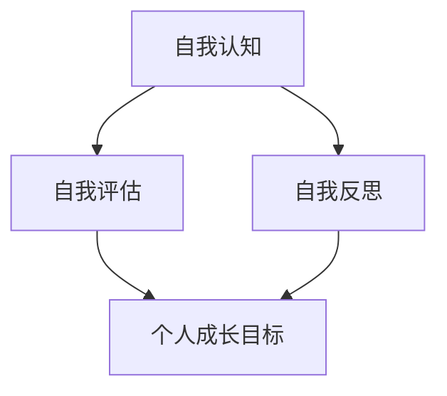

**问题解决**

自我认知的重要性在于它为个人的成长提供了方向。一个清晰的自我认知可以帮助我们：

1. **明确自己的优势和劣势**：了解自己的优点和不足，有助于我们在成长过程中更好地发挥优势，弥补不足。
2. **设定合理的目标**：根据自我认知，设定符合自己能力和兴趣的目标，有助于提高目标的实现率。
3. **调整心态**：自我认知有助于我们面对挑战时保持积极的心态，更好地应对压力。

**边界与外延**

自我认知不仅包括对个人能力的了解，还包括对个人性格、价值观等方面的认识。此外，自我认知是一个动态的过程，会随着时间和经历的变化而不断调整。

**概念结构与核心要素组成**

自我认知的核心要素包括：

1. **能力认知**：了解自己的专业技能、知识水平等。
2. **性格认知**：认识自己的性格特点，如内向、外向、敏感等。
3. **价值观认知**：明确自己的价值观和人生目标。

#### 1.1.2 自我评估的工具与方法

**背景介绍**

自我评估是自我认知的重要环节，通过评估可以更准确地了解自己的能力和不足。自我评估的工具和方法多种多样，包括问卷调查、能力测试、反思日志等。

**核心概念与联系**

| 工具和方法 | 功能 | 联系 |
| :----: | :----: | :----: |
| 问卷调查 | 收集数据 | 与能力测试、反思日志等工具联系紧密，共同构成全面的自我评估体系。 |
| 能力测试 | 量化能力 | 能力测试结果可以为自我认知提供客观数据支持。 |
| 反思日志 | 反思自我 | 通过反思日志，可以记录自己的成长过程，为未来的自我评估提供参考。 |

**ER实体关系图架构**

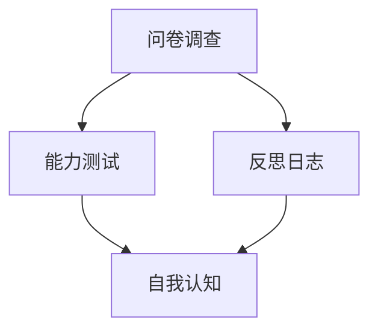

**问题解决**

自我评估的工具和方法各有优势，可以根据实际情况选择使用。以下是一些常用的自我评估方法：

1. **问卷调查**：通过设计问卷，收集被调查者的基本信息、能力水平等，可以快速了解被评估者的整体状况。
2. **能力测试**：通过专业的测试工具，量化评估被评估者的能力水平，提供客观的数据支持。
3. **反思日志**：通过记录自己的日常行为、思考过程等，反思自己的成长和不足，有助于深入理解自我。

**边界与外延**

自我评估不仅限于个人能力的评估，还包括性格、价值观等方面的评估。此外，自我评估是一个持续的过程，需要定期进行，以反映个人成长的变化。

**概念结构与核心要素组成**

自我评估的核心要素包括：

1. **能力评估**：评估个人的专业技能、知识水平等。
2. **性格评估**：评估个人的性格特点，如内向、外向等。
3. **价值观评估**：评估个人的价值观和人生目标。

#### 1.1.3 建立清晰的个人成长目标

**背景介绍**

个人成长目标是指个人在特定时间内希望达到的成就和状态。一个清晰的个人成长目标可以帮助我们明确方向，激发动力，提高执行力。

**核心概念与联系**

| 核心概念 | 概念属性 | 对比表格 |
| :----: | :----: | :----: |
| 个人成长目标 | 个人在特定时间内希望达到的成就和状态 | 与目标设定、目标分解等概念密切相关。 |

**ER实体关系图架构**

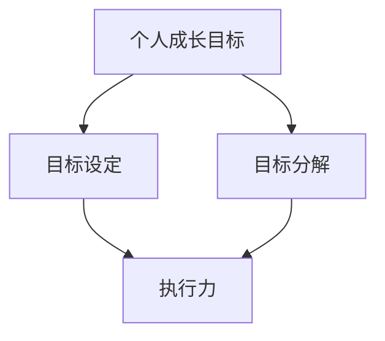

**问题解决**

建立清晰的个人成长目标需要遵循以下原则：

1. **明确性**：目标要具体、明确，避免模糊和抽象。
2. **可行性**：目标要具有可行性，既要有挑战性，又要有实现的可能性。
3. **时限性**：目标要有明确的时间限制，以激发执行动力。

以下是一些建立个人成长目标的方法：

1. **SMART原则**：目标要具备明确性、可行性、相关性、时限性和可衡量性。
2. **目标分解**：将大目标分解为若干个小目标，逐步实现。
3. **定期调整**：根据实际情况，定期调整目标，以适应个人成长的变化。

**边界与外延**

个人成长目标不仅限于职业领域，还包括生活、学习等多个方面。此外，个人成长目标是一个动态的过程，需要不断调整和优化。

**概念结构与核心要素组成**

个人成长目标的核心要素包括：

1. **明确性**：目标要具体、明确。
2. **可行性**：目标要具有可行性。
3. **时限性**：目标要有明确的时间限制。

### 第2章：挑战舒适区，激发成长动力

#### 2.1.1 舒适区的定义与影响

**背景介绍**

舒适区是指一个人在心理和生理上感到舒适和安心的环境。在舒适区内，人们往往会感到轻松、愉悦，但同时也可能缺乏挑战和刺激。长期停留在舒适区内，可能会导致个人成长停滞，无法实现自我超越。

**核心概念与联系**

| 核心概念 | 概念属性 | 对比表格 |
| :----: | :----: | :----: |
| 舒适区 | 一个人在心理和生理上感到舒适和安心的环境 | 与压力区、学习区等概念相对应。 |

**ER实体关系图架构**

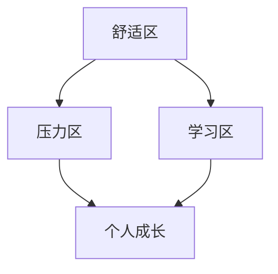

**问题解决**

舒适区的定义与影响可以从以下几个方面进行探讨：

1. **心理层面**：舒适区使人感到安心和放松，但同时也可能使人失去探索和挑战的欲望。
2. **生理层面**：舒适区使人保持身体和心理的舒适状态，但长期处于这种状态可能导致身体机能的退化。
3. **成长层面**：舒适区可能会限制个人的成长和发展，使人无法实现自我超越。

**边界与外延**

舒适区不仅存在于个人层面，也存在于团队、组织等集体层面。此外，舒适区是一个相对的概念，会因个人、环境等因素的变化而变化。

**概念结构与核心要素组成**

舒适区的核心要素包括：

1. **心理层面**：感到舒适和安心。
2. **生理层面**：保持身体和心理的舒适状态。
3. **成长层面**：限制个人成长和发展。

#### 2.1.2 挑战舒适区的策略与技巧

**背景介绍**

挑战舒适区是个人成长的重要一环，它能够激发人的潜能，推动个人突破自我。然而，挑战舒适区并非易事，需要一定的策略和技巧。

**核心概念与联系**

| 核心概念 | 概念属性 | 对比表格 |
| :----: | :----: | :----: |
| 挑战舒适区 | 推动个人突破自我 | 与自我超越、成长动力等概念密切相关。 |

**ER实体关系图架构**

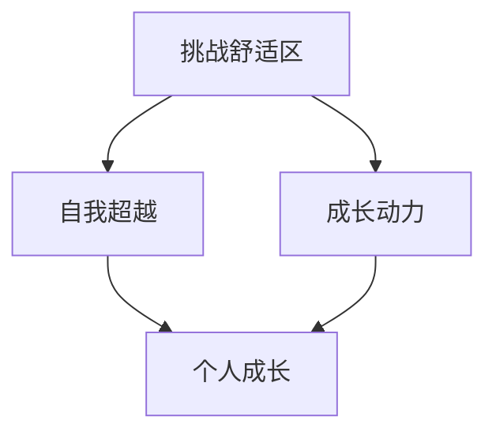

**问题解决**

挑战舒适区的策略与技巧可以从以下几个方面进行探讨：

1. **设定目标**：设定具有挑战性的目标，激发个人的动力和潜能。
2. **逐步推进**：将大目标分解为若干个小目标，逐步实现，避免一次性挑战过大。
3. **积极心态**：保持积极的心态，面对挑战和失败时，保持乐观和坚定。
4. **寻求支持**：寻求家人、朋友或专业人士的支持和帮助，共同面对挑战。

**边界与外延**

挑战舒适区的策略和技巧不仅适用于个人成长，也适用于团队和组织的发展。此外，挑战舒适区是一个持续的过程，需要不断地调整和优化策略。

**概念结构与核心要素组成**

挑战舒适区的核心要素包括：

1. **设定目标**：激发个人的动力和潜能。
2. **逐步推进**：避免一次性挑战过大。
3. **积极心态**：保持乐观和坚定。
4. **寻求支持**：共同面对挑战。

#### 2.1.3 挑战舒适区的心理调适

**背景介绍**

挑战舒适区是一个充满不确定性和压力的过程，可能会对个体的心理产生负面影响。因此，进行心理调适，保持良好的心态，对于成功挑战舒适区至关重要。

**核心概念与联系**

| 核心概念 | 概念属性 | 对比表格 |
| :----: | :----: | :----: |
| 心理调适 | 调整个体的心态，以应对挑战 | 与自我调节、情绪管理等概念密切相关。 |

**ER实体关系图架构**

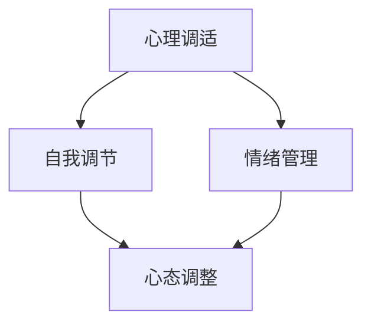

**问题解决**

挑战舒适区的心理调适可以从以下几个方面进行：

1. **接受挑战**：认识到挑战是成长的机会，接受挑战带来的不确定性和压力。
2. **积极思考**：从积极的角度看待挑战，将其视为提升自我的机会。
3. **情绪管理**：学会管理自己的情绪，避免因负面情绪而放弃挑战。
4. **寻求支持**：与家人、朋友或专业人士交流，获取心理支持和建议。

**边界与外延**

心理调适不仅适用于个人成长，也适用于团队和组织的发展。此外，心理调适是一个持续的过程，需要不断地调整和优化。

**概念结构与核心要素组成**

挑战舒适区的心理调适的核心要素包括：

1. **接受挑战**：认识到挑战是成长的机会。
2. **积极思考**：从积极的角度看待挑战。
3. **情绪管理**：学会管理自己的情绪。
4. **寻求支持**：与家人、朋友或专业人士交流。

### 第3章：设定目标，规划成长路径

#### 3.1.1 目标设定的原则与方法

**背景介绍**

目标设定是个人成长的关键环节，一个明确、合理的目标可以帮助我们更好地规划成长路径，激发动力，提高执行力。

**核心概念与联系**

| 核心概念 | 概念属性 | 对比表格 |
| :----: | :----: | :----: |
| 目标设定 | 个人在特定时间内希望达到的成就和状态 | 与个人成长目标、目标分解等概念密切相关。 |

**ER实体关系图架构**

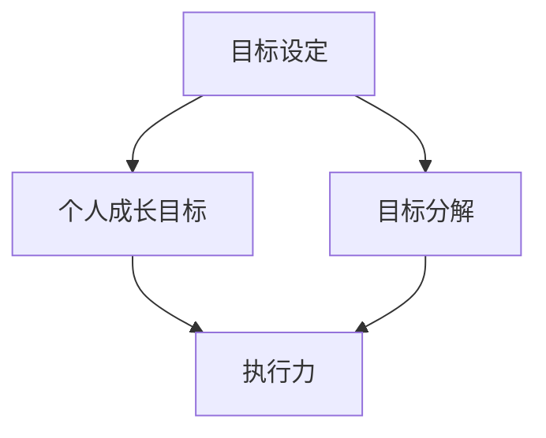

**问题解决**

目标设定的原则与方法可以从以下几个方面进行：

1. **SMART原则**：目标要具备明确性、可行性、相关性、时限性和可衡量性。
2. **目标分解**：将大目标分解为若干个小目标，逐步实现。
3. **定期调整**：根据实际情况，定期调整目标，以适应个人成长的变化。
4. **设定优先级**：将目标按照重要性和紧急性进行排序，优先实现重要且紧急的目标。

**边界与外延**

目标设定不仅适用于个人成长，也适用于团队和组织的发展。此外，目标设定是一个动态的过程，需要不断地调整和优化。

**概念结构与核心要素组成**

目标设定的核心要素包括：

1. **SMART原则**：明确性、可行性、相关性、时限性和可衡量性。
2. **目标分解**：将大目标分解为若干个小目标。
3. **定期调整**：根据实际情况调整目标。
4. **设定优先级**：按照重要性和紧急性排序。

#### 3.1.2 目标分解与时间管理

**背景介绍**

目标分解是将大目标拆分为若干个小目标，有助于我们更好地实现目标，提高执行力。时间管理则是确保我们在有限的时间内，高效地完成目标。

**核心概念与联系**

| 核心概念 | 概念属性 | 对比表格 |
| :----: | :----: | :----: |
| 目标分解 | 将大目标拆分为若干个小目标 | 与目标设定、时间管理等概念密切相关。 |
| 时间管理 | 高效地利用时间，完成目标 | 与目标分解、优先级设定等概念密切相关。 |

**ER实体关系图架构**

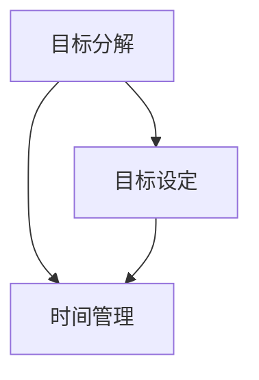

**问题解决**

目标分解与时间管理的方法可以从以下几个方面进行：

1. **SMART原则**：确保目标分解符合SMART原则，明确、可行、相关、时限和可衡量。
2. **时间分配**：将时间合理分配给各个目标，确保每个目标都能得到充分的时间和资源。
3. **优先级设定**：根据目标的重要性和紧急性，设定优先级，确保优先完成重要且紧急的目标。
4. **定期复盘**：定期对目标完成情况进行复盘，及时调整时间分配和优先级。

**边界与外延**

目标分解与时间管理不仅适用于个人成长，也适用于团队和组织的发展。此外，目标分解与时间管理是一个持续的过程，需要不断地调整和优化。

**概念结构与核心要素组成**

目标分解与时间管理的核心要素包括：

1. **SMART原则**：明确性、可行性、相关性、时限性和可衡量性。
2. **时间分配**：合理分配时间。
3. **优先级设定**：设定优先级。
4. **定期复盘**：定期调整。

#### 3.1.3 制定个人成长计划

**背景介绍**

个人成长计划是指个人为实现目标而制定的详细计划，包括具体的目标、实施步骤、时间安排等。一个合理的个人成长计划可以帮助我们更好地实现目标，提高执行力。

**核心概念与联系**

| 核心概念 | 概念属性 | 对比表格 |
| :----: | :----: | :----: |
| 个人成长计划 | 实现目标的详细计划 | 与目标设定、目标分解、时间管理等概念密切相关。 |

**ER实体关系图架构**

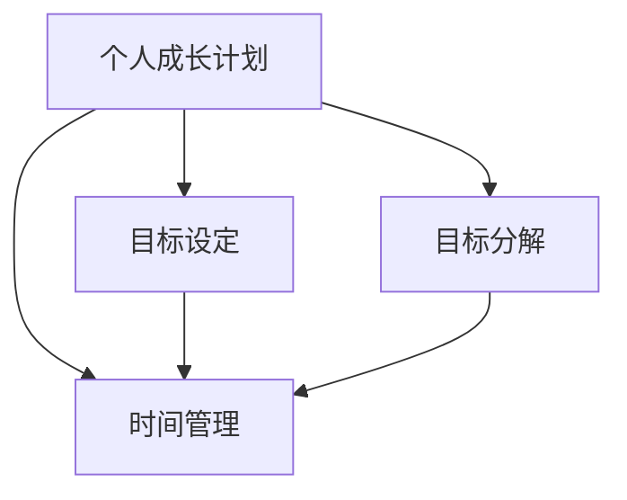

**问题解决**

制定个人成长计划的方法可以从以下几个方面进行：

1. **明确目标**：首先明确个人成长的目标，确保目标符合SMART原则。
2. **分解目标**：将大目标分解为若干个小目标，确保每个小目标都有具体的实施步骤和时间安排。
3. **时间规划**：根据目标的重要性和紧急性，合理规划时间，确保每个目标都能得到充分的时间和资源。
4. **执行与监控**：按照计划执行，并定期监控目标的完成情况，及时调整计划。

**边界与外延**

个人成长计划不仅适用于个人成长，也适用于团队和组织的发展。此外，个人成长计划是一个动态的过程，需要不断地调整和优化。

**概念结构与核心要素组成**

个人成长计划的核心要素包括：

1. **明确目标**：确保目标符合SMART原则。
2. **分解目标**：将大目标分解为若干个小目标。
3. **时间规划**：合理规划时间。
4. **执行与监控**：按照计划执行，并定期监控目标的完成情况。

### 第4章：培养自律，实现自我超越

#### 4.1.1 自律的重要性

**背景介绍**

自律是指个体自我控制、自我管理的能力。在个人成长过程中，自律起着至关重要的作用。一个自律的人，能够更好地控制自己的行为和情绪，实现自我超越。

**核心概念与联系**

| 核心概念 | 概念属性 | 对比表格 |
| :----: | :----: | :----: |
| 自律 | 个体自我控制、自我管理的能力 | 与自我管理、自我调节等概念密切相关。 |

**ER实体关系图架构**

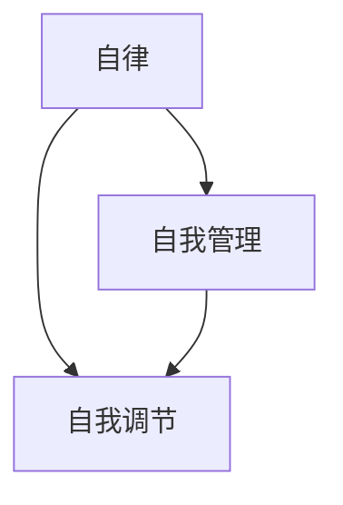

**问题解决**

自律的重要性可以从以下几个方面进行阐述：

1. **提高执行力**：自律使人能够更好地控制自己的行为，按照计划执行，提高执行力。
2. **培养自控力**：自律有助于培养个体的自控力，使人能够更好地应对各种诱惑和挑战。
3. **促进个人成长**：自律是个人成长的基石，能够帮助个体克服困难，实现自我超越。

**边界与外延**

自律不仅适用于个人成长，也适用于团队和组织的发展。此外，自律是一个动态的过程，需要不断地培养和强化。

**概念结构与核心要素组成**

自律的核心要素包括：

1. **提高执行力**：按照计划执行，提高执行力。
2. **培养自控力**：培养个体的自控力。
3. **促进个人成长**：克服困难，实现自我超越。

#### 4.1.2 培养自律的方法与技巧

**背景介绍**

培养自律是一项长期的任务，需要个体的持续努力和正确的方法。以下是一些有效的培养自律的方法与技巧：

**核心概念与联系**

| 核心概念 | 概念属性 | 对比表格 |
| :----: | :----: | :----: |
| 培养自律的方法与技巧 | 帮助个体培养自律的能力 | 与自律、自我管理、自我调节等概念密切相关。 |

**ER实体关系图架构**

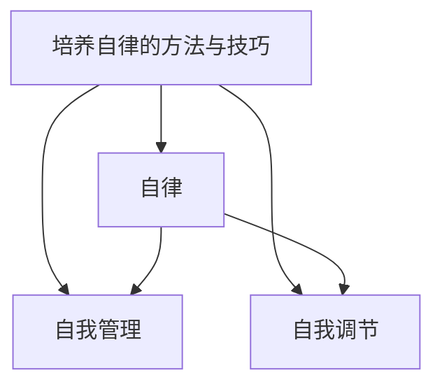

**问题解决**

以下是一些有效的培养自律的方法与技巧：

1. **设定明确的目标**：明确的目标可以帮助个体更好地集中注意力和精力，培养自律。
2. **建立规律的生活习惯**：通过建立规律的生活习惯，如早起、按时作息、按时完成任务等，可以培养自律。
3. **自我激励**：通过自我激励，如给自己设定奖励或惩罚，可以增强自律。
4. **反思与调整**：定期反思自己的行为和习惯，根据实际情况进行调整，可以持续培养自律。

**边界与外延**

培养自律的方法与技巧不仅适用于个人成长，也适用于团队和组织的发展。此外，培养自律是一个动态的过程，需要不断地调整和优化。

**概念结构与核心要素组成**

培养自律的核心要素包括：

1. **设定明确的目标**：明确的目标。
2. **建立规律的生活习惯**：规律的生活习惯。
3. **自我激励**：自我激励。
4. **反思与调整**：反思与调整。

### 第5章：调整心态，迎接成长挑战

#### 5.1.1 成长过程中的心态调整

**背景介绍**

在个人成长过程中，心态调整至关重要。一个积极的心态可以帮助我们更好地应对挑战，克服困难，实现自我超越。

**核心概念与联系**

| 核心概念 | 概念属性 | 对比表格 |
| :----: | :----: | :----: |
| 心态调整 | 调整个体的心态，以更好地应对成长过程中的挑战 | 与自我调节、情绪管理、心态建设等概念密切相关。 |

**ER实体关系图架构**

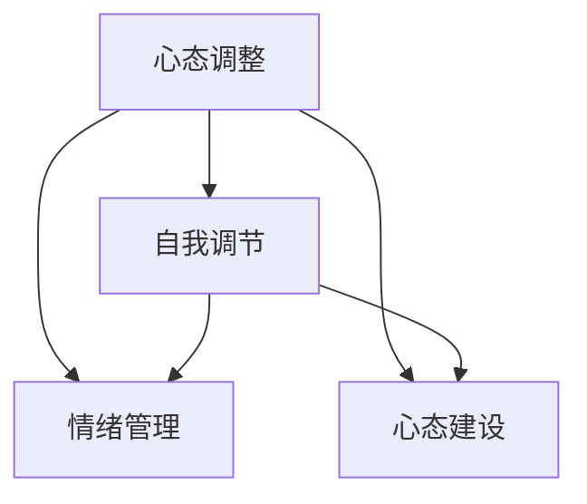

**问题解决**

心态调整可以从以下几个方面进行：

1. **正视挑战**：认识到成长过程中的挑战是正常的，是个人成长的一部分。
2. **保持乐观**：保持积极乐观的心态，相信自己的能力，相信未来会更好。
3. **学会放松**：适当的放松和休息，可以帮助个体更好地调整心态，应对挑战。
4. **寻求支持**：与家人、朋友或专业人士交流，寻求心理支持和建议。

**边界与外延**

心态调整不仅适用于个人成长，也适用于团队和组织的发展。此外，心态调整是一个动态的过程，需要不断地调整和优化。

**概念结构与核心要素组成**

心态调整的核心要素包括：

1. **正视挑战**：认识到挑战是正常的。
2. **保持乐观**：保持积极乐观的心态。
3. **学会放松**：适当的放松和休息。
4. **寻求支持**：寻求心理支持和建议。

#### 5.1.2 面对失败的积极态度

**背景介绍**

在成长过程中，失败是不可避免的。一个积极的态度可以帮助我们更好地面对失败，从失败中汲取经验，实现自我超越。

**核心概念与联系**

| 核心概念 | 概念属性 | 对比表格 |
| :----: | :----: | :----: |
| 面对失败的积极态度 | 以积极的心态面对失败，从失败中学习和成长 | 与心态调整、情绪管理、挫折应对等概念密切相关。 |

**ER实体关系图架构**

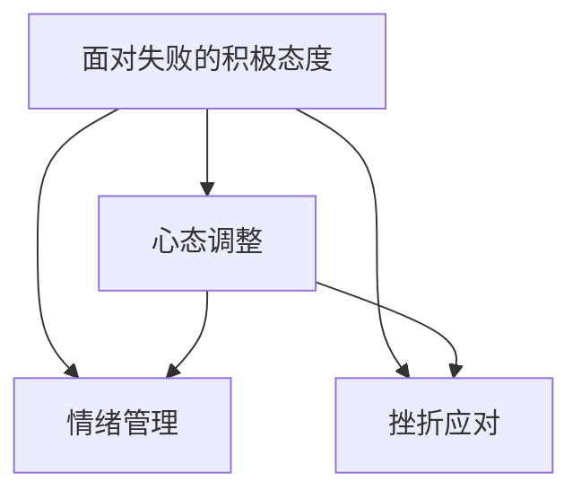

**问题解决**

以下是一些面对失败的积极态度的方法：

1. **接受失败**：认识到失败是成长的一部分，接受失败，不因此自卑或沮丧。
2. **分析原因**：从失败中找出原因，分析失败的原因，找出改进的方向。
3. **积极反思**：反思失败的过程，总结经验教训，为未来的成功做好准备。
4. **持续努力**：保持积极的心态，持续努力，相信自己能够从失败中走出来。

**边界与外延**

面对失败的积极态度不仅适用于个人成长，也适用于团队和组织的发展。此外，面对失败的积极态度是一个动态的过程，需要不断地调整和优化。

**概念结构与核心要素组成**

面对失败的积极态度的核心要素包括：

1. **接受失败**：接受失败，不因此自卑或沮丧。
2. **分析原因**：分析失败的原因。
3. **积极反思**：反思失败的过程。
4. **持续努力**：持续努力，相信自己能够从失败中走出来。

#### 5.1.3 建立良好的心态循环

**背景介绍**

建立良好的心态循环是指通过持续的心态调整，使心态保持在一个积极、健康的循环中，从而更好地应对成长过程中的挑战。

**核心概念与联系**

| 核心概念 | 概念属性 | 对比表格 |
| :----: | :----: | :----: |
| 建立良好的心态循环 | 通过持续的心态调整，使心态保持在一个积极、健康的循环中 | 与心态调整、情绪管理、心态建设等概念密切相关。 |

**ER实体关系图架构**


**问题解决**

建立良好的心态循环可以从以下几个方面进行：

1. **定期复盘**：定期对自己的心态进行调整和复盘，找出问题，及时调整。
2. **积极心态**：保持积极的心态，相信自己的能力，相信自己能够克服困难。
3. **心态建设**：通过阅读、学习、交流等方式，加强心态建设，提高心理韧性。
4. **寻求支持**：与家人、朋友或专业人士交流，寻求心理支持和建议。

**边界与外延**

建立良好的心态循环不仅适用于个人成长，也适用于团队和组织的发展。此外，建立良好的心态循环是一个动态的过程，需要不断地调整和优化。

**概念结构与核心要素组成**

建立良好的心态循环的核心要素包括：

1. **定期复盘**：定期对自己的心态进行调整和复盘。
2. **积极心态**：保持积极的心态。
3. **心态建设**：通过阅读、学习、交流等方式，加强心态建设。
4. **寻求支持**：与家人、朋友或专业人士交流，寻求心理支持和建议。

### 第二部分：实践与行动

#### 第6章：行动策略，实现自我超越

#### 6.1.1 行动计划的制定与执行

**背景介绍**

行动计划是指为实现目标而制定的详细计划，包括具体的行动步骤、时间安排、资源分配等。一个有效的行动计划可以帮助我们更好地实现目标，提高执行力。

**核心概念与联系**

| 核心概念 | 概念属性 | 对比表格 |
| :----: | :----: | :----: |
| 行动计划 | 为实现目标而制定的详细计划 | 与目标设定、目标分解、时间管理等概念密切相关。 |

**ER实体关系图架构**

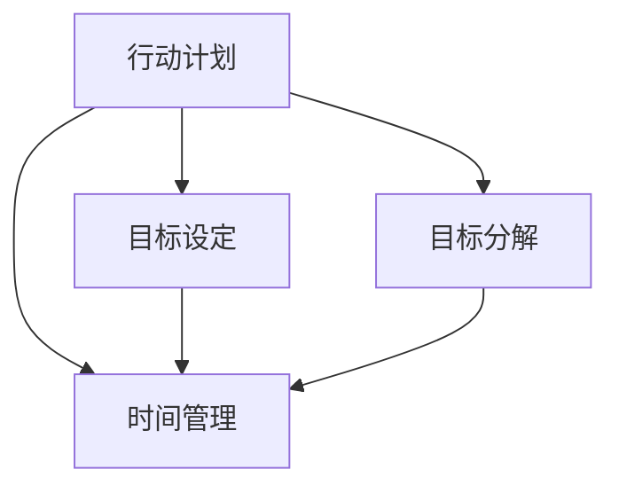

**问题解决**

行动计划制定与执行的方法如下：

1. **明确目标**：首先明确目标，确保目标符合SMART原则。
2. **分解目标**：将大目标分解为若干个小目标，确保每个小目标都有具体的行动步骤。
3. **制定计划**：根据目标分解，制定详细的行动计划，包括具体的行动步骤、时间安排、资源分配等。
4. **执行与监控**：按照行动计划执行，并定期监控目标的完成情况，及时调整计划。

**边界与外延**

行动计划制定与执行不仅适用于个人成长，也适用于团队和组织的发展。此外，行动计划是一个动态的过程，需要不断地调整和优化。

**概念结构与核心要素组成**

行动计划的核心要素包括：

1. **明确目标**：确保目标符合SMART原则。
2. **分解目标**：将大目标分解为若干个小目标。
3. **制定计划**：制定详细的行动计划。
4. **执行与监控**：按照行动计划执行，并定期监控目标的完成情况。

#### 6.1.2 跨越障碍，克服拖延

**背景介绍**

在实现自我超越的过程中，我们可能会遇到各种障碍，如技能不足、资源匮乏、环境限制等。同时，拖延也是实现目标的一大障碍。如何有效跨越障碍，克服拖延，是个人成长的关键。

**核心概念与联系**

| 核心概念 | 概念属性 | 对比表格 |
| :----: | :----: | :----: |
| 跨越障碍，克服拖延 | 在实现自我超越过程中，克服各种障碍和拖延行为 | 与目标设定、执行力、时间管理等概念密切相关。 |

**ER实体关系图架构**

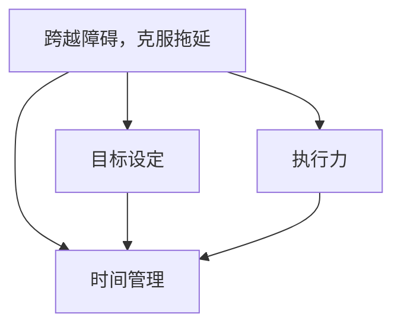

**问题解决**

以下是一些跨越障碍，克服拖延的方法：

1. **明确目标**：设定明确的目标，确保目标具有可行性，激发动力。
2. **分解任务**：将大任务分解为若干个小任务，逐步实现，避免一次性压力过大。
3. **设定截止日期**：为每个任务设定明确的截止日期，增强紧迫感，避免拖延。
4. **建立奖励机制**：设定奖励机制，激励自己完成任务。
5. **避免干扰**：创建一个有利于工作的环境，避免各种干扰，提高工作效率。

**边界与外延**

跨越障碍，克服拖延不仅适用于个人成长，也适用于团队和组织的发展。此外，这是一个持续的过程，需要不断地调整和优化策略。

**概念结构与核心要素组成**

跨越障碍，克服拖延的核心要素包括：

1. **明确目标**：设定明确的目标。
2. **分解任务**：将大任务分解为若干个小任务。
3. **设定截止日期**：为每个任务设定明确的截止日期。
4. **建立奖励机制**：设定奖励机制。
5. **避免干扰**：创建有利于工作的环境。

#### 6.1.3 增强行动力的技巧

**背景介绍**

行动力是指个体为实现目标而采取行动的能力。一个高行动力的人，能够更好地实现目标，实现自我超越。因此，如何增强行动力，成为个人成长的重要课题。

**核心概念与联系**

| 核心概念 | 概念属性 | 对比表格 |
| :----: | :----: | :----: |
| 增强行动力的技巧 | 提高个体实现目标的行动能力 | 与执行力、自我管理、自我激励等概念密切相关。 |

**ER实体关系图架构**

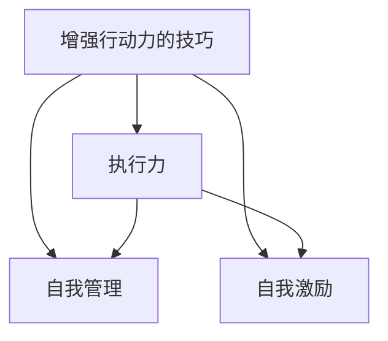

**问题解决**

以下是一些增强行动力的技巧：

1. **设定明确的目标**：明确的目标可以激发行动力，提供动力。
2. **制定行动计划**：制定详细的行动计划，明确每个阶段的任务，增强执行力。
3. **建立奖励机制**：设定奖励机制，激励自己完成任务。
4. **避免干扰**：创建一个有利于工作的环境，避免各种干扰。
5. **培养自律**：通过自律，提高自我管理能力，增强行动力。

**边界与外延**

增强行动力的技巧不仅适用于个人成长，也适用于团队和组织的发展。此外，这是一个持续的过程，需要不断地调整和优化策略。

**概念结构与核心要素组成**

增强行动力的核心要素包括：

1. **设定明确的目标**：明确的目标。
2. **制定行动计划**：制定详细的行动计划。
3. **建立奖励机制**：设定奖励机制。
4. **避免干扰**：创建有利于工作的环境。
5. **培养自律**：通过自律，提高自我管理能力。

### 第7章：复盘与总结，持续成长

#### 7.1.1 复盘的意义与方法

**背景介绍**

复盘是一种有效的学习和成长方法，它通过回顾过去的行为和经历，总结经验教训，从而不断提高自己的能力。复盘不仅适用于个人成长，也广泛应用于团队和组织的发展。

**核心概念与联系**

| 核心概念 | 概念属性 | 对比表格 |
| :----: | :----: | :----: |
| 复盘 | 通过回顾过去的行为和经历，总结经验教训，从而不断提高自己的能力 | 与反思、总结、学习等概念密切相关。 |

**ER实体关系图架构**

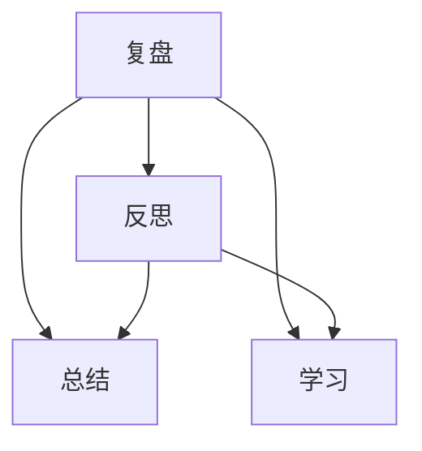

**问题解决**

复盘的意义与方法可以从以下几个方面进行：

1. **总结经验教训**：复盘可以帮助我们回顾过去的行为和经历，总结经验教训，从而避免重复错误。
2. **提高学习能力**：通过复盘，我们可以从他人的成功和失败中学习，提高自己的学习能力。
3. **优化决策过程**：复盘可以帮助我们审视过去的决策过程，找出问题，优化决策方法。
4. **持续改进**：复盘是一种持续改进的过程，可以帮助我们不断调整和优化自己的行为和决策。

**边界与外延**

复盘不仅适用于个人成长，也广泛应用于团队和组织的发展。此外，复盘是一个持续的过程，需要不断地进行和优化。

**概念结构与核心要素组成**

复盘的核心要素包括：

1. **总结经验教训**：总结经验教训。
2. **提高学习能力**：提高学习能力。
3. **优化决策过程**：优化决策过程。
4. **持续改进**：持续改进。

#### 7.1.2 从经验中学习，持续改进

**背景介绍**

从经验中学习是一种有效的成长方法，它通过总结过去的经验教训，不断改进自己的行为和决策，从而实现自我超越。持续改进是个人成长的重要环节，可以帮助我们不断提高自己的能力和素质。

**核心概念与联系**

| 核心概念 | 概念属性 | 对比表格 |
| :----: | :----: | :----: |
| 从经验中学习，持续改进 | 通过总结过去的经验教训，不断改进自己的行为和决策 | 与复盘、学习、成长等概念密切相关。 |

**ER实体关系图架构**

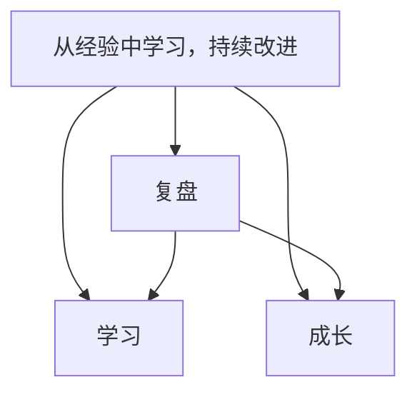

**问题解决**

以下是一些从经验中学习，持续改进的方法：

1. **定期复盘**：定期对自己的行为和决策进行复盘，总结经验教训，找出问题，及时改进。
2. **反思与总结**：在经历和遇到问题时，进行反思和总结，从错误中学习，避免重复错误。
3. **持续学习**：不断学习新的知识和技能，提升自己的能力，为持续改进提供支持。
4. **建立反馈机制**：建立有效的反馈机制，如自我评估、同事评估等，收集反馈意见，持续改进。

**边界与外延**

从经验中学习，持续改进不仅适用于个人成长，也广泛应用于团队和组织的发展。此外，这是一个持续的过程，需要不断地进行和优化。

**概念结构与核心要素组成**

从经验中学习，持续改进的核心要素包括：

1. **定期复盘**：定期对自己的行为和决策进行复盘。
2. **反思与总结**：在经历和遇到问题时，进行反思和总结。
3. **持续学习**：不断学习新的知识和技能。
4. **建立反馈机制**：建立有效的反馈机制。

#### 7.1.3 建立个人成长日志

**背景介绍**

个人成长日志是一种记录个人成长过程的方法，通过记录自己的行为、想法、经历等，可以清晰地看到自己的成长轨迹，为未来的成长提供参考。建立个人成长日志，可以帮助我们更好地管理自己的成长过程。

**核心概念与联系**

| 核心概念 | 概念属性 | 对比表格 |
| :----: | :----: | :----: |
| 建立个人成长日志 | 记录个人成长过程，为未来的成长提供参考 | 与个人成长日志、行为记录、自我反思等概念密切相关。 |

**ER实体关系图架构**

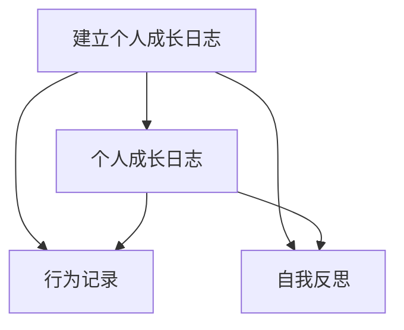

**问题解决**

以下是一些建立个人成长日志的方法：

1. **定期记录**：定期记录自己的行为、想法、经历等，保持持续性和连贯性。
2. **详细描述**：对记录的内容进行详细描述，包括时间、地点、事件、感受等，以便于后期回顾和分析。
3. **分类整理**：将记录的内容进行分类整理，便于查找和回顾。
4. **定期复盘**：定期对自己的成长日志进行复盘，总结经验教训，找出问题，及时调整。

**边界与外延**

建立个人成长日志不仅适用于个人成长，也适用于团队和组织的发展。此外，这是一个持续的过程，需要不断地进行和优化。

**概念结构与核心要素组成**

建立个人成长日志的核心要素包括：

1. **定期记录**：定期记录自己的行为、想法、经历等。
2. **详细描述**：对记录的内容进行详细描述。
3. **分类整理**：将记录的内容进行分类整理。
4. **定期复盘**：定期对自己的成长日志进行复盘。

### 第8章：自我超越，成就卓越人生

#### 8.1.1 自我超越的意义与价值

**背景介绍**

自我超越是指个体通过不断地突破自我，实现更高的成长和发展。自我超越的意义与价值在于，它能够帮助我们实现自我价值，成就卓越人生。

**核心概念与联系**

| 核心概念 | 概念属性 | 对比表格 |
| :----: | :----: | :----: |
| 自我超越 | 通过不断地突破自我，实现更高的成长和发展 | 与个人成长、自我实现、卓越人生等概念密切相关。 |

**ER实体关系图架构**

```mermaid
graph TD
A[自我超越] --> B[个人成长]
A --> C[自我实现]
A --> D[卓越人生]
B --> C
B --> D
```

**问题解决**

自我超越的意义与价值可以从以下几个方面进行：

1. **实现自我价值**：自我超越可以帮助我们找到自己的定位，实现自我价值，成就卓越人生。
2. **提高竞争力**：通过自我超越，我们能够不断提升自己的能力和素质，提高竞争力。
3. **培养自信心**：自我超越可以增强个体的自信心，使其更加自信地面对挑战和困难。
4. **推动社会进步**：自我超越不仅有助于个人的成长，也能够推动社会的进步和发展。

**边界与外延**

自我超越不仅适用于个人成长，也适用于团队和组织的发展。此外，自我超越是一个持续的过程，需要不断地进行和优化。

**概念结构与核心要素组成**

自我超越的核心要素包括：

1. **实现自我价值**：实现自我价值。
2. **提高竞争力**：提高竞争力。
3. **培养自信心**：培养自信心。
4. **推动社会进步**：推动社会进步。

#### 8.1.2 卓越人生的定义与追求

**背景介绍**

卓越人生是指个体在各个方面都达到卓越水平，实现自我价值，为社会做出贡献的人生。追求卓越人生是每个人的梦想，但如何定义和追求卓越人生，是每个人都需要思考的问题。

**核心概念与联系**

| 核心概念 | 概念属性 | 对比表格 |
| :----: | :----: | :----: |
| 卓越人生 | 在各个方面都达到卓越水平，实现自我价值，为社会做出贡献的人生 | 与人生目标、自我实现、价值追求等概念密切相关。 |

**ER实体关系图架构**

```mermaid
graph TD
A[卓越人生] --> B[人生目标]
A --> C[自我实现]
A --> D[价值追求]
B --> C
B --> D
```

**问题解决**

以下是一些关于卓越人生的定义与追求：

1. **明确人生目标**：首先明确自己的人生目标，确保目标符合自己的价值观和兴趣。
2. **持续自我超越**：通过不断地自我超越，实现自我价值的提升。
3. **全面发展**：在各个方面都追求卓越，包括知识、技能、情感、心理等。
4. **积极贡献**：为社会做出积极的贡献，实现人生的价值。

**边界与外延**

卓越人生的定义与追求不仅适用于个人成长，也适用于团队和组织的发展。此外，这是一个持续的过程，需要不断地进行和优化。

**概念结构与核心要素组成**

卓越人生的定义与追求的核心要素包括：

1. **明确人生目标**：明确的人生目标。
2. **持续自我超越**：持续自我超越。
3. **全面发展**：全面发展。
4. **积极贡献**：积极贡献。

#### 8.1.3 自我超越的持续动力

**背景介绍**

自我超越是一个持续的过程，需要个体的持续努力和动力。自我超越的持续动力来源于个体的内在驱动力，如自我实现、成就感、价值观等。

**核心概念与联系**

| 核心概念 | 概念属性 | 对比表格 |
| :----: | :----: | :----: |
| 自我超越的持续动力 | 个体持续自我超越的内在驱动力 | 与自我实现、成就感、价值观等概念密切相关。 |

**ER实体关系图架构**

```mermaid
graph TD
A[自我超越的持续动力] --> B[自我实现]
A --> C[成就感]
A --> D[价值观]
B --> C
B --> D
```

**问题解决**

以下是一些关于自我超越的持续动力：

1. **自我实现**：通过实现自我价值，获得满足感和成就感，激发自我超越的动力。
2. **成就感**：通过设定目标，实现目标，获得成就感，增强自我超越的动力。
3. **价值观**：通过明确自己的价值观，坚定自己的信念，为自我超越提供动力。
4. **持续学习**：通过不断学习，提升自己的能力和知识，为自我超越提供动力。

**边界与外延**

自我超越的持续动力不仅适用于个人成长，也适用于团队和组织的发展。此外，这是一个持续的过程，需要不断地进行和优化。

**概念结构与核心要素组成**

自我超越的持续动力的核心要素包括：

1. **自我实现**：实现自我价值。
2. **成就感**：获得成就感。
3. **价值观**：明确自己的价值观。
4. **持续学习**：不断学习提升自己的能力和知识。

### 第9章：案例研究与最佳实践

#### 9.1.1 成功案例解析

**背景介绍**

成功案例解析是通过分析成功人士的经历和经验，提炼出成功的关键要素和方法，为读者提供有益的启示和借鉴。成功案例不仅有助于我们了解成功的路径，还能帮助我们找到适合自己的成长方法。

**核心概念与联系**

| 核心概念 | 概念属性 | 对比表格 |
| :----: | :----: | :----: |
| 成功案例解析 | 分析成功人士的经历和经验，提炼成功要素和方法 | 与案例分析、经验学习、成功路径等概念密切相关。 |

**ER实体关系图架构**

```mermaid
graph TD
A[成功案例解析] --> B[案例分析]
A --> C[经验学习]
A --> D[成功路径]
B --> C
B --> D
```

**问题解决**

以下是一些成功案例解析的方法：

1. **筛选成功案例**：从众多案例中筛选出具有代表性的成功案例，确保案例具有普遍性和借鉴意义。
2. **深入分析**：对成功案例进行深入分析，挖掘成功的关键要素和方法。
3. **提炼要点**：从分析结果中提炼出关键要点，为读者提供实用的经验和建议。
4. **对比反思**：将成功案例与自己的实际情况进行对比，反思自己的成长路径和方法。

**边界与外延**

成功案例解析不仅适用于个人成长，也适用于团队和组织的发展。此外，成功案例解析是一个持续的过程，需要不断地进行和优化。

**概念结构与核心要素组成**

成功案例解析的核心要素包括：

1. **筛选成功案例**：从众多案例中筛选出具有代表性的成功案例。
2. **深入分析**：对成功案例进行深入分析。
3. **提炼要点**：从分析结果中提炼出关键要点。
4. **对比反思**：将成功案例与自己的实际情况进行对比。

#### 9.1.2 最佳实践分享

**背景介绍**

最佳实践分享是指将实践中积累的经验和成果分享出来，为其他读者提供有益的参考和借鉴。最佳实践分享不仅有助于传播知识，还能促进共同成长。

**核心概念与联系**

| 核心概念 | 概念属性 | 对比表格 |
| :----: | :----: | :----: |
| 最佳实践分享 | 分享实践中积累的经验和成果 | 与经验分享、知识传播、共同成长等概念密切相关。 |

**ER实体关系图架构**

```mermaid
graph TD
A[最佳实践分享] --> B[经验分享]
A --> C[知识传播]
A --> D[共同成长]
B --> C
B --> D
```

**问题解决**

以下是一些最佳实践分享的方法：

1. **总结经验**：从实践中总结出有价值的方法和经验，确保经验具有实用性和可操作性。
2. **分享成果**：将实践经验分享出来，通过文字、图片、视频等多种形式进行传播。
3. **互动交流**：与其他读者进行互动交流，收集反馈意见，不断优化分享的内容和质量。
4. **持续更新**：随着实践的不断深入，不断更新分享的内容，确保分享的实践成果保持时效性和实用性。

**边界与外延**

最佳实践分享不仅适用于个人成长，也适用于团队和组织的发展。此外，最佳实践分享是一个持续的过程，需要不断地进行和优化。

**概念结构与核心要素组成**

最佳实践分享的核心要素包括：

1. **总结经验**：从实践中总结出有价值的方法和经验。
2. **分享成果**：将实践经验分享出来。
3. **互动交流**：与其他读者进行互动交流。
4. **持续更新**：随着实践的不断深入，不断更新分享的内容。

#### 9.1.3 个人成长案例

**背景介绍**

个人成长案例是指个人在成长过程中的经历和故事，通过分享个人成长案例，可以帮助其他读者了解成长过程中的困难和挑战，以及应对策略和方法。

**核心概念与联系**

| 核心概念 | 概念属性 | 对比表格 |
| :----: | :----: | :----: |
| 个人成长案例 | 分享个人在成长过程中的经历和故事 | 与个人经历、成长故事、困难应对等概念密切相关。 |

**ER实体关系图架构**

```mermaid
graph TD
A[个人成长案例] --> B[个人经历]
A --> C[成长故事]
A --> D[困难应对]
B --> C
B --> D
```

**问题解决**

以下是一些个人成长案例的方法：

1. **真实分享**：分享真实、具体的个人成长经历，确保案例具有可信度和可借鉴性。
2. **详细描述**：对案例进行详细描述，包括时间、地点、事件、感受等，使案例更加生动和具体。
3. **总结经验**：从案例中总结出有益的经验和教训，为其他读者提供参考。
4. **启发思考**：通过案例，启发读者思考自己的成长过程，找到适合自己的成长方法。

**边界与外延**

个人成长案例不仅适用于个人成长，也适用于团队和组织的发展。此外，个人成长案例是一个持续的过程，需要不断地进行和优化。

**概念结构与核心要素组成**

个人成长案例的核心要素包括：

1. **真实分享**：分享真实、具体的个人成长经历。
2. **详细描述**：对案例进行详细描述。
3. **总结经验**：从案例中总结出有益的经验和教训。
4. **启发思考**：启发读者思考自己的成长过程。

### 第10章：总结与展望

#### 10.1.1 书籍总结

**背景介绍**

《自我超越：突破舒适区的成长之路》旨在探讨如何通过突破舒适区来实现自我超越，提供了一系列有针对性的方法和技术，帮助读者在个人成长的道路上不断前行。

**核心概念与联系**

| 核心概念 | 概念属性 | 对比表格 |
| :----: | :----: | :----: |
| 书籍总结 | 对《自我超越：突破舒适区的成长之路》的核心内容和主题思想的总结 | 与个人成长、自我超越、方法技术等概念密切相关。 |

**ER实体关系图架构**

```mermaid
graph TD
A[书籍总结] --> B[个人成长]
A --> C[自我超越]
A --> D[方法技术]
B --> C
B --> D
```

**问题解决**

以下是书籍总结的内容：

1. **核心内容**：本书主要探讨了如何通过突破舒适区来实现自我超越，包括自我认知、目标设定、行动策略、心态调整等多个方面。
2. **主题思想**：书籍的核心思想是鼓励读者在个人成长的道路上不断前行，通过自我认知、目标设定、行动策略等，实现自我超越。
3. **方法技术**：本书提供了一系列实用的方法和技术，如自我评估、目标分解、时间管理、心态调整等，帮助读者在实际生活中应用所学。

**边界与外延**

书籍总结不仅适用于《自我超越：突破舒适区的成长之路》，也适用于其他个人成长类书籍。此外，书籍总结是一个动态的过程，需要不断地进行和优化。

**概念结构与核心要素组成**

书籍总结的核心要素包括：

1. **核心内容**：探讨如何通过突破舒适区来实现自我超越。
2. **主题思想**：鼓励读者在个人成长的道路上不断前行。
3. **方法技术**：提供实用的方法和技术。

#### 10.1.2 成长之路的展望

**背景介绍**

成长之路是一个持续的过程，每个人的成长路径都是独特的。在成长过程中，我们需要不断调整和优化自己的方法和策略，以适应不断变化的环境和挑战。

**核心概念与联系**

| 核心概念 | 概念属性 | 对比表格 |
| :----: | :----: | :----: |
| 成长之路的展望 | 对个人成长路径的展望和规划 | 与个人成长、成长路径、未来规划等概念密切相关。 |

**ER实体关系图架构**

```mermaid
graph TD
A[成长之路的展望] --> B[个人成长]
A --> C[成长路径]
A --> D[未来规划]
B --> C
B --> D
```

**问题解决**

以下是成长之路的展望的内容：

1. **持续学习**：在成长过程中，持续学习是必不可少的。通过不断学习新的知识和技能，我们能够不断提高自己的能力，适应不断变化的环境。
2. **自我超越**：自我超越是成长的核心目标。通过不断地突破自我，我们能够实现更高的成长和发展，成就卓越人生。
3. **规划未来**：在成长过程中，我们需要对自己的未来进行规划，设定短期和长期的目标，制定详细的行动计划，以确保我们的成长路径清晰、有序。

**边界与外延**

成长之路的展望不仅适用于个人成长，也适用于团队和组织的发展。此外，成长之路的展望是一个动态的过程，需要不断地进行和优化。

**概念结构与核心要素组成**

成长之路的展望的核心要素包括：

1. **持续学习**：持续学习。
2. **自我超越**：自我超越。
3. **规划未来**：规划未来。

#### 10.1.3 拓展阅读与思考

**背景介绍**

拓展阅读与思考是个人成长的重要环节，它能够帮助读者拓宽视野，深入思考，提高自己的认知水平。在阅读过程中，我们可以从不同的角度和层面去理解和思考问题，从而获得更全面的认识。

**核心概念与联系**

| 核心概念 | 概念属性 | 对比表格 |
| :----: | :----: | :----: |
| 拓展阅读与思考 | 通过阅读和思考，拓宽视野，深入理解问题 | 与阅读、思考、认知拓展等概念密切相关。 |

**ER实体关系图架构**

```mermaid
graph TD
A[拓展阅读与思考] --> B[阅读]
A --> C[思考]
A --> D[认知拓展]
B --> C
B --> D
```

**问题解决**

以下是拓展阅读与思考的建议：

1. **广泛阅读**：阅读是拓展视野和认知的重要途径。我们应该广泛阅读各种类型的书籍和文章，包括专业书籍、小说、传记等，以获得多方面的知识。
2. **深度思考**：阅读不仅仅是获取信息，更重要的是通过思考来深入理解问题。在阅读过程中，我们应该积极思考，提出问题，进行逻辑推理，从而提高自己的思维能力。
3. **跨学科学习**：跨学科学习可以帮助我们拓宽知识面，从不同学科的角度去看待问题，从而获得更全面的认识。
4. **实践应用**：阅读和思考的最终目的是为了应用。我们应该将所学知识应用到实际生活中，通过实践来检验和巩固所学。

**边界与外延**

拓展阅读与思考不仅适用于个人成长，也适用于团队和组织的发展。此外，拓展阅读与思考是一个持续的过程，需要不断地进行和优化。

**概念结构与核心要素组成**

拓展阅读与思考的核心要素包括：

1. **广泛阅读**：广泛阅读各种类型的书籍和文章。
2. **深度思考**：积极思考，提出问题，进行逻辑推理。
3. **跨学科学习**：跨学科学习，拓宽知识面。
4. **实践应用**：将所学知识应用到实际生活中。

### 结论

在《自我超越：突破舒适区的成长之路》中，我们深入探讨了如何通过自我认知、目标设定、行动策略、心态调整等多个方面，实现个人成长和自我超越。通过阅读本书，读者可以了解到：

1. **自我认知**：了解自己的性格、能力、价值观等，是个人成长的基础。通过自我评估，我们可以更准确地了解自己的优势和不足，为设定目标提供依据。

2. **目标设定**：设定明确、可行、具有挑战性的目标，是实现自我超越的关键。通过SMART原则和目标分解，我们可以将大目标拆分为小目标，逐步实现。

3. **行动策略**：制定有效的行动计划，提高执行力，是实现目标的重要手段。通过时间管理和克服拖延，我们可以更好地实现目标。

4. **心态调整**：在成长过程中，保持积极的心态，面对挑战和失败，是实现自我超越的保障。通过调整心态、面对失败和建立良好的心态循环，我们可以更好地应对成长过程中的各种挑战。

5. **持续成长**：成长是一个持续的过程，需要不断地学习、反思和调整。通过复盘、总结经验和建立个人成长日志，我们可以持续成长，实现自我超越。

总之，自我超越是一个充满挑战和机遇的过程。通过不断学习、实践和调整，我们可以突破舒适区，实现个人成长和自我超越。希望本书能对读者的成长之路有所帮助，共同追求卓越人生。

### 作者信息

**作者：AI天才研究院/AI Genius Institute & 禅与计算机程序设计艺术 /Zen And The Art of Computer Programming**

感谢您的阅读，希望本书能为您在个人成长的道路上带来启示和帮助。如果您有任何疑问或建议，欢迎随时与我们联系。祝您在成长的道路上一路顺风！


