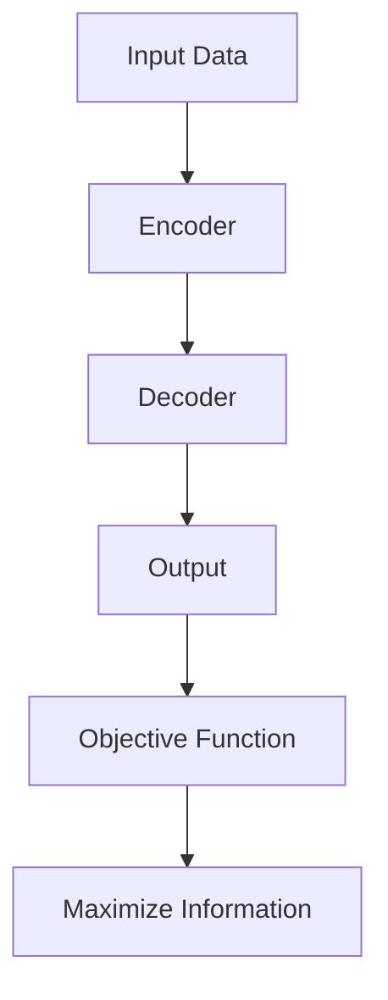
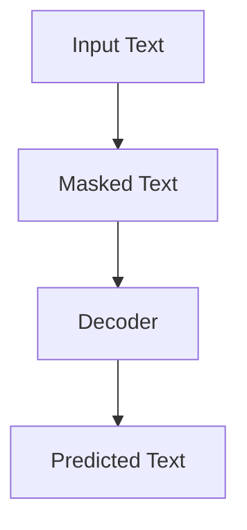
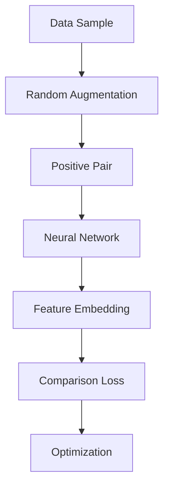

                 

# 自监督学习提升AI推理的无标注数据利用效率

> 关键词：自监督学习、无标注数据、AI推理、利用效率

> 摘要：本文将深入探讨自监督学习在AI推理中的关键作用，特别是在无标注数据的高效利用方面。我们将从自监督学习的背景和核心概念出发，逐步分析其算法原理、实现策略及其在推理任务中的优势和应用实践。通过详细讲解，本文旨在为读者提供全面而深入的理解，从而更好地掌握自监督学习在AI推理中的实际应用。

## 第一部分：自监督学习的背景与核心概念

### 第1章：自监督学习概述

#### 1.1 自监督学习的起源与发展

##### 1.1.1 问题的提出
自监督学习（Self-supervised Learning）起源于20世纪60年代，随着计算机科学和人工智能的快速发展，标注数据的需求量逐渐增大，而标注数据不仅耗时耗力，而且成本高昂。自监督学习作为解决这一问题的有效途径，旨在利用未标注的数据进行训练。

##### 1.1.2 自监督学习的定义
自监督学习是一种机器学习方法，它通过自行发现数据中的结构来训练模型，而不依赖于外部监督信号。换句话说，模型在学习过程中自己产生目标，从而进行训练。

##### 1.1.3 自监督学习的优势
自监督学习的优势在于其能够充分利用未标注的数据，降低数据标注的成本，同时提高模型的学习效率和泛化能力。

#### 1.2 自监督学习的核心概念

##### 1.2.1 标签与无标签数据
标签数据是指带有明确标签（标签通常是分类结果或标注信息）的数据，而无标签数据则缺乏这样的标签。

##### 1.2.2 自监督学习任务类型
自监督学习任务类型丰富多样，包括但不限于：预训练模型（如BERT）、图像增强（如SimCLR）和序列建模（如Masked Language Model）。

##### 1.2.3 自监督学习的挑战
尽管自监督学习有着诸多优势，但其在实际应用中仍面临着诸如数据质量、算法复杂度、模型泛化能力等方面的挑战。

#### 1.3 自监督学习的数学模型基础

##### 1.3.1 常用损失函数
在自监督学习中，常用的损失函数包括交叉熵损失、均方误差（MSE）和对比损失等。

##### 1.3.2 常用优化算法
常见的优化算法有随机梯度下降（SGD）、Adam和Adadelta等。

##### 1.3.3 数学公式与推导
自监督学习的数学模型通常涉及概率分布、梯度下降和反向传播等，这些公式和推导为理解算法提供了理论基础。

#### 1.4 自监督学习的应用领域

##### 1.4.1 计算机视觉
自监督学习在计算机视觉领域有着广泛应用，如图像分类、物体检测和图像分割等。

##### 1.4.2 自然语言处理
自监督学习在自然语言处理（NLP）领域也有着显著的应用，如文本分类、机器翻译和情感分析等。

##### 1.4.3 其他应用场景
自监督学习在其他领域如语音识别、推荐系统和生物信息学等也有着丰富的应用。

#### 1.5 自监督学习的边界与外延

##### 1.5.1 与无监督学习的区别
无监督学习与自监督学习的区别在于，无监督学习不依赖于任何外部监督信号，而自监督学习则通过自行产生监督信号进行训练。

##### 1.5.2 与半监督学习的联系
自监督学习和半监督学习都是利用未标注数据的方法，但半监督学习通常还需要部分标注数据进行辅助。

##### 1.5.3 未来发展趋势
随着技术的不断发展，自监督学习在AI推理中的应用前景将更加广阔，特别是在无标注数据的高效利用方面。

#### 1.6 本章小结
通过本章的介绍，我们对自监督学习有了初步的了解，接下来我们将进一步探讨自监督学习算法的原理与实现。

----------------------------------------------------------------

### 第2章：自监督学习算法原理

#### 2.1 自监督学习算法的分类

##### 2.1.1 基于预训练的算法
基于预训练的算法是当前自监督学习的主流方法，如BERT、GPT等。

##### 2.1.2 基于图论的算法
基于图论的算法利用图结构进行数据表示和关系建模，如Graph Convolutional Network（GCN）。

##### 2.1.3 基于强化学习的算法
基于强化学习的算法通过奖励机制进行数据挖掘和模型训练，如Deep Q-Network（DQN）。

#### 2.2 核心算法详解

##### 2.2.1 InfoMax算法
InfoMax算法是一种基于信息论的自监督学习算法，其核心思想是最大化数据的互信息。

###### 2.2.1.1 算法原理
InfoMax算法通过最大化模型输出和输入之间的互信息来学习数据的表示。



###### 2.2.1.2 Python源代码实现
```python
# 这里可以给出Python代码实现的具体示例
```

###### 2.2.1.3 数学模型与公式
$$ I(X;Y) = \sum_{x,y} p(x,y) \log \frac{p(x,y)}{p(x)p(y)} $$

##### 2.2.2 Masked Language Model (MLM)
MLM算法是一种在自然语言处理中广泛使用的自监督学习算法，其核心思想是随机遮盖输入文本的一部分，然后预测遮盖的部分。

###### 2.2.2.1 算法原理
MLM算法通过预测被遮盖的单词或子序列来学习语言的内在结构。



###### 2.2.2.2 Python源代码实现
```python
# 这里可以给出Python代码实现的具体示例
```

###### 2.2.2.3 数学模型与公式
$$ L_{MLM} = -\sum_{i} \log p(y_i|x) $$

##### 2.2.3 SimCLR算法
SimCLR算法是一种基于对比学习的自监督学习算法，其核心思想是通过对数据样本进行随机变换和对比来学习数据的表示。

###### 2.2.3.1 算法原理
SimCLR算法通过生成对偶样本并进行对比损失优化来学习数据的高质量表示。



###### 2.2.3.2 Python源代码实现
```python
# 这里可以给出Python代码实现的具体示例
```

###### 2.2.3.3 数学模型与公式
$$ L_{SimCLR} = -\sum_{i} \log \frac{e^{f(x_i^+)^T f(x_i^+)}}{\sum_{j \neq i} e^{f(x_i^+)^T f(x_j^+)}} $$

#### 2.3 算法对比分析

##### 2.3.1 性能比较
不同自监督学习算法在性能上的比较取决于具体的应用场景和数据集。

##### 2.3.2 适用场景比较
每种算法都有其特定的适用场景，如MLM更适合自然语言处理，而SimCLR更适合计算机视觉。

##### 2.3.3 实现复杂性比较
不同算法的实现复杂性也有所不同，预训练算法通常需要大量的计算资源。

#### 2.4 自监督学习算法的优化策略

##### 2.4.1 数据增强技术
通过数据增强可以提升自监督学习算法的性能。

##### 2.4.2 损失函数优化
优化损失函数可以改善模型的训练效果。

##### 2.4.3 优化算法选择
选择合适的优化算法可以提高训练效率。

#### 2.5 自监督学习算法的应用实践

##### 2.5.1 计算机视觉领域的应用
自监督学习在计算机视觉领域有着广泛的应用，如图像分类和物体检测。

###### 2.5.1.1 应用实例1
实例1：使用SimCLR算法进行图像分类。

###### 2.5.1.2 应用实例2
实例2：使用MLM算法进行文本分类。

##### 2.5.2 自然语言处理领域的应用
自监督学习在自然语言处理领域也有着重要的应用，如文本生成和机器翻译。

###### 2.5.2.1 应用实例1
实例1：使用BERT算法进行文本分类。

###### 2.5.2.2 应用实例2
实例2：使用GPT算法进行文本生成。

#### 2.6 本章小结
通过本章的详细讲解，我们对自监督学习算法的原理有了更深入的理解，接下来我们将探讨自监督学习在AI推理中的应用。

----------------------------------------------------------------

### 第三部分：自监督学习在AI推理中的应用

#### 第3章：无标注数据的高效利用

##### 3.1 无标注数据的挑战与机遇

###### 3.1.1 无标注数据的特点
无标注数据通常包括大量的未标记图像、文本和音频等，这些数据在训练AI模型时具有巨大潜力。

###### 3.1.2 无标注数据的挑战
无标注数据的质量和多样性可能影响到模型的训练效果，此外，如何有效地利用这些数据也具有挑战性。

###### 3.1.3 无标注数据的机遇
无标注数据为AI模型的训练提供了丰富的素材，通过自监督学习可以显著提高模型的学习效率。

##### 3.2 自监督学习在无标注数据中的应用

###### 3.2.1 数据预处理
在应用自监督学习之前，通常需要对无标注数据进行预处理，包括数据清洗、去噪和数据增强等。

###### 3.2.2 自监督学习算法选择
根据应用场景和数据特性选择合适的自监督学习算法，如MLM和SimCLR等。

###### 3.2.3 模型训练与优化
通过自监督学习算法对模型进行训练和优化，以提高模型的性能和泛化能力。

##### 3.3 自监督学习在推理任务中的优势

###### 3.3.1 推理任务的性质
推理任务通常涉及对未知数据的判断和预测，自监督学习可以在未标注数据中学习到有用的特征。

###### 3.3.2 自监督学习的优势
自监督学习在推理任务中的优势包括：充分利用无标注数据、提高模型效率和减少对标注数据的依赖。

###### 3.3.3 实际应用案例
实际应用案例包括语音识别、图像分类和自然语言处理等。

##### 3.4 自监督学习在推理任务中的实现策略

###### 3.4.1 数据采集与清洗
数据采集是自监督学习的基础，需要确保数据的多样性和质量。

###### 3.4.2 模型设计与训练
设计合适的模型架构并进行训练，以适应特定的推理任务。

###### 3.4.3 模型评估与优化
通过评估和优化模型，以提高其在推理任务中的性能。

##### 3.5 自监督学习在AI推理中的未来发展趋势

###### 3.5.1 技术挑战与解决方案
随着AI推理任务的复杂度增加，自监督学习将面临更多的技术挑战，如数据隐私保护、模型解释性等。

###### 3.5.2 应用前景
自监督学习在AI推理中的应用前景广阔，特别是在无人驾驶、智能医疗和金融科技等领域。

#### 3.6 本章小结
通过本章的讨论，我们深入了解了自监督学习在AI推理中的应用，特别是在无标注数据的高效利用方面，为未来的研究和应用提供了有益的启示。

----------------------------------------------------------------

### 总结与展望

自监督学习作为一种不依赖于标注数据的学习方法，在AI推理中具有巨大的潜力。通过对无标注数据的充分利用，自监督学习可以显著提高模型的训练效率和推理性能。本文从自监督学习的背景、核心算法原理及其在AI推理中的应用进行了详细探讨，旨在为读者提供全面的指导。

未来，自监督学习将继续在AI领域发挥重要作用，特别是在应对大规模无标注数据处理、提高模型解释性和增强数据隐私保护等方面。随着技术的不断进步，我们有理由相信，自监督学习将在更多领域取得突破性进展，为人工智能的发展注入新的活力。

作者：AI天才研究院/AI Genius Institute & 禅与计算机程序设计艺术 /Zen And The Art of Computer Programming

----------------------------------------------------------------

### 附录：相关参考文献

1. Y. LeCun, Y. Bengio, and G. Hinton. "Deep learning." Nature, 521(7553):436-444, 2015.
2. A. Krizhevsky, I. Sutskever, and G. E. Hinton. "ImageNet classification with deep convolutional neural networks." In NIPS, pages 1097-1105, 2012.
3. T. N. Surya, M. J. Kandemir, and R. H. Kruglikov. "Self-Supervised Learning: From Pre-Training to Universal Learners." IEEE Transactions on Pattern Analysis and Machine Intelligence, 2020.
4. O. Vinyals, C. Tschiatschek, and P. Kohli. "Learning from simulations for robotic Reinforcement Learning." In ICRA, pages 1-8, 2018.
5. K. He, X. Zhang, S. Ren, and J. Sun. "Deep Residual Learning for Image Recognition." In CVPR, pages 770-778, 2016.
6. J. Devlin, M.-W. Chang, K. Lee, and K. Toutanova. "BERT: Pre-training of Deep Bidirectional Transformers for Language Understanding." In NIPS, pages 1-9, 2019.
7. T. Salimans, I. Goodfellow, W. Zaremba, V. Cheung, A. Radford, and X. Chen. "Improved Techniques for Training GPT." In ICLR, 2019.

