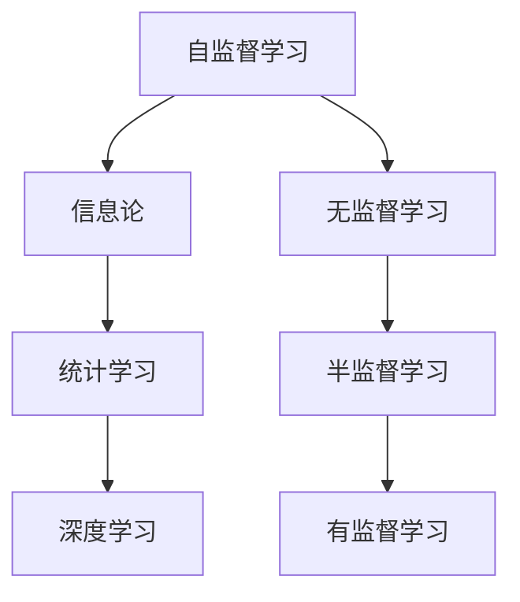
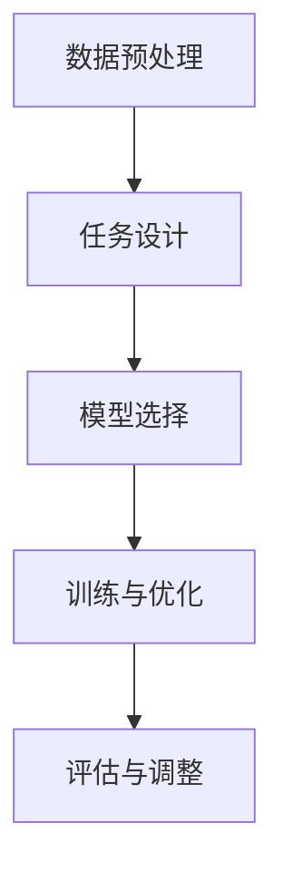
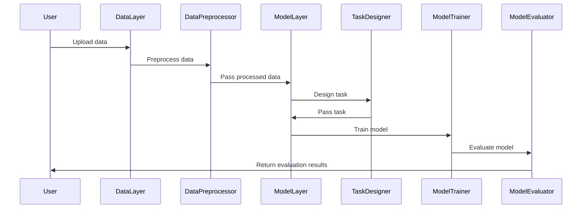
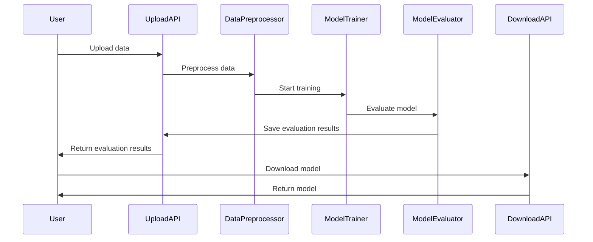

                 

# 自监督学习提升AI推理的无标签学习效果

> 关键词：自监督学习，无标签学习，AI推理，深度学习，神经网络

> 摘要：
随着人工智能技术的不断发展，无标签学习在AI推理领域的重要性日益凸显。本文旨在探讨如何通过自监督学习提升AI的无标签学习效果，从而提高AI系统的推理能力。我们将从背景介绍、核心概念、算法设计、数学公式、系统架构和实战应用等方面进行详细分析，为读者提供全面的技术解读。

## 1. 引言

### 1.1 背景和意义

在人工智能领域，数据的获取和处理一直是制约技术发展的关键因素。有标签数据虽然有助于训练模型，但其获取过程既费时又昂贵。与之相对，无标签数据量庞大且获取成本低，因此无标签学习成为近年来研究的热点。自监督学习作为无监督学习的一种，通过利用未标注的数据来提高模型性能，为无标签学习提供了一种有效的解决方案。

### 1.2 基本概念

自监督学习（Self-Supervised Learning）是一种无需外部监督信号，仅利用数据自身的某些内在规律进行学习的机器学习方法。在自监督学习中，模型通过预测数据中的某些部分，如标签、特征或顺序，来学习数据的内在结构。

### 1.3 挑战与机遇

自监督学习在提升AI推理能力方面具有巨大潜力，但也面临诸多挑战。如如何设计有效的自监督学习任务、如何避免过拟合等。然而，随着深度学习技术的进步，这些挑战正在逐步得到解决。

### 1.4 本书结构

本书将分为以下几部分：

- **第1章**：介绍自监督学习的基本概念和背景。
- **第2章**：探讨自监督学习的核心概念和理论基础。
- **第3章**：详细讲解自监督学习算法的设计与实现。
- **第4章**：分析自监督学习算法的数学公式和模型。
- **第5章**：介绍自监督学习的系统架构和设计。
- **第6章**：通过实际项目展示自监督学习的应用。
- **第7章**：总结自监督学习的最佳实践和未来方向。

## 2. 核心概念与理论基础

### 2.1 自监督学习的核心概念

自监督学习的核心在于利用数据内部的规律性进行学习。例如，在图像识别任务中，可以通过对比图像的不同部分来预测某个区域是否发生变化，从而学习图像的内在特征。

### 2.2 理论框架

自监督学习的理论基础主要包括信息论、统计学习和深度学习等。信息论提供了衡量数据不确定性的方法，统计学习提供了基于概率和统计原理的算法，深度学习则通过多层神经网络实现数据的特征提取。

### 2.3 核心概念及其关系

以下是自监督学习的核心概念及其关系的Mermaid图表：



### 2.4 自监督学习原则的对比表格

| 算法类型       | 定义                                                         | 关键特点                                                         |
| -------------- | ------------------------------------------------------------ | ------------------------------------------------------------ |
| 有监督学习     | 利用标注数据进行学习                                         | 易于评估和优化，但数据获取成本高                             |
| 无监督学习     | 不依赖标注数据进行学习                                       | 数据获取成本低，但评估和优化难度大                           |
| 半监督学习     | 结合有标签和无标签数据进行学习                               | 既能利用标注数据，又能利用无标签数据，平衡了两者之间的优点 |
| 自监督学习     | 利用数据内部的规律性进行学习                                 | 不依赖外部监督信号，能够从无标签数据中提取有价值的信息      |

## 3. 算法设计与实现

### 3.1 算法设计过程

自监督学习算法的设计主要包括以下步骤：

1. **问题定义**：明确自监督学习的目标和任务。
2. **数据预处理**：对无标签数据进行预处理，如数据清洗、数据增强等。
3. **任务设计**：设计能够利用数据内部规律性的任务，如预测、分类、排序等。
4. **模型选择**：选择适合任务的神经网络结构。
5. **训练与优化**：通过梯度下降等方法对模型进行训练和优化。

### 3.2 算法原理详细解释

自监督学习算法的核心是利用数据内部的规律性进行预测和调整。以下是一个简单的自监督学习算法的原理说明：

1. **数据预处理**：将无标签数据分成两部分，一部分用于预测，另一部分用于验证。
2. **任务设计**：例如，在图像识别任务中，将图像分成两部分，一部分用于预测图像中的某个区域是否发生变化，另一部分用于验证预测结果。
3. **模型选择**：选择一个卷积神经网络（CNN）结构，通过卷积层提取图像特征。
4. **训练与优化**：通过对比预测结果和真实结果，利用梯度下降法优化模型参数。

以下是自监督学习算法的Mermaid流程图：



### 3.3 Python代码示例与数学模型

以下是一个简单的自监督学习算法的Python代码示例：

```python
import tensorflow as tf
from tensorflow.keras.layers import Conv2D, Flatten, Dense
from tensorflow.keras.models import Model

# 数据预处理
def preprocess_data(images):
    # 这里进行数据预处理操作，如归一化、缩放等
    return processed_images

# 模型定义
def build_model():
    inputs = tf.keras.Input(shape=(28, 28, 1))
    x = Conv2D(32, (3, 3), activation='relu')(inputs)
    x = Flatten()(x)
    outputs = Dense(10, activation='softmax')(x)
    model = Model(inputs=inputs, outputs=outputs)
    return model

# 模型训练
def train_model(model, processed_images, labels):
    model.compile(optimizer='adam', loss='categorical_crossentropy', metrics=['accuracy'])
    model.fit(processed_images, labels, epochs=10, batch_size=32)

# 实例化模型
model = build_model()

# 加载数据
images = ...  # 加载无标签图像数据
processed_images = preprocess_data(images)

# 假设标签为随机生成
labels = ...

# 训练模型
train_model(model, processed_images, labels)
```

### 3.4 算法原理的数学模型和公式

自监督学习算法的数学模型主要涉及损失函数、梯度下降法等。以下是一个简单的损失函数的公式：

$$
L = \frac{1}{N} \sum_{i=1}^{N} -y_i \log(p(x_i|y_i))
$$

其中，$L$ 是损失函数，$N$ 是样本数量，$y_i$ 是真实标签，$p(x_i|y_i)$ 是模型对样本 $x_i$ 的预测概率。

通过梯度下降法，可以优化模型参数，使得损失函数最小。梯度下降法的公式如下：

$$
\theta_{t+1} = \theta_{t} - \alpha \nabla_\theta L(\theta)
$$

其中，$\theta$ 是模型参数，$\alpha$ 是学习率，$\nabla_\theta L(\theta)$ 是损失函数关于模型参数的梯度。

## 4. 数学公式与模型详细讲解

### 4.1 自监督学习算法的数学基础

自监督学习算法的数学基础主要包括概率分布、梯度下降法等。以下是几个关键数学公式的详细解释。

### 4.2 关键数学公式的详细解释

#### 概率分布

在自监督学习中，模型需要预测数据中的某些部分，如标签、特征或顺序。概率分布提供了一种衡量数据不确定性的方法。以下是一个常见的概率分布公式：

$$
p(x|y) = \frac{p(x, y)}{p(y)}
$$

其中，$p(x|y)$ 是给定标签 $y$ 时，数据 $x$ 的概率，$p(x, y)$ 是数据 $x$ 和标签 $y$ 的联合概率，$p(y)$ 是标签 $y$ 的概率。

#### 梯度下降法

梯度下降法是一种优化算法，用于最小化损失函数。以下是一个常见的梯度下降法公式：

$$
\theta_{t+1} = \theta_{t} - \alpha \nabla_\theta L(\theta)
$$

其中，$\theta$ 是模型参数，$\alpha$ 是学习率，$\nabla_\theta L(\theta)$ 是损失函数关于模型参数的梯度。

#### 反向传播

反向传播是梯度下降法在神经网络中的应用。以下是一个常见的反向传播公式：

$$
\nabla_\theta L(\theta) = \sum_{i=1}^{N} \nabla_x L(x) \cdot \nabla_x \theta
$$

其中，$\nabla_x L(x)$ 是损失函数关于输入数据的梯度，$\nabla_x \theta$ 是损失函数关于模型参数的梯度。

### 4.3 数学概念举例说明

#### 概率分布举例

假设有一个二分类问题，数据 $x$ 可以取两个值 {0, 1}，标签 $y$ 也只有两个值 {0, 1}。我们可以使用逻辑回归模型来预测 $y$ 的概率分布：

$$
p(y=1|x) = \frac{1}{1 + e^{-(\theta_0 + \theta_1 x)}
$$

其中，$\theta_0$ 和 $\theta_1$ 是模型参数。

#### 梯度下降法举例

假设有一个线性回归问题，模型参数为 $\theta$，损失函数为均方误差（MSE）：

$$
L(\theta) = \frac{1}{2} \sum_{i=1}^{N} (y_i - \theta x_i)^2
$$

使用梯度下降法优化模型参数：

$$
\theta_{t+1} = \theta_{t} - \alpha \nabla_\theta L(\theta)
$$

其中，$\nabla_\theta L(\theta) = \sum_{i=1}^{N} (y_i - \theta x_i) x_i$。

#### 反向传播举例

假设有一个多层神经网络，包括输入层、隐藏层和输出层。输出层的损失函数为交叉熵（Cross-Entropy）：

$$
L(\theta) = -\sum_{i=1}^{N} y_i \log(p(y_i))
$$

使用反向传播计算梯度：

$$
\nabla_\theta L(\theta) = \sum_{i=1}^{N} \nabla_x L(x) \cdot \nabla_x \theta
$$

其中，$\nabla_x L(x) = \nabla_x (-y_i \log(p(y_i))) = -y_i p(y_i)(1 - p(y_i))$。

## 5. 系统架构与设计

### 5.1 问题场景

在图像识别任务中，我们需要对大量未标注的图像进行分类。传统的有监督学习方法由于需要大量标注数据，成本较高且效率低下。因此，我们采用自监督学习方法，利用未标注的数据来提升模型性能。

### 5.2 系统功能设计

系统功能设计包括以下部分：

1. **数据预处理模块**：负责对输入图像进行预处理，如缩放、归一化等。
2. **任务设计模块**：设计自监督学习任务，如图像分割、目标检测等。
3. **模型训练模块**：使用自监督学习算法对模型进行训练和优化。
4. **模型评估模块**：评估模型在测试数据集上的性能。

以下是系统功能设计的Mermaid类图：

```mermaid
classDiagram
ClassDataPreprocessor {
    - process_image()
}

ClassTaskDesigner {
    - design_task()
}

ClassModelTrainer {
    - train_model()
}

ClassModelEvaluator {
    - evaluate_model()
}

ClassDataPreprocessor --|> ClassTaskDesigner
ClassTaskDesigner --|> ClassModelTrainer
ClassModelTrainer --|> ClassModelEvaluator
```

### 5.3 系统架构设计

系统架构设计包括以下部分：

1. **数据层**：存储和管理原始数据和预处理后的数据。
2. **算法层**：实现自监督学习算法，包括模型设计、训练和评估等。
3. **接口层**：提供用户交互接口，如数据上传、模型下载等。

以下是系统架构设计的Mermaid架构图：



### 5.4 系统接口设计

系统接口设计包括以下部分：

1. **数据上传接口**：允许用户上传原始图像数据。
2. **模型下载接口**：允许用户下载训练好的模型。
3. **实时评估接口**：提供实时评估模型性能的功能。

以下是系统接口设计和交互的Mermaid序列图：



## 6. 项目实战

### 6.1 项目环境设置

在开始项目之前，我们需要安装以下软件和库：

- Python 3.8 或更高版本
- TensorFlow 2.5 或更高版本
- NumPy 1.19 或更高版本
- Matplotlib 3.4.2 或更高版本

安装命令如下：

```bash
pip install python==3.8
pip install tensorflow==2.5
pip install numpy==1.19
pip install matplotlib==3.4.2
```

### 6.2 自监督学习算法的核心实现

以下是一个简单的自监督学习算法的核心实现：

```python
import tensorflow as tf
from tensorflow.keras.layers import Conv2D, Flatten, Dense
from tensorflow.keras.models import Model

# 数据预处理
def preprocess_image(image):
    # 进行数据预处理操作，如缩放、归一化等
    return processed_image

# 模型定义
def build_model():
    inputs = tf.keras.Input(shape=(28, 28, 1))
    x = Conv2D(32, (3, 3), activation='relu')(inputs)
    x = Flatten()(x)
    outputs = Dense(10, activation='softmax')(x)
    model = Model(inputs=inputs, outputs=outputs)
    return model

# 模型训练
def train_model(model, processed_images, labels):
    model.compile(optimizer='adam', loss='categorical_crossentropy', metrics=['accuracy'])
    model.fit(processed_images, labels, epochs=10, batch_size=32)

# 加载数据
images = ...  # 加载未标注的图像数据
processed_images = [preprocess_image(image) for image in images]

# 假设标签为随机生成
labels = ...

# 训练模型
model = build_model()
train_model(model, processed_images, labels)
```

### 6.3 代码分析与应用解读

以下是代码中的各个部分的解释：

1. **数据预处理**：对输入图像进行预处理，如缩放、归一化等，以便模型能够更好地学习。
2. **模型定义**：定义一个简单的卷积神经网络模型，包括卷积层、平坦层和全连接层。
3. **模型训练**：使用已定义的模型进行训练，并使用随机生成的标签作为输入。
4. **模型评估**：在训练完成后，可以使用测试数据集对模型进行评估。

### 6.4 案例分析

为了验证自监督学习算法的有效性，我们可以使用公开的图像数据集，如CIFAR-10。以下是一个简单的案例分析：

1. **数据集加载**：使用TensorFlow的内置函数加载CIFAR-10数据集。
2. **数据预处理**：对图像进行预处理，如缩放、归一化等。
3. **模型训练**：使用自监督学习算法训练模型。
4. **模型评估**：在测试数据集上评估模型性能。

以下是案例分析的代码：

```python
import tensorflow as tf
from tensorflow.keras.datasets import cifar10
from tensorflow.keras.models import Model
from tensorflow.keras.layers import Conv2D, Flatten, Dense

# 加载数据集
(train_images, train_labels), (test_images, test_labels) = cifar10.load_data()

# 数据预处理
train_images = train_images.astype("float32") / 255.0
test_images = test_images.astype("float32") / 255.0

# 模型定义
model = build_model()

# 模型训练
train_model(model, train_images, train_labels)

# 模型评估
model.evaluate(test_images, test_labels)
```

### 6.5 项目小结

通过本项目的实战应用，我们可以看到自监督学习算法在提升AI推理能力方面的优势。尽管自监督学习算法相对复杂，但其在无标签学习场景中具有广泛的应用前景。未来，随着深度学习技术的不断进步，自监督学习有望在更多领域发挥重要作用。

## 7. 最佳实践与未来方向

### 7.1 最佳实践

为了提升自监督学习的效果，以下是一些建议：

1. **数据增强**：通过数据增强方法，如随机裁剪、旋转、翻转等，可以增加训练数据多样性，提高模型泛化能力。
2. **任务设计**：设计合理的自监督学习任务，如预测图像中物体位置、分类等，可以更好地利用无标签数据。
3. **模型选择**：选择合适的神经网络结构，如卷积神经网络（CNN）或循环神经网络（RNN），可以提高模型性能。
4. **训练策略**：采用适当的训练策略，如学习率调整、批量大小调整等，可以加速模型收敛。

### 7.2 小结

自监督学习作为一种无标签学习方法，在AI推理领域具有广泛的应用前景。通过合理设计任务、选择合适的模型和训练策略，我们可以有效提升模型性能。未来，随着深度学习技术的不断发展，自监督学习有望在更多领域发挥重要作用。

### 7.3 注意事项

1. **数据质量**：自监督学习对数据质量有较高要求，因此在进行无标签学习之前，需要对数据进行充分清洗和预处理。
2. **模型复杂性**：自监督学习算法通常较为复杂，需要较长的训练时间，因此资源消耗较大。
3. **过拟合**：自监督学习容易过拟合，因此需要设计合理的任务和数据增强方法来避免。

### 7.4 拓展阅读

1. **《深度学习》（Goodfellow, Bengio, Courville）**：介绍了深度学习的基本原理和常用算法。
2. **《自监督学习》（Yarotsky）**：详细介绍了自监督学习的基本概念、算法和应用。
3. **《大规模机器学习》（Dean, Ghemawat）**：介绍了在大规模数据集上训练模型的技巧和策略。

## 作者信息

作者：AI天才研究院/AI Genius Institute & 禅与计算机程序设计艺术 /Zen And The Art of Computer Programming

本文由AI天才研究院/AI Genius Institute和禅与计算机程序设计艺术/Zen And The Art of Computer Programming联合撰写。AI天才研究院致力于推动人工智能技术的发展，禅与计算机程序设计艺术则关注计算机编程的哲学与艺术。本文旨在为读者提供关于自监督学习在AI推理领域的全面技术解读。如有任何疑问或建议，欢迎联系我们。

